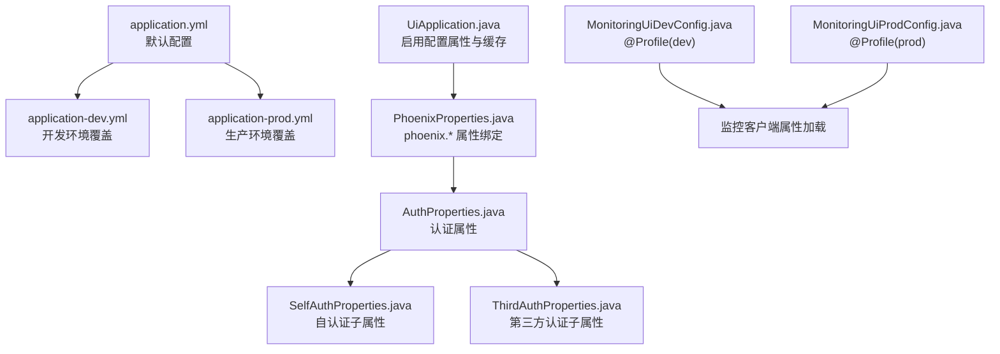
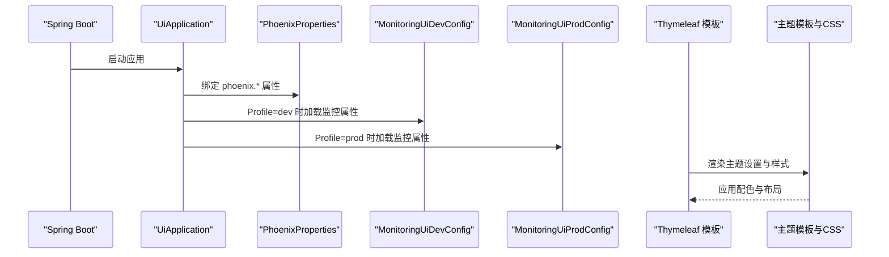
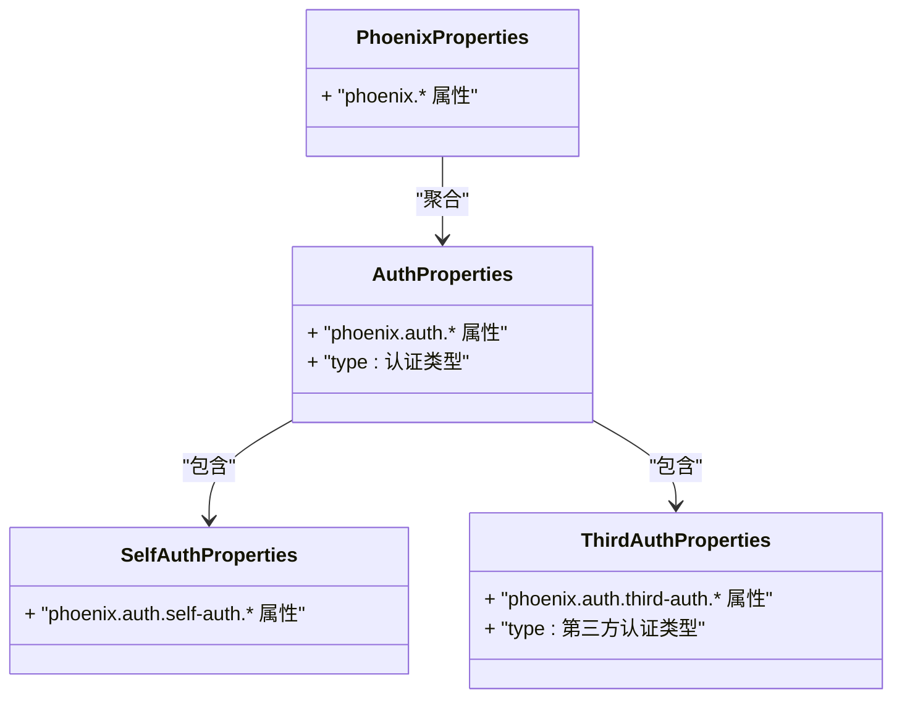
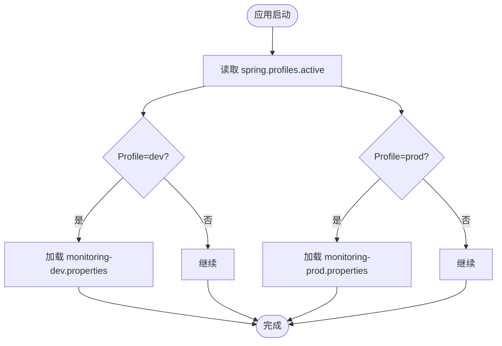
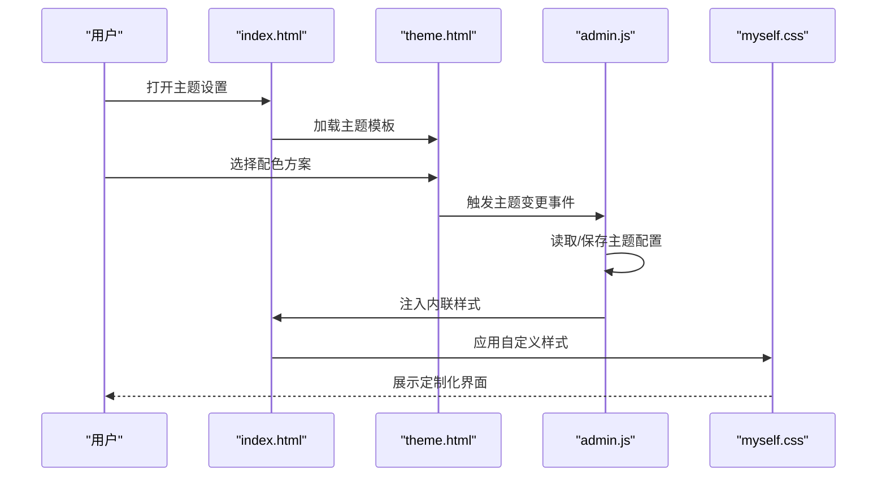
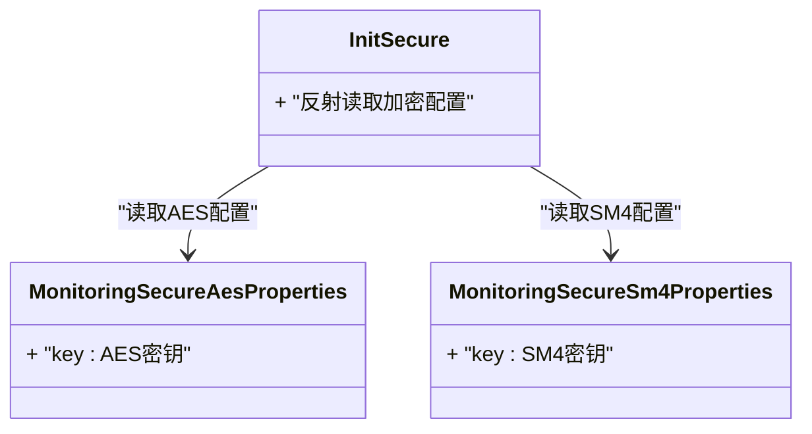
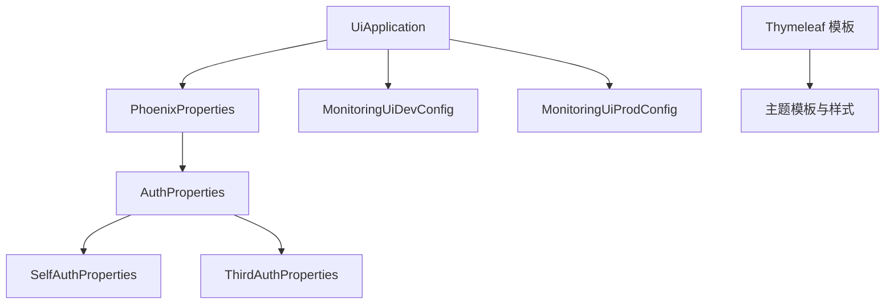

# 配置管理与主题定制

<cite>
**本文引用的文件**
- [application.yml](file://phoenix-ui/src/main/resources/application.yml)
- [application-dev.yml](file://phoenix-ui/src/main/resources/application-dev.yml)
- [application-prod.yml](file://phoenix-ui/src/main/resources/application-prod.yml)
- [PhoenixProperties.java](file://phoenix-ui/src/main/java/com/gitee/pifeng/monitoring/ui/property/PhoenixProperties.java)
- [AuthProperties.java](file://phoenix-ui/src/main/java/com/gitee/pifeng/monitoring/ui/property/auth/AuthProperties.java)
- [SelfAuthProperties.java](file://phoenix-ui/src/main/java/com/gitee/pifeng/monitoring/ui/property/auth/selfauth/SelfAuthProperties.java)
- [ThirdAuthProperties.java](file://phoenix-ui/src/main/java/com/gitee/pifeng/monitoring/ui/property/auth/thirdauth/ThirdAuthProperties.java)
- [MonitoringUiDevConfig.java](file://phoenix-ui/src/main/java/com/gitee/pifeng/monitoring/ui/config/phoenix/MonitoringUiDevConfig.java)
- [MonitoringUiProdConfig.java](file://phoenix-ui/src/main/java/com/gitee/pifeng/monitoring/ui/config/phoenix/MonitoringUiProdConfig.java)
- [UiApplication.java](file://phoenix-ui/src/main/java/com/gitee/pifeng/monitoring/ui/UiApplication.java)
- [myself.css](file://phoenix-ui/src/main/resources/static/style/myself.css)
- [theme.html](file://phoenix-ui/src/main/resources/static/tpl/system/theme.html)
- [admin.js](file://phoenix-ui/src/main/resources/static/lib/admin.js)
- [index.html](file://phoenix-ui/src/main/resources/templates/index.html)
- [MonitoringSecureAesProperties.java](file://phoenix-common/phoenix-common-core/src/main/java/com/gitee/pifeng/monitoring/common/property/client/MonitoringSecureAesProperties.java)
- [MonitoringSecureSm4Properties.java](file://phoenix-common/phoenix-common-core/src/main/java/com/gitee/pifeng/monitoring/common/property/client/MonitoringSecureSm4Properties.java)
- [InitSecure.java](file://phoenix-common/phoenix-common-core/src/main/java/com/gitee/pifeng/monitoring/common/init/InitSecure.java)
</cite>

## 目录
1. [简介](#简介)
2. [项目结构](#项目结构)
3. [核心组件](#核心组件)
4. [架构总览](#架构总览)
5. [详细组件分析](#详细组件分析)
6. [依赖分析](#依赖分析)
7. [性能考量](#性能考量)
8. [故障排查指南](#故障排查指南)
9. [结论](#结论)
10. [附录](#附录)

## 简介
本文件面向Phoenix UI端的配置管理与主题定制，系统性阐述Spring Boot配置文件的组织与优先级、PhoenixProperties配置类的设计与扩展方式、UI主题与样式的可定制能力，以及配置管理的最佳实践（含敏感信息保护与热更新思路）。读者无需深入代码即可理解如何在不同环境中正确配置与定制Phoenix UI。

## 项目结构
Phoenix UI采用标准的Spring Boot多环境配置模式，主配置文件位于resources根目录，按环境拆分application-{profile}.yml，配合基于注解的属性绑定与条件配置类实现环境差异化行为。

**图表来源**
- [application.yml:1-238](file://phoenix-ui/src/main/resources/application.yml#L1-L238)
- [application-dev.yml:1-49](file://phoenix-ui/src/main/resources/application-dev.yml#L1-L49)
- [application-prod.yml:1-39](file://phoenix-ui/src/main/resources/application-prod.yml#L1-L39)
- [PhoenixProperties.java:1-21](file://phoenix-ui/src/main/java/com/gitee/pifeng/monitoring/ui/property/PhoenixProperties.java#L1-L21)
- [AuthProperties.java:1-27](file://phoenix-ui/src/main/java/com/gitee/pifeng/monitoring/ui/property/auth/AuthProperties.java#L1-L27)
- [SelfAuthProperties.java:1-20](file://phoenix-ui/src/main/java/com/gitee/pifeng/monitoring/ui/property/auth/selfauth/SelfAuthProperties.java#L1-L20)
- [ThirdAuthProperties.java:1-27](file://phoenix-ui/src/main/java/com/gitee/pifeng/monitoring/ui/property/auth/thirdauth/ThirdAuthProperties.java#L1-L27)
- [UiApplication.java:1-49](file://phoenix-ui/src/main/java/com/gitee/pifeng/monitoring/ui/UiApplication.java#L1-L49)
- [MonitoringUiDevConfig.java:1-38](file://phoenix-ui/src/main/java/com/gitee/pifeng/monitoring/ui/config/phoenix/MonitoringUiDevConfig.java#L1-L38)
- [MonitoringUiProdConfig.java:1-38](file://phoenix-ui/src/main/java/com/gitee/pifeng/monitoring/ui/config/phoenix/MonitoringUiProdConfig.java#L1-L38)

**章节来源**
- [application.yml:1-238](file://phoenix-ui/src/main/resources/application.yml#L1-L238)
- [application-dev.yml:1-49](file://phoenix-ui/src/main/resources/application-dev.yml#L1-L49)
- [application-prod.yml:1-39](file://phoenix-ui/src/main/resources/application-prod.yml#L1-L39)
- [UiApplication.java:1-49](file://phoenix-ui/src/main/java/com/gitee/pifeng/monitoring/ui/UiApplication.java#L1-L49)

## 核心组件
- 默认配置与环境覆盖
  - application.yml提供默认配置，包含服务器、日志、缓存、数据源、MyBatis-Plus、管理端点、接口文档等基础能力。
  - application-dev.yml与application-prod.yml分别覆盖开发与生产环境的端口、数据源、模板缓存与认证策略等。
- 配置属性绑定
  - PhoenixProperties作为phoenix.* 前缀的顶层属性类，聚合认证等子模块属性。
  - 认证属性体系以AuthProperties为核心，向下拆分自认证与第三方认证子属性，便于按需启用与扩展。
- 条件配置
  - MonitoringUiDevConfig与MonitoringUiProdConfig分别在dev/prod Profile下注入监控客户端属性，实现环境差异化监控配置。

**章节来源**
- [application.yml:1-238](file://phoenix-ui/src/main/resources/application.yml#L1-L238)
- [application-dev.yml:1-49](file://phoenix-ui/src/main/resources/application-dev.yml#L1-L49)
- [application-prod.yml:1-39](file://phoenix-ui/src/main/resources/application-prod.yml#L1-L39)
- [PhoenixProperties.java:1-21](file://phoenix-ui/src/main/java/com/gitee/pifeng/monitoring/ui/property/PhoenixProperties.java#L1-L21)
- [AuthProperties.java:1-27](file://phoenix-ui/src/main/java/com/gitee/pifeng/monitoring/ui/property/auth/AuthProperties.java#L1-L27)
- [SelfAuthProperties.java:1-20](file://phoenix-ui/src/main/java/com/gitee/pifeng/monitoring/ui/property/auth/selfauth/SelfAuthProperties.java#L1-L20)
- [ThirdAuthProperties.java:1-27](file://phoenix-ui/src/main/java/com/gitee/pifeng/monitoring/ui/property/auth/thirdauth/ThirdAuthProperties.java#L1-L27)
- [MonitoringUiDevConfig.java:1-38](file://phoenix-ui/src/main/java/com/gitee/pifeng/monitoring/ui/config/phoenix/MonitoringUiDevConfig.java#L1-L38)
- [MonitoringUiProdConfig.java:1-38](file://phoenix-ui/src/main/java/com/gitee/pifeng/monitoring/ui/config/phoenix/MonitoringUiProdConfig.java#L1-L38)

## 架构总览
下图展示UI端配置加载与主题渲染的关键交互：

**图表来源**
- [UiApplication.java:1-49](file://phoenix-ui/src/main/java/com/gitee/pifeng/monitoring/ui/UiApplication.java#L1-L49)
- [PhoenixProperties.java:1-21](file://phoenix-ui/src/main/java/com/gitee/pifeng/monitoring/ui/property/PhoenixProperties.java#L1-L21)
- [MonitoringUiDevConfig.java:1-38](file://phoenix-ui/src/main/java/com/gitee/pifeng/monitoring/ui/config/phoenix/MonitoringUiDevConfig.java#L1-L38)
- [MonitoringUiProdConfig.java:1-38](file://phoenix-ui/src/main/java/com/gitee/pifeng/monitoring/ui/config/phoenix/MonitoringUiProdConfig.java#L1-L38)
- [index.html:1-318](file://phoenix-ui/src/main/resources/templates/index.html#L1-L318)
- [theme.html:1-43](file://phoenix-ui/src/main/resources/static/tpl/system/theme.html#L1-L43)
- [myself.css:1-223](file://phoenix-ui/src/main/resources/static/style/myself.css#L1-L223)

## 详细组件分析

### 配置文件与优先级
- 配置层次
  - 默认配置：application.yml
  - 环境特定配置：application-{profile}.yml
  - 运行时配置：命令行参数、环境变量、配置服务器等（Spring Boot通用机制）
- 覆盖规则
  - Profile激活后，application-{profile}.yml中的同名键覆盖application.yml中的对应键。
  - 未显式激活Profile时，以application.yml为准；通过spring.profiles.active切换至dev或prod。
- 关键覆盖点
  - 服务器端口与SSL、数据源URL/凭据、模板缓存策略、认证类型与CAS参数等均在环境配置中独立管理。

**章节来源**
- [application.yml:1-238](file://phoenix-ui/src/main/resources/application.yml#L1-L238)
- [application-dev.yml:1-49](file://phoenix-ui/src/main/resources/application-dev.yml#L1-L49)
- [application-prod.yml:1-39](file://phoenix-ui/src/main/resources/application-prod.yml#L1-L39)

### PhoenixProperties配置类设计
PhoenixProperties作为顶层属性容器，统一承载phoenix.* 命名空间下的配置，具备以下特点：
- 使用@ConfigurationProperties(prefix = "phoenix")进行属性绑定
- 通过@EnableConfigurationProperties聚合子模块属性类，形成认证、安全等子域的组合
- 与UiApplication结合，确保在启动阶段完成属性装载与校验

**图表来源**
- [PhoenixProperties.java:1-21](file://phoenix-ui/src/main/java/com/gitee/pifeng/monitoring/ui/property/PhoenixProperties.java#L1-L21)
- [AuthProperties.java:1-27](file://phoenix-ui/src/main/java/com/gitee/pifeng/monitoring/ui/property/auth/AuthProperties.java#L1-L27)
- [SelfAuthProperties.java:1-20](file://phoenix-ui/src/main/java/com/gitee/pifeng/monitoring/ui/property/auth/selfauth/SelfAuthProperties.java#L1-L20)
- [ThirdAuthProperties.java:1-27](file://phoenix-ui/src/main/java/com/gitee/pifeng/monitoring/ui/property/auth/thirdauth/ThirdAuthProperties.java#L1-L27)

**章节来源**
- [PhoenixProperties.java:1-21](file://phoenix-ui/src/main/java/com/gitee/pifeng/monitoring/ui/property/PhoenixProperties.java#L1-L21)
- [AuthProperties.java:1-27](file://phoenix-ui/src/main/java/com/gitee/pifeng/monitoring/ui/property/auth/AuthProperties.java#L1-L27)
- [SelfAuthProperties.java:1-20](file://phoenix-ui/src/main/java/com/gitee/pifeng/monitoring/ui/property/auth/selfauth/SelfAuthProperties.java#L1-L20)
- [ThirdAuthProperties.java:1-27](file://phoenix-ui/src/main/java/com/gitee/pifeng/monitoring/ui/property/auth/thirdauth/ThirdAuthProperties.java#L1-L27)

### 监控与环境配置（条件Bean）
- 开发环境配置
  - MonitoringUiDevConfig在dev Profile下注入MonitoringProperties，加载monitoring-dev.properties，便于开发调试阶段的监控采集。
- 生产环境配置
  - MonitoringUiProdConfig在prod Profile下注入MonitoringProperties，加载monitoring-prod.properties，适配生产环境的监控参数。

**图表来源**
- [MonitoringUiDevConfig.java:1-38](file://phoenix-ui/src/main/java/com/gitee/pifeng/monitoring/ui/config/phoenix/MonitoringUiDevConfig.java#L1-L38)
- [MonitoringUiProdConfig.java:1-38](file://phoenix-ui/src/main/java/com/gitee/pifeng/monitoring/ui/config/phoenix/MonitoringUiProdConfig.java#L1-L38)

**章节来源**
- [MonitoringUiDevConfig.java:1-38](file://phoenix-ui/src/main/java/com/gitee/pifeng/monitoring/ui/config/phoenix/MonitoringUiDevConfig.java#L1-L38)
- [MonitoringUiProdConfig.java:1-38](file://phoenix-ui/src/main/java/com/gitee/pifeng/monitoring/ui/config/phoenix/MonitoringUiProdConfig.java#L1-L38)

### 主题定制与个性化配置
Phoenix UI提供丰富的前端主题与样式定制能力：
- 配色方案
  - 通过主题模板与JS动态渲染，支持头部、侧栏、Logo等区域的颜色切换。
  - admin.js根据主题配置动态生成内联样式，实时应用到页面元素。
- 图标与布局
  - index.html中定义了多类导航图标与布局结构，结合CSS类实现图标替换与布局适配。
  - myself.css提供滚动条、表格、卡片等UI细节的样式定制。
- 模板与资源
  - theme.html定义主题选择模板，index.html集成主题入口与事件处理。
  - 静态资源（CSS/JS/Layer）通过Thymeleaf路径占位符实现开发与打包的一致性。

**图表来源**
- [index.html:1-318](file://phoenix-ui/src/main/resources/templates/index.html#L1-L318)
- [theme.html:1-43](file://phoenix-ui/src/main/resources/static/tpl/system/theme.html#L1-L43)
- [admin.js:55-56](file://phoenix-ui/src/main/resources/static/lib/admin.js#L55-L56)
- [myself.css:1-223](file://phoenix-ui/src/main/resources/static/style/myself.css#L1-L223)

**章节来源**
- [index.html:1-318](file://phoenix-ui/src/main/resources/templates/index.html#L1-L318)
- [theme.html:1-43](file://phoenix-ui/src/main/resources/static/tpl/system/theme.html#L1-L43)
- [admin.js:55-56](file://phoenix-ui/src/main/resources/static/lib/admin.js#L55-L56)
- [myself.css:1-223](file://phoenix-ui/src/main/resources/static/style/myself.css#L1-L223)

### 安全与敏感信息保护（配置加密思路）
Phoenix在客户端侧提供了多种对称加密算法的属性封装，可用于敏感配置的保护：
- AES与SM4算法属性类
  - MonitoringSecureAesProperties与MonitoringSecureSm4Properties分别封装密钥属性，供加密流程使用。
- 初始化与反射
  - InitSecure通过反射读取MonitoringProperties中的加密配置，实现算法类型与密钥的动态解析。
- 配置加载
  - ConfigLoader负责从配置文件或运行时属性中提取密钥并装配到MonitoringProperties中。

**图表来源**
- [MonitoringSecureAesProperties.java:1-29](file://phoenix-common/phoenix-common-core/src/main/java/com/gitee/pifeng/monitoring/common/property/client/MonitoringSecureAesProperties.java#L1-L29)
- [MonitoringSecureSm4Properties.java:1-29](file://phoenix-common/phoenix-common-core/src/main/java/com/gitee/pifeng/monitoring/common/property/client/MonitoringSecureSm4Properties.java#L1-L29)
- [InitSecure.java:111-142](file://phoenix-common/phoenix-common-core/src/main/java/com/gitee/pifeng/monitoring/common/init/InitSecure.java#L111-L142)

**章节来源**
- [MonitoringSecureAesProperties.java:1-29](file://phoenix-common/phoenix-common-core/src/main/java/com/gitee/pifeng/monitoring/common/property/client/MonitoringSecureAesProperties.java#L1-L29)
- [MonitoringSecureSm4Properties.java:1-29](file://phoenix-common/phoenix-common-core/src/main/java/com/gitee/pifeng/monitoring/common/property/client/MonitoringSecureSm4Properties.java#L1-L29)
- [InitSecure.java:111-142](file://phoenix-common/phoenix-common-core/src/main/java/com/gitee/pifeng/monitoring/common/init/InitSecure.java#L111-L142)

## 依赖分析
- 组件耦合
  - UiApplication启用PhoenixProperties并扫描组件，确保属性绑定生效。
  - PhoenixProperties聚合认证子属性，降低跨模块直接依赖。
  - 条件配置类仅在对应Profile下生效，避免全局污染。
- 外部依赖
  - Thymeleaf模板引擎负责视图渲染，与前端主题模板协同工作。
  - 前端框架（Layui）与自定义样式（myself.css）共同实现UI定制。

**图表来源**
- [UiApplication.java:1-49](file://phoenix-ui/src/main/java/com/gitee/pifeng/monitoring/ui/UiApplication.java#L1-L49)
- [PhoenixProperties.java:1-21](file://phoenix-ui/src/main/java/com/gitee/pifeng/monitoring/ui/property/PhoenixProperties.java#L1-L21)
- [AuthProperties.java:1-27](file://phoenix-ui/src/main/java/com/gitee/pifeng/monitoring/ui/property/auth/AuthProperties.java#L1-L27)
- [SelfAuthProperties.java:1-20](file://phoenix-ui/src/main/java/com/gitee/pifeng/monitoring/ui/property/auth/selfauth/SelfAuthProperties.java#L1-L20)
- [ThirdAuthProperties.java:1-27](file://phoenix-ui/src/main/java/com/gitee/pifeng/monitoring/ui/property/auth/thirdauth/ThirdAuthProperties.java#L1-L27)
- [MonitoringUiDevConfig.java:1-38](file://phoenix-ui/src/main/java/com/gitee/pifeng/monitoring/ui/config/phoenix/MonitoringUiDevConfig.java#L1-L38)
- [MonitoringUiProdConfig.java:1-38](file://phoenix-ui/src/main/java/com/gitee/pifeng/monitoring/ui/config/phoenix/MonitoringUiProdConfig.java#L1-L38)
- [index.html:1-318](file://phoenix-ui/src/main/resources/templates/index.html#L1-L318)
- [theme.html:1-43](file://phoenix-ui/src/main/resources/static/tpl/system/theme.html#L1-L43)
- [myself.css:1-223](file://phoenix-ui/src/main/resources/static/style/myself.css#L1-L223)

**章节来源**
- [UiApplication.java:1-49](file://phoenix-ui/src/main/java/com/gitee/pifeng/monitoring/ui/UiApplication.java#L1-L49)
- [PhoenixProperties.java:1-21](file://phoenix-ui/src/main/java/com/gitee/pifeng/monitoring/ui/property/PhoenixProperties.java#L1-L21)
- [AuthProperties.java:1-27](file://phoenix-ui/src/main/java/com/gitee/pifeng/monitoring/ui/property/auth/AuthProperties.java#L1-L27)
- [SelfAuthProperties.java:1-20](file://phoenix-ui/src/main/java/com/gitee/pifeng/monitoring/ui/property/auth/selfauth/SelfAuthProperties.java#L1-L20)
- [ThirdAuthProperties.java:1-27](file://phoenix-ui/src/main/java/com/gitee/pifeng/monitoring/ui/property/auth/thirdauth/ThirdAuthProperties.java#L1-L27)
- [MonitoringUiDevConfig.java:1-38](file://phoenix-ui/src/main/java/com/gitee/pifeng/monitoring/ui/config/phoenix/MonitoringUiDevConfig.java#L1-L38)
- [MonitoringUiProdConfig.java:1-38](file://phoenix-ui/src/main/java/com/gitee/pifeng/monitoring/ui/config/phoenix/MonitoringUiProdConfig.java#L1-L38)
- [index.html:1-318](file://phoenix-ui/src/main/resources/templates/index.html#L1-L318)
- [theme.html:1-43](file://phoenix-ui/src/main/resources/static/tpl/system/theme.html#L1-L43)
- [myself.css:1-223](file://phoenix-ui/src/main/resources/static/style/myself.css#L1-L223)

## 性能考量
- 缓存与连接池
  - Caffeine缓存与Druid连接池在application.yml中集中配置，建议结合业务负载调优容量与过期策略。
- 模板与静态资源
  - 开发环境可开启模板缓存以减少I/O；生产环境建议启用Gzip与CDN以优化首屏。
- 监控与端点
  - 管理端点暴露范围应限制在内网，避免不必要的安全风险与性能消耗。

## 故障排查指南
- 配置未生效
  - 检查spring.profiles.active是否正确，确认application-{profile}.yml路径与文件名一致。
  - 核对属性前缀与层级，确保与@ConfigurationProperties绑定一致。
- 认证异常
  - 若启用第三方认证，核对CAS服务地址、客户端Host与验证类型配置。
- 主题不生效
  - 确认主题模板已加载，浏览器未缓存旧样式；检查admin.js注入的内联样式是否正确。
- 客户端加密问题
  - 确认密钥属性已正确注入MonitoringProperties，InitSecure可通过反射读取到相应算法配置。

**章节来源**
- [application-dev.yml:1-49](file://phoenix-ui/src/main/resources/application-dev.yml#L1-L49)
- [application-prod.yml:1-39](file://phoenix-ui/src/main/resources/application-prod.yml#L1-L39)
- [AuthProperties.java:1-27](file://phoenix-ui/src/main/java/com/gitee/pifeng/monitoring/ui/property/auth/AuthProperties.java#L1-L27)
- [MonitoringUiDevConfig.java:1-38](file://phoenix-ui/src/main/java/com/gitee/pifeng/monitoring/ui/config/phoenix/MonitoringUiDevConfig.java#L1-L38)
- [MonitoringUiProdConfig.java:1-38](file://phoenix-ui/src/main/java/com/gitee/pifeng/monitoring/ui/config/phoenix/MonitoringUiProdConfig.java#L1-L38)
- [admin.js:55-56](file://phoenix-ui/src/main/resources/static/lib/admin.js#L55-L56)
- [InitSecure.java:111-142](file://phoenix-common/phoenix-common-core/src/main/java/com/gitee/pifeng/monitoring/common/init/InitSecure.java#L111-L142)

## 结论
Phoenix UI通过清晰的多环境配置、模块化的属性绑定与条件化配置，实现了灵活的部署与运维能力；同时，前端主题与样式的可定制化设计为用户提供了良好的个性化体验。结合本文提供的最佳实践，可在保证安全与性能的前提下高效管理配置与主题。

## 附录
- 最佳实践清单
  - 配置加密：对敏感配置（如数据库密码、第三方密钥）采用对称加密并在运行时注入。
  - 敏感信息保护：避免将明文密码写入版本控制；使用环境变量或密钥管理服务。
  - 配置热更新：优先通过外部配置中心与健康检查实现灰度发布；对不可热更新的配置采用滚动重启。
  - 配置审计：记录关键配置变更与操作日志，保留回滚能力。
  - 主题管理：统一维护主题模板与样式，避免硬编码颜色与尺寸；提供主题预览与一致性校验。