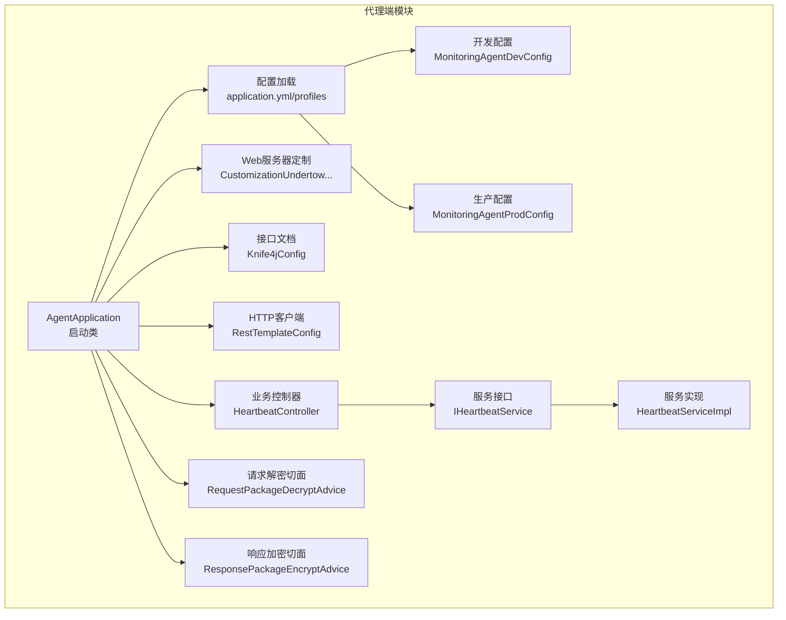
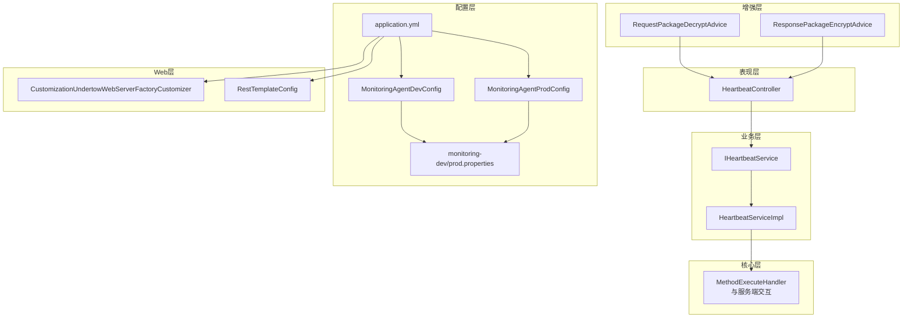
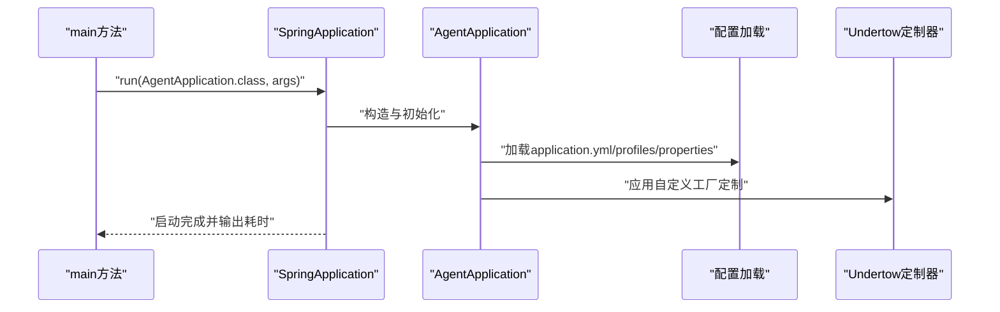
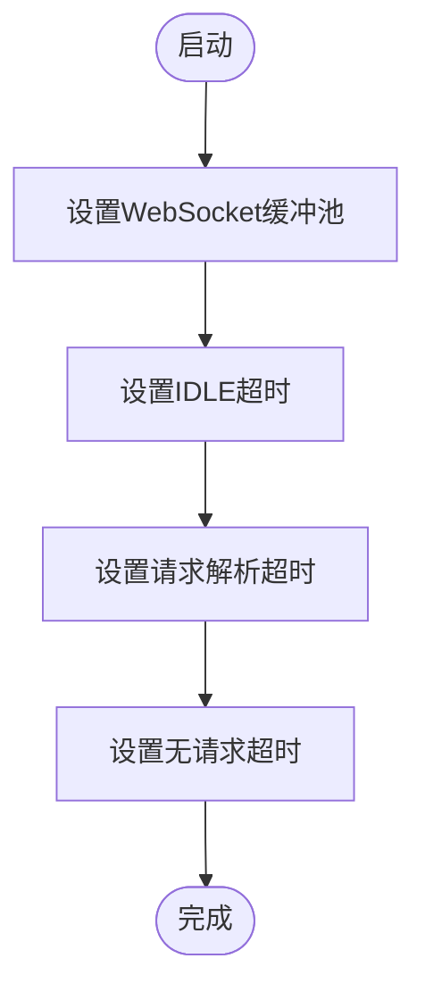
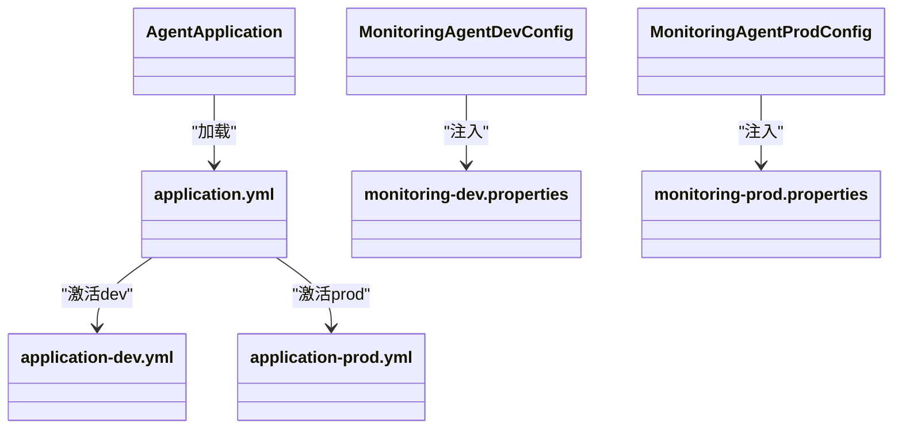
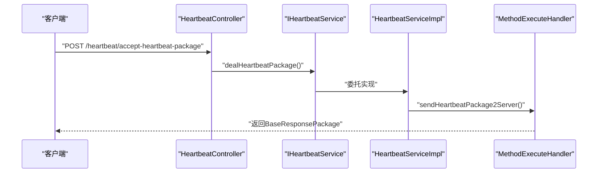
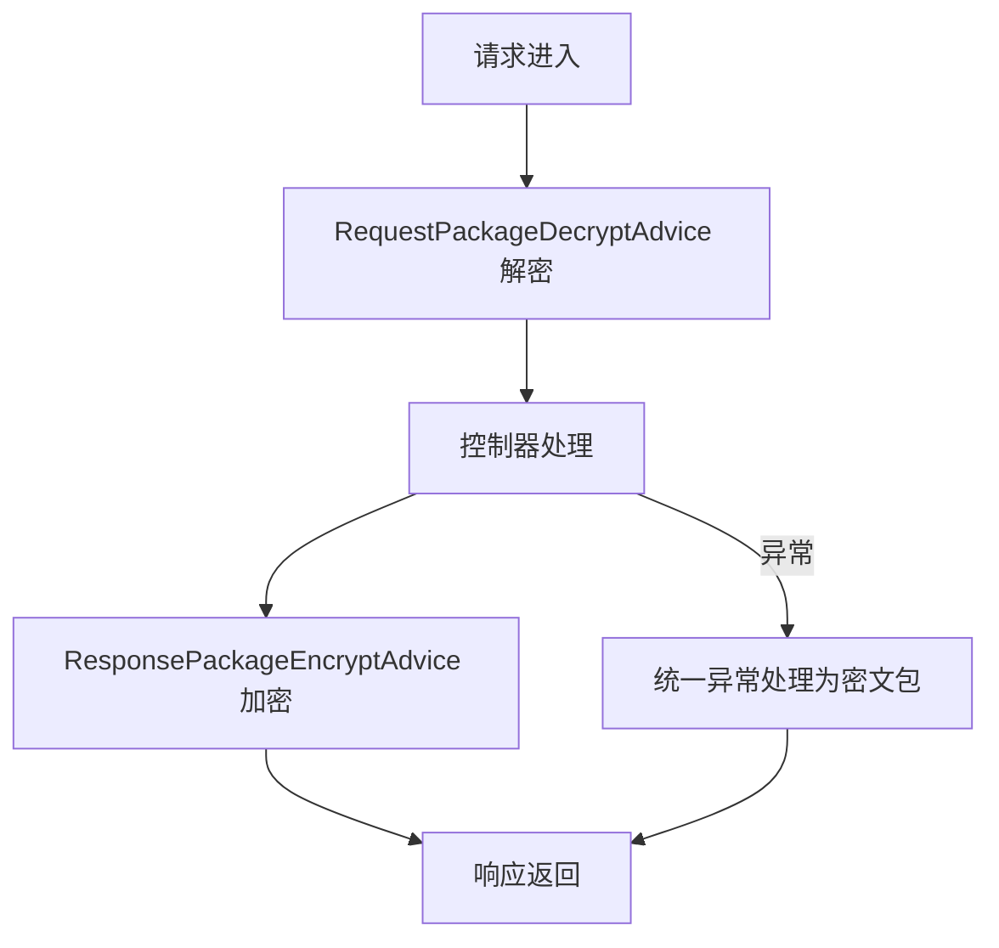
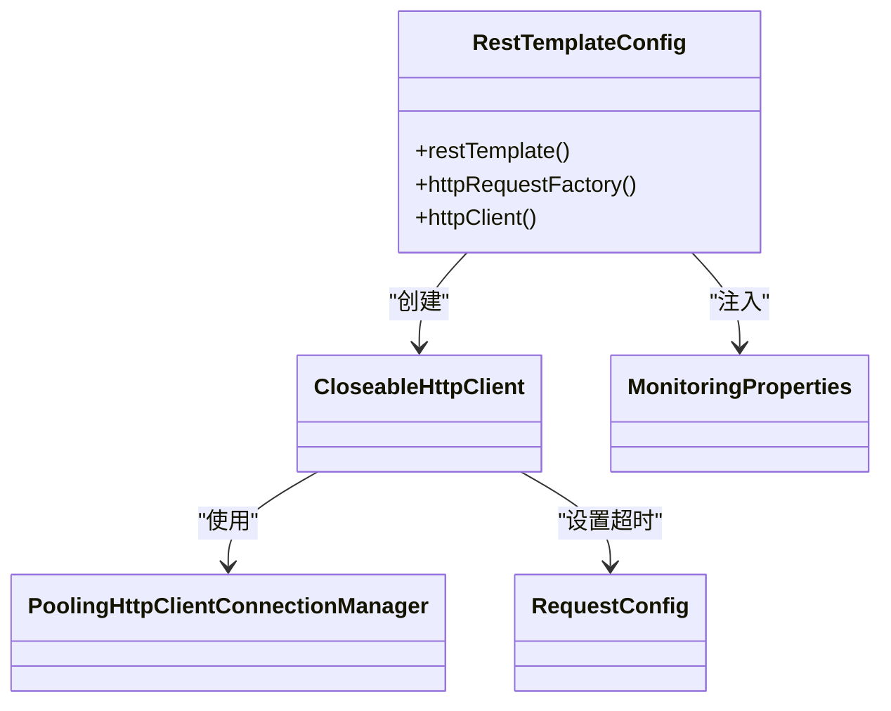
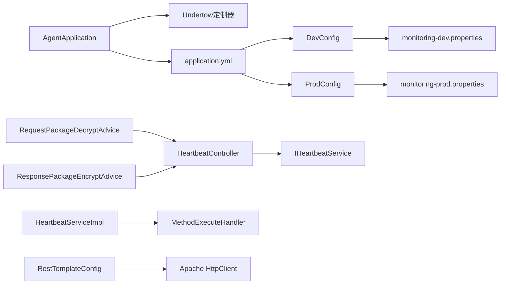

# 代理端架构设计

<cite>
**本文引用的文件**
- [AgentApplication.java](file://phoenix-agent/src/main/java/com/gitee/pifeng/monitoring/agent/AgentApplication.java)
- [application.yml](file://phoenix-agent/src/main/resources/application.yml)
- [application-dev.yml](file://phoenix-agent/src/main/resources/application-dev.yml)
- [application-prod.yml](file://phoenix-agent/src/main/resources/application-prod.yml)
- [monitoring-dev.properties](file://phoenix-agent/src/main/resources/monitoring-dev.properties)
- [monitoring-prod.properties](file://phoenix-agent/src/main/resources/monitoring-prod.properties)
- [MonitoringAgentDevConfig.java](file://phoenix-agent/src/main/java/com/gitee/pifeng/monitoring/agent/config/MonitoringAgentDevConfig.java)
- [MonitoringAgentProdConfig.java](file://phoenix-agent/src/main/java/com/gitee/pifeng/monitoring/agent/config/MonitoringAgentProdConfig.java)
- [RestTemplateConfig.java](file://phoenix-agent/src/main/java/com/gitee/pifeng/monitoring/agent/config/RestTemplateConfig.java)
- [Knife4jConfig.java](file://phoenix-agent/src/main/java/com/gitee/pifeng/monitoring/agent/config/Knife4jConfig.java)
- [CustomizationUndertowWebServerFactoryCustomizer.java](file://phoenix-common/phoenix-common-web/src/main/java/com/gitee/pifeng/monitoring/common/web/core/CustomizationUndertowWebServerFactoryCustomizer.java)
- [HeartbeatController.java](file://phoenix-agent/src/main/java/com/gitee/pifeng/monitoring/agent/business/client/controller/HeartbeatController.java)
- [IHeartbeatService.java](file://phoenix-agent/src/main/java/com/gitee/pifeng/monitoring/agent/business/client/service/IHeartbeatService.java)
- [HeartbeatServiceImpl.java](file://phoenix-agent/src/main/java/com/gitee/pifeng/monitoring/agent/business/client/service/impl/HeartbeatServiceImpl.java)
- [RequestPackageDecryptAdvice.java](file://phoenix-agent/src/main/java/com/gitee/pifeng/monitoring/agent/component/RequestPackageDecryptAdvice.java)
- [ResponsePackageEncryptAdvice.java](file://phoenix-agent/src/main/java/com/gitee/pifeng/monitoring/agent/component/ResponsePackageEncryptAdvice.java)
</cite>

## 目录
1. [引言](#引言)
2. [项目结构](#项目结构)
3. [核心组件](#核心组件)
4. [架构总览](#架构总览)
5. [详细组件分析](#详细组件分析)
6. [依赖分析](#依赖分析)
7. [性能考量](#性能考量)
8. [故障排查指南](#故障排查指南)
9. [结论](#结论)
10. [附录](#附录)

## 引言
本文件面向监控代理端（Agent）的架构设计与实现，围绕 Spring Boot 启动类 AgentApplication 的设计理念与启动流程展开，系统性阐述应用初始化、Bean注册、配置加载等关键步骤；进一步说明代理端的整体架构模式（分层设计、模块划分、组件职责）、Web 服务器 Undertow 的定制化配置与性能优化策略、配置体系（开发/生产环境差异）、以及与客户端、服务端的数据交互机制。文档提供架构图与组件关系图，帮助开发者快速理解系统整体设计思路。

## 项目结构
代理端位于 phoenix-agent 模块，采用按功能域分层的组织方式：
- 启动类与配置：AgentApplication、application.yml、profile 配置与属性文件
- 业务层：client/server 控制器与服务实现
- 核心与工具：包构造、方法执行处理器等
- 组件增强：请求解密、响应加密切面
- Web 定制：基于 Undertow 的自定义工厂定制器

图表来源
- [AgentApplication.java:1-40](file://phoenix-agent/src/main/java/com/gitee/pifeng/monitoring/agent/AgentApplication.java#L1-L40)
- [application.yml:1-111](file://phoenix-agent/src/main/resources/application.yml#L1-L111)
- [MonitoringAgentDevConfig.java:1-38](file://phoenix-agent/src/main/java/com/gitee/pifeng/monitoring/agent/config/MonitoringAgentDevConfig.java#L1-L38)
- [MonitoringAgentProdConfig.java:1-38](file://phoenix-agent/src/main/java/com/gitee/pifeng/monitoring/agent/config/MonitoringAgentProdConfig.java#L1-L38)
- [CustomizationUndertowWebServerFactoryCustomizer.java:1-55](file://phoenix-common/phoenix-common-web/src/main/java/com/gitee/pifeng/monitoring/common/web/core/CustomizationUndertowWebServerFactoryCustomizer.java#L1-L55)
- [Knife4jConfig.java:1-50](file://phoenix-agent/src/main/java/com/gitee/pifeng/monitoring/agent/config/Knife4jConfig.java#L1-L50)
- [RestTemplateConfig.java:1-155](file://phoenix-agent/src/main/java/com/gitee/pifeng/monitoring/agent/config/RestTemplateConfig.java#L1-L155)
- [HeartbeatController.java:1-56](file://phoenix-agent/src/main/java/com/gitee/pifeng/monitoring/agent/business/client/controller/HeartbeatController.java#L1-L56)
- [IHeartbeatService.java:1-29](file://phoenix-agent/src/main/java/com/gitee/pifeng/monitoring/agent/business/client/service/IHeartbeatService.java#L1-L29)
- [HeartbeatServiceImpl.java:1-38](file://phoenix-agent/src/main/java/com/gitee/pifeng/monitoring/agent/business/client/service/impl/HeartbeatServiceImpl.java#L1-L38)
- [RequestPackageDecryptAdvice.java:1-56](file://phoenix-agent/src/main/java/com/gitee/pifeng/monitoring/agent/component/RequestPackageDecryptAdvice.java#L1-L56)
- [ResponsePackageEncryptAdvice.java:1-84](file://phoenix-agent/src/main/java/com/gitee/pifeng/monitoring/agent/component/ResponsePackageEncryptAdvice.java#L1-L84)

章节来源
- [AgentApplication.java:1-40](file://phoenix-agent/src/main/java/com/gitee/pifeng/monitoring/agent/AgentApplication.java#L1-L40)
- [application.yml:1-111](file://phoenix-agent/src/main/resources/application.yml#L1-L111)

## 核心组件
- 启动类与初始化
  - AgentApplication 继承自自定义 Undertow 工厂定制器，通过 SpringApplication.run 启动，记录启动耗时并输出日志。
  - 使用 @ComponentScan 并指定 Bean 名称生成器，确保扫描范围与命名策略可控。
- 配置体系
  - application.yml 提供全局配置（上下文路径、Undertow 访问日志、优雅停机、日志级别、JMX 关闭、异步超时、时区、端点暴露、Knife4j/SpringDoc 文档配置等）。
  - application-dev.yml 与 application-prod.yml 仅定义端口，结合 application.yml 中 profiles.active 指定当前激活配置。
  - monitoring-dev.properties 与 monitoring-prod.properties 定义通信、实例、心跳、服务器信息、JVM 信息等监控参数，分别由开发/生产配置类注入为 @Primary Bean。
- Web 服务器与 HTTP 客户端
  - Undertow 定制：通过 CustomizationUndertowWebServerFactoryCustomizer 设置 WebSocket 缓冲池、IDLE 超时、请求解析超时、无请求超时等。
  - HTTP 客户端：RestTemplateConfig 基于 Apache HttpClient 实现连接池、超时、重试、长连接策略等，统一由 MonitoringProperties 驱动。
- 接口文档与安全
  - Knife4jConfig 提供 OpenAPI 元数据与版本信息，结合 application.yml 中 Knife4j/SpringDoc 配置对外暴露接口文档。
- 业务与安全增强
  - RequestPackageDecryptAdvice：对入站请求体进行解密增强，覆盖 client/server 控制器包。
  - ResponsePackageEncryptAdvice：对出站响应进行加密增强，并统一异常处理为密文响应包。

章节来源
- [AgentApplication.java:14-39](file://phoenix-agent/src/main/java/com/gitee/pifeng/monitoring/agent/AgentApplication.java#L14-L39)
- [application.yml:1-111](file://phoenix-agent/src/main/resources/application.yml#L1-L111)
- [application-dev.yml:1-3](file://phoenix-agent/src/main/resources/application-dev.yml#L1-L3)
- [application-prod.yml:1-3](file://phoenix-agent/src/main/resources/application-prod.yml#L1-L3)
- [MonitoringAgentDevConfig.java:18-37](file://phoenix-agent/src/main/java/com/gitee/pifeng/monitoring/agent/config/MonitoringAgentDevConfig.java#L18-L37)
- [MonitoringAgentProdConfig.java:18-37](file://phoenix-agent/src/main/java/com/gitee/pifeng/monitoring/agent/config/MonitoringAgentProdConfig.java#L18-L37)
- [monitoring-dev.properties:1-41](file://phoenix-agent/src/main/resources/monitoring-dev.properties#L1-L41)
- [monitoring-prod.properties:1-41](file://phoenix-agent/src/main/resources/monitoring-prod.properties#L1-L41)
- [RestTemplateConfig.java:43-154](file://phoenix-agent/src/main/java/com/gitee/pifeng/monitoring/agent/config/RestTemplateConfig.java#L43-L154)
- [CustomizationUndertowWebServerFactoryCustomizer.java:18-54](file://phoenix-common/phoenix-common-web/src/main/java/com/gitee/pifeng/monitoring/common/web/core/CustomizationUndertowWebServerFactoryCustomizer.java#L18-L54)
- [Knife4jConfig.java:24-49](file://phoenix-agent/src/main/java/com/gitee/pifeng/monitoring/agent/config/Knife4jConfig.java#L24-L49)
- [RequestPackageDecryptAdvice.java:22-55](file://phoenix-agent/src/main/java/com/gitee/pifeng/monitoring/agent/component/RequestPackageDecryptAdvice.java#L22-L55)
- [ResponsePackageEncryptAdvice.java:31-83](file://phoenix-agent/src/main/java/com/gitee/pifeng/monitoring/agent/component/ResponsePackageEncryptAdvice.java#L31-L83)

## 架构总览
代理端采用分层架构：
- 表现层：Spring MVC 控制器（如 HeartbeatController）
- 业务层：服务接口与实现（IHeartbeatService/HeartbeatServiceImpl）
- 核心层：包构造、方法执行处理器（用于与服务端交互）
- 增强层：请求解密、响应加密切面
- 配置层：YAML/Properties/Profile 驱动的配置体系
- Web 层：基于 Undertow 的嵌入式服务器，配合自定义工厂定制器

图表来源
- [HeartbeatController.java:26-55](file://phoenix-agent/src/main/java/com/gitee/pifeng/monitoring/agent/business/client/controller/HeartbeatController.java#L26-L55)
- [IHeartbeatService.java:14-28](file://phoenix-agent/src/main/java/com/gitee/pifeng/monitoring/agent/business/client/service/IHeartbeatService.java#L14-L28)
- [HeartbeatServiceImpl.java:18-37](file://phoenix-agent/src/main/java/com/gitee/pifeng/monitoring/agent/business/client/service/impl/HeartbeatServiceImpl.java#L18-L37)
- [MonitoringAgentDevConfig.java:18-37](file://phoenix-agent/src/main/java/com/gitee/pifeng/monitoring/agent/config/MonitoringAgentDevConfig.java#L18-L37)
- [MonitoringAgentProdConfig.java:18-37](file://phoenix-agent/src/main/java/com/gitee/pifeng/monitoring/agent/config/MonitoringAgentProdConfig.java#L18-L37)
- [monitoring-dev.properties:1-41](file://phoenix-agent/src/main/resources/monitoring-dev.properties#L1-L41)
- [monitoring-prod.properties:1-41](file://phoenix-agent/src/main/resources/monitoring-prod.properties#L1-L41)
- [CustomizationUndertowWebServerFactoryCustomizer.java:18-54](file://phoenix-common/phoenix-common-web/src/main/java/com/gitee/pifeng/monitoring/common/web/core/CustomizationUndertowWebServerFactoryCustomizer.java#L18-L54)
- [RestTemplateConfig.java:43-154](file://phoenix-agent/src/main/java/com/gitee/pifeng/monitoring/agent/config/RestTemplateConfig.java#L43-L154)
- [RequestPackageDecryptAdvice.java:22-55](file://phoenix-agent/src/main/java/com/gitee/pifeng/monitoring/agent/component/RequestPackageDecryptAdvice.java#L22-L55)
- [ResponsePackageEncryptAdvice.java:31-83](file://phoenix-agent/src/main/java/com/gitee/pifeng/monitoring/agent/component/ResponsePackageEncryptAdvice.java#L31-L83)

## 详细组件分析

### 启动类与启动流程（AgentApplication）
- 设计理念
  - 继承自自定义 Undertow 工厂定制器，确保嵌入式服务器具备统一的缓冲池与超时策略。
  - 使用 @EnableRetry 启用重试能力，提升网络交互稳定性。
  - 通过 ComponentScan 指定 Bean 名称生成器，避免命名冲突并便于管理。
- 启动流程
  - 记录启动计时器，调用 SpringApplication.run 启动应用，随后打印启动耗时日志。
  - 配合 application.yml 中 profiles.active 指定 dev/prod，加载对应配置类与属性文件。

图表来源
- [AgentApplication.java:30-37](file://phoenix-agent/src/main/java/com/gitee/pifeng/monitoring/agent/AgentApplication.java#L30-L37)
- [application.yml:48-50](file://phoenix-agent/src/main/resources/application.yml#L48-L50)
- [MonitoringAgentDevConfig.java:31-35](file://phoenix-agent/src/main/java/com/gitee/pifeng/monitoring/agent/config/MonitoringAgentDevConfig.java#L31-L35)
- [MonitoringAgentProdConfig.java:31-35](file://phoenix-agent/src/main/java/com/gitee/pifeng/monitoring/agent/config/MonitoringAgentProdConfig.java#L31-L35)
- [CustomizationUndertowWebServerFactoryCustomizer.java:34-51](file://phoenix-common/phoenix-common-web/src/main/java/com/gitee/pifeng/monitoring/common/web/core/CustomizationUndertowWebServerFactoryCustomizer.java#L34-L51)

章节来源
- [AgentApplication.java:14-39](file://phoenix-agent/src/main/java/com/gitee/pifeng/monitoring/agent/AgentApplication.java#L14-L39)
- [application.yml:48-50](file://phoenix-agent/src/main/resources/application.yml#L48-L50)

### Web 服务器选择与 Undertow 定制化配置
- 选择与优势
  - 采用 Undertow 作为嵌入式 Web 服务器，具备高性能、低延迟、WebSocket 支持完善等特性。
- 定制化配置
  - 全局 ByteBufferPool：避免 WebSocket 警告并统一缓冲策略。
  - IDLE 超时：连接无读写活动超过阈值自动关闭，降低资源占用。
  - 请求解析超时：限制请求头解析时间，防止慢请求占用资源。
  - 无请求超时：连接建立后未发送请求则关闭，抵御慢连接攻击。
- 性能优化要点
  - 合理设置 IDLE/解析/无请求超时，平衡安全性与可用性。
  - WebSocket 缓冲池复用，减少 GC 压力。

图表来源
- [CustomizationUndertowWebServerFactoryCustomizer.java:34-51](file://phoenix-common/phoenix-common-web/src/main/java/com/gitee/pifeng/monitoring/common/web/core/CustomizationUndertowWebServerFactoryCustomizer.java#L34-L51)

章节来源
- [CustomizationUndertowWebServerFactoryCustomizer.java:18-54](file://phoenix-common/phoenix-common-web/src/main/java/com/gitee/pifeng/monitoring/common/web/core/CustomizationUndertowWebServerFactoryCustomizer.java#L18-L54)

### 配置体系（开发/生产环境）
- YAML 配置
  - server：上下文路径、Undertow 访问日志、优雅停机、生命周期超时等。
  - logging：Logback 配置与日志级别。
  - spring：关闭 JMX、设置时区、异步超时、应用名、profiles 激活列表、devtools 端口等。
  - management：端点暴露（shutdown/health）、本地访问限制。
  - knife4j/springdoc：接口文档增强与 UI 路径。
- Profile 与属性文件
  - application-dev.yml/application-prod.yml：仅定义端口，结合 profiles.active 切换。
  - monitoring-dev.properties/monitoring-prod.properties：通信 URL、超时、实例信息、心跳与采集频率等。
  - MonitoringAgentDevConfig/ProdConfig：将对应属性文件注入为 @Primary 的 MonitoringProperties Bean。

图表来源
- [application.yml:1-111](file://phoenix-agent/src/main/resources/application.yml#L1-L111)
- [application-dev.yml:1-3](file://phoenix-agent/src/main/resources/application-dev.yml#L1-L3)
- [application-prod.yml:1-3](file://phoenix-agent/src/main/resources/application-prod.yml#L1-L3)
- [monitoring-dev.properties:1-41](file://phoenix-agent/src/main/resources/monitoring-dev.properties#L1-L41)
- [monitoring-prod.properties:1-41](file://phoenix-agent/src/main/resources/monitoring-prod.properties#L1-L41)
- [MonitoringAgentDevConfig.java:18-37](file://phoenix-agent/src/main/java/com/gitee/pifeng/monitoring/agent/config/MonitoringAgentDevConfig.java#L18-L37)
- [MonitoringAgentProdConfig.java:18-37](file://phoenix-agent/src/main/java/com/gitee/pifeng/monitoring/agent/config/MonitoringAgentProdConfig.java#L18-L37)

章节来源
- [application.yml:1-111](file://phoenix-agent/src/main/resources/application.yml#L1-L111)
- [MonitoringAgentDevConfig.java:18-37](file://phoenix-agent/src/main/java/com/gitee/pifeng/monitoring/agent/config/MonitoringAgentDevConfig.java#L18-L37)
- [MonitoringAgentProdConfig.java:18-37](file://phoenix-agent/src/main/java/com/gitee/pifeng/monitoring/agent/config/MonitoringAgentProdConfig.java#L18-L37)

### 业务组件与数据交互（以心跳为例）
- 控制器层
  - HeartbeatController：接收来自客户端的心跳包，调用服务层处理。
- 服务层
  - IHeartbeatService：定义处理心跳包的接口。
  - HeartbeatServiceImpl：实现将心跳包转发至服务端的逻辑。
- 与服务端交互
  - 通过 MethodExecuteHandler 将心跳包发送至服务端（具体实现位于核心层）。

图表来源
- [HeartbeatController.java:47-53](file://phoenix-agent/src/main/java/com/gitee/pifeng/monitoring/agent/business/client/controller/HeartbeatController.java#L47-L53)
- [IHeartbeatService.java:14-28](file://phoenix-agent/src/main/java/com/gitee/pifeng/monitoring/agent/business/client/service/IHeartbeatService.java#L14-L28)
- [HeartbeatServiceImpl.java:31-35](file://phoenix-agent/src/main/java/com/gitee/pifeng/monitoring/agent/business/client/service/impl/HeartbeatServiceImpl.java#L31-L35)

章节来源
- [HeartbeatController.java:1-56](file://phoenix-agent/src/main/java/com/gitee/pifeng/monitoring/agent/business/client/controller/HeartbeatController.java#L1-L56)
- [IHeartbeatService.java:1-29](file://phoenix-agent/src/main/java/com/gitee/pifeng/monitoring/agent/business/client/service/IHeartbeatService.java#L1-L29)
- [HeartbeatServiceImpl.java:1-38](file://phoenix-agent/src/main/java/com/gitee/pifeng/monitoring/agent/business/client/service/impl/HeartbeatServiceImpl.java#L1-L38)

### 安全增强（请求解密与响应加密）
- 请求解密
  - RequestPackageDecryptAdvice：在请求体读取前对 HttpInputMessage 进行包装，实现解密增强，覆盖 client/server 控制器包。
- 响应加密
  - ResponsePackageEncryptAdvice：统一拦截响应体并在写出前进行加密；捕获异常时构造密文响应包返回，同时记录客户端地址与 URI。

图表来源
- [RequestPackageDecryptAdvice.java:22-55](file://phoenix-agent/src/main/java/com/gitee/pifeng/monitoring/agent/component/RequestPackageDecryptAdvice.java#L22-L55)
- [ResponsePackageEncryptAdvice.java:31-83](file://phoenix-agent/src/main/java/com/gitee/pifeng/monitoring/agent/component/ResponsePackageEncryptAdvice.java#L31-L83)

章节来源
- [RequestPackageDecryptAdvice.java:1-56](file://phoenix-agent/src/main/java/com/gitee/pifeng/monitoring/agent/component/RequestPackageDecryptAdvice.java#L1-L56)
- [ResponsePackageEncryptAdvice.java:1-84](file://phoenix-agent/src/main/java/com/gitee/pifeng/monitoring/agent/component/ResponsePackageEncryptAdvice.java#L1-L84)

### HTTP 客户端与连接池（RestTemplateConfig）
- 设计目标
  - 基于 Apache HttpClient 的连接池化 HTTP 客户端，统一超时、重试、长连接策略，适配监控场景高并发与可靠性需求。
- 关键配置
  - 连接池大小：最大连接数与每路由最大连接数，避免连接池过小导致阻塞。
  - 超时参数：连接超时、套接字超时、连接获取超时，与属性文件中的配置一致。
  - 重试策略：默认重试次数与回退策略。
  - 连接生命周期：空闲回收、过期回收、连接存活时间。
- 与配置联动
  - 通过 @Autowired 注入 MonitoringProperties，动态读取通信超时等参数。

图表来源
- [RestTemplateConfig.java:59-152](file://phoenix-agent/src/main/java/com/gitee/pifeng/monitoring/agent/config/RestTemplateConfig.java#L59-L152)
- [monitoring-dev.properties:10-17](file://phoenix-agent/src/main/resources/monitoring-dev.properties#L10-L17)
- [monitoring-prod.properties:10-17](file://phoenix-agent/src/main/resources/monitoring-prod.properties#L10-L17)

章节来源
- [RestTemplateConfig.java:1-155](file://phoenix-agent/src/main/java/com/gitee/pifeng/monitoring/agent/config/RestTemplateConfig.java#L1-L155)

## 依赖分析
- 组件耦合
  - AgentApplication 依赖 Undertow 定制器与配置体系，形成启动期依赖闭环。
  - 控制器依赖服务接口，服务实现依赖核心交互组件，形成清晰的业务依赖链。
  - 安全增强切面横切控制器，不改变业务代码，提升可维护性。
- 外部依赖
  - Undertow：嵌入式 Web 服务器。
  - Apache HttpClient：HTTP 客户端与连接池。
  - Knife4j/SpringDoc：接口文档。
- 循环依赖
  - 当前结构未见循环依赖迹象，控制器-服务-核心分层清晰。

图表来源
- [AgentApplication.java:28](file://phoenix-agent/src/main/java/com/gitee/pifeng/monitoring/agent/AgentApplication.java#L28)
- [CustomizationUndertowWebServerFactoryCustomizer.java:18](file://phoenix-common/phoenix-common-web/src/main/java/com/gitee/pifeng/monitoring/common/web/core/CustomizationUndertowWebServerFactoryCustomizer.java#L18)
- [application.yml:48-50](file://phoenix-agent/src/main/resources/application.yml#L48-L50)
- [MonitoringAgentDevConfig.java:31-35](file://phoenix-agent/src/main/java/com/gitee/pifeng/monitoring/agent/config/MonitoringAgentDevConfig.java#L31-L35)
- [MonitoringAgentProdConfig.java:31-35](file://phoenix-agent/src/main/java/com/gitee/pifeng/monitoring/agent/config/MonitoringAgentProdConfig.java#L31-L35)
- [HeartbeatController.java:34-53](file://phoenix-agent/src/main/java/com/gitee/pifeng/monitoring/agent/business/client/controller/HeartbeatController.java#L34-L53)
- [IHeartbeatService.java:14-28](file://phoenix-agent/src/main/java/com/gitee/pifeng/monitoring/agent/business/client/service/IHeartbeatService.java#L14-L28)
- [HeartbeatServiceImpl.java:31-35](file://phoenix-agent/src/main/java/com/gitee/pifeng/monitoring/agent/business/client/service/impl/HeartbeatServiceImpl.java#L31-L35)
- [RequestPackageDecryptAdvice.java:22-55](file://phoenix-agent/src/main/java/com/gitee/pifeng/monitoring/agent/component/RequestPackageDecryptAdvice.java#L22-L55)
- [ResponsePackageEncryptAdvice.java:31-83](file://phoenix-agent/src/main/java/com/gitee/pifeng/monitoring/agent/component/ResponsePackageEncryptAdvice.java#L31-L83)
- [RestTemplateConfig.java:89-152](file://phoenix-agent/src/main/java/com/gitee/pifeng/monitoring/agent/config/RestTemplateConfig.java#L89-L152)

章节来源
- [application.yml:1-111](file://phoenix-agent/src/main/resources/application.yml#L1-L111)

## 性能考量
- Undertow 超时参数
  - IDLE 超时、请求解析超时、无请求超时需结合业务峰值与网络环境调整，避免误杀正常请求或资源泄露。
- 连接池参数
  - 最大连接数与每路由最大连接数应与并发量匹配，避免连接池过小导致排队与超时。
  - 空闲与过期连接回收周期影响内存与连接复用效率，建议根据流量波动调优。
- 日志与端点
  - Undertow 访问日志开启需评估磁盘 IO；management 端点仅本地暴露，兼顾可观测性与安全性。
- 异常处理
  - 响应加密增强统一异常处理，避免敏感信息泄露，同时保证错误信息可追踪。

## 故障排查指南
- 启动耗时与日志
  - 启动类记录启动耗时，可通过日志定位启动阶段瓶颈。
- 连接池相关异常
  - 连接池耗尽或超时：检查 MaxTotal、DefaultMaxPerRoute、超时参数与业务并发。
- 心跳与转发失败
  - 检查服务端地址、网络连通性、超时配置与重试策略。
- 安全增强问题
  - 请求解密/响应加密异常：确认切面生效范围与密文包格式一致性。
- 端点与文档
  - shutdown/health 端点仅本地可访问，若无法访问请核对 management.address 配置。

章节来源
- [AgentApplication.java:30-37](file://phoenix-agent/src/main/java/com/gitee/pifeng/monitoring/agent/AgentApplication.java#L30-L37)
- [RestTemplateConfig.java:107-149](file://phoenix-agent/src/main/java/com/gitee/pifeng/monitoring/agent/config/RestTemplateConfig.java#L107-L149)
- [ResponsePackageEncryptAdvice.java:55-64](file://phoenix-agent/src/main/java/com/gitee/pifeng/monitoring/agent/component/ResponsePackageEncryptAdvice.java#L55-L64)
- [application.yml:71-73](file://phoenix-agent/src/main/resources/application.yml#L71-L73)

## 结论
代理端以 Spring Boot 为基础，采用 Undertow 嵌入式服务器与自定义工厂定制器实现高性能 Web 服务能力；通过 YAML/Profile/Properties 的分层配置体系支撑开发与生产环境差异化部署；以控制器-服务-核心分层与安全增强切面实现清晰的业务边界与高安全性。RestTemplateConfig 提供高可靠 HTTP 客户端能力，满足监控场景下的高并发与稳定性要求。整体架构设计兼顾易用性、可扩展性与可运维性。

## 附录
- 术语
  - Undertow：嵌入式 Web 服务器
  - RestTemplate：Spring HTTP 客户端
  - 切面：基于 AOP 的横切增强
- 参考文件
  - [AgentApplication.java](file://phoenix-agent/src/main/java/com/gitee/pifeng/monitoring/agent/AgentApplication.java)
  - [application.yml](file://phoenix-agent/src/main/resources/application.yml)
  - [application-dev.yml](file://phoenix-agent/src/main/resources/application-dev.yml)
  - [application-prod.yml](file://phoenix-agent/src/main/resources/application-prod.yml)
  - [monitoring-dev.properties](file://phoenix-agent/src/main/resources/monitoring-dev.properties)
  - [monitoring-prod.properties](file://phoenix-agent/src/main/resources/monitoring-prod.properties)
  - [MonitoringAgentDevConfig.java](file://phoenix-agent/src/main/java/com/gitee/pifeng/monitoring/agent/config/MonitoringAgentDevConfig.java)
  - [MonitoringAgentProdConfig.java](file://phoenix-agent/src/main/java/com/gitee/pifeng/monitoring/agent/config/MonitoringAgentProdConfig.java)
  - [RestTemplateConfig.java](file://phoenix-agent/src/main/java/com/gitee/pifeng/monitoring/agent/config/RestTemplateConfig.java)
  - [CustomizationUndertowWebServerFactoryCustomizer.java](file://phoenix-common/phoenix-common-web/src/main/java/com/gitee/pifeng/monitoring/common/web/core/CustomizationUndertowWebServerFactoryCustomizer.java)
  - [HeartbeatController.java](file://phoenix-agent/src/main/java/com/gitee/pifeng/monitoring/agent/business/client/controller/HeartbeatController.java)
  - [IHeartbeatService.java](file://phoenix-agent/src/main/java/com/gitee/pifeng/monitoring/agent/business/client/service/IHeartbeatService.java)
  - [HeartbeatServiceImpl.java](file://phoenix-agent/src/main/java/com/gitee/pifeng/monitoring/agent/business/client/service/impl/HeartbeatServiceImpl.java)
  - [RequestPackageDecryptAdvice.java](file://phoenix-agent/src/main/java/com/gitee/pifeng/monitoring/agent/component/RequestPackageDecryptAdvice.java)
  - [ResponsePackageEncryptAdvice.java](file://phoenix-agent/src/main/java/com/gitee/pifeng/monitoring/agent/component/ResponsePackageEncryptAdvice.java)