# 控制器层实现

<cite>
**本文引用的文件**
- [HeartbeatController.java](file://phoenix-agent/src/main/java/com/gitee/pifeng/monitoring/agent/business/client/controller/HeartbeatController.java)
- [ServerController.java](file://phoenix-agent/src/main/java/com/gitee/pifeng/monitoring/agent/business/client/controller/ServerController.java)
- [JvmController.java](file://phoenix-agent/src/main/java/com/gitee/pifeng/monitoring/agent/business/client/controller/JvmController.java)
- [HttpController.java](file://phoenix-agent/src/main/java/com/gitee/pifeng/monitoring/agent/business/client/controller/HttpController.java)
- [NetworkController.java](file://phoenix-agent/src/main/java/com/gitee/pifeng/monitoring/agent/business/client/controller/NetworkController.java)
- [TcpController.java](file://phoenix-agent/src/main/java/com/gitee/pifeng/monitoring/agent/business/client/controller/TcpController.java)
- [DbController.java](file://phoenix-agent/src/main/java/com/gitee/pifeng/monitoring/agent/business/client/controller/DbController.java)
- [AlarmController.java](file://phoenix-agent/src/main/java/com/gitee/pifeng/monitoring/agent/business/client/controller/AlarmController.java)
- [MonitoringPropertiesConfigController.java](file://phoenix-agent/src/main/java/com/gitee/pifeng/monitoring/agent/business/client/controller/MonitoringPropertiesConfigController.java)
- [OfflineController.java](file://phoenix-agent/src/main/java/com/gitee/pifeng/monitoring/agent/business/client/controller/OfflineController.java)
- [IHeartbeatService.java](file://phoenix-agent/src/main/java/com/gitee/pifeng/monitoring/agent/business/client/service/IHeartbeatService.java)
- [IServerService.java](file://phoenix-agent/src/main/java/com/gitee/pifeng/monitoring/agent/business/client/service/IServerService.java)
- [IJvmService.java](file://phoenix-agent/src/main/java/com/gitee/pifeng/monitoring/agent/business/client/service/IJvmService.java)
- [IBaseRequestPackageService.java](file://phoenix-agent/src/main/java/com/gitee/pifeng/monitoring/agent/business/client/service/IBaseRequestPackageService.java)
- [UrlConstants.java](file://phoenix-agent/src/main/java/com/gitee/pifeng/monitoring/agent/constant/UrlConstants.java)
</cite>

## 目录
1. [引言](#引言)
2. [项目结构](#项目结构)
3. [核心组件](#核心组件)
4. [架构总览](#架构总览)
5. [详细组件分析](#详细组件分析)
6. [依赖分析](#依赖分析)
7. [性能考虑](#性能考虑)
8. [故障排查指南](#故障排查指南)
9. [结论](#结论)
10. [附录](#附录)

## 引言
本文件面向监控代理端（Agent）的控制器层，系统性梳理控制器的架构设计、职责划分、REST API 设计原则、请求处理流程与响应格式规范，并对心跳、服务器、JVM、HTTP、网络、TCP、数据库、告警、监控属性配置、下线等控制器逐一进行实现细节说明。同时阐述控制器与服务层的交互方式（依赖注入、方法调用、异常处理）、安全机制（请求验证、权限控制、数据加解密）、错误处理策略（异常捕获、错误码与错误信息返回），并提供扩展新 API 的实践指南。

## 项目结构
控制器层位于代理端模块中，采用按功能域分包的组织方式，每个控制器对应一类监控信息包或网络探测任务，统一通过 Spring MVC 提供 REST 接口。控制器通过注解声明路由前缀与操作描述，使用 Swagger 注解标注请求体与响应体的数据模型，便于前后端对接与文档生成。

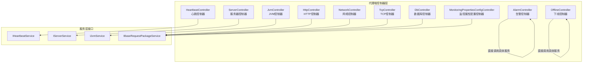

图表来源
- [HeartbeatController.java:26-56](file://phoenix-agent/src/main/java/com/gitee/pifeng/monitoring/agent/business/client/controller/HeartbeatController.java#L26-L56)
- [ServerController.java:26-55](file://phoenix-agent/src/main/java/com/gitee/pifeng/monitoring/agent/business/client/controller/ServerController.java#L26-L55)
- [JvmController.java:26-55](file://phoenix-agent/src/main/java/com/gitee/pifeng/monitoring/agent/business/client/controller/JvmController.java#L26-L55)
- [HttpController.java:29-61](file://phoenix-agent/src/main/java/com/gitee/pifeng/monitoring/agent/business/client/controller/HttpController.java#L29-L61)
- [NetworkController.java:29-80](file://phoenix-agent/src/main/java/com/gitee/pifeng/monitoring/agent/business/client/controller/NetworkController.java#L29-L80)
- [TcpController.java:29-61](file://phoenix-agent/src/main/java/com/gitee/pifeng/monitoring/agent/business/client/controller/TcpController.java#L29-L61)
- [DbController.java:29-61](file://phoenix-agent/src/main/java/com/gitee/pifeng/monitoring/agent/business/client/controller/DbController.java#L29-L61)
- [AlarmController.java:26-56](file://phoenix-agent/src/main/java/com/gitee/pifeng/monitoring/agent/business/client/controller/AlarmController.java#L26-L56)
- [MonitoringPropertiesConfigController.java:27-57](file://phoenix-agent/src/main/java/com/gitee/pifeng/monitoring/agent/business/client/controller/MonitoringPropertiesConfigController.java#L27-L57)
- [OfflineController.java:28-60](file://phoenix-agent/src/main/java/com/gitee/pifeng/monitoring/agent/business/client/controller/OfflineController.java#L28-L60)

章节来源
- [HeartbeatController.java:1-56](file://phoenix-agent/src/main/java/com/gitee/pifeng/monitoring/agent/business/client/controller/HeartbeatController.java#L1-L56)
- [ServerController.java:1-55](file://phoenix-agent/src/main/java/com/gitee/pifeng/monitoring/agent/business/client/controller/ServerController.java#L1-L55)
- [JvmController.java:1-55](file://phoenix-agent/src/main/java/com/gitee/pifeng/monitoring/agent/business/client/controller/JvmController.java#L1-L55)
- [HttpController.java:1-61](file://phoenix-agent/src/main/java/com/gitee/pifeng/monitoring/agent/business/client/controller/HttpController.java#L1-L61)
- [NetworkController.java:1-80](file://phoenix-agent/src/main/java/com/gitee/pifeng/monitoring/agent/business/client/controller/NetworkController.java#L1-L80)
- [TcpController.java:1-61](file://phoenix-agent/src/main/java/com/gitee/pifeng/monitoring/agent/business/client/controller/TcpController.java#L1-L61)
- [DbController.java:1-61](file://phoenix-agent/src/main/java/com/gitee/pifeng/monitoring/agent/business/client/controller/DbController.java#L1-L61)
- [AlarmController.java:1-56](file://phoenix-agent/src/main/java/com/gitee/pifeng/monitoring/agent/business/client/controller/AlarmController.java#L1-L56)
- [MonitoringPropertiesConfigController.java:1-57](file://phoenix-agent/src/main/java/com/gitee/pifeng/monitoring/agent/business/client/controller/MonitoringPropertiesConfigController.java#L1-L57)
- [OfflineController.java:1-60](file://phoenix-agent/src/main/java/com/gitee/pifeng/monitoring/agent/business/client/controller/OfflineController.java#L1-L60)

## 核心组件
- 控制器层负责对外暴露 REST 接口，统一接收来自客户端的监控信息包或探测请求，完成请求参数校验与封装后，交由服务层处理，并将服务层返回的结果统一封装为响应包。
- 控制器通过注解声明路由前缀与操作描述，使用 Swagger 注解标注请求体与响应体的数据模型，便于前后端对接与文档生成。
- 控制器与服务层通过接口解耦，采用依赖注入的方式在运行时装配具体实现，保证可替换性与可测试性。

章节来源
- [HeartbeatController.java:26-56](file://phoenix-agent/src/main/java/com/gitee/pifeng/monitoring/agent/business/client/controller/HeartbeatController.java#L26-L56)
- [ServerController.java:26-55](file://phoenix-agent/src/main/java/com/gitee/pifeng/monitoring/agent/business/client/controller/ServerController.java#L26-L55)
- [JvmController.java:26-55](file://phoenix-agent/src/main/java/com/gitee/pifeng/monitoring/agent/business/client/controller/JvmController.java#L26-L55)
- [HttpController.java:29-61](file://phoenix-agent/src/main/java/com/gitee/pifeng/monitoring/agent/business/client/controller/HttpController.java#L29-L61)
- [NetworkController.java:29-80](file://phoenix-agent/src/main/java/com/gitee/pifeng/monitoring/agent/business/client/controller/NetworkController.java#L29-L80)
- [TcpController.java:29-61](file://phoenix-agent/src/main/java/com/gitee/pifeng/monitoring/agent/business/client/controller/TcpController.java#L29-L61)
- [DbController.java:29-61](file://phoenix-agent/src/main/java/com/gitee/pifeng/monitoring/agent/business/client/controller/DbController.java#L29-L61)
- [AlarmController.java:26-56](file://phoenix-agent/src/main/java/com/gitee/pifeng/monitoring/agent/business/client/controller/AlarmController.java#L26-L56)
- [MonitoringPropertiesConfigController.java:27-57](file://phoenix-agent/src/main/java/com/gitee/pifeng/monitoring/agent/business/client/controller/MonitoringPropertiesConfigController.java#L27-L57)
- [OfflineController.java:28-60](file://phoenix-agent/src/main/java/com/gitee/pifeng/monitoring/agent/business/client/controller/OfflineController.java#L28-L60)

## 架构总览
控制器层与服务层的交互遵循“薄控制器、厚服务”的设计原则：控制器仅负责路由、参数绑定、校验与结果封装；业务逻辑集中在服务层。控制器通过依赖注入装配服务接口，调用服务方法处理请求，最终返回统一的响应包。

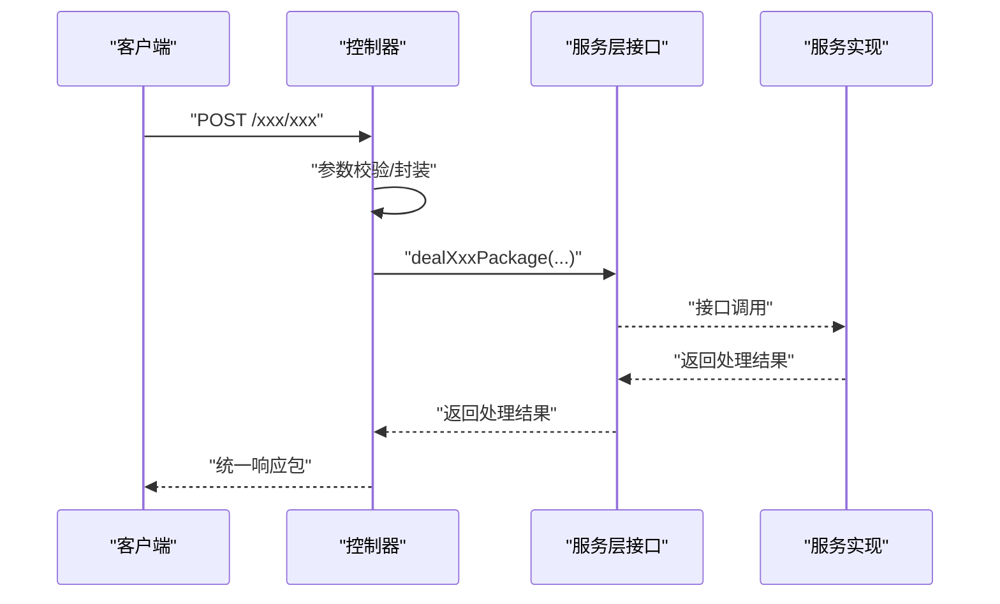

图表来源
- [HeartbeatController.java:50-53](file://phoenix-agent/src/main/java/com/gitee/pifeng/monitoring/agent/business/client/controller/HeartbeatController.java#L50-L53)
- [ServerController.java:50-53](file://phoenix-agent/src/main/java/com/gitee/pifeng/monitoring/agent/business/client/controller/ServerController.java#L50-L53)
- [JvmController.java:50-53](file://phoenix-agent/src/main/java/com/gitee/pifeng/monitoring/agent/business/client/controller/JvmController.java#L50-L53)
- [HttpController.java:55-58](file://phoenix-agent/src/main/java/com/gitee/pifeng/monitoring/agent/business/client/controller/HttpController.java#L55-L58)
- [NetworkController.java:55-58](file://phoenix-agent/src/main/java/com/gitee/pifeng/monitoring/agent/business/client/controller/NetworkController.java#L55-L58)
- [TcpController.java:55-58](file://phoenix-agent/src/main/java/com/gitee/pifeng/monitoring/agent/business/client/controller/TcpController.java#L55-L58)
- [DbController.java:55-58](file://phoenix-agent/src/main/java/com/gitee/pifeng/monitoring/agent/business/client/controller/DbController.java#L55-L58)
- [AlarmController.java:50-53](file://phoenix-agent/src/main/java/com/gitee/pifeng/monitoring/agent/business/client/controller/AlarmController.java#L50-L53)
- [MonitoringPropertiesConfigController.java:51-54](file://phoenix-agent/src/main/java/com/gitee/pifeng/monitoring/agent/business/client/controller/MonitoringPropertiesConfigController.java#L51-L54)
- [OfflineController.java:54-57](file://phoenix-agent/src/main/java/com/gitee/pifeng/monitoring/agent/business/client/controller/OfflineController.java#L54-L57)

## 详细组件分析

### 心跳控制器（HeartbeatController）
- 路由前缀：/heartbeat
- 主要接口：/accept-heartbeat-package
- 功能：接收客户端发送的心跳包，调用心跳服务处理并返回统一响应包。
- 请求体与响应体：均使用加密包装包类型，确保传输安全。
- 依赖注入：IHeartbeatService

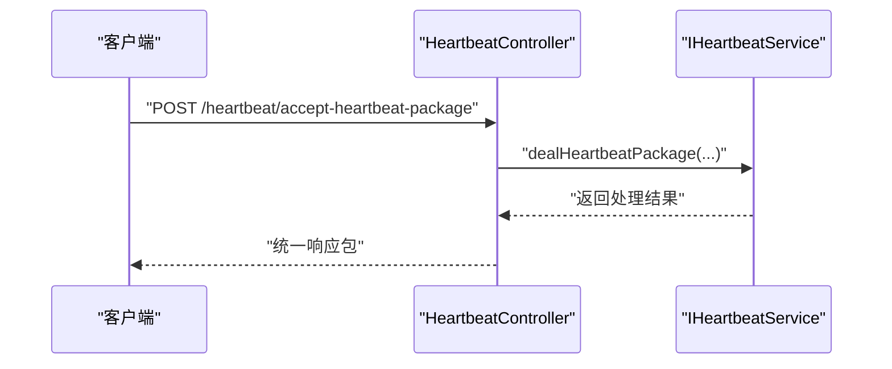

图表来源
- [HeartbeatController.java:50-53](file://phoenix-agent/src/main/java/com/gitee/pifeng/monitoring/agent/business/client/controller/HeartbeatController.java#L50-L53)
- [IHeartbeatService.java:14-29](file://phoenix-agent/src/main/java/com/gitee/pifeng/monitoring/agent/business/client/service/IHeartbeatService.java#L14-L29)

章节来源
- [HeartbeatController.java:18-56](file://phoenix-agent/src/main/java/com/gitee/pifeng/monitoring/agent/business/client/controller/HeartbeatController.java#L18-L56)
- [IHeartbeatService.java:1-29](file://phoenix-agent/src/main/java/com/gitee/pifeng/monitoring/agent/business/client/service/IHeartbeatService.java#L1-L29)

### 服务器控制器（ServerController）
- 路由前缀：/server
- 主要接口：/accept-server-package
- 功能：接收客户端发送的服务器信息包，调用服务器信息服务处理并返回统一响应包。
- 请求体与响应体：均使用加密包装包类型。
- 依赖注入：IServerService

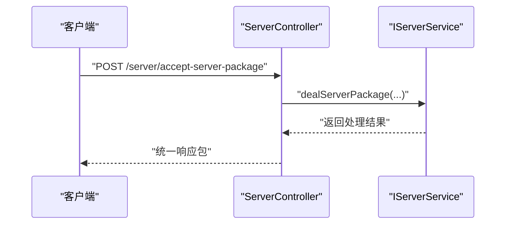

图表来源
- [ServerController.java:50-53](file://phoenix-agent/src/main/java/com/gitee/pifeng/monitoring/agent/business/client/controller/ServerController.java#L50-L53)
- [IServerService.java:14-29](file://phoenix-agent/src/main/java/com/gitee/pifeng/monitoring/agent/business/client/service/IServerService.java#L14-L29)

章节来源
- [ServerController.java:18-55](file://phoenix-agent/src/main/java/com/gitee/pifeng/monitoring/agent/business/client/controller/ServerController.java#L18-L55)
- [IServerService.java:1-29](file://phoenix-agent/src/main/java/com/gitee/pifeng/monitoring/agent/business/client/service/IServerService.java#L1-L29)

### JVM 控制器（JvmController）
- 路由前缀：/jvm
- 主要接口：/accept-jvm-package
- 功能：接收客户端发送的 JVM 信息包，调用 JVM 信息服务处理并返回统一响应包。
- 请求体与响应体：均使用加密包装包类型。
- 依赖注入：IJvmService

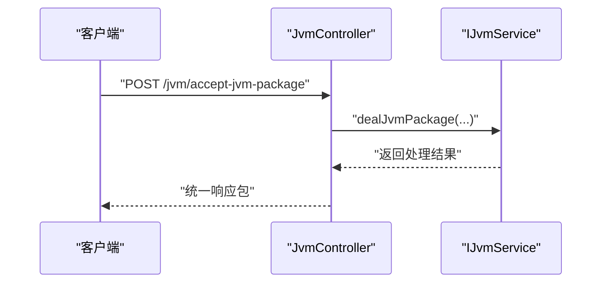

图表来源
- [JvmController.java:50-53](file://phoenix-agent/src/main/java/com/gitee/pifeng/monitoring/agent/business/client/controller/JvmController.java#L50-L53)
- [IJvmService.java:14-29](file://phoenix-agent/src/main/java/com/gitee/pifeng/monitoring/agent/business/client/service/IJvmService.java#L14-L29)

章节来源
- [JvmController.java:18-55](file://phoenix-agent/src/main/java/com/gitee/pifeng/monitoring/agent/business/client/controller/JvmController.java#L18-L55)
- [IJvmService.java:1-29](file://phoenix-agent/src/main/java/com/gitee/pifeng/monitoring/agent/business/client/service/IJvmService.java#L1-L29)

### HTTP 控制器（HttpController）
- 路由前缀：/http
- 主要接口：/test-monitor-http
- 功能：测试 HTTP 连通性，调用基础请求包服务处理并返回统一响应包。
- 请求体与响应体：均使用加密包装包类型。
- 依赖注入：IBaseRequestPackageService
- 异常处理：抛出网络相关异常，由全局异常处理机制捕获。

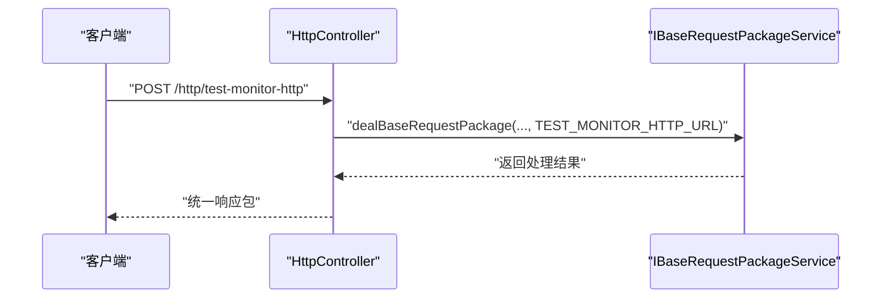

图表来源
- [HttpController.java:55-58](file://phoenix-agent/src/main/java/com/gitee/pifeng/monitoring/agent/business/client/controller/HttpController.java#L55-L58)
- [IBaseRequestPackageService.java:14-30](file://phoenix-agent/src/main/java/com/gitee/pifeng/monitoring/agent/business/client/service/IBaseRequestPackageService.java#L14-L30)
- [UrlConstants.java:72-74](file://phoenix-agent/src/main/java/com/gitee/pifeng/monitoring/agent/constant/UrlConstants.java#L72-L74)

章节来源
- [HttpController.java:21-61](file://phoenix-agent/src/main/java/com/gitee/pifeng/monitoring/agent/business/client/controller/HttpController.java#L21-L61)
- [IBaseRequestPackageService.java:1-30](file://phoenix-agent/src/main/java/com/gitee/pifeng/monitoring/agent/business/client/service/IBaseRequestPackageService.java#L1-L30)
- [UrlConstants.java:1-127](file://phoenix-agent/src/main/java/com/gitee/pifeng/monitoring/agent/constant/UrlConstants.java#L1-L127)

### 网络控制器（NetworkController）
- 路由前缀：/network
- 主要接口：
  - /get-source-ip：获取被监控网络源 IP 地址
  - /test-monitor-network：测试网络连通性
- 功能：两类网络探测能力，均通过基础请求包服务处理并返回统一响应包。
- 请求体与响应体：均使用加密包装包类型。
- 依赖注入：IBaseRequestPackageService
- 异常处理：抛出网络相关异常，由全局异常处理机制捕获。

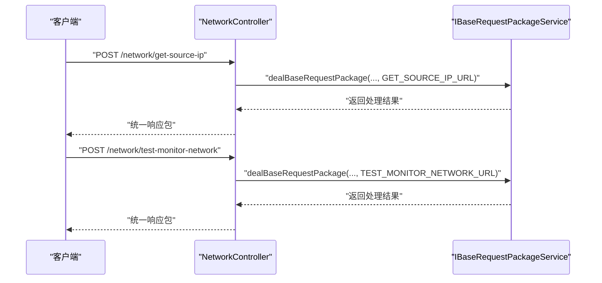

图表来源
- [NetworkController.java:55-77](file://phoenix-agent/src/main/java/com/gitee/pifeng/monitoring/agent/business/client/controller/NetworkController.java#L55-L77)
- [IBaseRequestPackageService.java:14-30](file://phoenix-agent/src/main/java/com/gitee/pifeng/monitoring/agent/business/client/service/IBaseRequestPackageService.java#L14-L30)
- [UrlConstants.java:62-70](file://phoenix-agent/src/main/java/com/gitee/pifeng/monitoring/agent/constant/UrlConstants.java#L62-L70)

章节来源
- [NetworkController.java:21-80](file://phoenix-agent/src/main/java/com/gitee/pifeng/monitoring/agent/business/client/controller/NetworkController.java#L21-L80)
- [IBaseRequestPackageService.java:1-30](file://phoenix-agent/src/main/java/com/gitee/pifeng/monitoring/agent/business/client/service/IBaseRequestPackageService.java#L1-L30)
- [UrlConstants.java:1-127](file://phoenix-agent/src/main/java/com/gitee/pifeng/monitoring/agent/constant/UrlConstants.java#L1-L127)

### TCP 控制器（TcpController）
- 路由前缀：/tcp
- 主要接口：/test-monitor-tcp
- 功能：测试 TCP 连通性，调用基础请求包服务处理并返回统一响应包。
- 请求体与响应体：均使用加密包装包类型。
- 依赖注入：IBaseRequestPackageService
- 异常处理：抛出网络相关异常，由全局异常处理机制捕获。

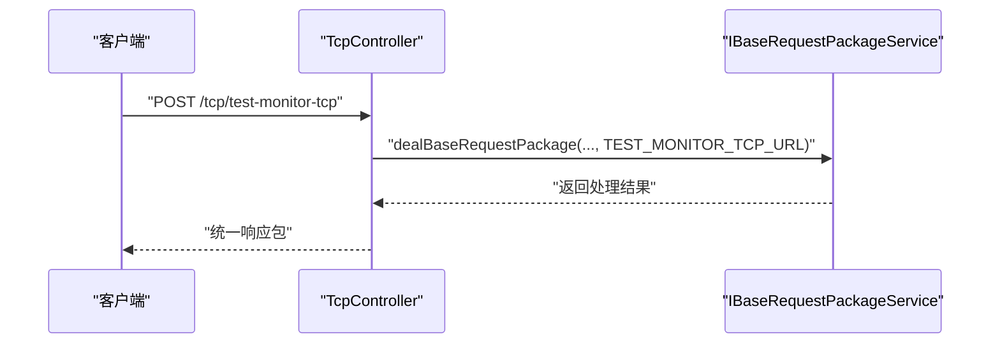

图表来源
- [TcpController.java:55-58](file://phoenix-agent/src/main/java/com/gitee/pifeng/monitoring/agent/business/client/controller/TcpController.java#L55-L58)
- [IBaseRequestPackageService.java:14-30](file://phoenix-agent/src/main/java/com/gitee/pifeng/monitoring/agent/business/client/service/IBaseRequestPackageService.java#L14-L30)
- [UrlConstants.java:76-80](file://phoenix-agent/src/main/java/com/gitee/pifeng/monitoring/agent/constant/UrlConstants.java#L76-L80)

章节来源
- [TcpController.java:21-61](file://phoenix-agent/src/main/java/com/gitee/pifeng/monitoring/agent/business/client/controller/TcpController.java#L21-L61)
- [IBaseRequestPackageService.java:1-30](file://phoenix-agent/src/main/java/com/gitee/pifeng/monitoring/agent/business/client/service/IBaseRequestPackageService.java#L1-L30)
- [UrlConstants.java:1-127](file://phoenix-agent/src/main/java/com/gitee/pifeng/monitoring/agent/constant/UrlConstants.java#L1-L127)

### 数据库控制器（DbController）
- 路由前缀：/db
- 主要接口：/test-monitor-db
- 功能：测试数据库连通性，调用基础请求包服务处理并返回统一响应包。
- 请求体与响应体：均使用加密包装包类型。
- 依赖注入：IBaseRequestPackageService
- 异常处理：抛出网络相关异常，由全局异常处理机制捕获。

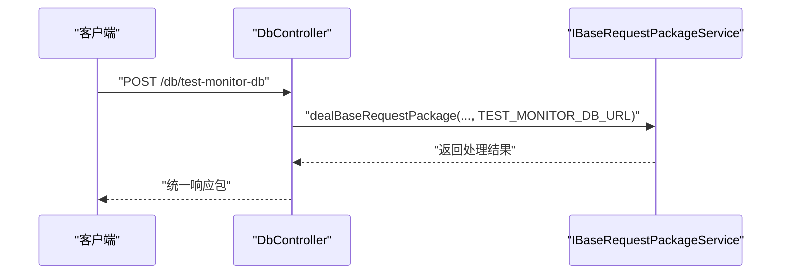

图表来源
- [DbController.java:55-58](file://phoenix-agent/src/main/java/com/gitee/pifeng/monitoring/agent/business/client/controller/DbController.java#L55-L58)
- [IBaseRequestPackageService.java:14-30](file://phoenix-agent/src/main/java/com/gitee/pifeng/monitoring/agent/business/client/service/IBaseRequestPackageService.java#L14-L30)
- [UrlConstants.java:81-85](file://phoenix-agent/src/main/java/com/gitee/pifeng/monitoring/agent/constant/UrlConstants.java#L81-L85)

章节来源
- [DbController.java:21-61](file://phoenix-agent/src/main/java/com/gitee/pifeng/monitoring/agent/business/client/controller/DbController.java#L21-L61)
- [IBaseRequestPackageService.java:1-30](file://phoenix-agent/src/main/java/com/gitee/pifeng/monitoring/agent/business/client/service/IBaseRequestPackageService.java#L1-L30)
- [UrlConstants.java:1-127](file://phoenix-agent/src/main/java/com/gitee/pifeng/monitoring/agent/constant/UrlConstants.java#L1-L127)

### 告警控制器（AlarmController）
- 路由前缀：/alarm
- 主要接口：/accept-alarm-package
- 功能：接收客户端发送的告警包，调用告警服务处理并返回统一响应包。
- 请求体与响应体：均使用加密包装包类型。
- 依赖注入：IAlarmService（控制器内部直接调用）

章节来源
- [AlarmController.java:18-56](file://phoenix-agent/src/main/java/com/gitee/pifeng/monitoring/agent/business/client/controller/AlarmController.java#L18-L56)

### 监控属性配置控制器（MonitoringPropertiesConfigController）
- 路由前缀：/monitoring-properties-config
- 主要接口：/refresh
- 功能：刷新监控配置属性，调用基础请求包服务处理并返回统一响应包。
- 请求体与响应体：均使用加密包装包类型。
- 依赖注入：IBaseRequestPackageService

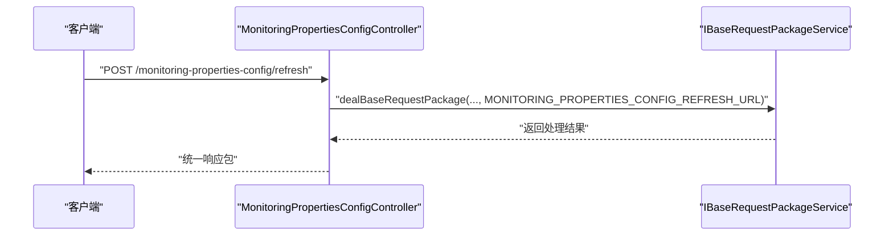

图表来源
- [MonitoringPropertiesConfigController.java:51-54](file://phoenix-agent/src/main/java/com/gitee/pifeng/monitoring/agent/business/client/controller/MonitoringPropertiesConfigController.java#L51-L54)
- [IBaseRequestPackageService.java:14-30](file://phoenix-agent/src/main/java/com/gitee/pifeng/monitoring/agent/business/client/service/IBaseRequestPackageService.java#L14-L30)
- [UrlConstants.java:56-60](file://phoenix-agent/src/main/java/com/gitee/pifeng/monitoring/agent/constant/UrlConstants.java#L56-L60)

章节来源
- [MonitoringPropertiesConfigController.java:19-57](file://phoenix-agent/src/main/java/com/gitee/pifeng/monitoring/agent/business/client/controller/MonitoringPropertiesConfigController.java#L19-L57)
- [IBaseRequestPackageService.java:1-30](file://phoenix-agent/src/main/java/com/gitee/pifeng/monitoring/agent/business/client/service/IBaseRequestPackageService.java#L1-L30)
- [UrlConstants.java:1-127](file://phoenix-agent/src/main/java/com/gitee/pifeng/monitoring/agent/constant/UrlConstants.java#L1-L127)

### 下线控制器（OfflineController）
- 路由前缀：/offline
- 主要接口：/accept-offline-package
- 功能：接收客户端发送的下线信息包，调用下线服务处理并返回统一响应包。
- 请求体与响应体：均使用加密包装包类型。
- 依赖注入：IOfflineService（控制器内部直接调用）
- 异常处理：抛出网络相关异常，由全局异常处理机制捕获。

章节来源
- [OfflineController.java:20-60](file://phoenix-agent/src/main/java/com/gitee/pifeng/monitoring/agent/business/client/controller/OfflineController.java#L20-L60)

## 依赖分析
- 控制器与服务层通过接口解耦，控制器仅持有服务接口引用，运行时由 Spring 容器注入具体实现。
- URL 常量集中管理，控制器通过常量拼接最终服务端接口地址，便于统一维护与配置。
- 统一响应包作为返回值类型，保证接口输出的一致性与可解析性。

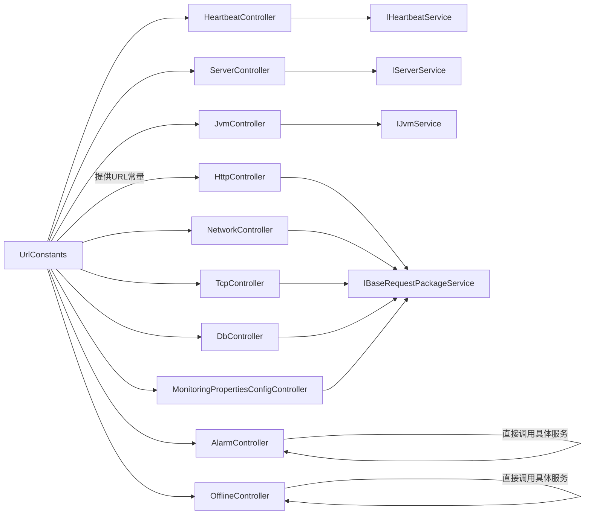

图表来源
- [HeartbeatController.java:34-35](file://phoenix-agent/src/main/java/com/gitee/pifeng/monitoring/agent/business/client/controller/HeartbeatController.java#L34-L35)
- [ServerController.java:34-35](file://phoenix-agent/src/main/java/com/gitee/pifeng/monitoring/agent/business/client/controller/ServerController.java#L34-L35)
- [JvmController.java:34-35](file://phoenix-agent/src/main/java/com/gitee/pifeng/monitoring/agent/business/client/controller/JvmController.java#L34-L35)
- [HttpController.java:38-39](file://phoenix-agent/src/main/java/com/gitee/pifeng/monitoring/agent/business/client/controller/HttpController.java#L38-L39)
- [NetworkController.java:38-39](file://phoenix-agent/src/main/java/com/gitee/pifeng/monitoring/agent/business/client/controller/NetworkController.java#L38-L39)
- [TcpController.java:38-39](file://phoenix-agent/src/main/java/com/gitee/pifeng/monitoring/agent/business/client/controller/TcpController.java#L38-L39)
- [DbController.java:38-39](file://phoenix-agent/src/main/java/com/gitee/pifeng/monitoring/agent/business/client/controller/DbController.java#L38-L39)
- [AlarmController.java:34-35](file://phoenix-agent/src/main/java/com/gitee/pifeng/monitoring/agent/business/client/controller/AlarmController.java#L34-L35)
- [MonitoringPropertiesConfigController.java:35-36](file://phoenix-agent/src/main/java/com/gitee/pifeng/monitoring/agent/business/client/controller/MonitoringPropertiesConfigController.java#L35-L36)
- [OfflineController.java:37-38](file://phoenix-agent/src/main/java/com/gitee/pifeng/monitoring/agent/business/client/controller/OfflineController.java#L37-L38)
- [UrlConstants.java:13-127](file://phoenix-agent/src/main/java/com/gitee/pifeng/monitoring/agent/constant/UrlConstants.java#L13-L127)

章节来源
- [UrlConstants.java:1-127](file://phoenix-agent/src/main/java/com/gitee/pifeng/monitoring/agent/constant/UrlConstants.java#L1-L127)

## 性能考虑
- 控制器层保持“薄”特性，避免在控制器内执行重计算或阻塞操作，所有业务逻辑下沉至服务层。
- 使用统一响应包减少序列化开销，便于后续中间件处理。
- 对于网络探测类接口（HTTP/TCP/网络/数据库），建议结合超时与重试策略，避免阻塞请求线程。
- 通过依赖注入与接口抽象，便于替换实现与横向扩展。

## 故障排查指南
- 参数校验失败：检查请求体是否符合加密包装包类型要求，确认字段映射正确。
- 服务层异常：查看服务实现的日志与异常栈，定位具体业务处理问题。
- 网络探测异常：关注控制器抛出的网络相关异常，检查目标主机可达性与端口开放情况。
- 统一响应包解析：确认客户端侧对统一响应包的解析逻辑与服务端返回一致。

章节来源
- [HttpController.java:56-58](file://phoenix-agent/src/main/java/com/gitee/pifeng/monitoring/agent/business/client/controller/HttpController.java#L56-L58)
- [NetworkController.java:56-58](file://phoenix-agent/src/main/java/com/gitee/pifeng/monitoring/agent/business/client/controller/NetworkController.java#L56-L58)
- [TcpController.java:56-58](file://phoenix-agent/src/main/java/com/gitee/pifeng/monitoring/agent/business/client/controller/TcpController.java#L56-L58)
- [DbController.java:56-58](file://phoenix-agent/src/main/java/com/gitee/pifeng/monitoring/agent/business/client/controller/DbController.java#L56-L58)
- [OfflineController.java:55-57](file://phoenix-agent/src/main/java/com/gitee/pifeng/monitoring/agent/business/client/controller/OfflineController.java#L55-L57)

## 结论
控制器层以清晰的职责划分与统一的接口设计，实现了监控代理端对外服务的标准化接入。通过与服务层的解耦协作、集中化的 URL 管理以及统一的响应包格式，既保障了系统的可维护性，也为后续扩展新的监控维度提供了良好的基座。

## 附录

### REST API 设计原则
- 路由前缀：按功能域划分，如 /heartbeat、/server、/jvm、/http、/network、/tcp、/db、/alarm、/monitoring-properties-config、/offline。
- 方法：统一使用 POST，便于携带加密包装包。
- 请求体与响应体：统一使用加密包装包类型，确保传输安全与一致性。
- 文档：通过 Swagger 注解标注接口描述、请求体与响应体的数据模型。

章节来源
- [HeartbeatController.java:26-56](file://phoenix-agent/src/main/java/com/gitee/pifeng/monitoring/agent/business/client/controller/HeartbeatController.java#L26-L56)
- [ServerController.java:26-55](file://phoenix-agent/src/main/java/com/gitee/pifeng/monitoring/agent/business/client/controller/ServerController.java#L26-L55)
- [JvmController.java:26-55](file://phoenix-agent/src/main/java/com/gitee/pifeng/monitoring/agent/business/client/controller/JvmController.java#L26-L55)
- [HttpController.java:29-61](file://phoenix-agent/src/main/java/com/gitee/pifeng/monitoring/agent/business/client/controller/HttpController.java#L29-L61)
- [NetworkController.java:29-80](file://phoenix-agent/src/main/java/com/gitee/pifeng/monitoring/agent/business/client/controller/NetworkController.java#L29-L80)
- [TcpController.java:29-61](file://phoenix-agent/src/main/java/com/gitee/pifeng/monitoring/agent/business/client/controller/TcpController.java#L29-L61)
- [DbController.java:29-61](file://phoenix-agent/src/main/java/com/gitee/pifeng/monitoring/agent/business/client/controller/DbController.java#L29-L61)
- [AlarmController.java:26-56](file://phoenix-agent/src/main/java/com/gitee/pifeng/monitoring/agent/business/client/controller/AlarmController.java#L26-L56)
- [MonitoringPropertiesConfigController.java:27-57](file://phoenix-agent/src/main/java/com/gitee/pifeng/monitoring/agent/business/client/controller/MonitoringPropertiesConfigController.java#L27-L57)
- [OfflineController.java:28-60](file://phoenix-agent/src/main/java/com/gitee/pifeng/monitoring/agent/business/client/controller/OfflineController.java#L28-L60)

### 请求处理流程与响应格式规范
- 控制器接收请求后，进行必要的参数校验与封装，随后调用服务层接口处理。
- 服务层返回统一响应包，控制器直接返回给客户端。
- 响应包格式保持一致，便于前端与客户端解析。

章节来源
- [HeartbeatController.java:50-53](file://phoenix-agent/src/main/java/com/gitee/pifeng/monitoring/agent/business/client/controller/HeartbeatController.java#L50-L53)
- [ServerController.java:50-53](file://phoenix-agent/src/main/java/com/gitee/pifeng/monitoring/agent/business/client/controller/ServerController.java#L50-L53)
- [JvmController.java:50-53](file://phoenix-agent/src/main/java/com/gitee/pifeng/monitoring/agent/business/client/controller/JvmController.java#L50-L53)
- [HttpController.java:55-58](file://phoenix-agent/src/main/java/com/gitee/pifeng/monitoring/agent/business/client/controller/HttpController.java#L55-L58)
- [NetworkController.java:55-77](file://phoenix-agent/src/main/java/com/gitee/pifeng/monitoring/agent/business/client/controller/NetworkController.java#L55-L77)
- [TcpController.java:55-58](file://phoenix-agent/src/main/java/com/gitee/pifeng/monitoring/agent/business/client/controller/TcpController.java#L55-L58)
- [DbController.java:55-58](file://phoenix-agent/src/main/java/com/gitee/pifeng/monitoring/agent/business/client/controller/DbController.java#L55-L58)
- [AlarmController.java:50-53](file://phoenix-agent/src/main/java/com/gitee/pifeng/monitoring/agent/business/client/controller/AlarmController.java#L50-L53)
- [MonitoringPropertiesConfigController.java:51-54](file://phoenix-agent/src/main/java/com/gitee/pifeng/monitoring/agent/business/client/controller/MonitoringPropertiesConfigController.java#L51-L54)
- [OfflineController.java:54-57](file://phoenix-agent/src/main/java/com/gitee/pifeng/monitoring/agent/business/client/controller/OfflineController.java#L54-L57)

### 控制器与服务层交互方式
- 依赖注入：通过注解注入服务接口，运行时由 Spring 容器装配具体实现。
- 方法调用：控制器仅负责参数绑定与调用服务方法，不包含业务逻辑。
- 异常处理：网络探测类接口可能抛出异常，需由全局异常处理机制捕获并返回统一错误响应。

章节来源
- [HeartbeatController.java:34-35](file://phoenix-agent/src/main/java/com/gitee/pifeng/monitoring/agent/business/client/controller/HeartbeatController.java#L34-L35)
- [ServerController.java:34-35](file://phoenix-agent/src/main/java/com/gitee/pifeng/monitoring/agent/business/client/controller/ServerController.java#L34-L35)
- [JvmController.java:34-35](file://phoenix-agent/src/main/java/com/gitee/pifeng/monitoring/agent/business/client/controller/JvmController.java#L34-L35)
- [HttpController.java:38-39](file://phoenix-agent/src/main/java/com/gitee/pifeng/monitoring/agent/business/client/controller/HttpController.java#L38-L39)
- [NetworkController.java:38-39](file://phoenix-agent/src/main/java/com/gitee/pifeng/monitoring/agent/business/client/controller/NetworkController.java#L38-L39)
- [TcpController.java:38-39](file://phoenix-agent/src/main/java/com/gitee/pifeng/monitoring/agent/business/client/controller/TcpController.java#L38-L39)
- [DbController.java:38-39](file://phoenix-agent/src/main/java/com/gitee/pifeng/monitoring/agent/business/client/controller/DbController.java#L38-L39)
- [MonitoringPropertiesConfigController.java:35-36](file://phoenix-agent/src/main/java/com/gitee/pifeng/monitoring/agent/business/client/controller/MonitoringPropertiesConfigController.java#L35-L36)
- [OfflineController.java:37-38](file://phoenix-agent/src/main/java/com/gitee/pifeng/monitoring/agent/business/client/controller/OfflineController.java#L37-L38)

### 安全机制
- 请求验证：控制器通过注解与 DTO 类型约束请求体结构，确保输入格式正确。
- 权限控制：控制器未显式声明权限注解，建议在网关或全局拦截器处统一鉴权。
- 数据加密：请求体与响应体均使用加密包装包类型，提升传输安全性。

章节来源
- [HeartbeatController.java:47-53](file://phoenix-agent/src/main/java/com/gitee/pifeng/monitoring/agent/business/client/controller/HeartbeatController.java#L47-L53)
- [ServerController.java:47-53](file://phoenix-agent/src/main/java/com/gitee/pifeng/monitoring/agent/business/client/controller/ServerController.java#L47-L53)
- [JvmController.java:47-53](file://phoenix-agent/src/main/java/com/gitee/pifeng/monitoring/agent/business/client/controller/JvmController.java#L47-L53)
- [HttpController.java:52-58](file://phoenix-agent/src/main/java/com/gitee/pifeng/monitoring/agent/business/client/controller/HttpController.java#L52-L58)
- [NetworkController.java:52-77](file://phoenix-agent/src/main/java/com/gitee/pifeng/monitoring/agent/business/client/controller/NetworkController.java#L52-L77)
- [TcpController.java:52-58](file://phoenix-agent/src/main/java/com/gitee/pifeng/monitoring/agent/business/client/controller/TcpController.java#L52-L58)
- [DbController.java:52-58](file://phoenix-agent/src/main/java/com/gitee/pifeng/monitoring/agent/business/client/controller/DbController.java#L52-L58)
- [AlarmController.java:47-53](file://phoenix-agent/src/main/java/com/gitee/pifeng/monitoring/agent/business/client/controller/AlarmController.java#L47-L53)
- [MonitoringPropertiesConfigController.java:48-54](file://phoenix-agent/src/main/java/com/gitee/pifeng/monitoring/agent/business/client/controller/MonitoringPropertiesConfigController.java#L48-L54)
- [OfflineController.java:51-57](file://phoenix-agent/src/main/java/com/gitee/pifeng/monitoring/agent/business/client/controller/OfflineController.java#L51-L57)

### 错误处理策略
- 异常捕获：网络探测类接口可能抛出异常，需由全局异常处理机制捕获并返回统一错误响应。
- 错误码与错误信息：建议在统一响应包中包含错误码与错误信息，便于前端展示与定位问题。

章节来源
- [HttpController.java:56-58](file://phoenix-agent/src/main/java/com/gitee/pifeng/monitoring/agent/business/client/controller/HttpController.java#L56-L58)
- [NetworkController.java:56-58](file://phoenix-agent/src/main/java/com/gitee/pifeng/monitoring/agent/business/client/controller/NetworkController.java#L56-L58)
- [TcpController.java:56-58](file://phoenix-agent/src/main/java/com/gitee/pifeng/monitoring/agent/business/client/controller/TcpController.java#L56-L58)
- [DbController.java:56-58](file://phoenix-agent/src/main/java/com/gitee/pifeng/monitoring/agent/business/client/controller/DbController.java#L56-L58)
- [OfflineController.java:55-57](file://phoenix-agent/src/main/java/com/gitee/pifeng/monitoring/agent/business/client/controller/OfflineController.java#L55-L57)

### 扩展指南：新增 API 接口
- 新建控制器类，使用注解声明路由前缀与接口路径。
- 定义服务接口与实现，确保方法签名与业务需求一致。
- 在 URL 常量中新增对应的 URL 常量，便于统一管理。
- 在控制器中注入服务接口，调用服务方法处理请求并返回统一响应包。
- 补充 Swagger 注解，完善接口文档。
- 如涉及网络探测，注意异常处理与超时控制。

章节来源
- [UrlConstants.java:13-127](file://phoenix-agent/src/main/java/com/gitee/pifeng/monitoring/agent/constant/UrlConstants.java#L13-L127)