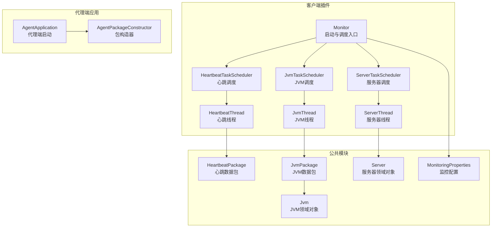
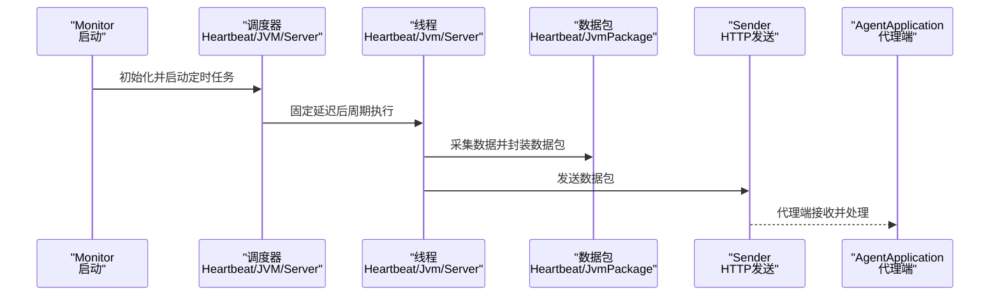
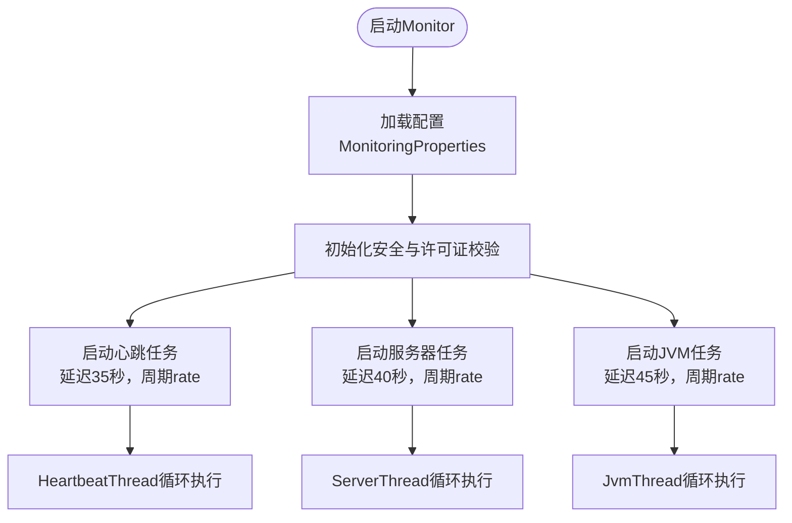
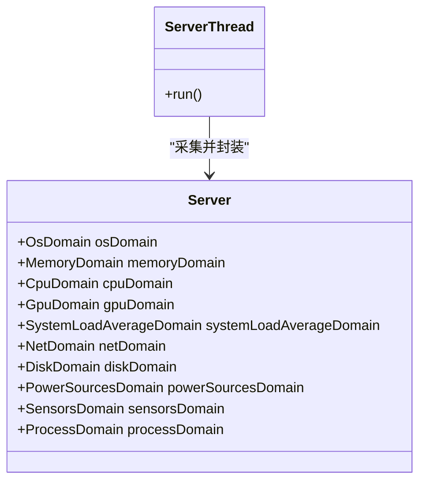
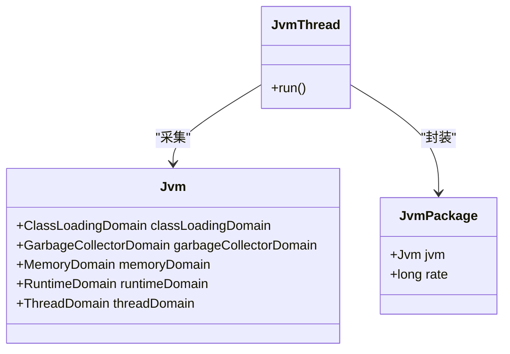
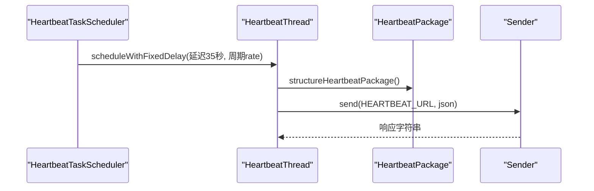
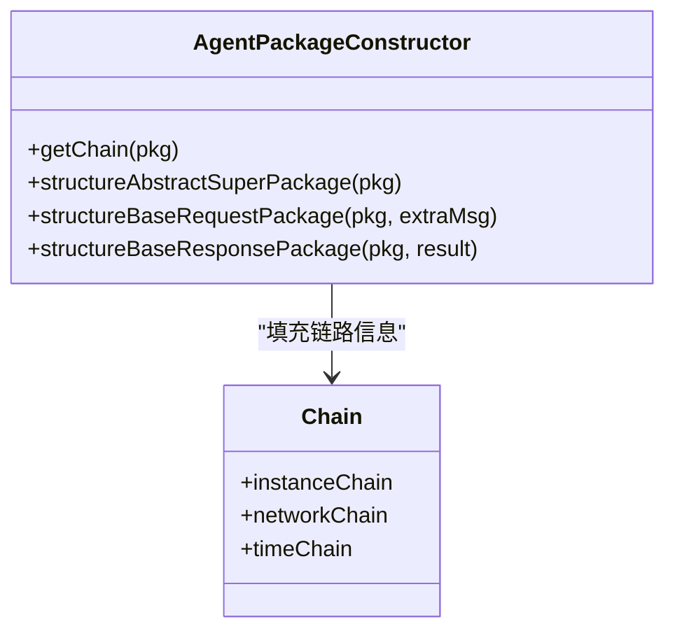
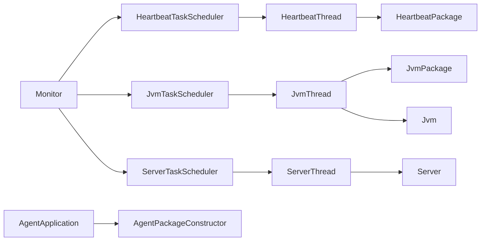

# 数据采集机制

<cite>
**本文引用的文件**
- [AgentApplication.java](file://phoenix-agent/src/main/java/com/gitee/pifeng/monitoring/agent/AgentApplication.java)
- [Monitor.java](file://phoenix-client/phoenix-client-core/src/main/java/com/gitee/pifeng/monitoring/plug/Monitor.java)
- [AgentPackageConstructor.java](file://phoenix-agent/src/main/java/com/gitee/pifeng/monitoring/agent/core/AgentPackageConstructor.java)
- [HeartbeatTaskScheduler.java](file://phoenix-client/phoenix-client-core/src/main/java/com/gitee/pifeng/monitoring/plug/scheduler/HeartbeatTaskScheduler.java)
- [JvmTaskScheduler.java](file://phoenix-client/phoenix-client-core/src/main/java/com/gitee/pifeng/monitoring/plug/scheduler/JvmTaskScheduler.java)
- [ServerTaskScheduler.java](file://phoenix-client/phoenix-client-core/src/main/java/com/gitee/pifeng/monitoring/plug/scheduler/ServerTaskScheduler.java)
- [HeartbeatThread.java](file://phoenix-client/phoenix-client-core/src/main/java/com/gitee/pifeng/monitoring/plug/thread/HeartbeatThread.java)
- [JvmThread.java](file://phoenix-client/phoenix-client-core/src/main/java/com/gitee/pifeng/monitoring/plug/thread/JvmThread.java)
- [ServerThread.java](file://phoenix-client/phoenix-client-core/src/main/java/com/gitee/pifeng/monitoring/plug/thread/ServerThread.java)
- [HeartbeatPackage.java](file://phoenix-common/Phoenix-common-core/src/main/java/com/gitee/pifeng/monitoring/common/dto/HeartbeatPackage.java)
- [JvmPackage.java](file://phoenix-common/Phoenix-common-core/src/main/java/com/gitee/pifeng/monitoring/common/dto/JvmPackage.java)
- [Jvm.java](file://phoenix-common/Phoenix-common-core/src/main/java/com/gitee/pifeng/monitoring/common/domain/Jvm.java)
- [Server.java](file://phoenix-common/Phoenix-common-core/src/main/java/com/gitee/pifeng/monitoring/common/domain/Server.java)
- [MonitoringProperties.java](file://phoenix-common/Phoenix-common-core/src/main/java/com/gitee/pifeng/monitoring/common/property/client/MonitoringProperties.java)
</cite>

## 目录
1. [引言](#引言)
2. [项目结构](#项目结构)
3. [核心组件](#核心组件)
4. [架构总览](#架构总览)
5. [详细组件分析](#详细组件分析)
6. [依赖分析](#依赖分析)
7. [性能考虑](#性能考虑)
8. [故障排查指南](#故障排查指南)
9. [结论](#结论)
10. [附录](#附录)

## 引言
本文面向监控代理端的数据采集机制，系统性阐述定时任务调度、数据收集策略、采样频率控制、系统级指标（CPU、内存、磁盘IO、网络流量等）、JVM监控（堆/非堆内存、GC、线程状态等）、心跳机制（心跳包构造、发送频率、异常检测），以及性能优化策略（批量采集、异步处理、缓存机制）。同时提供扩展新监控指标的实践指南，帮助开发者快速集成新的采集能力。

## 项目结构
Phoenix监控体系由“客户端插件”“公共领域模型”“代理端应用”三部分组成：
- 客户端插件负责采集与上报（心跳、服务器、JVM信息），并以定时任务驱动。
- 公共模块定义数据包、领域对象与配置属性，统一序列化与传输契约。
- 代理端应用负责接收客户端上报的数据包，进行后续处理与存储。

图表来源
- [Monitor.java:67-151](file://phoenix-client/phoenix-client-core/src/main/java/com/gitee/pifeng/monitoring/plug/Monitor.java#L67-L151)
- [HeartbeatTaskScheduler.java:39-43](file://phoenix-client/phoenix-client-core/src/main/java/com/gitee/pifeng/monitoring/plug/scheduler/HeartbeatTaskScheduler.java#L39-L43)
- [JvmTaskScheduler.java:40-48](file://phoenix-client/phoenix-client-core/src/main/java/com/gitee/pifeng/monitoring/plug/scheduler/JvmTaskScheduler.java#L40-L48)
- [ServerTaskScheduler.java:40-48](file://phoenix-client/phoenix-client-core/src/main/java/com/gitee/pifeng/monitoring/plug/scheduler/ServerTaskScheduler.java#L40-L48)
- [HeartbeatThread.java:38-69](file://phoenix-client/phoenix-client-core/src/main/java/com/gitee/pifeng/monitoring/plug/thread/HeartbeatThread.java#L38-L69)
- [JvmThread.java:40-73](file://phoenix-client/phoenix-client-core/src/main/java/com/gitee/pifeng/monitoring/plug/thread/JvmThread.java#L40-L73)
- [ServerThread.java:42-77](file://phoenix-client/phoenix-client-core/src/main/java/com/gitee/pifeng/monitoring/plug/thread/ServerThread.java#L42-L77)
- [HeartbeatPackage.java:20-27](file://phoenix-common/Phoenix-common-core/src/main/java/com/gitee/pifeng/monitoring/common/dto/HeartbeatPackage.java#L20-L27)
- [JvmPackage.java:21-33](file://phoenix-common/Phoenix-common-core/src/main/java/com/gitee/pifeng/monitoring/common/dto/JvmPackage.java#L21-L33)
- [Jvm.java:23-50](file://phoenix-common/Phoenix-common-core/src/main/java/com/gitee/pifeng/monitoring/common/domain/Jvm.java#L23-L50)
- [Server.java:23-75](file://phoenix-common/Phoenix-common-core/src/main/java/com/gitee/pifeng/monitoring/common/domain/Server.java#L23-L75)
- [MonitoringProperties.java:22-55](file://phoenix-common/Phoenix-common-core/src/main/java/com/gitee/pifeng/monitoring/common/property/client/MonitoringProperties.java#L22-L55)
- [AgentApplication.java:28-39](file://phoenix-agent/src/main/java/com/gitee/pifeng/monitoring/agent/AgentApplication.java#L28-L39)
- [AgentPackageConstructor.java:41-135](file://phoenix-agent/src/main/java/com/gitee/pifeng/monitoring/agent/core/AgentPackageConstructor.java#L41-L135)

章节来源
- [Monitor.java:67-151](file://phoenix-client/phoenix-client-core/src/main/java/com/gitee/pifeng/monitoring/plug/Monitor.java#L67-L151)
- [AgentApplication.java:28-39](file://phoenix-agent/src/main/java/com/gitee/pifeng/monitoring/agent/AgentApplication.java#L28-L39)

## 核心组件
- 启动与调度入口：Monitor负责加载配置、校验许可、初始化安全、启动心跳/服务器/JVM定时任务，并注册JVM关闭钩子。
- 定时任务调度器：HeartbeatTaskScheduler、JvmTaskScheduler、ServerTaskScheduler分别按配置的rate与初始延迟启动固定周期任务。
- 采集线程：HeartbeatThread、JvmThread、ServerThread在每次触发时采集数据、封装数据包并通过Sender发送。
- 数据包与领域模型：HeartbeatPackage、JvmPackage承载采集数据；Jvm、Server作为聚合领域对象包含多维度指标。
- 代理端包构造器：AgentPackageConstructor负责为代理端侧构造统一的请求/响应包头信息（实例标识、链路信息、时间戳等）。

章节来源
- [Monitor.java:67-151](file://phoenix-client/phoenix-client-core/src/main/java/com/gitee/pifeng/monitoring/plug/Monitor.java#L67-L151)
- [HeartbeatTaskScheduler.java:39-43](file://phoenix-client/phoenix-client-core/src/main/java/com/gitee/pifeng/monitoring/plug/scheduler/HeartbeatTaskScheduler.java#L39-L43)
- [JvmTaskScheduler.java:40-48](file://phoenix-client/phoenix-client-core/src/main/java/com/gitee/pifeng/monitoring/plug/scheduler/JvmTaskScheduler.java#L40-L48)
- [ServerTaskScheduler.java:40-48](file://phoenix-client/phoenix-client-core/src/main/java/com/gitee/pifeng/monitoring/plug/scheduler/ServerTaskScheduler.java#L40-L48)
- [HeartbeatPackage.java:20-27](file://phoenix-common/Phoenix-common-core/src/main/java/com/gitee/pifeng/monitoring/common/dto/HeartbeatPackage.java#L20-L27)
- [JvmPackage.java:21-33](file://phoenix-common/Phoenix-common-core/src/main/java/com/gitee/pifeng/monitoring/common/dto/JvmPackage.java#L21-L33)
- [Jvm.java:23-50](file://phoenix-common/Phoenix-common-core/src/main/java/com/gitee/pifeng/monitoring/common/domain/Jvm.java#L23-L50)
- [Server.java:23-75](file://phoenix-common/Phoenix-common-core/src/main/java/com/gitee/pifeng/monitoring/common/domain/Server.java#L23-L75)
- [AgentPackageConstructor.java:41-135](file://phoenix-agent/src/main/java/com/gitee/pifeng/monitoring/agent/core/AgentPackageConstructor.java#L41-L135)

## 架构总览
客户端插件通过定时任务周期性采集系统与JVM指标，封装为数据包并发送到服务端；代理端应用负责接收与处理。整体采用“异步定时任务 + 统一数据包格式”的架构，便于扩展与维护。

图表来源
- [Monitor.java:139-148](file://phoenix-client/phoenix-client-core/src/main/java/com/gitee/pifeng/monitoring/plug/Monitor.java#L139-L148)
- [HeartbeatTaskScheduler.java:39-43](file://phoenix-client/phoenix-client-core/src/main/java/com/gitee/pifeng/monitoring/plug/scheduler/HeartbeatTaskScheduler.java#L39-L43)
- [JvmTaskScheduler.java:40-48](file://phoenix-client/phoenix-client-core/src/main/java/com/gitee/pifeng/monitoring/plug/scheduler/JvmTaskScheduler.java#L40-L48)
- [ServerTaskScheduler.java:40-48](file://phoenix-client/phoenix-client-core/src/main/java/com/gitee/pifeng/monitoring/plug/scheduler/ServerTaskScheduler.java#L40-L48)
- [HeartbeatThread.java:38-69](file://phoenix-client/phoenix-client-core/src/main/java/com/gitee/pifeng/monitoring/plug/thread/HeartbeatThread.java#L38-L69)
- [JvmThread.java:40-73](file://phoenix-client/phoenix-client-core/src/main/java/com/gitee/pifeng/monitoring/plug/thread/JvmThread.java#L40-L73)
- [ServerThread.java:42-77](file://phoenix-client/phoenix-client-core/src/main/java/com/gitee/pifeng/monitoring/plug/thread/ServerThread.java#L42-L77)

## 详细组件分析

### 定时任务调度与采样频率控制
- 心跳任务：延迟35秒后，按配置的rate（秒）固定周期执行。
- 服务器任务：延迟40秒后，按配置的rate（秒）固定周期执行。
- JVM任务：延迟45秒后，按配置的rate（秒）固定周期执行。
- 采样频率来源于MonitoringProperties中的heartbeat/serverInfo/jvmInfo配置项，若未显式配置则由配置加载器提供默认值。

图表来源
- [Monitor.java:119-151](file://phoenix-client/phoenix-client-core/src/main/java/com/gitee/pifeng/monitoring/plug/Monitor.java#L119-L151)
- [HeartbeatTaskScheduler.java:39-43](file://phoenix-client/phoenix-client-core/src/main/java/com/gitee/pifeng/monitoring/plug/scheduler/HeartbeatTaskScheduler.java#L39-L43)
- [ServerTaskScheduler.java:40-48](file://phoenix-client/phoenix-client-core/src/main/java/com/gitee/pifeng/monitoring/plug/scheduler/ServerTaskScheduler.java#L40-L48)
- [JvmTaskScheduler.java:40-48](file://phoenix-client/phoenix-client-core/src/main/java/com/gitee/pifeng/monitoring/plug/scheduler/JvmTaskScheduler.java#L40-L48)
- [MonitoringProperties.java:22-55](file://phoenix-common/Phoenix-common-core/src/main/java/com/gitee/pifeng/monitoring/common/property/client/MonitoringProperties.java#L22-L55)

章节来源
- [Monitor.java:119-151](file://phoenix-client/phoenix-client-core/src/main/java/com/gitee/pifeng/monitoring/plug/Monitor.java#L119-L151)
- [HeartbeatTaskScheduler.java:39-43](file://phoenix-client/phoenix-client-core/src/main/java/com/gitee/pifeng/monitoring/plug/scheduler/HeartbeatTaskScheduler.java#L39-L43)
- [ServerTaskScheduler.java:40-48](file://phoenix-client/phoenix-client-core/src/main/java/com/gitee/pifeng/monitoring/plug/scheduler/ServerTaskScheduler.java#L40-L48)
- [JvmTaskScheduler.java:40-48](file://phoenix-client/phoenix-client-core/src/main/java/com/gitee/pifeng/monitoring/plug/scheduler/JvmTaskScheduler.java#L40-L48)
- [MonitoringProperties.java:22-55](file://phoenix-common/Phoenix-common-core/src/main/java/com/gitee/pifeng/monitoring/common/property/client/MonitoringProperties.java#L22-L55)

### 系统级指标采集（CPU、内存、磁盘IO、网络流量）
- 采集来源：ServerThread根据配置选择Sigar或OSHI实现采集，返回Server领域对象。
- Server领域对象聚合：操作系统、内存、CPU、GPU、系统负载、网卡、磁盘、电源、传感器、进程等多维指标。
- 采集策略：按固定周期执行，异常时记录日志（IO异常、Sigar异常、网络异常等）。

图表来源
- [Server.java:23-75](file://phoenix-common/Phoenix-common-core/src/main/java/com/gitee/pifeng/monitoring/common/domain/Server.java#L23-L75)
- [ServerThread.java:42-77](file://phoenix-client/phoenix-client-core/src/main/java/com/gitee/pifeng/monitoring/plug/thread/ServerThread.java#L42-L77)

章节来源
- [ServerThread.java:42-77](file://phoenix-client/phoenix-client-core/src/main/java/com/gitee/pifeng/monitoring/plug/thread/ServerThread.java#L42-L77)
- [Server.java:23-75](file://phoenix-common/Phoenix-common-core/src/main/java/com/gitee/pifeng/monitoring/common/domain/Server.java#L23-L75)

### JVM监控（堆内存、非堆内存、GC、线程状态）
- 采集来源：JvmThread调用JvmUtils获取JVM信息，封装为JvmPackage。
- Jvm领域对象聚合：类加载、GC、内存、运行时、线程等子域。
- 采集策略：按固定周期执行，异常时记录日志。

图表来源
- [Jvm.java:23-50](file://phoenix-common/Phoenix-common-core/src/main/java/com/gitee/pifeng/monitoring/common/domain/Jvm.java#L23-L50)
- [JvmThread.java:40-73](file://phoenix-client/phoenix-client-core/src/main/java/com/gitee/pifeng/monitoring/plug/thread/JvmThread.java#L40-L73)
- [JvmPackage.java:21-33](file://phoenix-common/Phoenix-common-core/src/main/java/com/gitee/pifeng/monitoring/common/dto/JvmPackage.java#L21-L33)

章节来源
- [JvmThread.java:40-73](file://phoenix-client/phoenix-client-core/src/main/java/com/gitee/pifeng/monitoring/plug/thread/JvmThread.java#L40-L73)
- [Jvm.java:23-50](file://phoenix-common/Phoenix-common-core/src/main/java/com/gitee/pifeng/monitoring/common/domain/Jvm.java#L23-L50)
- [JvmPackage.java:21-33](file://phoenix-common/Phoenix-common-core/src/main/java/com/gitee/pifeng/monitoring/common/dto/JvmPackage.java#L21-L33)

### 心跳机制（包构造、发送频率、异常检测）
- 包构造：HeartbeatThread调用ClientPackageConstructor构造HeartbeatPackage。
- 发送频率：HeartbeatTaskScheduler按配置rate（秒）固定周期发送。
- 异常检测：捕获IO异常、网络异常与通用异常；记录耗时并设置阈值告警。

图表来源
- [HeartbeatTaskScheduler.java:39-43](file://phoenix-client/phoenix-client-core/src/main/java/com/gitee/pifeng/monitoring/plug/scheduler/HeartbeatTaskScheduler.java#L39-L43)
- [HeartbeatThread.java:38-69](file://phoenix-client/phoenix-client-core/src/main/java/com/gitee/pifeng/monitoring/plug/thread/HeartbeatThread.java#L38-L69)
- [HeartbeatPackage.java:20-27](file://phoenix-common/Phoenix-common-core/src/main/java/com/gitee/pifeng/monitoring/common/dto/HeartbeatPackage.java#L20-L27)

章节来源
- [HeartbeatTaskScheduler.java:39-43](file://phoenix-client/phoenix-client-core/src/main/java/com/gitee/pifeng/monitoring/plug/scheduler/HeartbeatTaskScheduler.java#L39-L43)
- [HeartbeatThread.java:38-69](file://phoenix-client/phoenix-client-core/src/main/java/com/gitee/pifeng/monitoring/plug/thread/HeartbeatThread.java#L38-L69)
- [HeartbeatPackage.java:20-27](file://phoenix-common/Phoenix-common-core/src/main/java/com/gitee/pifeng/monitoring/common/dto/HeartbeatPackage.java#L20-L27)

### 代理端包构造与链路信息
- AgentPackageConstructor为代理端侧构造统一包头，包括实例端点、实例ID、实例名、语言、应用服务器类型、IP、计算机名、链路信息（实例链路、网络链路、时间链路）。
- 该构造器既可作为Spring Bean注入，也支持静态单例访问，确保在非Spring上下文也能复用。

图表来源
- [AgentPackageConstructor.java:41-135](file://phoenix-agent/src/main/java/com/gitee/pifeng/monitoring/agent/core/AgentPackageConstructor.java#L41-L135)

章节来源
- [AgentPackageConstructor.java:41-135](file://phoenix-agent/src/main/java/com/gitee/pifeng/monitoring/agent/core/AgentPackageConstructor.java#L41-L135)

## 依赖分析
- 客户端插件依赖公共模块的数据包与领域对象，保证跨模块一致性。
- 采集线程依赖工具类（JvmUtils、ServerUtils）与配置加载器（ConfigLoader）。
- 代理端应用依赖包构造器与链路信息生成，确保上报数据具备统一标识与溯源能力。

图表来源
- [Monitor.java:119-151](file://phoenix-client/phoenix-client-core/src/main/java/com/gitee/pifeng/monitoring/plug/Monitor.java#L119-L151)
- [HeartbeatTaskScheduler.java:39-43](file://phoenix-client/phoenix-client-core/src/main/java/com/gitee/pifeng/monitoring/plug/scheduler/HeartbeatTaskScheduler.java#L39-L43)
- [JvmTaskScheduler.java:40-48](file://phoenix-client/phoenix-client-core/src/main/java/com/gitee/pifeng/monitoring/plug/scheduler/JvmTaskScheduler.java#L40-L48)
- [ServerTaskScheduler.java:40-48](file://phoenix-client/phoenix-client-core/src/main/java/com/gitee/pifeng/monitoring/plug/scheduler/ServerTaskScheduler.java#L40-L48)
- [HeartbeatThread.java:38-69](file://phoenix-client/phoenix-client-core/src/main/java/com/gitee/pifeng/monitoring/plug/thread/HeartbeatThread.java#L38-L69)
- [JvmThread.java:40-73](file://phoenix-client/phoenix-client-core/src/main/java/com/gitee/pifeng/monitoring/plug/thread/JvmThread.java#L40-L73)
- [ServerThread.java:42-77](file://phoenix-client/phoenix-client-core/src/main/java/com/gitee/pifeng/monitoring/plug/thread/ServerThread.java#L42-L77)
- [HeartbeatPackage.java:20-27](file://phoenix-common/Phoenix-common-core/src/main/java/com/gitee/pifeng/monitoring/common/dto/HeartbeatPackage.java#L20-L27)
- [JvmPackage.java:21-33](file://phoenix-common/Phoenix-common-core/src/main/java/com/gitee/pifeng/monitoring/common/dto/JvmPackage.java#L21-L33)
- [Jvm.java:23-50](file://phoenix-common/Phoenix-common-core/src/main/java/com/gitee/pifeng/monitoring/common/domain/Jvm.java#L23-L50)
- [Server.java:23-75](file://phoenix-common/Phoenix-common-core/src/main/java/com/gitee/pifeng/monitoring/common/domain/Server.java#L23-L75)
- [AgentApplication.java:28-39](file://phoenix-agent/src/main/java/com/gitee/pifeng/monitoring/agent/AgentApplication.java#L28-L39)
- [AgentPackageConstructor.java:41-135](file://phoenix-agent/src/main/java/com/gitee/pifeng/monitoring/agent/core/AgentPackageConstructor.java#L41-L135)

章节来源
- [Monitor.java:119-151](file://phoenix-client/phoenix-client-core/src/main/java/com/gitee/pifeng/monitoring/plug/Monitor.java#L119-L151)
- [AgentApplication.java:28-39](file://phoenix-agent/src/main/java/com/gitee/pifeng/monitoring/agent/AgentApplication.java#L28-L39)

## 性能考虑
- 异步与定时：采用固定延迟+固定周期的调度策略，避免阻塞主线程，降低抖动影响。
- 资源开销控制：采集线程在finally中统计耗时，超过阈值（秒级）输出warn日志，便于定位慢采集任务。
- 采集粒度：按配置rate控制采样频率，避免高频采集造成系统压力。
- 网络与异常：对IO异常、Sigar异常、网络异常进行分类捕获与降级处理，保障稳定性。
- 扩展建议：新增指标时优先复用现有线程池与包构造器，减少对象创建与上下文切换。

## 故障排查指南
- 心跳异常：检查HeartbeatTaskScheduler的rate配置与网络连通性；查看HeartbeatThread日志中的异常栈与耗时。
- 服务器采集异常：确认是否启用Sigar/OSHI；关注ServerThread对IO与Sigar异常的处理。
- JVM采集异常：检查JvmThread日志，定位JvmUtils采集过程中的异常。
- 代理端链路：确认AgentPackageConstructor是否正确填充实例链路、网络链路与时间链路，以便问题溯源。

章节来源
- [HeartbeatThread.java:50-68](file://phoenix-client/phoenix-client-core/src/main/java/com/gitee/pifeng/monitoring/plug/thread/HeartbeatThread.java#L50-L68)
- [ServerThread.java:56-76](file://phoenix-client/phoenix-client-core/src/main/java/com/gitee/pifeng/monitoring/plug/thread/ServerThread.java#L56-L76)
- [JvmThread.java:54-72](file://phoenix-client/phoenix-client-core/src/main/java/com/gitee/pifeng/monitoring/plug/thread/JvmThread.java#L54-L72)
- [AgentPackageConstructor.java:73-102](file://phoenix-agent/src/main/java/com/gitee/pifeng/monitoring/agent/core/AgentPackageConstructor.java#L73-L102)

## 结论
Phoenix监控代理端的数据采集机制以“定时任务 + 统一数据包 + 代理端包构造器”为核心，实现了心跳、服务器与JVM指标的稳定采集与上报。通过可配置的采样频率、完善的异常处理与链路追踪，系统具备良好的可扩展性与可观测性。开发者可基于现有框架快速扩展新的监控指标。

## 附录

### 扩展新监控指标的实践指南
- 新增领域对象：在公共模块定义新的领域对象（如NewMetric），并在数据包中增加对应字段。
- 新增采集线程：实现Runnable，调用工具类采集数据，封装为数据包并发送。
- 新增调度器：仿照HeartbeatTaskScheduler/JvmTaskScheduler/ServerTaskScheduler，按需配置初始延迟与周期。
- 配置接入：在MonitoringProperties中新增对应配置项，确保可动态调整采样频率。
- 代理端对接：如需代理端处理，可在AgentPackageConstructor中完善包头信息与链路填充逻辑。

章节来源
- [MonitoringProperties.java:22-55](file://phoenix-common/Phoenix-common-core/src/main/java/com/gitee/pifeng/monitoring/common/property/client/MonitoringProperties.java#L22-L55)
- [HeartbeatTaskScheduler.java:39-43](file://phoenix-client/phoenix-client-core/src/main/java/com/gitee/pifeng/monitoring/plug/scheduler/HeartbeatTaskScheduler.java#L39-L43)
- [JvmTaskScheduler.java:40-48](file://phoenix-client/phoenix-client-core/src/main/java/com/gitee/pifeng/monitoring/plug/scheduler/JvmTaskScheduler.java#L40-L48)
- [ServerTaskScheduler.java:40-48](file://phoenix-client/phoenix-client-core/src/main/java/com/gitee/pifeng/monitoring/plug/scheduler/ServerTaskScheduler.java#L40-L48)
- [AgentPackageConstructor.java:41-135](file://phoenix-agent/src/main/java/com/gitee/pifeng/monitoring/agent/core/AgentPackageConstructor.java#L41-L135)