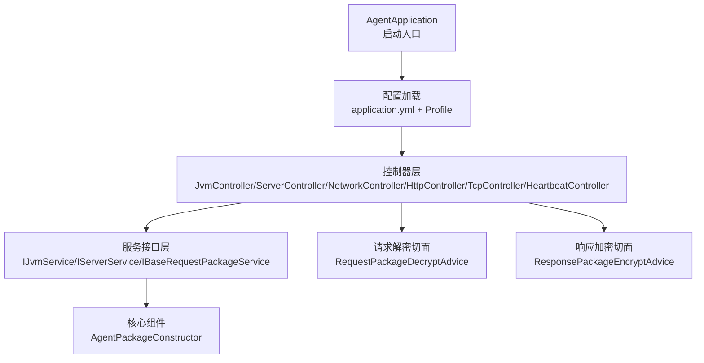
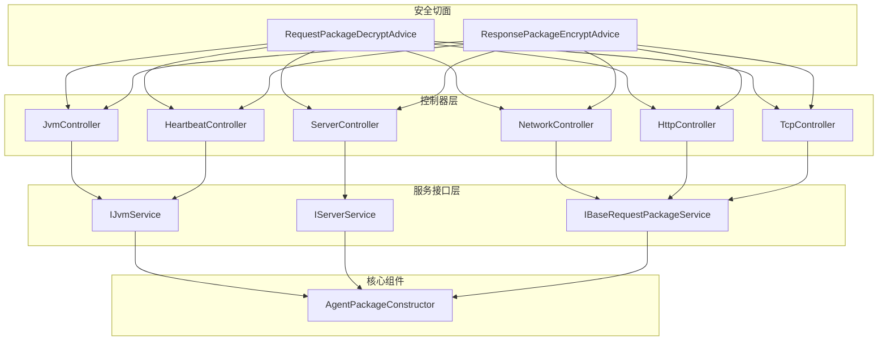
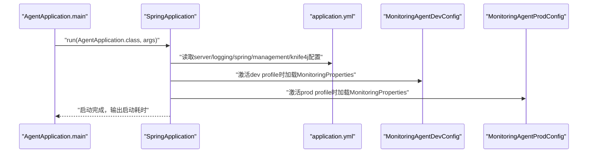
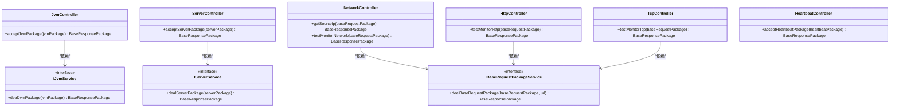
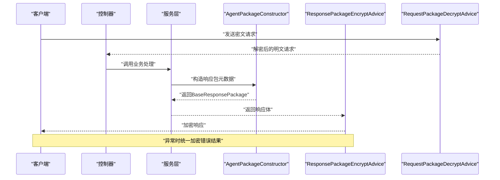
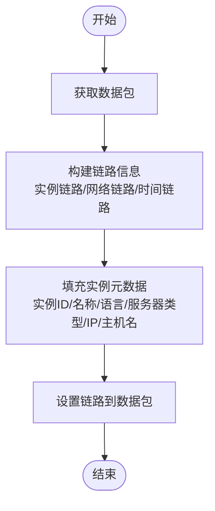
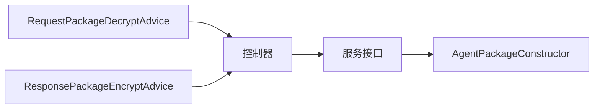

# 监控代理端模块

<cite>
**本文引用的文件**
- [AgentApplication.java](file://phoenix-agent/src/main/java/com/gitee/pifeng/monitoring/agent/AgentApplication.java)
- [application.yml](file://phoenix-agent/src/main/resources/application.yml)
- [application-dev.yml](file://phoenix-agent/src/main/resources/application-dev.yml)
- [application-prod.yml](file://phoenix-agent/src/main/resources/application-prod.yml)
- [MonitoringAgentDevConfig.java](file://phoenix-agent/src/main/java/com/gitee/pifeng/monitoring/agent/config/MonitoringAgentDevConfig.java)
- [MonitoringAgentProdConfig.java](file://phoenix-agent/src/main/java/com/gitee/pifeng/monitoring/agent/config/MonitoringAgentProdConfig.java)
- [JvmController.java](file://phoenix-agent/src/main/java/com/gitee/pifeng/monitoring/agent/business/client/controller/JvmController.java)
- [ServerController.java](file://phoenix-agent/src/main/java/com/gitee/pifeng/monitoring/agent/business/client/controller/ServerController.java)
- [NetworkController.java](file://phoenix-agent/src/main/java/com/gitee/pifeng/monitoring/agent/business/client/controller/NetworkController.java)
- [HttpController.java](file://phoenix-agent/src/main/java/com/gitee/pifeng/monitoring/agent/business/client/controller/HttpController.java)
- [TcpController.java](file://phoenix-agent/src/main/java/com/gitee/pifeng/monitoring/agent/business/client/controller/TcpController.java)
- [HeartbeatController.java](file://phoenix-agent/src/main/java/com/gitee/pifeng/monitoring/agent/business/client/controller/HeartbeatController.java)
- [IJvmService.java](file://phoenix-agent/src/main/java/com/gitee/pifeng/monitoring/agent/business/client/service/IJvmService.java)
- [IServerService.java](file://phoenix-agent/src/main/java/com/gitee/pifeng/monitoring/agent/business/client/service/IServerService.java)
- [IBaseRequestPackageService.java](file://phoenix-agent/src/main/java/com/gitee/pifeng/monitoring/agent/business/client/service/IBaseRequestPackageService.java)
- [AgentPackageConstructor.java](file://phoenix-agent/src/main/java/com/gitee/pifeng/monitoring/agent/core/AgentPackageConstructor.java)
- [RequestPackageDecryptAdvice.java](file://phoenix-agent/src/main/java/com/gitee/pifeng/monitoring/agent/component/RequestPackageDecryptAdvice.java)
- [ResponsePackageEncryptAdvice.java](file://phoenix-agent/src/main/java/com/gitee/pifeng/monitoring/agent/component/ResponsePackageEncryptAdvice.java)
</cite>

## 目录
1. [简介](#简介)
2. [项目结构](#项目结构)
3. [核心组件](#核心组件)
4. [架构总览](#架构总览)
5. [详细组件分析](#详细组件分析)
6. [依赖分析](#依赖分析)
7. [性能考量](#性能考量)
8. [故障排查指南](#故障排查指南)
9. [结论](#结论)
10. [附录](#附录)

## 简介
本文件面向监控代理端模块（Agent），系统化阐述其架构设计、启动流程、控制器层职责、数据采集与传输协议、配置管理、扩展机制以及部署运维要点。目标是帮助开发者与运维人员快速理解并高效维护代理端。

## 项目结构
代理端采用Spring Boot应用，基于多层架构组织业务代码：
- 启动入口：AgentApplication
- 配置层：application.yml及开发/生产环境配置类
- 控制器层：面向客户端的各类业务控制器（JVM、服务器、网络、HTTP、TCP、心跳）
- 服务层：接口与实现（IJvmService、IServerService、IBaseRequestPackageService）
- 核心组件：包构造器AgentPackageConstructor、请求解密/响应加密切面
- 常量与工具：UrlConstants、通用DTO/Domain等位于公共模块

图表来源
- [AgentApplication.java:30-37](file://phoenix-agent/src/main/java/com/gitee/pifeng/monitoring/agent/AgentApplication.java#L30-L37)
- [application.yml:1-111](file://phoenix-agent/src/main/resources/application.yml#L1-L111)
- [JvmController.java:26-54](file://phoenix-agent/src/main/java/com/gitee/pifeng/monitoring/agent/business/client/controller/JvmController.java#L26-L54)
- [ServerController.java:26-54](file://phoenix-agent/src/main/java/com/gitee/pifeng/monitoring/agent/business/client/controller/ServerController.java#L26-L54)
- [NetworkController.java:29-79](file://phoenix-agent/src/main/java/com/gitee/pifeng/monitoring/agent/business/client/controller/NetworkController.java#L29-L79)
- [HttpController.java:29-60](file://phoenix-agent/src/main/java/com/gitee/pifeng/monitoring/agent/business/client/controller/HttpController.java#L29-L60)
- [TcpController.java:29-60](file://phoenix-agent/src/main/java/com/gitee/pifeng/monitoring/agent/business/client/controller/TcpController.java#L29-L60)
- [HeartbeatController.java:26-55](file://phoenix-agent/src/main/java/com/gitee/pifeng/monitoring/agent/business/client/controller/HeartbeatController.java#L26-L55)
- [IJvmService.java:14-28](file://phoenix-agent/src/main/java/com/gitee/pifeng/monitoring/agent/business/client/service/IJvmService.java#L14-L28)
- [IServerService.java:14-28](file://phoenix-agent/src/main/java/com/gitee/pifeng/monitoring/agent/business/client/service/IServerService.java#L14-L28)
- [IBaseRequestPackageService.java:14-29](file://phoenix-agent/src/main/java/com/gitee/pifeng/monitoring/agent/business/client/service/IBaseRequestPackageService.java#L14-L29)
- [AgentPackageConstructor.java:40-202](file://phoenix-agent/src/main/java/com/gitee/pifeng/monitoring/agent/core/AgentPackageConstructor.java#L40-L202)
- [RequestPackageDecryptAdvice.java:22-55](file://phoenix-agent/src/main/java/com/gitee/pifeng/monitoring/agent/component/RequestPackageDecryptAdvice.java#L22-L55)
- [ResponsePackageEncryptAdvice.java:31-83](file://phoenix-agent/src/main/java/com/gitee/pifeng/monitoring/agent/component/ResponsePackageEncryptAdvice.java#L31-L83)

章节来源
- [AgentApplication.java:14-39](file://phoenix-agent/src/main/java/com/gitee/pifeng/monitoring/agent/AgentApplication.java#L14-L39)
- [application.yml:1-111](file://phoenix-agent/src/main/resources/application.yml#L1-L111)

## 核心组件
- 启动入口与Web容器定制：AgentApplication继承Web容器定制基类，使用计时器统计启动耗时，开启重试注解与组件扫描。
- 配置体系：application.yml集中管理服务器、日志、Spring、Actuator、Knife4j/SpringDoc等；开发/生产环境分别由MonitoringAgentDevConfig/MonitoringAgentProdConfig加载监控属性。
- 控制器层：提供JVM、服务器、网络（含HTTP/TCP连通性）、心跳等REST接口，统一接收密文包并返回密文包。
- 包构造器：AgentPackageConstructor负责为请求/响应包填充实例、链路、时间戳等元数据，确保跨模块一致性。
- 安全切面：RequestPackageDecryptAdvice在入站阶段解密请求体；ResponsePackageEncryptAdvice在出站阶段加密响应体，并统一异常处理为密文包。

章节来源
- [AgentApplication.java:23-39](file://phoenix-agent/src/main/java/com/gitee/pifeng/monitoring/agent/AgentApplication.java#L23-L39)
- [application.yml:1-111](file://phoenix-agent/src/main/resources/application.yml#L1-L111)
- [MonitoringAgentDevConfig.java:18-37](file://phoenix-agent/src/main/java/com/gitee/pifeng/monitoring/agent/config/MonitoringAgentDevConfig.java#L18-L37)
- [MonitoringAgentProdConfig.java:18-37](file://phoenix-agent/src/main/java/com/gitee/pifeng/monitoring/agent/config/MonitoringAgentProdConfig.java#L18-L37)
- [JvmController.java:26-54](file://phoenix-agent/src/main/java/com/gitee/pifeng/monitoring/agent/business/client/controller/JvmController.java#L26-L54)
- [ServerController.java:26-54](file://phoenix-agent/src/main/java/com/gitee/pifeng/monitoring/agent/business/client/controller/ServerController.java#L26-L54)
- [NetworkController.java:29-79](file://phoenix-agent/src/main/java/com/gitee/pifeng/monitoring/agent/business/client/controller/NetworkController.java#L29-L79)
- [HttpController.java:29-60](file://phoenix-agent/src/main/java/com/gitee/pifeng/monitoring/agent/business/client/controller/HttpController.java#L29-L60)
- [TcpController.java:29-60](file://phoenix-agent/src/main/java/com/gitee/pifeng/monitoring/agent/business/client/controller/TcpController.java#L29-L60)
- [HeartbeatController.java:26-55](file://phoenix-agent/src/main/java/com/gitee/pifeng/monitoring/agent/business/client/controller/HeartbeatController.java#L26-L55)
- [AgentPackageConstructor.java:40-202](file://phoenix-agent/src/main/java/com/gitee/pifeng/monitoring/agent/core/AgentPackageConstructor.java#L40-L202)
- [RequestPackageDecryptAdvice.java:22-55](file://phoenix-agent/src/main/java/com/gitee/pifeng/monitoring/agent/component/RequestPackageDecryptAdvice.java#L22-L55)
- [ResponsePackageEncryptAdvice.java:31-83](file://phoenix-agent/src/main/java/com/gitee/pifeng/monitoring/agent/component/ResponsePackageEncryptAdvice.java#L31-L83)

## 架构总览
代理端采用“控制器-服务-核心组件-安全切面”的分层架构，结合统一的包构造与加解密机制，形成端到端的监控数据通道。

图表来源
- [JvmController.java:26-54](file://phoenix-agent/src/main/java/com/gitee/pifeng/monitoring/agent/business/client/controller/JvmController.java#L26-L54)
- [ServerController.java:26-54](file://phoenix-agent/src/main/java/com/gitee/pifeng/monitoring/agent/business/client/controller/ServerController.java#L26-L54)
- [NetworkController.java:29-79](file://phoenix-agent/src/main/java/com/gitee/pifeng/monitoring/agent/business/client/controller/NetworkController.java#L29-L79)
- [HttpController.java:29-60](file://phoenix-agent/src/main/java/com/gitee/pifeng/monitoring/agent/business/client/controller/HttpController.java#L29-L60)
- [TcpController.java:29-60](file://phoenix-agent/src/main/java/com/gitee/pifeng/monitoring/agent/business/client/controller/TcpController.java#L29-L60)
- [HeartbeatController.java:26-55](file://phoenix-agent/src/main/java/com/gitee/pifeng/monitoring/agent/business/client/controller/HeartbeatController.java#L26-L55)
- [IJvmService.java:14-28](file://phoenix-agent/src/main/java/com/gitee/pifeng/monitoring/agent/business/client/service/IJvmService.java#L14-L28)
- [IServerService.java:14-28](file://phoenix-agent/src/main/java/com/gitee/pifeng/monitoring/agent/business/client/service/IServerService.java#L14-L28)
- [IBaseRequestPackageService.java:14-29](file://phoenix-agent/src/main/java/com/gitee/pifeng/monitoring/agent/business/client/service/IBaseRequestPackageService.java#L14-L29)
- [AgentPackageConstructor.java:40-202](file://phoenix-agent/src/main/java/com/gitee/pifeng/monitoring/agent/core/AgentPackageConstructor.java#L40-L202)
- [RequestPackageDecryptAdvice.java:22-55](file://phoenix-agent/src/main/java/com/gitee/pifeng/monitoring/agent/component/RequestPackageDecryptAdvice.java#L22-L55)
- [ResponsePackageEncryptAdvice.java:31-83](file://phoenix-agent/src/main/java/com/gitee/pifeng/monitoring/agent/component/ResponsePackageEncryptAdvice.java#L31-L83)

## 详细组件分析

### 启动流程与配置加载
- 启动入口：AgentApplication通过SpringApplication.run启动应用，记录启动耗时。
- Web容器：继承容器定制基类，便于统一配置与扩展。
- 配置加载：application.yml定义服务器、日志、Spring、Actuator、Knife4j/SpringDoc等；开发/生产环境通过MonitoringAgentDevConfig/MonitoringAgentProdConfig注入MonitoringProperties，加载对应属性文件。

图表来源
- [AgentApplication.java:30-37](file://phoenix-agent/src/main/java/com/gitee/pifeng/monitoring/agent/AgentApplication.java#L30-L37)
- [application.yml:1-111](file://phoenix-agent/src/main/resources/application.yml#L1-L111)
- [MonitoringAgentDevConfig.java:31-35](file://phoenix-agent/src/main/java/com/gitee/pifeng/monitoring/agent/config/MonitoringAgentDevConfig.java#L31-L35)
- [MonitoringAgentProdConfig.java:31-35](file://phoenix-agent/src/main/java/com/gitee/pifeng/monitoring/agent/config/MonitoringAgentProdConfig.java#L31-L35)

章节来源
- [AgentApplication.java:23-39](file://phoenix-agent/src/main/java/com/gitee/pifeng/monitoring/agent/AgentApplication.java#L23-L39)
- [application.yml:1-111](file://phoenix-agent/src/main/resources/application.yml#L1-L111)
- [MonitoringAgentDevConfig.java:18-37](file://phoenix-agent/src/main/java/com/gitee/pifeng/monitoring/agent/config/MonitoringAgentDevConfig.java#L18-L37)
- [MonitoringAgentProdConfig.java:18-37](file://phoenix-agent/src/main/java/com/gitee/pifeng/monitoring/agent/config/MonitoringAgentProdConfig.java#L18-L37)

### 控制器层职责划分
- JVM控制器：接收JvmPackage，交由IJvmService处理并返回密文响应。
- 服务器控制器：接收ServerPackage，交由IServerService处理并返回密文响应。
- 网络控制器：提供获取源IP与测试网络连通性的接口，委托IBaseRequestPackageService处理。
- HTTP/TCP控制器：提供测试HTTP/TCP连通性的接口，委托IBaseRequestPackageService处理。
- 心跳控制器：接收HeartbeatPackage，返回处理结果。

图表来源
- [JvmController.java:26-54](file://phoenix-agent/src/main/java/com/gitee/pifeng/monitoring/agent/business/client/controller/JvmController.java#L26-L54)
- [ServerController.java:26-54](file://phoenix-agent/src/main/java/com/gitee/pifeng/monitoring/agent/business/client/controller/ServerController.java#L26-L54)
- [NetworkController.java:29-79](file://phoenix-agent/src/main/java/com/gitee/pifeng/monitoring/agent/business/client/controller/NetworkController.java#L29-L79)
- [HttpController.java:29-60](file://phoenix-agent/src/main/java/com/gitee/pifeng/monitoring/agent/business/client/controller/HttpController.java#L29-L60)
- [TcpController.java:29-60](file://phoenix-agent/src/main/java/com/gitee/pifeng/monitoring/agent/business/client/controller/TcpController.java#L29-L60)
- [HeartbeatController.java:26-55](file://phoenix-agent/src/main/java/com/gitee/pifeng/monitoring/agent/business/client/controller/HeartbeatController.java#L26-L55)
- [IJvmService.java:14-28](file://phoenix-agent/src/main/java/com/gitee/pifeng/monitoring/agent/business/client/service/IJvmService.java#L14-L28)
- [IServerService.java:14-28](file://phoenix-agent/src/main/java/com/gitee/pifeng/monitoring/agent/business/client/service/IServerService.java#L14-L28)
- [IBaseRequestPackageService.java:14-29](file://phoenix-agent/src/main/java/com/gitee/pifeng/monitoring/agent/business/client/service/IBaseRequestPackageService.java#L14-L29)

章节来源
- [JvmController.java:18-54](file://phoenix-agent/src/main/java/com/gitee/pifeng/monitoring/agent/business/client/controller/JvmController.java#L18-L54)
- [ServerController.java:18-54](file://phoenix-agent/src/main/java/com/gitee/pifeng/monitoring/agent/business/client/controller/ServerController.java#L18-L54)
- [NetworkController.java:21-79](file://phoenix-agent/src/main/java/com/gitee/pifeng/monitoring/agent/business/client/controller/NetworkController.java#L21-L79)
- [HttpController.java:21-60](file://phoenix-agent/src/main/java/com/gitee/pifeng/monitoring/agent/business/client/controller/HttpController.java#L21-L60)
- [TcpController.java:21-60](file://phoenix-agent/src/main/java/com/gitee/pifeng/monitoring/agent/business/client/controller/TcpController.java#L21-L60)
- [HeartbeatController.java:18-55](file://phoenix-agent/src/main/java/com/gitee/pifeng/monitoring/agent/business/client/controller/HeartbeatController.java#L18-L55)

### 数据采集与传输协议
- 数据包封装：AgentPackageConstructor为请求/响应包填充实例标识、应用服务器类型、IP、计算机名、链路信息与时间戳等元数据。
- 加密/解密：请求在进入控制器前由RequestPackageDecryptAdvice解密；响应在返回客户端前由ResponsePackageEncryptAdvice加密；异常统一转为密文包返回。
- 传输机制：控制器接收密文包（CiphertextPackage），经服务处理后返回密文包，确保端到端安全。

图表来源
- [AgentPackageConstructor.java:193-202](file://phoenix-agent/src/main/java/com/gitee/pifeng/monitoring/agent/core/AgentPackageConstructor.java#L193-L202)
- [ResponsePackageEncryptAdvice.java:55-81](file://phoenix-agent/src/main/java/com/gitee/pifeng/monitoring/agent/component/ResponsePackageEncryptAdvice.java#L55-L81)
- [RequestPackageDecryptAdvice.java:28-53](file://phoenix-agent/src/main/java/com/gitee/pifeng/monitoring/agent/component/RequestPackageDecryptAdvice.java#L28-L53)

章节来源
- [AgentPackageConstructor.java:40-202](file://phoenix-agent/src/main/java/com/gitee/pifeng/monitoring/agent/core/AgentPackageConstructor.java#L40-L202)
- [ResponsePackageEncryptAdvice.java:31-83](file://phoenix-agent/src/main/java/com/gitee/pifeng/monitoring/agent/component/ResponsePackageEncryptAdvice.java#L31-L83)
- [RequestPackageDecryptAdvice.java:14-55](file://phoenix-agent/src/main/java/com/gitee/pifeng/monitoring/agent/component/RequestPackageDecryptAdvice.java#L14-L55)

### 链路与元数据构建流程

图表来源
- [AgentPackageConstructor.java:73-135](file://phoenix-agent/src/main/java/com/gitee/pifeng/monitoring/agent/core/AgentPackageConstructor.java#L73-L135)

章节来源
- [AgentPackageConstructor.java:73-135](file://phoenix-agent/src/main/java/com/gitee/pifeng/monitoring/agent/core/AgentPackageConstructor.java#L73-L135)

## 依赖分析
- 组件耦合：控制器仅依赖服务接口，服务依赖包构造器以生成标准响应包；安全切面横切控制器，降低重复逻辑。
- 外部依赖：通过MonitoringProperties加载外部配置；使用Knife4j/SpringDoc提供接口文档；Actuator暴露健康与关闭端点。
- 风险点：控制器直接依赖服务接口，建议保持接口稳定；加解密切面作用域限定在指定包，避免误伤其他模块。

图表来源
- [JvmController.java:34-52](file://phoenix-agent/src/main/java/com/gitee/pifeng/monitoring/agent/business/client/controller/JvmController.java#L34-L52)
- [ServerController.java:34-52](file://phoenix-agent/src/main/java/com/gitee/pifeng/monitoring/agent/business/client/controller/ServerController.java#L34-L52)
- [NetworkController.java:38-76](file://phoenix-agent/src/main/java/com/gitee/pifeng/monitoring/agent/business/client/controller/NetworkController.java#L38-L76)
- [HttpController.java:38-57](file://phoenix-agent/src/main/java/com/gitee/pifeng/monitoring/agent/business/client/controller/HttpController.java#L38-L57)
- [TcpController.java:38-57](file://phoenix-agent/src/main/java/com/gitee/pifeng/monitoring/agent/business/client/controller/TcpController.java#L38-L57)
- [HeartbeatController.java:34-52](file://phoenix-agent/src/main/java/com/gitee/pifeng/monitoring/agent/business/client/controller/HeartbeatController.java#L34-L52)
- [AgentPackageConstructor.java:40-202](file://phoenix-agent/src/main/java/com/gitee/pifeng/monitoring/agent/core/AgentPackageConstructor.java#L40-L202)
- [RequestPackageDecryptAdvice.java:22-55](file://phoenix-agent/src/main/java/com/gitee/pifeng/monitoring/agent/component/RequestPackageDecryptAdvice.java#L22-L55)
- [ResponsePackageEncryptAdvice.java:31-83](file://phoenix-agent/src/main/java/com/gitee/pifeng/monitoring/agent/component/ResponsePackageEncryptAdvice.java#L31-L83)

章节来源
- [IJvmService.java:14-28](file://phoenix-agent/src/main/java/com/gitee/pifeng/monitoring/agent/business/client/service/IJvmService.java#L14-L28)
- [IServerService.java:14-28](file://phoenix-agent/src/main/java/com/gitee/pifeng/monitoring/agent/business/client/service/IServerService.java#L14-L28)
- [IBaseRequestPackageService.java:14-29](file://phoenix-agent/src/main/java/com/gitee/pifeng/monitoring/agent/business/client/service/IBaseRequestPackageService.java#L14-L29)

## 性能考量
- 启动耗时：启动入口记录启动计时，便于评估优化效果。
- 异步与超时：application.yml设置请求异步超时时间，避免阻塞。
- 日志与JMX：关闭JMX以减少开销；日志级别按模块设置，避免冗余。
- 端点安全：仅本地暴露管理端点，降低攻击面。

章节来源
- [AgentApplication.java:30-37](file://phoenix-agent/src/main/java/com/gitee/pifeng/monitoring/agent/AgentApplication.java#L30-L37)
- [application.yml:36-56](file://phoenix-agent/src/main/resources/application.yml#L36-L56)
- [application.yml:60-74](file://phoenix-agent/src/main/resources/application.yml#L60-L74)

## 故障排查指南
- 接口异常统一加密：ResponsePackageEncryptAdvice捕获异常并返回密文包，便于前端统一处理。
- 解密失败：确认RequestPackageDecryptAdvice生效范围与消息转换器配置一致。
- 响应为空：beforeBodyWrite返回null时直接透传，检查服务层是否正确返回对象。
- 日志定位：异常时记录客户端地址与URI，结合日志级别定位问题。

章节来源
- [ResponsePackageEncryptAdvice.java:55-81](file://phoenix-agent/src/main/java/com/gitee/pifeng/monitoring/agent/component/ResponsePackageEncryptAdvice.java#L55-L81)
- [RequestPackageDecryptAdvice.java:28-53](file://phoenix-agent/src/main/java/com/gitee/pifeng/monitoring/agent/component/RequestPackageDecryptAdvice.java#L28-L53)

## 结论
代理端模块通过清晰的分层架构、统一的包构造与加解密机制，实现了安全、可扩展的监控数据通道。配合完善的配置与文档能力，能够满足开发与运维场景下的多样化需求。

## 附录

### 配置管理说明
- 服务器与Web：context-path、Undertow访问日志、优雅停机、生命周期超时等。
- 日志：Logback配置、模块日志级别。
- Spring：关闭JMX、异步超时、时区、应用名、devtools热重载端口。
- Actuator：暴露health与shutdown端点，限制本地访问。
- Knife4j/SpringDoc：增强接口文档、基本认证、UI语言与动态参数调试。

章节来源
- [application.yml:1-111](file://phoenix-agent/src/main/resources/application.yml#L1-L111)
- [application-dev.yml:1-3](file://phoenix-agent/src/main/resources/application-dev.yml#L1-L3)
- [application-prod.yml:1-3](file://phoenix-agent/src/main/resources/application-prod.yml#L1-L3)

### 扩展机制
- 新增监控指标：新增服务接口与实现，控制器新增路由，遵循现有加解密与包构造规范。
- 自定义数据处理：在AgentPackageConstructor中扩展元数据字段或链路信息，确保跨模块一致性。

章节来源
- [IJvmService.java:14-28](file://phoenix-agent/src/main/java/com/gitee/pifeng/monitoring/agent/business/client/service/IJvmService.java#L14-L28)
- [IServerService.java:14-28](file://phoenix-agent/src/main/java/com/gitee/pifeng/monitoring/agent/business/client/service/IServerService.java#L14-L28)
- [IBaseRequestPackageService.java:14-29](file://phoenix-agent/src/main/java/com/gitee/pifeng/monitoring/agent/business/client/service/IBaseRequestPackageService.java#L14-L29)
- [AgentPackageConstructor.java:40-202](file://phoenix-agent/src/main/java/com/gitee/pifeng/monitoring/agent/core/AgentPackageConstructor.java#L40-L202)

### 部署与运维指南
- 环境配置：通过profile选择开发/生产环境，加载对应属性文件。
- 端口与上下文：根据application.yml配置端口与context-path。
- 文档访问：通过Knife4j/Swagger UI访问接口文档，Basic认证默认用户名/密码见配置。
- 运维端点：仅本地可访问shutdown与health端点，注意安全边界。

章节来源
- [MonitoringAgentDevConfig.java:31-35](file://phoenix-agent/src/main/java/com/gitee/pifeng/monitoring/agent/config/MonitoringAgentDevConfig.java#L31-L35)
- [MonitoringAgentProdConfig.java:31-35](file://phoenix-agent/src/main/java/com/gitee/pifeng/monitoring/agent/config/MonitoringAgentProdConfig.java#L31-L35)
- [application.yml:76-111](file://phoenix-agent/src/main/resources/application.yml#L76-L111)