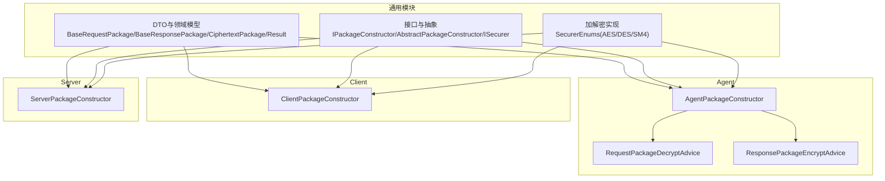
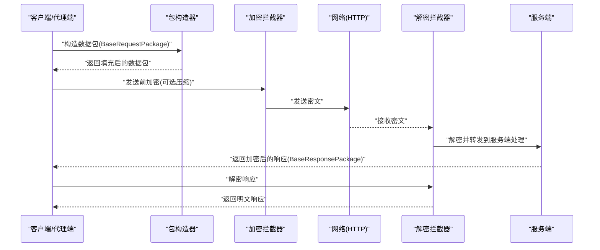
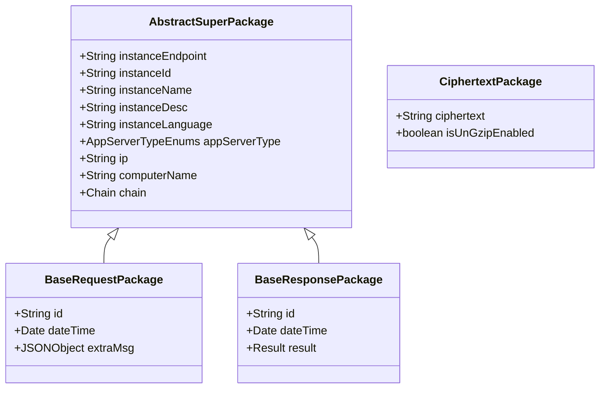
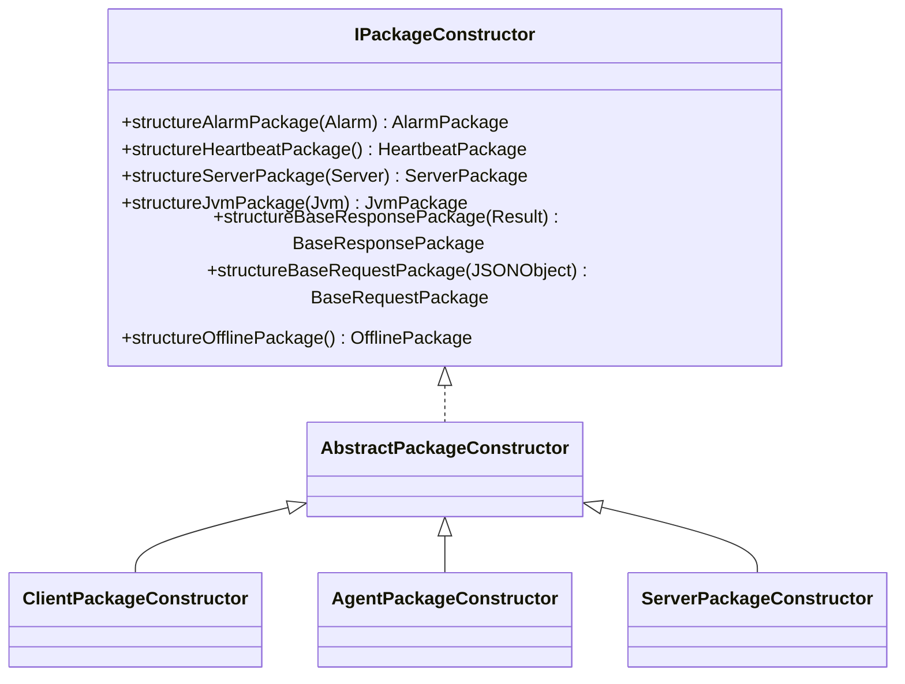
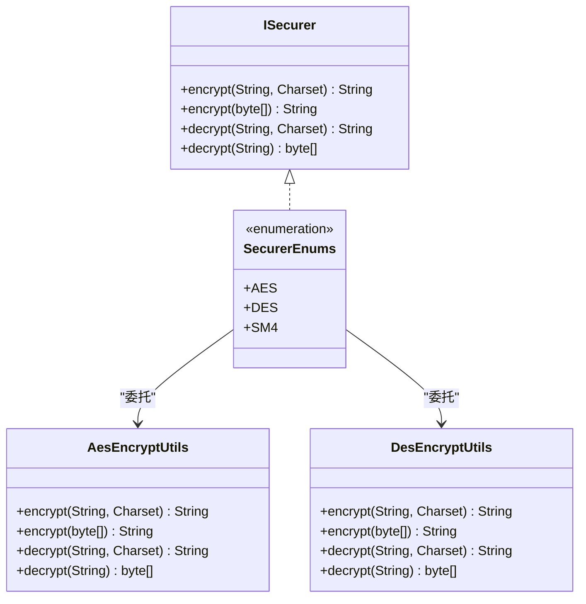
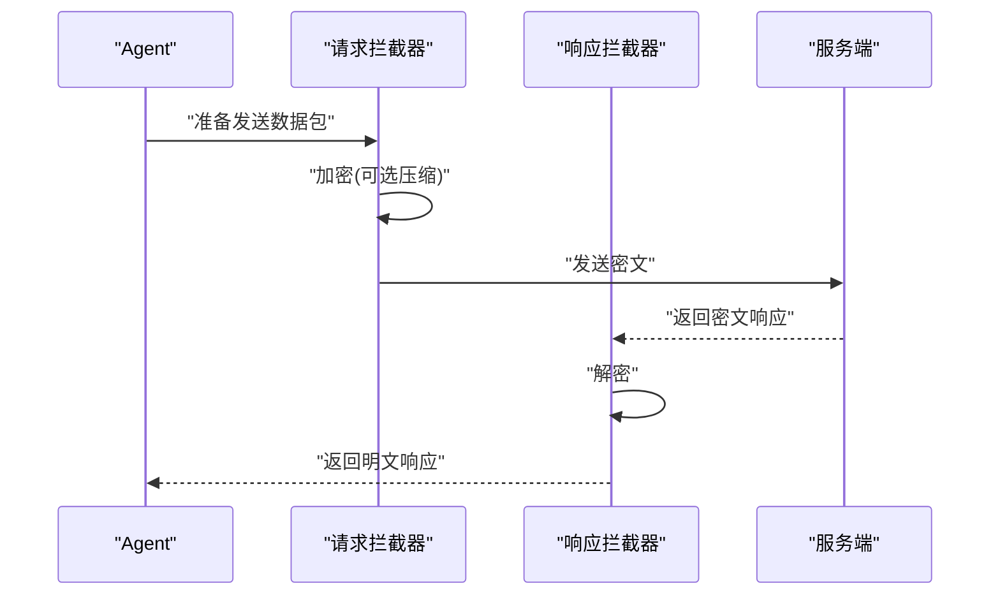
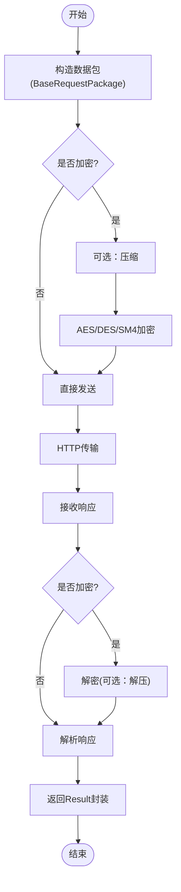
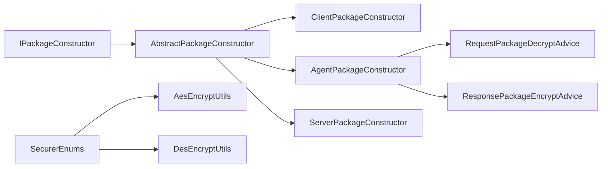

# 通信协议与传输

<cite>
**本文引用的文件**
- [BaseRequestPackage.java](file://phoenix-common\phoenix-common-core\src\main\java\com\gitee\pifeng\monitoring\common\dto\BaseRequestPackage.java)
- [BaseResponsePackage.java](file://phoenix-common\phoenix-common-core\src\main\java\com\gitee\pifeng\monitoring\common\dto\BaseResponsePackage.java)
- [CiphertextPackage.java](file://phoenix-common\phoenix-common-core\src\main\java\com\gitee\pifeng\monitoring\common\dto\CiphertextPackage.java)
- [IPackageConstructor.java](file://phoenix-common\phoenix-common-core\src\main\java\com\gitee\pifeng\monitoring\common\inf\IPackageConstructor.java)
- [AbstractPackageConstructor.java](file://phoenix-common\phoenix-common-core\src\main\java\com\gitee\pifeng\monitoring\common\abs\AbstractPackageConstructor.java)
- [ISecurer.java](file://phoenix-common\phoenix-common-core\src\main\java\com\gitee\pifeng\monitoring\common\inf\ISecurer.java)
- [SecurerEnums.java](file://phoenix-common\phoenix-common-core\src\main\java\com\gitee\pifeng\monitoring\common\constant\SecurerEnums.java)
- [AesEncryptUtils.java](file://phoenix-common\phoenix-common-core\src\main\java\com\gitee\pifeng\monitoring\common\util\secure\AesEncryptUtils.java)
- [DesEncryptUtils.java](file://phoenix-common\phoenix-common-core\src\main\java\com\gitee\pifeng\monitoring\common\util\secure\DesEncryptUtils.java)
- [AgentPackageConstructor.java](file://phoenix-agent\src\main\java\com\gitee\pifeng\monitoring\agent\core\AgentPackageConstructor.java)
- [ClientPackageConstructor.java](file://phoenix-client\phoenix-client-core\src\main\java\com\gitee\pifeng\monitoring\plug\core\ClientPackageConstructor.java)
- [ServerPackageConstructor.java](file://phoenix-server\src\main\java\com\gitee\pifeng\monitoring\server\business\server\core\ServerPackageConstructor.java)
- [Result.java](file://phoenix-common\phoenix-common-core\src\main\java\com\gitee\pifeng\monitoring\common\domain\Result.java)
- [AbstractSuperPackage.java](file://phoenix-common\phoenix-common-core\src\main\java\com\gitee\pifeng\monitoring\common\abs\AbstractSuperPackage.java)
- [RequestPackageDecryptAdvice.java](file://phoenix-agent\src\main\java\com\gitee\pifeng\monitoring\agent\component\RequestPackageDecryptAdvice.java)
- [ResponsePackageEncryptAdvice.java](file://phoenix-agent\src\main\java\com\gitee\pifeng\monitoring\agent\component\ResponsePackageEncryptAdvice.java)
</cite>

## 目录
1. [引言](#引言)
2. [项目结构](#项目结构)
3. [核心组件](#核心组件)
4. [架构总览](#架构总览)
5. [详细组件分析](#详细组件分析)
6. [依赖分析](#依赖分析)
7. [性能考虑](#性能考虑)
8. [故障排查指南](#故障排查指南)
9. [结论](#结论)
10. [附录：扩展指南](#附录扩展指南)

## 引言
本文件面向监控代理端（Agent）、客户端（Client）与服务端（Server）之间的通信协议与传输机制，系统性阐述数据包的封装与解封装流程、数据包结构设计与字段定义、序列化方式、HTTP通信实现、请求/响应拦截与异常处理、以及加密与解密机制（AES、DES、SM4）。同时给出与服务端的通信流程说明，并提供扩展自定义传输协议与加密方式的实践指南。

## 项目结构
Phoenix 采用多模块分层组织，通信相关的核心代码集中在通用模块（DTO、接口、工具）、Agent、Client、Server 四个子模块中：
- 通用模块：定义数据包模型、包构造器接口与抽象实现、加解密接口与枚举、结果封装等。
- Agent 模块：负责采集与上报，提供 Agent 包构造器，实现请求侧的加密拦截与响应侧的解密拦截。
- Client 模块：提供包构造器与发送器，负责业务侧数据的采集与上报。
- Server 模块：提供服务端包构造器，实现请求侧解密与响应侧加密。

图表来源
- [AbstractPackageConstructor.java:1-133](file://phoenix-common\phoenix-common-core\src\main\java\com\gitee\pifeng\monitoring\common\abs\AbstractPackageConstructor.java#L1-L133)
- [IPackageConstructor.java:1-114](file://phoenix-common\phoenix-common-core\src\main\java\com\gitee\pifeng\monitoring\common\inf\IPackageConstructor.java#L1-L114)
- [SecurerEnums.java:1-95](file://phoenix-common\phoenix-common-core\src\main\java\com\gitee\pifeng\monitoring\common\constant\SecurerEnums.java#L1-L95)
- [AgentPackageConstructor.java:1-202](file://phoenix-agent\src\main\java\com\gitee\pifeng\monitoring\agent\core\AgentPackageConstructor.java#L1-L202)
- [ClientPackageConstructor.java:1-282](file://phoenix-client\phoenix-client-core\src\main\java\com\gitee\pifeng\monitoring\plug\core\ClientPackageConstructor.java#L1-L282)
- [ServerPackageConstructor.java:1-212](file://phoenix-server\src\main\java\com\gitee\pifeng\monitoring\server\business\server\core\ServerPackageConstructor.java#L1-L212)
- [RequestPackageDecryptAdvice.java](file://phoenix-agent\src\main\java\com\gitee\pifeng\monitoring\agent\component\RequestPackageDecryptAdvice.java)
- [ResponsePackageEncryptAdvice.java](file://phoenix-agent\src\main\java\com\gitee\pifeng\monitoring\agent\component\ResponsePackageEncryptAdvice.java)

章节来源
- [AbstractPackageConstructor.java:1-133](file://phoenix-common\phoenix-common-core\src\main\java\com\gitee\pifeng\monitoring\common\abs\AbstractPackageConstructor.java#L1-L133)
- [IPackageConstructor.java:1-114](file://phoenix-common\phoenix-common-core\src\main\java\com\gitee\pifeng\monitoring\common\inf\IPackageConstructor.java#L1-L114)

## 核心组件
- 数据包模型
  - 基础请求包：包含唯一ID、时间戳、附加信息等。
  - 基础响应包：包含唯一ID、时间戳、统一结果对象。
  - 密文数据包：承载加密后的数据及是否启用解压标记。
- 包构造器接口与抽象实现
  - IPackageConstructor 定义各类数据包的构造方法。
  - AbstractPackageConstructor 提供默认空实现，具体端点实现按需覆盖。
- 加密接口与实现
  - ISecurer 定义字符串/字节数组的加解密方法。
  - SecurerEnums 实现 AES、DES、SM4 的统一入口。
- 通用父包
  - AbstractSuperPackage 统一注入实例端点、实例标识、语言、服务器类型、IP、主机名、链路信息等。

章节来源
- [BaseRequestPackage.java:1-42](file://phoenix-common\phoenix-common-core\src\main\java\com\gitee\pifeng\monitoring\common\dto\BaseRequestPackage.java#L1-L42)
- [BaseResponsePackage.java:1-42](file://phoenix-common\phoenix-common-core\src\main\java\com\gitee\pifeng\monitoring\common\dto\BaseResponsePackage.java#L1-L42)
- [CiphertextPackage.java:1-34](file://phoenix-common\phoenix-common-core\src\main\java\com\gitee\pifeng\monitoring\common\dto\CiphertextPackage.java#L1-L34)
- [IPackageConstructor.java:1-114](file://phoenix-common\phoenix-common-core\src\main\java\com\gitee\pifeng\monitoring\common\inf\IPackageConstructor.java#L1-L114)
- [AbstractPackageConstructor.java:1-133](file://phoenix-common\phoenix-common-core\src\main\java\com\gitee\pifeng\monitoring\common\abs\AbstractPackageConstructor.java#L1-L133)
- [ISecurer.java:1-66](file://phoenix-common\phoenix-common-core\src\main\java\com\gitee\pifeng\monitoring\common\inf\ISecurer.java#L1-L66)
- [SecurerEnums.java:1-95](file://phoenix-common\phoenix-common-core\src\main\java\com\gitee\pifeng\monitoring\common\constant\SecurerEnums.java#L1-L95)
- [AbstractSuperPackage.java:1-72](file://phoenix-common\phoenix-common-core\src\main\java\com\gitee\pifeng\monitoring\common\abs\AbstractSuperPackage.java#L1-L72)

## 架构总览
Phoenix 的通信架构遵循“包构造器 + 加解密 + 拦截器 + 服务端处理”的模式：
- 客户端/代理端通过各自的包构造器生成标准数据包。
- 发送前由请求拦截器执行加密（可选压缩后再加密），接收后由响应拦截器执行解密。
- 服务端通过包构造器解析请求并生成统一响应包，必要时进行加密回传。

图表来源
- [ClientPackageConstructor.java:1-282](file://phoenix-client\phoenix-client-core\src\main\java\com\gitee\pifeng\monitoring\plug\core\ClientPackageConstructor.java#L1-L282)
- [AgentPackageConstructor.java:1-202](file://phoenix-agent\src\main\java\com\gitee\pifeng\monitoring\agent\core\AgentPackageConstructor.java#L1-L202)
- [ServerPackageConstructor.java:1-212](file://phoenix-server\src\main\java\com\gitee\pifeng\monitoring\server\business\server\core\ServerPackageConstructor.java#L1-L212)
- [RequestPackageDecryptAdvice.java](file://phoenix-agent\src\main\java\com\gitee\pifeng\monitoring\agent\component\RequestPackageDecryptAdvice.java)
- [ResponsePackageEncryptAdvice.java](file://phoenix-agent\src\main\java\com\gitee\pifeng\monitoring\agent\component\ResponsePackageEncryptAdvice.java)

## 详细组件分析

### 数据包结构与序列化
- 基础请求包（BaseRequestPackage）
  - 字段：id、dateTime、extraMsg（JSON 对象）。
  - 用途：承载业务请求的元数据与附加信息。
- 基础响应包（BaseResponsePackage）
  - 字段：id、dateTime、result（Result 封装）。
  - 用途：统一返回格式，便于客户端/代理端解析。
- 密文数据包（CiphertextPackage）
  - 字段：ciphertext（加密字符串）、isUnGzipEnabled（是否需要解压）。
  - 用途：在网络层传输加密后的数据体。
- 通用父包（AbstractSuperPackage）
  - 字段：instanceEndpoint、instanceId、instanceName、instanceDesc、instanceLanguage、appServerType、ip、computerName、chain。
  - 作用：在各端点构造数据包时统一注入实例与链路信息。

图表来源
- [AbstractSuperPackage.java:1-72](file://phoenix-common\phoenix-common-core\src\main\java\com\gitee\pifeng\monitoring\common\abs\AbstractSuperPackage.java#L1-L72)
- [BaseRequestPackage.java:1-42](file://phoenix-common\phoenix-common-core\src\main\java\com\gitee\pifeng\monitoring\common\dto\BaseRequestPackage.java#L1-L42)
- [BaseResponsePackage.java:1-42](file://phoenix-common\phoenix-common-core\src\main\java\com\gitee\pifeng\monitoring\common\dto\BaseResponsePackage.java#L1-L42)
- [CiphertextPackage.java:1-34](file://phoenix-common\phoenix-common-core\src\main\java\com\gitee\pifeng\monitoring\common\dto\CiphertextPackage.java#L1-L34)

章节来源
- [AbstractSuperPackage.java:1-72](file://phoenix-common\phoenix-common-core\src\main\java\com\gitee\pifeng\monitoring\common\abs\AbstractSuperPackage.java#L1-L72)
- [BaseRequestPackage.java:1-42](file://phoenix-common\phoenix-common-core\src\main\java\com\gitee\pifeng\monitoring\common\dto\BaseRequestPackage.java#L1-L42)
- [BaseResponsePackage.java:1-42](file://phoenix-common\phoenix-common-core\src\main\java\com\gitee\pifeng\monitoring\common\dto\BaseResponsePackage.java#L1-L42)
- [CiphertextPackage.java:1-34](file://phoenix-common\phoenix-common-core\src\main\java\com\gitee\pifeng\monitoring\common\dto\CiphertextPackage.java#L1-L34)

### 包构造器与端点职责
- 客户端包构造器（ClientPackageConstructor）
  - 负责构造告警、心跳、下线、服务器、JVM 等数据包。
  - 统一注入实例端点、实例标识、链路信息、字符集处理等。
- 代理端包构造器（AgentPackageConstructor）
  - 与客户端类似，但注入端点为 Agent。
- 服务端包构造器（ServerPackageConstructor）
  - 与客户端/代理端对应，负责服务端侧的请求解析与响应构造。

图表来源
- [IPackageConstructor.java:1-114](file://phoenix-common\phoenix-common-core\src\main\java\com\gitee\pifeng\monitoring\common\inf\IPackageConstructor.java#L1-L114)
- [AbstractPackageConstructor.java:1-133](file://phoenix-common\phoenix-common-core\src\main\java\com\gitee\pifeng\monitoring\common\abs\AbstractPackageConstructor.java#L1-L133)
- [ClientPackageConstructor.java:1-282](file://phoenix-client\phoenix-client-core\src\main\java\com\gitee\pifeng\monitoring\plug\core\ClientPackageConstructor.java#L1-L282)
- [AgentPackageConstructor.java:1-202](file://phoenix-agent\src\main\java\com\gitee\pifeng\monitoring\agent\core\AgentPackageConstructor.java#L1-L202)
- [ServerPackageConstructor.java:1-212](file://phoenix-server\src\main\java\com\gitee\pifeng\monitoring\server\business\server\core\ServerPackageConstructor.java#L1-L212)

章节来源
- [ClientPackageConstructor.java:1-282](file://phoenix-client\phoenix-client-core\src\main\java\com\gitee\pifeng\monitoring\plug\core\ClientPackageConstructor.java#L1-L282)
- [AgentPackageConstructor.java:1-202](file://phoenix-agent\src\main\java\com\gitee\pifeng\monitoring\agent\core\AgentPackageConstructor.java#L1-L202)
- [ServerPackageConstructor.java:1-212](file://phoenix-server\src\main\java\com\gitee\pifeng\monitoring\server\business\server\core\ServerPackageConstructor.java#L1-L212)

### 加密与解密机制
- 接口与枚举
  - ISecurer 定义字符串与字节数组的加解密方法。
  - SecurerEnums 提供 AES、DES、SM4 的统一实现入口。
- 工具类
  - AesEncryptUtils、DesEncryptUtils 基于密钥进行加解密。
  - SecurerEnums 将具体算法委托给相应工具类。
- 使用建议
  - 在发送前对数据包主体进行加密，必要时先压缩再加密。
  - 在接收后对密文进行解密，如启用解压则先解密再解压。

图表来源
- [ISecurer.java:1-66](file://phoenix-common\phoenix-common-core\src\main\java\com\gitee\pifeng\monitoring\common\inf\ISecurer.java#L1-L66)
- [SecurerEnums.java:1-95](file://phoenix-common\phoenix-common-core\src\main\java\com\gitee\pifeng\monitoring\common\constant\SecurerEnums.java#L1-L95)
- [AesEncryptUtils.java:1-82](file://phoenix-common\phoenix-common-core\src\main\java\com\gitee\pifeng\monitoring\common\util\secure\AesEncryptUtils.java#L1-L82)
- [DesEncryptUtils.java:1-82](file://phoenix-common\phoenix-common-core\src\main\java\com\gitee\pifeng\monitoring\common\util\secure\DesEncryptUtils.java#L1-L82)

章节来源
- [ISecurer.java:1-66](file://phoenix-common\phoenix-common-core\src\main\java\com\gitee\pifeng\monitoring\common\inf\ISecurer.java#L1-L66)
- [SecurerEnums.java:1-95](file://phoenix-common\phoenix-common-core\src\main\java\com\gitee\pifeng\monitoring\common\constant\SecurerEnums.java#L1-L95)
- [AesEncryptUtils.java:1-82](file://phoenix-common\phoenix-common-core\src\main\java\com\gitee\pifeng\monitoring\common\util\secure\AesEncryptUtils.java#L1-L82)
- [DesEncryptUtils.java:1-82](file://phoenix-common\phoenix-common-core\src\main\java\com\gitee\pifeng\monitoring\common\util\secure\DesEncryptUtils.java#L1-L82)

### 请求与响应拦截处理
- 请求拦截（Agent 端）
  - RequestPackageDecryptAdvice：在请求发送前对数据包进行加密（可选压缩），并以密文形式发送。
- 响应拦截（Agent 端）
  - ResponsePackageEncryptAdvice：在收到服务端响应后进行解密，还原明文响应。
- 服务端处理
  - 服务端包构造器负责解析请求、构造响应，必要时对响应进行加密回传。

图表来源
- [RequestPackageDecryptAdvice.java](file://phoenix-agent\src\main\java\com\gitee\pifeng\monitoring\agent\component\RequestPackageDecryptAdvice.java)
- [ResponsePackageEncryptAdvice.java](file://phoenix-agent\src\main\java\com\gitee\pifeng\monitoring\agent\component\ResponsePackageEncryptAdvice.java)
- [ServerPackageConstructor.java:1-212](file://phoenix-server\src\main\java\com\gitee\pifeng\monitoring\server\business\server\core\ServerPackageConstructor.java#L1-L212)

章节来源
- [RequestPackageDecryptAdvice.java](file://phoenix-agent\src\main\java\com\gitee\pifeng\monitoring\agent\component\RequestPackageDecryptAdvice.java)
- [ResponsePackageEncryptAdvice.java](file://phoenix-agent\src\main\java\com\gitee\pifeng\monitoring\agent\component\ResponsePackageEncryptAdvice.java)

### 与服务端的通信流程
- 连接建立
  - 客户端/代理端通过包构造器生成数据包，经拦截器加密后通过 HTTP 发送到服务端。
- 数据传输
  - 请求携带 BaseRequestPackage，响应返回 BaseResponsePackage。
  - 如启用加密，数据以 CiphertextPackage 形式在网络层传输。
- 连接维护与断线重连
  - 心跳包（HeartbeatPackage）用于维持连接活性。
  - 下线包（OfflinePackage）用于优雅下线。
- 异常拦截
  - 统一异常通过 Result 封装返回，便于前端/调用方识别。

图表来源
- [ClientPackageConstructor.java:1-282](file://phoenix-client\phoenix-client-core\src\main\java\com\gitee\pifeng\monitoring\plug\core\ClientPackageConstructor.java#L1-L282)
- [AgentPackageConstructor.java:1-202](file://phoenix-agent\src\main\java\com\gitee\pifeng\monitoring\agent\core\AgentPackageConstructor.java#L1-L202)
- [ServerPackageConstructor.java:1-212](file://phoenix-server\src\main\java\com\gitee\pifeng\monitoring\server\business\server\core\ServerPackageConstructor.java#L1-L212)
- [Result.java:1-35](file://phoenix-common\phoenix-common-core\src\main\java\com\gitee\pifeng\monitoring\common\domain\Result.java#L1-L35)

章节来源
- [ClientPackageConstructor.java:1-282](file://phoenix-client\phoenix-client-core\src\main\java\com\gitee\pifeng\monitoring\plug\core\ClientPackageConstructor.java#L1-L282)
- [AgentPackageConstructor.java:1-202](file://phoenix-agent\src\main\java\com\gitee\pifeng\monitoring\agent\core\AgentPackageConstructor.java#L1-L202)
- [ServerPackageConstructor.java:1-212](file://phoenix-server\src\main\java\com\gitee\pifeng\monitoring\server\business\server\core\ServerPackageConstructor.java#L1-L212)
- [Result.java:1-35](file://phoenix-common\phoenix-common-core\src\main\java\com\gitee\pifeng\monitoring\common\domain\Result.java#L1-L35)

## 依赖分析
- 组件耦合
  - 包构造器依赖通用接口与抽象类，确保不同端点实现一致的注入逻辑。
  - 加密实现通过枚举聚合，便于切换与扩展。
  - 拦截器仅依赖包构造器与加密接口，降低对具体算法的耦合。
- 外部依赖
  - 使用通用工具类进行加解密与网络信息获取。
  - 通过 Spring 容器管理包构造器 Bean（Agent/Server）。

图表来源
- [IPackageConstructor.java:1-114](file://phoenix-common\phoenix-common-core\src\main\java\com\gitee\pifeng\monitoring\common\inf\IPackageConstructor.java#L1-L114)
- [AbstractPackageConstructor.java:1-133](file://phoenix-common\phoenix-common-core\src\main\java\com\gitee\pifeng\monitoring\common\abs\AbstractPackageConstructor.java#L1-L133)
- [ClientPackageConstructor.java:1-282](file://phoenix-client\phoenix-client-core\src\main\java\com\gitee\pifeng\monitoring\plug\core\ClientPackageConstructor.java#L1-L282)
- [AgentPackageConstructor.java:1-202](file://phoenix-agent\src\main\java\com\gitee\pifeng\monitoring\agent\core\AgentPackageConstructor.java#L1-L202)
- [ServerPackageConstructor.java:1-212](file://phoenix-server\src\main\java\com\gitee\pifeng\monitoring\server\business\server\core\ServerPackageConstructor.java#L1-L212)
- [SecurerEnums.java:1-95](file://phoenix-common\phoenix-common-core\src\main\java\com\gitee\pifeng\monitoring\common\constant\SecurerEnums.java#L1-L95)
- [AesEncryptUtils.java:1-82](file://phoenix-common\phoenix-common-core\src\main\java\com\gitee\pifeng\monitoring\common\util\secure\AesEncryptUtils.java#L1-L82)
- [DesEncryptUtils.java:1-82](file://phoenix-common\phoenix-common-core\src\main\java\com\gitee\pifeng\monitoring\common\util\secure\DesEncryptUtils.java#L1-L82)

章节来源
- [SecurerEnums.java:1-95](file://phoenix-common\phoenix-common-core\src\main\java\com\gitee\pifeng\monitoring\common\constant\SecurerEnums.java#L1-L95)

## 性能考虑
- 加密开销
  - 优先选择硬件加速支持的算法（如 SM4），在高并发场景下减少 CPU 压力。
  - 对大体量数据先压缩再加密，降低网络带宽占用。
- 包构造与链路追踪
  - 统一注入链路信息，避免重复计算，提升日志与追踪效率。
- 心跳与重连
  - 合理设置心跳周期，避免频繁握手；断线重连策略应指数退避，防止雪崩。

## 故障排查指南
- 加密异常
  - 检查密钥配置与字符集一致性；确认加密/解密方法匹配。
- 数据包解析失败
  - 核对 BaseRequestPackage/BaseResponsePackage 字段映射；检查附加信息 JSON 结构。
- 链路信息缺失
  - 确认包构造器已正确注入 instanceEndpoint、instanceId、chain 等字段。
- 响应未解密
  - 检查响应拦截器是否启用，以及密文标志位 isUnGzipEnabled 是否正确。

章节来源
- [ISecurer.java:1-66](file://phoenix-common\phoenix-common-core\src\main\java\com\gitee\pifeng\monitoring\common\inf\ISecurer.java#L1-L66)
- [Result.java:1-35](file://phoenix-common\phoenix-common-core\src\main\java\com\gitee\pifeng\monitoring\common\domain\Result.java#L1-L35)

## 结论
Phoenix 的通信协议以“包构造器 + 加解密 + 拦截器”为核心，实现了跨端一致的数据包结构与传输流程。通过 AES/DES/SM4 的灵活切换与统一的拦截处理，既保证了安全性，又兼顾了性能与可扩展性。结合心跳与下线机制，能够稳定支撑监控数据的持续上报与服务端的可靠处理。

## 附录：扩展指南
- 扩展新的传输协议
  - 在包构造器中增加新协议的数据包类型与序列化规则。
  - 在拦截器中实现对应协议的编码/解码逻辑。
- 自定义加密方式
  - 实现 ISecurer 接口，或新增枚举项并委托至新工具类。
  - 在 SecurerEnums 中注册新算法，确保与现有加密流程兼容。
- 新增端点
  - 参照 Agent/Client/Server 的包构造器实现，提供独立的构造器与拦截器。
  - 统一注入实例端点、链路信息与公共元数据。

章节来源
- [IPackageConstructor.java:1-114](file://phoenix-common\phoenix-common-core\src\main\java\com\gitee\pifeng\monitoring\common\inf\IPackageConstructor.java#L1-L114)
- [ISecurer.java:1-66](file://phoenix-common\phoenix-common-core\src\main\java\com\gitee\pifeng\monitoring\common\inf\ISecurer.java#L1-L66)
- [SecurerEnums.java:1-95](file://phoenix-common\phoenix-common-core\src\main\java\com\gitee\pifeng\monitoring\common\constant\SecurerEnums.java#L1-L95)