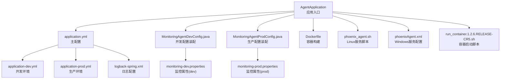
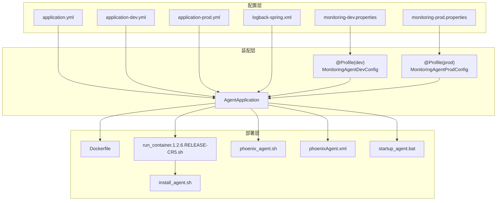
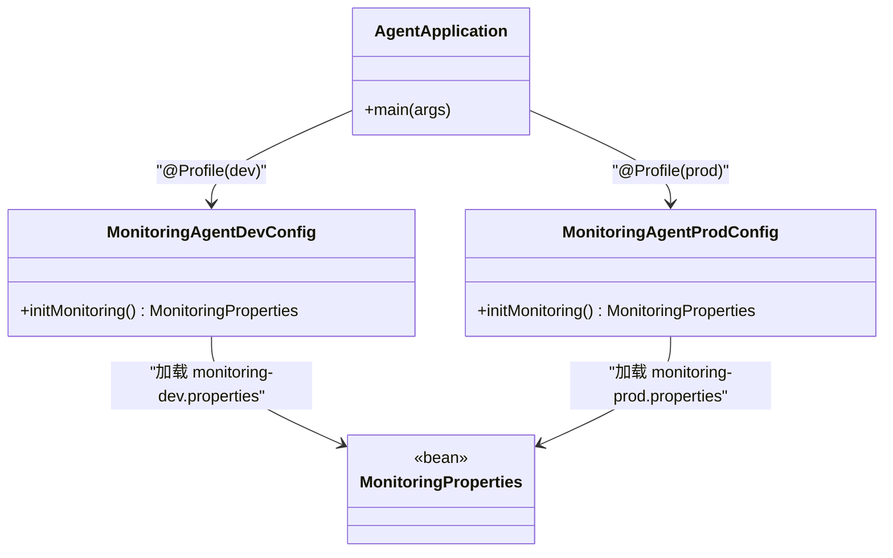
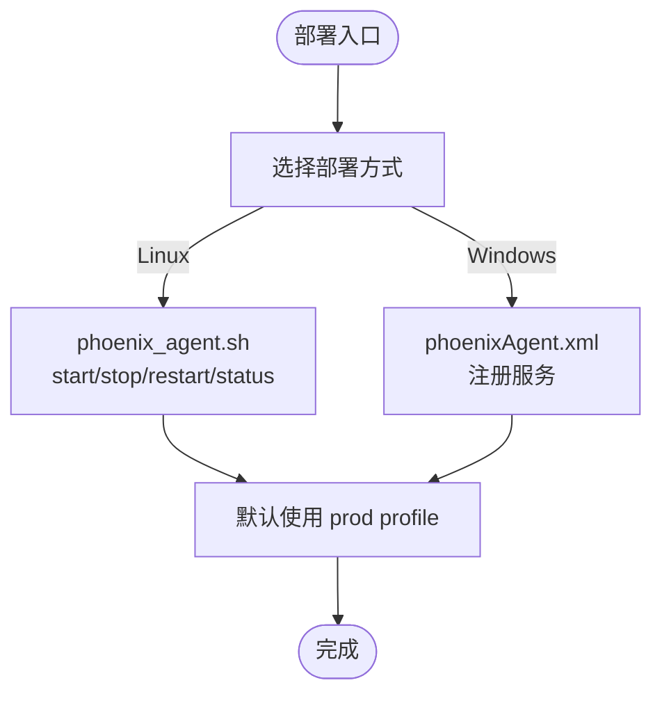
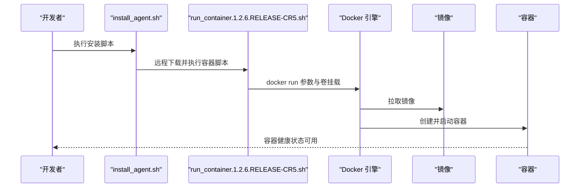
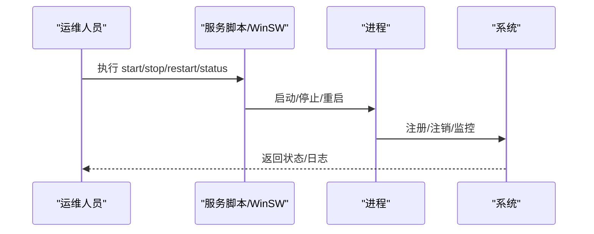
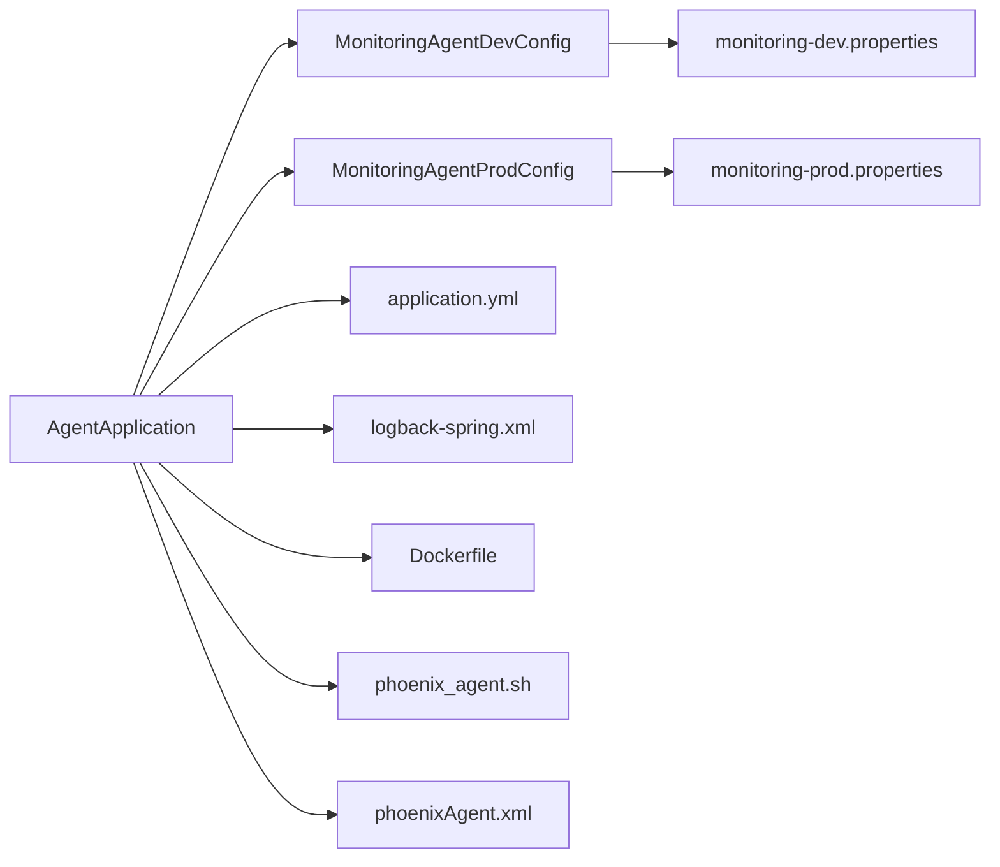

# 配置管理与部署

<cite>
**本文引用的文件**   
- [application.yml](file://phoenix-agent/src/main/resources/application.yml)
- [application-dev.yml](file://phoenix-agent/src/main/resources/application-dev.yml)
- [application-prod.yml](file://phoenix-agent/src/main/resources/application-prod.yml)
- [logback-spring.xml](file://phoenix-agent/src/main/resources/logback-spring.xml)
- [monitoring-dev.properties](file://phoenix-agent/src/main/resources/monitoring-dev.properties)
- [monitoring-prod.properties](file://phoenix-agent/src/main/resources/monitoring-prod.properties)
- [MonitoringAgentDevConfig.java](file://phoenix-agent/src/main/java/com/gitee/pifeng/monitoring/agent/config/MonitoringAgentDevConfig.java)
- [MonitoringAgentProdConfig.java](file://phoenix-agent/src/main/java/com/gitee/pifeng/monitoring/agent/config/MonitoringAgentProdConfig.java)
- [Dockerfile](file://phoenix-agent/src/main/docker/Dockerfile)
- [phoenix_agent.sh](file://doc/LinuxServices/phoenix-agent/phoenix_agent.sh)
- [phoenixAgent.xml](file://doc/WindowsServices/phoenix-agent/phoenixAgent.xml)
- [startup_agent.bat](file://doc/WindowsServices/phoenix-agent/startup_agent.bat)
- [run_container.1.2.6.RELEASE-CR5.sh](file://doc/Docker/phoenix-agent/run_container.1.2.6.RELEASE-CR5.sh)
- [install_agent.sh](file://doc/Docker/phoenix-agent/install_agent.sh)
- [AgentApplication.java](file://phoenix-agent/src/main/java/com/gitee/pifeng/monitoring/agent/AgentApplication.java)
</cite>

## 目录
1. [简介](#简介)
2. [项目结构](#项目结构)
3. [核心组件](#核心组件)
4. [架构总览](#架构总览)
5. [详细组件分析](#详细组件分析)
6. [依赖关系分析](#依赖关系分析)
7. [性能考量](#性能考量)
8. [故障排查指南](#故障排查指南)
9. [结论](#结论)
10. [附录](#附录)

## 简介
本文件面向监控代理端（phoenix-agent）的配置管理与部署，系统性阐述以下内容：
- 配置体系：application.yml 主配置、环境特定配置文件、属性配置文件的组织与职责
- 关键配置参数：网络、监控、日志、安全等参数的含义与设置方法
- 环境差异：开发、测试、生产环境的配置特点与最佳实践
- 部署方式：传统部署、Docker 容器化部署、Kubernetes 集群部署的要点
- 启动与停止：服务安装、服务管理、进程监控等运维操作
- 配置优化：基于实际场景的参数调优建议

## 项目结构
phoenix-agent 的配置与部署相关文件主要分布在如下位置：
- 配置文件：resources 目录下包含 Spring Boot 主配置、日志配置、环境属性配置
- 环境配置：application-dev.yml、application-prod.yml
- 属性配置：monitoring-dev.properties、monitoring-prod.properties
- 配置装配：@Profile 对应的 Java 配置类
- 部署脚本：Linux/Windows 服务脚本、Dockerfile、容器启动脚本
- 应用入口：AgentApplication 启动类

**图表来源**
- [AgentApplication.java:1-40](file://phoenix-agent/src/main/java/com/gitee/pifeng/monitoring/agent/AgentApplication.java#L1-L40)
- [application.yml:1-111](file://phoenix-agent/src/main/resources/application.yml#L1-L111)
- [application-dev.yml:1-3](file://phoenix-agent/src/main/resources/application-dev.yml#L1-L3)
- [application-prod.yml:1-3](file://phoenix-agent/src/main/resources/application-prod.yml#L1-L3)
- [logback-spring.xml:1-120](file://phoenix-agent/src/main/resources/logback-spring.xml#L1-L120)
- [MonitoringAgentDevConfig.java:1-38](file://phoenix-agent/src/main/java/com/gitee/pifeng/monitoring/agent/config/MonitoringAgentDevConfig.java#L1-L38)
- [MonitoringAgentProdConfig.java:1-38](file://phoenix-agent/src/main/java/com/gitee/pifeng/monitoring/agent/config/MonitoringAgentProdConfig.java#L1-L38)
- [monitoring-dev.properties:1-41](file://phoenix-agent/src/main/resources/monitoring-dev.properties#L1-L41)
- [monitoring-prod.properties:1-41](file://phoenix-agent/src/main/resources/monitoring-prod.properties#L1-L41)
- [Dockerfile:1-47](file://phoenix-agent/src/main/docker/Dockerfile#L1-L47)
- [phoenix_agent.sh:1-140](file://doc/LinuxServices/phoenix-agent/phoenix_agent.sh#L1-L140)
- [phoenixAgent.xml:1-314](file://doc/WindowsServices/phoenix-agent/phoenixAgent.xml#L1-L314)
- [run_container.1.2.6.RELEASE-CR5.sh:1-49](file://doc/Docker/phoenix-agent/run_container.1.2.6.RELEASE-CR5.sh#L1-L49)

**章节来源**
- [AgentApplication.java:1-40](file://phoenix-agent/src/main/java/com/gitee/pifeng/monitoring/agent/AgentApplication.java#L1-L40)
- [application.yml:1-111](file://phoenix-agent/src/main/resources/application.yml#L1-L111)
- [application-dev.yml:1-3](file://phoenix-agent/src/main/resources/application-dev.yml#L1-L3)
- [application-prod.yml:1-3](file://phoenix-agent/src/main/resources/application-prod.yml#L1-L3)
- [logback-spring.xml:1-120](file://phoenix-agent/src/main/resources/logback-spring.xml#L1-L120)
- [MonitoringAgentDevConfig.java:1-38](file://phoenix-agent/src/main/java/com/gitee/pifeng/monitoring/agent/config/MonitoringAgentDevConfig.java#L1-L38)
- [MonitoringAgentProdConfig.java:1-38](file://phoenix-agent/src/main/java/com/gitee/pifeng/monitoring/agent/config/MonitoringAgentProdConfig.java#L1-L38)
- [monitoring-dev.properties:1-41](file://phoenix-agent/src/main/resources/monitoring-dev.properties#L1-L41)
- [monitoring-prod.properties:1-41](file://phoenix-agent/src/main/resources/monitoring-prod.properties#L1-L41)
- [Dockerfile:1-47](file://phoenix-agent/src/main/docker/Dockerfile#L1-L47)
- [phoenix_agent.sh:1-140](file://doc/LinuxServices/phoenix-agent/phoenix_agent.sh#L1-L140)
- [phoenixAgent.xml:1-314](file://doc/WindowsServices/phoenix-agent/phoenixAgent.xml#L1-L314)
- [run_container.1.2.6.RELEASE-CR5.sh:1-49](file://doc/Docker/phoenix-agent/run_container.1.2.6.RELEASE-CR5.sh#L1-L49)

## 核心组件
- 应用入口与启动
  - AgentApplication 作为 Spring Boot 启动类，负责引导应用并记录启动耗时
  - 启动类继承 Undertow 自定义工厂类，便于定制嵌入式 Web 服务器
- 配置装配
  - @Profile("dev") 与 @Profile("prod") 分别通过 Java 配置类加载对应的 monitoring-*.properties
  - application.yml 中通过 spring.profiles.active 指定激活的环境
- 日志与监控
  - logback-spring.xml 定义日志输出、滚动策略与级别过滤
  - monitoring-*.properties 提供通信、心跳、采集频率、实例标识等监控参数

**章节来源**
- [AgentApplication.java:1-40](file://phoenix-agent/src/main/java/com/gitee/pifeng/monitoring/agent/AgentApplication.java#L1-L40)
- [MonitoringAgentDevConfig.java:1-38](file://phoenix-agent/src/main/java/com/gitee/pifeng/monitoring/agent/config/MonitoringAgentDevConfig.java#L1-L38)
- [MonitoringAgentProdConfig.java:1-38](file://phoenix-agent/src/main/java/com/gitee/pifeng/monitoring/agent/config/MonitoringAgentProdConfig.java#L1-L38)
- [application.yml:1-111](file://phoenix-agent/src/main/resources/application.yml#L1-L111)
- [logback-spring.xml:1-120](file://phoenix-agent/src/main/resources/logback-spring.xml#L1-L120)
- [monitoring-dev.properties:1-41](file://phoenix-agent/src/main/resources/monitoring-dev.properties#L1-L41)
- [monitoring-prod.properties:1-41](file://phoenix-agent/src/main/resources/monitoring-prod.properties#L1-L41)

## 架构总览
下图展示了代理端配置与部署的整体关系：Spring Boot 加载 application.yml 与环境配置；@Profile 触发对应配置装配；monitoring-*.properties 提供监控参数；日志由 logback-spring.xml 管理；部署通过 Dockerfile、容器脚本、Linux/Windows 服务脚本落地。

**图表来源**
- [application.yml:1-111](file://phoenix-agent/src/main/resources/application.yml#L1-L111)
- [application-dev.yml:1-3](file://phoenix-agent/src/main/resources/application-dev.yml#L1-L3)
- [application-prod.yml:1-3](file://phoenix-agent/src/main/resources/application-prod.yml#L1-L3)
- [logback-spring.xml:1-120](file://phoenix-agent/src/main/resources/logback-spring.xml#L1-L120)
- [monitoring-dev.properties:1-41](file://phoenix-agent/src/main/resources/monitoring-dev.properties#L1-L41)
- [monitoring-prod.properties:1-41](file://phoenix-agent/src/main/resources/monitoring-prod.properties#L1-L41)
- [MonitoringAgentDevConfig.java:1-38](file://phoenix-agent/src/main/java/com/gitee/pifeng/monitoring/agent/config/MonitoringAgentDevConfig.java#L1-L38)
- [MonitoringAgentProdConfig.java:1-38](file://phoenix-agent/src/main/java/com/gitee/pifeng/monitoring/agent/config/MonitoringAgentProdConfig.java#L1-L38)
- [Dockerfile:1-47](file://phoenix-agent/src/main/docker/Dockerfile#L1-L47)
- [run_container.1.2.6.RELEASE-CR5.sh:1-49](file://doc/Docker/phoenix-agent/run_container.1.2.6.RELEASE-CR5.sh#L1-L49)
- [install_agent.sh:1-14](file://doc/Docker/phoenix-agent/install_agent.sh#L1-L14)
- [phoenix_agent.sh:1-140](file://doc/LinuxServices/phoenix-agent/phoenix_agent.sh#L1-L140)
- [phoenixAgent.xml:1-314](file://doc/WindowsServices/phoenix-agent/phoenixAgent.xml#L1-L314)
- [startup_agent.bat:1-4](file://doc/WindowsServices/phoenix-agent/startup_agent.bat#L1-L4)

## 详细组件分析

### 配置文件组织与职责
- application.yml（主配置）
  - server：上下文路径、 Undertow 访问日志、优雅停机
  - logging：Logback 配置、日志级别
  - spring：JMX 关闭、异步超时、时区、应用名、激活 dev 环境、生命周期超时
  - management：端点暴露、本地访问限制
  - knife4j/springdoc：接口文档增强与 UI 路径
- application-dev.yml / application-prod.yml
  - 仅定义端口差异，其他配置由 application.yml 统一管理
- logback-spring.xml
  - 控制台与多文件滚动日志、WARN/ERROR 过滤器、根日志级别
- monitoring-dev.properties / monitoring-prod.properties
  - 加密算法与密钥、HTTP 通信 URL、超时、实例标识、心跳与采集频率、服务器与 JVM 采集开关

**章节来源**
- [application.yml:1-111](file://phoenix-agent/src/main/resources/application.yml#L1-L111)
- [application-dev.yml:1-3](file://phoenix-agent/src/main/resources/application-dev.yml#L1-L3)
- [application-prod.yml:1-3](file://phoenix-agent/src/main/resources/application-prod.yml#L1-L3)
- [logback-spring.xml:1-120](file://phoenix-agent/src/main/resources/logback-spring.xml#L1-L120)
- [monitoring-dev.properties:1-41](file://phoenix-agent/src/main/resources/monitoring-dev.properties#L1-L41)
- [monitoring-prod.properties:1-41](file://phoenix-agent/src/main/resources/monitoring-prod.properties#L1-L41)

### 配置装配与环境选择
- @Profile("dev") 与 @Profile("prod")
  - 通过 Java 配置类加载对应 monitoring-*.properties
  - application.yml 中 spring.profiles.active 默认 dev，可通过命令行切换 prod
- 启动参数
  - Dockerfile 中固定使用 prod
  - Linux/Windows 服务脚本默认使用 prod

**图表来源**
- [AgentApplication.java:1-40](file://phoenix-agent/src/main/java/com/gitee/pifeng/monitoring/agent/AgentApplication.java#L1-L40)
- [MonitoringAgentDevConfig.java:1-38](file://phoenix-agent/src/main/java/com/gitee/pifeng/monitoring/agent/config/MonitoringAgentDevConfig.java#L1-L38)
- [MonitoringAgentProdConfig.java:1-38](file://phoenix-agent/src/main/java/com/gitee/pifeng/monitoring/agent/config/MonitoringAgentProdConfig.java#L1-L38)

**章节来源**
- [MonitoringAgentDevConfig.java:1-38](file://phoenix-agent/src/main/java/com/gitee/pifeng/monitoring/agent/config/MonitoringAgentDevConfig.java#L1-L38)
- [MonitoringAgentProdConfig.java:1-38](file://phoenix-agent/src/main/java/com/gitee/pifeng/monitoring/agent/config/MonitoringAgentProdConfig.java#L1-L38)
- [application.yml:48-50](file://phoenix-agent/src/main/resources/application.yml#L48-L50)

### 关键配置参数说明与设置方法
- 网络配置
  - server.port：由 application-dev.yml / application-prod.yml 定义
  - server.servlet.context-path：统一上下文路径
  - management.server.address：端点仅本地访问
- 监控参数
  - monitoring.comm.http.url：服务端通信地址
  - monitoring.comm.http.*：连接、等待、请求超时
  - monitoring.heartbeat.rate：心跳周期
  - monitoring.server-info.* 与 monitoring.jvm-info.*：采集开关与频率
  - monitoring.instance.*：实例标识与语言
- 日志配置
  - logging.config：Logback 配置文件
  - logback-spring.xml：滚动策略、级别过滤、输出模式
- 安全配置
  - management.endpoint.shutdown.enabled：端点关闭能力
  - knife4j.basic：接口文档基础认证

**章节来源**
- [application.yml:2-111](file://phoenix-agent/src/main/resources/application.yml#L2-L111)
- [application-dev.yml:1-3](file://phoenix-agent/src/main/resources/application-dev.yml#L1-L3)
- [application-prod.yml:1-3](file://phoenix-agent/src/main/resources/application-prod.yml#L1-L3)
- [logback-spring.xml:1-120](file://phoenix-agent/src/main/resources/logback-spring.xml#L1-L120)
- [monitoring-dev.properties:1-41](file://phoenix-agent/src/main/resources/monitoring-dev.properties#L1-L41)
- [monitoring-prod.properties:1-41](file://phoenix-agent/src/main/resources/monitoring-prod.properties#L1-L41)

### 不同环境下的配置差异与最佳实践
- 开发环境（dev）
  - application-dev.yml：端口 12000
  - application.yml：spring.profiles.active 默认 dev
  - 适合本地联调与快速迭代
- 生产环境（prod）
  - application-prod.yml：端口 12000
  - Dockerfile 与服务脚本默认使用 prod
  - 适合线上部署，需结合安全与可观测性加固
- 最佳实践
  - 将敏感参数（如密钥）置于外部配置源或环境变量
  - 严格区分端口与上下文路径，避免冲突
  - 通过 profile 切换实现环境隔离，避免硬编码

**章节来源**
- [application-dev.yml:1-3](file://phoenix-agent/src/main/resources/application-dev.yml#L1-L3)
- [application-prod.yml:1-3](file://phoenix-agent/src/main/resources/application-prod.yml#L1-L3)
- [application.yml:48-50](file://phoenix-agent/src/main/resources/application.yml#L48-L50)
- [Dockerfile:45-47](file://phoenix-agent/src/main/docker/Dockerfile#L45-L47)
- [phoenix_agent.sh:15-15](file://doc/LinuxServices/phoenix-agent/phoenix_agent.sh#L15-L15)
- [phoenixAgent.xml:102-102](file://doc/WindowsServices/phoenix-agent/phoenixAgent.xml#L102-L102)

### 部署方式与流程

#### 传统部署（Linux/Windows）
- Linux
  - 使用服务脚本进行启动/停止/重启/状态查询
  - 默认以 prod 模式运行，可通过参数调整
- Windows
  - 使用 WinSW 配置文件注册服务
  - 支持日志轮转、停止超时、优先级等高级选项
  - 提供批处理脚本用于交互式启动

**图表来源**
- [phoenix_agent.sh:1-140](file://doc/LinuxServices/phoenix-agent/phoenix_agent.sh#L1-L140)
- [phoenixAgent.xml:1-314](file://doc/WindowsServices/phoenix-agent/phoenixAgent.xml#L1-L314)
- [startup_agent.bat:1-4](file://doc/WindowsServices/phoenix-agent/startup_agent.bat#L1-L4)

**章节来源**
- [phoenix_agent.sh:1-140](file://doc/LinuxServices/phoenix-agent/phoenix_agent.sh#L1-L140)
- [phoenixAgent.xml:1-314](file://doc/WindowsServices/phoenix-agent/phoenixAgent.xml#L1-L314)
- [startup_agent.bat:1-4](file://doc/WindowsServices/phoenix-agent/startup_agent.bat#L1-L4)

#### Docker 容器化部署
- 构建与运行
  - Dockerfile：JDK 基础镜像、时区、用户与目录、健康检查、ENTRYPOINT
  - run_container.1.2.6.RELEASE-CR5.sh：挂载数据卷、网络与安全能力、重启策略
  - install_agent.sh：远程拉取并执行容器脚本
- 卷与挂载
  - /app/liblog4phoenix：日志持久化
  - /app/config：配置挂载（如需外部化属性）

**图表来源**
- [install_agent.sh:1-14](file://doc/Docker/phoenix-agent/install_agent.sh#L1-L14)
- [run_container.1.2.6.RELEASE-CR5.sh:1-49](file://doc/Docker/phoenix-agent/run_container.1.2.6.RELEASE-CR5.sh#L1-L49)
- [Dockerfile:1-47](file://phoenix-agent/src/main/docker/Dockerfile#L1-L47)

**章节来源**
- [Dockerfile:1-47](file://phoenix-agent/src/main/docker/Dockerfile#L1-L47)
- [run_container.1.2.6.RELEASE-CR5.sh:1-49](file://doc/Docker/phoenix-agent/run_container.1.2.6.RELEASE-CR5.sh#L1-L49)
- [install_agent.sh:1-14](file://doc/Docker/phoenix-agent/install_agent.sh#L1-L14)

#### Kubernetes 集群部署（概念性说明）
- Pod 资源：基于 Docker 镜像，声明端口与健康检查
- 卷：使用 PersistentVolumeClaim 或 HostPath 挂载日志目录
- 服务：ClusterIP/NodePort 暴露端口，结合 Ingress
- 配置：ConfigMap/Secret 管理 application-*.yml 与 monitoring-*.properties
- 健康检查：利用容器 HEALTHCHECK 与 readiness/liveness 探针

[本节为概念性说明，无需列出章节来源]

### 启动与停止流程
- 启动
  - Linux：nohup 后台启动，带 --spring.profiles.active=prod
  - Windows：WinSW 注册服务，按配置启动
  - Docker：ENTRYPOINT 固定 prod，健康检查验证
- 停止
  - Linux：优雅关闭，超时则强制终止
  - Windows：停止超时配置，确保进程释放
  - Docker：健康检查失败触发重启策略

**图表来源**
- [phoenix_agent.sh:77-101](file://doc/LinuxServices/phoenix-agent/phoenix_agent.sh#L77-L101)
- [phoenix_agent.sh:47-75](file://doc/LinuxServices/phoenix-agent/phoenix_agent.sh#L47-L75)
- [phoenixAgent.xml:135-135](file://doc/WindowsServices/phoenix-agent/phoenixAgent.xml#L135-L135)
- [Dockerfile:35-36](file://phoenix-agent/src/main/docker/Dockerfile#L35-L36)

**章节来源**
- [phoenix_agent.sh:1-140](file://doc/LinuxServices/phoenix-agent/phoenix_agent.sh#L1-L140)
- [phoenixAgent.xml:1-314](file://doc/WindowsServices/phoenix-agent/phoenixAgent.xml#L1-L314)
- [Dockerfile:1-47](file://phoenix-agent/src/main/docker/Dockerfile#L1-L47)

## 依赖关系分析
- 组件耦合
  - AgentApplication 依赖 Spring Boot 自动装配与 Undertow 定制
  - 配置装配类依赖 Monitor 启动器加载属性
  - 日志配置独立于业务逻辑，通过 Logback 管理
- 外部依赖
  - Docker 镜像、容器运行时、卷驱动
  - Windows 服务包装器（WinSW）
  - 远程容器脚本与镜像仓库

**图表来源**
- [AgentApplication.java:1-40](file://phoenix-agent/src/main/java/com/gitee/pifeng/monitoring/agent/AgentApplication.java#L1-L40)
- [MonitoringAgentDevConfig.java:1-38](file://phoenix-agent/src/main/java/com/gitee/pifeng/monitoring/agent/config/MonitoringAgentDevConfig.java#L1-L38)
- [MonitoringAgentProdConfig.java:1-38](file://phoenix-agent/src/main/java/com/gitee/pifeng/monitoring/agent/config/MonitoringAgentProdConfig.java#L1-L38)
- [application.yml:1-111](file://phoenix-agent/src/main/resources/application.yml#L1-L111)
- [logback-spring.xml:1-120](file://phoenix-agent/src/main/resources/logback-spring.xml#L1-L120)
- [Dockerfile:1-47](file://phoenix-agent/src/main/docker/Dockerfile#L1-L47)
- [phoenix_agent.sh:1-140](file://doc/LinuxServices/phoenix-agent/phoenix_agent.sh#L1-L140)
- [phoenixAgent.xml:1-314](file://doc/WindowsServices/phoenix-agent/phoenixAgent.xml#L1-L314)

**章节来源**
- [AgentApplication.java:1-40](file://phoenix-agent/src/main/java/com/gitee/pifeng/monitoring/agent/AgentApplication.java#L1-L40)
- [MonitoringAgentDevConfig.java:1-38](file://phoenix-agent/src/main/java/com/gitee/pifeng/monitoring/agent/config/MonitoringAgentDevConfig.java#L1-L38)
- [MonitoringAgentProdConfig.java:1-38](file://phoenix-agent/src/main/java/com/gitee/pifeng/monitoring/agent/config/MonitoringAgentProdConfig.java#L1-L38)
- [application.yml:1-111](file://phoenix-agent/src/main/resources/application.yml#L1-L111)
- [logback-spring.xml:1-120](file://phoenix-agent/src/main/resources/logback-spring.xml#L1-L120)
- [Dockerfile:1-47](file://phoenix-agent/src/main/docker/Dockerfile#L1-L47)
- [phoenix_agent.sh:1-140](file://doc/LinuxServices/phoenix-agent/phoenix_agent.sh#L1-L140)
- [phoenixAgent.xml:1-314](file://doc/WindowsServices/phoenix-agent/phoenixAgent.xml#L1-L314)

## 性能考量
- 采集频率与超时
  - 心跳与服务器/JVM 采集频率影响资源占用，建议结合业务负载调优
  - HTTP 超时参数需与网络状况匹配，避免频繁重试
- 日志滚动
  - 滚动策略与文件大小上限需平衡磁盘占用与检索效率
- Web 服务器
  - Undertow 访问日志与优雅停机有助于稳定性与可观测性
- 容器化
  - 挂载卷与主机共享（如 /sys、/proc）可能带来性能与安全权衡，按需启用

[本节为通用指导，无需列出章节来源]

## 故障排查指南
- 启动失败
  - 检查端口占用与上下文路径冲突
  - 核对 spring.profiles.active 是否正确
  - 查看日志文件定位异常
- 连接服务端失败
  - 校验 monitoring.comm.http.url 与网络连通性
  - 调整超时参数与重试策略
- 日志异常
  - 检查 logback-spring.xml 的滚动策略与目录权限
- Windows 服务
  - 使用 phoeniAgent.xml 的日志路径与轮转配置定位问题
- Docker 健康检查
  - 依据 HEALTHCHECK 结果判断容器状态

**章节来源**
- [application.yml:1-111](file://phoenix-agent/src/main/resources/application.yml#L1-L111)
- [logback-spring.xml:1-120](file://phoenix-agent/src/main/resources/logback-spring.xml#L1-L120)
- [phoenixAgent.xml:225-246](file://doc/WindowsServices/phoenix-agent/phoenixAgent.xml#L225-L246)
- [Dockerfile:35-36](file://phoenix-agent/src/main/docker/Dockerfile#L35-L36)

## 结论
本文系统梳理了监控代理端的配置体系与部署方案，明确了各配置文件的职责与参数含义，并提供了跨平台部署与运维的最佳实践。建议在生产环境中严格区分 profile、加强日志与健康检查、按需优化采集频率与超时参数，以获得稳定高效的监控能力。

## 附录
- 常用命令参考
  - Linux：./phoenix_agent.sh start|stop|restart|status
  - Windows：WinSW 安装/卸载/启动/停止（基于 phoenixAgent.xml）
  - Docker：install_agent.sh -> run_container.*.sh -> docker run
- 外部化配置建议
  - 将敏感参数与环境差异放入 ConfigMap/Secret 或环境变量
  - 使用卷挂载 application-*.yml 与 monitoring-*.properties 实现热更新

[本节为补充说明，无需列出章节来源]