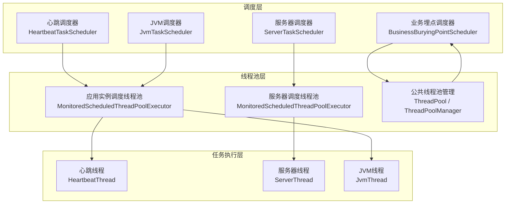
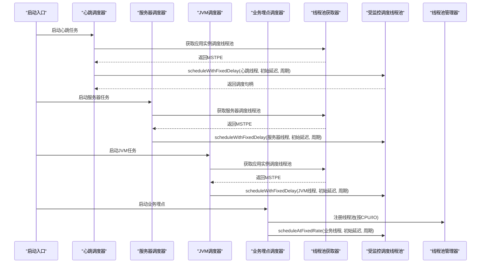
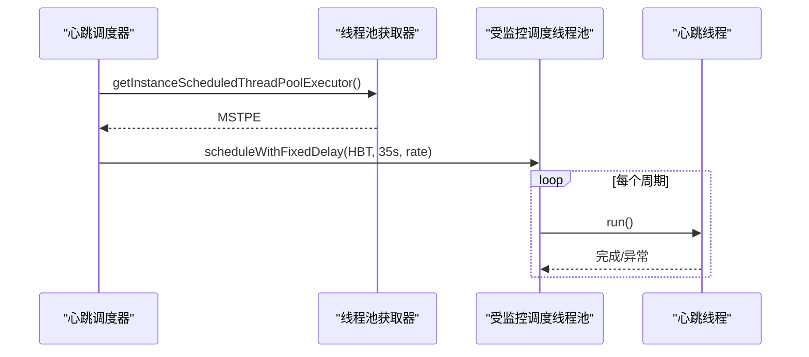
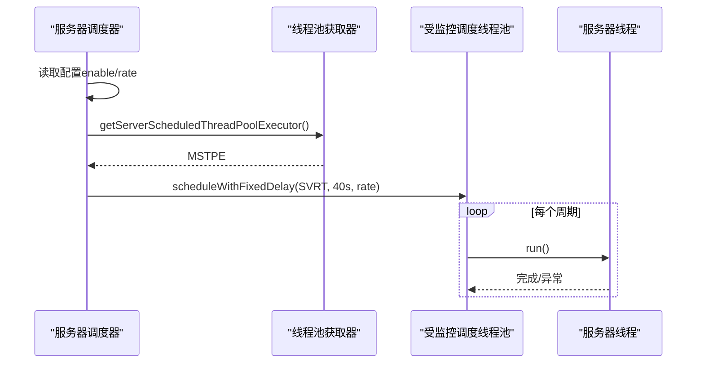
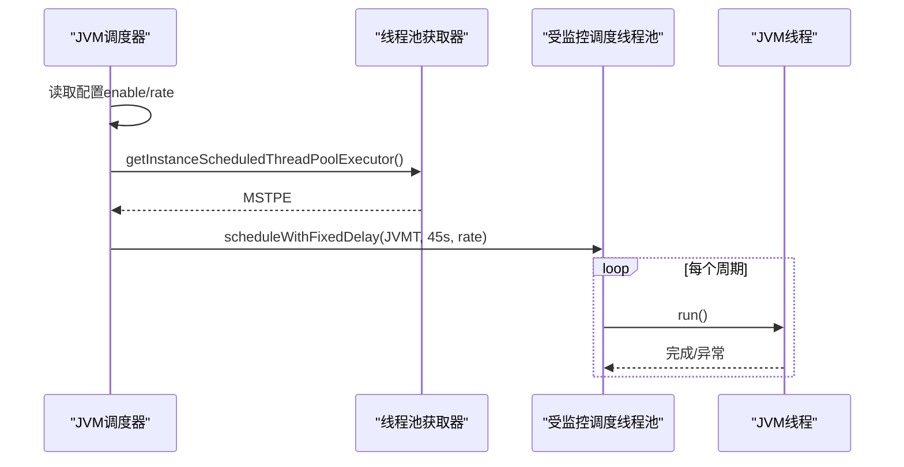
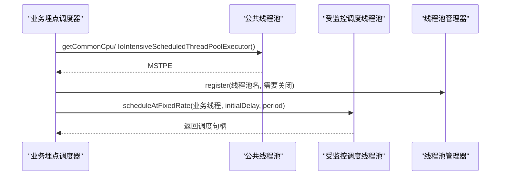
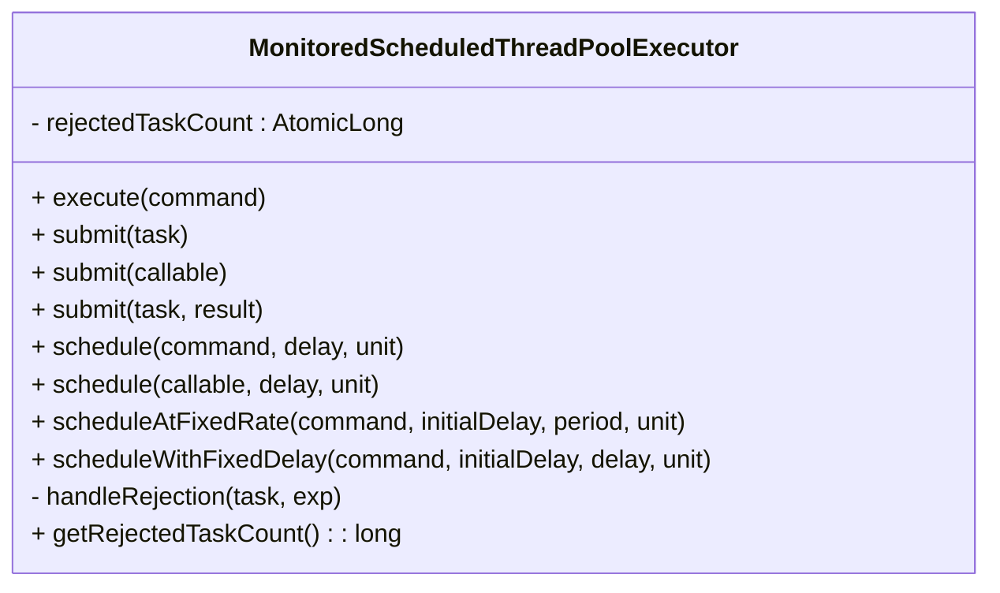
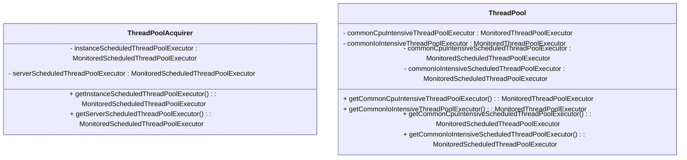
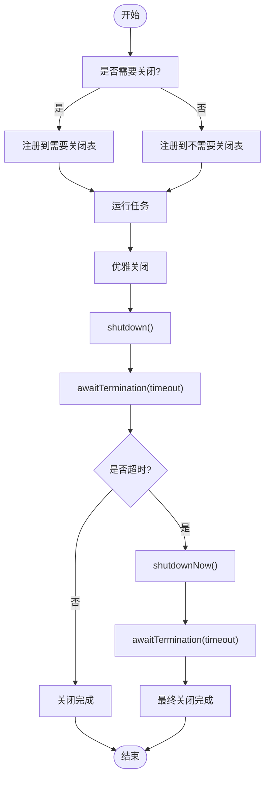
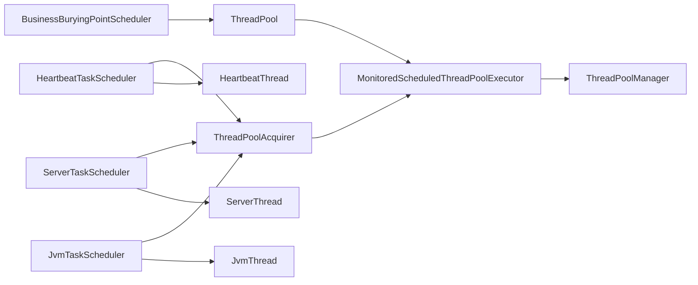

# 定时任务调度器

<cite>
**本文引用的文件**
- [phoenix-client-core/src/main/java/com/gitee/pifeng/monitoring/plug/scheduler/HeartbeatTaskScheduler.java](file://phoenix-client-core/src/main/java/com/gitee/pifeng/monitoring/plug/scheduler/HeartbeatTaskScheduler.java)
- [phoenix-client-core/src/main/java/com/gitee/pifeng/monitoring/plug/scheduler/ServerTaskScheduler.java](file://phoenix-client-core/src/main/java/com/gitee/pifeng/monitoring/plug/scheduler/ServerTaskScheduler.java)
- [phoenix-client-core/src/main/java/com/gitee/pifeng/monitoring/plug/scheduler/JvmTaskScheduler.java](file://phoenix-client-core/src/main/java/com/gitee/pifeng/monitoring/plug/scheduler/JvmTaskScheduler.java)
- [phoenix-client-core/src/main/java/com/gitee/pifeng/monitoring/plug/scheduler/BusinessBuryingPointScheduler.java](file://phoenix-client-core/src/main/java/com/gitee/pifeng/monitoring/plug/scheduler/BusinessBuryingPointScheduler.java)
- [phoenix-client-core/src/main/java/com/gitee/pifeng/monitoring/plug/core/ThreadPoolAcquirer.java](file://phoenix-client-core/src/main/java/com/gitee/pifeng/monitoring/plug/core/ThreadPoolAcquirer.java)
- [phoenix-common-core/src/main/java/com/gitee/pifeng/monitoring/common/threadpool/MonitoredScheduledThreadPoolExecutor.java](file://phoenix-common-core/src/main/java/com/gitee/pifeng/monitoring/common/threadpool/MonitoredScheduledThreadPoolExecutor.java)
- [phoenix-common-core/src/main/java/com/gitee/pifeng/monitoring/common/threadpool/ThreadPool.java](file://phoenix-common-core/src/main/java/com/gitee/pifeng/monitoring/common/threadpool/ThreadPool.java)
- [phoenix-common-core/src/main/java/com/gitee/pifeng/monitoring/common/threadpool/ThreadPoolManager.java](file://phoenix-common-core/src/main/java/com/gitee/pifeng/monitoring/common/threadpool/ThreadPoolManager.java)
- [phoenix-client-core/src/main/resources/monitoring.properties](file://phoenix-client-core/src/main/resources/monitoring.properties)
- [phoenix-client-core/src/main/java/com/gitee/pifeng/monitoring/plug/thread/HeartbeatThread.java](file://phoenix-client-core/src/main/java/com/gitee/pifeng/monitoring/plug/thread/HeartbeatThread.java)
- [phoenix-client-core/src/main/java/com/gitee/pifeng/monitoring/plug/thread/ServerThread.java](file://phoenix-client-core/src/main/java/com/gitee/pifeng/monitoring/plug/thread/ServerThread.java)
- [phoenix-client-core/src/main/java/com/gitee/pifeng/monitoring/plug/thread/JvmThread.java](file://phoenix-client-core/src/main/java/com/gitee/pifeng/monitoring/plug/thread/JvmThread.java)
- [phoenix-common-core/src/main/java/com/gitee/pifeng/monitoring/common/constant/ThreadTypeEnums.java](file://phoenix-common-core/src/main/java/com/gitee/pifeng/monitoring/common/constant/ThreadTypeEnums.java)
</cite>

## 目录
1. [引言](#引言)
2. [项目结构](#项目结构)
3. [核心组件](#核心组件)
4. [架构总览](#架构总览)
5. [详细组件分析](#详细组件分析)
6. [依赖分析](#依赖分析)
7. [性能考虑](#性能考虑)
8. [故障处理与恢复](#故障处理与恢复)
9. [结论](#结论)
10. [附录](#附录)

## 引言
本文面向监控客户端的定时任务调度器，系统性阐述心跳任务、服务器监控、JVM监控、业务埋点等任务类型的调度设计与实现机制，覆盖配置参数、执行策略、线程池监控与管理、性能优化、故障处理与调试方法等内容，帮助开发者在保证可靠性的同时获得稳定高效的监控能力。

## 项目结构
调度器位于客户端模块中，采用“调度器 + 线程池 + 任务线程”的分层组织方式：
- 调度器：负责按配置启动定时任务，使用固定延迟/固定周期策略
- 线程池：提供受监控的调度线程池，支持拒绝统计与优雅关闭
- 任务线程：封装具体监控逻辑，统一具备耗时统计与异常处理

图表来源
- [phoenix-client-core/src/main/java/com/gitee/pifeng/monitoring/plug/scheduler/HeartbeatTaskScheduler.java:39-43](file://phoenix-client-core/src/main/java/com/gitee/pifeng/monitoring/plug/scheduler/HeartbeatTaskScheduler.java#L39-L43)
- [phoenix-client-core/src/main/java/com/gitee/pifeng/monitoring/plug/scheduler/ServerTaskScheduler.java:40-47](file://phoenix-client-core/src/main/java/com/gitee/pifeng/monitoring/plug/scheduler/ServerTaskScheduler.java#L40-L47)
- [phoenix-client-core/src/main/java/com/gitee/pifeng/monitoring/plug/scheduler/JvmTaskScheduler.java:40-47](file://phoenix-client-core/src/main/java/com/gitee/pifeng/monitoring/plug/scheduler/JvmTaskScheduler.java#L40-L47)
- [phoenix-client-core/src/main/java/com/gitee/pifeng/monitoring/plug/scheduler/BusinessBuryingPointScheduler.java:44-57](file://phoenix-client-core/src/main/java/com/gitee/pifeng/monitoring/plug/scheduler/BusinessBuryingPointScheduler.java#L44-L57)
- [phoenix-client-core/src/main/java/com/gitee/pifeng/monitoring/plug/core/ThreadPoolAcquirer.java:48-94](file://phoenix-client-core/src/main/java/com/gitee/pifeng/monitoring/plug/core/ThreadPoolAcquirer.java#L48-L94)
- [phoenix-common-core/src/main/java/com/gitee/pifeng/monitoring/common/threadpool/MonitoredScheduledThreadPoolExecutor.java:18-91](file://phoenix-common-core/src/main/java/com/gitee/pifeng/monitoring/common/threadpool/MonitoredScheduledThreadPoolExecutor.java#L18-L91)
- [phoenix-common-core/src/main/java/com/gitee/pifeng/monitoring/common/threadpool/ThreadPool.java:165-211](file://phoenix-common-core/src/main/java/com/gitee/pifeng/monitoring/common/threadpool/ThreadPool.java#L165-L211)
- [phoenix-client-core/src/main/java/com/gitee/pifeng/monitoring/plug/thread/HeartbeatThread.java:38-69](file://phoenix-client-core/src/main/java/com/gitee/pifeng/monitoring/plug/thread/HeartbeatThread.java#L38-L69)
- [phoenix-client-core/src/main/java/com/gitee/pifeng/monitoring/plug/thread/ServerThread.java:42-77](file://phoenix-client-core/src/main/java/com/gitee/pifeng/monitoring/plug/thread/ServerThread.java#L42-L77)
- [phoenix-client-core/src/main/java/com/gitee/pifeng/monitoring/plug/thread/JvmThread.java:40-73](file://phoenix-client-core/src/main/java/com/gitee/pifeng/monitoring/plug/thread/JvmThread.java#L40-L73)

章节来源
- [phoenix-client-core/src/main/java/com/gitee/pifeng/monitoring/plug/scheduler/HeartbeatTaskScheduler.java:17-45](file://phoenix-client-core/src/main/java/com/gitee/pifeng/monitoring/plug/scheduler/HeartbeatTaskScheduler.java#L17-L45)
- [phoenix-client-core/src/main/java/com/gitee/pifeng/monitoring/plug/scheduler/ServerTaskScheduler.java:17-50](file://phoenix-client-core/src/main/java/com/gitee/pifeng/monitoring/plug/scheduler/ServerTaskScheduler.java#L17-L50)
- [phoenix-client-core/src/main/java/com/gitee/pifeng/monitoring/plug/scheduler/JvmTaskScheduler.java:17-50](file://phoenix-client-core/src/main/java/com/gitee/pifeng/monitoring/plug/scheduler/JvmTaskScheduler.java#L17-L50)
- [phoenix-client-core/src/main/java/com/gitee/pifeng/monitoring/plug/scheduler/BusinessBuryingPointScheduler.java:17-59](file://phoenix-client-core/src/main/java/com/gitee/pifeng/monitoring/plug/scheduler/BusinessBuryingPointScheduler.java#L17-L59)

## 核心组件
- 心跳调度器：按配置的频率延时启动，固定频率发送心跳包
- 服务器调度器：按配置启用，延时启动，固定频率上报服务器信息
- JVM调度器：按配置启用，延时启动，固定频率上报JVM信息
- 业务埋点调度器：按CPU/IO密集型选择专用线程池，支持固定频率执行
- 线程池获取器：按任务类型提供应用实例/服务器两类调度线程池
- 受监控调度线程池：扩展ScheduledThreadPoolExecutor，统计拒绝次数并注册管理
- 线程池管理器：集中注册/注销线程池，提供优雅关闭流程
- 任务线程：封装监控采集与发送逻辑，内置耗时统计与异常处理

章节来源
- [phoenix-client-core/src/main/java/com/gitee/pifeng/monitoring/plug/core/ThreadPoolAcquirer.java:17-96](file://phoenix-client-core/src/main/java/com/gitee/pifeng/monitoring/plug/core/ThreadPoolAcquirer.java#L17-L96)
- [phoenix-common-core/src/main/java/com/gitee/pifeng/monitoring/common/threadpool/MonitoredScheduledThreadPoolExecutor.java:18-208](file://phoenix-common-core/src/main/java/com/gitee/pifeng/monitoring/common/threadpool/MonitoredScheduledThreadPoolExecutor.java#L18-L208)
- [phoenix-common-core/src/main/java/com/gitee/pifeng/monitoring/common/threadpool/ThreadPoolManager.java:21-131](file://phoenix-common-core/src/main/java/com/gitee/pifeng/monitoring/common/threadpool/ThreadPoolManager.java#L21-L131)
- [phoenix-client-core/src/main/java/com/gitee/pifeng/monitoring/plug/thread/HeartbeatThread.java:23-71](file://phoenix-client-core/src/main/java/com/gitee/pifeng/monitoring/plug/thread/HeartbeatThread.java#L23-L71)
- [phoenix-client-core/src/main/java/com/gitee/pifeng/monitoring/plug/thread/ServerThread.java:27-79](file://phoenix-client-core/src/main/java/com/gitee/pifeng/monitoring/plug/thread/ServerThread.java#L27-L79)
- [phoenix-client-core/src/main/java/com/gitee/pifeng/monitoring/plug/thread/JvmThread.java:25-75](file://phoenix-client-core/src/main/java/com/gitee/pifeng/monitoring/plug/thread/JvmThread.java#L25-L75)

## 架构总览
调度器通过配置驱动任务启动与频率，使用受监控线程池承载任务执行，并在异常时进行统计与告警，最终由管理器统一进行生命周期管理。

图表来源
- [phoenix-client-core/src/main/java/com/gitee/pifeng/monitoring/plug/scheduler/HeartbeatTaskScheduler.java:39-43](file://phoenix-client-core/src/main/java/com/gitee/pifeng/monitoring/plug/scheduler/HeartbeatTaskScheduler.java#L39-L43)
- [phoenix-client-core/src/main/java/com/gitee/pifeng/monitoring/plug/scheduler/ServerTaskScheduler.java:40-47](file://phoenix-client-core/src/main/java/com/gitee/pifeng/monitoring/plug/scheduler/ServerTaskScheduler.java#L40-L47)
- [phoenix-client-core/src/main/java/com/gitee/pifeng/monitoring/plug/scheduler/JvmTaskScheduler.java:40-47](file://phoenix-client-core/src/main/java/com/gitee/pifeng/monitoring/plug/scheduler/JvmTaskScheduler.java#L40-L47)
- [phoenix-client-core/src/main/java/com/gitee/pifeng/monitoring/plug/scheduler/BusinessBuryingPointScheduler.java:44-57](file://phoenix-client-core/src/main/java/com/gitee/pifeng/monitoring/plug/scheduler/BusinessBuryingPointScheduler.java#L44-L57)
- [phoenix-client-core/src/main/java/com/gitee/pifeng/monitoring/plug/core/ThreadPoolAcquirer.java:48-94](file://phoenix-client-core/src/main/java/com/gitee/pifeng/monitoring/plug/core/ThreadPoolAcquirer.java#L48-L94)
- [phoenix-common-core/src/main/java/com/gitee/pifeng/monitoring/common/threadpool/MonitoredScheduledThreadPoolExecutor.java:18-91](file://phoenix-common-core/src/main/java/com/gitee/pifeng/monitoring/common/threadpool/MonitoredScheduledThreadPoolExecutor.java#L18-L91)
- [phoenix-common-core/src/main/java/com/gitee/pifeng/monitoring/common/threadpool/ThreadPoolManager.java:45-56](file://phoenix-common-core/src/main/java/com/gitee/pifeng/monitoring/common/threadpool/ThreadPoolManager.java#L45-L56)

## 详细组件分析

### 心跳任务调度器
- 设计要点
  - 固定延迟35秒后启动，随后按配置频率循环执行
  - 使用应用实例调度线程池，确保与业务监控同池
  - 任务线程负责构建心跳包并发送，内置耗时统计与异常处理
- 关键配置
  - 心跳频率：来自配置加载器的heartbeat.rate
- 执行策略
  - scheduleWithFixedDelay：以“上次完成后”为基准的固定延迟模式
- 性能与可靠性
  - 任务线程内对耗时超过阈值进行告警，便于定位慢任务
  - 线程池拒绝时进行统计与日志输出，便于容量评估

图表来源
- [phoenix-client-core/src/main/java/com/gitee/pifeng/monitoring/plug/scheduler/HeartbeatTaskScheduler.java:39-43](file://phoenix-client-core/src/main/java/com/gitee/pifeng/monitoring/plug/scheduler/HeartbeatTaskScheduler.java#L39-L43)
- [phoenix-client-core/src/main/java/com/gitee/pifeng/monitoring/plug/thread/HeartbeatThread.java:38-69](file://phoenix-client-core/src/main/java/com/gitee/pifeng/monitoring/plug/thread/HeartbeatThread.java#L38-L69)
- [phoenix-client-core/src/main/java/com/gitee/pifeng/monitoring/plug/core/ThreadPoolAcquirer.java:48-66](file://phoenix-client-core/src/main/java/com/gitee/pifeng/monitoring/plug/core/ThreadPoolAcquirer.java#L48-L66)

章节来源
- [phoenix-client-core/src/main/java/com/gitee/pifeng/monitoring/plug/scheduler/HeartbeatTaskScheduler.java:17-45](file://phoenix-client-core/src/main/java/com/gitee/pifeng/monitoring/plug/scheduler/HeartbeatTaskScheduler.java#L17-L45)
- [phoenix-client-core/src/main/java/com/gitee/pifeng/monitoring/plug/thread/HeartbeatThread.java:23-71](file://phoenix-client-core/src/main/java/com/gitee/pifeng/monitoring/plug/thread/HeartbeatThread.java#L23-L71)

### 服务器监控调度器
- 设计要点
  - 仅在配置开启时启动
  - 固定延迟40秒后启动，按配置频率上报
  - 使用服务器专用调度线程池，隔离I/O密集型任务
- 关键配置
  - enable：是否采集服务器信息
  - rate：上报频率
  - userSigarEnable：是否使用Sigar采集
- 执行策略
  - scheduleWithFixedDelay：以“上次完成后”为基准的固定延迟模式
- 性能与可靠性
  - 任务线程根据配置选择Sigar或OSHI采集源
  - 统一异常捕获与耗时统计

图表来源
- [phoenix-client-core/src/main/java/com/gitee/pifeng/monitoring/plug/scheduler/ServerTaskScheduler.java:40-47](file://phoenix-client-core/src/main/java/com/gitee/pifeng/monitoring/plug/scheduler/ServerTaskScheduler.java#L40-L47)
- [phoenix-client-core/src/main/java/com/gitee/pifeng/monitoring/plug/thread/ServerThread.java:42-77](file://phoenix-client-core/src/main/java/com/gitee/pifeng/monitoring/plug/thread/ServerThread.java#L42-L77)
- [phoenix-client-core/src/main/java/com/gitee/pifeng/monitoring/plug/core/ThreadPoolAcquirer.java:76-94](file://phoenix-client-core/src/main/java/com/gitee/pifeng/monitoring/plug/core/ThreadPoolAcquirer.java#L76-L94)

章节来源
- [phoenix-client-core/src/main/java/com/gitee/pifeng/monitoring/plug/scheduler/ServerTaskScheduler.java:17-50](file://phoenix-client-core/src/main/java/com/gitee/pifeng/monitoring/plug/scheduler/ServerTaskScheduler.java#L17-L50)
- [phoenix-client-core/src/main/java/com/gitee/pifeng/monitoring/plug/thread/ServerThread.java:27-79](file://phoenix-client-core/src/main/java/com/gitee/pifeng/monitoring/plug/thread/ServerThread.java#L27-L79)

### JVM监控调度器
- 设计要点
  - 仅在配置开启时启动
  - 固定延迟45秒后启动，按配置频率上报
  - 使用应用实例调度线程池，与心跳同池
- 关键配置
  - enable：是否采集JVM信息
  - rate：上报频率
- 执行策略
  - scheduleWithFixedDelay：以“上次完成后”为基准的固定延迟模式
- 性能与可靠性
  - 任务线程调用JVM工具类采集指标
  - 统一异常捕获与耗时统计

图表来源
- [phoenix-client-core/src/main/java/com/gitee/pifeng/monitoring/plug/scheduler/JvmTaskScheduler.java:40-47](file://phoenix-client-core/src/main/java/com/gitee/pifeng/monitoring/plug/scheduler/JvmTaskScheduler.java#L40-L47)
- [phoenix-client-core/src/main/java/com/gitee/pifeng/monitoring/plug/thread/JvmThread.java:40-73](file://phoenix-client-core/src/main/java/com/gitee/pifeng/monitoring/plug/thread/JvmThread.java#L40-L73)
- [phoenix-client-core/src/main/java/com/gitee/pifeng/monitoring/plug/core/ThreadPoolAcquirer.java:48-66](file://phoenix-client-core/src/main/java/com/gitee/pifeng/monitoring/plug/core/ThreadPoolAcquirer.java#L48-L66)

章节来源
- [phoenix-client-core/src/main/java/com/gitee/pifeng/monitoring/plug/scheduler/JvmTaskScheduler.java:17-50](file://phoenix-client-core/src/main/java/com/gitee/pifeng/monitoring/plug/scheduler/JvmTaskScheduler.java#L17-L50)
- [phoenix-client-core/src/main/java/com/gitee/pifeng/monitoring/plug/thread/JvmThread.java:25-75](file://phoenix-client-core/src/main/java/com/gitee/pifeng/monitoring/plug/thread/JvmThread.java#L25-L75)

### 业务埋点调度器
- 设计要点
  - 支持CPU密集型与IO密集型两种线程池
  - 使用scheduleAtFixedRate：以“首次启动”为基准的固定频率模式
  - 通过线程池管理器注册线程池，便于统一关闭
- 关键配置
  - initialDelay：初次延迟
  - period：执行周期
  - threadTypeEnum：线程类型（CPU/IO）
- 执行策略
  - 固定频率执行，适合高频、短任务
- 性能与可靠性
  - 通过线程类型区分池容量与队列策略
  - 统一拒绝处理与拒绝计数统计

图表来源
- [phoenix-client-core/src/main/java/com/gitee/pifeng/monitoring/plug/scheduler/BusinessBuryingPointScheduler.java:44-57](file://phoenix-client-core/src/main/java/com/gitee/pifeng/monitoring/plug/scheduler/BusinessBuryingPointScheduler.java#L44-L57)
- [phoenix-common-core/src/main/java/com/gitee/pifeng/monitoring/common/threadpool/ThreadPool.java:165-211](file://phoenix-common-core/src/main/java/com/gitee/pifeng/monitoring/common/threadpool/ThreadPool.java#L165-L211)
- [phoenix-common-core/src/main/java/com/gitee/pifeng/monitoring/common/threadpool/ThreadPoolManager.java:45-56](file://phoenix-common-core/src/main/java/com/gitee/pifeng/monitoring/common/threadpool/ThreadPoolManager.java#L45-L56)

章节来源
- [phoenix-client-core/src/main/java/com/gitee/pifeng/monitoring/plug/scheduler/BusinessBuryingPointScheduler.java:17-59](file://phoenix-client-core/src/main/java/com/gitee/pifeng/monitoring/plug/scheduler/BusinessBuryingPointScheduler.java#L17-L59)
- [phoenix-common-core/src/main/java/com/gitee/pifeng/monitoring/common/constant/ThreadTypeEnums.java:11-23](file://phoenix-common-core/src/main/java/com/gitee/pifeng/monitoring/common/constant/ThreadTypeEnums.java#L11-L23)

### 受监控调度线程池（MonitoredScheduledThreadPoolExecutor）
- 设计要点
  - 继承ScheduledThreadPoolExecutor，重写execute/submit/schedule系列方法
  - 捕获RejectedExecutionException并统计拒绝次数，同时记录错误日志
  - 构造函数中注册到线程池管理器，支持统一关闭
- 关键行为
  - 拒绝统计：AtomicLong计数器
  - 日志输出：拒绝发生时打印任务与线程池信息
  - 生命周期：由管理器统一优雅关闭

图表来源
- [phoenix-common-core/src/main/java/com/gitee/pifeng/monitoring/common/threadpool/MonitoredScheduledThreadPoolExecutor.java:18-208](file://phoenix-common-core/src/main/java/com/gitee/pifeng/monitoring/common/threadpool/MonitoredScheduledThreadPoolExecutor.java#L18-L208)

章节来源
- [phoenix-common-core/src/main/java/com/gitee/pifeng/monitoring/common/threadpool/MonitoredScheduledThreadPoolExecutor.java:18-208](file://phoenix-common-core/src/main/java/com/gitee/pifeng/monitoring/common/threadpool/MonitoredScheduledThreadPoolExecutor.java#L18-L208)

### 线程池获取器与公共线程池
- 线程池获取器
  - 提供应用实例调度线程池与服务器调度线程池
  - 采用懒加载与双重检查锁定，线程名为守护线程
  - 拒绝策略为AbortPolicy，避免无界增长
- 公共线程池
  - 提供CPU密集型与IO密集型两类线程池
  - CPU密集型阻塞系数较小，IO密集型阻塞系数较大
  - 统一线程命名与守护线程设置，便于运维识别

图表来源
- [phoenix-client-core/src/main/java/com/gitee/pifeng/monitoring/plug/core/ThreadPoolAcquirer.java:17-96](file://phoenix-client-core/src/main/java/com/gitee/pifeng/monitoring/plug/core/ThreadPoolAcquirer.java#L17-L96)
- [phoenix-common-core/src/main/java/com/gitee/pifeng/monitoring/common/threadpool/ThreadPool.java:48-212](file://phoenix-common-core/src/main/java/com/gitee/pifeng/monitoring/common/threadpool/ThreadPool.java#L48-L212)

章节来源
- [phoenix-client-core/src/main/java/com/gitee/pifeng/monitoring/plug/core/ThreadPoolAcquirer.java:17-96](file://phoenix-client-core/src/main/java/com/gitee/pifeng/monitoring/plug/core/ThreadPoolAcquirer.java#L17-L96)
- [phoenix-common-core/src/main/java/com/gitee/pifeng/monitoring/common/threadpool/ThreadPool.java:48-212](file://phoenix-common-core/src/main/java/com/gitee/pifeng/monitoring/common/threadpool/ThreadPool.java#L48-L212)

### 线程池管理器
- 设计要点
  - 注册/注销线程池，区分需要关闭与不需要关闭两类
  - 提供优雅关闭流程：shutdown -> awaitTermination -> shutdownNow
  - 支持批量关闭并清理注册表
- 关键行为
  - 注册：防止重复注册，抛出异常提示修改名称
  - 关闭：两阶段等待，必要时强制中断
  - 日志：记录关闭开始/完成与警告/错误信息

图表来源
- [phoenix-common-core/src/main/java/com/gitee/pifeng/monitoring/common/threadpool/ThreadPoolManager.java:45-128](file://phoenix-common-core/src/main/java/com/gitee/pifeng/monitoring/common/threadpool/ThreadPoolManager.java#L45-L128)

章节来源
- [phoenix-common-core/src/main/java/com/gitee/pifeng/monitoring/common/threadpool/ThreadPoolManager.java:21-131](file://phoenix-common-core/src/main/java/com/gitee/pifeng/monitoring/common/threadpool/ThreadPoolManager.java#L21-L131)

## 依赖分析
- 调度器与线程池
  - 心跳/服务器/JVM调度器依赖线程池获取器
  - 业务埋点调度器依赖公共线程池与管理器
- 线程池与监控
  - 受监控调度线程池在构造时注册到管理器
  - 拒绝策略统一为AbortPolicy，避免资源耗尽
- 任务线程与异常
  - 任务线程统一捕获IO/网络/通用异常，并进行耗时统计

图表来源
- [phoenix-client-core/src/main/java/com/gitee/pifeng/monitoring/plug/scheduler/HeartbeatTaskScheduler.java:39-43](file://phoenix-client-core/src/main/java/com/gitee/pifeng/monitoring/plug/scheduler/HeartbeatTaskScheduler.java#L39-L43)
- [phoenix-client-core/src/main/java/com/gitee/pifeng/monitoring/plug/scheduler/ServerTaskScheduler.java:40-47](file://phoenix-client-core/src/main/java/com/gitee/pifeng/monitoring/plug/scheduler/ServerTaskScheduler.java#L40-L47)
- [phoenix-client-core/src/main/java/com/gitee/pifeng/monitoring/plug/scheduler/JvmTaskScheduler.java:40-47](file://phoenix-client-core/src/main/java/com/gitee/pifeng/monitoring/plug/scheduler/JvmTaskScheduler.java#L40-L47)
- [phoenix-client-core/src/main/java/com/gitee/pifeng/monitoring/plug/scheduler/BusinessBuryingPointScheduler.java:44-57](file://phoenix-client-core/src/main/java/com/gitee/pifeng/monitoring/plug/scheduler/BusinessBuryingPointScheduler.java#L44-L57)
- [phoenix-client-core/src/main/java/com/gitee/pifeng/monitoring/plug/core/ThreadPoolAcquirer.java:48-94](file://phoenix-client-core/src/main/java/com/gitee/pifeng/monitoring/plug/core/ThreadPoolAcquirer.java#L48-L94)
- [phoenix-common-core/src/main/java/com/gitee/pifeng/monitoring/common/threadpool/ThreadPool.java:165-211](file://phoenix-common-core/src/main/java/com/gitee/pifeng/monitoring/common/threadpool/ThreadPool.java#L165-L211)
- [phoenix-common-core/src/main/java/com/gitee/pifeng/monitoring/common/threadpool/MonitoredScheduledThreadPoolExecutor.java:34-91](file://phoenix-common-core/src/main/java/com/gitee/pifeng/monitoring/common/threadpool/MonitoredScheduledThreadPoolExecutor.java#L34-L91)
- [phoenix-common-core/src/main/java/com/gitee/pifeng/monitoring/common/threadpool/ThreadPoolManager.java:45-56](file://phoenix-common-core/src/main/java/com/gitee/pifeng/monitoring/common/threadpool/ThreadPoolManager.java#L45-L56)

章节来源
- [phoenix-client-core/src/main/java/com/gitee/pifeng/monitoring/plug/core/ThreadPoolAcquirer.java:17-96](file://phoenix-client-core/src/main/java/com/gitee/pifeng/monitoring/plug/core/ThreadPoolAcquirer.java#L17-L96)
- [phoenix-common-core/src/main/java/com/gitee/pifeng/monitoring/common/threadpool/ThreadPool.java:48-212](file://phoenix-common-core/src/main/java/com/gitee/pifeng/monitoring/common/threadpool/ThreadPool.java#L48-L212)
- [phoenix-common-core/src/main/java/com/gitee/pifeng/monitoring/common/threadpool/MonitoredScheduledThreadPoolExecutor.java:18-91](file://phoenix-common-core/src/main/java/com/gitee/pifeng/monitoring/common/threadpool/MonitoredScheduledThreadPoolExecutor.java#L18-L91)
- [phoenix-common-core/src/main/java/com/gitee/pifeng/monitoring/common/threadpool/ThreadPoolManager.java:21-56](file://phoenix-common-core/src/main/java/com/gitee/pifeng/monitoring/common/threadpool/ThreadPoolManager.java#L21-L56)

## 性能考虑
- 线程池容量设计
  - CPU密集型：阻塞系数较小，核心线程数按Ncpu/(1-0.2)估算
  - IO密集型：阻塞系数较大，核心线程数按Ncpu/(1-0.8)估算
- 拒绝策略
  - AbortPolicy：快速失败，便于及时发现过载
  - 结合拒绝计数与日志，评估容量与频率
- 执行策略选择
  - 固定延迟：适合耗时不稳的任务，避免累积延迟
  - 固定频率：适合耗时可控且高频的任务
- 资源限制与合并
  - 将I/O密集任务分离到专用线程池，避免相互影响
  - 对高频短任务进行合并上报，减少网络开销
- 超时与重试
  - 配置合理的HTTP超时，避免任务堆积
  - 对网络异常进行幂等处理与限速重试

## 故障处理与恢复
- 拒绝处理
  - 受监控线程池捕获拒绝异常并统计，便于容量评估
- 优雅关闭
  - 管理器提供两阶段关闭：先shutdown等待，再shutdownNow强制
  - 关闭过程中记录警告与错误，便于排查
- 任务异常
  - 任务线程统一捕获IO/网络/通用异常，避免线程死亡
  - 超时告警：超过阈值进行warn，否则debug级别记录
- 恢复机制
  - 任务自身不包含重试逻辑，建议在业务侧通过外部策略实现
  - 通过日志与拒绝计数监控健康状况，必要时降频或降级

章节来源
- [phoenix-common-core/src/main/java/com/gitee/pifeng/monitoring/common/threadpool/MonitoredScheduledThreadPoolExecutor.java:93-178](file://phoenix-common-core/src/main/java/com/gitee/pifeng/monitoring/common/threadpool/MonitoredScheduledThreadPoolExecutor.java#L93-L178)
- [phoenix-common-core/src/main/java/com/gitee/pifeng/monitoring/common/threadpool/ThreadPoolManager.java:102-128](file://phoenix-common-core/src/main/java/com/gitee/pifeng/monitoring/common/threadpool/ThreadPoolManager.java#L102-L128)
- [phoenix-client-core/src/main/java/com/gitee/pifeng/monitoring/plug/thread/HeartbeatThread.java:40-69](file://phoenix-client-core/src/main/java/com/gitee/pifeng/monitoring/plug/thread/HeartbeatThread.java#L40-L69)
- [phoenix-client-core/src/main/java/com/gitee/pifeng/monitoring/plug/thread/ServerThread.java:42-77](file://phoenix-client-core/src/main/java/com/gitee/pifeng/monitoring/plug/thread/ServerThread.java#L42-L77)
- [phoenix-client-core/src/main/java/com/gitee/pifeng/monitoring/plug/thread/JvmThread.java:40-73](file://phoenix-client-core/src/main/java/com/gitee/pifeng/monitoring/plug/thread/JvmThread.java#L40-L73)

## 结论
该调度器通过“配置驱动 + 受监控线程池 + 明确执行策略”的设计，实现了心跳、服务器、JVM与业务埋点的稳定运行。其关键优势在于：
- 分层清晰：调度器、线程池、任务线程职责明确
- 可观测性：拒绝计数、耗时统计、优雅关闭
- 可靠性：统一异常处理与日志，拒绝快速失败
- 可扩展性：线程池管理器支持统一生命周期管理

## 附录

### 配置参数总览
- 心跳
  - 心跳频率：heartbeat.rate（秒）
- 服务器信息
  - enable：server-info.enable（布尔）
  - 上报频率：server-info.rate（秒）
  - 是否使用Sigar：server-info.user-sigar-enable（布尔）
- JVM信息
  - enable：jvm-info.enable（布尔）
  - 上报频率：jvm-info.rate（秒）

章节来源
- [phoenix-client-core/src/main/resources/monitoring.properties:28-41](file://phoenix-client-core/src/main/resources/monitoring.properties#L28-L41)

### 调度器与任务线程对应关系
- 心跳调度器 → 心跳线程（固定延迟）
- 服务器调度器 → 服务器线程（固定延迟）
- JVM调度器 → JVM线程（固定延迟）
- 业务埋点调度器 → 业务线程（固定频率）

章节来源
- [phoenix-client-core/src/main/java/com/gitee/pifeng/monitoring/plug/scheduler/HeartbeatTaskScheduler.java:39-43](file://phoenix-client-core/src/main/java/com/gitee/pifeng/monitoring/plug/scheduler/HeartbeatTaskScheduler.java#L39-L43)
- [phoenix-client-core/src/main/java/com/gitee/pifeng/monitoring/plug/scheduler/ServerTaskScheduler.java:40-47](file://phoenix-client-core/src/main/java/com/gitee/pifeng/monitoring/plug/scheduler/ServerTaskScheduler.java#L40-L47)
- [phoenix-client-core/src/main/java/com/gitee/pifeng/monitoring/plug/scheduler/JvmTaskScheduler.java:40-47](file://phoenix-client-core/src/main/java/com/gitee/pifeng/monitoring/plug/scheduler/JvmTaskScheduler.java#L40-L47)
- [phoenix-client-core/src/main/java/com/gitee/pifeng/monitoring/plug/scheduler/BusinessBuryingPointScheduler.java:44-57](file://phoenix-client-core/src/main/java/com/gitee/pifeng/monitoring/plug/scheduler/BusinessBuryingPointScheduler.java#L44-L57)
- [phoenix-client-core/src/main/java/com/gitee/pifeng/monitoring/plug/thread/HeartbeatThread.java:38-69](file://phoenix-client-core/src/main/java/com/gitee/pifeng/monitoring/plug/thread/HeartbeatThread.java#L38-L69)
- [phoenix-client-core/src/main/java/com/gitee/pifeng/monitoring/plug/thread/ServerThread.java:42-77](file://phoenix-client-core/src/main/java/com/gitee/pifeng/monitoring/plug/thread/ServerThread.java#L42-L77)
- [phoenix-client-core/src/main/java/com/gitee/pifeng/monitoring/plug/thread/JvmThread.java:40-73](file://phoenix-client-core/src/main/java/com/gitee/pifeng/monitoring/plug/thread/JvmThread.java#L40-L73)