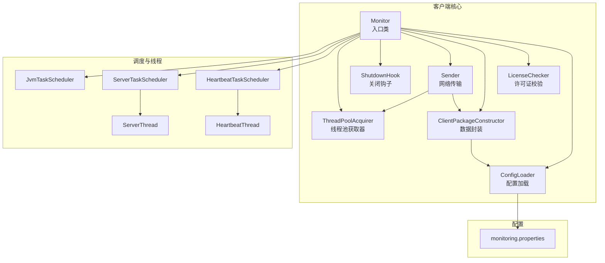
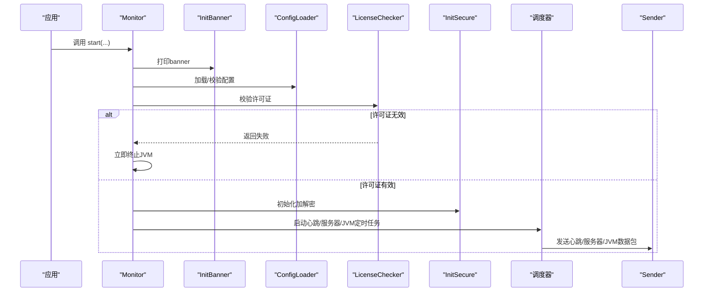
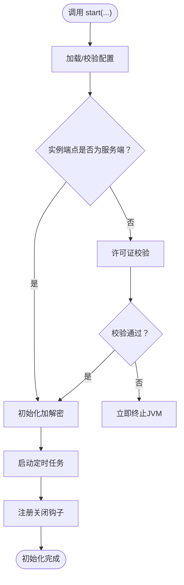
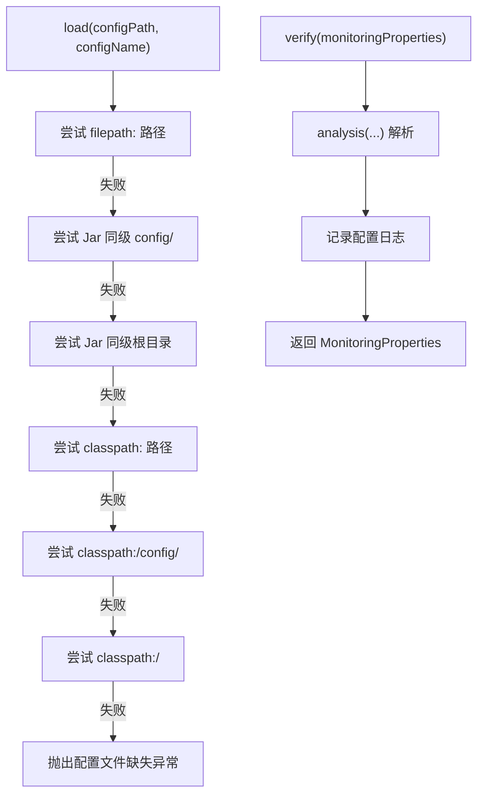
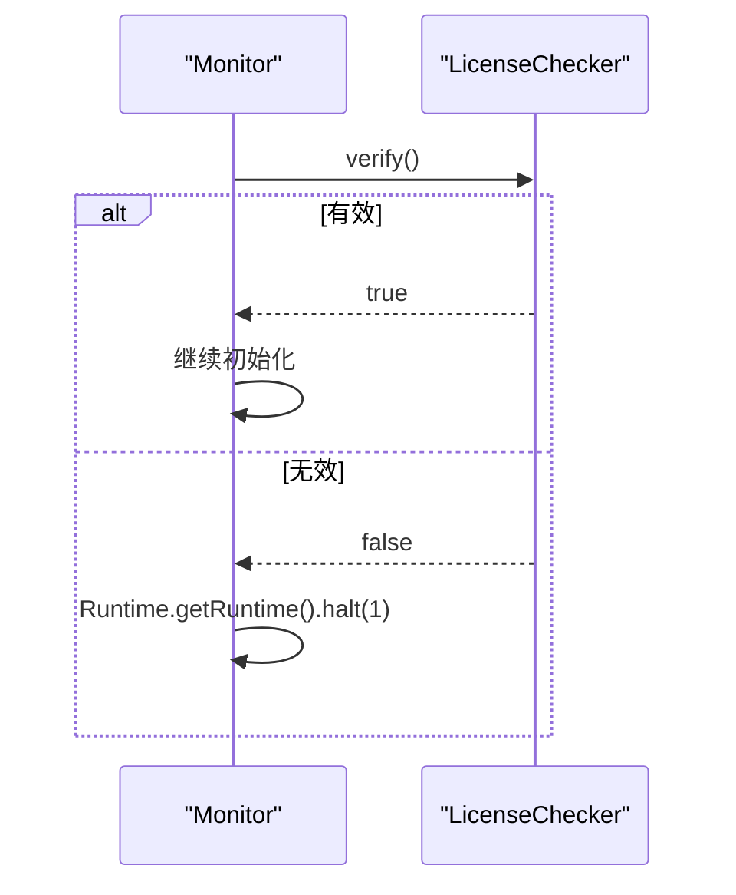
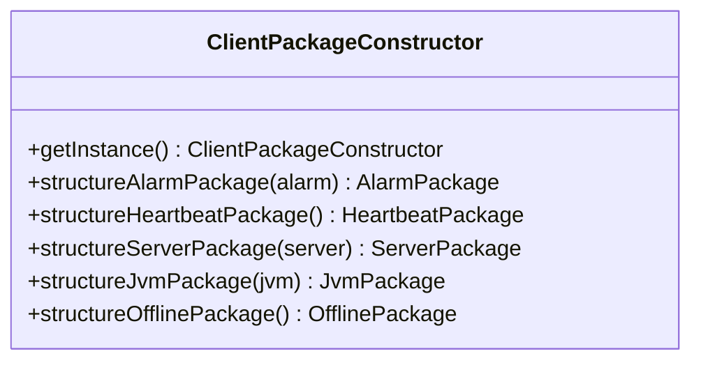
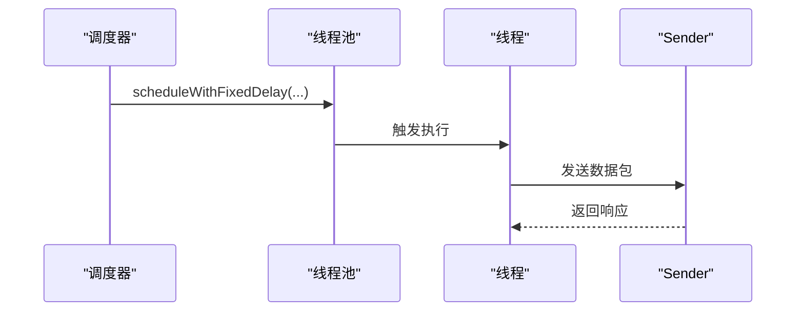
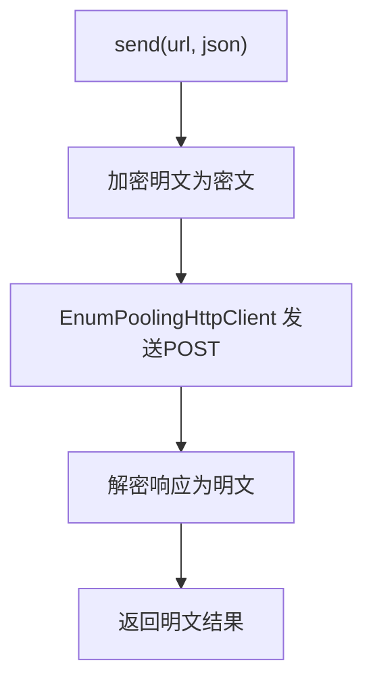
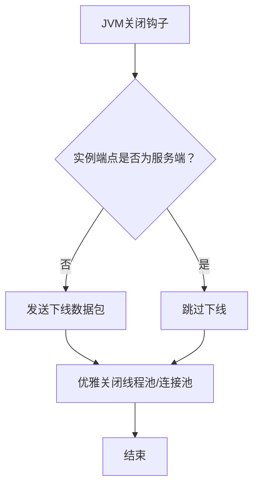
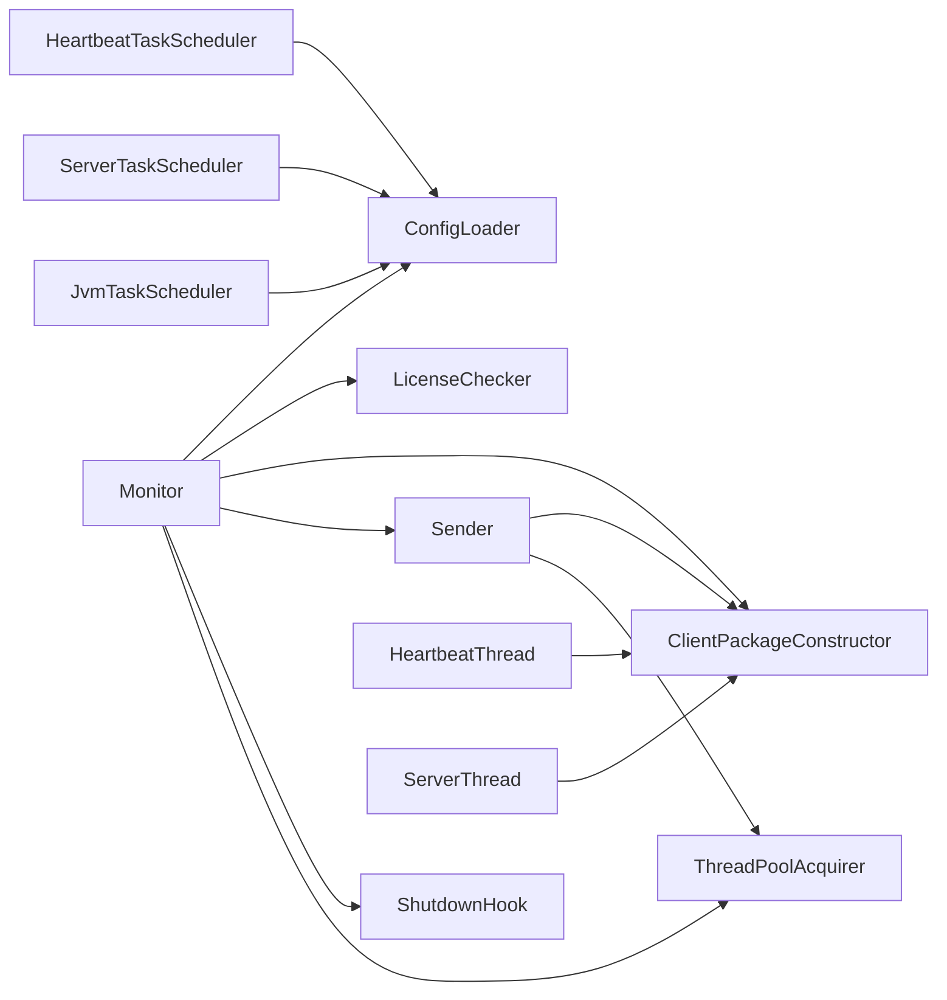

# 客户端架构设计

<cite>
**本文引用的文件**   
- [Monitor.java](file://phoenix-client/phoenix-client-core/src/main/java/com/gitee/pifeng/monitoring/plug/Monitor.java)
- [ConfigLoader.java](file://phoenix-client/phoenix-client-core/src/main/java/com/gitee/pifeng/monitoring/plug/core/ConfigLoader.java)
- [LicenseChecker.java](file://phoenix-client/phoenix-client-core/src/main/java/com/gitee/pifeng/monitoring/plug/core/LicenseChecker.java)
- [Sender.java](file://phoenix-client/phoenix-client-core/src/main/java/com/gitee/pifeng/monitoring/plug/core/Sender.java)
- [ShutdownHook.java](file://phoenix-client/phoenix-client-core/src/main/java/com/gitee/pifeng/monitoring/plug/core/ShutdownHook.java)
- [ClientPackageConstructor.java](file://phoenix-client/phoenix-client-core/src/main/java/com/gitee/pifeng/monitoring/plug/core/ClientPackageConstructor.java)
- [ThreadPoolAcquirer.java](file://phoenix-client/phoenix-client-core/src/main/java/com/gitee/pifeng/monitoring/plug/core/ThreadPoolAcquirer.java)
- [HeartbeatTaskScheduler.java](file://phoenix-client/phoenix-client-core/src/main/java/com/gitee/pifeng/monitoring/plug/scheduler/HeartbeatTaskScheduler.java)
- [ServerTaskScheduler.java](file://phoenix-client/phoenix-client-core/src/main/java/com/gitee/pifeng/monitoring/plug/scheduler/ServerTaskScheduler.java)
- [JvmTaskScheduler.java](file://phoenix-client/phoenix-client-core/src/main/java/com/gitee/pifeng/monitoring/plug/scheduler/JvmTaskScheduler.java)
- [HeartbeatThread.java](file://phoenix-client/phoenix-client-core/src/main/java/com/gitee/pifeng/monitoring/plug/thread/HeartbeatThread.java)
- [ServerThread.java](file://phoenix-client/phoenix-client-core/src/main/java/com/gitee/pifeng/monitoring/plug/thread/ServerThread.java)
- [monitoring.properties](file://phoenix-client/phoenix-client-core/src/main/resources/monitoring.properties)
</cite>

## 目录
1. [引言](#引言)
2. [项目结构](#项目结构)
3. [核心组件](#核心组件)
4. [架构总览](#架构总览)
5. [详细组件分析](#详细组件分析)
6. [依赖分析](#依赖分析)
7. [性能考量](#性能考量)
8. [故障排查指南](#故障排查指南)
9. [结论](#结论)
10. [附录](#附录)

## 引言
本文面向监控客户端架构设计，围绕 Monitor 类作为核心入口进行深入剖析，涵盖其单例模式应用、静态工厂方法设计、生命周期管理机制；并系统阐述客户端整体分层架构：配置加载层、数据封装层、调度执行层、网络传输层。同时，给出从 banner 打印、配置验证、许可证校验、加解密初始化到定时任务启动的完整初始化流程，并解释与代理端/服务端协作的关键环节（许可证验证、加解密初始化、心跳机制等）。最后提供架构图与组件交互图，帮助开发者快速理解模块间依赖与数据流。

## 项目结构
客户端位于 phoenix-client 子模块，核心代码集中在 phoenix-client-core 的 plug 包内，采用“入口类 + 核心组件 + 调度器 + 线程”的分层组织方式：
- 入口类：Monitor
- 核心组件：ConfigLoader、LicenseChecker、ClientPackageConstructor、Sender、ShutdownHook、ThreadPoolAcquirer
- 调度器：HeartbeatTaskScheduler、ServerTaskScheduler、JvmTaskScheduler
- 线程：HeartbeatThread、ServerThread
- 配置：monitoring.properties

图表来源
- [Monitor.java:67-151](file://phoenix-client/phoenix-client-core/src/main/java/com/gitee/pifeng/monitoring/plug/Monitor.java#L67-L151)
- [ConfigLoader.java:95-154](file://phoenix-client/phoenix-client-core/src/main/java/com/gitee/pifeng/monitoring/plug/core/ConfigLoader.java#L95-L154)
- [LicenseChecker.java:96-114](file://phoenix-client/phoenix-client-core/src/main/java/com/gitee/pifeng/monitoring/plug/core/LicenseChecker.java#L96-L114)
- [ClientPackageConstructor.java:64-66](file://phoenix-client/phoenix-client-core/src/main/java/com/gitee/pifeng/monitoring/plug/core/ClientPackageConstructor.java#L64-L66)
- [Sender.java:42-59](file://phoenix-client/phoenix-client-core/src/main/java/com/gitee/pifeng/monitoring/plug/core/Sender.java#L42-L59)
- [ShutdownHook.java:29-48](file://phoenix-client/phoenix-client-core/src/main/java/com/gitee/pifeng/monitoring/plug/core/ShutdownHook.java#L29-L48)
- [ThreadPoolAcquirer.java:48-94](file://phoenix-client/phoenix-client-core/src/main/java/com/gitee/pifeng/monitoring/plug/core/ThreadPoolAcquirer.java#L48-L94)
- [HeartbeatTaskScheduler.java:39-43](file://phoenix-client/phoenix-client-core/src/main/java/com/gitee/pifeng/monitoring/plug/scheduler/HeartbeatTaskScheduler.java#L39-L43)
- [ServerTaskScheduler.java:40-48](file://phoenix-client/phoenix-client-core/src/main/java/com/gitee/pifeng/monitoring/plug/scheduler/ServerTaskScheduler.java#L40-L48)
- [JvmTaskScheduler.java:40-48](file://phoenix-client/phoenix-client-core/src/main/java/com/gitee/pifeng/monitoring/plug/scheduler/JvmTaskScheduler.java#L40-L48)
- [HeartbeatThread.java:38-69](file://phoenix-client/phoenix-client-core/src/main/java/com/gitee/pifeng/monitoring/plug/thread/HeartbeatThread.java#L38-L69)
- [ServerThread.java:42-77](file://phoenix-client/phoenix-client-core/src/main/java/com/gitee/pifeng/monitoring/plug/thread/ServerThread.java#L42-L77)
- [monitoring.properties:1-41](file://phoenix-client/phoenix-client-core/src/main/resources/monitoring.properties#L1-L41)

章节来源
- [Monitor.java:40-151](file://phoenix-client/phoenix-client-core/src/main/java/com/gitee/pifeng/monitoring/plug/Monitor.java#L40-L151)
- [ConfigLoader.java:29-154](file://phoenix-client/phoenix-client-core/src/main/java/com/gitee/pifeng/monitoring/plug/core/ConfigLoader.java#L29-L154)
- [monitoring.properties:1-41](file://phoenix-client/phoenix-client-core/src/main/resources/monitoring.properties#L1-L41)

## 核心组件
- Monitor：客户端唯一入口，提供多种 start(...) 静态工厂方法，内部完成 banner 打印、配置加载/校验、许可证校验、加解密初始化、定时任务启动与 JVM 关闭钩子注册。
- ConfigLoader：负责从多路径加载 monitoring.properties，解析并封装为 MonitoringProperties，提供配置校验与默认值处理。
- LicenseChecker：负责许可证文件解析与有效期校验，失败则立即终止进程。
- ClientPackageConstructor：饿汉式单例，封装各类数据包（心跳、服务器、JVM、告警、下线）的构造逻辑。
- Sender：统一封装网络发送流程，负责明文/密文转换与 HTTP 发送。
- ThreadPoolAcquirer：懒汉式双重检查单例，提供两类调度线程池（实例任务、服务器信息）。
- 调度器与线程：分别按配置启动心跳、服务器、JVM 信息的定时任务。
- ShutdownHook：在 JVM 关闭前发送下线包并优雅关闭线程池与连接池。

章节来源
- [Monitor.java:67-151](file://phoenix-client/phoenix-client-core/src/main/java/com/gitee/pifeng/monitoring/plug/Monitor.java#L67-L151)
- [ConfigLoader.java:95-154](file://phoenix-client/phoenix-client-core/src/main/java/com/gitee/pifeng/monitoring/plug/core/ConfigLoader.java#L95-L154)
- [LicenseChecker.java:96-114](file://phoenix-client/phoenix-client-core/src/main/java/com/gitee/pifeng/monitoring/plug/core/LicenseChecker.java#L96-L114)
- [ClientPackageConstructor.java:37-66](file://phoenix-client/phoenix-client-core/src/main/java/com/gitee/pifeng/monitoring/plug/core/ClientPackageConstructor.java#L37-L66)
- [Sender.java:42-59](file://phoenix-client/phoenix-client-core/src/main/java/com/gitee/pifeng/monitoring/plug/core/Sender.java#L42-L59)
- [ThreadPoolAcquirer.java:48-94](file://phoenix-client/phoenix-client-core/src/main/java/com/gitee/pifeng/monitoring/plug/core/ThreadPoolAcquirer.java#L48-L94)
- [HeartbeatTaskScheduler.java:39-43](file://phoenix-client/phoenix-client-core/src/main/java/com/gitee/pifeng/monitoring/plug/scheduler/HeartbeatTaskScheduler.java#L39-L43)
- [ServerTaskScheduler.java:40-48](file://phoenix-client/phoenix-client-core/src/main/java/com/gitee/pifeng/monitoring/plug/scheduler/ServerTaskScheduler.java#L40-L48)
- [JvmTaskScheduler.java:40-48](file://phoenix-client/phoenix-client-core/src/main/java/com/gitee/pifeng/monitoring/plug/scheduler/JvmTaskScheduler.java#L40-L48)
- [HeartbeatThread.java:38-69](file://phoenix-client/phoenix-client-core/src/main/java/com/gitee/pifeng/monitoring/plug/thread/HeartbeatThread.java#L38-L69)
- [ServerThread.java:42-77](file://phoenix-client/phoenix-client-core/src/main/java/com/gitee/pifeng/monitoring/plug/thread/ServerThread.java#L42-L77)
- [ShutdownHook.java:29-48](file://phoenix-client/phoenix-client-core/src/main/java/com/gitee/pifeng/monitoring/plug/core/ShutdownHook.java#L29-L48)

## 架构总览
客户端采用“入口类驱动 + 分层职责 + 统一数据封装 + 可插拔线程池”的架构风格。入口类 Monitor 串联初始化流程，ConfigLoader 负责配置解析与校验，LicenseChecker 保障合规性，ClientPackageConstructor 统一构造数据包，Sender 负责网络传输，ThreadPoolAcquirer 提供线程池资源，调度器与线程实现定时采集与上报。

图表来源
- [Monitor.java:121-150](file://phoenix-client/phoenix-client-core/src/main/java/com/gitee/pifeng/monitoring/plug/Monitor.java#L121-L150)
- [ConfigLoader.java:95-154](file://phoenix-client/phoenix-client-core/src/main/java/com/gitee/pifeng/monitoring/plug/core/ConfigLoader.java#L95-L154)
- [LicenseChecker.java:96-114](file://phoenix-client/phoenix-client-core/src/main/java/com/gitee/pifeng/monitoring/plug/core/LicenseChecker.java#L96-L114)
- [Sender.java:42-59](file://phoenix-client/phoenix-client-core/src/main/java/com/gitee/pifeng/monitoring/plug/core/Sender.java#L42-L59)

## 详细组件分析

### Monitor 入口类与生命周期
- 设计要点
  - 静态工厂方法：提供三种 start(...) 重载，支持外部传入 MonitoringProperties 或指定配置文件路径/名称，或直接使用默认配置。
  - 单例模式：ClientPackageConstructor 采用“饿汉式（静态常量）”单例，确保全局唯一且线程安全，减少对象创建开销。
  - 生命周期管理：run(...) 方法内串联 banner、配置、许可证、加解密、定时任务、关闭钩子，形成完整生命周期。
- 初始化流程
  - 打印 banner
  - 加载/校验配置
  - 许可证校验（仅当实例端点非服务端）
  - 加解密初始化
  - 启动心跳、服务器、JVM 定时任务
  - 注册 JVM 关闭钩子
- 外部能力
  - sendAlarm(...)：构造告警包并通过 Sender 发送
  - buryingPoint(...)：提交业务埋点任务至受监控的调度线程池

图表来源
- [Monitor.java:67-151](file://phoenix-client/phoenix-client-core/src/main/java/com/gitee/pifeng/monitoring/plug/Monitor.java#L67-L151)

章节来源
- [Monitor.java:67-151](file://phoenix-client/phoenix-client-core/src/main/java/com/gitee/pifeng/monitoring/plug/Monitor.java#L67-L151)
- [ClientPackageConstructor.java:37-66](file://phoenix-client/phoenix-client-core/src/main/java/com/gitee/pifeng/monitoring/plug/core/ClientPackageConstructor.java#L37-L66)

### 配置加载层（ConfigLoader）
- 职责
  - 支持多路径加载 monitoring.properties：显式 filepath:、当前工作目录/config/、当前工作目录、classpath:、classpath:/config/、classpath:/。
  - 解析并封装为 MonitoringProperties，覆盖安全、通信、实例、心跳、服务器信息、JVM 信息等子属性。
  - 校验关键参数：URL 必填、超时参数必须大于 0、心跳/服务器/JVM 采样频率最小阈值、IP 合法性、端点类型枚举值。
- 设计细节
  - 使用私有静态 MONITORING_PROPERTIES 作为全局配置缓存，避免重复解析。
  - analysis(...) 统一调度各子属性封装方法，保证解析顺序与一致性。
  - getMonitoringProperties() 供 InitSecure 等组件反射使用。

图表来源
- [ConfigLoader.java:95-154](file://phoenix-client/phoenix-client-core/src/main/java/com/gitee/pifeng/monitoring/plug/core/ConfigLoader.java#L95-L154)
- [ConfigLoader.java:170-179](file://phoenix-client/phoenix-client-core/src/main/java/com/gitee/pifeng/monitoring/plug/core/ConfigLoader.java#L170-L179)

章节来源
- [ConfigLoader.java:95-154](file://phoenix-client/phoenix-client-core/src/main/java/com/gitee/pifeng/monitoring/plug/core/ConfigLoader.java#L95-L154)
- [ConfigLoader.java:170-179](file://phoenix-client/phoenix-client-core/src/main/java/com/gitee/pifeng/monitoring/plug/core/ConfigLoader.java#L170-L179)
- [monitoring.properties:10-41](file://phoenix-client/phoenix-client-core/src/main/resources/monitoring.properties#L10-L41)

### 许可证验证与加解密初始化
- 许可证验证（LicenseChecker）
  - 通过 RSA 公钥解密 license.txt 内容，反序列化为 License 对象，比较截止时间与当前时间决定有效性。
  - 若失败，记录错误并返回 false；Monitor 在非服务端场景下据此终止进程。
- 加解密初始化（InitSecure）
  - 由 Monitor 在许可证校验通过后调用，用于准备加密算法与密钥（具体实现位于公共模块 InitSecure，被反射调用）。

图表来源
- [Monitor.java:129-138](file://phoenix-client/phoenix-client-core/src/main/java/com/gitee/pifeng/monitoring/plug/Monitor.java#L129-L138)
- [LicenseChecker.java:96-114](file://phoenix-client/phoenix-client-core/src/main/java/com/gitee/pifeng/monitoring/plug/core/LicenseChecker.java#L96-L114)

章节来源
- [Monitor.java:129-138](file://phoenix-client/phoenix-client-core/src/main/java/com/gitee/pifeng/monitoring/plug/Monitor.java#L129-L138)
- [LicenseChecker.java:96-114](file://phoenix-client/phoenix-client-core/src/main/java/com/gitee/pifeng/monitoring/plug/core/LicenseChecker.java#L96-L114)

### 数据封装层（ClientPackageConstructor）
- 设计模式：饿汉式单例，全局共享，避免重复实例化。
- 职责：统一构造各类数据包（心跳、服务器、JVM、告警、下线），填充实例端点、实例 ID/名称/描述、语言、服务器类型、IP、计算机名、链路信息等通用字段。
- 关键点：链路信息包含实例链路、网络链路、时间链路，均来自配置与运行时环境。

图表来源
- [ClientPackageConstructor.java:37-282](file://phoenix-client/phoenix-client-core/src/main/java/com/gitee/pifeng/monitoring/plug/core/ClientPackageConstructor.java#L37-L282)

章节来源
- [ClientPackageConstructor.java:37-282](file://phoenix-client/phoenix-client-core/src/main/java/com/gitee/pifeng/monitoring/plug/core/ClientPackageConstructor.java#L37-L282)

### 调度执行层（调度器与线程）
- 调度器
  - HeartbeatTaskScheduler：按配置心跳频率延时启动心跳任务。
  - ServerTaskScheduler：按配置开关与频率启动服务器信息任务。
  - JvmTaskScheduler：按配置开关与频率启动 JVM 信息任务。
- 线程
  - HeartbeatThread：构造心跳包并发送，记录耗时。
  - ServerThread：采集服务器信息（可选 Sigar 或 OSHI），构造服务器包并发送，记录耗时。
- 线程池
  - ThreadPoolAcquirer：提供两类调度线程池，分别用于实例任务与服务器信息任务，采用守护线程与 AbortPolicy 策略。

图表来源
- [HeartbeatTaskScheduler.java:39-43](file://phoenix-client/phoenix-client-core/src/main/java/com/gitee/pifeng/monitoring/plug/scheduler/HeartbeatTaskScheduler.java#L39-L43)
- [ServerTaskScheduler.java:40-48](file://phoenix-client/phoenix-client-core/src/main/java/com/gitee/pifeng/monitoring/plug/scheduler/ServerTaskScheduler.java#L40-L48)
- [JvmTaskScheduler.java:40-48](file://phoenix-client/phoenix-client-core/src/main/java/com/gitee/pifeng/monitoring/plug/scheduler/JvmTaskScheduler.java#L40-L48)
- [ThreadPoolAcquirer.java:48-94](file://phoenix-client/phoenix-client-core/src/main/java/com/gitee/pifeng/monitoring/plug/core/ThreadPoolAcquirer.java#L48-L94)
- [HeartbeatThread.java:38-69](file://phoenix-client/phoenix-client-core/src/main/java/com/gitee/pifeng/monitoring/plug/thread/HeartbeatThread.java#L38-L69)
- [ServerThread.java:42-77](file://phoenix-client/phoenix-client-core/src/main/java/com/gitee/pifeng/monitoring/plug/thread/ServerThread.java#L42-L77)

章节来源
- [HeartbeatTaskScheduler.java:39-43](file://phoenix-client/phoenix-client-core/src/main/java/com/gitee/pifeng/monitoring/plug/scheduler/HeartbeatTaskScheduler.java#L39-L43)
- [ServerTaskScheduler.java:40-48](file://phoenix-client/phoenix-client-core/src/main/java/com/gitee/pifeng/monitoring/plug/scheduler/ServerTaskScheduler.java#L40-L48)
- [JvmTaskScheduler.java:40-48](file://phoenix-client/phoenix-client-core/src/main/java/com/gitee/pifeng/monitoring/plug/scheduler/JvmTaskScheduler.java#L40-L48)
- [ThreadPoolAcquirer.java:48-94](file://phoenix-client/phoenix-client-core/src/main/java/com/gitee/pifeng/monitoring/plug/core/ThreadPoolAcquirer.java#L48-L94)
- [HeartbeatThread.java:38-69](file://phoenix-client/phoenix-client-core/src/main/java/com/gitee/pifeng/monitoring/plug/thread/HeartbeatThread.java#L38-L69)
- [ServerThread.java:42-77](file://phoenix-client/phoenix-client-core/src/main/java/com/gitee/pifeng/monitoring/plug/thread/ServerThread.java#L42-L77)

### 网络传输层（Sender）
- 职责：对明文 JSON 进行加密，通过 HTTP 发送，再对响应进行解密，返回明文结果。
- 关键点：日志级别控制下打印发送/接收数据包，便于调试与审计。

图表来源
- [Sender.java:42-59](file://phoenix-client/phoenix-client-core/src/main/java/com/gitee/pifeng/monitoring/plug/core/Sender.java#L42-L59)

章节来源
- [Sender.java:42-59](file://phoenix-client/phoenix-client-core/src/main/java/com/gitee/pifeng/monitoring/plug/core/Sender.java#L42-L59)

### 生命周期管理（ShutdownHook）
- 在 JVM 关闭前：
  - 若非服务端，发送下线数据包；
  - 优雅关闭线程池与 HTTP 连接池，释放资源。

图表来源
- [ShutdownHook.java:29-48](file://phoenix-client/phoenix-client-core/src/main/java/com/gitee/pifeng/monitoring/plug/core/ShutdownHook.java#L29-L48)

章节来源
- [ShutdownHook.java:29-48](file://phoenix-client/phoenix-client-core/src/main/java/com/gitee/pifeng/monitoring/plug/core/ShutdownHook.java#L29-L48)

## 依赖分析
- 组件耦合
  - Monitor 依赖 ConfigLoader、LicenseChecker、ClientPackageConstructor、Sender、ShutdownHook、ThreadPoolAcquirer。
  - 调度器依赖 ConfigLoader 读取配置，依赖 ThreadPoolAcquirer 获取线程池。
  - 线程依赖 ClientPackageConstructor 构造数据包，依赖 Sender 发送。
- 外部依赖
  - 配置文件 monitoring.properties 提供通信 URL、超时参数、实例信息、采样频率等。
  - 加解密算法类型与密钥在配置中声明，InitSecure 依据配置初始化。

图表来源
- [Monitor.java:67-151](file://phoenix-client/phoenix-client-core/src/main/java/com/gitee/pifeng/monitoring/plug/Monitor.java#L67-L151)
- [ConfigLoader.java:95-154](file://phoenix-client/phoenix-client-core/src/main/java/com/gitee/pifeng/monitoring/plug/core/ConfigLoader.java#L95-L154)
- [ClientPackageConstructor.java:64-66](file://phoenix-client/phoenix-client-core/src/main/java/com/gitee/pifeng/monitoring/plug/core/ClientPackageConstructor.java#L64-L66)
- [Sender.java:42-59](file://phoenix-client/phoenix-client-core/src/main/java/com/gitee/pifeng/monitoring/plug/core/Sender.java#L42-L59)
- [ThreadPoolAcquirer.java:48-94](file://phoenix-client/phoenix-client-core/src/main/java/com/gitee/pifeng/monitoring/plug/core/ThreadPoolAcquirer.java#L48-L94)
- [HeartbeatTaskScheduler.java:39-43](file://phoenix-client/phoenix-client-core/src/main/java/com/gitee/pifeng/monitoring/plug/scheduler/HeartbeatTaskScheduler.java#L39-L43)
- [ServerTaskScheduler.java:40-48](file://phoenix-client/phoenix-client-core/src/main/java/com/gitee/pifeng/monitoring/plug/scheduler/ServerTaskScheduler.java#L40-L48)
- [JvmTaskScheduler.java:40-48](file://phoenix-client/phoenix-client-core/src/main/java/com/gitee/pifeng/monitoring/plug/scheduler/JvmTaskScheduler.java#L40-L48)
- [HeartbeatThread.java:38-69](file://phoenix-client/phoenix-client-core/src/main/java/com/gitee/pifeng/monitoring/plug/thread/HeartbeatThread.java#L38-L69)
- [ServerThread.java:42-77](file://phoenix-client/phoenix-client-core/src/main/java/com/gitee/pifeng/monitoring/plug/thread/ServerThread.java#L42-L77)

章节来源
- [Monitor.java:67-151](file://phoenix-client/phoenix-client-core/src/main/java/com/gitee/pifeng/monitoring/plug/Monitor.java#L67-L151)
- [ConfigLoader.java:95-154](file://phoenix-client/phoenix-client-core/src/main/java/com/gitee/pifeng/monitoring/plug/core/ConfigLoader.java#L95-L154)
- [Sender.java:42-59](file://phoenix-client/phoenix-client-core/src/main/java/com/gitee/pifeng/monitoring/plug/core/Sender.java#L42-L59)

## 性能考量
- 线程池设计
  - ThreadPoolAcquirer 采用“可用 CPU / (1 - 阻塞系数)”估算线程数，针对 IO 密集型场景设置较高线程数，提升吞吐。
  - 线程命名规范，守护线程，避免影响 JVM 正常退出。
- 任务调度
  - 不同类型任务使用独立线程池，避免相互干扰。
  - 启动时设置不同初始延迟（心跳 35s、服务器 40s、JVM 45s），降低冷启动并发压力。
- 日志与耗时
  - 心跳与服务器信息线程在构建+发送完成后记录耗时，超过阈值输出警告，便于定位性能瓶颈。
- 加解密
  - 通过统一 Sender 进行明文/密文转换，避免重复加解密逻辑，减少开销。

章节来源
- [ThreadPoolAcquirer.java:48-94](file://phoenix-client/phoenix-client-core/src/main/java/com/gitee/pifeng/monitoring/plug/core/ThreadPoolAcquirer.java#L48-L94)
- [HeartbeatTaskScheduler.java:39-43](file://phoenix-client/phoenix-client-core/src/main/java/com/gitee/pifeng/monitoring/plug/scheduler/HeartbeatTaskScheduler.java#L39-L43)
- [ServerTaskScheduler.java:40-48](file://phoenix-client/phoenix-client-core/src/main/java/com/gitee/pifeng/monitoring/plug/scheduler/ServerTaskScheduler.java#L40-L48)
- [JvmTaskScheduler.java:40-48](file://phoenix-client/phoenix-client-core/src/main/java/com/gitee/pifeng/monitoring/plug/scheduler/JvmTaskScheduler.java#L40-L48)
- [HeartbeatThread.java:57-68](file://phoenix-client/phoenix-client-core/src/main/java/com/gitee/pifeng/monitoring/plug/thread/HeartbeatThread.java#L57-L68)
- [ServerThread.java:64-76](file://phoenix-client/phoenix-client-core/src/main/java/com/gitee/pifeng/monitoring/plug/thread/ServerThread.java#L64-L76)
- [Sender.java:42-59](file://phoenix-client/phoenix-client-core/src/main/java/com/gitee/pifeng/monitoring/plug/core/Sender.java#L42-L59)

## 故障排查指南
- 配置问题
  - 找不到配置文件：确认 monitoring.properties 路径与 classpath 是否正确，参考 ConfigLoader 的多路径查找策略。
  - 配置参数非法：URL 为空、超时参数非正数、采样频率低于阈值、IP 非法、端点类型不在允许集合内。
- 许可证问题
  - 许可证无效或过期：检查 license.txt 内容与截止时间，必要时重新生成。
- 网络问题
  - 代理端/服务端不可达：检查 monitoring.comm.http.url 与网络连通性；查看 Sender 的加密/解密日志。
- 性能问题
  - 心跳/服务器信息耗时过长：关注线程日志中的耗时统计，结合系统负载与 IO 情况优化采样频率或线程池参数。
- 关闭流程
  - JVM 退出时未发送下线：确认 ShutdownHook 已注册，检查非服务端场景下的下线发送逻辑。

章节来源
- [ConfigLoader.java:95-154](file://phoenix-client/phoenix-client-core/src/main/java/com/gitee/pifeng/monitoring/plug/core/ConfigLoader.java#L95-L154)
- [LicenseChecker.java:96-114](file://phoenix-client/phoenix-client-core/src/main/java/com/gitee/pifeng/monitoring/plug/core/LicenseChecker.java#L96-L114)
- [Sender.java:42-59](file://phoenix-client/phoenix-client-core/src/main/java/com/gitee/pifeng/monitoring/plug/core/Sender.java#L42-L59)
- [ShutdownHook.java:29-48](file://phoenix-client/phoenix-client-core/src/main/java/com/gitee/pifeng/monitoring/plug/core/ShutdownHook.java#L29-L48)

## 结论
该客户端架构以 Monitor 为核心入口，采用清晰的分层设计与严格的生命周期管理，结合统一的数据封装与网络传输，实现了稳定高效的监控数据采集与上报。通过许可证校验与加解密初始化保障合规与安全，通过可插拔线程池与任务调度满足不同场景的性能需求。建议在生产环境中重点关注配置参数校验、许可证有效期与网络连通性，并根据实际负载调整采样频率与线程池大小。

## 附录
- 最佳实践
  - 将 monitoring.properties 放置于可访问的 classpath 或 Jar 同级目录，确保 ConfigLoader 能够正确加载。
  - 合理设置采样频率，避免对目标系统造成过大压力。
  - 在非服务端场景启用许可证校验，确保合规运行。
  - 使用统一的线程池命名与守护线程策略，避免影响 JVM 退出。
- 扩展点
  - 新增数据包类型：在 ClientPackageConstructor 中新增构造方法，并在 Monitor 的 sendAlarm(...) 中支持新类型。
  - 自定义线程池：在 ThreadPoolAcquirer 中增加新的线程池实例，供特定调度器使用。
  - 插件化采集：在 ServerThread 中扩展新的采集源（如数据库、中间件），并在 ServerTaskScheduler 中启用。