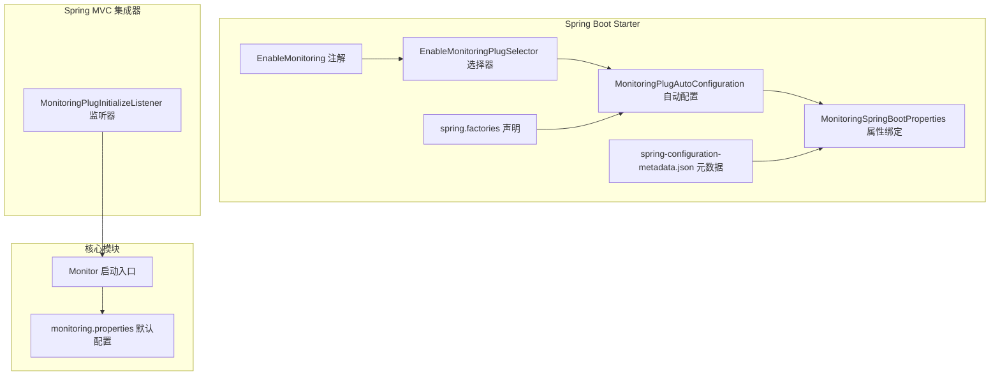
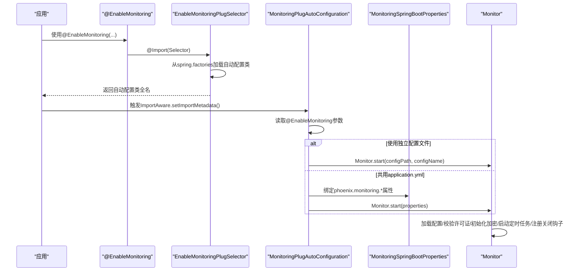
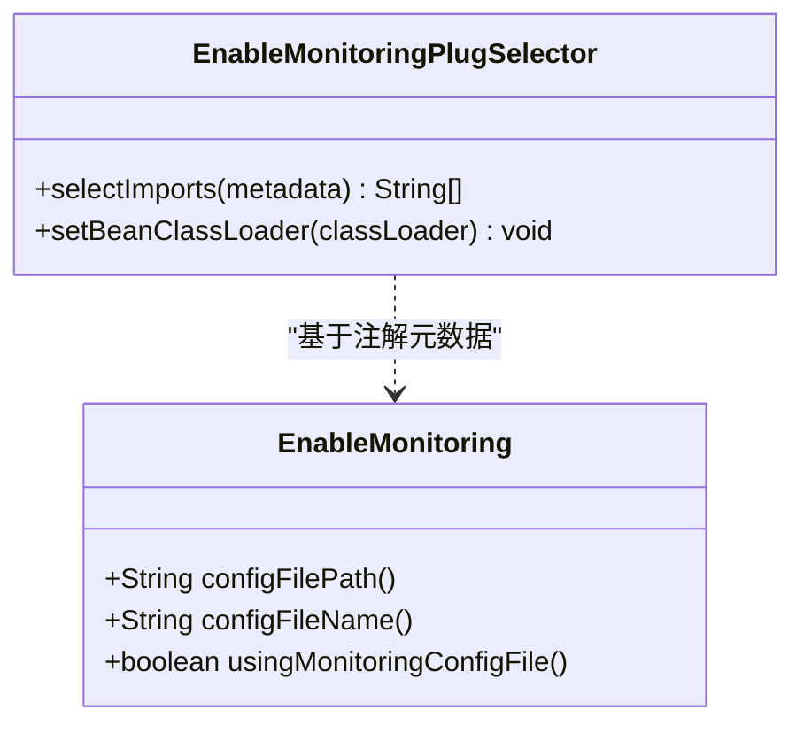
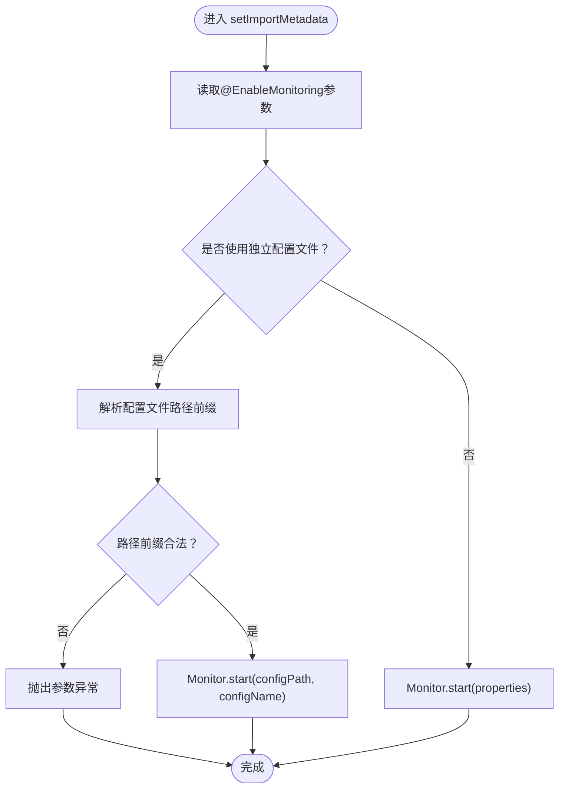
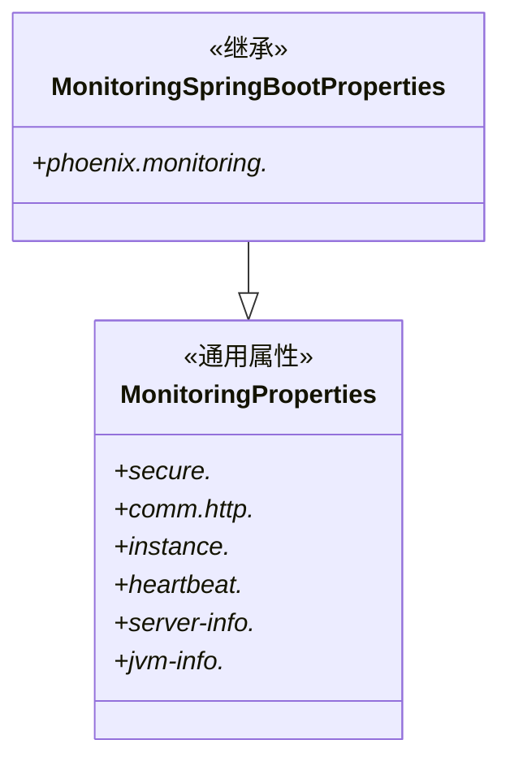
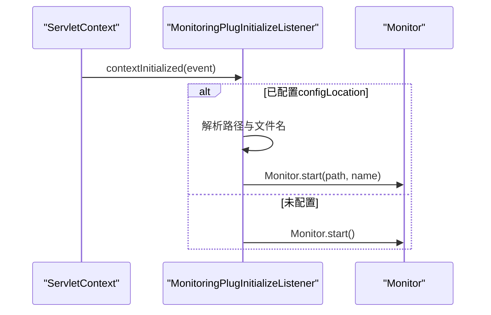
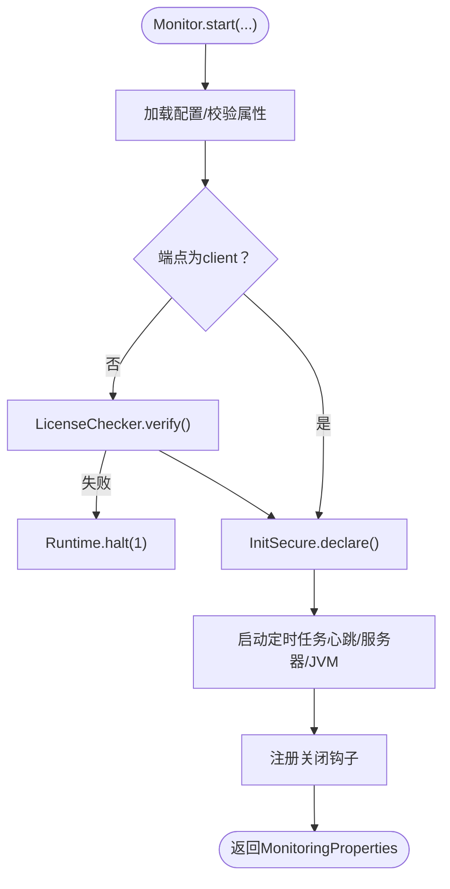
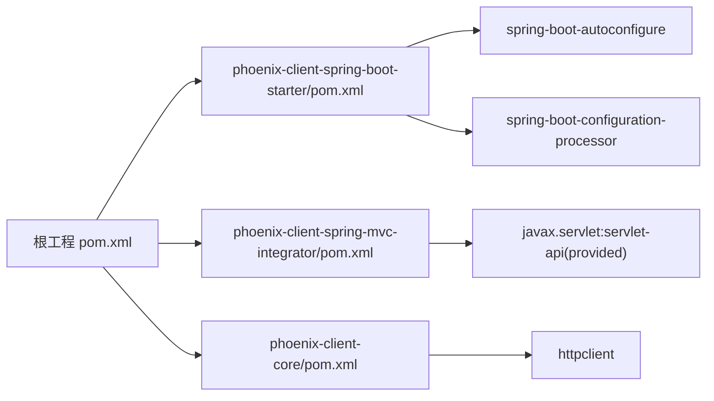

# 客户端集成方式

<cite>
**本文档引用的文件**   
- [EnableMonitoring.java](file://phoenix-client/phoenix-client-spring-boot-starter/src/main/java/com/gitee/pifeng/monitoring/starter/annotation/EnableMonitoring.java)
- [MonitoringPlugAutoConfiguration.java](file://phoenix-client/phoenix-client-spring-boot-starter/src/main/java/com/gitee/pifeng/monitoring/starter/autoconfigure/MonitoringPlugAutoConfiguration.java)
- [EnableMonitoringPlugSelector.java](file://phoenix-client/phoenix-client-spring-boot-starter/src/main/java/com/gitee/pifeng/monitoring/starter/selector/EnableMonitoringPlugSelector.java)
- [MonitoringSpringBootProperties.java](file://phoenix-client/phoenix-client-spring-boot-starter/src/main/java/com/gitee/pifeng/monitoring/starter/property/MonitoringSpringBootProperties.java)
- [spring.factories](file://phoenix-client/phoenix-client-spring-boot-starter/src/main/resources/META-INF/spring.factories)
- [spring-configuration-metadata.json](file://phoenix-client/phoenix-client-spring-boot-starter/src/main/resources/META-INF/spring-configuration-metadata.json)
- [MonitoringPlugInitializeListener.java](file://phoenix-client/phoenix-client-spring-mvc-integrator/src/main/java/com/gitee/pifeng/monitoring/integrator/listener/MonitoringPlugInitializeListener.java)
- [Monitor.java](file://phoenix-client/phoenix-client-core/src/main/java/com/gitee/pifeng/monitoring/plug/Monitor.java)
- [monitoring.properties](file://phoenix-client/phoenix-client-core/src/main/resources/monitoring.properties)
- [pom.xml（根工程）](file://pom.xml)
- [pom.xml（Spring Boot Starter）](file://phoenix-client/phoenix-client-spring-boot-starter/pom.xml)
- [pom.xml（Spring MVC 集成器）](file://phoenix-client/phoenix-client-spring-mvc-integrator/pom.xml)
- [pom.xml（核心模块）](file://phoenix-client/phoenix-client-core/pom.xml)
</cite>

## 目录
1. [引言](#引言)
2. [项目结构](#项目结构)
3. [核心组件](#核心组件)
4. [架构总览](#架构总览)
5. [详细组件分析](#详细组件分析)
6. [依赖分析](#依赖分析)
7. [性能考虑](#性能考虑)
8. [故障排查指南](#故障排查指南)
9. [结论](#结论)
10. [附录](#附录)

## 引言
本文件面向希望在Spring生态中集成Phoenix监控客户端的开发者，系统阐述两种集成方式：基于Spring Boot Starter的自动装配与基于传统Servlet容器的监听器手动集成。文档重点解释@EnableMonitoring注解的实现原理、MonitoringPlugAutoConfiguration的自动配置流程、条件装配逻辑，以及手动集成的监听器配置要点。同时给出关键配置项说明、Spring Boot 2.x/3.x兼容性提示、Spring MVC与Spring WebFlux支持现状、完整集成步骤与常见问题排查方法。

## 项目结构
Phoenix客户端集成涉及三个主要模块：
- Spring Boot Starter：提供@EnableMonitoring注解、自动配置类、属性绑定与spring.factories声明。
- Spring MVC 集成器：提供ServletContextListener，适配传统Servlet容器。
- 核心模块：Monitor入口类负责启动监控、加载配置、调度定时任务与关闭钩子。

**图表来源**
- [EnableMonitoring.java:16-61](file://phoenix-client/phoenix-client-spring-boot-starter/src/main/java/com/gitee/pifeng/monitoring/starter/annotation/EnableMonitoring.java#L16-L61)
- [EnableMonitoringPlugSelector.java:22-65](file://phoenix-client/phoenix-client-spring-boot-starter/src/main/java/com/gitee/pifeng/monitoring/starter/selector/EnableMonitoringPlugSelector.java#L22-L65)
- [MonitoringPlugAutoConfiguration.java:29-99](file://phoenix-client/phoenix-client-spring-boot-starter/src/main/java/com/gitee/pifeng/monitoring/starter/autoconfigure/MonitoringPlugAutoConfiguration.java#L29-L99)
- [MonitoringSpringBootProperties.java:17-22](file://phoenix-client/phoenix-client-spring-boot-starter/src/main/java/com/gitee/pifeng/monitoring/starter/property/MonitoringSpringBootProperties.java#L17-L22)
- [spring.factories:1-4](file://phoenix-client/phoenix-client-spring-boot-starter/src/main/resources/META-INF/spring.factories#L1-L4)
- [spring-configuration-metadata.json:1-182](file://phoenix-client/phoenix-client-spring-boot-starter/src/main/resources/META-INF/spring-configuration-metadata.json#L1-L182)
- [MonitoringPlugInitializeListener.java:21-92](file://phoenix-client/phoenix-client-spring-mvc-integrator/src/main/java/com/gitee/pifeng/monitoring/integrator/listener/MonitoringPlugInitializeListener.java#L21-L92)
- [Monitor.java:40-151](file://phoenix-client/phoenix-client-core/src/main/java/com/gitee/pifeng/monitoring/plug/Monitor.java#L40-L151)
- [monitoring.properties:1-41](file://phoenix-client/phoenix-client-core/src/main/resources/monitoring.properties#L1-L41)

**章节来源**
- [pom.xml（根工程）:1-785](file://pom.xml#L1-L785)
- [pom.xml（Spring Boot Starter）:1-71](file://phoenix-client/phoenix-client-spring-boot-starter/pom.xml#L1-L71)
- [pom.xml（Spring MVC 集成器）:1-67](file://phoenix-client/phoenix-client-spring-mvc-integrator/pom.xml#L1-L67)
- [pom.xml（核心模块）:1-82](file://phoenix-client/phoenix-client-core/pom.xml#L1-L82)

## 核心组件
- @EnableMonitoring：通过@Import导入选择器，携带配置文件路径、文件名与是否使用独立配置文件等参数。
- EnableMonitoringPlugSelector：基于DeferredImportSelector按SPI从spring.factories加载自动配置类。
- MonitoringPlugAutoConfiguration：实现ImportAware，读取@EnableMonitoring元数据，决定使用独立配置文件还是Spring Boot属性。
- MonitoringSpringBootProperties：将phoenix.monitoring前缀的配置映射到监控属性对象。
- MonitoringPlugInitializeListener：在Servlet上下文初始化时启动Monitor，支持独立配置文件路径与文件名。
- Monitor：监控启动入口，负责加载配置、许可证校验、初始化加解密、启动定时任务与关闭钩子。

**章节来源**
- [EnableMonitoring.java:16-61](file://phoenix-client/phoenix-client-spring-boot-starter/src/main/java/com/gitee/pifeng/monitoring/starter/annotation/EnableMonitoring.java#L16-L61)
- [EnableMonitoringPlugSelector.java:22-65](file://phoenix-client/phoenix-client-spring-boot-starter/src/main/java/com/gitee/pifeng/monitoring/starter/selector/EnableMonitoringPlugSelector.java#L22-L65)
- [MonitoringPlugAutoConfiguration.java:29-99](file://phoenix-client/phoenix-client-spring-boot-starter/src/main/java/com/gitee/pifeng/monitoring/starter/autoconfigure/MonitoringPlugAutoConfiguration.java#L29-L99)
- [MonitoringSpringBootProperties.java:17-22](file://phoenix-client/phoenix-client-spring-boot-starter/src/main/java/com/gitee/pifeng/monitoring/starter/property/MonitoringSpringBootProperties.java#L17-L22)
- [MonitoringPlugInitializeListener.java:21-92](file://phoenix-client/phoenix-client-spring-mvc-integrator/src/main/java/com/gitee/pifeng/monitoring/integrator/listener/MonitoringPlugInitializeListener.java#L21-L92)
- [Monitor.java:40-151](file://phoenix-client/phoenix-client-core/src/main/java/com/gitee/pifeng/monitoring/plug/Monitor.java#L40-L151)

## 架构总览
Spring Boot自动装配与手动集成两条路径最终都会调用Monitor启动监控流程。

**图表来源**
- [EnableMonitoring.java:16-61](file://phoenix-client/phoenix-client-spring-boot-starter/src/main/java/com/gitee/pifeng/monitoring/starter/annotation/EnableMonitoring.java#L16-L61)
- [EnableMonitoringPlugSelector.java:22-65](file://phoenix-client/phoenix-client-spring-boot-starter/src/main/java/com/gitee/pifeng/monitoring/starter/selector/EnableMonitoringPlugSelector.java#L22-L65)
- [MonitoringPlugAutoConfiguration.java:49-99](file://phoenix-client/phoenix-client-spring-boot-starter/src/main/java/com/gitee/pifeng/monitoring/starter/autoconfigure/MonitoringPlugAutoConfiguration.java#L49-L99)
- [MonitoringSpringBootProperties.java:17-22](file://phoenix-client/phoenix-client-spring-boot-starter/src/main/java/com/gitee/pifeng/monitoring/starter/property/MonitoringSpringBootProperties.java#L17-L22)
- [Monitor.java:67-151](file://phoenix-client/phoenix-client-core/src/main/java/com/gitee/pifeng/monitoring/plug/Monitor.java#L67-L151)

## 详细组件分析

### @EnableMonitoring 注解与选择器
- 注解职责：声明启用监控并传入配置参数（配置文件路径、文件名、是否使用独立配置文件）。
- 选择器职责：基于SPI从spring.factories加载自动配置类，若未找到则抛出异常，确保装配链路正确。

**图表来源**
- [EnableMonitoring.java:16-61](file://phoenix-client/phoenix-client-spring-boot-starter/src/main/java/com/gitee/pifeng/monitoring/starter/annotation/EnableMonitoring.java#L16-L61)
- [EnableMonitoringPlugSelector.java:22-65](file://phoenix-client/phoenix-client-spring-boot-starter/src/main/java/com/gitee/pifeng/monitoring/starter/selector/EnableMonitoringPlugSelector.java#L22-L65)

**章节来源**
- [EnableMonitoring.java:16-61](file://phoenix-client/phoenix-client-spring-boot-starter/src/main/java/com/gitee/pifeng/monitoring/starter/annotation/EnableMonitoring.java#L16-L61)
- [EnableMonitoringPlugSelector.java:22-65](file://phoenix-client/phoenix-client-spring-boot-starter/src/main/java/com/gitee/pifeng/monitoring/starter/selector/EnableMonitoringPlugSelector.java#L22-L65)
- [spring.factories:1-4](file://phoenix-client/phoenix-client-spring-boot-starter/src/main/resources/META-INF/spring.factories#L1-L4)

### 自动配置类与条件装配
- 条件装配：仅当存在Monitor类时生效，避免非客户端环境误装配。
- 优先级：最低优先级，确保其他自动配置能先完成。
- ImportAware：读取@EnableMonitoring元数据，分支处理独立配置文件与Spring Boot属性两种启动路径。

**图表来源**
- [MonitoringPlugAutoConfiguration.java:49-99](file://phoenix-client/phoenix-client-spring-boot-starter/src/main/java/com/gitee/pifeng/monitoring/starter/autoconfigure/MonitoringPlugAutoConfiguration.java#L49-L99)

**章节来源**
- [MonitoringPlugAutoConfiguration.java:29-99](file://phoenix-client/phoenix-client-spring-boot-starter/src/main/java/com/gitee/pifeng/monitoring/starter/autoconfigure/MonitoringPlugAutoConfiguration.java#L29-L99)

### 属性绑定与配置元数据
- 属性绑定：MonitoringSpringBootProperties以phoenix.monitoring为前缀，继承通用监控属性模型。
- 配置元数据：spring-configuration-metadata.json提供属性分组、类型与描述，便于IDE提示与配置校验。

**图表来源**
- [MonitoringSpringBootProperties.java:17-22](file://phoenix-client/phoenix-client-spring-boot-starter/src/main/java/com/gitee/pifeng/monitoring/starter/property/MonitoringSpringBootProperties.java#L17-L22)
- [spring-configuration-metadata.json:1-182](file://phoenix-client/phoenix-client-spring-boot-starter/src/main/resources/META-INF/spring-configuration-metadata.json#L1-L182)

**章节来源**
- [MonitoringSpringBootProperties.java:17-22](file://phoenix-client/phoenix-client-spring-boot-starter/src/main/java/com/gitee/pifeng/monitoring/starter/property/MonitoringSpringBootProperties.java#L17-L22)
- [spring-configuration-metadata.json:1-182](file://phoenix-client/phoenix-client-spring-boot-starter/src/main/resources/META-INF/spring-configuration-metadata.json#L1-L182)

### 手动集成（Spring MVC）
- 监听器：MonitoringPlugInitializeListener在ServletContext初始化时启动Monitor。
- 支持独立配置文件：通过ServletContext初始化参数configLocation传递“classpath:”或“filepath:”前缀路径与文件名。
- 销毁回调：上下文销毁时记录日志。

**图表来源**
- [MonitoringPlugInitializeListener.java:32-92](file://phoenix-client/phoenix-client-spring-mvc-integrator/src/main/java/com/gitee/pifeng/monitoring/integrator/listener/MonitoringPlugInitializeListener.java#L32-L92)
- [Monitor.java:67-102](file://phoenix-client/phoenix-client-core/src/main/java/com/gitee/pifeng/monitoring/plug/Monitor.java#L67-L102)

**章节来源**
- [MonitoringPlugInitializeListener.java:21-92](file://phoenix-client/phoenix-client-spring-mvc-integrator/src/main/java/com/gitee/pifeng/monitoring/integrator/listener/MonitoringPlugInitializeListener.java#L21-L92)
- [Monitor.java:67-102](file://phoenix-client/phoenix-client-core/src/main/java/com/gitee/pifeng/monitoring/plug/Monitor.java#L67-L102)

### 核心启动流程
- Monitor.start重载：无参、带独立配置文件路径与文件名、带属性对象三种。
- 启动步骤：打印横幅、加载配置或校验属性、许可证校验、初始化加解密、启动心跳/服务器/JVM定时任务、注册JVM关闭钩子。

**图表来源**
- [Monitor.java:67-151](file://phoenix-client/phoenix-client-core/src/main/java/com/gitee/pifeng/monitoring/plug/Monitor.java#L67-L151)

**章节来源**
- [Monitor.java:67-151](file://phoenix-client/phoenix-client-core/src/main/java/com/gitee/pifeng/monitoring/plug/Monitor.java#L67-L151)

## 依赖分析
- 根工程统一管理Spring Boot版本与依赖范围，客户端Starter依赖spring-boot-autoconfigure与配置处理器。
- Spring MVC集成器依赖servlet-api（provided），核心模块依赖HTTP客户端与公共模块。
- spring.factories声明@EnableMonitoring与自动配置类映射，保证选择器可加载到自动配置类。

**图表来源**
- [pom.xml（根工程）:132-392](file://pom.xml#L132-L392)
- [pom.xml（Spring Boot Starter）:22-57](file://phoenix-client/phoenix-client-spring-boot-starter/pom.xml#L22-L57)
- [pom.xml（Spring MVC 集成器）:22-53](file://phoenix-client/phoenix-client-spring-mvc-integrator/pom.xml#L22-L53)
- [pom.xml（核心模块）:22-59](file://phoenix-client/phoenix-client-core/pom.xml#L22-L59)

**章节来源**
- [pom.xml（根工程）:132-392](file://pom.xml#L132-L392)
- [spring.factories:1-4](file://phoenix-client/phoenix-client-spring-boot-starter/src/main/resources/META-INF/spring.factories#L1-L4)

## 性能考虑
- 定时任务频率：心跳、服务器信息、JVM信息的发送频率由配置控制，建议结合网络与资源占用合理设置。
- 线程池与调度：监控内部使用受监控的线程池与调度器，避免阻塞主线程。
- 加解密开销：启用加密算法会带来CPU开销，建议在生产环境按需开启并选择合适算法。

[本节为通用指导，无需特定文件来源]

## 故障排查指南
- 独立配置文件路径前缀错误：当使用独立配置文件时，路径必须以“classpath:”或“filepath:”开头，否则抛出参数异常。
- 未找到自动配置类：选择器从spring.factories加载自动配置类，若为空将抛出非法状态异常。
- 监控端点非client且许可证校验失败：将立即终止JVM进程，检查端点类型与许可证有效性。
- Servlet监听器配置错误：configLocation必须符合约定格式，否则抛出监听器配置异常。
- 未配置或配置缺失：Monitor在启动时会对配置进行校验，缺失关键参数将抛出相应异常。

**章节来源**
- [MonitoringPlugAutoConfiguration.java:88-99](file://phoenix-client/phoenix-client-spring-boot-starter/src/main/java/com/gitee/pifeng/monitoring/starter/autoconfigure/MonitoringPlugAutoConfiguration.java#L88-L99)
- [EnableMonitoringPlugSelector.java:43-48](file://phoenix-client/phoenix-client-spring-boot-starter/src/main/java/com/gitee/pifeng/monitoring/starter/selector/EnableMonitoringPlugSelector.java#L43-L48)
- [Monitor.java:124-138](file://phoenix-client/phoenix-client-core/src/main/java/com/gitee/pifeng/monitoring/plug/Monitor.java#L124-L138)
- [MonitoringPlugInitializeListener.java:62-76](file://phoenix-client/phoenix-client-spring-mvc-integrator/src/main/java/com/gitee/pifeng/monitoring/integrator/listener/MonitoringPlugInitializeListener.java#L62-L76)

## 结论
Phoenix客户端提供了两种稳定可靠的集成方式：Spring Boot自动装配与传统Servlet监听器手动集成。前者通过@EnableMonitoring与自动配置类实现零样板代码接入，后者适用于非Spring Boot或历史遗留的Servlet应用。通过合理的配置与参数校验，可在不同Spring版本与运行环境下稳定运行。

[本节为总结，无需特定文件来源]

## 附录

### 集成步骤（Spring Boot 2.x/3.x）
- 添加依赖：引入phoenix-client-spring-boot-starter。
- 启用监控：在应用主类或配置类上使用@EnableMonitoring。
- 配置方式一（独立配置文件）：设置configFilePath与configFileName，并开启usingMonitoringConfigFile。
- 配置方式二（共用application.yml）：在application.yml中按phoenix.monitoring前缀配置各项属性。
- 启动验证：确认Monitor启动日志与定时任务正常运行。

**章节来源**
- [EnableMonitoring.java:16-61](file://phoenix-client/phoenix-client-spring-boot-starter/src/main/java/com/gitee/pifeng/monitoring/starter/annotation/EnableMonitoring.java#L16-L61)
- [MonitoringSpringBootProperties.java:17-22](file://phoenix-client/phoenix-client-spring-boot-starter/src/main/java/com/gitee/pifeng/monitoring/starter/property/MonitoringSpringBootProperties.java#L17-L22)
- [spring-configuration-metadata.json:1-182](file://phoenix-client/phoenix-client-spring-boot-starter/src/main/resources/META-INF/spring-configuration-metadata.json#L1-L182)

### 集成步骤（Spring MVC）
- 添加依赖：引入phoenix-client-spring-mvc-integrator。
- 配置监听器：在web.xml中声明MonitoringPlugInitializeListener，并通过configLocation指定独立配置文件路径与文件名。
- 启动验证：确认ServletContext初始化时触发Monitor启动。

**章节来源**
- [MonitoringPlugInitializeListener.java:21-92](file://phoenix-client/phoenix-client-spring-mvc-integrator/src/main/java/com/gitee/pifeng/monitoring/integrator/listener/MonitoringPlugInitializeListener.java#L21-L92)

### 关键配置项说明
- phoenix.monitoring.secure.*：安全相关配置，含加密算法类型与各算法密钥。
- phoenix.monitoring.comm.http.*：HTTP通信配置，含服务端URL与超时参数。
- phoenix.monitoring.instance.*：实例信息，含端点类型、名称、语言等。
- phoenix.monitoring.heartbeat.rate：心跳发送频率。
- phoenix.monitoring.server-info.*：服务器信息采集开关、频率与IP等。
- phoenix.monitoring.jvm-info.*：JVM信息采集开关与频率。

**章节来源**
- [spring-configuration-metadata.json:60-182](file://phoenix-client/phoenix-client-spring-boot-starter/src/main/resources/META-INF/spring-configuration-metadata.json#L60-L182)
- [monitoring.properties:1-41](file://phoenix-client/phoenix-client-core/src/main/resources/monitoring.properties#L1-L41)

### Spring 版本与框架支持
- Spring Boot 2.x/3.x：根工程使用spring-boot-dependencies管理版本，Starter依赖spring-boot-autoconfigure与配置处理器，可覆盖2.x/3.x。
- Spring MVC：提供专门的集成器模块，适用于传统Servlet容器。
- Spring WebFlux：当前集成器未提供专用WebFlux拦截器或自动配置，如需集成需自行扩展或采用HTTP客户端方式上报。

**章节来源**
- [pom.xml（根工程）:132-392](file://pom.xml#L132-L392)
- [pom.xml（Spring Boot Starter）:22-57](file://phoenix-client/phoenix-client-spring-boot-starter/pom.xml#L22-L57)
- [pom.xml（Spring MVC 集成器）:22-53](file://phoenix-client/phoenix-client-spring-mvc-integrator/pom.xml#L22-L53)