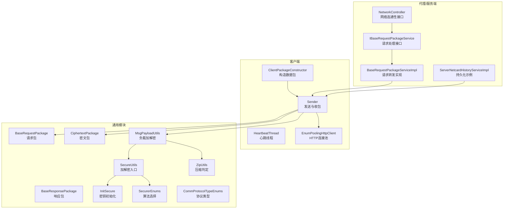
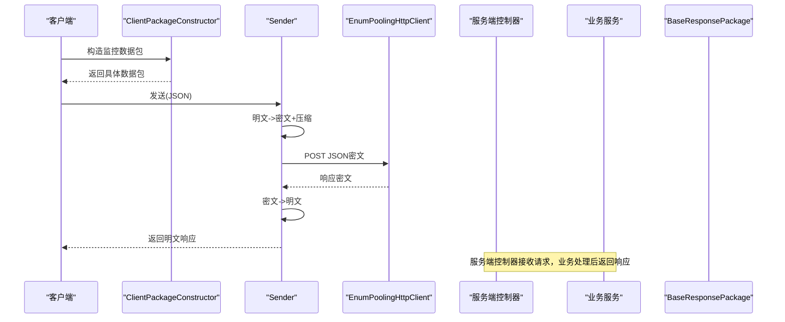
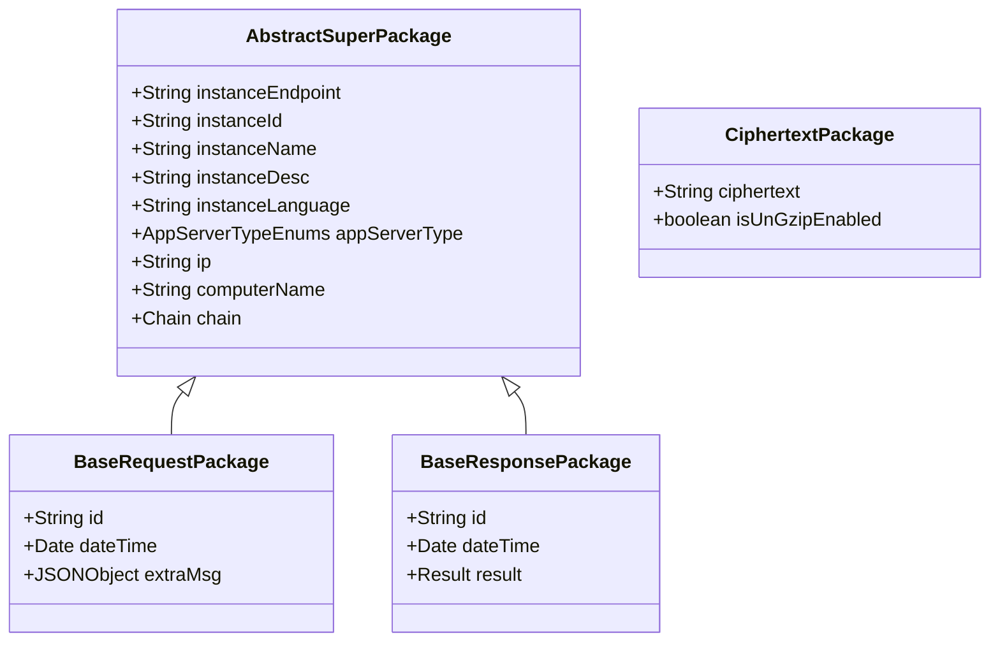
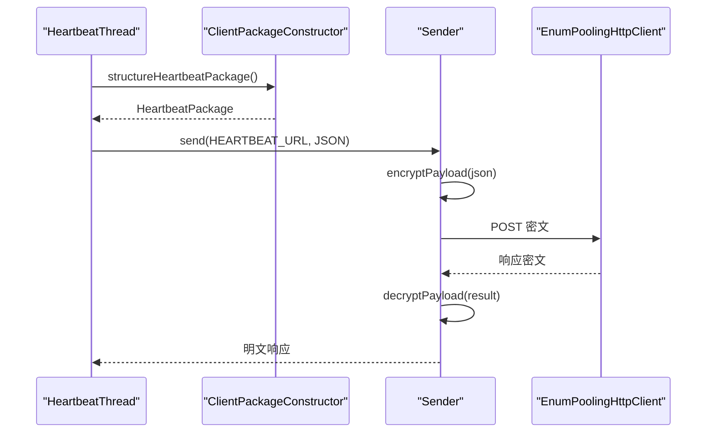
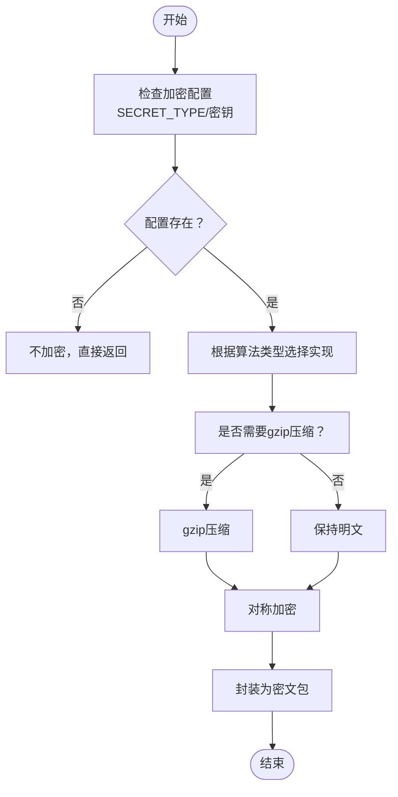
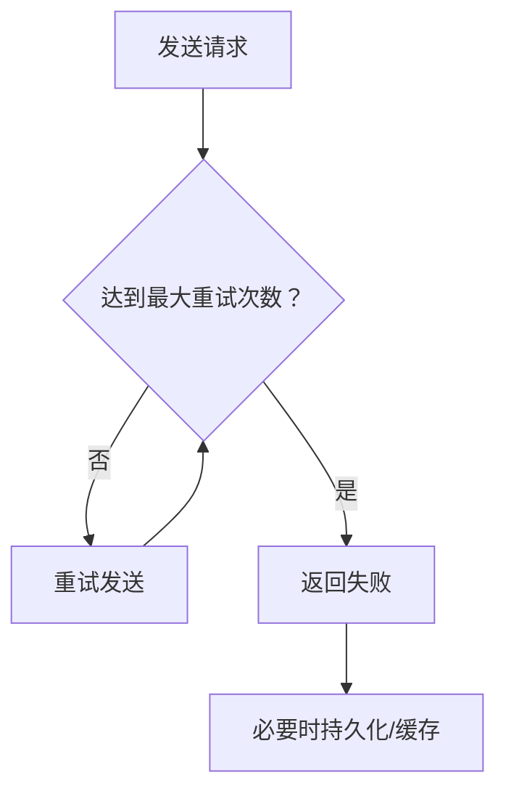
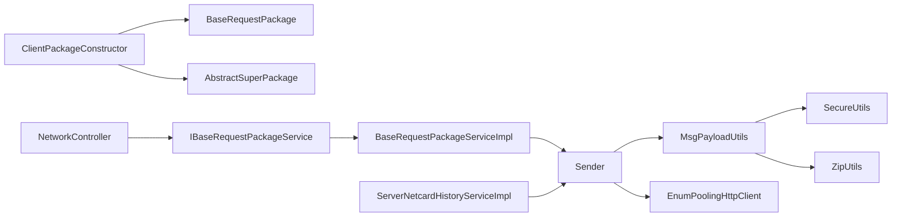

# 数据传输协议

<cite>
**本文引用的文件**
- [BaseRequestPackage.java](file://phoenix-common\phoenix-common-core\src\main\java\com\gitee\pifeng\monitoring\common\dto\BaseRequestPackage.java)
- [BaseResponsePackage.java](file://phoenix-common\phoenix-common-core\src\main\java\com\gitee\pifeng\monitoring\common\dto\BaseResponsePackage.java)
- [CiphertextPackage.java](file://phoenix-common\phoenix-common-core\src\main\java\com\gitee\pifeng\monitoring\common\dto\CiphertextPackage.java)
- [AbstractSuperPackage.java](file://phoenix-common\phoenix-common-core\src\main\java\com\gitee\pifeng\monitoring\common\abs\AbstractSuperPackage.java)
- [ClientPackageConstructor.java](file://phoenix-client\phoenix-client-core\src\main\java\com\gitee\pifeng\monitoring\plug\core\ClientPackageConstructor.java)
- [Sender.java](file://phoenix-client\phoenix-client-core\src\main\java\com\gitee\pifeng\monitoring\plug\core\Sender.java)
- [HeartbeatThread.java](file://phoenix-client\phoenix-client-core\src\main\java\com\gitee\pifeng\monitoring\plug\thread\HeartbeatThread.java)
- [EnumPoolingHttpClient.java](file://phoenix-client\phoenix-client-core\src\main\java\com\gitee\pifeng\monitoring\plug\core\EnumPoolingHttpClient.java)
- [SecureUtils.java](file://phoenix-common\phoenix-common-core\src\main\java\com\gitee\pifeng\monitoring\common\util\secure\SecureUtils.java)
- [Sm4EncryptUtils.java](file://phoenix-common\phoenix-common-core\src\main\java\com\gitee\pifeng\monitoring\common\util\secure\Sm4EncryptUtils.java)
- [SecurerEnums.java](file://phoenix-common\phoenix-common-core\src\main\java\com\gitee\pifeng\monitoring\common\constant\SecurerEnums.java)
- [ZipUtils.java](file://phoenix-common\phoenix-common-core\src\main\java\com\gitee\pifeng\monitoring\common\util\ZipUtils.java)
- [MsgPayloadUtils.java](file://phoenix-common\phoenix-common-core\src\main\java\com\gitee\pifeng\monitoring\common\util\MsgPayloadUtils.java)
- [InitSecure.java](file://phoenix-common\phoenix-common-core\src\main\java\com\gitee\pifeng\monitoring\common\init\InitSecure.java)
- [CommProtocolTypeEnums.java](file://phoenix-common\phoenix-common-core\src\main\java\com\gitee\pifeng\monitoring\common\constant\CommProtocolTypeEnums.java)
- [NetworkController.java](file://phoenix-agent\src\main\java\com\gitee\pifeng\monitoring\agent\business\client\controller\NetworkController.java)
- [IBaseRequestPackageService.java（客户端）](file://phoenix-agent\src\main\java\com\gitee\pifeng\monitoring\agent\business\client\service\IBaseRequestPackageService.java)
- [IBaseRequestPackageService.java（服务端）](file://phoenix-agent\src\main\java\com\gitee\pifeng\monitoring\agent\business\server\service\IBaseRequestPackageService.java)
- [BaseRequestPackageServiceImpl.java](file://phoenix-agent\src\main\java\com\gitee\pifeng\monitoring\agent\business\client\service\impl\BaseRequestPackageServiceImpl.java)
- [ServerNetcardHistoryServiceImpl.java](file://phoenix-server\src\main\java\com\gitee\pifeng\monitoring\server\business\server\service\impl\ServerNetcardHistoryServiceImpl.java)
</cite>

## 目录
1. [简介](#简介)
2. [项目结构](#项目结构)
3. [核心组件](#核心组件)
4. [架构总览](#架构总览)
5. [详细组件分析](#详细组件分析)
6. [依赖分析](#依赖分析)
7. [性能考量](#性能考量)
8. [故障排查指南](#故障排查指南)
9. [结论](#结论)
10. [附录](#附录)

## 简介
本文件面向监控客户端与服务端之间的数据传输协议，系统性阐述数据包封装格式（BaseRequestPackage/BaseResponsePackage/CiphertextPackage）、序列化与压缩流程、安全机制（对称加密与密钥来源）、网络传输可靠性（重试、超时、连接复用）、以及性能优化与监控指标建议。文档同时覆盖版本管理与向后兼容策略、错误处理与异常恢复机制，帮助开发者高效优化网络传输效率。

## 项目结构
本项目采用多模块分层组织，客户端插件负责采集与打包、发送；通用模块提供数据模型、安全与压缩工具；代理与服务端负责接收与持久化；UI模块提供可视化界面。与传输协议直接相关的关键模块如下：
- 客户端插件：负责构造数据包、发送请求、心跳维持
- 通用模块：定义数据包模型、安全与压缩工具、协议类型枚举
- 代理/服务端：接收请求、业务处理、持久化存储
- UI：展示监控数据

图表来源
- [ClientPackageConstructor.java:37-282](file://phoenix-client\phoenix-client-core\src\main\java\com\gitee\pifeng\monitoring\plug\core\ClientPackageConstructor.java#L37-L282)
- [Sender.java:17-61](file://phoenix-client\phoenix-client-core\src\main\java\com\gitee\pifeng\monitoring\plug\core\Sender.java#L17-L61)
- [HeartbeatThread.java:23-71](file://phoenix-client\phoenix-client-core\src\main\java\com\gitee\pifeng\monitoring\plug\thread\HeartbeatThread.java#L23-L71)
- [EnumPoolingHttpClient.java:176-202](file://phoenix-client\phoenix-client-core\src\main\java\com\gitee\pifeng\monitoring\plug\core\EnumPoolingHttpClient.java#L176-L202)
- [BaseRequestPackage.java:24-41](file://phoenix-common\phoenix-common-core\src\main\java\com\gitee\pifeng\monitoring\common\dto\BaseRequestPackage.java#L24-L41)
- [BaseResponsePackage.java:24-41](file://phoenix-common\phoenix-common-core\src\main\java\com\gitee\pifeng\monitoring\common\dto\BaseResponsePackage.java#L24-L41)
- [CiphertextPackage.java:21-33](file://phoenix-common\phoenix-common-core\src\main\java\com\gitee\pifeng\monitoring\common\dto\CiphertextPackage.java#L21-L33)
- [SecureUtils.java:21-113](file://phoenix-common\phoenix-common-core\src\main\java\com\gitee\pifeng\monitoring\common\util\secure\SecureUtils.java#L21-L113)
- [ZipUtils.java:16-55](file://phoenix-common\phoenix-common-core\src\main\java\com\gitee\pifeng\monitoring\common\util\ZipUtils.java#L16-L55)
- [MsgPayloadUtils.java:46-84](file://phoenix-common\phoenix-common-core\src\main\java\com\gitee\pifeng\monitoring\common\util\MsgPayloadUtils.java#L46-L84)
- [InitSecure.java:20-216](file://phoenix-common\phoenix-common-core\src\main\java\com\gitee\pifeng\monitoring\common\init\InitSecure.java#L20-L216)
- [SecurerEnums.java:18-95](file://phoenix-common\phoenix-common-core\src\main\java\com\gitee\pifeng\monitoring\common\constant\SecurerEnums.java#L18-L95)
- [CommProtocolTypeEnums.java:14-65](file://phoenix-common\phoenix-common-core\src\main\java\com\gitee\pifeng\monitoring\common\constant\CommProtocolTypeEnums.java#L14-L65)
- [NetworkController.java:33-79](file://phoenix-agent\src\main\java\com\gitee\pifeng\monitoring\agent\business\client\controller\NetworkController.java#L33-L79)
- [IBaseRequestPackageService.java（客户端）:14-29](file://phoenix-agent\src\main\java\com\gitee\pifeng\monitoring\agent\business\client\service\IBaseRequestPackageService.java#L14-L29)
- [IBaseRequestPackageService.java（服务端）:16-34](file://phoenix-agent\src\main\java\com\gitee\pifeng\monitoring\agent\business\server\service\IBaseRequestPackageService.java#L16-L34)
- [BaseRequestPackageServiceImpl.java:18-37](file://phoenix-agent\src\main\java\com\gitee\pifeng\monitoring\agent\business\client\service\impl\BaseRequestPackageServiceImpl.java#L18-L37)
- [ServerNetcardHistoryServiceImpl.java:26-60](file://phoenix-server\src\main\java\com\gitee\pifeng\monitoring\server\business\server\service\impl\ServerNetcardHistoryServiceImpl.java#L26-L60)

章节来源
- [ClientPackageConstructor.java:37-282](file://phoenix-client\phoenix-client-core\src\main\java\com\gitee\pifeng\monitoring\plug\core\ClientPackageConstructor.java#L37-L282)
- [Sender.java:17-61](file://phoenix-client\phoenix-client-core\src\main\java\com\gitee\pifeng\monitoring\plug\core\Sender.java#L17-L61)
- [EnumPoolingHttpClient.java:176-202](file://phoenix-client\phoenix-client-core\src\main\java\com\gitee\pifeng\monitoring\plug\core\EnumPoolingHttpClient.java#L176-L202)

## 核心组件
- 数据包模型
  - BaseRequestPackage：客户端/代理侧发送的请求包，包含标识、时间戳与附加信息
  - BaseResponsePackage：服务端/代理侧返回的响应包，包含标识、时间戳与结果
  - CiphertextPackage：密文数据包，承载加密后的payload及是否需解压标记
  - AbstractSuperPackage：所有包的抽象父类，统一注入实例端点、实例ID、IP、计算机名、链路信息等上下文
- 客户端发送与构造
  - ClientPackageConstructor：构造各类监控数据包（心跳、服务器、JVM、告警、下线），统一填充抽象父包字段
  - Sender：将明文JSON转换为密文JSON，经HTTP连接池发送，再将响应密文解密回明文
  - EnumPoolingHttpClient：基于Apache HttpClient的连接池与重试策略
- 安全与压缩
  - SecureUtils：根据配置选择加密算法（DES/AES/SM4），统一加解密入口
  - Sm4EncryptUtils：基于国密SM4的具体实现
  - SecurerEnums：算法选择枚举，桥接不同算法实现
  - ZipUtils：按阈值判断是否启用gzip压缩
  - MsgPayloadUtils：将明文/密文JSON与gzip结合的编解码工具
  - InitSecure：通过反射加载配置，初始化密钥与算法类型
- 协议类型
  - CommProtocolTypeEnums：HTTP/HTTPS/WS/WSS/TCP/UDP协议类型枚举

章节来源
- [BaseRequestPackage.java:24-41](file://phoenix-common\phoenix-common-core\src\main\java\com\gitee\pifeng\monitoring\common\dto\BaseRequestPackage.java#L24-L41)
- [BaseResponsePackage.java:24-41](file://phoenix-common\phoenix-common-core\src\main\java\com\gitee\pifeng\monitoring\common\dto\BaseResponsePackage.java#L24-L41)
- [CiphertextPackage.java:21-33](file://phoenix-common\phoenix-common-core\src\main\java\com\gitee\pifeng\monitoring\common\dto\CiphertextPackage.java#L21-L33)
- [AbstractSuperPackage.java:24-71](file://phoenix-common\phoenix-common-core\src\main\java\com\gitee\pifeng\monitoring\common\abs\AbstractSuperPackage.java#L24-L71)
- [ClientPackageConstructor.java:37-282](file://phoenix-client\phoenix-client-core\src\main\java\com\gitee\pifeng\monitoring\plug\core\ClientPackageConstructor.java#L37-L282)
- [Sender.java:17-61](file://phoenix-client\phoenix-client-core\src\main\java\com\gitee\pifeng\monitoring\plug\core\Sender.java#L17-L61)
- [SecureUtils.java:21-113](file://phoenix-common\phoenix-common-core\src\main\java\com\gitee\pifeng\monitoring\common\util\secure\SecureUtils.java#L21-L113)
- [Sm4EncryptUtils.java:17-55](file://phoenix-common\phoenix-common-core\src\main\java\com\gitee\pifeng\monitoring\common\util\secure\Sm4EncryptUtils.java#L17-L55)
- [SecurerEnums.java:18-95](file://phoenix-common\phoenix-common-core\src\main\java\com\gitee\pifeng\monitoring\common\constant\SecurerEnums.java#L18-L95)
- [ZipUtils.java:16-55](file://phoenix-common\phoenix-common-core\src\main\java\com\gitee\pifeng\monitoring\common\util\ZipUtils.java#L16-L55)
- [MsgPayloadUtils.java:46-84](file://phoenix-common\phoenix-common-core\src\main\java\com\gitee\pifeng\monitoring\common\util\MsgPayloadUtils.java#L46-L84)
- [InitSecure.java:20-216](file://phoenix-common\phoenix-common-core\src\main\java\com\gitee\pifeng\monitoring\common\init\InitSecure.java#L20-L216)
- [CommProtocolTypeEnums.java:14-65](file://phoenix-common\phoenix-common-core\src\main\java\com\gitee\pifeng\monitoring\common\constant\CommProtocolTypeEnums.java#L14-L65)

## 架构总览
客户端通过ClientPackageConstructor构造数据包，Sender负责将包序列化为JSON并进行加密与压缩，随后通过EnumPoolingHttpClient以HTTP方式发送至服务端。服务端控制器接收请求，转发给对应服务处理，最终返回BaseResponsePackage。

图表来源
- [ClientPackageConstructor.java:206-214](file://phoenix-client\phoenix-client-core\src\main\java\com\gitee\pifeng\monitoring\plug\core\ClientPackageConstructor.java#L206-L214)
- [Sender.java:42-59](file://phoenix-client\phoenix-client-core\src\main\java\com\gitee\pifeng\monitoring\plug\core\Sender.java#L42-L59)
- [EnumPoolingHttpClient.java:176-202](file://phoenix-client\phoenix-client-core\src\main\java\com\gitee\pifeng\monitoring\plug\core\EnumPoolingHttpClient.java#L176-L202)
- [NetworkController.java:75-77](file://phoenix-agent\src\main\java\com\gitee\pifeng\monitoring\agent\business\client\controller\NetworkController.java#L75-L77)
- [BaseRequestPackageServiceImpl.java:32-35](file://phoenix-agent\src\main\java\com\gitee\pifeng\monitoring\agent\business\client\service\impl\BaseRequestPackageServiceImpl.java#L32-L35)

## 详细组件分析

### 数据包封装与序列化
- BaseRequestPackage
  - 字段：id（唯一标识）、dateTime（时间戳）、extraMsg（附加信息）
  - 继承自AbstractSuperPackage，自动注入实例端点、实例ID、IP、计算机名、链路信息等
- BaseResponsePackage
  - 字段：id、dateTime、result（结果封装）
- CiphertextPackage
  - 字段：ciphertext（加密数据）、isUnGzipEnabled（是否需解压）

图表来源
- [AbstractSuperPackage.java:24-71](file://phoenix-common\phoenix-common-core\src\main\java\com\gitee\pifeng\monitoring\common\abs\AbstractSuperPackage.java#L24-L71)
- [BaseRequestPackage.java:24-41](file://phoenix-common\phoenix-common-core\src\main\java\com\gitee\pifeng\monitoring\common\dto\BaseRequestPackage.java#L24-L41)
- [BaseResponsePackage.java:24-41](file://phoenix-common\phoenix-common-core\src\main\java\com\gitee\pifeng\monitoring\common\dto\BaseResponsePackage.java#L24-L41)
- [CiphertextPackage.java:21-33](file://phoenix-common\phoenix-common-core\src\main\java\com\gitee\pifeng\monitoring\common\dto\CiphertextPackage.java#L21-L33)

章节来源
- [BaseRequestPackage.java:24-41](file://phoenix-common\phoenix-common-core\src\main\java\com\gitee\pifeng\monitoring\common\dto\BaseRequestPackage.java#L24-L41)
- [BaseResponsePackage.java:24-41](file://phoenix-common\phoenix-common-core\src\main\java\com\gitee\pifeng\monitoring\common\dto\BaseResponsePackage.java#L24-L41)
- [CiphertextPackage.java:21-33](file://phoenix-common\phoenix-common-core\src\main\java\com\gitee\pifeng\monitoring\common\dto\CiphertextPackage.java#L21-L33)
- [AbstractSuperPackage.java:24-71](file://phoenix-common\phoenix-common-core\src\main\java\com\gitee\pifeng\monitoring\common\abs\AbstractSuperPackage.java#L24-L71)

### 客户端发送流程与心跳
- ClientPackageConstructor：统一构造心跳、服务器、JVM、告警、下线等数据包，填充实例与链路信息
- Sender：将明文JSON转换为密文JSON（含gzip压缩判定），通过HTTP连接池发送，再将响应密文解密
- HeartbeatThread：周期性构建心跳包并发送，记录耗时并输出警告/调试日志

图表来源
- [HeartbeatThread.java:39-69](file://phoenix-client\phoenix-client-core\src\main\java\com\gitee\pifeng\monitoring\plug\thread\HeartbeatThread.java#L39-L69)
- [ClientPackageConstructor.java:206-214](file://phoenix-client\phoenix-client-core\src\main\java\com\gitee\pifeng\monitoring\plug\core\ClientPackageConstructor.java#L206-L214)
- [Sender.java:42-59](file://phoenix-client\phoenix-client-core\src\main\java\com\gitee\pifeng\monitoring\plug\core\Sender.java#L42-L59)
- [EnumPoolingHttpClient.java:176-202](file://phoenix-client\phoenix-client-core\src\main\java\com\gitee\pifeng\monitoring\plug\core\EnumPoolingHttpClient.java#L176-L202)

章节来源
- [ClientPackageConstructor.java:206-214](file://phoenix-client\phoenix-client-core\src\main\java\com\gitee\pifeng\monitoring\plug\core\ClientPackageConstructor.java#L206-L214)
- [Sender.java:42-59](file://phoenix-client\phoenix-client-core\src\main\java\com\gitee\pifeng\monitoring\plug\core\Sender.java#L42-L59)
- [HeartbeatThread.java:39-69](file://phoenix-client\phoenix-client-core\src\main\java\com\gitee\pifeng\monitoring\plug\thread\HeartbeatThread.java#L39-L69)

### 安全机制与密钥管理
- 算法选择：通过SecurerEnums统一调度DES/AES/SM4
- 密钥来源：InitSecure通过反射从配置加载密钥与算法类型，支持运行时切换
- 加解密入口：SecureUtils根据配置选择算法，调用具体实现
- SM4实现：Sm4EncryptUtils基于国密SM4工具类进行加解密
- 负载编解码：MsgPayloadUtils在加密前判断是否gzip压缩，再进行对称加密；响应同样逆向处理

图表来源
- [InitSecure.java:50-87](file://phoenix-common\phoenix-common-core\src\main\java\com\gitee\pifeng\monitoring\common\init\InitSecure.java#L50-L87)
- [SecureUtils.java:34-58](file://phoenix-common\phoenix-common-core\src\main\java\com\gitee\pifeng\monitoring\common\util\secure\SecureUtils.java#L34-L58)
- [SecurerEnums.java:18-95](file://phoenix-common\phoenix-common-core\src\main\java\com\gitee\pifeng\monitoring\common\constant\SecurerEnums.java#L18-L95)
- [Sm4EncryptUtils.java:30-48](file://phoenix-common\phoenix-common-core\src\main\java\com\gitee\pifeng\monitoring\common\util\secure\Sm4EncryptUtils.java#L30-L48)
- [MsgPayloadUtils.java:46-84](file://phoenix-common\phoenix-common-core\src\main\java\com\gitee\pifeng\monitoring\common\util\MsgPayloadUtils.java#L46-L84)
- [ZipUtils.java:39-52](file://phoenix-common\phoenix-common-core\src\main\java\com\gitee\pifeng\monitoring\common\util\ZipUtils.java#L39-L52)

章节来源
- [InitSecure.java:50-87](file://phoenix-common\phoenix-common-core\src\main\java\com\gitee\pifeng\monitoring\common\init\InitSecure.java#L50-L87)
- [SecureUtils.java:34-58](file://phoenix-common\phoenix-common-core\src\main\java\com\gitee\pifeng\monitoring\common\util\secure\SecureUtils.java#L34-L58)
- [SecurerEnums.java:18-95](file://phoenix-common\phoenix-common-core\src\main\java\com\gitee\pifeng\monitoring\common\constant\SecurerEnums.java#L18-L95)
- [Sm4EncryptUtils.java:30-48](file://phoenix-common\phoenix-common-core\src\main\java\com\gitee\pifeng\monitoring\common\util\secure\Sm4EncryptUtils.java#L30-L48)
- [MsgPayloadUtils.java:46-84](file://phoenix-common\phoenix-common-core\src\main\java\com\gitee\pifeng\monitoring\common\util\MsgPayloadUtils.java#L46-L84)
- [ZipUtils.java:39-52](file://phoenix-common\phoenix-common-core\src\main\java\com\gitee\pifeng\monitoring\common\util\ZipUtils.java#L39-L52)

### 网络传输可靠性与重试
- 连接池与重试：EnumPoolingHttpClient设置重试次数与连接保活策略，定期回收空闲/过期连接
- 业务重试：服务端部分业务使用注解式重试（如ServerNetcardHistoryServiceImpl），配合指数退避与超时控制
- 心跳保活：HeartbeatThread周期发送心跳，确保链路可用性

图表来源
- [EnumPoolingHttpClient.java:176-202](file://phoenix-client\phoenix-client-core\src\main\java\com\gitee\pifeng\monitoring\plug\core\EnumPoolingHttpClient.java#L176-L202)
- [ServerNetcardHistoryServiceImpl.java:38-40](file://phoenix-server\src\main\java\com\gitee\pifeng\monitoring\server\business\server\service\impl\ServerNetcardHistoryServiceImpl.java#L38-L40)
- [HeartbeatThread.java:39-69](file://phoenix-client\phoenix-client-core\src\main\java\com\gitee\pifeng\monitoring\plug\thread\HeartbeatThread.java#L39-L69)

章节来源
- [EnumPoolingHttpClient.java:176-202](file://phoenix-client\phoenix-client-core\src\main\java\com\gitee\pifeng\monitoring\plug\core\EnumPoolingHttpClient.java#L176-L202)
- [ServerNetcardHistoryServiceImpl.java:38-40](file://phoenix-server\src\main\java\com\gitee\pifeng\monitoring\server\business\server\service\impl\ServerNetcardHistoryServiceImpl.java#L38-L40)
- [HeartbeatThread.java:39-69](file://phoenix-client\phoenix-client-core\src\main\java\com\gitee\pifeng\monitoring\plug\thread\HeartbeatThread.java#L39-L69)

### 压缩与优化
- 压缩阈值：当明文JSON长度超过64KB时启用gzip压缩
- 压缩流程：先gzip压缩，再进行对称加密；响应时先解密再解压
- 批量传输：客户端按任务周期聚合数据包，减少HTTP请求频次
- 去重机制：链路信息中维护网络链路与时间链路，便于服务端识别重复或回环

章节来源
- [ZipUtils.java:39-52](file://phoenix-common\phoenix-common-core\src\main\java\com\gitee\pifeng\monitoring\common\util\ZipUtils.java#L39-L52)
- [MsgPayloadUtils.java:46-84](file://phoenix-common\phoenix-common-core\src\main\java\com\gitee\pifeng\monitoring\common\util\MsgPayloadUtils.java#L46-L84)
- [ClientPackageConstructor.java:80-109](file://phoenix-client\phoenix-client-core\src\main\java\com\gitee\pifeng\monitoring\plug\core\ClientPackageConstructor.java#L80-L109)

### 版本管理与向后兼容
- 协议类型：CommProtocolTypeEnums涵盖HTTP/HTTPS/WS/WSS/TCP/UDP，便于扩展新协议
- 配置驱动：InitSecure通过反射加载配置，支持运行时调整算法与密钥，降低升级成本
- 数据模型：BaseRequestPackage/BaseResponsePackage/CiphertextPackage字段稳定，新增字段建议向后兼容

章节来源
- [CommProtocolTypeEnums.java:14-65](file://phoenix-common\phoenix-common-core\src\main\java\com\gitee\pifeng\monitoring\common\constant\CommProtocolTypeEnums.java#L14-L65)
- [InitSecure.java:50-87](file://phoenix-common\phoenix-common-core\src\main\java\com\gitee\pifeng\monitoring\common\init\InitSecure.java#L50-L87)
- [BaseRequestPackage.java:24-41](file://phoenix-common\phoenix-common-core\src\main\java\com\gitee\pifeng\monitoring\common\dto\BaseRequestPackage.java#L24-L41)
- [BaseResponsePackage.java:24-41](file://phoenix-common\phoenix-common-core\src\main\java\com\gitee\pifeng\monitoring\common\dto\BaseResponsePackage.java#L24-L41)
- [CiphertextPackage.java:21-33](file://phoenix-common\phoenix-common-core\src\main\java\com\gitee\pifeng\monitoring\common\dto\CiphertextPackage.java#L21-L33)

### 错误处理与异常恢复
- 客户端异常：HeartbeatThread捕获IO与网络异常，记录错误并继续运行
- 服务端异常：业务层可结合注解式重试与超时控制，避免瞬时故障放大
- 配置异常：InitSecure在加载失败时记录警告并禁用加密功能，保证系统可用性

章节来源
- [HeartbeatThread.java:50-56](file://phoenix-client\phoenix-client-core\src\main\java\com\gitee\pifeng\monitoring\plug\thread\HeartbeatThread.java#L50-L56)
- [ServerNetcardHistoryServiceImpl.java:38-40](file://phoenix-server\src\main\java\com\gitee\pifeng\monitoring\server\business\server\service\impl\ServerNetcardHistoryServiceImpl.java#L38-L40)
- [InitSecure.java:74-81](file://phoenix-common\phoenix-common-core\src\main\java\com\gitee\pifeng\monitoring\common\init\InitSecure.java#L74-L81)

## 依赖分析
- 客户端到通用模块：Sender依赖MsgPayloadUtils、SecureUtils、ZipUtils；ClientPackageConstructor依赖通用域模型与工具
- 服务端到客户端：NetworkController接收请求，IBaseRequestPackageService定义转发契约，BaseRequestPackageServiceImpl实现转发
- 服务端到持久化：ServerNetcardHistoryServiceImpl演示注解式重试与批量写入

图表来源
- [Sender.java:17-61](file://phoenix-client\phoenix-client-core\src\main\java\com\gitee\pifeng\monitoring\plug\core\Sender.java#L17-L61)
- [MsgPayloadUtils.java:46-84](file://phoenix-common\phoenix-common-core\src\main\java\com\gitee\pifeng\monitoring\common\util\MsgPayloadUtils.java#L46-L84)
- [SecureUtils.java:21-113](file://phoenix-common\phoenix-common-core\src\main\java\com\gitee\pifeng\monitoring\common\util\secure\SecureUtils.java#L21-L113)
- [ZipUtils.java:16-55](file://phoenix-common\phoenix-common-core\src\main\java\com\gitee\pifeng\monitoring\common\util\ZipUtils.java#L16-L55)
- [EnumPoolingHttpClient.java:176-202](file://phoenix-client\phoenix-client-core\src\main\java\com\gitee\pifeng\monitoring\plug\core\EnumPoolingHttpClient.java#L176-L202)
- [ClientPackageConstructor.java:37-282](file://phoenix-client\phoenix-client-core\src\main\java\com\gitee\pifeng\monitoring\plug\core\ClientPackageConstructor.java#L37-L282)
- [NetworkController.java:33-79](file://phoenix-agent\src\main\java\com\gitee\pifeng\monitoring\agent\business\client\controller\NetworkController.java#L33-L79)
- [IBaseRequestPackageService.java（客户端）:14-29](file://phoenix-agent\src\main\java\com\gitee\pifeng\monitoring\agent\business\client\service\IBaseRequestPackageService.java#L14-L29)
- [BaseRequestPackageServiceImpl.java:18-37](file://phoenix-agent\src\main\java\com\gitee\pifeng\monitoring\agent\business\client\service\impl\BaseRequestPackageServiceImpl.java#L18-L37)
- [ServerNetcardHistoryServiceImpl.java:26-60](file://phoenix-server\src\main\java\com\gitee\pifeng\monitoring\server\business\server\service\impl\ServerNetcardHistoryServiceImpl.java#L26-L60)

章节来源
- [Sender.java:17-61](file://phoenix-client\phoenix-client-core\src\main\java\com\gitee\pifeng\monitoring\plug\core\Sender.java#L17-L61)
- [ClientPackageConstructor.java:37-282](file://phoenix-client\phoenix-client-core\src\main\java\com\gitee\pifeng\monitoring\plug\core\ClientPackageConstructor.java#L37-L282)
- [NetworkController.java:33-79](file://phoenix-agent\src\main\java\com\gitee\pifeng\monitoring\agent\business\client\controller\NetworkController.java#L33-L79)
- [IBaseRequestPackageService.java（客户端）:14-29](file://phoenix-agent\src\main\java\com\gitee\pifeng\monitoring\agent\business\client\service\IBaseRequestPackageService.java#L14-L29)
- [BaseRequestPackageServiceImpl.java:18-37](file://phoenix-agent\src\main\java\com\gitee\pifeng\monitoring\agent\business\client\service\impl\BaseRequestPackageServiceImpl.java#L18-L37)
- [ServerNetcardHistoryServiceImpl.java:26-60](file://phoenix-server\src\main\java\com\gitee\pifeng\monitoring\server\business\server\service\impl\ServerNetcardHistoryServiceImpl.java#L26-L60)

## 性能考量
- 连接池与重用：合理设置连接池大小、空闲回收与保活策略，降低握手开销
- 压缩阈值：针对监控数据体量，适当调整64KB阈值，平衡CPU与带宽
- 批量聚合：按任务周期合并数据包，减少HTTP请求次数
- 心跳频率：根据网络质量与服务端压力动态调整心跳间隔
- 超时与重试：设置合理的连接超时、读取超时与最大重试次数，避免雪崩

## 故障排查指南
- 加解密问题
  - 检查配置加载：确认InitSecure是否成功反射加载配置与密钥
  - 算法一致性：确保客户端与服务端使用相同算法与密钥
- 压缩问题
  - 检查MsgPayloadUtils的压缩判定逻辑与ZipUtils阈值
- 传输问题
  - 查看EnumPoolingHttpClient的重试次数与超时配置
  - 关注HeartbeatThread的异常日志与耗时统计
- 服务端持久化
  - 观察ServerNetcardHistoryServiceImpl的注解式重试行为与数据库压力

章节来源
- [InitSecure.java:74-81](file://phoenix-common\phoenix-common-core\src\main\java\com\gitee\pifeng\monitoring\common\init\InitSecure.java#L74-L81)
- [MsgPayloadUtils.java:46-84](file://phoenix-common\phoenix-common-core\src\main\java\com\gitee\pifeng\monitoring\common\util\MsgPayloadUtils.java#L46-L84)
- [EnumPoolingHttpClient.java:176-202](file://phoenix-client\phoenix-client-core\src\main\java\com\gitee\pifeng\monitoring\plug\core\EnumPoolingHttpClient.java#L176-L202)
- [HeartbeatThread.java:50-56](file://phoenix-client\phoenix-client-core\src\main\java\com\gitee\pifeng\monitoring\plug\thread\HeartbeatThread.java#L50-L56)
- [ServerNetcardHistoryServiceImpl.java:38-40](file://phoenix-server\src\main\java\com\gitee\pifeng\monitoring\server\business\server\service\impl\ServerNetcardHistoryServiceImpl.java#L38-L40)

## 结论
本协议以简洁稳定的包模型为基础，结合可配置的对称加密与gzip压缩，在客户端与服务端之间建立高效、可靠、可扩展的传输通道。通过连接池重试、心跳保活与注解式重试等机制保障可靠性；通过阈值压缩与批量聚合优化性能。建议在生产环境严格校验配置加载与算法一致性，持续监控传输耗时与错误率，按需调整超时与重试策略。

## 附录
- 协议类型枚举：HTTP/HTTPS/WS/WSS/TCP/UDP
- 关键流程参考路径
  - [Sender.java:42-59](file://phoenix-client\phoenix-client-core\src\main\java\com\gitee\pifeng\monitoring\plug\core\Sender.java#L42-L59)
  - [ClientPackageConstructor.java:206-214](file://phoenix-client\phoenix-client-core\src\main\java\com\gitee\pifeng\monitoring\plug\core\ClientPackageConstructor.java#L206-L214)
  - [NetworkController.java:75-77](file://phoenix-agent\src\main\java\com\gitee\pifeng\monitoring\agent\business\client\controller\NetworkController.java#L75-L77)
  - [BaseRequestPackageServiceImpl.java:32-35](file://phoenix-agent\src\main\java\com\gitee\pifeng\monitoring\agent\business\client\service\impl\BaseRequestPackageServiceImpl.java#L32-L35)
  - [ServerNetcardHistoryServiceImpl.java:38-40](file://phoenix-server\src\main\java\com\gitee\pifeng\monitoring\server\business\server\service\impl\ServerNetcardHistoryServiceImpl.java#L38-L40)