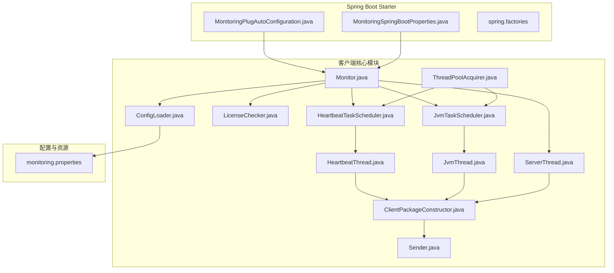
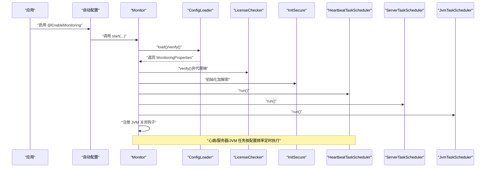
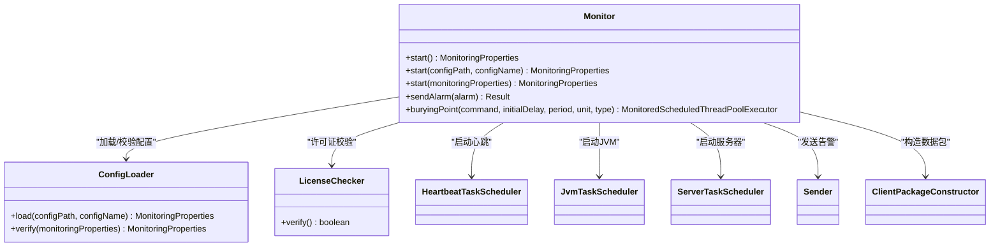
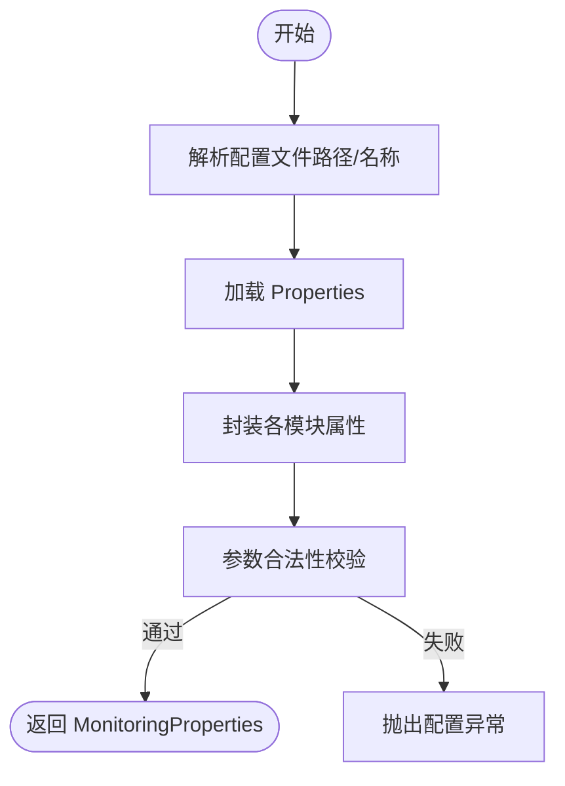
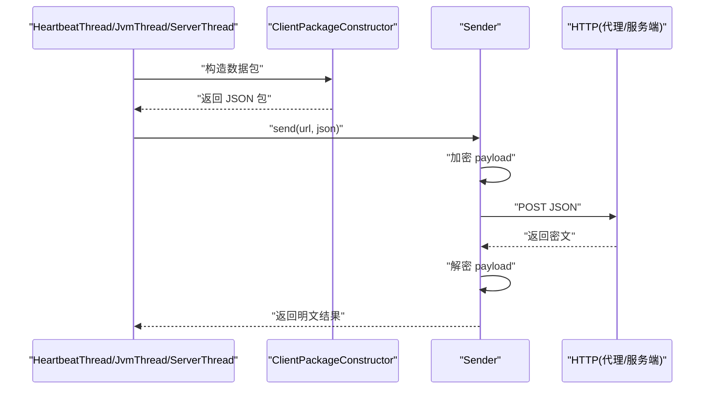
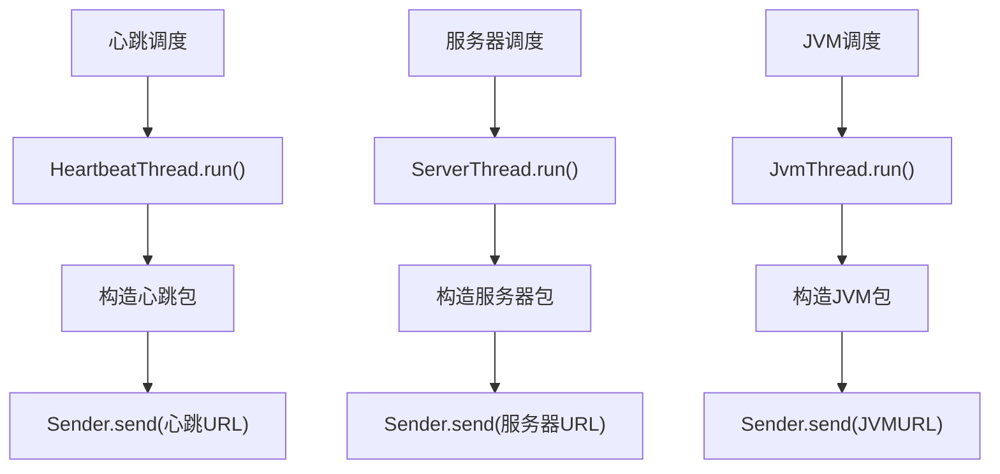
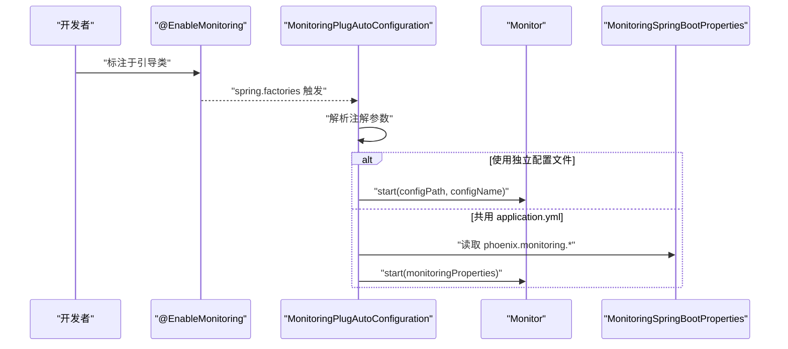
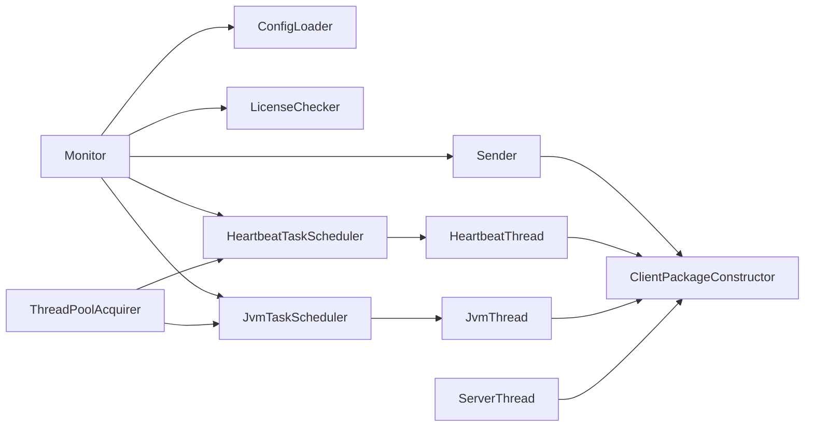

# 监控客户端模块

<cite>
**本文引用的文件**   
- [Monitor.java](file://phoenix-client/phoenix-client-core/src/main/java/com/gitee/pifeng/monitoring/plug/Monitor.java)
- [monitoring.properties](file://phoenix-client/phoenix-client-core/src/main/resources/monitoring.properties)
- [MonitoringPlugAutoConfiguration.java](file://phoenix-client/phoenix-client-spring-boot-starter/src/main/java/com/gitee/pifeng/monitoring/starter/autoconfigure/MonitoringPlugAutoConfiguration.java)
- [MonitoringSpringBootProperties.java](file://phoenix-client/phoenix-client-spring-boot-starter/src/main/java/com/gitee/pifeng/monitoring/starter/property/MonitoringSpringBootProperties.java)
- [spring.factories](file://phoenix-client/phoenix-client-spring-boot-starter/src/main/resources/META-INF/spring.factories)
- [ConfigLoader.java](file://phoenix-client/phoenix-client-core/src/main/java/com/gitee/pifeng/monitoring/plug/core/ConfigLoader.java)
- [LicenseChecker.java](file://phoenix-client/phoenix-client-core/src/main/java/com/gitee/pifeng/monitoring/plug/core/LicenseChecker.java)
- [Sender.java](file://phoenix-client/phoenix-client-core/src/main/java/com/gitee/pifeng/monitoring/plug/core/Sender.java)
- [HeartbeatTaskScheduler.java](file://phoenix-client/phoenix-client-core/src/main/java/com/gitee/pifeng/monitoring/plug/scheduler/HeartbeatTaskScheduler.java)
- [JvmTaskScheduler.java](file://phoenix-client/phoenix-client-core/src/main/java/com/gitee/pifeng/monitoring/plug/scheduler/JvmTaskScheduler.java)
- [HeartbeatThread.java](file://phoenix-client/phoenix-client-core/src/main/java/com/gitee/pifeng/monitoring/plug/thread/HeartbeatThread.java)
- [JvmThread.java](file://phoenix-client/phoenix-client-core/src/main/java/com/gitee/pifeng/monitoring/plug/thread/JvmThread.java)
- [ServerThread.java](file://phoenix-client/phoenix-client-core/src/main/java/com/gitee/pifeng/monitoring/plug/thread/ServerThread.java)
- [ClientPackageConstructor.java](file://phoenix-client/phoenix-client-core/src/main/java/com/gitee/pifeng/monitoring/plug/core/ClientPackageConstructor.java)
- [ThreadPoolAcquirer.java](file://phoenix-client/phoenix-client-core/src/main/java/com/gitee/pifeng/monitoring/plug/core/ThreadPoolAcquirer.java)
</cite>

## 目录
1. [简介](#简介)
2. [项目结构](#项目结构)
3. [核心组件](#核心组件)
4. [架构总览](#架构总览)
5. [详细组件分析](#详细组件分析)
6. [依赖分析](#依赖分析)
7. [性能考量](#性能考量)
8. [故障排除指南](#故障排除指南)
9. [结论](#结论)
10. [附录](#附录)

## 简介
本技术文档面向“监控客户端模块”，系统性阐述其架构设计、数据采集触发机制、心跳监控实现原理，并覆盖与 Spring Boot 的自动配置集成、手动配置方式、兼容性说明、完整配置参数清单、客户端与代理端的数据传输协议要点（数据包封装、加解密、重试策略）、典型集成示例、性能优化建议与常见问题排查。

## 项目结构
监控客户端模块主要由以下子模块组成：
- 核心模块（phoenix-client-core）：提供 Monitor 启动入口、配置加载、包构造、线程池、调度器、发送器、线程任务等能力。
- Spring Boot Starter（phoenix-client-spring-boot-starter）：提供自动配置、注解驱动启用、属性绑定等，简化在 Spring Boot 中的集成。
- 公共模块（phoenix-common-*）：提供通用领域模型、DTO、异常、工具、线程池监控等基础设施。

**图表来源**
- [Monitor.java:67-151](file://phoenix-client/phoenix-client-core/src/main/java/com/gitee/pifeng/monitoring/plug/Monitor.java#L67-L151)
- [MonitoringPlugAutoConfiguration.java:50-76](file://phoenix-client/phoenix-client-spring-boot-starter/src/main/java/com/gitee/pifeng/monitoring/starter/autoconfigure/MonitoringPlugAutoConfiguration.java#L50-L76)
- [monitoring.properties:1-41](file://phoenix-client/phoenix-client-core/src/main/resources/monitoring.properties#L1-L41)

**章节来源**
- [Monitor.java:67-151](file://phoenix-client/phoenix-client-core/src/main/java/com/gitee/pifeng/monitoring/plug/Monitor.java#L67-L151)
- [MonitoringPlugAutoConfiguration.java:29-76](file://phoenix-client/phoenix-client-spring-boot-starter/src/main/java/com/gitee/pifeng/monitoring/starter/autoconfigure/MonitoringPlugAutoConfiguration.java#L29-L76)
- [monitoring.properties:1-41](file://phoenix-client/phoenix-client-core/src/main/resources/monitoring.properties#L1-L41)

## 核心组件
- Monitor：客户端唯一入口，负责启动流程（加载配置、许可证校验、初始化加解密、启动定时任务、注册 JVM 关闭钩子）、对外暴露告警发送与业务埋点线程池接口。
- ConfigLoader：负责从多种位置加载 monitoring.properties 并解析为 MonitoringProperties，进行参数合法性校验。
- LicenseChecker：在非代理端场景下对 license.txt 进行 RSA 公钥解密并校验有效期。
- Sender：统一发送入口，负责将明文 JSON 包进行加密、通过 HTTP 发送、接收后解密。
- ClientPackageConstructor：构造各类数据包（心跳、服务器、JVM、告警、下线），填充实例链路、时间戳、应用服务器类型等上下文。
- TaskScheduler 与 Thread：心跳、服务器、JVM 三类定时任务分别调度对应线程，按配置频率执行。
- ThreadPoolAcquirer：提供两类延迟/周期线程池，采用守护线程与 Abort 拒绝策略，避免阻塞应用退出。

**章节来源**
- [Monitor.java:40-151](file://phoenix-client/phoenix-client-core/src/main/java/com/gitee/pifeng/monitoring/plug/Monitor.java#L40-L151)
- [ConfigLoader.java:95-155](file://phoenix-client/phoenix-client-core/src/main/java/com/gitee/pifeng/monitoring/plug/core/ConfigLoader.java#L95-L155)
- [LicenseChecker.java:96-114](file://phoenix-client/phoenix-client-core/src/main/java/com/gitee/pifeng/monitoring/plug/core/LicenseChecker.java#L96-L114)
- [Sender.java:42-59](file://phoenix-client/phoenix-client-core/src/main/java/com/gitee/pifeng/monitoring/plug/core/Sender.java#L42-L59)
- [ClientPackageConstructor.java:37-282](file://phoenix-client/phoenix-client-core/src/main/java/com/gitee/pifeng/monitoring/plug/core/ClientPackageConstructor.java#L37-L282)
- [ThreadPoolAcquirer.java:48-94](file://phoenix-client/phoenix-client-core/src/main/java/com/gitee/pifeng/monitoring/plug/core/ThreadPoolAcquirer.java#L48-L94)

## 架构总览
客户端启动流程概览如下：

**图表来源**
- [MonitoringPlugAutoConfiguration.java:50-76](file://phoenix-client/phoenix-client-spring-boot-starter/src/main/java/com/gitee/pifeng/monitoring/starter/autoconfigure/MonitoringPlugAutoConfiguration.java#L50-L76)
- [Monitor.java:119-151](file://phoenix-client/phoenix-client-core/src/main/java/com/gitee/pifeng/monitoring/plug/Monitor.java#L119-L151)
- [ConfigLoader.java:95-155](file://phoenix-client/phoenix-client-core/src/main/java/com/gitee/pifeng/monitoring/plug/core/ConfigLoader.java#L95-L155)
- [LicenseChecker.java:96-114](file://phoenix-client/phoenix-client-core/src/main/java/com/gitee/pifeng/monitoring/plug/core/LicenseChecker.java#L96-L114)

## 详细组件分析

### Monitor 类：核心入口与生命周期
- 启动方式支持三种：使用默认配置文件、指定配置文件路径与名称、直接传入 MonitoringProperties 对象。
- 启动流程：
  - 打印 Banner
  - 加载或校验配置
  - 若实例端点非代理端且许可证校验失败则立即终止进程
  - 初始化加解密
  - 启动心跳、服务器、JVM 三类定时任务
  - 注册 JVM 关闭钩子，用于发送下线包等收尾工作
- 对外接口：
  - sendAlarm：构造告警包并通过 Sender 发送
  - buryingPoint：提交业务埋点任务到受监控的调度线程池

**图表来源**
- [Monitor.java:67-151](file://phoenix-client/phoenix-client-core/src/main/java/com/gitee/pifeng/monitoring/plug/Monitor.java#L67-L151)
- [ConfigLoader.java:95-155](file://phoenix-client/phoenix-client-core/src/main/java/com/gitee/pifeng/monitoring/plug/core/ConfigLoader.java#L95-L155)
- [LicenseChecker.java:96-114](file://phoenix-client/phoenix-client-core/src/main/java/com/gitee/pifeng/monitoring/plug/core/LicenseChecker.java#L96-L114)

**章节来源**
- [Monitor.java:67-151](file://phoenix-client/phoenix-client-core/src/main/java/com/gitee/pifeng/monitoring/plug/Monitor.java#L67-L151)

### 配置加载与参数校验（ConfigLoader）
- 支持从多处加载 monitoring.properties：
  - filepath: 绝对/相对路径
  - Jar 同级目录/config/
  - Jar 同级目录
  - classpath: 自定义路径
  - classpath:/config/
  - classpath: 默认
- 参数校验与默认值：
  - 安全：加密算法类型与对应密钥（AES/DES/SM4）
  - 通信：HTTP URL、连接/等待/连接池获取超时
  - 实例：顺序、端点类型、名称、描述、语言
  - 心跳：频率（≥30秒）
  - 服务器信息：开关、频率（≥30秒）、IP（合法 IPv4）、是否使用 Sigar
  - JVM 信息：开关、频率（≥30秒）

**图表来源**
- [ConfigLoader.java:95-155](file://phoenix-client/phoenix-client-core/src/main/java/com/gitee/pifeng/monitoring/plug/core/ConfigLoader.java#L95-L155)
- [monitoring.properties:1-41](file://phoenix-client/phoenix-client-core/src/main/resources/monitoring.properties#L1-L41)

**章节来源**
- [ConfigLoader.java:95-155](file://phoenix-client/phoenix-client-core/src/main/java/com/gitee/pifeng/monitoring/plug/core/ConfigLoader.java#L95-L155)
- [monitoring.properties:1-41](file://phoenix-client/phoenix-client-core/src/main/resources/monitoring.properties#L1-L41)

### 许可证校验（LicenseChecker）
- 在非代理端场景下，读取 license.txt，使用内置 RSA 公钥解密，解析为 License 对象并判断截止时间。
- 失效或解析异常将记录错误并返回校验失败。

**章节来源**
- [LicenseChecker.java:96-114](file://phoenix-client/phoenix-client-core/src/main/java/com/gitee/pifeng/monitoring/plug/core/LicenseChecker.java#L96-L114)

### 数据包构造与发送（ClientPackageConstructor + Sender）
- ClientPackageConstructor：
  - 统一填充实例端点、实例 ID/名称/描述、语言、应用服务器类型、IP、计算机名、链路信息（实例链路、网络链路、时间链路）
  - 构造心跳、服务器、JVM、告警、下线包
- Sender：
  - 将明文 JSON 加密后发送，接收后解密，便于调试输出明文

**图表来源**
- [HeartbeatThread.java:38-69](file://phoenix-client/phoenix-client-core/src/main/java/com/gitee/pifeng/monitoring/plug/thread/HeartbeatThread.java#L38-L69)
- [JvmThread.java:40-73](file://phoenix-client/phoenix-client-core/src/main/java/com/gitee/pifeng/monitoring/plug/thread/JvmThread.java#L40-L73)
- [ServerThread.java:42-77](file://phoenix-client/phoenix-client-core/src/main/java/com/gitee/pifeng/monitoring/plug/thread/ServerThread.java#L42-L77)
- [ClientPackageConstructor.java:179-282](file://phoenix-client/phoenix-client-core/src/main/java/com/gitee/pifeng/monitoring/plug/core/ClientPackageConstructor.java#L179-L282)
- [Sender.java:42-59](file://phoenix-client/phoenix-client-core/src/main/java/com/gitee/pifeng/monitoring/plug/core/Sender.java#L42-L59)

**章节来源**
- [ClientPackageConstructor.java:179-282](file://phoenix-client/phoenix-client-core/src/main/java/com/gitee/pifeng/monitoring/plug/core/ClientPackageConstructor.java#L179-L282)
- [Sender.java:42-59](file://phoenix-client/phoenix-client-core/src/main/java/com/gitee/pifeng/monitoring/plug/core/Sender.java#L42-L59)

### 心跳与数据采集调度
- 心跳：延时 35 秒后，按配置频率（默认 ≥30 秒）周期发送心跳包。
- 服务器信息：当开启开关后，延时 45 秒后按配置频率周期采集并发送。
- JVM 信息：当开启开关后，延时 45 秒后按配置频率周期采集并发送。
- 线程池：两类调度线程池，守护线程，拒绝策略为 AbortPolicy，避免阻塞应用退出。

**图表来源**
- [HeartbeatTaskScheduler.java:39-43](file://phoenix-client/phoenix-client-core/src/main/java/com/gitee/pifeng/monitoring/plug/scheduler/HeartbeatTaskScheduler.java#L39-L43)
- [JvmTaskScheduler.java:40-48](file://phoenix-client/phoenix-client-core/src/main/java/com/gitee/pifeng/monitoring/plug/scheduler/JvmTaskScheduler.java#L40-L48)
- [HeartbeatThread.java:38-69](file://phoenix-client/phoenix-client-core/src/main/java/com/gitee/pifeng/monitoring/plug/thread/HeartbeatThread.java#L38-L69)
- [JvmThread.java:40-73](file://phoenix-client/phoenix-client-core/src/main/java/com/gitee/pifeng/monitoring/plug/thread/JvmThread.java#L40-L73)
- [ServerThread.java:42-77](file://phoenix-client/phoenix-client-core/src/main/java/com/gitee/pifeng/monitoring/plug/thread/ServerThread.java#L42-L77)

**章节来源**
- [HeartbeatTaskScheduler.java:39-43](file://phoenix-client/phoenix-client-core/src/main/java/com/gitee/pifeng/monitoring/plug/scheduler/HeartbeatTaskScheduler.java#L39-L43)
- [JvmTaskScheduler.java:40-48](file://phoenix-client/phoenix-client-core/src/main/java/com/gitee/pifeng/monitoring/plug/scheduler/JvmTaskScheduler.java#L40-L48)
- [ThreadPoolAcquirer.java:48-94](file://phoenix-client/phoenix-client-core/src/main/java/com/gitee/pifeng/monitoring/plug/core/ThreadPoolAcquirer.java#L48-L94)

### Spring Boot 自动配置与集成
- @EnableMonitoring 注解配合自动配置类，支持两种配置来源：
  - 使用独立 monitoring.properties 文件（可指定 classpath 或 filepath 路径）
  - 共用 application.yml（通过 phoenix.monitoring 前缀绑定）
- 自动配置类会解析注解参数并调用 Monitor.start(...)，完成启动。

**图表来源**
- [MonitoringPlugAutoConfiguration.java:50-76](file://phoenix-client/phoenix-client-spring-boot-starter/src/main/java/com/gitee/pifeng/monitoring/starter/autoconfigure/MonitoringPlugAutoConfiguration.java#L50-L76)
- [MonitoringSpringBootProperties.java:17-22](file://phoenix-client/phoenix-client-spring-boot-starter/src/main/java/com/gitee/pifeng/monitoring/starter/property/MonitoringSpringBootProperties.java#L17-L22)
- [spring.factories:1-4](file://phoenix-client/phoenix-client-spring-boot-starter/src/main/resources/META-INF/spring.factories#L1-L4)

**章节来源**
- [MonitoringPlugAutoConfiguration.java:50-76](file://phoenix-client/phoenix-client-spring-boot-starter/src/main/java/com/gitee/pifeng/monitoring/starter/autoconfigure/MonitoringPlugAutoConfiguration.java#L50-L76)
- [MonitoringSpringBootProperties.java:17-22](file://phoenix-client/phoenix-client-spring-boot-starter/src/main/java/com/gitee/pifeng/monitoring/starter/property/MonitoringSpringBootProperties.java#L17-L22)
- [spring.factories:1-4](file://phoenix-client/phoenix-client-spring-boot-starter/src/main/resources/META-INF/spring.factories#L1-L4)

## 依赖分析
- 组件内聚与耦合：
  - Monitor 作为门面，依赖 ConfigLoader、LicenseChecker、TaskScheduler、Sender 等；职责清晰。
  - ClientPackageConstructor 与 Sender 形成稳定的“构造-发送”边界，便于扩展新包类型。
  - ThreadPoolAcquirer 为调度层提供统一线程池，降低调度器之间的耦合。
- 外部依赖：
  - HTTP 客户端封装在枚举单例中（EnumPoolingHttpClient），Sender 通过该封装发送请求。
  - 日志、时间统计、异常处理均通过 SLF4J、Hutool、Commons Lang/Logging 等工具库实现。

**图表来源**
- [Monitor.java:119-151](file://phoenix-client/phoenix-client-core/src/main/java/com/gitee/pifeng/monitoring/plug/Monitor.java#L119-L151)
- [Sender.java:42-59](file://phoenix-client/phoenix-client-core/src/main/java/com/gitee/pifeng/monitoring/plug/core/Sender.java#L42-L59)
- [ThreadPoolAcquirer.java:48-94](file://phoenix-client/phoenix-client-core/src/main/java/com/gitee/pifeng/monitoring/plug/core/ThreadPoolAcquirer.java#L48-L94)

**章节来源**
- [Monitor.java:119-151](file://phoenix-client/phoenix-client-core/src/main/java/com/gitee/pifeng/monitoring/plug/Monitor.java#L119-L151)
- [Sender.java:42-59](file://phoenix-client/phoenix-client-core/src/main/java/com/gitee/pifeng/monitoring/plug/core/Sender.java#L42-L59)

## 性能考量
- 线程池设计：
  - 两类调度线程池均为守护线程，避免阻塞应用退出。
  - 采用 AbortPolicy 拒绝策略，防止任务堆积导致内存压力。
  - 线程数按 CPU 数与 IO 阻塞系数计算，适配 IO 密集型任务。
- 采集频率：
  - 心跳、服务器、JVM 的最小频率均为 30 秒，避免过于频繁的网络与系统开销。
- 超时设置：
  - HTTP 连接/等待/连接池获取超时需大于 0，建议结合网络环境合理配置。
- 日志与耗时：
  - 各线程在构建与发送耗时超过阈值时输出警告日志，便于定位性能瓶颈。

**章节来源**
- [ThreadPoolAcquirer.java:48-94](file://phoenix-client/phoenix-client-core/src/main/java/com/gitee/pifeng/monitoring/plug/core/ThreadPoolAcquirer.java#L48-L94)
- [ConfigLoader.java:524-531](file://phoenix-client/phoenix-client-core/src/main/java/com/gitee/pifeng/monitoring/plug/core/ConfigLoader.java#L524-L531)
- [ConfigLoader.java:577-581](file://phoenix-client/phoenix-client-core/src/main/java/com/gitee/pifeng/monitoring/plug/core/ConfigLoader.java#L577-L581)
- [HeartbeatThread.java:61-68](file://phoenix-client/phoenix-client-core/src/main/java/com/gitee/pifeng/monitoring/plug/thread/HeartbeatThread.java#L61-L68)
- [JvmThread.java:64-71](file://phoenix-client/phoenix-client-core/src/main/java/com/gitee/pifeng/monitoring/plug/thread/JvmThread.java#L64-L71)
- [ServerThread.java:68-75](file://phoenix-client/phoenix-client-core/src/main/java/com/gitee/pifeng/monitoring/plug/thread/ServerThread.java#L68-L75)

## 故障排除指南
- 找不到配置文件或配置参数缺失：
  - 现象：启动时报错提示找不到配置文件或缺少必要参数。
  - 排查：确认 monitoring.properties 路径与名称，检查 classpath/文件路径是否正确；核对必填项如 HTTP URL、实例名称。
- 配置参数非法：
  - 现象：超时时间或频率小于允许的最小值，服务器 IP 非法。
  - 排查：将超时与频率调整至大于 0，将心跳与服务器/JVM频率不低于 30 秒；确保服务器 IP 为合法 IPv4 地址。
- 许可证失效：
  - 现象：非代理端场景下启动被终止或日志报错。
  - 排查：确认 license.txt 存在且未过期，RSA 公钥解密正常。
- 网络异常：
  - 现象：发送告警或采集包时报 IO/网络异常。
  - 排查：检查代理/服务端地址可达性、防火墙、证书与超时设置；关注 Sender 输出的密文/明文包以便定位。
- 线程池拒绝：
  - 现象：任务被拒绝。
  - 排查：当前线程池拒绝策略为 AbortPolicy，适当降低采集频率或增加线程池容量。

**章节来源**
- [ConfigLoader.java:406-420](file://phoenix-client/phoenix-client-core/src/main/java/com/gitee/pifeng/monitoring/plug/core/ConfigLoader.java#L406-L420)
- [ConfigLoader.java:524-531](file://phoenix-client/phoenix-client-core/src/main/java/com/gitee/pifeng/monitoring/plug/core/ConfigLoader.java#L524-L531)
- [ConfigLoader.java:577-581](file://phoenix-client/phoenix-client-core/src/main/java/com/gitee/pifeng/monitoring/plug/core/ConfigLoader.java#L577-L581)
- [LicenseChecker.java:104-112](file://phoenix-client/phoenix-client-core/src/main/java/com/gitee/pifeng/monitoring/plug/core/LicenseChecker.java#L104-L112)
- [Sender.java:42-59](file://phoenix-client/phoenix-client-core/src/main/java/com/gitee/pifeng/monitoring/plug/core/Sender.java#L42-L59)

## 结论
监控客户端模块以 Monitor 为核心入口，通过 ConfigLoader 完成灵活的配置加载与严格参数校验，借助 ClientPackageConstructor 与 Sender 实现统一的数据包构造与加解密发送，配合心跳、服务器、JVM 三类定时任务实现稳定的数据采集。Spring Boot Starter 提供零样板代码的自动配置与属性绑定，满足不同部署形态的需求。遵循本文的配置与性能建议，可有效提升监控系统的稳定性与可观测性。

## 附录

### 配置参数说明（摘自 monitoring.properties 与 ConfigLoader）
- 安全配置
  - encryption-algorithm-type：加密算法类型（AES/DES/SM4）
  - aes.key/des.key/sm4.key：对应算法密钥
- 通信配置
  - http.url：HTTP(S) 服务端或代理端地址（必填）
  - connect-timeout：连接超时（毫秒，>0）
  - socket-timeout：等待数据超时（毫秒，>0）
  - connection-request-timeout：从连接池获取连接的等待超时（毫秒，>0）
- 实例配置
  - order：实例次序（整数）
  - endpoint：实例端点类型（server/agent/client/ui，默认 client）
  - name：实例名称（必填）
  - desc：实例描述
  - language：程序语言（默认 Java）
- 心跳配置
  - rate：心跳频率（秒，≥30）
- 服务器信息配置
  - enable：是否采集服务器信息（布尔）
  - rate：采集频率（秒，≥30）
  - ip：服务器本机 IP（合法 IPv4）
  - user-sigar-enable：是否使用 Sigar 采集
- JVM 信息配置
  - enable：是否采集 JVM 信息（布尔）
  - rate：采集频率（秒，≥30）

**章节来源**
- [monitoring.properties:1-41](file://phoenix-client/phoenix-client-core/src/main/resources/monitoring.properties#L1-L41)
- [ConfigLoader.java:397-427](file://phoenix-client/phoenix-client-core/src/main/java/com/gitee/pifeng/monitoring/plug/core/ConfigLoader.java#L397-L427)
- [ConfigLoader.java:446-495](file://phoenix-client/phoenix-client-core/src/main/java/com/gitee/pifeng/monitoring/plug/core/ConfigLoader.java#L446-L495)
- [ConfigLoader.java:513-531](file://phoenix-client/phoenix-client-core/src/main/java/com/gitee/pifeng/monitoring/plug/core/ConfigLoader.java#L513-L531)
- [ConfigLoader.java:549-591](file://phoenix-client/phoenix-client-core/src/main/java/com/gitee/pifeng/monitoring/plug/core/ConfigLoader.java#L549-L591)
- [ConfigLoader.java:609-634](file://phoenix-client/phoenix-client-core/src/main/java/com/gitee/pifeng/monitoring/plug/core/ConfigLoader.java#L609-L634)

### 数据传输协议要点
- 数据包封装：统一由 ClientPackageConstructor 构造，包含实例上下文、链路信息、时间戳等。
- 加密机制：Sender 在发送前对 JSON payload 进行加密，接收后再解密，便于调试输出明文。
- 重试策略：当前实现未见显式重试逻辑，若需增强可靠性可在上层封装或自定义 Sender 行为。

**章节来源**
- [ClientPackageConstructor.java:179-282](file://phoenix-client/phoenix-client-core/src/main/java/com/gitee/pifeng/monitoring/plug/core/ClientPackageConstructor.java#L179-L282)
- [Sender.java:42-59](file://phoenix-client/phoenix-client-core/src/main/java/com/gitee/pifeng/monitoring/plug/core/Sender.java#L42-L59)

### 集成示例（步骤说明）
- Spring Boot 自动配置（推荐）
  - 在引导类上添加 @EnableMonitoring 注解，使用 application.yml 配置 phoenix.monitoring.*。
  - 或通过注解参数指定独立 monitoring.properties 的 classpath/文件路径与文件名。
- 手动配置
  - 直接调用 Monitor.start(monitoringProperties) 并传入已填充的 MonitoringProperties。
- 典型场景
  - 微服务：在每个服务启动时调用 Monitor.start()，按需开启服务器/JVM采集。
  - 批处理/定时任务：使用 Monitor.buryingPoint 提交业务埋点任务，统一由受监控的调度线程池执行。

**章节来源**
- [MonitoringPlugAutoConfiguration.java:50-76](file://phoenix-client/phoenix-client-spring-boot-starter/src/main/java/com/gitee/pifeng/monitoring/starter/autoconfigure/MonitoringPlugAutoConfiguration.java#L50-L76)
- [Monitor.java:67-102](file://phoenix-client/phoenix-client-core/src/main/java/com/gitee/pifeng/monitoring/plug/Monitor.java#L67-L102)