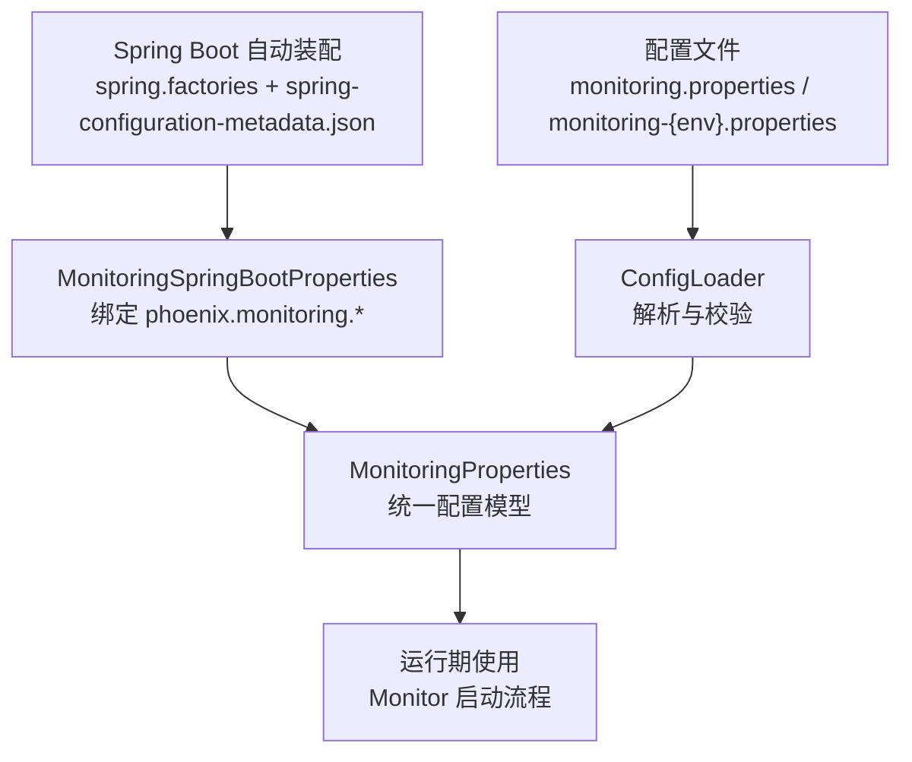
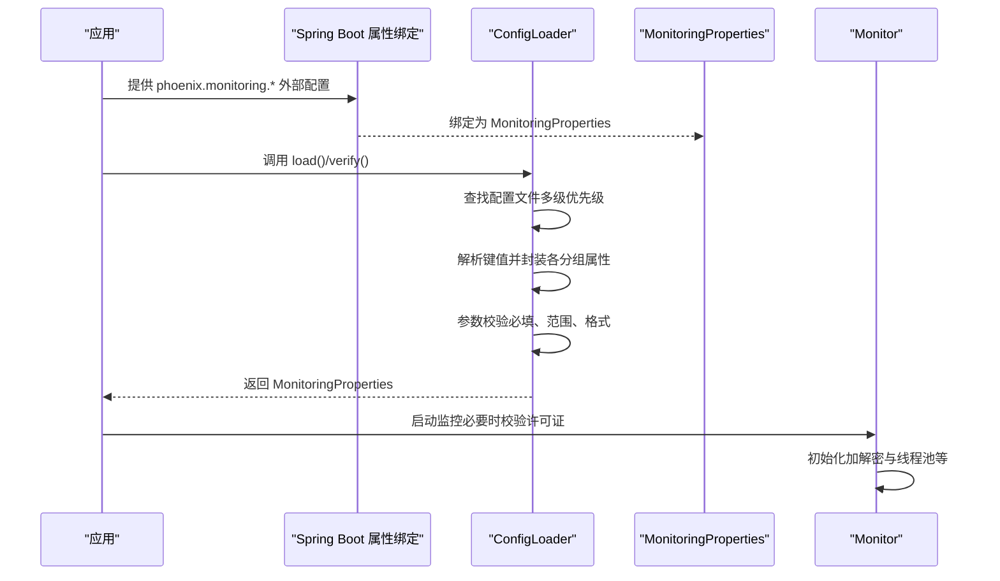
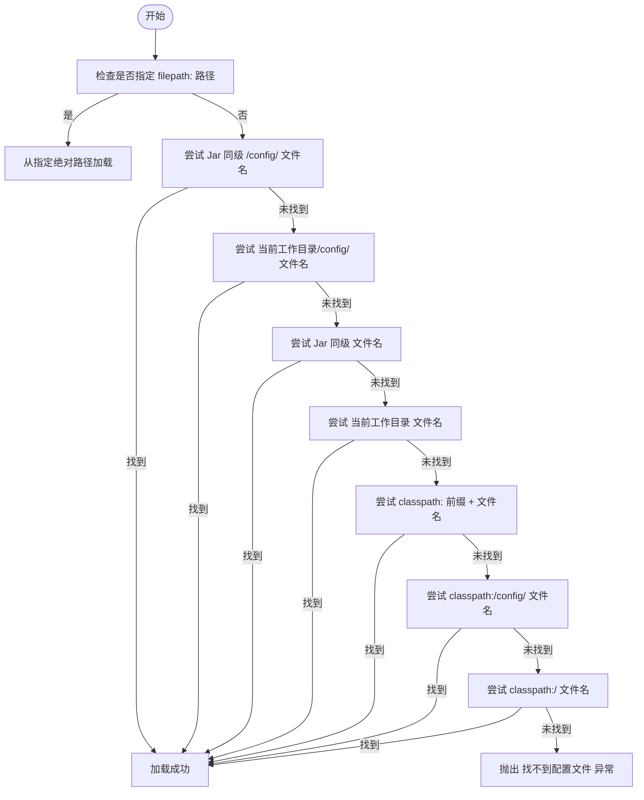
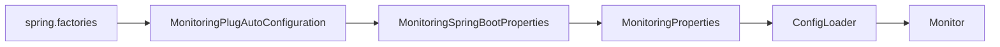

# 配置参数详解

<cite>
**本文引用的文件**   
- [monitoring.properties](file://phoenix-client/phoenix-client-core/src/main/resources/monitoring.properties)
- [monitoring.properties（测试资源）](file://phoenix-client/phoenix-client-core/src/test/resources/monitoring.properties)
- [monitoring-dev.properties（代理端）](file://phoenix-agent/src/main/resources/monitoring-dev.properties)
- [monitoring-prod.properties（代理端）](file://phoenix-agent/src/main/resources/monitoring-prod.properties)
- [monitoring-dev.properties（服务端）](file://phoenix-server/src/main/resources/monitoring-dev.properties)
- [monitoring-prod.properties（服务端）](file://phoenix-server/src/main/resources/monitoring-prod.properties)
- [monitoring-dev.properties（UI端）](file://phoenix-ui/src/main/resources/monitoring-dev.properties)
- [monitoring-prod.properties（UI端）](file://phoenix-ui/src/main/resources/monitoring-prod.properties)
- [ConfigLoader.java](file://phoenix-client/phoenix-client-core/src/main/java/com/gitee/pifeng/monitoring/plug/core/ConfigLoader.java)
- [MonitoringSpringBootProperties.java](file://phoenix-client/phoenix-client-spring-boot-starter/src/main/java/com/gitee/pifeng/monitoring/starter/property/MonitoringSpringBootProperties.java)
- [spring-configuration-metadata.json](file://phoenix-client/phoenix-client-spring-boot-starter/src/main/resources/META-INF/spring-configuration-metadata.json)
- [spring.factories](file://phoenix-client/phoenix-client-spring-boot-starter/src/main/resources/META-INF/spring.factories)
- [MonitoringProperties.java](file://phoenix-common/phoenix-common-core/src/main/java/com/gitee/pifeng/monitoring/common/property/client/MonitoringProperties.java)
- [MonitoringSecureProperties.java](file://phoenix-common/phoenix-common-core/src/main/java/com/gitee/pifeng/monitoring/common/property/client/MonitoringSecureProperties.java)
- [MonitoringCommProperties.java](file://phoenix-common/phoenix-common-core/src/main/java/com/gitee/pifeng/monitoring/common/property/client/MonitoringCommProperties.java)
- [MonitoringInstanceProperties.java](file://phoenix-common/phoenix-common-core/src/main/java/com/gitee/pifeng/monitoring/common/property/client/MonitoringInstanceProperties.java)
- [ErrorConfigParamException.java](file://phoenix-common/phoenix-common-core/src/main/java/com/gitee/pifeng/monitoring/common/exception/ErrorConfigParamException.java)
- [NotFoundConfigParamException.java](file://phoenix-common/phoenix-common-core/src/main/java/com/gitee/pifeng/monitoring/common/exception/NotFoundConfigParamException.java)
- [Monitor.java](file://phoenix-client/phoenix-client-core/src/main/java/com/gitee/pifeng/monitoring/plug/Monitor.java)
</cite>

## 目录
1. [简介](#简介)
2. [项目结构](#项目结构)
3. [核心组件](#核心组件)
4. [架构总览](#架构总览)
5. [详细组件分析](#详细组件分析)
6. [依赖分析](#依赖分析)
7. [性能考量](#性能考量)
8. [故障排查指南](#故障排查指南)
9. [结论](#结论)
10. [附录](#附录)

## 简介
本文件面向监控客户端的使用者与维护者，提供一份详尽的配置参数参考手册。内容涵盖：
- 可配置参数清单与作用机制
- 默认值、取值范围与推荐配置
- 配置文件加载优先级（含系统属性、环境变量、配置文件）
- 不同运行环境（开发/测试/生产）的差异化配置策略
- 参数间的依赖关系与约束条件
- 配置验证机制与常见问题定位
- 性能影响分析与调参建议

## 项目结构
监控客户端的配置由“配置文件 + Spring Boot自动装配 + 核心解析器”三部分组成：
- 配置文件：各模块提供默认的 monitoring.properties 或 monitoring-{env}.properties
- Spring Boot自动装配：通过前缀 phoenix.monitoring 绑定属性到 MonitoringProperties
- 核心解析器：ConfigLoader 负责解析、校验与封装配置

图表来源
- [ConfigLoader.java:95-155](file://phoenix-client/phoenix-client-core/src/main/java/com/gitee/pifeng/monitoring/plug/core/ConfigLoader.java#L95-L155)
- [spring.factories:1-4](file://phoenix-client/phoenix-client-spring-boot-starter/src/main/resources/META-INF/spring.factories#L1-L4)
- [spring-configuration-metadata.json:1-182](file://phoenix-client/phoenix-client-spring-boot-starter/src/main/resources/META-INF/spring-configuration-metadata.json#L1-L182)
- [MonitoringSpringBootProperties.java:17-22](file://phoenix-client/phoenix-client-spring-boot-starter/src/main/java/com/gitee/pifeng/monitoring/starter/property/MonitoringSpringBootProperties.java#L17-L22)
- [MonitoringProperties.java:18-55](file://phoenix-common/phoenix-common-core/src/main/java/com/gitee/pifeng/monitoring/common/property/client/MonitoringProperties.java#L18-L55)

章节来源
- [ConfigLoader.java:95-155](file://phoenix-client/phoenix-client-core/src/main/java/com/gitee/pifeng/monitoring/plug/core/ConfigLoader.java#L95-L155)
- [spring.factories:1-4](file://phoenix-client/phoenix-client-spring-boot-starter/src/main/resources/META-INF/spring.factories#L1-L4)
- [spring-configuration-metadata.json:1-182](file://phoenix-client/phoenix-client-spring-boot-starter/src/main/resources/META-INF/spring-configuration-metadata.json#L1-L182)
- [MonitoringSpringBootProperties.java:17-22](file://phoenix-client/phoenix-client-spring-boot-starter/src/main/java/com/gitee/pifeng/monitoring/starter/property/MonitoringSpringBootProperties.java#L17-L22)
- [MonitoringProperties.java:18-55](file://phoenix-common/phoenix-common-core/src/main/java/com/gitee/pifeng/monitoring/common/property/client/MonitoringProperties.java#L18-L55)

## 核心组件
- 配置文件：提供键值对形式的配置项，覆盖安全、通信、实例、心跳、服务器信息、JVM信息等分组
- Spring Boot属性绑定：通过前缀 phoenix.monitoring 将外部配置映射到 MonitoringProperties
- 配置加载器：负责按优先级查找配置文件、解析键值、执行参数校验，并输出统一的 MonitoringProperties 对象
- 运行期入口：Monitor 在启动时调用 ConfigLoader 完成配置加载与校验

章节来源
- [monitoring.properties:1-41](file://phoenix-client/phoenix-client-core/src/main/resources/monitoring.properties#L1-L41)
- [MonitoringSpringBootProperties.java:17-22](file://phoenix-client/phoenix-client-spring-boot-starter/src/main/java/com/gitee/pifeng/monitoring/starter/property/MonitoringSpringBootProperties.java#L17-L22)
- [ConfigLoader.java:95-155](file://phoenix-client/phoenix-client-core/src/main/java/com/gitee/pifeng/monitoring/plug/core/ConfigLoader.java#L95-L155)
- [Monitor.java:119-140](file://phoenix-client/phoenix-client-core/src/main/java/com/gitee/pifeng/monitoring/plug/Monitor.java#L119-L140)

## 架构总览
下图展示配置从“文件/外部属性”到“运行期对象”的映射与校验流程。

图表来源
- [spring-configuration-metadata.json:60-181](file://phoenix-client/phoenix-client-spring-boot-starter/src/main/resources/META-INF/spring-configuration-metadata.json#L60-L181)
- [MonitoringSpringBootProperties.java:17-22](file://phoenix-client/phoenix-client-spring-boot-starter/src/main/java/com/gitee/pifeng/monitoring/starter/property/MonitoringSpringBootProperties.java#L17-L22)
- [ConfigLoader.java:95-155](file://phoenix-client/phoenix-client-core/src/main/java/com/gitee/pifeng/monitoring/plug/core/ConfigLoader.java#L95-L155)
- [Monitor.java:119-140](file://phoenix-client/phoenix-client-core/src/main/java/com/gitee/pifeng/monitoring/plug/Monitor.java#L119-L140)

## 详细组件分析

### 配置参数总览与分组
- 安全相关（secure）
  - encryption-algorithm-type：加密算法类型（枚举）
  - aes.key、des.key、sm4.key：对应算法的密钥
- 通信相关（comm.http）
  - url：HTTP(S) 服务端或代理端地址（必填）
  - connect-timeout：连接超时（毫秒，>0）
  - socket-timeout：等待数据超时（毫秒，>0）
  - connection-request-timeout：从连接池获取连接的等待超时（毫秒，>0）
- 实例相关（instance）
  - order：实例次序（整数）
  - endpoint：实例端点类型（server、agent、client、ui）
  - name：实例名称（必填）
  - desc：实例描述
  - language：程序语言（默认 Java）
- 心跳相关（heartbeat）
  - rate：心跳发送频率（秒，≥30）
- 服务器信息（server-info）
  - enable：是否采集服务器信息（布尔）
  - user-sigar-enable：是否使用 Sigar 采集（布尔）
  - rate：采集频率（秒，≥30）
  - ip：本机 IP（可选，合法 IPv4）
- JVM 信息（jvm-info）
  - enable：是否采集 JVM 信息（布尔）
  - rate：采集频率（秒，≥30）

章节来源
- [monitoring.properties:1-41](file://phoenix-client/phoenix-client-core/src/main/resources/monitoring.properties#L1-L41)
- [spring-configuration-metadata.json:60-181](file://phoenix-client/phoenix-client-spring-boot-starter/src/main/resources/META-INF/spring-configuration-metadata.json#L60-L181)
- [MonitoringSecureProperties.java:19-45](file://phoenix-common/phoenix-common-core/src/main/java/com/gitee/pifeng/monitoring/common/property/client/MonitoringSecureProperties.java#L19-L45)
- [MonitoringCommProperties.java:16-27](file://phoenix-common/phoenix-common-core/src/main/java/com/gitee/pifeng/monitoring/common/property/client/MonitoringCommProperties.java#L16-L27)
- [MonitoringInstanceProperties.java:16-47](file://phoenix-common/phoenix-common-core/src/main/java/com/gitee/pifeng/monitoring/common/property/client/MonitoringInstanceProperties.java#L16-L47)

### 参数详解与约束

- 安全相关（secure）
  - encryption-algorithm-type：支持 AES、DES、SM4；需与对应 key 配合使用
  - aes.key/des.key/sm4.key：密钥需满足算法要求
  - 作用机制：与 InitSecure 协作完成加解密初始化
  - 章节来源
    - [ConfigLoader.java:194-232](file://phoenix-client/phoenix-client-core/src/main/java/com/gitee/pifeng/monitoring/plug/core/ConfigLoader.java#L194-L232)
    - [MonitoringSecureProperties.java:19-45](file://phoenix-common/phoenix-common-core/src/main/java/com/gitee/pifeng/monitoring/common/property/client/MonitoringSecureProperties.java#L19-L45)

- 通信相关（comm.http）
  - url：必填；解析后会去除末尾斜杠
  - connect-timeout/socket-timeout/connection-request-timeout：均需 >0
  - 作用机制：用于 HTTP(S) 通信超时控制
  - 章节来源
    - [ConfigLoader.java:377-427](file://phoenix-client/phoenix-client-core/src/main/java/com/gitee/pifeng/monitoring/plug/core/ConfigLoader.java#L377-L427)

- 实例相关（instance）
  - endpoint：仅允许 server、agent、client、ui
  - name：必填
  - language：为空则默认 Java
  - 作用机制：标识实例身份与语言，用于服务端聚合与展示
  - 章节来源
    - [ConfigLoader.java:442-495](file://phoenix-client/phoenix-client-core/src/main/java/com/gitee/pifeng/monitoring/plug/core/ConfigLoader.java#L442-L495)
    - [MonitoringInstanceProperties.java:16-47](file://phoenix-common/phoenix-common-core/src/main/java/com/gitee/pifeng/monitoring/common/property/client/MonitoringInstanceProperties.java#L16-L47)

- 心跳相关（heartbeat）
  - rate：默认 30，最小 30；用于心跳发送周期
  - 作用机制：维持实例存活与健康上报
  - 章节来源
    - [ConfigLoader.java:509-531](file://phoenix-client/phoenix-client-core/src/main/java/com/gitee/pifeng/monitoring/plug/core/ConfigLoader.java#L509-L531)

- 服务器信息（server-info）
  - enable：默认 false
  - user-sigar-enable：默认 false
  - rate：默认 60，最小 30
  - ip：若提供需为合法 IPv4
  - 作用机制：采集主机信息（可选 Sigar）
  - 章节来源
    - [ConfigLoader.java:545-591](file://phoenix-client/phoenix-client-core/src/main/java/com/gitee/pifeng/monitoring/plug/core/ConfigLoader.java#L545-L591)

- JVM 信息（jvm-info）
  - enable：默认 false
  - rate：默认 60，最小 30
  - 作用机制：采集 JVM 指标
  - 章节来源
    - [ConfigLoader.java:605-634](file://phoenix-client/phoenix-client-core/src/main/java/com/gitee/pifeng/monitoring/plug/core/ConfigLoader.java#L605-L634)

### 配置文件加载优先级
ConfigLoader 支持多种配置来源，按以下顺序查找（命中即止）：
1) filepath: 前缀 + 自定义绝对路径 + 文件名
2) Jar 同级目录/config + 文件名
3) 当前工作目录/config + 文件名
4) Jar 同级目录 + 文件名
5) 当前工作目录 + 文件名
6) classpath: 前缀 + 文件名
7) classpath:/config/ + 文件名
8) classpath:/ + 文件名

同时，Spring Boot 通过前缀 phoenix.monitoring 将外部属性（如 application.yml、环境变量、命令行参数）绑定到 MonitoringProperties。

图表来源
- [ConfigLoader.java:84-148](file://phoenix-client/phoenix-client-core/src/main/java/com/gitee/pifeng/monitoring/plug/core/ConfigLoader.java#L84-L148)

章节来源
- [ConfigLoader.java:84-148](file://phoenix-client/phoenix-client-core/src/main/java/com/gitee/pifeng/monitoring/plug/core/ConfigLoader.java#L84-L148)
- [spring.factories:1-4](file://phoenix-client/phoenix-client-spring-boot-starter/src/main/resources/META-INF/spring.factories#L1-L4)
- [spring-configuration-metadata.json:1-182](file://phoenix-client/phoenix-client-spring-boot-starter/src/main/resources/META-INF/spring-configuration-metadata.json#L1-L182)

### 不同环境的配置示例与策略
- 开发环境（dev）
  - 通信超时可适当放宽，便于本地联调
  - server-info/jvm-info 可开启，便于观察指标
  - 示例参考：各模块 monitoring-dev.properties
- 测试环境（test）
  - 保持与 dev 类似，但可启用更严格的超时设置
- 生产环境（prod）
  - 通信超时收敛，降低网络抖动影响
  - server-info/jvm-info 的采集频率可适度降低，减少开销
  - 示例参考：各模块 monitoring-prod.properties

章节来源
- [monitoring-dev.properties（代理端）:1-41](file://phoenix-agent/src/main/resources/monitoring-dev.properties#L1-L41)
- [monitoring-prod.properties（代理端）:1-41](file://phoenix-agent/src/main/resources/monitoring-prod.properties#L1-L41)
- [monitoring-dev.properties（服务端）:1-41](file://phoenix-server/src/main/resources/monitoring-dev.properties#L1-L41)
- [monitoring-prod.properties（服务端）:1-41](file://phoenix-server/src/main/resources/monitoring-prod.properties#L1-L41)
- [monitoring-dev.properties（UI端）:1-41](file://phoenix-ui/src/main/resources/monitoring-dev.properties#L1-L41)
- [monitoring-prod.properties（UI端）:1-41](file://phoenix-ui/src/main/resources/monitoring-prod.properties#L1-L41)

### 参数依赖关系与约束条件
- 必填项
  - comm.http.url：必须提供
  - instance.name：必须提供
- 数值范围
  - 所有超时参数必须 >0
  - 心跳、服务器信息、JVM 信息的 rate 必须 ≥30
- 格式约束
  - endpoint 仅允许 server、agent、client、ui
  - server-info.ip 必须为合法 IPv4
- 互斥/组合
  - encryption-algorithm-type 与对应 key 需成对出现
- 章节来源
  - [ConfigLoader.java:406-420](file://phoenix-client/phoenix-client-core/src/main/java/com/gitee/pifeng/monitoring/plug/core/ConfigLoader.java#L406-L420)
  - [ConfigLoader.java:471-480](file://phoenix-client/phoenix-client-core/src/main/java/com/gitee/pifeng/monitoring/plug/core/ConfigLoader.java#L471-L480)
  - [ConfigLoader.java:524-527](file://phoenix-client/phoenix-client-core/src/main/java/com/gitee/pifeng/monitoring/plug/core/ConfigLoader.java#L524-L527)
  - [ConfigLoader.java:578-584](file://phoenix-client/phoenix-client-core/src/main/java/com/gitee/pifeng/monitoring/plug/core/ConfigLoader.java#L578-L584)
  - [ConfigLoader.java:626-629](file://phoenix-client/phoenix-client-core/src/main/java/com/gitee/pifeng/monitoring/plug/core/ConfigLoader.java#L626-L629)

### 配置验证机制
- ConfigLoader.verify：先解析再校验，输出最终配置
- 抛出异常类型
  - 找不到配置参数：缺失必填项
  - 错误的配置参数：数值越界、格式不合法
- 章节来源
  - [ConfigLoader.java:71-78](file://phoenix-client/phoenix-client-core/src/main/java/com/gitee/pifeng/monitoring/plug/core/ConfigLoader.java#L71-L78)
  - [ErrorConfigParamException.java:11-25](file://phoenix-common/phoenix-common-core/src/main/java/com/gitee/pifeng/monitoring/common/exception/ErrorConfigParamException.java#L11-L25)
  - [NotFoundConfigParamException.java:11-26](file://phoenix-common/phoenix-common-core/src/main/java/com/gitee/pifeng/monitoring/common/exception/NotFoundConfigParamException.java#L11-L26)

## 依赖分析
- Spring Boot 自动装配
  - spring.factories 指定 EnableMonitoring 与自动配置类
  - spring-configuration-metadata.json 描述属性分组与类型
  - MonitoringSpringBootProperties 绑定前缀 phoenix.monitoring 到 MonitoringProperties
- 运行期依赖
  - Monitor 在启动时调用 ConfigLoader 完成配置加载与校验
  - 非客户端端点需要许可证校验，失败将直接终止进程

图表来源
- [spring.factories:1-4](file://phoenix-client/phoenix-client-spring-boot-starter/src/main/resources/META-INF/spring.factories#L1-L4)
- [spring-configuration-metadata.json:1-182](file://phoenix-client/phoenix-client-spring-boot-starter/src/main/resources/META-INF/spring-configuration-metadata.json#L1-L182)
- [MonitoringSpringBootProperties.java:17-22](file://phoenix-client/phoenix-client-spring-boot-starter/src/main/java/com/gitee/pifeng/monitoring/starter/property/MonitoringSpringBootProperties.java#L17-L22)
- [MonitoringProperties.java:18-55](file://phoenix-common/phoenix-common-core/src/main/java/com/gitee/pifeng/monitoring/common/property/client/MonitoringProperties.java#L18-L55)
- [Monitor.java:119-140](file://phoenix-client/phoenix-client-core/src/main/java/com/gitee/pifeng/monitoring/plug/Monitor.java#L119-L140)

章节来源
- [spring.factories:1-4](file://phoenix-client/phoenix-client-spring-boot-starter/src/main/resources/META-INF/spring.factories#L1-L4)
- [spring-configuration-metadata.json:1-182](file://phoenix-client/phoenix-client-spring-boot-starter/src/main/resources/META-INF/spring-configuration-metadata.json#L1-L182)
- [MonitoringSpringBootProperties.java:17-22](file://phoenix-client/phoenix-client-spring-boot-starter/src/main/java/com/gitee/pifeng/monitoring/starter/property/MonitoringSpringBootProperties.java#L17-L22)
- [MonitoringProperties.java:18-55](file://phoenix-common/phoenix-common-core/src/main/java/com/gitee/pifeng/monitoring/common/property/client/MonitoringProperties.java#L18-L55)
- [Monitor.java:119-140](file://phoenix-client/phoenix-client-core/src/main/java/com/gitee/pifeng/monitoring/plug/Monitor.java#L119-L140)

## 性能考量
- 采集频率（rate）
  - 心跳、服务器信息、JVM 信息的 rate 越小，上报压力越低；过小可能导致指标滞后
  - 建议：生产环境适当增大 rate，平衡实时性与开销
- 超时参数
  - connect-timeout/socket-timeout/connection-request-timeout 过小易触发超时；过大可能延长失败感知
  - 建议：结合网络质量与业务 SLA 调整，生产环境偏向保守
- 采集开关
  - server-info.enable 与 jvm-info.enable 关闭可显著降低 CPU/IO
- 端点类型
  - agent 作为中间层时，可减少直连压力；但需关注其自身采集负载

## 故障排查指南
- 常见异常与定位
  - 找不到配置参数：检查必填项（如 url、name）是否遗漏
  - 错误的配置参数：检查数值范围（>0、≥30）、endpoint 取值、IP 格式
  - 找不到配置文件：确认 ConfigLoader 的查找路径是否存在目标文件
- 排查步骤
  - 启用 INFO 日志，查看 ConfigLoader 输出的配置项
  - 使用 verify() 进行集中校验，快速暴露问题
  - 在非客户端端点，若许可证校验失败，进程会被立即终止
- 章节来源
  - [ConfigLoader.java:71-78](file://phoenix-client/phoenix-client-core/src/main/java/com/gitee/pifeng/monitoring/plug/core/ConfigLoader.java#L71-L78)
  - [Monitor.java:129-138](file://phoenix-client/phoenix-client-core/src/main/java/com/gitee/pifeng/monitoring/plug/Monitor.java#L129-L138)
  - [ErrorConfigParamException.java:11-25](file://phoenix-common/phoenix-common-core/src/main/java/com/gitee/pifeng/monitoring/common/exception/ErrorConfigParamException.java#L11-L25)
  - [NotFoundConfigParamException.java:11-26](file://phoenix-common/phoenix-common-core/src/main/java/com/gitee/pifeng/monitoring/common/exception/NotFoundConfigParamException.java#L11-L26)

## 结论
- 监控客户端配置以“分组 + 前缀 + 严格校验”为核心设计，确保在不同环境与部署形态下稳定运行
- 建议在开发阶段充分启用采集，在生产阶段根据资源与 SLA 调整频率与开关
- 遵循参数约束与依赖关系，可有效避免配置冲突与运行期异常

## 附录

### A. 参数对照表（摘要）
- 安全：encryption-algorithm-type、aes.key、des.key、sm4.key
- 通信：url、connect-timeout、socket-timeout、connection-request-timeout
- 实例：order、endpoint、name、desc、language
- 心跳：rate（≥30）
- 服务器信息：enable、user-sigar-enable、rate（≥30）、ip（IPv4）
- JVM 信息：enable、rate（≥30）

章节来源
- [spring-configuration-metadata.json:60-181](file://phoenix-client/phoenix-client-spring-boot-starter/src/main/resources/META-INF/spring-configuration-metadata.json#L60-L181)
- [ConfigLoader.java:377-427](file://phoenix-client/phoenix-client-core/src/main/java/com/gitee/pifeng/monitoring/plug/core/ConfigLoader.java#L377-L427)
- [ConfigLoader.java:442-495](file://phoenix-client/phoenix-client-core/src/main/java/com/gitee/pifeng/monitoring/plug/core/ConfigLoader.java#L442-L495)
- [ConfigLoader.java:509-531](file://phoenix-client/phoenix-client-core/src/main/java/com/gitee/pifeng/monitoring/plug/core/ConfigLoader.java#L509-L531)
- [ConfigLoader.java:545-591](file://phoenix-client/phoenix-client-core/src/main/java/com/gitee/pifeng/monitoring/plug/core/ConfigLoader.java#L545-L591)
- [ConfigLoader.java:605-634](file://phoenix-client/phoenix-client-core/src/main/java/com/gitee/pifeng/monitoring/plug/core/ConfigLoader.java#L605-L634)