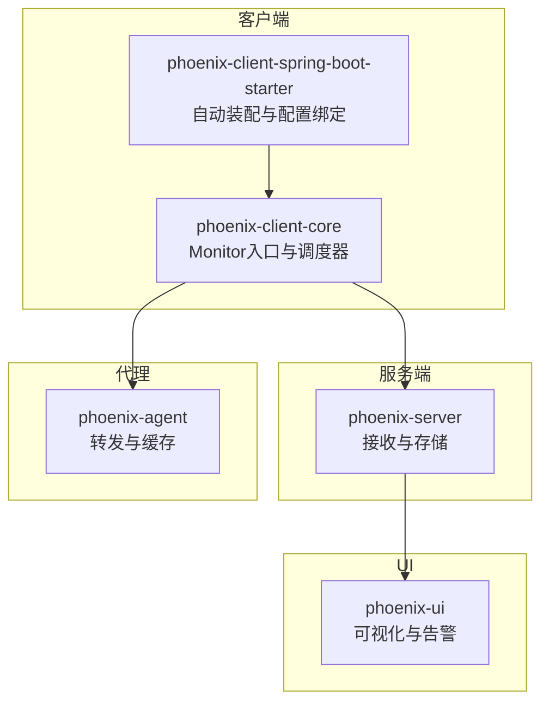
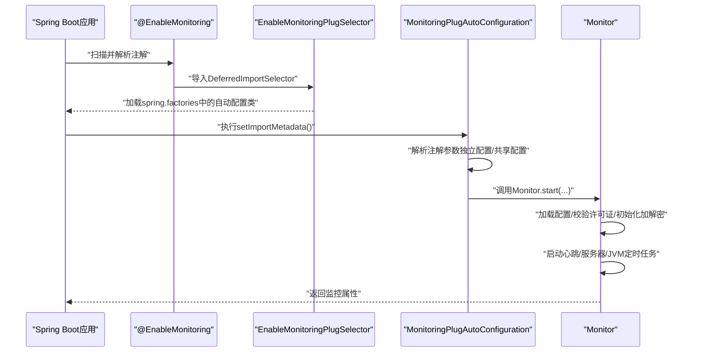
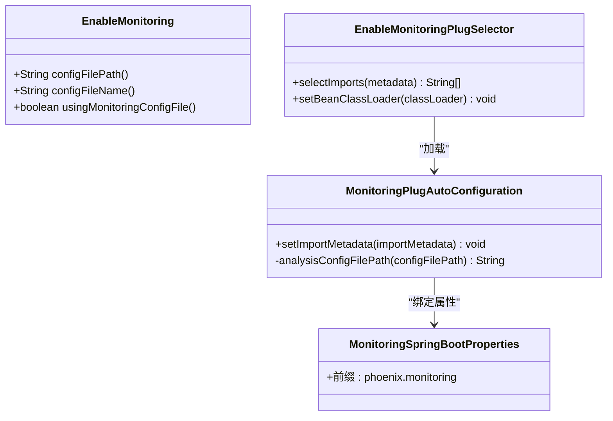
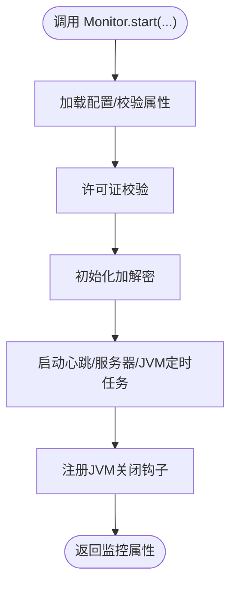
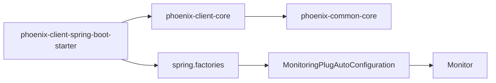

# 集成示例与最佳实践

<cite>
**本文引用的文件**
- [EnableMonitoring.java](file://phoenix-client/phoenix-client-spring-boot-starter/src/main/java/com/gitee/pifeng/monitoring/starter/annotation/EnableMonitoring.java)
- [MonitoringPlugAutoConfiguration.java](file://phoenix-client/phoenix-client-spring-boot-starter/src/main/java/com/gitee/pifeng/monitoring/starter/autoconfigure/MonitoringPlugAutoConfiguration.java)
- [MonitoringSpringBootProperties.java](file://phoenix-client/phoenix-client-spring-boot-starter/src/main/java/com/gitee/pifeng/monitoring/starter/property/MonitoringSpringBootProperties.java)
- [EnableMonitoringPlugSelector.java](file://phoenix-client/phoenix-client-spring-boot-starter/src/main/java/com/gitee/pifeng/monitoring/starter/selector/EnableMonitoringPlugSelector.java)
- [spring.factories](file://phoenix-client/phoenix-client-spring-boot-starter/src/main/resources/META-INF/spring.factories)
- [monitoring.properties](file://phoenix-client/phoenix-client-core/src/main/resources/monitoring.properties)
- [Monitor.java](file://phoenix-client/phoenix-client-core/src/main/java/com/gitee/pifeng/monitoring/plug/Monitor.java)
- [MonitoringProperties.java](file://phoenix-common/phoenix-common-core/src/main/java/com/gitee/pifeng/monitoring/common/property/client/MonitoringProperties.java)
- [application.yml（Agent）](file://phoenix-agent/src/main/resources/application.yml)
- [application.yml（Server）](file://phoenix-server/src/main/resources/application.yml)
- [application.yml（UI）](file://phoenix-ui/src/main/resources/application.yml)
- [pom.xml（Client Core）](file://phoenix-client/phoenix-client-core/pom.xml)
</cite>

## 目录
1. [简介](#简介)
2. [项目结构](#项目结构)
3. [核心组件](#核心组件)
4. [架构总览](#架构总览)
5. [详细组件分析](#详细组件分析)
6. [依赖分析](#依赖分析)
7. [性能考量](#性能考量)
8. [故障排除指南](#故障排除指南)
9. [结论](#结论)
10. [附录](#附录)

## 简介
本指南面向在Spring Boot应用中集成Phoenix监控客户端的开发者，提供从Maven依赖引入、注解启用、配置文件设置到实际运行的完整流程与最佳实践。文档同时覆盖微服务、单体应用、云原生三类场景的集成策略，给出性能优化、告警与数据导出、第三方集成、常见问题排查、效果评估与升级迁移等实用建议。

## 项目结构
Phoenix监控体系由“客户端”“服务端”“UI”“代理”四部分组成，其中“客户端”负责采集与上报，服务端负责接收与存储，UI负责可视化与告警管理，代理可作为中间层转发与缓存。客户端又细分为核心库与Spring Boot Starter两层，前者提供Monitor入口与调度器，后者提供自动装配与配置绑定。

图表来源
- [Monitor.java:67-151](file://phoenix-client/phoenix-client-core/src/main/java/com/gitee/pifeng/monitoring/plug/Monitor.java#L67-L151)
- [MonitoringPlugAutoConfiguration.java:49-76](file://phoenix-client/phoenix-client-spring-boot-starter/src/main/java/com/gitee/pifeng/monitoring/starter/autoconfigure/MonitoringPlugAutoConfiguration.java#L49-L76)
- [application.yml（Server）:1-271](file://phoenix-server/src/main/resources/application.yml#L1-L271)
- [application.yml（Agent）:1-111](file://phoenix-agent/src/main/resources/application.yml#L1-L111)
- [application.yml（UI）:1-238](file://phoenix-ui/src/main/resources/application.yml#L1-L238)

章节来源
- [Monitor.java:67-151](file://phoenix-client/phoenix-client-core/src/main/java/com/gitee/pifeng/monitoring/plug/Monitor.java#L67-L151)
- [MonitoringPlugAutoConfiguration.java:49-76](file://phoenix-client/phoenix-client-spring-boot-starter/src/main/java/com/gitee/pifeng/monitoring/starter/autoconfigure/MonitoringPlugAutoConfiguration.java#L49-L76)

## 核心组件
- 启用注解：通过@EnableMonitoring声明式开启监控，支持独立配置文件路径与文件名，以及是否使用独立配置文件模式。
- 自动配置：基于DeferredImportSelector加载spring.factories中声明的自动配置类，按需启动Monitor并解析配置。
- 配置绑定：Spring Boot属性前缀绑定至MonitoringSpringBootProperties，继承MonitoringProperties结构。
- Monitor入口：统一启动流程，加载配置、校验许可证、初始化加解密、启动心跳/服务器/JVM定时任务，并注册JVM关闭钩子。

章节来源
- [EnableMonitoring.java:16-60](file://phoenix-client/phoenix-client-spring-boot-starter/src/main/java/com/gitee/pifeng/monitoring/starter/annotation/EnableMonitoring.java#L16-L60)
- [EnableMonitoringPlugSelector.java:41-48](file://phoenix-client/phoenix-client-spring-boot-starter/src/main/java/com/gitee/pifeng/monitoring/starter/selector/EnableMonitoringPlugSelector.java#L41-L48)
- [spring.factories:1-4](file://phoenix-client/phoenix-client-spring-boot-starter/src/main/resources/META-INF/spring.factories#L1-L4)
- [MonitoringPlugAutoConfiguration.java:49-97](file://phoenix-client/phoenix-client-spring-boot-starter/src/main/java/com/gitee/pifeng/monitoring/starter/autoconfigure/MonitoringPlugAutoConfiguration.java#L49-L97)
- [MonitoringSpringBootProperties.java:17-22](file://phoenix-client/phoenix-client-spring-boot-starter/src/main/java/com/gitee/pifeng/monitoring/starter/property/MonitoringSpringBootProperties.java#L17-L22)
- [MonitoringProperties.java:18-55](file://phoenix-common/phoenix-common-core/src/main/java/com/gitee/pifeng/monitoring/common/property/client/MonitoringProperties.java#L18-L55)
- [Monitor.java:67-151](file://phoenix-client/phoenix-client-core/src/main/java/com/gitee/pifeng/monitoring/plug/Monitor.java#L67-L151)

## 架构总览
以下序列图展示了Spring Boot应用集成Phoenix监控的关键调用链：应用启动 -> 加载@EnableMonitoring -> DeferredImportSelector加载自动配置 -> 自动配置解析注解参数 -> 启动Monitor -> 初始化定时任务 -> 上报心跳/服务器/JVM信息。

图表来源
- [EnableMonitoring.java:16-60](file://phoenix-client/phoenix-client-spring-boot-starter/src/main/java/com/gitee/pifeng/monitoring/starter/annotation/EnableMonitoring.java#L16-L60)
- [EnableMonitoringPlugSelector.java:41-48](file://phoenix-client/phoenix-client-spring-boot-starter/src/main/java/com/gitee/pifeng/monitoring/starter/selector/EnableMonitoringPlugSelector.java#L41-L48)
- [spring.factories:1-4](file://phoenix-client/phoenix-client-spring-boot-starter/src/main/resources/META-INF/spring.factories#L1-L4)
- [MonitoringPlugAutoConfiguration.java:49-97](file://phoenix-client/phoenix-client-spring-boot-starter/src/main/java/com/gitee/pifeng/monitoring/starter/autoconfigure/MonitoringPlugAutoConfiguration.java#L49-L97)
- [Monitor.java:67-151](file://phoenix-client/phoenix-client-core/src/main/java/com/gitee/pifeng/monitoring/plug/Monitor.java#L67-L151)

## 详细组件分析

### 组件一：启用注解与自动配置
- @EnableMonitoring支持三种模式：
  - 使用独立配置文件：通过configFilePath与configFileName定位配置文件，需以特定前缀标识路径来源。
  - 共享Spring Boot配置：通过phoenix.monitoring前缀读取application.yml中的配置项。
- DeferredImportSelector从spring.factories加载自动配置类，若未找到则抛出异常，确保装配正确性。
- MonitoringPlugAutoConfiguration根据注解参数决定调用Monitor.start()的不同重载，或直接传入已绑定的MonitoringProperties。

图表来源
- [EnableMonitoring.java:16-60](file://phoenix-client/phoenix-client-spring-boot-starter/src/main/java/com/gitee/pifeng/monitoring/starter/annotation/EnableMonitoring.java#L16-L60)
- [EnableMonitoringPlugSelector.java:41-48](file://phoenix-client/phoenix-client-spring-boot-starter/src/main/java/com/gitee/pifeng/monitoring/starter/selector/EnableMonitoringPlugSelector.java#L41-L48)
- [MonitoringPlugAutoConfiguration.java:49-97](file://phoenix-client/phoenix-client-spring-boot-starter/src/main/java/com/gitee/pifeng/monitoring/starter/autoconfigure/MonitoringPlugAutoConfiguration.java#L49-L97)
- [MonitoringSpringBootProperties.java:17-22](file://phoenix-client/phoenix-client-spring-boot-starter/src/main/java/com/gitee/pifeng/monitoring/starter/property/MonitoringSpringBootProperties.java#L17-L22)

章节来源
- [EnableMonitoring.java:16-60](file://phoenix-client/phoenix-client-spring-boot-starter/src/main/java/com/gitee/pifeng/monitoring/starter/annotation/EnableMonitoring.java#L16-L60)
- [EnableMonitoringPlugSelector.java:41-48](file://phoenix-client/phoenix-client-spring-boot-starter/src/main/java/com/gitee/pifeng/monitoring/starter/selector/EnableMonitoringPlugSelector.java#L41-L48)
- [spring.factories:1-4](file://phoenix-client/phoenix-client-spring-boot-starter/src/main/resources/META-INF/spring.factories#L1-L4)
- [MonitoringPlugAutoConfiguration.java:49-97](file://phoenix-client/phoenix-client-spring-boot-starter/src/main/java/com/gitee/pifeng/monitoring/starter/autoconfigure/MonitoringPlugAutoConfiguration.java#L49-L97)
- [MonitoringSpringBootProperties.java:17-22](file://phoenix-client/phoenix-client-spring-boot-starter/src/main/java/com/gitee/pifeng/monitoring/starter/property/MonitoringSpringBootProperties.java#L17-L22)

### 组件二：Monitor入口与配置加载
- Monitor.start()支持三种调用方式：无参（使用独立配置）、带路径/文件名（独立配置）、传入MonitoringProperties（共享配置）。
- 启动流程包含：打印Banner、加载/校验配置、许可证校验、初始化加解密、启动定时任务、注册JVM关闭钩子。
- 支持告警发送与业务埋点调度器，便于扩展告警与自定义周期性任务。

图表来源
- [Monitor.java:67-151](file://phoenix-client/phoenix-client-core/src/main/java/com/gitee/pifeng/monitoring/plug/Monitor.java#L67-L151)

章节来源
- [Monitor.java:67-151](file://phoenix-client/phoenix-client-core/src/main/java/com/gitee/pifeng/monitoring/plug/Monitor.java#L67-L151)

### 组件三：配置文件与属性绑定
- 独立配置文件monitoring.properties包含安全、通信、实例、心跳、服务器信息、JVM信息等关键项。
- Spring Boot共享配置通过phoenix.monitoring前缀映射到MonitoringProperties对象，便于在application.yml中集中管理。
- Client Core的pom中排除了monitoring.properties资源，避免打包冲突，建议在应用侧提供独立配置或通过共享配置注入。

章节来源
- [monitoring.properties:1-41](file://phoenix-client/phoenix-client-core/src/main/resources/monitoring.properties#L1-L41)
- [MonitoringSpringBootProperties.java:17-22](file://phoenix-client/phoenix-client-spring-boot-starter/src/main/java/com/gitee/pifeng/monitoring/starter/property/MonitoringSpringBootProperties.java#L17-L22)
- [MonitoringProperties.java:18-55](file://phoenix-common/phoenix-common-core/src/main/java/com/gitee/pifeng/monitoring/common/property/client/MonitoringProperties.java#L18-L55)
- [pom.xml（Client Core）:64-71](file://phoenix-client/phoenix-client-core/pom.xml#L64-L71)

### 组件四：服务端/代理/UI配置要点
- 服务端、代理、UI均采用Spring Boot配置，包含 Undertow 访问日志、优雅停机、Knife4j/SpringDoc 文档、数据源与缓存等。
- 服务端启用Quartz集群化调度，UI启用Caffeine缓存与JDBC Session，代理开启访问日志与本地管理端点。

章节来源
- [application.yml（Server）:1-271](file://phoenix-server/src/main/resources/application.yml#L1-L271)
- [application.yml（Agent）:1-111](file://phoenix-agent/src/main/resources/application.yml#L1-L111)
- [application.yml（UI）:1-238](file://phoenix-ui/src/main/resources/application.yml#L1-L238)

## 依赖分析
- 客户端Starter依赖客户端Core与公共Core，提供自动装配与属性绑定。
- Monitor内部依赖公共属性模型与定时任务调度器，对外暴露简洁的start/sendAlarm/buryingPoint接口。
- 服务端/代理/UI各自维护独立的application.yml，体现模块化与职责分离。

图表来源
- [spring.factories:1-4](file://phoenix-client/phoenix-client-spring-boot-starter/src/main/resources/META-INF/spring.factories#L1-L4)
- [MonitoringPlugAutoConfiguration.java:49-76](file://phoenix-client/phoenix-client-spring-boot-starter/src/main/java/com/gitee/pifeng/monitoring/starter/autoconfigure/MonitoringPlugAutoConfiguration.java#L49-L76)
- [Monitor.java:67-151](file://phoenix-client/phoenix-client-core/src/main/java/com/gitee/pifeng/monitoring/plug/Monitor.java#L67-L151)

章节来源
- [spring.factories:1-4](file://phoenix-client/phoenix-client-spring-boot-starter/src/main/resources/META-INF/spring.factories#L1-L4)
- [MonitoringPlugAutoConfiguration.java:49-76](file://phoenix-client/phoenix-client-spring-boot-starter/src/main/java/com/gitee/pifeng/monitoring/starter/autoconfigure/MonitoringPlugAutoConfiguration.java#L49-L76)
- [Monitor.java:67-151](file://phoenix-client/phoenix-client-core/src/main/java/com/gitee/pifeng/monitoring/plug/Monitor.java#L67-L151)

## 性能考量
- 采样率与频率控制
  - 心跳与各类信息上报频率由配置项控制，建议在高并发场景适当增大rate并结合服务端限流策略。
  - JVM与服务器信息采集可按需开启，避免不必要的系统调用。
- 网络与超时
  - HTTP连接/Socket/连接池等待超时可按网络环境调优，避免阻塞导致线程堆积。
  - 代理可作为缓冲层，缓解突发流量对服务端的压力。
- 线程池与调度
  - 使用受监控的调度线程池，合理设置线程类型与队列容量，避免任务积压。
- 日志与开销
  - 服务端/代理/UI的日志级别已针对监控模块进行优化，建议保持默认或仅在排障时临时提升。
- 云原生优化
  - 在容器环境中固定资源限制与GC策略，配合采样率与上报频率，平衡可观测性与资源占用。

## 故障排除指南
- 启动失败或找不到自动配置类
  - 检查@EnableMonitoring是否正确引入，确认spring.factories中自动配置类可被加载。
  - 参考自动配置类加载失败的异常提示，修正依赖与打包。
- 独立配置文件路径错误
  - 独立配置模式需使用特定前缀标识路径来源，否则会抛出参数异常。
  - 确认配置文件存在且包含必需项（如HTTP通信URL、实例名称等）。
- 许可证校验失败
  - 非客户端端点类型在启动时会进行许可证校验，校验失败将立即终止进程。
  - 请核对实例端点类型与许可证范围。
- 网络异常与告警发送失败
  - 检查HTTP通信URL可达性与超时配置，关注告警发送返回结果。
- JVM关闭钩子与优雅停机
  - 若出现未正常上报离线包，检查优雅停机配置与线程池关闭顺序。

章节来源
- [MonitoringPlugAutoConfiguration.java:88-97](file://phoenix-client/phoenix-client-spring-boot-starter/src/main/java/com/gitee/pifeng/monitoring/starter/autoconfigure/MonitoringPlugAutoConfiguration.java#L88-L97)
- [Monitor.java:124-151](file://phoenix-client/phoenix-client-core/src/main/java/com/gitee/pifeng/monitoring/plug/Monitor.java#L124-L151)
- [monitoring.properties:10-41](file://phoenix-client/phoenix-client-core/src/main/resources/monitoring.properties#L10-L41)

## 结论
通过@EnableMonitoring与Starter自动装配，Spring Boot应用可零样板地接入Phoenix监控。建议优先采用共享配置模式简化运维，按场景调优采样率与频率，并结合代理与服务端限流策略实现弹性可观测。配合告警与UI，形成闭环的监控治理能力。

## 附录

### 集成步骤清单（Spring Boot）
- Maven依赖
  - 引入客户端Starter坐标，确保版本与项目一致。
  - 如需独立配置文件，提供monitoring.properties并正确标注路径前缀。
- 启用监控
  - 在应用入口类或配置类上添加@EnableMonitoring。
  - 若使用独立配置文件，设置configFilePath与configFileName；否则使用phoenix.monitoring前缀在application.yml中配置。
- 关键配置项
  - 通信URL、实例名称、端点类型、心跳与各类信息上报频率、是否采集JVM/服务器信息等。
- 启动验证
  - 观察启动日志与服务端接收情况，确认心跳与信息包正常上报。

章节来源
- [EnableMonitoring.java:16-60](file://phoenix-client/phoenix-client-spring-boot-starter/src/main/java/com/gitee/pifeng/monitoring/starter/annotation/EnableMonitoring.java#L16-L60)
- [MonitoringPlugAutoConfiguration.java:49-97](file://phoenix-client/phoenix-client-spring-boot-starter/src/main/java/com/gitee/pifeng/monitoring/starter/autoconfigure/MonitoringPlugAutoConfiguration.java#L49-L97)
- [monitoring.properties:10-41](file://phoenix-client/phoenix-client-core/src/main/resources/monitoring.properties#L10-L41)

### 不同场景的最佳实践
- 微服务架构
  - 使用共享配置模式，集中于配置中心；为每个服务设置唯一实例名称与端点类型；通过代理汇聚上报，降低服务端压力。
- 单体应用
  - 优先使用共享配置，减少文件分发；按模块拆分信息采集频率，避免热点时段抖动。
- 云原生应用
  - 在容器内固定资源与GC策略，结合HPA与限流；利用代理做削峰填谷；通过UI与告警联动实现自动化处置。

### 监控数据使用方法
- 告警配置
  - 在UI中定义告警规则与接收人，结合服务端的告警通道与邮件模板。
- 数据导出
  - 通过服务端提供的接口或报表功能导出历史数据，支持CSV/Excel等格式。
- 第三方集成
  - 通过HTTP通信URL对接企业IM/工单系统，或使用服务端提供的开放接口进行二次开发。

### 效果评估与指标
- 可观测性覆盖率：实例/端点/模块的采集完整性。
- 报送稳定性：心跳与信息包丢失率、上报延迟分布。
- 告警质量：告警准确率、重复率、平均处置时长。
- 资源占用：CPU/内存/GC与网络带宽的峰值与均值。

### 升级与迁移注意事项
- 版本兼容
  - Starter与Core版本需匹配，升级前先在测试环境验证。
- 配置迁移
  - 独立配置文件与共享配置切换时，逐项比对配置项差异，避免遗漏。
- 渐进式迁移
  - 先在灰度环境启用新版本，观察上报与告警表现，再逐步扩大范围。
- 回滚预案
  - 保留旧版配置与依赖，确保可快速回退。