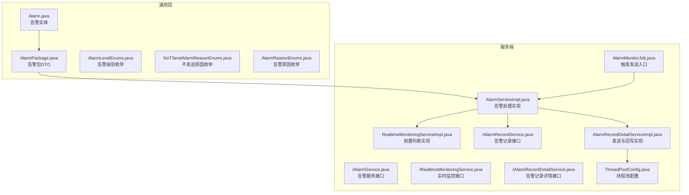
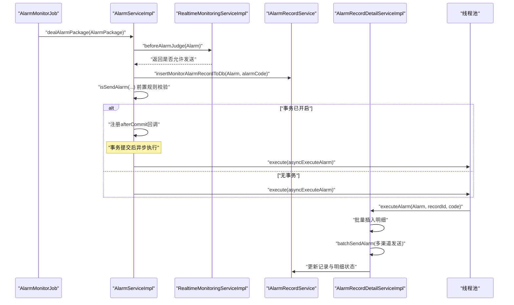
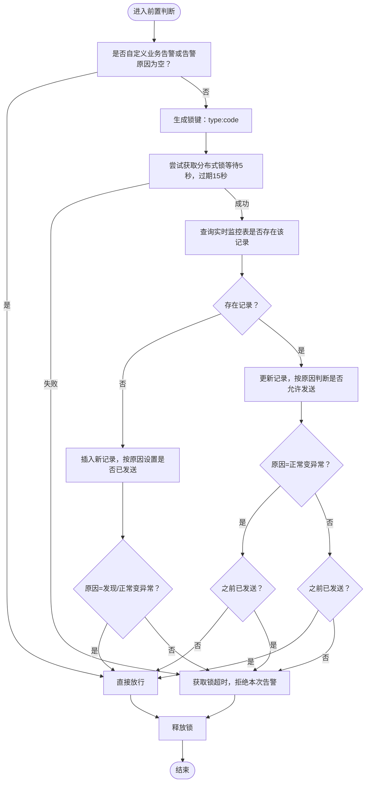
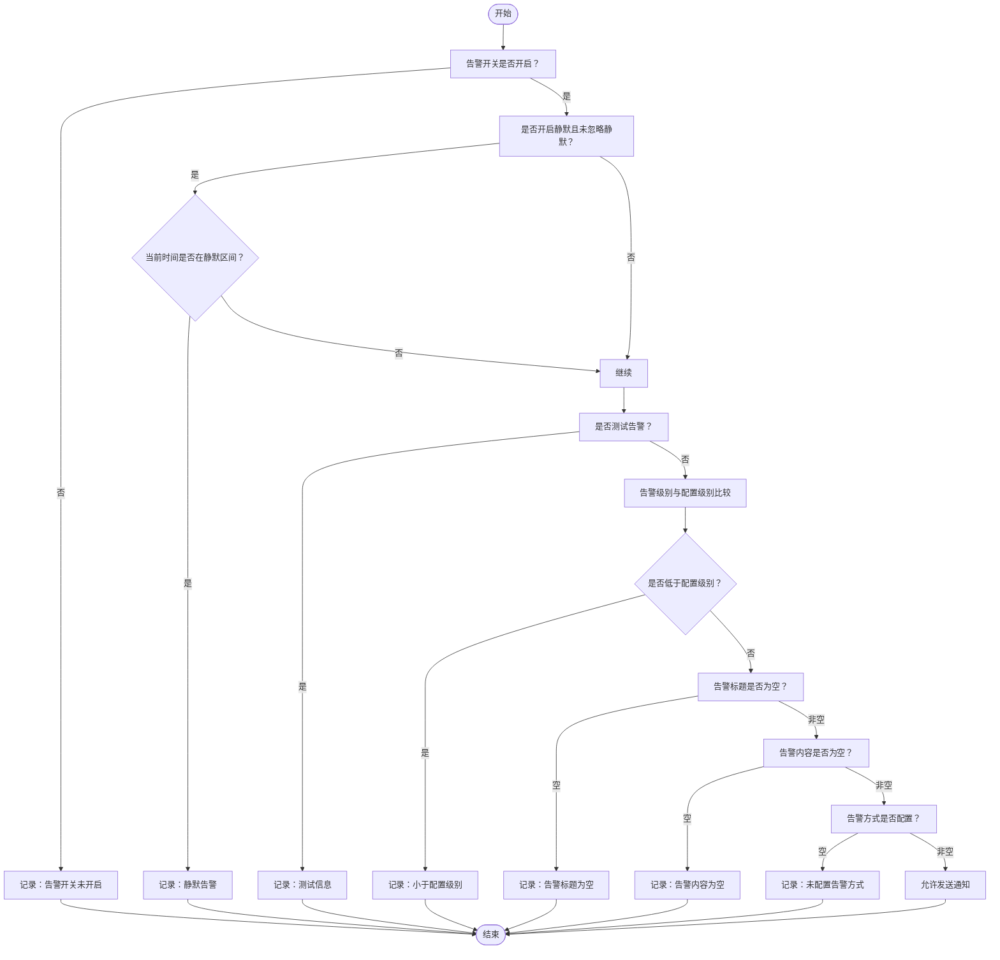
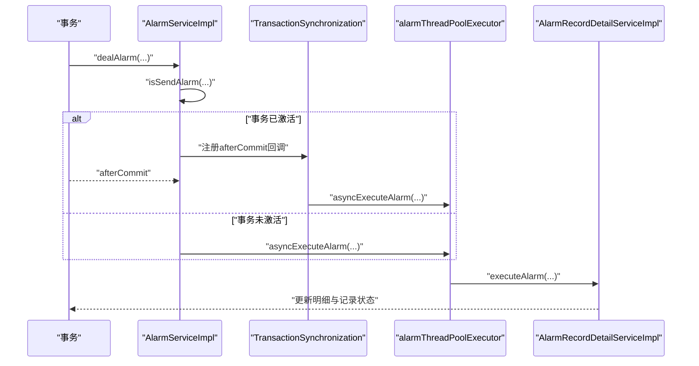
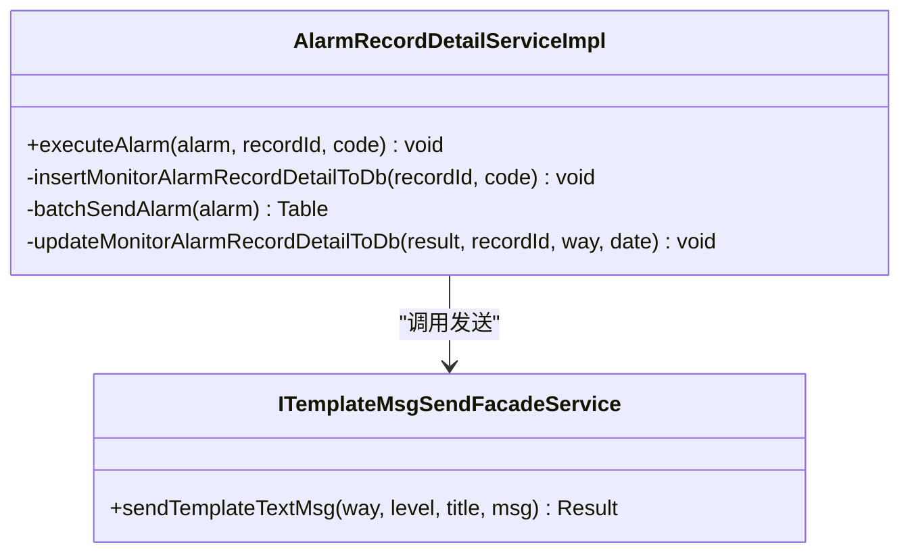
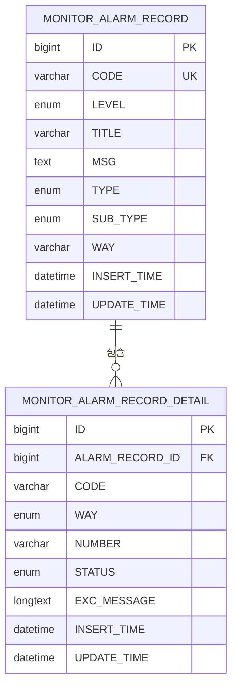
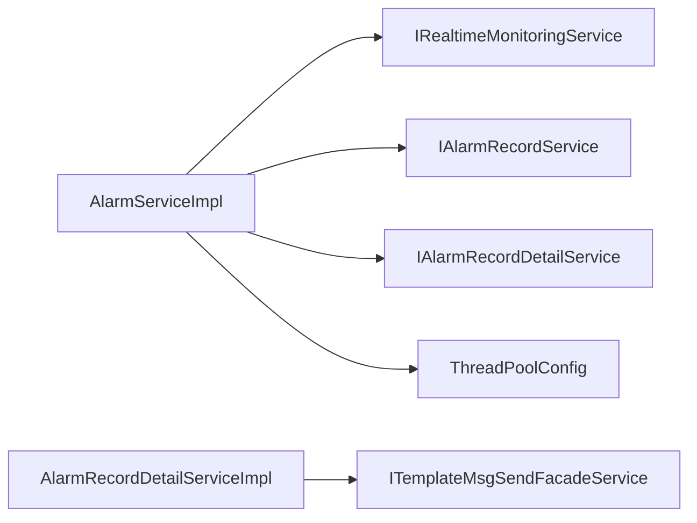

# 告警处理流程

<cite>
**本文引用的文件**
- [AlarmServiceImpl.java](file://phoenix-server/src/main/java/com/gitee/pifeng/monitoring/server/business/server/service/impl/AlarmServiceImpl.java)
- [RealtimeMonitoringServiceImpl.java](file://phoenix-server/src/main/java/com/gitee/pifeng/monitoring/server/business/server/service/impl/RealtimeMonitoringServiceImpl.java)
- [AlarmRecordDetailServiceImpl.java](file://phoenix-server/src/main/java/com/gitee/pifeng/monitoring/server/business/server/service/impl/AlarmRecordDetailServiceImpl.java)
- [Alarm.java](file://phoenix-common/phoenix-common-core/src/main/java/com/gitee/pifeng/monitoring/common/domain/Alarm.java)
- [AlarmPackage.java](file://phoenix-common/phoenix-common-core/src/main/java/com/gitee/pifeng/monitoring/common/dto/AlarmPackage.java)
- [AlarmLevelEnums.java](file://phoenix-common/phoenix-common-core/src/main/java/com/gitee/pifeng/monitoring/common/constant/alarm/AlarmLevelEnums.java)
- [NoTSendAlarmReasonEnums.java](file://phoenix-common/phoenix-common-core/src/main/java/com/gitee/pifeng/monitoring/common/constant/alarm/NoTSendAlarmReasonEnums.java)
- [IAlarmService.java](file://phoenix-server/src/main/java/com/gitee/pifeng/monitoring/server/business/server/service/IAlarmService.java)
- [IRealtimeMonitoringService.java](file://phoenix-server/src/main/java/com/gitee/pifeng/monitoring/server/business/server/service/IRealtimeMonitoringService.java)
- [IAlarmRecordService.java](file://phoenix-server/src/main/java/com/gitee/pifeng/monitoring/server/business/server/service/IAlarmRecordService.java)
- [IAlarmRecordDetailService.java](file://phoenix-server/src/main/java/com/gitee/pifeng/monitoring/server/business/server/service/IAlarmRecordDetailService.java)
- [ThreadPoolConfig.java](file://phoenix-server/src/main/java/com/gitee/pifeng/monitoring/server/config/ThreadPoolConfig.java)
- [AlarmMonitorJob.java](file://phoenix-server/src/main/java/com/gitee/pifeng/monitoring/server/business/server/monitor/AlarmMonitorJob.java)
- [AlarmReasonEnums.java](file://phoenix-common/phoenix-common-core/src/main/java/com/gitee/pifeng/monitoring/common/constant/alarm/AlarmReasonEnums.java)
- [phoenix.sql](file://doc/数据库设计/sql/mysql/phoenix.sql)
</cite>

## 目录
1. [简介](#简介)
2. [项目结构](#项目结构)
3. [核心组件](#核心组件)
4. [架构总览](#架构总览)
5. [详细组件分析](#详细组件分析)
6. [依赖关系分析](#依赖关系分析)
7. [性能考量](#性能考量)
8. [故障排查指南](#故障排查指南)
9. [结论](#结论)
10. [附录](#附录)

## 简介
本技术文档围绕告警处理流程进行全面阐述，覆盖从告警包接收、前置判断、规则匹配、数据库持久化、异步发送通知到结果回写与监控的全链路。重点解析以下方面：
- 告警前置判断机制：重复告警过滤、静默期处理、测试告警屏蔽
- 告警级别判定与阈值校验：级别比较、条件验证
- 事务性保障：数据库事务、异步处理、事务同步回调
- 性能优化策略：并发控制、线程池配置、资源管理
- 监控与调试：处理日志、耗时统计、错误追踪
- 扩展点：如何自定义处理逻辑与新增规则

## 项目结构
告警处理相关代码主要分布在以下模块：
- 通用模型与常量：phoenix-common
- 服务端处理：phoenix-server
- 客户端/代理侧发送：phoenix-agent（用于向服务端上报）

**图表来源**
- [Alarm.java:1-117](file://phoenix-common/phoenix-common-core/src/main/java/com/gitee/pifeng/monitoring/common/domain/Alarm.java#L1-L117)
- [AlarmPackage.java:1-29](file://phoenix-common/phoenix-common-core/src/main/java/com/gitee/pifeng/monitoring/common/dto/AlarmPackage.java#L1-L29)
- [AlarmLevelEnums.java:1-118](file://phoenix-common/phoenix-common-core/src/main/java/com/gitee/pifeng/monitoring/common/constant/alarm/AlarmLevelEnums.java#L1-L118)
- [NoTSendAlarmReasonEnums.java:1-78](file://phoenix-common/phoenix-common-core/src/main/java/com/gitee/pifeng/monitoring/common/constant/alarm/NoTSendAlarmReasonEnums.java#L1-L78)
- [AlarmReasonEnums.java:1-33](file://phoenix-common/phoenix-common-core/src/main/java/com/gitee/pifeng/monitoring/common/constant/alarm/AlarmReasonEnums.java#L1-L33)
- [IAlarmService.java:1-28](file://phoenix-server/src/main/java/com/gitee/pifeng/monitoring/server/business/server/service/IAlarmService.java#L1-L28)
- [AlarmServiceImpl.java:1-304](file://phoenix-server/src/main/java/com/gitee/pifeng/monitoring/server/business/server/service/impl/AlarmServiceImpl.java#L1-L304)
- [IRealtimeMonitoringService.java:1-30](file://phoenix-server/src/main/java/com/gitee/pifeng/monitoring/server/business/server/service/IRealtimeMonitoringService.java#L1-L30)
- [RealtimeMonitoringServiceImpl.java:1-161](file://phoenix-server/src/main/java/com/gitee/pifeng/monitoring/server/business/server/service/impl/RealtimeMonitoringServiceImpl.java#L1-L161)
- [IAlarmRecordService.java:1-59](file://phoenix-server/src/main/java/com/gitee/pifeng/monitoring/server/business/server/service/IAlarmRecordService.java#L1-L59)
- [IAlarmRecordDetailService.java:1-34](file://phoenix-server/src/main/java/com/gitee/pifeng/monitoring/server/business/server/service/IAlarmRecordDetailService.java#L1-L34)
- [AlarmRecordDetailServiceImpl.java:1-215](file://phoenix-server/src/main/java/com/gitee/pifeng/monitoring/server/business/server/service/impl/AlarmRecordDetailServiceImpl.java#L1-L215)
- [ThreadPoolConfig.java:194-210](file://phoenix-server/src/main/java/com/gitee/pifeng/monitoring/server/config/ThreadPoolConfig.java#L194-L210)
- [AlarmMonitorJob.java:101-127](file://phoenix-server/src/main/java/com/gitee/pifeng/monitoring/server/business/server/monitor/AlarmMonitorJob.java#L101-L127)

**章节来源**
- [AlarmServiceImpl.java:1-304](file://phoenix-server/src/main/java/com/gitee/pifeng/monitoring/server/business/server/service/impl/AlarmServiceImpl.java#L1-L304)
- [RealtimeMonitoringServiceImpl.java:1-161](file://phoenix-server/src/main/java/com/gitee/pifeng/monitoring/server/business/server/service/impl/RealtimeMonitoringServiceImpl.java#L1-L161)
- [AlarmRecordDetailServiceImpl.java:1-215](file://phoenix-server/src/main/java/com/gitee/pifeng/monitoring/server/business/server/service/impl/AlarmRecordDetailServiceImpl.java#L1-L215)
- [Alarm.java:1-117](file://phoenix-common/phoenix-common-core/src/main/java/com/gitee/pifeng/monitoring/common/domain/Alarm.java#L1-L117)
- [AlarmPackage.java:1-29](file://phoenix-common/phoenix-common-core/src/main/java/com/gitee/pifeng/monitoring/common/dto/AlarmPackage.java#L1-L29)
- [AlarmLevelEnums.java:1-118](file://phoenix-common/phoenix-common-core/src/main/java/com/gitee/pifeng/monitoring/common/constant/alarm/AlarmLevelEnums.java#L1-L118)
- [NoTSendAlarmReasonEnums.java:1-78](file://phoenix-common/phoenix-common-core/src/main/java/com/gitee/pifeng/monitoring/common/constant/alarm/NoTSendAlarmReasonEnums.java#L1-L78)
- [IAlarmService.java:1-28](file://phoenix-server/src/main/java/com/gitee/pifeng/monitoring/server/business/server/service/IAlarmService.java#L1-L28)
- [IRealtimeMonitoringService.java:1-30](file://phoenix-server/src/main/java/com/gitee/pifeng/monitoring/server/business/server/service/IRealtimeMonitoringService.java#L1-L30)
- [IAlarmRecordService.java:1-59](file://phoenix-server/src/main/java/com/gitee/pifeng/monitoring/server/business/server/service/IAlarmRecordService.java#L1-L59)
- [IAlarmRecordDetailService.java:1-34](file://phoenix-server/src/main/java/com/gitee/pifeng/monitoring/server/business/server/service/IAlarmRecordDetailService.java#L1-L34)
- [ThreadPoolConfig.java:194-210](file://phoenix-server/src/main/java/com/gitee/pifeng/monitoring/server/config/ThreadPoolConfig.java#L194-L210)
- [AlarmMonitorJob.java:101-127](file://phoenix-server/src/main/java/com/gitee/pifeng/monitoring/server/business/server/monitor/AlarmMonitorJob.java#L101-L127)

## 核心组件
- 告警实体与包：封装告警级别、原因、标题、内容、监控类型、是否测试等字段，以及告警包结构。
- 告警服务：负责接收告警包、前置判断、规则校验、持久化、异步发送与结果回写。
- 实时监控服务：执行前置判断，基于分布式锁与实时表决定是否允许发送告警，避免重复告警。
- 告警记录与详情服务：分别负责记录主表与明细表的插入、批量发送、状态回写。
- 线程池配置：为异步告警发送提供专用线程池，保障吞吐与稳定性。

**章节来源**
- [Alarm.java:1-117](file://phoenix-common/phoenix-common-core/src/main/java/com/gitee/pifeng/monitoring/common/domain/Alarm.java#L1-L117)
- [AlarmPackage.java:1-29](file://phoenix-common/phoenix-common-core/src/main/java/com/gitee/pifeng/monitoring/common/dto/AlarmPackage.java#L1-L29)
- [IAlarmService.java:1-28](file://phoenix-server/src/main/java/com/gitee/pifeng/monitoring/server/business/server/service/IAlarmService.java#L1-L28)
- [AlarmServiceImpl.java:1-304](file://phoenix-server/src/main/java/com/gitee/pifeng/monitoring/server/business/server/service/impl/AlarmServiceImpl.java#L1-L304)
- [IRealtimeMonitoringService.java:1-30](file://phoenix-server/src/main/java/com/gitee/pifeng/monitoring/server/business/server/service/IRealtimeMonitoringService.java#L1-L30)
- [RealtimeMonitoringServiceImpl.java:1-161](file://phoenix-server/src/main/java/com/gitee/pifeng/monitoring/server/business/server/service/impl/RealtimeMonitoringServiceImpl.java#L1-L161)
- [IAlarmRecordService.java:1-59](file://phoenix-server/src/main/java/com/gitee/pifeng/monitoring/server/business/server/service/IAlarmRecordService.java#L1-L59)
- [IAlarmRecordDetailService.java:1-34](file://phoenix-server/src/main/java/com/gitee/pifeng/monitoring/server/business/server/service/IAlarmRecordDetailService.java#L1-L34)
- [AlarmRecordDetailServiceImpl.java:1-215](file://phoenix-server/src/main/java/com/gitee/pifeng/monitoring/server/business/server/service/impl/AlarmRecordDetailServiceImpl.java#L1-L215)
- [ThreadPoolConfig.java:194-210](file://phoenix-server/src/main/java/com/gitee/pifeng/monitoring/server/config/ThreadPoolConfig.java#L194-L210)

## 架构总览
告警处理采用“同步接收+异步发送”的模式，确保处理主线程快速返回，同时通过事务同步回调与线程池保障发送可靠性。

**图表来源**
- [AlarmMonitorJob.java:101-127](file://phoenix-server/src/main/java/com/gitee/pifeng/monitoring/server/business/server/monitor/AlarmMonitorJob.java#L101-L127)
- [AlarmServiceImpl.java:86-170](file://phoenix-server/src/main/java/com/gitee/pifeng/monitoring/server/business/server/service/impl/AlarmServiceImpl.java#L86-L170)
- [RealtimeMonitoringServiceImpl.java:55-139](file://phoenix-server/src/main/java/com/gitee/pifeng/monitoring/server/business/server/service/impl/RealtimeMonitoringServiceImpl.java#L55-L139)
- [AlarmRecordDetailServiceImpl.java:77-108](file://phoenix-server/src/main/java/com/gitee/pifeng/monitoring/server/business/server/service/impl/AlarmRecordDetailServiceImpl.java#L77-L108)
- [ThreadPoolConfig.java:194-210](file://phoenix-server/src/main/java/com/gitee/pifeng/monitoring/server/config/ThreadPoolConfig.java#L194-L210)

## 详细组件分析

### 告警前置判断机制
前置判断由实时监控服务完成，核心目标是避免重复告警与异常状态切换导致的重复发送。关键逻辑如下：
- 放行条件：自定义业务告警或未设置告警原因的告警直接放行
- 锁竞争：针对“类型:告警代码”生成细粒度锁键，使用MySQL分布式锁，避免并发冲突
- 数据一致性：在事务内读取/写入实时监控表，依据告警原因决定是否允许发送
- 性能提示：超过临界值的日志告警，便于定位热点

**图表来源**
- [RealtimeMonitoringServiceImpl.java:55-159](file://phoenix-server/src/main/java/com/gitee/pifeng/monitoring/server/business/server/service/impl/RealtimeMonitoringServiceImpl.java#L55-L159)

**章节来源**
- [RealtimeMonitoringServiceImpl.java:55-159](file://phoenix-server/src/main/java/com/gitee/pifeng/monitoring/server/business/server/service/impl/RealtimeMonitoringServiceImpl.java#L55-L159)
- [IRealtimeMonitoringService.java:15-27](file://phoenix-server/src/main/java/com/gitee/pifeng/monitoring/server/business/server/service/IRealtimeMonitoringService.java#L15-L27)

### 规则匹配与前置校验
告警服务在前置判断之后，执行一系列规则校验以决定是否发送通知：
- 告警开关：若关闭，直接记录不发送原因并返回
- 静默期：若开启且未忽略静默，当前时间处于静默区间则不发送
- 测试告警：标记为测试的告警直接不发送
- 告警级别：与配置级别比较，低于配置级别则不发送
- 标题/内容/告警方式：均不能为空，否则记录相应原因并返回

**图表来源**
- [AlarmServiceImpl.java:206-284](file://phoenix-server/src/main/java/com/gitee/pifeng/monitoring/server/business/server/service/impl/AlarmServiceImpl.java#L206-L284)

**章节来源**
- [AlarmServiceImpl.java:206-284](file://phoenix-server/src/main/java/com/gitee/pifeng/monitoring/server/business/server/service/impl/AlarmServiceImpl.java#L206-L284)
- [AlarmLevelEnums.java:51-81](file://phoenix-common/phoenix-common-core/src/main/java/com/gitee/pifeng/monitoring/common/constant/alarm/AlarmLevelEnums.java#L51-L81)
- [NoTSendAlarmReasonEnums.java:21-56](file://phoenix-common/phoenix-common-core/src/main/java/com/gitee/pifeng/monitoring/common/constant/alarm/NoTSendAlarmReasonEnums.java#L21-L56)

### 告警级别判断与处理
- 级别比较：提供静态方法比较“当前级别”与“配置级别”，支持INFO/WARN/ERROR/FATAL层级关系
- 字符串转枚举：支持从字符串转换为枚举，便于外部配置注入
- 忽略级别：当告警级别为IGNORE时，直接不发送

**章节来源**
- [AlarmLevelEnums.java:51-115](file://phoenix-common/phoenix-common-core/src/main/java/com/gitee/pifeng/monitoring/common/constant/alarm/AlarmLevelEnums.java#L51-L115)

### 事务性保证与异步处理
- 主流程事务：前置判断与记录插入在事务内完成，确保一致性
- 异步发送：通过事务同步回调，在事务提交后才执行异步发送，避免阻塞
- 线程池：独立的告警线程池，线程命名规范，拒绝策略明确，保障高并发下的稳定性

**图表来源**
- [AlarmServiceImpl.java:159-192](file://phoenix-server/src/main/java/com/gitee/pifeng/monitoring/server/business/server/service/impl/AlarmServiceImpl.java#L159-L192)
- [ThreadPoolConfig.java:194-210](file://phoenix-server/src/main/java/com/gitee/pifeng/monitoring/server/config/ThreadPoolConfig.java#L194-L210)
- [AlarmRecordDetailServiceImpl.java:77-108](file://phoenix-server/src/main/java/com/gitee/pifeng/monitoring/server/business/server/service/impl/AlarmRecordDetailServiceImpl.java#L77-L108)

**章节来源**
- [AlarmServiceImpl.java:159-192](file://phoenix-server/src/main/java/com/gitee/pifeng/monitoring/server/business/server/service/impl/AlarmServiceImpl.java#L159-L192)
- [ThreadPoolConfig.java:194-210](file://phoenix-server/src/main/java/com/gitee/pifeng/monitoring/server/config/ThreadPoolConfig.java#L194-L210)
- [AlarmRecordDetailServiceImpl.java:77-108](file://phoenix-server/src/main/java/com/gitee/pifeng/monitoring/server/business/server/service/impl/AlarmRecordDetailServiceImpl.java#L77-L108)

### 通知发送与结果回写
- 明细插入：根据配置的告警方式批量插入明细记录（短信/邮件等）
- 批量发送：遍历告警方式，调用模板消息门面服务发送
- 结果回写：逐条更新明细状态与异常信息，汇总告警方式与结果写回记录表

**图表来源**
- [AlarmRecordDetailServiceImpl.java:77-213](file://phoenix-server/src/main/java/com/gitee/pifeng/monitoring/server/business/server/service/impl/AlarmRecordDetailServiceImpl.java#L77-L213)

**章节来源**
- [AlarmRecordDetailServiceImpl.java:77-213](file://phoenix-server/src/main/java/com/gitee/pifeng/monitoring/server/business/server/service/impl/AlarmRecordDetailServiceImpl.java#L77-L213)

### 数据模型与存储
- 告警记录与明细：记录告警基本信息、发送方式、状态与异常信息
- 外键约束：明细表关联记录表，保证数据完整性
- 索引设计：按告警方式、状态、时间建立索引，提升查询与统计效率

**图表来源**
- [phoenix.sql:76-89](file://doc/数据库设计/sql/mysql/phoenix.sql#L76-L89)

**章节来源**
- [phoenix.sql:76-89](file://doc/数据库设计/sql/mysql/phoenix.sql#L76-L89)

## 依赖关系分析
- 组件耦合：告警服务依赖实时监控、记录与明细服务；明细服务依赖模板消息门面与配置加载器
- 外部依赖：MySQL分布式锁、线程池、模板消息发送门面
- 循环依赖：未见循环依赖迹象，职责清晰

**图表来源**
- [AlarmServiceImpl.java:39-74](file://phoenix-server/src/main/java/com/gitee/pifeng/monitoring/server/business/server/service/impl/AlarmServiceImpl.java#L39-L74)
- [AlarmRecordDetailServiceImpl.java:47-60](file://phoenix-server/src/main/java/com/gitee/pifeng/monitoring/server/business/server/service/impl/AlarmRecordDetailServiceImpl.java#L47-L60)
- [ThreadPoolConfig.java:194-210](file://phoenix-server/src/main/java/com/gitee/pifeng/monitoring/server/config/ThreadPoolConfig.java#L194-L210)

**章节来源**
- [AlarmServiceImpl.java:39-74](file://phoenix-server/src/main/java/com/gitee/pifeng/monitoring/server/business/server/service/impl/AlarmServiceImpl.java#L39-L74)
- [AlarmRecordDetailServiceImpl.java:47-60](file://phoenix-server/src/main/java/com/gitee/pifeng/monitoring/server/business/server/service/impl/AlarmRecordDetailServiceImpl.java#L47-L60)
- [ThreadPoolConfig.java:194-210](file://phoenix-server/src/main/java/com/gitee/pifeng/monitoring/server/config/ThreadPoolConfig.java#L194-L210)

## 性能考量
- 并发控制
  - 前置判断使用MySQL分布式锁，避免高并发重复告警
  - 线程池采用固定大小与AbortPolicy，限制峰值资源占用
- 资源池管理
  - 线程池命名规范，守护线程，便于运维识别与回收
- 内存优化
  - 表格结构扁平化，明细批量插入减少往返
  - 日志仅在必要时输出，避免高频打印
- 事务与异步
  - 事务内仅做轻量操作，重活交给异步线程池

**章节来源**
- [RealtimeMonitoringServiceImpl.java:82-91](file://phoenix-server/src/main/java/com/gitee/pifeng/monitoring/server/business/server/service/impl/RealtimeMonitoringServiceImpl.java#L82-L91)
- [ThreadPoolConfig.java:194-210](file://phoenix-server/src/main/java/com/gitee/pifeng/monitoring/server/config/ThreadPoolConfig.java#L194-L210)
- [AlarmRecordDetailServiceImpl.java:148-151](file://phoenix-server/src/main/java/com/gitee/pifeng/monitoring/server/business/server/service/impl/AlarmRecordDetailServiceImpl.java#L148-L151)

## 故障排查指南
- 常见不发送原因
  - 告警开关关闭、静默期、测试告警、级别不足、标题/内容为空、未配置告警方式
- 排查步骤
  - 查看告警记录与明细表状态与异常信息
  - 检查线程池执行日志与拒绝策略触发情况
  - 关注前置判断耗时日志，定位热点键
- 监控指标建议
  - 告警前置判断耗时、异步发送成功率、各告警方式失败率、静默期内告警计数

**章节来源**
- [NoTSendAlarmReasonEnums.java:21-56](file://phoenix-common/phoenix-common-core/src/main/java/com/gitee/pifeng/monitoring/common/constant/alarm/NoTSendAlarmReasonEnums.java#L21-L56)
- [IAlarmRecordService.java:43-56](file://phoenix-server/src/main/java/com/gitee/pifeng/monitoring/server/business/server/service/IAlarmRecordService.java#L43-L56)
- [RealtimeMonitoringServiceImpl.java:151-158](file://phoenix-server/src/main/java/com/gitee/pifeng/monitoring/server/business/server/service/impl/RealtimeMonitoringServiceImpl.java#L151-L158)

## 结论
该告警处理系统通过“前置判断+规则校验+事务+异步发送”的组合，实现了高可靠、低延迟的告警处理能力。其关键优势在于：
- 前置判断避免重复告警与并发冲突
- 规则体系清晰，便于扩展与维护
- 事务与异步分离，兼顾一致性与吞吐
- 线程池与日志监控完善，便于运维与优化

## 附录
- 扩展点
  - 自定义告警处理：可在明细服务中增加新的告警方式或发送通道
  - 新增规则：在前置判断或规则校验处扩展新的判断条件
  - 配置驱动：通过配置加载器调整级别、静默期、告警方式等参数
- 最佳实践
  - 严格区分“记录保存”与“通知发送”
  - 使用分布式锁保护关键路径
  - 监控线程池饱和与拒绝策略触发频率