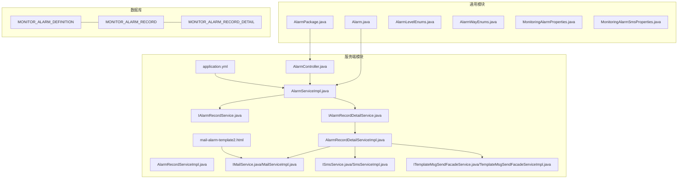
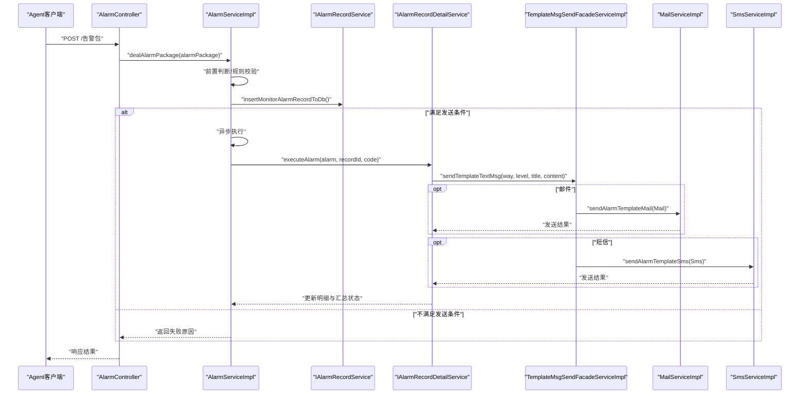
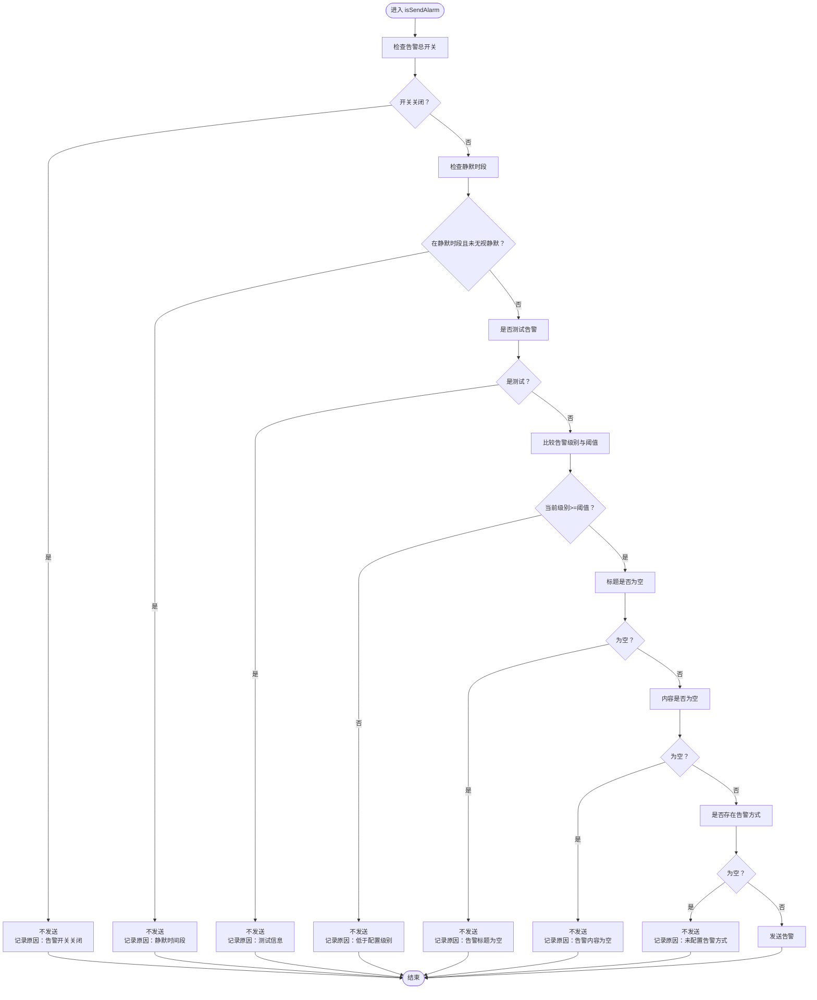
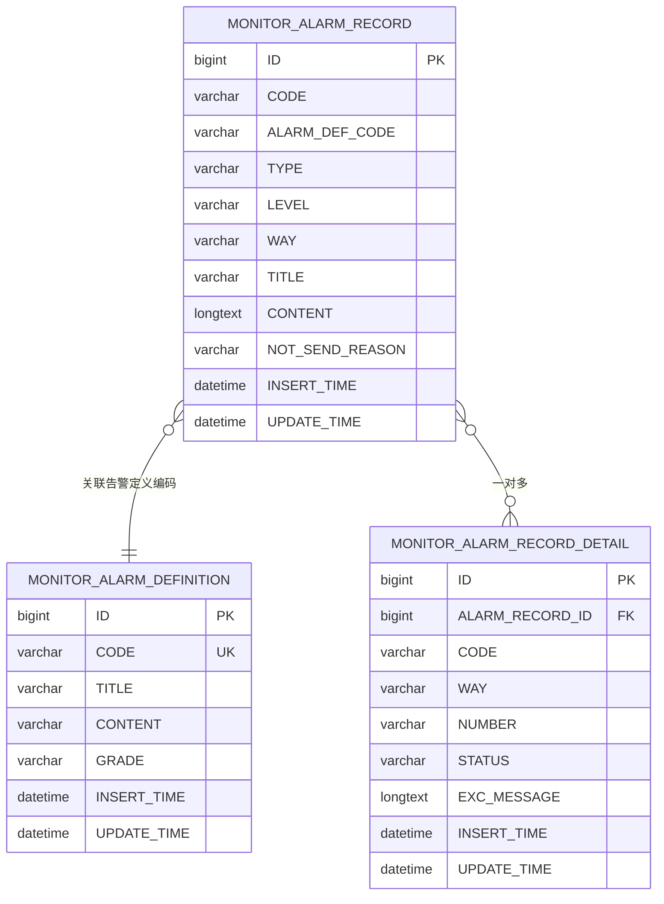
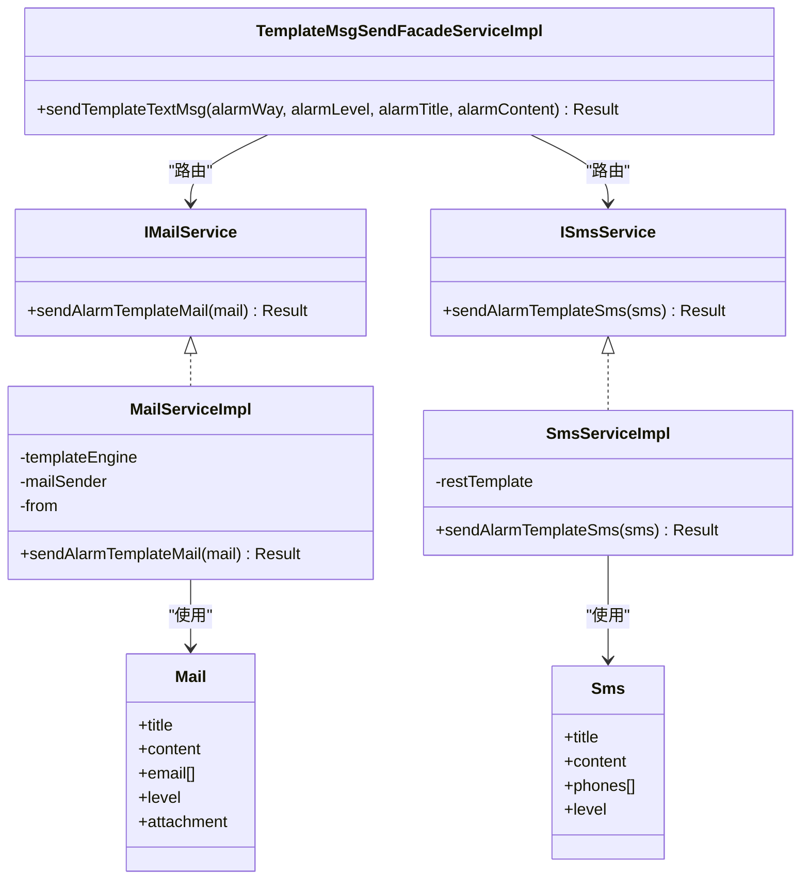
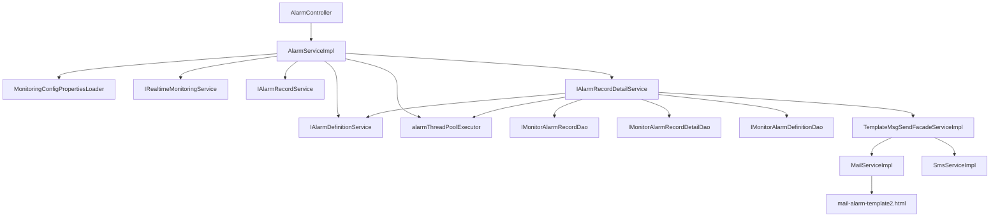

# 告警系统

<cite>
**本文引用的文件**
- [Alarm.java](file://phoenix-common\phoenix-common-core\src\main\java\com\gitee\pifeng\monitoring\common\domain\Alarm.java)
- [AlarmPackage.java](file://phoenix-common\phoenix-common-core\src\main\java\com\gitee\pifeng\monitoring\common\dto\AlarmPackage.java)
- [AlarmLevelEnums.java](file://phoenix-common\phoenix-common-core\src\main\java\com\gitee\pifeng\monitoring\common\constant\alarm\AlarmLevelEnums.java)
- [AlarmWayEnums.java](file://phoenix-common\phoenix-common-core\src\main\java\com\gitee\pifeng\monitoring\common\constant\alarm\AlarmWayEnums.java)
- [MonitoringAlarmProperties.java](file://phoenix-common\phoenix-common-core\src\main\java\com\gitee\pifeng\monitoring\common\property\server\MonitoringAlarmProperties.java)
- [MonitoringAlarmSmsProperties.java](file://phoenix-common\phoenix-common-core\src\main\java\com\gitee\pifeng\monitoring\common\property\server\MonitoringAlarmSmsProperties.java)
- [Mail.java](file://phoenix-server\src\main\java\com\gitee\pifeng\monitoring\server\business\server\domain\Mail.java)
- [Sms.java](file://phoenix-server\src\main\java\com\gitee\pifeng\monitoring\server\business\server\domain\Sms.java)
- [AlarmController.java](file://phoenix-server\src\main\java\com\gitee\pifeng\monitoring\server\business\server\controller\AlarmController.java)
- [AlarmServiceImpl.java](file://phoenix-server\src\main\java\com\gitee\pifeng\monitoring\server\business\server\service\impl\AlarmServiceImpl.java)
- [IAlarmRecordService.java](file://phoenix-server\src\main\java\com\gitee\pifeng\monitoring\server\business\server\service\IAlarmRecordService.java)
- [AlarmRecordServiceImpl.java](file://phoenix-server\src\main\java\com\gitee\pifeng\monitoring\server\business\server\service\impl\AlarmRecordServiceImpl.java)
- [IAlarmRecordDetailService.java](file://phoenix-server\src\main\java\com\gitee\pifeng\monitoring\server\business\server\service\IAlarmRecordDetailService.java)
- [AlarmRecordDetailServiceImpl.java](file://phoenix-server\src\main\java\com\gitee\pifeng\monitoring\server\business\server\service\impl\AlarmRecordDetailServiceImpl.java)
- [IMailService.java](file://phoenix-server\src\main\java\com\gitee\pifeng\monitoring\server\business\server\service\IMailService.java)
- [MailServiceImpl.java](file://phoenix-server\src\main\java\com\gitee\pifeng\monitoring\server\business\server\service\impl\MailServiceImpl.java)
- [ISmsService.java](file://phoenix-server\src\main\java\com\gitee\pifeng\monitoring\server\business\server\service\ISmsService.java)
- [SmsServiceImpl.java](file://phoenix-server\src\main\java\com\gitee\pifeng\monitoring\server\business\server\service\impl\SmsServiceImpl.java)
- [ITemplateMsgSendFacadeService.java](file://phoenix-server\src\main\java\com\gitee\pifeng\monitoring\server\business\server\service\ITemplateMsgSendFacadeService.java)
- [TemplateMsgSendFacadeServiceImpl.java](file://phoenix-server\src\main\java\com\gitee\pifeng\monitoring\server\business\server\service\impl\TemplateMsgSendFacadeServiceImpl.java)
- [application.yml](file://phoenix-server\src\main\resources\application.yml)
- [mail-alarm-template2.html](file://phoenix-server\src\main\resources\templates\mail\mail-alarm-template2.html)
- [phoenix.sql](file://doc\数据库设计\sql\mysql\phoenix.sql)
</cite>

## 目录
1. [简介](#简介)
2. [项目结构](#项目结构)
3. [核心组件](#核心组件)
4. [架构总览](#架构总览)
5. [详细组件分析](#详细组件分析)
6. [依赖分析](#依赖分析)
7. [性能考量](#性能考量)
8. [故障排查指南](#故障排查指南)
9. [结论](#结论)
10. [附录](#附录)

## 简介
本文件面向告警系统的使用者与维护者，系统性阐述告警系统的完整实现，包括告警规则定义、告警触发机制、告警通知发送、告警记录管理、配置管理、扩展机制以及性能优化与调试方法。文档以代码为依据，结合数据库表结构与配置文件，帮助读者快速理解并高效运维该告警体系。

## 项目结构
告警系统由三部分组成：
- 通用模块（phoenix-common）：定义告警领域模型、常量枚举、配置属性与DTO。
- 服务端模块（phoenix-server）：接收告警包、判定是否发送、异步执行发送、落库记录与明细。
- UI模块（phoenix-ui）：提供告警定义、告警记录查看与配置管理界面（本文件聚焦服务端实现与数据库结构）。

图表来源
- [Alarm.java:1-117](file://phoenix-common\phoenix-common-core\src\main\java\com\gitee\pifeng\monitoring\common\domain\Alarm.java#L1-L117)
- [AlarmPackage.java](file://phoenix-common\phoenix-common-core\src\main\java\com\gitee\pifeng\monitoring\common\dto\AlarmPackage.java)
- [AlarmLevelEnums.java:1-118](file://phoenix-common\phoenix-common-core\src\main\java\com\gitee\pifeng\monitoring\common\constant\alarm\AlarmLevelEnums.java#L1-L118)
- [AlarmWayEnums.java:1-94](file://phoenix-common\phoenix-common-core\src\main\java\com\gitee\pifeng\monitoring\common\constant\alarm\AlarmWayEnums.java#L1-L94)
- [MonitoringAlarmProperties.java:1-66](file://phoenix-common\phoenix-common-core\src\main\java\com\gitee\pifeng\monitoring\common\property\server\MonitoringAlarmProperties.java#L1-L66)
- [MonitoringAlarmSmsProperties.java:1-43](file://phoenix-common\phoenix-common-core\src\main\java\com\gitee\pifeng\monitoring\common\property\server\MonitoringAlarmSmsProperties.java#L1-L43)
- [AlarmController.java:65-77](file://phoenix-server\src\main\java\com\gitee\pifeng\monitoring\server\business\server\controller\AlarmController.java#L65-L77)
- [AlarmServiceImpl.java:1-304](file://phoenix-server\src\main\java\com\gitee\pifeng\monitoring\server\business\server\service\impl\AlarmServiceImpl.java#L1-L304)
- [IAlarmRecordService.java:1-58](file://phoenix-server\src\main\java\com\gitee\pifeng\monitoring\server\business\server\service\IAlarmRecordService.java#L1-L58)
- [AlarmRecordServiceImpl.java:1-31](file://phoenix-server\src\main\java\com\gitee\pifeng\monitoring\server\business\server\service\impl\AlarmRecordServiceImpl.java#L1-L31)
- [IAlarmRecordDetailService.java:1-34](file://phoenix-server\src\main\java\com\gitee\pifeng\monitoring\server\business\server\service\IAlarmRecordDetailService.java#L1-L34)
- [AlarmRecordDetailServiceImpl.java:113-138](file://phoenix-server\src\main\java\com\gitee\pifeng\monitoring\server\business\server\service\impl\AlarmRecordDetailServiceImpl.java#L113-L138)
- [IMailService.java](file://phoenix-server\src\main\java\com\gitee\pifeng\monitoring\server\business\server\service\IMailService.java)
- [MailServiceImpl.java:1-89](file://phoenix-server\src\main\java\com\gitee\pifeng\monitoring\server\business\server\service\impl\MailServiceImpl.java#L1-L89)
- [ISmsService.java:1-28](file://phoenix-server\src\main\java\com\gitee\pifeng\monitoring\server\business\server\service\ISmsService.java#L1-L28)
- [SmsServiceImpl.java:35-71](file://phoenix-server\src\main\java\com\gitee\pifeng\monitoring\server\business\server\service\impl\SmsServiceImpl.java#L35-L71)
- [ITemplateMsgSendFacadeService.java](file://phoenix-server\src\main\java\com\gitee\pifeng\monitoring\server\business\server\service\ITemplateMsgSendFacadeService.java)
- [TemplateMsgSendFacadeServiceImpl.java:1-71](file://phoenix-server\src\main\java\com\gitee\pifeng\monitoring\server\business\server\service\impl\TemplateMsgSendFacadeServiceImpl.java#L1-L71)
- [application.yml:1-271](file://phoenix-server\src\main\resources\application.yml#L1-L271)
- [mail-alarm-template2.html:1-13](file://phoenix-server\src\main\resources\templates\mail\mail-alarm-template2.html#L1-L13)
- [phoenix.sql:26-89](file://doc\数据库设计\sql\mysql\phoenix.sql#L26-L89)

章节来源
- [Alarm.java:1-117](file://phoenix-common\phoenix-common-core\src\main\java\com\gitee\pifeng\monitoring\common\domain\Alarm.java#L1-L117)
- [AlarmPackage.java](file://phoenix-common\phoenix-common-core\src\main\java\com\gitee\pifeng\monitoring\common\dto\AlarmPackage.java)
- [AlarmLevelEnums.java:1-118](file://phoenix-common\phoenix-common-core\src\main\java\com\gitee\pifeng\monitoring\common\constant\alarm\AlarmLevelEnums.java#L1-L118)
- [AlarmWayEnums.java:1-94](file://phoenix-common\phoenix-common-core\src\main\java\com\gitee\pifeng\monitoring\common\constant\alarm\AlarmWayEnums.java#L1-L94)
- [MonitoringAlarmProperties.java:1-66](file://phoenix-common\phoenix-common-core\src\main\java\com\gitee\pifeng\monitoring\common\property\server\MonitoringAlarmProperties.java#L1-L66)
- [MonitoringAlarmSmsProperties.java:1-43](file://phoenix-common\phoenix-common-core\src\main\java\com\gitee\pifeng\monitoring\common\property\server\MonitoringAlarmSmsProperties.java#L1-L43)
- [AlarmController.java:65-77](file://phoenix-server\src\main\java\com\gitee\pifeng\monitoring\server\business\server\controller\AlarmController.java#L65-L77)
- [AlarmServiceImpl.java:1-304](file://phoenix-server\src\main\java\com\gitee\pifeng\monitoring\server\business\server\service\impl\AlarmServiceImpl.java#L1-L304)
- [application.yml:1-271](file://phoenix-server\src\main\resources\application.yml#L1-L271)

## 核心组件
- 告警领域模型与常量
  - 告警实体：包含告警级别、原因、监控类型、字符集、是否测试、标题、内容、编码、被告警主体ID、是否无视静默等字段。
  - 告警级别枚举：定义 IGNORE/INFO/WARN/ERROR/FATAL 的比较规则。
  - 告警方式枚举：定义 SMS/MAIL 等告警方式。
- 告警配置属性
  - 告警总开关、告警级别阈值、静默时段、告警方式集合、短信/邮件配置。
- 控制器与服务
  - 告警控制器接收告警包，调用服务处理。
  - 告警服务负责前置判断、规则校验、异步发送、落库记录与明细。
  - 邮件/短信服务负责模板渲染与发送。
  - 模板消息门面服务根据告警方式路由到具体发送实现。
- 数据库表
  - 告警定义表：存储告警编码、级别、标题、内容。
  - 告警记录表：存储告警代码、类型、级别、方式、标题、内容、不发送原因等。
  - 告警记录明细表：按告警方式记录发送状态与异常信息。

章节来源
- [Alarm.java:1-117](file://phoenix-common\phoenix-common-core\src\main\java\com\gitee\pifeng\monitoring\common\domain\Alarm.java#L1-L117)
- [AlarmLevelEnums.java:1-118](file://phoenix-common\phoenix-common-core\src\main\java\com\gitee\pifeng\monitoring\common\constant\alarm\AlarmLevelEnums.java#L1-L118)
- [AlarmWayEnums.java:1-94](file://phoenix-common\phoenix-common-core\src\main\java\com\gitee\pifeng\monitoring\common\constant\alarm\AlarmWayEnums.java#L1-L94)
- [MonitoringAlarmProperties.java:1-66](file://phoenix-common\phoenix-common-core\src\main\java\com\gitee\pifeng\monitoring\common\property\server\MonitoringAlarmProperties.java#L1-L66)
- [MonitoringAlarmSmsProperties.java:1-43](file://phoenix-common\phoenix-common-core\src\main\java\com\gitee\pifeng\monitoring\common\property\server\MonitoringAlarmSmsProperties.java#L1-L43)
- [AlarmController.java:65-77](file://phoenix-server\src\main\java\com\gitee\pifeng\monitoring\server\business\server\controller\AlarmController.java#L65-L77)
- [AlarmServiceImpl.java:1-304](file://phoenix-server\src\main\java\com\gitee\pifeng\monitoring\server\business\server\service\impl\AlarmServiceImpl.java#L1-L304)
- [MailServiceImpl.java:1-89](file://phoenix-server\src\main\java\com\gitee\pifeng\monitoring\server\business\server\service\impl\MailServiceImpl.java#L1-L89)
- [SmsServiceImpl.java:35-71](file://phoenix-server\src\main\java\com\gitee\pifeng\monitoring\server\business\server\service\impl\SmsServiceImpl.java#L35-L71)
- [TemplateMsgSendFacadeServiceImpl.java:1-71](file://phoenix-server\src\main\java\com\gitee\pifeng\monitoring\server\business\server\service\impl\TemplateMsgSendFacadeServiceImpl.java#L1-L71)
- [phoenix.sql:26-89](file://doc\数据库设计\sql\mysql\phoenix.sql#L26-L89)

## 架构总览
告警处理流程分为“接收—判定—记录—异步发送—明细落库—状态回填”。系统通过配置属性控制告警开关、级别阈值、静默时段与告警方式集合；通过门面服务统一调度邮件/短信发送；通过数据库表实现历史记录与状态追踪。

图表来源
- [AlarmController.java:65-77](file://phoenix-server\src\main\java\com\gitee\pifeng\monitoring\server\business\server\controller\AlarmController.java#L65-L77)
- [AlarmServiceImpl.java:86-170](file://phoenix-server\src\main\java\com\gitee\pifeng\monitoring\server\business\server\service\impl\AlarmServiceImpl.java#L86-L170)
- [IAlarmRecordService.java:1-58](file://phoenix-server\src\main\java\com\gitee\pifeng\monitoring\server\business\server\service\IAlarmRecordService.java#L1-L58)
- [IAlarmRecordDetailService.java:1-34](file://phoenix-server\src\main\java\com\gitee\pifeng\monitoring\server\business\server\service\IAlarmRecordDetailService.java#L1-L34)
- [TemplateMsgSendFacadeServiceImpl.java:57-71](file://phoenix-server\src\main\java\com\gitee\pifeng\monitoring\server\business\server\service\impl\TemplateMsgSendFacadeServiceImpl.java#L57-L71)
- [MailServiceImpl.java:58-87](file://phoenix-server\src\main\java\com\gitee\pifeng\monitoring\server\business\server\service\impl\MailServiceImpl.java#L58-L87)
- [SmsServiceImpl.java:48-58](file://phoenix-server\src\main\java\com\gitee\pifeng\monitoring\server\business\server\service\impl\SmsServiceImpl.java#L48-L58)

## 详细组件分析

### 告警规则与判定
- 规则入口：服务端接收告警包后，先进行前置判断，再依次校验开关、静默时段、是否测试、级别阈值、标题/内容、告警方式等。
- 自定义业务告警：若监控类型为自定义且携带告警编码，则从告警定义表读取级别、标题、内容覆盖原始值。
- 异步发送：满足条件后，将发送动作放入线程池异步执行，避免阻塞主流程。

图表来源
- [AlarmServiceImpl.java:206-284](file://phoenix-server\src\main\java\com\gitee\pifeng\monitoring\server\business\server\service\impl\AlarmServiceImpl.java#L206-L284)

章节来源
- [AlarmServiceImpl.java:86-170](file://phoenix-server\src\main\java\com\gitee\pifeng\monitoring\server\business\server\service\impl\AlarmServiceImpl.java#L86-L170)
- [AlarmLevelEnums.java:51-81](file://phoenix-common\phoenix-common-core\src\main\java\com\gitee\pifeng\monitoring\common\constant\alarm\AlarmLevelEnums.java#L51-L81)

### 告警记录与明细
- 告警记录表：存储告警代码、类型、级别、方式、标题、内容、不发送原因等。
- 告警记录明细表：按告警方式记录发送状态、异常信息、接收人号码等。
- 插入策略：在判定发送前即插入记录；发送完成后更新明细与汇总状态。

图表来源
- [phoenix.sql:26-89](file://doc\数据库设计\sql\mysql\phoenix.sql#L26-L89)

章节来源
- [IAlarmRecordService.java:1-58](file://phoenix-server\src\main\java\com\gitee\pifeng\monitoring\server\business\server\service\IAlarmRecordService.java#L1-L58)
- [AlarmRecordServiceImpl.java:1-31](file://phoenix-server\src\main\java\com\gitee\pifeng\monitoring\server\business\server\service\impl\AlarmRecordServiceImpl.java#L1-L31)
- [IAlarmRecordDetailService.java:1-34](file://phoenix-server\src\main\java\com\gitee\pifeng\monitoring\server\business\server\service\IAlarmRecordDetailService.java#L1-L34)
- [AlarmRecordDetailServiceImpl.java:113-138](file://phoenix-server\src\main\java\com\gitee\pifeng\monitoring\server\business\server\service\impl\AlarmRecordDetailServiceImpl.java#L113-L138)

### 通知发送实现
- 邮件告警
  - 使用 Thymeleaf 模板引擎渲染 HTML 模板，支持附件变量注入。
  - 通过 JavaMailSender 发送，模板路径为 mail-alarm-template2.html。
- 短信告警
  - 通过门面服务根据告警方式路由到短信实现。
  - 短信接口企业枚举与协议类型可配置，当前实现封装了特定厂商接口调用。
- 门面服务
  - 统一根据告警方式构建短信/邮件实体，调用对应服务发送。

图表来源
- [TemplateMsgSendFacadeServiceImpl.java:57-71](file://phoenix-server\src\main\java\com\gitee\pifeng\monitoring\server\business\server\service\impl\TemplateMsgSendFacadeServiceImpl.java#L57-L71)
- [IMailService.java](file://phoenix-server\src\main\java\com\gitee\pifeng\monitoring\server\business\server\service\IMailService.java)
- [MailServiceImpl.java:58-87](file://phoenix-server\src\main\java\com\gitee\pifeng\monitoring\server\business\server\service\impl\MailServiceImpl.java#L58-L87)
- [ISmsService.java:1-28](file://phoenix-server\src\main\java\com\gitee\pifeng\monitoring\server\business\server\service\ISmsService.java#L1-L28)
- [SmsServiceImpl.java:48-58](file://phoenix-server\src\main\java\com\gitee\pifeng\monitoring\server\business\server\service\impl\SmsServiceImpl.java#L48-L58)
- [Mail.java:1-50](file://phoenix-server\src\main\java\com\gitee\pifeng\monitoring\server\business\server\domain\Mail.java#L1-L50)
- [Sms.java:1-42](file://phoenix-server\src\main\java\com\gitee\pifeng\monitoring\server\business\server\domain\Sms.java#L1-L42)

章节来源
- [MailServiceImpl.java:58-87](file://phoenix-server\src\main\java\com\gitee\pifeng\monitoring\server\business\server\service\impl\MailServiceImpl.java#L58-L87)
- [SmsServiceImpl.java:48-58](file://phoenix-server\src\main\java\com\gitee\pifeng\monitoring\server\business\server\service\impl\SmsServiceImpl.java#L48-L58)
- [TemplateMsgSendFacadeServiceImpl.java:57-71](file://phoenix-server\src\main\java\com\gitee\pifeng\monitoring\server\business\server\service\impl\TemplateMsgSendFacadeServiceImpl.java#L57-L71)
- [mail-alarm-template2.html:1-13](file://phoenix-server\src\main\resources\templates\mail\mail-alarm-template2.html#L1-L13)

### 配置管理
- 告警配置属性
  - enable：告警总开关
  - levelEnum：告警级别阈值
  - silenceEnable/silenceStartTime/silenceEndTime：静默时段
  - wayEnums：告警方式集合（如 SMS/MAIL）
  - smsProperties/mailProperties：短信/邮件配置项
- 应用配置
  - Spring Boot YAML 中包含邮件发送所需 spring.mail.username 等基础配置。
  - Thymeleaf 模板路径与编码设置。

章节来源
- [MonitoringAlarmProperties.java:1-66](file://phoenix-common\phoenix-common-core\src\main\java\com\gitee\pifeng\monitoring\common\property\server\MonitoringAlarmProperties.java#L1-L66)
- [MonitoringAlarmSmsProperties.java:1-43](file://phoenix-common\phoenix-common-core\src\main\java\com\gitee\pifeng\monitoring\common\property\server\MonitoringAlarmSmsProperties.java#L1-L43)
- [application.yml:1-271](file://phoenix-server\src\main\resources\application.yml#L1-L271)

### 扩展机制
- 新增告警方式
  - 在告警方式枚举中新增枚举值。
  - 在门面服务中增加路由分支，构造对应实体并调用新服务实现。
  - 在短信/邮件服务中实现具体发送逻辑。
  - 在告警配置中加入对应的企业/协议等属性。
- 自定义告警逻辑
  - 可通过自定义业务告警编码，从告警定义表读取级别、标题、内容，实现统一管理与覆盖。

章节来源
- [AlarmWayEnums.java:16-26](file://phoenix-common\phoenix-common-core\src\main\java\com\gitee\pifeng\monitoring\common\constant\alarm\AlarmWayEnums.java#L16-L26)
- [TemplateMsgSendFacadeServiceImpl.java:57-71](file://phoenix-server\src\main\java\com\gitee\pifeng\monitoring\server\business\server\service\impl\TemplateMsgSendFacadeServiceImpl.java#L57-L71)
- [Alarm.java:104-114](file://phoenix-common\phoenix-common-core\src\main\java\com\gitee\pifeng\monitoring\common\domain\Alarm.java#L104-L114)
- [phoenix.sql:26-37](file://doc\数据库设计\sql\mysql\phoenix.sql#L26-L37)

## 依赖分析
- 组件耦合
  - AlarmController 仅负责接收与响应，业务逻辑集中在 AlarmServiceImpl。
  - AlarmServiceImpl 依赖配置加载器、实时监控服务、告警定义/记录/明细服务与线程池。
  - 门面服务解耦不同通知渠道，便于扩展。
- 外部依赖
  - Spring Mail、Thymeleaf、RestTemplate、Quartz、MyBatis-Plus、Druid 等。

图表来源
- [AlarmController.java:65-77](file://phoenix-server\src\main\java\com\gitee\pifeng\monitoring\server\business\server\controller\AlarmController.java#L65-L77)
- [AlarmServiceImpl.java:35-74](file://phoenix-server\src\main\java\com\gitee\pifeng\monitoring\server\business\server\service\impl\AlarmServiceImpl.java#L35-L74)
- [IAlarmRecordService.java:1-58](file://phoenix-server\src\main\java\com\gitee\pifeng\monitoring\server\business\server\service\IAlarmRecordService.java#L1-L58)
- [IAlarmRecordDetailService.java:1-34](file://phoenix-server\src\main\java\com\gitee\pifeng\monitoring\server\business\server\service\IAlarmRecordDetailService.java#L1-L34)
- [TemplateMsgSendFacadeServiceImpl.java:23-42](file://phoenix-server\src\main\java\com\gitee\pifeng\monitoring\server\business\server\service\impl\TemplateMsgSendFacadeServiceImpl.java#L23-L42)
- [MailServiceImpl.java:26-46](file://phoenix-server\src\main\java\com\gitee\pifeng\monitoring\server\business\server\service\impl\MailServiceImpl.java#L26-L46)
- [SmsServiceImpl.java:35-58](file://phoenix-server\src\main\java\com\gitee\pifeng\monitoring\server\business\server\service\impl\SmsServiceImpl.java#L35-L58)
- [mail-alarm-template2.html:1-13](file://phoenix-server\src\main\resources\templates\mail\mail-alarm-template2.html#L1-L13)

章节来源
- [AlarmServiceImpl.java:35-74](file://phoenix-server\src\main\java\com\gitee\pifeng\monitoring\server\business\server\service\impl\AlarmServiceImpl.java#L35-L74)

## 性能考量
- 告警去重与前置判断：在处理前调用实时监控服务进行前置判断，减少无效发送。
- 异步通知：满足条件后将发送动作提交至线程池异步执行，避免阻塞主流程。
- 线程池与事务：在事务提交后异步执行，确保数据一致性与吞吐。
- 配置优化：通过 YAML 设置 Undertow、Quartz、Druid、Thymeleaf 等参数，保障高并发下的稳定性与可观测性。

章节来源
- [AlarmServiceImpl.java:105-170](file://phoenix-server\src\main\java\com\gitee\pifeng\monitoring\server\business\server\service\impl\AlarmServiceImpl.java#L105-L170)
- [application.yml:1-271](file://phoenix-server\src\main\resources\application.yml#L1-L271)

## 故障排查指南
- 常见不发送原因
  - 告警开关关闭、静默时间段、测试告警、级别低于阈值、标题/内容为空、未配置告警方式。
- 记录与定位
  - 告警记录表包含 not_send_reason 字段，便于快速定位原因。
  - 告警记录明细表记录各方式发送状态与异常信息，便于逐项排查。
- 日志与模板
  - 邮件模板路径与 Thymeleaf 配置需正确，避免模板渲染失败。
  - 关注控制器耗时日志，及时发现处理瓶颈。

章节来源
- [IAlarmRecordService.java:33-43](file://phoenix-server\src\main\java\com\gitee\pifeng\monitoring\server\business\server\service\IAlarmRecordService.java#L33-L43)
- [AlarmServiceImpl.java:206-284](file://phoenix-server\src\main\java\com\gitee\pifeng\monitoring\server\business\server\service\impl\AlarmServiceImpl.java#L206-L284)
- [AlarmController.java:65-77](file://phoenix-server\src\main\java\com\gitee\pifeng\monitoring\server\business\server\controller\AlarmController.java#L65-L77)
- [mail-alarm-template2.html:1-13](file://phoenix-server\src\main\resources\templates\mail\mail-alarm-template2.html#L1-L13)

## 结论
该告警系统以清晰的职责划分与可扩展的门面设计实现了“接收—判定—记录—异步发送”的完整闭环。通过数据库表实现历史与状态的可追溯，通过配置属性实现灵活的规则控制。建议在生产环境中结合日志与指标监控，持续优化线程池与数据库连接池参数，确保高并发场景下的稳定与高效。

## 附录
- 告警定义表字段说明
  - CODE：告警编码（唯一）
  - TITLE：告警标题
  - CONTENT：告警内容
  - GRADE：告警级别（INFO/WARN/ERROR/FATAL）
- 告警记录表字段说明
  - CODE：告警代码（UUID）
  - ALARM_DEF_CODE：告警定义编码
  - TYPE：告警类型
  - LEVEL：告警级别
  - WAY：告警方式集合（逗号分隔）
  - TITLE/CONTENT：标题与内容
  - NOT_SEND_REASON：不发送原因
- 告警记录明细表字段说明
  - ALARM_RECORD_ID：告警记录主键
  - CODE：告警代码（UUID）
  - WAY：告警方式（SMS/MAIL）
  - NUMBER：接收人号码（手机号/邮箱）
  - STATUS：发送状态（0/1）
  - EXC_MESSAGE：异常信息
  - INSERT_TIME/UPDATE_TIME：插入与更新时间

章节来源
- [phoenix.sql:26-89](file://doc\数据库设计\sql\mysql\phoenix.sql#L26-L89)