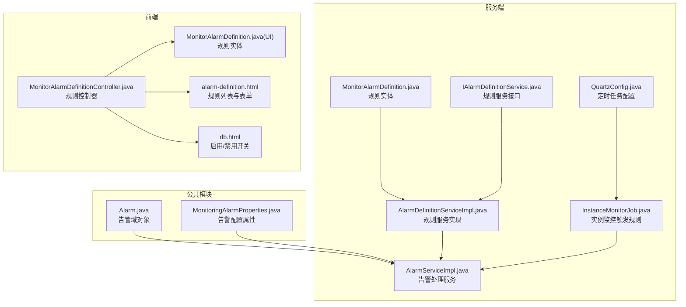
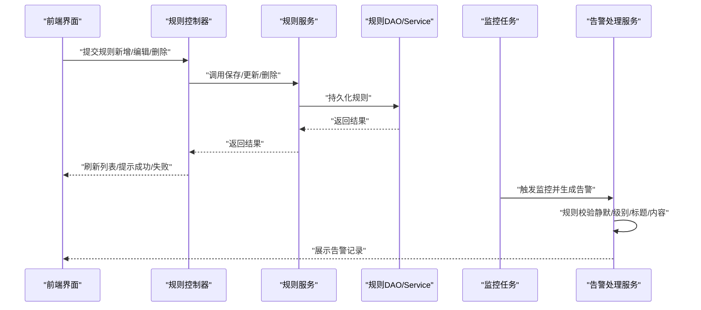
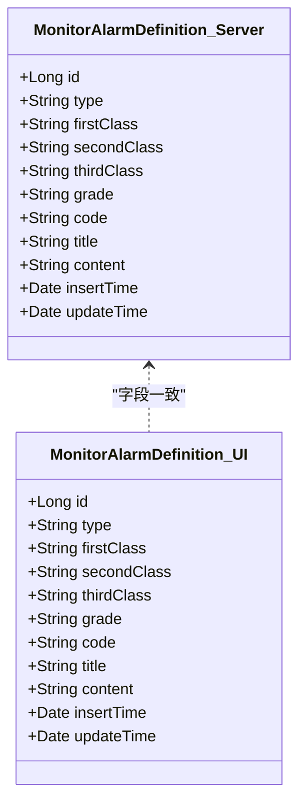
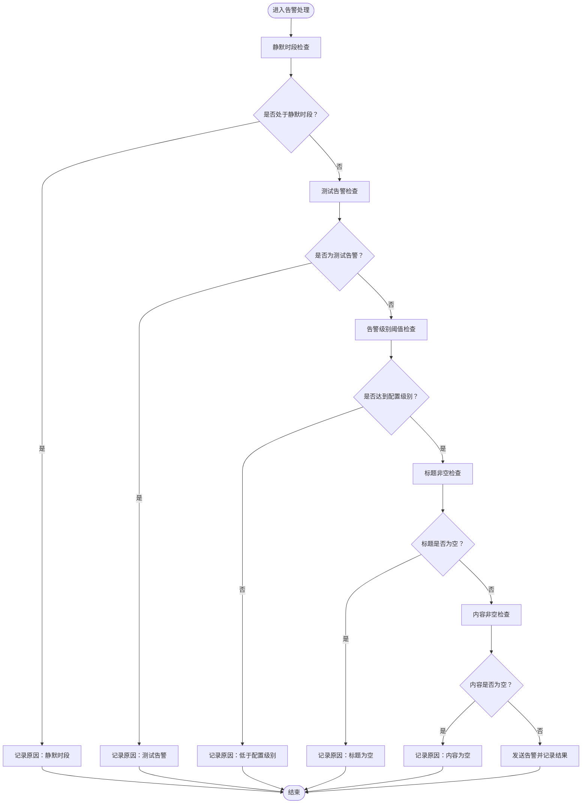
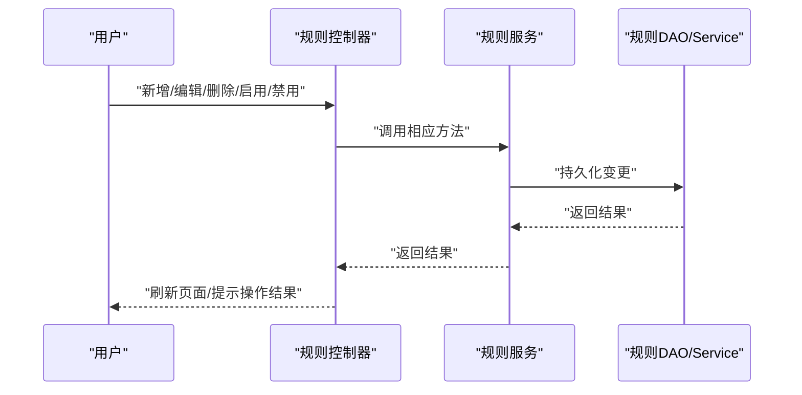
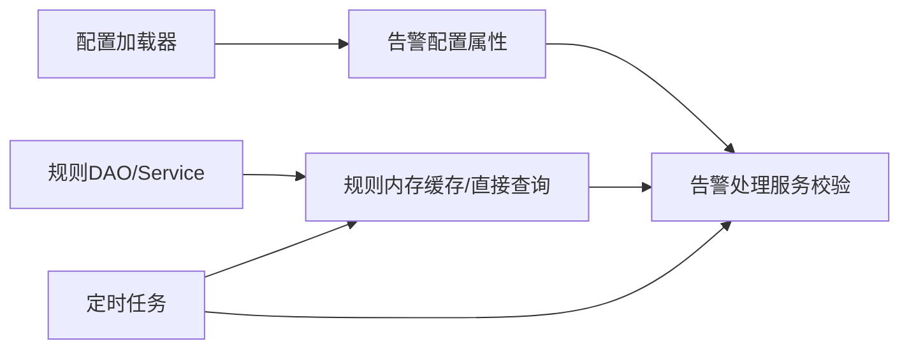
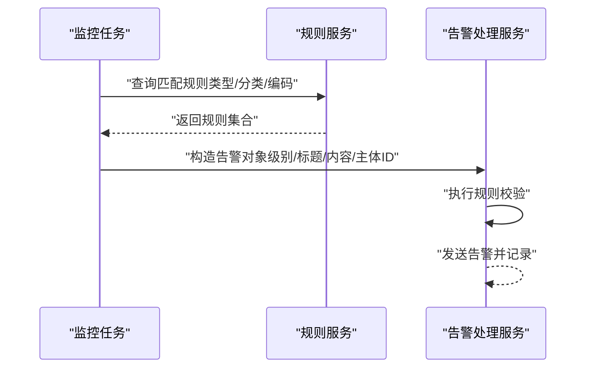
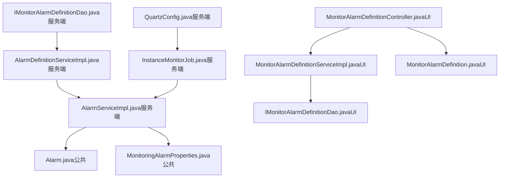

# 告警规则管理

<cite>
**本文引用的文件**
- [Alarm.java](file://phoenix-common/phoenix-common-core/src/main/java/com/gitee/pifeng/monitoring/common/domain/Alarm.java)
- [MonitoringAlarmProperties.java](file://phoenix-common/phoenix-common-core/src/main/java/com/gitee/pifeng/monitoring/common/property/server/MonitoringAlarmProperties.java)
- [Alarm.java](file://phoenix-server/src/main/java/com/gitee/pifeng/monitoring/server/business/server/entity/Alarm.java)
- [MonitorAlarmDefinition.java（服务端）](file://phoenix-server/src/main/java/com/gitee/pifeng/monitoring/server/business/server/entity/MonitorAlarmDefinition.java)
- [IMonitorAlarmDefinitionDao.java（服务端）](file://phoenix-server/src/main/java/com/gitee/pifeng/monitoring/server/business/server/dao/IMonitorAlarmDefinitionDao.java)
- [IAlarmDefinitionService.java（服务端）](file://phoenix-server/src/main/java/com/gitee/pifeng/monitoring/server/business/server/service/IAlarmDefinitionService.java)
- [AlarmDefinitionServiceImpl.java（服务端）](file://phoenix-server/src/main/java/com/gitee/pifeng/monitoring/server/business/server/service/impl/AlarmDefinitionServiceImpl.java)
- [AlarmServiceImpl.java（服务端）](file://phoenix-server/src/main/java/com/gitee/pifeng/monitoring/server/business/server/service/impl/AlarmServiceImpl.java)
- [InstanceMonitorJob.java（服务端）](file://phoenix-server/src/main/java/com/gitee/pifeng/monitoring/server/business/server/monitor/instance/InstanceMonitorJob.java)
- [QuartzConfig.java（服务端）](file://phoenix-server/src/main/java/com/gitee/pifeng/monitoring/server/config/QuartzConfig.java)
- [MonitorAlarmDefinition.java（UI）](file://phoenix-ui/src/main/java/com/gitee/pifeng/monitoring/ui/business/web/entity/MonitorAlarmDefinition.java)
- [IMonitorAlarmDefinitionDao.java（UI）](file://phoenix-ui/src/main/java/com/gitee/pifeng/monitoring/ui/business/web/dao/IMonitorAlarmDefinitionDao.java)
- [IMonitorAlarmDefinitionService.java（UI）](file://phoenix-ui/src/main/java/com/gitee/pifeng/monitoring/ui/business/web/service/IMonitorAlarmDefinitionService.java)
- [MonitorAlarmDefinitionServiceImpl.java（UI）](file://phoenix-ui/src/main/java/com/gitee/pifeng/monitoring/ui/business/web/service/impl/MonitorAlarmDefinitionServiceImpl.java)
- [MonitorAlarmDefinitionController.java（UI）](file://phoenix-ui/src/main/java/com/gitee/pifeng/monitoring/ui/business/web/controller/MonitorAlarmDefinitionController.java)
- [phoenix.sql（数据库脚本）](file://doc/数据库设计/sql/mysql/phoenix.sql)
- [alarm-definition.html（前端模板）](file://phoenix-ui/src/main/resources/templates/set/alarm-definition.html)
- [db.html（前端模板）](file://phoenix-ui/src/main/resources/templates/db/db.html)
</cite>

## 目录
1. [简介](#简介)
2. [项目结构](#项目结构)
3. [核心组件](#核心组件)
4. [架构总览](#架构总览)
5. [组件详解](#组件详解)
6. [依赖关系分析](#依赖关系分析)
7. [性能考量](#性能考量)
8. [故障排查指南](#故障排查指南)
9. [结论](#结论)
10. [附录](#附录)

## 简介
本技术文档围绕“告警规则管理”功能展开，系统性阐述告警规则的数据模型、配置机制、生命周期管理、分类体系、动态配置与热更新能力，并结合监控指标与告警规则的映射关系，给出配置示例与最佳实践。目标读者既包括后端开发工程师，也包括需要理解告警规则配置与运维的非技术读者。

## 项目结构
告警规则管理涉及三层：公共领域模型（common）、服务端（server）、前端（UI）。其中：
- 公共模块定义通用的告警域对象与配置属性；
- 服务端负责规则持久化、规则校验与告警触发；
- UI 提供规则的增删改查与批量操作界面。

图表来源
- [Alarm.java:1-117](file://phoenix-common/phoenix-common-core/src/main/java/com/gitee/pifeng/monitoring/common/domain/Alarm.java#L1-L117)
- [MonitoringAlarmProperties.java:1-65](file://phoenix-common/phoenix-common-core/src/main/java/com/gitee/pifeng/monitoring/common/property/server/MonitoringAlarmProperties.java#L1-L65)
- [MonitorAlarmDefinition.java（服务端）:1-95](file://phoenix-server/src/main/java/com/gitee/pifeng/monitoring/server/business/server/entity/MonitorAlarmDefinition.java#L1-L95)
- [IAlarmDefinitionService.java（服务端）:1-15](file://phoenix-server/src/main/java/com/gitee/pifeng/monitoring/server/business/server/service/IAlarmDefinitionService.java#L1-L15)
- [AlarmDefinitionServiceImpl.java（服务端）:1-19](file://phoenix-server/src/main/java/com/gitee/pifeng/monitoring/server/business/server/service/impl/AlarmDefinitionServiceImpl.java#L1-L19)
- [AlarmServiceImpl.java（服务端）:221-269](file://phoenix-server/src/main/java/com/gitee/pifeng/monitoring/server/business/server/service/impl/AlarmServiceImpl.java#L221-L269)
- [InstanceMonitorJob.java（服务端）:384-396](file://phoenix-server/src/main/java/com/gitee/pifeng/monitoring/server/business/server/monitor/instance/InstanceMonitorJob.java#L384-L396)
- [QuartzConfig.java（服务端）:383-398](file://phoenix-server/src/main/java/com/gitee/pifeng/monitoring/server/config/QuartzConfig.java#L383-L398)
- [MonitorAlarmDefinitionController.java（UI）:1-192](file://phoenix-ui/src/main/java/com/gitee/pifeng/monitoring/ui/business/web/controller/MonitorAlarmDefinitionController.java#L1-L192)
- [MonitorAlarmDefinition.java（UI）:1-82](file://phoenix-ui/src/main/java/com/gitee/pifeng/monitoring/ui/business/web/entity/MonitorAlarmDefinition.java#L1-L82)
- [alarm-definition.html（前端模板）:219-256](file://phoenix-ui/src/main/resources/templates/set/alarm-definition.html#L219-L256)
- [db.html（前端模板）:714-739](file://phoenix-ui/src/main/resources/templates/db/db.html#L714-L739)

章节来源
- [MonitorAlarmDefinition.java（服务端）:1-95](file://phoenix-server/src/main/java/com/gitee/pifeng/monitoring/server/business/server/entity/MonitorAlarmDefinition.java#L1-L95)
- [MonitorAlarmDefinition.java（UI）:1-82](file://phoenix-ui/src/main/java/com/gitee/pifeng/monitoring/ui/business/web/entity/MonitorAlarmDefinition.java#L1-L82)
- [MonitorAlarmDefinitionController.java（UI）:1-192](file://phoenix-ui/src/main/java/com/gitee/pifeng/monitoring/ui/business/web/controller/MonitorAlarmDefinitionController.java#L1-L192)

## 核心组件
- 告警域对象：封装告警级别、原因、监控类型、标题、内容、编码、被告警主体ID等关键字段，支持测试告警与字符集设置。
- 规则实体：存储告警规则的类型、分类层级、级别、编码、标题、内容及时间戳。
- 规则服务：提供规则的增删改查与分页查询能力。
- 告警处理服务：负责规则校验（静默时段、测试告警、告警级别阈值、标题/内容非空）、构建告警包并下发。
- 定时任务：通过调度框架按固定周期扫描或触发监控任务，驱动规则生效。
- 前端控制器与模板：提供规则列表、新增、编辑、删除、启用/禁用等交互界面。

章节来源
- [Alarm.java:1-117](file://phoenix-common/phoenix-common-core/src/main/java/com/gitee/pifeng/monitoring/common/domain/Alarm.java#L1-L117)
- [MonitorAlarmDefinition.java（服务端）:1-95](file://phoenix-server/src/main/java/com/gitee/pifeng/monitoring/server/business/server/entity/MonitorAlarmDefinition.java#L1-L95)
- [IAlarmDefinitionService.java（服务端）:1-15](file://phoenix-server/src/main/java/com/gitee/pifeng/monitoring/server/business/server/service/IAlarmDefinitionService.java#L1-L15)
- [AlarmDefinitionServiceImpl.java（服务端）:1-19](file://phoenix-server/src/main/java/com/gitee/pifeng/monitoring/server/business/server/service/impl/AlarmDefinitionServiceImpl.java#L1-L19)
- [AlarmServiceImpl.java（服务端）:221-269](file://phoenix-server/src/main/java/com/gitee/pifeng/monitoring/server/business/server/service/impl/AlarmServiceImpl.java#L221-L269)
- [QuartzConfig.java（服务端）:383-398](file://phoenix-server/src/main/java/com/gitee/pifeng/monitoring/server/config/QuartzConfig.java#L383-L398)
- [MonitorAlarmDefinitionController.java（UI）:1-192](file://phoenix-ui/src/main/java/com/gitee/pifeng/monitoring/ui/business/web/controller/MonitorAlarmDefinitionController.java#L1-L192)

## 架构总览
告警规则管理采用“规则定义—规则校验—规则触发—规则展示”的闭环流程。规则定义由UI完成并通过服务端持久化；规则校验在告警处理阶段进行；规则触发由监控任务驱动；最终通过UI展示与管理。

图表来源
- [MonitorAlarmDefinitionController.java（UI）:144-188](file://phoenix-ui/src/main/java/com/gitee/pifeng/monitoring/ui/business/web/controller/MonitorAlarmDefinitionController.java#L144-L188)
- [AlarmDefinitionServiceImpl.java（服务端）:1-19](file://phoenix-server/src/main/java/com/gitee/pifeng/monitoring/server/business/server/service/impl/AlarmDefinitionServiceImpl.java#L1-L19)
- [AlarmServiceImpl.java（服务端）:221-269](file://phoenix-server/src/main/java/com/gitee/pifeng/monitoring/server/business/server/service/impl/AlarmServiceImpl.java#L221-L269)
- [InstanceMonitorJob.java（服务端）:384-396](file://phoenix-server/src/main/java/com/gitee/pifeng/monitoring/server/business/server/monitor/instance/InstanceMonitorJob.java#L384-L396)

## 组件详解

### 数据模型与分类体系
- 规则实体包含类型、三级分类、告警级别、编码、标题、内容、时间戳等字段，用于描述一条完整的告警规则。
- 分类体系建议采用“监控类型 → 一级分类 → 二级分类 → 三级分类”的层级划分，便于规则检索与治理。
- 系统预设规则与用户自定义规则：
  - 系统预设规则：由平台内置，通常具备默认编码、标题、内容与级别，适用于常见监控场景。
  - 用户自定义规则：由管理员在UI中新增，可覆盖系统默认规则的标题、内容与级别，便于适配业务场景。

图表来源
- [MonitorAlarmDefinition.java（服务端）:1-95](file://phoenix-server/src/main/java/com/gitee/pifeng/monitoring/server/business/server/entity/MonitorAlarmDefinition.java#L1-L95)
- [MonitorAlarmDefinition.java（UI）:1-82](file://phoenix-ui/src/main/java/com/gitee/pifeng/monitoring/ui/business/web/entity/MonitorAlarmDefinition.java#L1-L82)

章节来源
- [MonitorAlarmDefinition.java（服务端）:1-95](file://phoenix-server/src/main/java/com/gitee/pifeng/monitoring/server/business/server/entity/MonitorAlarmDefinition.java#L1-L95)
- [MonitorAlarmDefinition.java（UI）:1-82](file://phoenix-ui/src/main/java/com/gitee/pifeng/monitoring/ui/business/web/entity/MonitorAlarmDefinition.java#L1-L82)

### 规则参数配置与验证逻辑
- 告警配置属性包含：是否启用、告警级别阈值、是否开启静默、静默起止时间、告警方式数组、短信与邮箱配置等。
- 告警处理服务在收到告警包时执行以下校验：
  - 静默时段校验：若当前时间处于静默时段，直接拒绝发送并记录原因。
  - 测试告警校验：测试告警不发送，仅记录原因。
  - 告警级别阈值校验：低于配置级别的告警不发送。
  - 标题与内容非空校验：缺失标题或内容则不发送。
- 以上校验确保告警质量与稳定性，避免无效或骚扰性告警。

图表来源
- [AlarmServiceImpl.java（服务端）:221-269](file://phoenix-server/src/main/java/com/gitee/pifeng/monitoring/server/business/server/service/impl/AlarmServiceImpl.java#L221-L269)

章节来源
- [MonitoringAlarmProperties.java:1-65](file://phoenix-common/phoenix-common-core/src/main/java/com/gitee/pifeng/monitoring/common/property/server/MonitoringAlarmProperties.java#L1-L65)
- [AlarmServiceImpl.java（服务端）:221-269](file://phoenix-server/src/main/java/com/gitee/pifeng/monitoring/server/business/server/service/impl/AlarmServiceImpl.java#L221-L269)

### 生命周期管理
- 创建：通过UI控制器接收规则表单，调用规则服务保存至数据库。
- 修改：编辑规则后提交，服务端更新对应记录。
- 删除：支持单条与批量删除，删除后规则不再参与告警匹配。
- 启用/禁用：通过前端开关控制是否参与告警判定（例如在数据库中增加状态字段并在服务端逻辑中过滤）。

图表来源
- [MonitorAlarmDefinitionController.java（UI）:144-188](file://phoenix-ui/src/main/java/com/gitee/pifeng/monitoring/ui/business/web/controller/MonitorAlarmDefinitionController.java#L144-L188)
- [AlarmDefinitionServiceImpl.java（服务端）:1-19](file://phoenix-server/src/main/java/com/gitee/pifeng/monitoring/server/business/server/service/impl/AlarmDefinitionServiceImpl.java#L1-L19)

章节来源
- [MonitorAlarmDefinitionController.java（UI）:1-192](file://phoenix-ui/src/main/java/com/gitee/pifeng/monitoring/ui/business/web/controller/MonitorAlarmDefinitionController.java#L1-L192)
- [AlarmDefinitionServiceImpl.java（服务端）:1-19](file://phoenix-server/src/main/java/com/gitee/pifeng/monitoring/server/business/server/service/impl/AlarmDefinitionServiceImpl.java#L1-L19)

### 动态配置与热更新
- 规则的热更新：规则实体与服务层均基于MyBatis-Plus实现，新增/修改/删除规则后立即生效，无需重启服务。
- 告警策略的热更新：告警配置属性（如级别阈值、静默时段、告警方式）通过配置加载器注入，可在运行时调整并即时生效。
- 定时任务：通过调度配置按固定周期执行监控任务，保证规则与监控数据的持续匹配。

图表来源
- [MonitoringAlarmProperties.java:1-65](file://phoenix-common/phoenix-common-core/src/main/java/com/gitee/pifeng/monitoring/common/property/server/MonitoringAlarmProperties.java#L1-L65)
- [AlarmServiceImpl.java（服务端）:221-269](file://phoenix-server/src/main/java/com/gitee/pifeng/monitoring/server/business/server/service/impl/AlarmServiceImpl.java#L221-L269)
- [QuartzConfig.java（服务端）:383-398](file://phoenix-server/src/main/java/com/gitee/pifeng/monitoring/server/config/QuartzConfig.java#L383-L398)

章节来源
- [MonitoringAlarmProperties.java:1-65](file://phoenix-common/phoenix-common-core/src/main/java/com/gitee/pifeng/monitoring/common/property/server/MonitoringAlarmProperties.java#L1-L65)
- [QuartzConfig.java（服务端）:383-398](file://phoenix-server/src/main/java/com/gitee/pifeng/monitoring/server/config/QuartzConfig.java#L383-L398)

### 与监控指标的关系映射
- 规则与监控指标的映射通过“监控类型 + 分类层级 + 编码”实现：
  - 监控类型：区分服务器、网络、HTTP、数据库等不同维度；
  - 分类层级：细化到具体子项，便于精准匹配；
  - 编码：作为规则的唯一标识，支持在告警时快速定位规则与模板。
- 实例监控任务在检测到异常时，构造告警对象并调用告警处理服务，从而将监控数据转化为告警事件。

图表来源
- [InstanceMonitorJob.java（服务端）:384-396](file://phoenix-server/src/main/java/com/gitee/pifeng/monitoring/server/business/server/monitor/instance/InstanceMonitorJob.java#L384-L396)
- [AlarmServiceImpl.java（服务端）:221-269](file://phoenix-server/src/main/java/com/gitee/pifeng/monitoring/server/business/server/service/impl/AlarmServiceImpl.java#L221-L269)

章节来源
- [InstanceMonitorJob.java（服务端）:384-396](file://phoenix-server/src/main/java/com/gitee/pifeng/monitoring/server/business/server/monitor/instance/InstanceMonitorJob.java#L384-L396)

### 配置示例与最佳实践
- 阈值设置：根据业务SLA设定告警级别阈值，建议从低到高分级（如告警级别阈值为WARN及以上才触发）。
- 触发条件：优先使用明确的监控指标阈值与趋势判断，避免误报；对波动较大的指标增加采样窗口与去抖动策略。
- 抑制规则：利用静默时段与测试告警机制，在维护窗口或演练期间避免干扰；对重复告警可引入抑制策略（如同一指标短时间内多次触发合并上报）。
- 编码规范：为每条规则分配唯一编码，便于统一管理与追溯；标题与内容应简洁明确，包含关键上下文信息。
- 权限控制：编辑与删除规则需限制为超级管理员角色，确保规则安全。

章节来源
- [MonitoringAlarmProperties.java:1-65](file://phoenix-common/phoenix-common-core/src/main/java/com/gitee/pifeng/monitoring/common/property/server/MonitoringAlarmProperties.java#L1-L65)
- [AlarmServiceImpl.java（服务端）:221-269](file://phoenix-server/src/main/java/com/gitee/pifeng/monitoring/server/business/server/service/impl/AlarmServiceImpl.java#L221-L269)
- [MonitorAlarmDefinitionController.java（UI）:162-169](file://phoenix-ui/src/main/java/com/gitee/pifeng/monitoring/ui/business/web/controller/MonitorAlarmDefinitionController.java#L162-L169)

## 依赖关系分析
- 服务端规则服务依赖DAO接口，实现规则的增删改查；
- 告警处理服务依赖配置加载器与规则服务，负责规则校验与告警下发；
- 监控任务通过调度配置定期执行，驱动规则与监控数据的匹配；
- UI控制器依赖规则服务与视图模板，提供规则管理界面。

图表来源
- [IMonitorAlarmDefinitionDao.java（服务端）:1-15](file://phoenix-server/src/main/java/com/gitee/pifeng/monitoring/server/business/server/dao/IMonitorAlarmDefinitionDao.java#L1-L15)
- [AlarmDefinitionServiceImpl.java（服务端）:1-19](file://phoenix-server/src/main/java/com/gitee/pifeng/monitoring/server/business/server/service/impl/AlarmDefinitionServiceImpl.java#L1-L19)
- [AlarmServiceImpl.java（服务端）:221-269](file://phoenix-server/src/main/java/com/gitee/pifeng/monitoring/server/business/server/service/impl/AlarmServiceImpl.java#L221-L269)
- [InstanceMonitorJob.java（服务端）:384-396](file://phoenix-server/src/main/java/com/gitee/pifeng/monitoring/server/business/server/monitor/instance/InstanceMonitorJob.java#L384-L396)
- [QuartzConfig.java（服务端）:383-398](file://phoenix-server/src/main/java/com/gitee/pifeng/monitoring/server/config/QuartzConfig.java#L383-L398)
- [MonitorAlarmDefinitionController.java（UI）:1-192](file://phoenix-ui/src/main/java/com/gitee/pifeng/monitoring/ui/business/web/controller/MonitorAlarmDefinitionController.java#L1-L192)
- [MonitorAlarmDefinitionServiceImpl.java（UI）](file://phoenix-ui/src/main/java/com/gitee/pifeng/monitoring/ui/business/web/service/impl/MonitorAlarmDefinitionServiceImpl.java)
- [IMonitorAlarmDefinitionDao.java（UI）](file://phoenix-ui/src/main/java/com/gitee/pifeng/monitoring/ui/business/web/dao/IMonitorAlarmDefinitionDao.java)
- [MonitorAlarmDefinition.java（UI）:1-82](file://phoenix-ui/src/main/java/com/gitee/pifeng/monitoring/ui/business/web/entity/MonitorAlarmDefinition.java#L1-L82)
- [Alarm.java（公共）:1-117](file://phoenix-common/phoenix-common-core/src/main/java/com/gitee/pifeng/monitoring/common/domain/Alarm.java#L1-L117)
- [MonitoringAlarmProperties.java（公共）:1-65](file://phoenix-common/phoenix-common-core/src/main/java/com/gitee/pifeng/monitoring/common/property/server/MonitoringAlarmProperties.java#L1-L65)

章节来源
- [AlarmDefinitionServiceImpl.java（服务端）:1-19](file://phoenix-server/src/main/java/com/gitee/pifeng/monitoring/server/business/server/service/impl/AlarmDefinitionServiceImpl.java#L1-L19)
- [AlarmServiceImpl.java（服务端）:221-269](file://phoenix-server/src/main/java/com/gitee/pifeng/monitoring/server/business/server/service/impl/AlarmServiceImpl.java#L221-L269)
- [MonitorAlarmDefinitionController.java（UI）:1-192](file://phoenix-ui/src/main/java/com/gitee/pifeng/monitoring/ui/business/web/controller/MonitorAlarmDefinitionController.java#L1-L192)

## 性能考量
- 规则查询优化：为规则表的关键字段建立索引（如类型、编码、级别），提升分页与筛选效率。
- 告警处理批量化：对高频告警场景，可考虑批量发送与去重策略，降低IO与网络压力。
- 定时任务粒度：根据业务量调整调度频率，避免过密导致资源争用。
- 缓存策略：对热点规则与模板可引入本地缓存，减少数据库访问次数。

## 故障排查指南
- 告警未发送：
  - 检查静默时段配置与当前时间是否匹配；
  - 确认告警级别是否低于配置阈值；
  - 核对告警标题与内容是否为空；
  - 排查测试告警开关。
- 规则无法生效：
  - 确认规则已保存且状态有效；
  - 检查监控任务是否正常执行；
  - 核对监控类型与分类层级是否与规则匹配。
- UI操作异常：
  - 查看CSRF头与请求头是否正确传递；
  - 确认权限是否满足编辑/删除要求；
  - 关注前端提示与网络错误信息。

章节来源
- [AlarmServiceImpl.java（服务端）:221-269](file://phoenix-server/src/main/java/com/gitee/pifeng/monitoring/server/business/server/service/impl/AlarmServiceImpl.java#L221-L269)
- [MonitorAlarmDefinitionController.java（UI）:144-188](file://phoenix-ui/src/main/java/com/gitee/pifeng/monitoring/ui/business/web/controller/MonitorAlarmDefinitionController.java#L144-L188)
- [db.html（前端模板）:714-739](file://phoenix-ui/src/main/resources/templates/db/db.html#L714-L739)

## 结论
告警规则管理以清晰的数据模型与严格的校验逻辑为基础，结合灵活的分类体系与动态配置能力，实现了从规则定义到告警触发的全链路闭环。通过合理的阈值与触发条件设计、完善的生命周期管理与热更新机制，能够有效支撑复杂业务场景下的稳定告警体系。

## 附录
- 数据库表结构参考：
  - 告警定义表：包含类型、分类层级、级别、编码、标题、内容、时间戳等字段。
  - 告警记录表与明细表：记录告警发送状态与结果，便于审计与回溯。

章节来源
- [phoenix.sql（数据库脚本）:26-89](file://doc/数据库设计/sql/mysql/phoenix.sql#L26-L89)