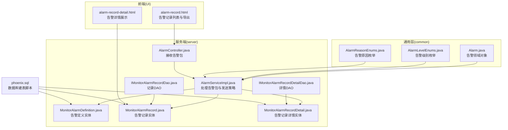
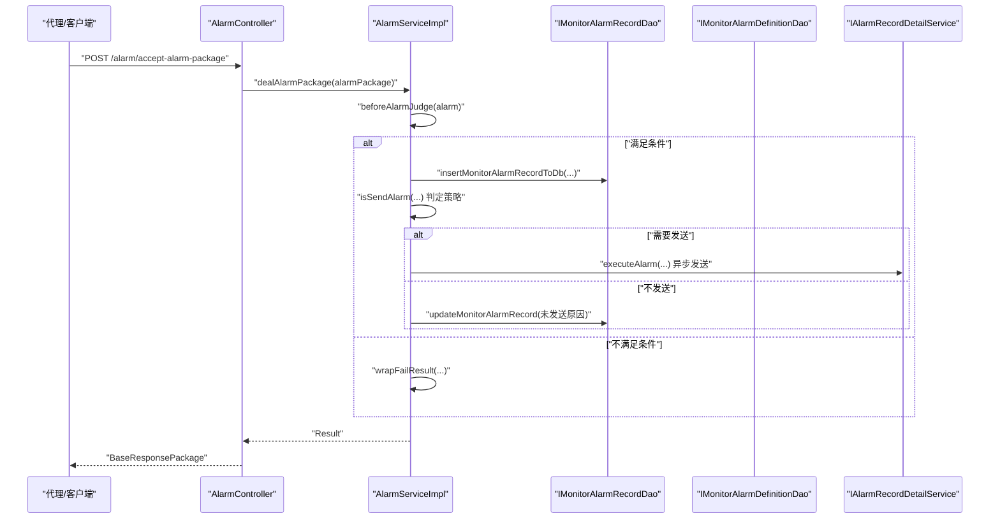
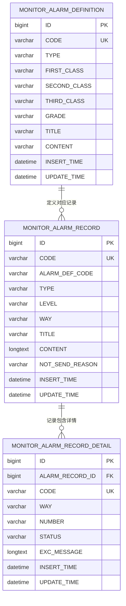
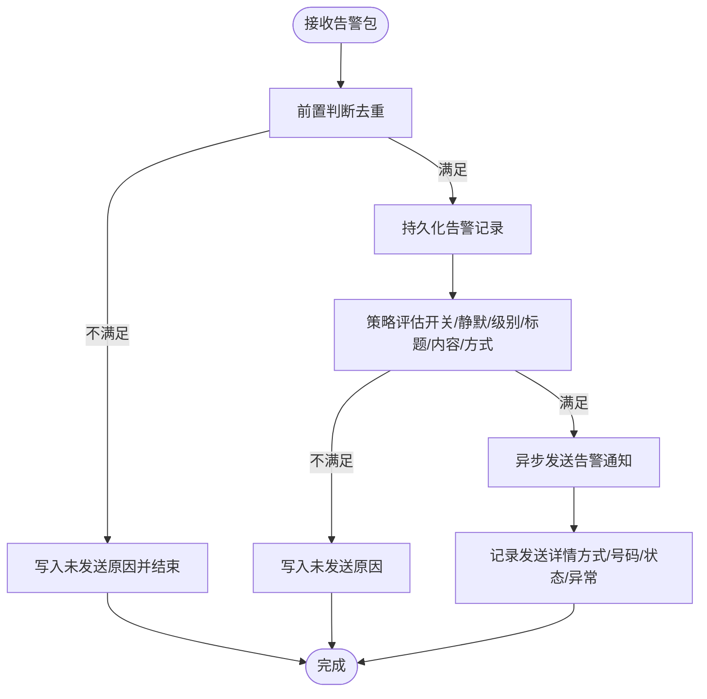
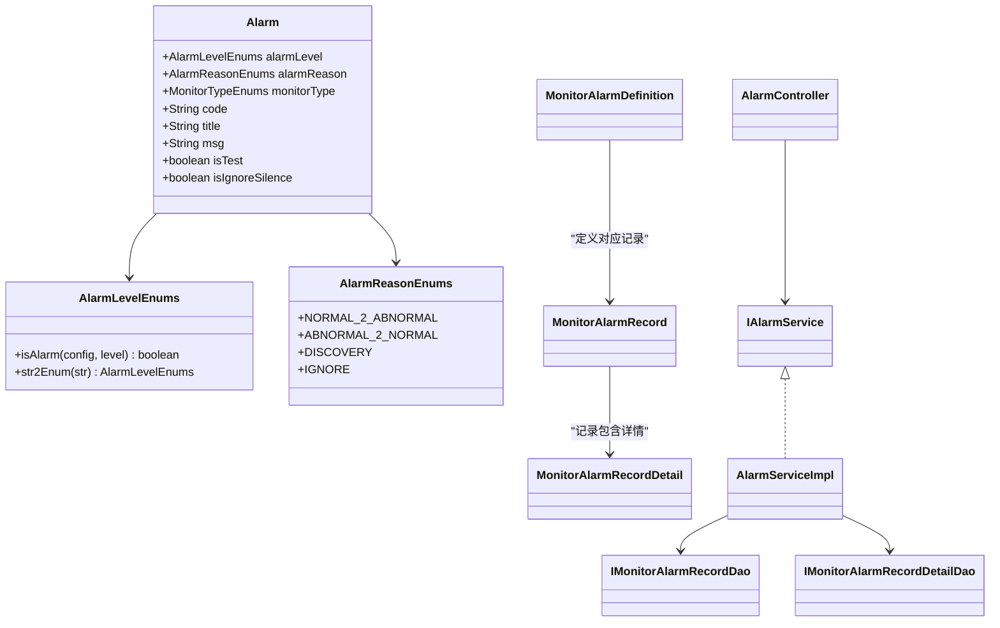

# 告警记录管理

<cite>
**本文引用的文件**
- [phoenix.sql](file://doc/数据库设计/sql/mysql/phoenix.sql)
- [Alarm.java](file://phoenix-common\phoenix-common-core\src\main\java\com\gitee\pifeng\monitoring\common\domain\Alarm.java)
- [AlarmLevelEnums.java](file://phoenix-common\phoenix-common-core\src\main\java\com\gitee\pifeng\monitoring\common\constant\alarm\AlarmLevelEnums.java)
- [AlarmReasonEnums.java](file://phoenix-common\phoenix-common-core\src\main\java\com\gitee\pifeng\monitoring\common\constant\alarm\AlarmReasonEnums.java)
- [MonitorAlarmRecord.java](file://phoenix-server\src\main\java\com\gitee\pifeng\monitoring\server\business\server\entity\MonitorAlarmRecord.java)
- [MonitorAlarmRecordDetail.java](file://phoenix-server\src\main\java\com\gitee\pifeng\monitoring\server\business\server\entity\MonitorAlarmRecordDetail.java)
- [MonitorAlarmDefinition.java](file://phoenix-server\src\main\java\com\gitee\pifeng\monitoring\server\business\server\entity\MonitorAlarmDefinition.java)
- [IMonitorAlarmRecordDao.java](file://phoenix-server\src\main\java\com\gitee\pifeng\monitoring\server\business\server\dao\IMonitorAlarmRecordDao.java)
- [IMonitorAlarmRecordDetailDao.java](file://phoenix-server\src\main\java\com\gitee\pifeng\monitoring\server\business\server\dao\IMonitorAlarmRecordDetailDao.java)
- [AlarmController.java](file://phoenix-server\src\main\java\com\gitee\pifeng\monitoring\server\business\server\controller\AlarmController.java)
- [IAlarmService.java](file://phoenix-server\src\main\java\com\gitee\pifeng\monitoring\server\business\server\service\IAlarmService.java)
- [AlarmServiceImpl.java](file://phoenix-server\src\main\java\com\gitee\pifeng\monitoring\server\business\server\service\impl\AlarmServiceImpl.java)
- [alarm-record.html](file://phoenix-ui\src\main\resources\templates\alarm\alarm-record.html)
- [alarm-record-detail.html](file://phoenix-ui\src\main\resources\templates\alarm\alarm-record-detail.html)
</cite>

## 目录
1. [简介](#简介)
2. [项目结构](#项目结构)
3. [核心组件](#核心组件)
4. [架构概览](#架构概览)
5. [详细组件分析](#详细组件分析)
6. [依赖分析](#依赖分析)
7. [性能考虑](#性能考虑)
8. [故障排查指南](#故障排查指南)
9. [结论](#结论)
10. [附录](#附录)

## 简介
本技术文档围绕告警记录管理功能展开，系统性阐述告警记录与告警记录详情的数据模型设计、状态管理流程、历史数据管理策略、查询与统计能力、导出与报表能力，以及性能优化建议。目标是帮助开发者与运维人员快速理解并高效使用告警记录管理模块。

## 项目结构
告警记录管理涉及三层：通用领域模型（common）、服务端业务（server）、前端界面（UI）。数据库层面以三张核心表支撑：告警定义表、告警记录表、告警记录详情表。

**图表来源**
- [Alarm.java:1-117](file://phoenix-common\phoenix-common-core\src\main\java\com\gitee\pifeng\monitoring\common\domain\Alarm.java#L1-L117)
- [AlarmLevelEnums.java:1-118](file://phoenix-common\phoenix-common-core\src\main\java\com\gitee\pifeng\monitoring\common\constant\alarm\AlarmLevelEnums.java#L1-L118)
- [AlarmReasonEnums.java:1-34](file://phoenix-common\phoenix-common-core\src\main\java\com\gitee\pifeng\monitoring\common\constant\alarm\AlarmReasonEnums.java#L1-L34)
- [AlarmController.java:1-78](file://phoenix-server\src\main\java\com\gitee\pifeng\monitoring\server\business\server\controller\AlarmController.java#L1-L78)
- [AlarmServiceImpl.java:1-304](file://phoenix-server\src\main\java\com\gitee\pifeng\monitoring\server\business\server\service\impl\AlarmServiceImpl.java#L1-L304)
- [MonitorAlarmDefinition.java:1-95](file://phoenix-server\src\main\java\com\gitee\pifeng\monitoring\server\business\server\entity\MonitorAlarmDefinition.java#L1-L95)
- [MonitorAlarmRecord.java:1-93](file://phoenix-server\src\main\java\com\gitee\pifeng\monitoring\server\business\server\entity\MonitorAlarmRecord.java#L1-L93)
- [MonitorAlarmRecordDetail.java:1-84](file://phoenix-server\src\main\java\com\gitee\pifeng\monitoring\server\business\server\entity\MonitorAlarmRecordDetail.java#L1-L84)
- [IMonitorAlarmRecordDao.java:1-33](file://phoenix-server\src\main\java\com\gitee\pifeng\monitoring\server\business\server\dao\IMonitorAlarmRecordDao.java#L1-L33)
- [IMonitorAlarmRecordDetailDao.java:1-16](file://phoenix-server\src\main\java\com\gitee\pifeng\monitoring\server\business\server\dao\IMonitorAlarmRecordDetailDao.java#L1-L16)
- [alarm-record.html:1-544](file://phoenix-ui\src\main\resources\templates\alarm\alarm-record.html#L1-L544)
- [alarm-record-detail.html:1-116](file://phoenix-ui\src\main\resources\templates\alarm\alarm-record-detail.html#L1-L116)
- [phoenix.sql:15-91](file://doc/数据库设计/sql/mysql/phoenix.sql#L15-L91)

**章节来源**
- [phoenix.sql:15-91](file://doc/数据库设计/sql/mysql/phoenix.sql#L15-L91)
- [Alarm.java:1-117](file://phoenix-common\phoenix-common-core\src\main\java\com\gitee\pifeng\monitoring\common\domain\Alarm.java#L1-L117)
- [AlarmLevelEnums.java:1-118](file://phoenix-common\phoenix-common-core\src\main\java\com\gitee\pifeng\monitoring\common\constant\alarm\AlarmLevelEnums.java#L1-L118)
- [AlarmReasonEnums.java:1-34](file://phoenix-common\phoenix-common-core\src\main\java\com\gitee\pifeng\monitoring\common\constant\alarm\AlarmReasonEnums.java#L1-L34)
- [MonitorAlarmDefinition.java:1-95](file://phoenix-server\src\main\java\com\gitee\pifeng\monitoring\server\business\server\entity\MonitorAlarmDefinition.java#L1-L95)
- [MonitorAlarmRecord.java:1-93](file://phoenix-server\src\main\java\com\gitee\pifeng\monitoring\server\business\server\entity\MonitorAlarmRecord.java#L1-L93)
- [MonitorAlarmRecordDetail.java:1-84](file://phoenix-server\src\main\java\com\gitee\pifeng\monitoring\server\business\server\entity\MonitorAlarmRecordDetail.java#L1-L84)
- [IMonitorAlarmRecordDao.java:1-33](file://phoenix-server\src\main\java\com\gitee\pifeng\monitoring\server\business\server\dao\IMonitorAlarmRecordDao.java#L1-L33)
- [IMonitorAlarmRecordDetailDao.java:1-16](file://phoenix-server\src\main\java\com\gitee\pifeng\monitoring\server\business\server\dao\IMonitorAlarmRecordDetailDao.java#L1-L16)
- [AlarmController.java:1-78](file://phoenix-server\src\main\java\com\gitee\pifeng\monitoring\server\business\server\controller\AlarmController.java#L1-L78)
- [AlarmServiceImpl.java:1-304](file://phoenix-server\src\main\java\com\gitee\pifeng\monitoring\server\business\server\service\impl\AlarmServiceImpl.java#L1-L304)
- [alarm-record.html:1-544](file://phoenix-ui\src\main\resources\templates\alarm\alarm-record.html#L1-L544)
- [alarm-record-detail.html:1-116](file://phoenix-ui\src\main\resources\templates\alarm\alarm-record-detail.html#L1-L116)

## 核心组件
- 告警领域对象：封装告警级别、原因、监控类型、标题、内容、编码、被告警主体ID等关键字段，用于跨模块传递。
- 告警级别与原因枚举：统一告警级别的判定与比较，支持“是否告警”的阈值判断。
- 数据模型实体：
  - 告警定义：存储告警类型、分类、级别、编码、标题、内容等。
  - 告警记录：存储告警的类型、级别、方式、标题、内容、未发送原因、时间戳等。
  - 告警记录详情：存储每次告警通知的发送方式、接收人、状态、异常信息及时间戳。
- DAO 层：提供告警记录的查询与统计接口（如静默时段计数）。
- 控制器与服务：接收告警包，进行前置判断、持久化、策略评估与异步发送。

**章节来源**
- [Alarm.java:1-117](file://phoenix-common\phoenix-common-core\src\main\java\com\gitee\pifeng\monitoring\common\domain\Alarm.java#L1-L117)
- [AlarmLevelEnums.java:1-118](file://phoenix-common\phoenix-common-core\src\main\java\com\gitee\pifeng\monitoring\common\constant\alarm\AlarmLevelEnums.java#L1-L118)
- [AlarmReasonEnums.java:1-34](file://phoenix-common\phoenix-common-core\src\main\java\com\gitee\pifeng\monitoring\common\constant\alarm\AlarmReasonEnums.java#L1-L34)
- [MonitorAlarmDefinition.java:1-95](file://phoenix-server\src\main\java\com\gitee\pifeng\monitoring\server\business\server\entity\MonitorAlarmDefinition.java#L1-L95)
- [MonitorAlarmRecord.java:1-93](file://phoenix-server\src\main\java\com\gitee\pifeng\monitoring\server\business\server\entity\MonitorAlarmRecord.java#L1-L93)
- [MonitorAlarmRecordDetail.java:1-84](file://phoenix-server\src\main\java\com\gitee\pifeng\monitoring\server\business\server\entity\MonitorAlarmRecordDetail.java#L1-L84)
- [IMonitorAlarmRecordDao.java:1-33](file://phoenix-server\src\main\java\com\gitee\pifeng\monitoring\server\business\server\dao\IMonitorAlarmRecordDao.java#L1-L33)
- [IMonitorAlarmRecordDetailDao.java:1-16](file://phoenix-server\src\main\java\com\gitee\pifeng\monitoring\server\business\server\dao\IMonitorAlarmRecordDetailDao.java#L1-L16)
- [AlarmController.java:1-78](file://phoenix-server\src\main\java\com\gitee\pifeng\monitoring\server\business\server\controller\AlarmController.java#L1-L78)
- [AlarmServiceImpl.java:1-304](file://phoenix-server\src\main\java\com\gitee\pifeng\monitoring\server\business\server\service\impl\AlarmServiceImpl.java#L1-L304)

## 架构概览
告警记录管理遵循“接收—判定—持久化—异步发送—详情追踪”的闭环流程。后端通过控制器接收告警包，服务层完成前置判断与策略评估，持久化到告警记录表与告警记录详情表，再由异步线程池执行具体发送任务。

**图表来源**
- [AlarmController.java:59-75](file://phoenix-server\src\main\java\com\gitee\pifeng\monitoring\server\business\server\controller\AlarmController.java#L59-L75)
- [AlarmServiceImpl.java:86-170](file://phoenix-server\src\main\java\com\gitee\pifeng\monitoring\server\business\server\service\impl\AlarmServiceImpl.java#L86-L170)
- [IMonitorAlarmRecordDao.java:17-30](file://phoenix-server\src\main\java\com\gitee\pifeng\monitoring\server\business\server\dao\IMonitorAlarmRecordDao.java#L17-L30)
- [IMonitorAlarmRecordDetailDao.java:1-16](file://phoenix-server\src\main\java\com\gitee\pifeng\monitoring\server\business\server\dao\IMonitorAlarmRecordDetailDao.java#L1-L16)

## 详细组件分析

### 数据模型设计与关系映射
- 告警定义表（MONITOR_ALARM_DEFINITION）
  - 字段要点：类型、分类（一级/二级/三级）、级别、编码、标题、内容、时间戳。
  - 作用：为自定义业务告警提供级别、标题、内容的统一来源。
- 告警记录表（MONITOR_ALARM_RECORD）
  - 字段要点：UUID编码、告警定义编码、类型、级别、方式（多方式逗号分隔）、标题、内容、未发送原因、时间戳。
  - 索引：CODE、INSERT_TIME、UPDATE_TIME、TYPE、LEVEL。
  - 作用：持久化一次告警事件的元信息。
- 告警记录详情表（MONITOR_ALARM_RECORD_DETAIL）
  - 字段要点：关联告警记录ID、UUID编码、告警方式、接收人、发送状态（0/1）、异常信息、告警时间、结果获取时间。
  - 索引：ALARM_RECORD_ID、WAY、STATUS、唯一索引(ALARM_RECORD_ID, WAY)。
  - 外键约束：ALARM_RECORD_ID 引用告警记录表ID。
  - 作用：追踪每次告警通知的发送结果与状态。

**图表来源**
- [phoenix.sql:16-91](file://doc/数据库设计/sql/mysql/phoenix.sql#L16-L91)

**章节来源**
- [phoenix.sql:16-91](file://doc/数据库设计/sql/mysql/phoenix.sql#L16-L91)
- [MonitorAlarmDefinition.java:26-94](file://phoenix-server\src\main\java\com\gitee\pifeng\monitoring\server\business\server\entity\MonitorAlarmDefinition.java#L26-L94)
- [MonitorAlarmRecord.java:23-91](file://phoenix-server\src\main\java\com\gitee\pifeng\monitoring\server\business\server\entity\MonitorAlarmRecord.java#L23-L91)
- [MonitorAlarmRecordDetail.java:26-82](file://phoenix-server\src\main\java\com\gitee\pifeng\monitoring\server\business\server\entity\MonitorAlarmRecordDetail.java#L26-L82)

### 状态管理与流转
- 触发：接收告警包后，先进行前置判断（避免重复发送相同告警），随后持久化告警记录。
- 确认：记录中“未发送原因”字段用于标识为何未发送（如开关关闭、静默时段、级别不足、标题或内容为空、未配置方式等）。
- 恢复：告警记录本身不直接表达“恢复”，但可通过后续告警包的“异常变正常”原因（见告警原因枚举）间接体现。
- 关闭：系统未提供专门的“关闭”状态字段；可通过“未发送原因”或业务侧策略控制不再发送。

**图表来源**
- [AlarmServiceImpl.java:105-170](file://phoenix-server\src\main\java\com\gitee\pifeng\monitoring\server\business\server\service\impl\AlarmServiceImpl.java#L105-L170)
- [AlarmReasonEnums.java:11-33](file://phoenix-common\phoenix-common-core\src\main\java\com\gitee\pifeng\monitoring\common\constant\alarm\AlarmReasonEnums.java#L11-L33)

**章节来源**
- [AlarmServiceImpl.java:105-284](file://phoenix-server\src\main\java\com\gitee\pifeng\monitoring\server\business\server\service\impl\AlarmServiceImpl.java#L105-L284)
- [AlarmReasonEnums.java:11-33](file://phoenix-common\phoenix-common-core\src\main\java\com\gitee\pifeng\monitoring\common\constant\alarm\AlarmReasonEnums.java#L11-L33)

### 历史数据管理
- 存储策略：告警记录与详情均以时间戳字段记录插入与更新时间，便于按时间范围检索与统计。
- 清理规则：前端提供“批量删除”“清空”操作入口，后端可通过相应接口实现清理。
- 归档机制：数据库脚本中未提供专用归档表或自动归档策略，建议结合业务需求在DAO层扩展归档与清理策略。

**章节来源**
- [alarm-record.html:134-143](file://phoenix-ui\src\main\resources\templates\alarm\alarm-record.html#L134-L143)
- [IMonitorAlarmRecordDao.java:17-30](file://phoenix-server\src\main\java\com\gitee\pifeng\monitoring\server\business\server\dao\IMonitorAlarmRecordDao.java#L17-L30)

### 查询与统计
- 条件查询：前端提供按类型、级别、方式、状态、标题、内容、未发送原因、记录日期等条件筛选。
- 统计能力：DAO 提供静默告警计数接口，可用于统计特定时间窗口内的静默告警数量。

**章节来源**
- [alarm-record.html:34-126](file://phoenix-ui\src\main\resources\templates\alarm\alarm-record.html#L34-L126)
- [IMonitorAlarmRecordDao.java:17-30](file://phoenix-server\src\main\java\com\gitee\pifeng\monitoring\server\business\server\dao\IMonitorAlarmRecordDao.java#L17-L30)

### 导出与报表
- 导出：前端页面提供导出按钮，拼接查询参数后发起 GET 请求，后端返回 Excel 文件流，浏览器自动下载。
- 报表：前端页面通过表格渲染与排序、分页展示告警记录，支持查看详情弹窗，便于形成基础报表视图。

**章节来源**
- [alarm-record.html:321-386](file://phoenix-ui\src\main\resources\templates\alarm\alarm-record.html#L321-L386)
- [alarm-record-detail.html:1-116](file://phoenix-ui\src\main\resources\templates\alarm\alarm-record-detail.html#L1-L116)

## 依赖分析
- 通用层依赖：服务端通过 Alarm、AlarmLevelEnums、AlarmReasonEnums 统一告警语义与策略。
- 服务端依赖：AlarmController 依赖 IAlarmService；AlarmServiceImpl 依赖实时监控、告警定义、记录与详情服务，以及线程池。
- 数据层依赖：记录与详情实体映射至数据库表，DAO 接口负责数据访问。

**图表来源**
- [Alarm.java:1-117](file://phoenix-common\phoenix-common-core\src\main\java\com\gitee\pifeng\monitoring\common\domain\Alarm.java#L1-L117)
- [AlarmLevelEnums.java:1-118](file://phoenix-common\phoenix-common-core\src\main\java\com\gitee\pifeng\monitoring\common\constant\alarm\AlarmLevelEnums.java#L1-L118)
- [AlarmReasonEnums.java:1-34](file://phoenix-common\phoenix-common-core\src\main\java\com\gitee\pifeng\monitoring\common\constant\alarm\AlarmReasonEnums.java#L1-L34)
- [MonitorAlarmDefinition.java:1-95](file://phoenix-server\src\main\java\com\gitee\pifeng\monitoring\server\business\server\entity\MonitorAlarmDefinition.java#L1-L95)
- [MonitorAlarmRecord.java:1-93](file://phoenix-server\src\main\java\com\gitee\pifeng\monitoring\server\business\server\entity\MonitorAlarmRecord.java#L1-L93)
- [MonitorAlarmRecordDetail.java:1-84](file://phoenix-server\src\main\java\com\gitee\pifeng\monitoring\server\business\server\entity\MonitorAlarmRecordDetail.java#L1-L84)
- [IMonitorAlarmRecordDao.java:1-33](file://phoenix-server\src\main\java\com\gitee\pifeng\monitoring\server\business\server\dao\IMonitorAlarmRecordDao.java#L1-L33)
- [IMonitorAlarmRecordDetailDao.java:1-16](file://phoenix-server\src\main\java\com\gitee\pifeng\monitoring\server\business\server\dao\IMonitorAlarmRecordDetailDao.java#L1-L16)
- [AlarmController.java:1-78](file://phoenix-server\src\main\java\com\gitee\pifeng\monitoring\server\business\server\controller\AlarmController.java#L1-L78)
- [IAlarmService.java:1-28](file://phoenix-server\src\main\java\com\gitee\pifeng\monitoring\server\business\server\service\IAlarmService.java#L1-L28)
- [AlarmServiceImpl.java:1-304](file://phoenix-server\src\main\java\com\gitee\pifeng\monitoring\server\business\server\service\impl\AlarmServiceImpl.java#L1-L304)

**章节来源**
- [Alarm.java:1-117](file://phoenix-common\phoenix-common-core\src\main\java\com\gitee\pifeng\monitoring\common\domain\Alarm.java#L1-L117)
- [AlarmLevelEnums.java:1-118](file://phoenix-common\phoenix-common-core\src\main\java\com\gitee\pifeng\monitoring\common\constant\alarm\AlarmLevelEnums.java#L1-L118)
- [AlarmReasonEnums.java:1-34](file://phoenix-common\phoenix-common-core\src\main\java\com\gitee\pifeng\monitoring\common\constant\alarm\AlarmReasonEnums.java#L1-L34)
- [MonitorAlarmDefinition.java:1-95](file://phoenix-server\src\main\java\com\gitee\pifeng\monitoring\server\business\server\entity\MonitorAlarmDefinition.java#L1-L95)
- [MonitorAlarmRecord.java:1-93](file://phoenix-server\src\main\java\com\gitee\pifeng\monitoring\server\business\server\entity\MonitorAlarmRecord.java#L1-L93)
- [MonitorAlarmRecordDetail.java:1-84](file://phoenix-server\src\main\java\com\gitee\pifeng\monitoring\server\business\server\entity\MonitorAlarmRecordDetail.java#L1-L84)
- [IMonitorAlarmRecordDao.java:1-33](file://phoenix-server\src\main\java\com\gitee\pifeng\monitoring\server\business\server\dao\IMonitorAlarmRecordDao.java#L1-L33)
- [IMonitorAlarmRecordDetailDao.java:1-16](file://phoenix-server\src\main\java\com\gitee\pifeng\monitoring\server\business\server\dao\IMonitorAlarmRecordDetailDao.java#L1-L16)
- [AlarmController.java:1-78](file://phoenix-server\src\main\java\com\gitee\pifeng\monitoring\server\business\server\controller\AlarmController.java#L1-L78)
- [IAlarmService.java:1-28](file://phoenix-server\src\main\java\com\gitee\pifeng\monitoring\server\business\server\service\IAlarmService.java#L1-L28)
- [AlarmServiceImpl.java:1-304](file://phoenix-server\src\main\java\com\gitee\pifeng\monitoring\server\business\server\service\impl\AlarmServiceImpl.java#L1-L304)

## 性能考虑
- 索引设计
  - 告警记录表：CODE、INSERT_TIME、UPDATE_TIME、TYPE、LEVEL 上建立索引，有利于按编码、时间范围、类型、级别查询。
  - 告警记录详情表：ALARM_RECORD_ID、WAY、STATUS 建立索引，唯一索引(ALARM_RECORD_ID, WAY)确保同种方式仅一条记录。
- 分表分库
  - 按时间维度（如按月）分表可降低单表数据量，提升查询与清理效率。
  - 按监控类型或环境维度分库，隔离热点数据。
- 缓存策略
  - 告警定义（级别、标题、内容）可缓存于内存，减少频繁查询数据库。
  - 最近告警去重（实时监控表）可利用缓存降低重复发送概率。
- 异步发送
  - 通过线程池异步执行发送，避免阻塞主流程，提高吞吐。

[本节为通用性能建议，无需特定文件引用]

## 故障排查指南
- 常见未发送原因
  - 告警开关关闭、静默时段、级别不足、标题或内容为空、未配置告警方式、测试告警。
- 定位手段
  - 查看告警记录表的“未发送原因”字段。
  - 查看告警记录详情表的发送状态与异常信息。
  - 结合 DAO 的静默告警计数接口，定位静默时段影响。
- 前端辅助
  - 使用告警记录列表页面的筛选与导出功能，快速定位问题时段与类型。

**章节来源**
- [AlarmServiceImpl.java:206-284](file://phoenix-server\src\main\java\com\gitee\pifeng\monitoring\server\business\server\service\impl\AlarmServiceImpl.java#L206-L284)
- [MonitorAlarmRecord.java:74-78](file://phoenix-server\src\main\java\com\gitee\pifeng\monitoring\server\business\server\entity\MonitorAlarmRecord.java#L74-L78)
- [MonitorAlarmRecordDetail.java:59-69](file://phoenix-server\src\main\java\com\gitee\pifeng\monitoring\server\business\server\entity\MonitorAlarmRecordDetail.java#L59-L69)
- [IMonitorAlarmRecordDao.java:17-30](file://phoenix-server\src\main\java\com\gitee\pifeng\monitoring\server\business\server\dao\IMonitorAlarmRecordDao.java#L17-L30)
- [alarm-record.html:304-386](file://phoenix-ui\src\main\resources\templates\alarm\alarm-record.html#L304-L386)

## 结论
告警记录管理模块以清晰的数据模型与严格的策略评估为基础，实现了从触发、判定、持久化到异步发送的完整闭环。通过合理的索引、分表分库与缓存策略，可在高并发场景下保持稳定性能。前端提供了便捷的查询、导出与详情查看能力，便于日常运维与报表生成。

## 附录
- 数据库建表脚本参考：[phoenix.sql:16-91](file://doc/数据库设计/sql/mysql/phoenix.sql#L16-L91)
- 前端模板参考：
  - 告警记录列表：[alarm-record.html:1-544](file://phoenix-ui\src\main\resources\templates\alarm\alarm-record.html#L1-L544)
  - 告警详情：[alarm-record-detail.html:1-116](file://phoenix-ui\src\main\resources\templates\alarm\alarm-record-detail.html#L1-L116)