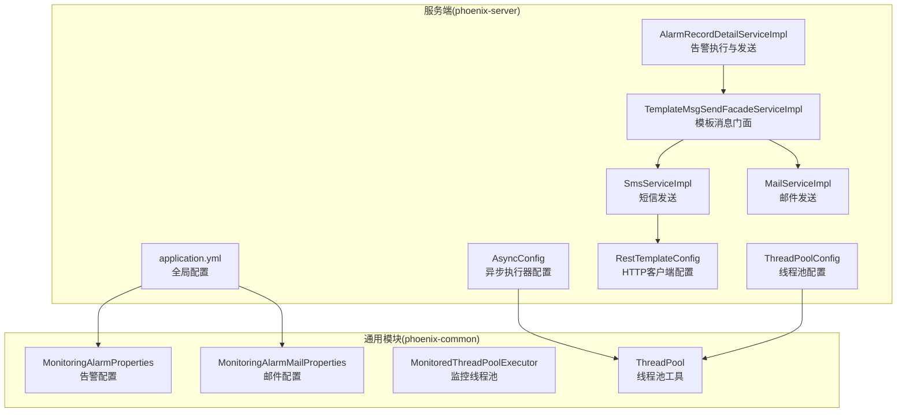
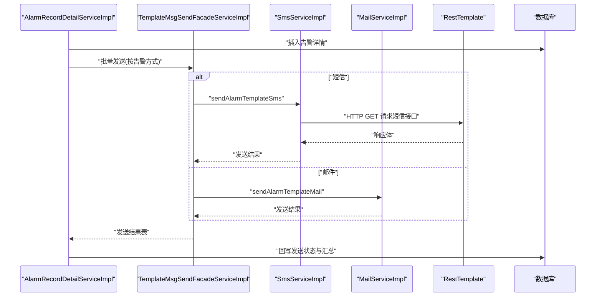
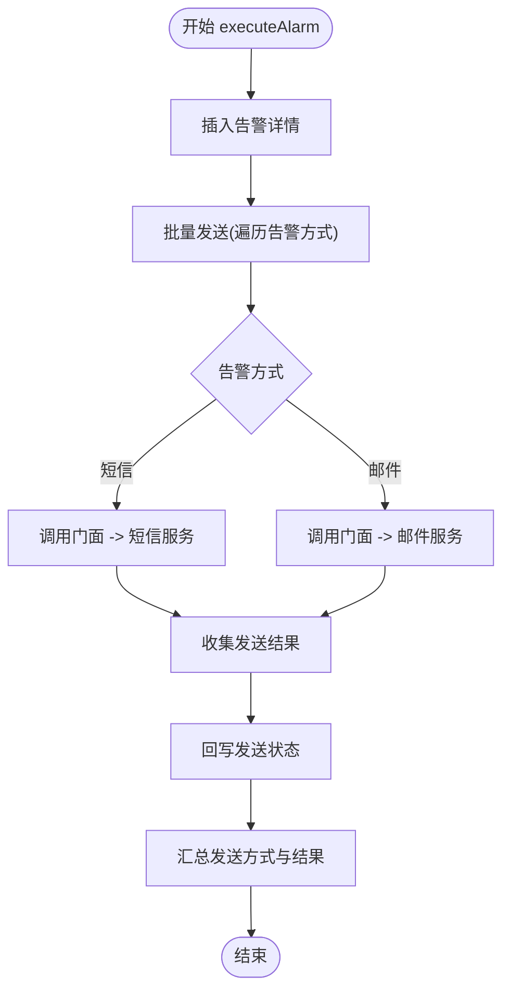
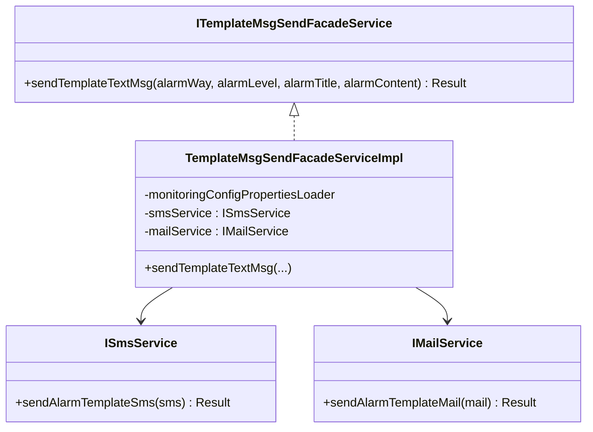
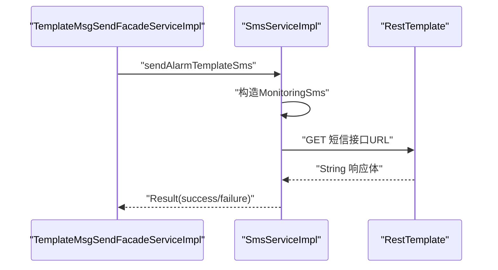
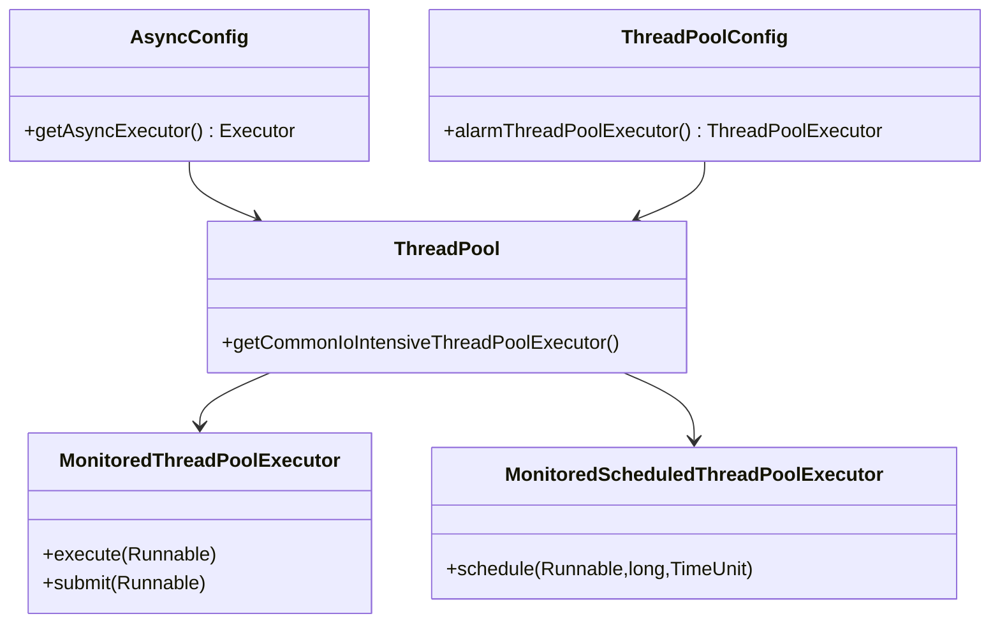
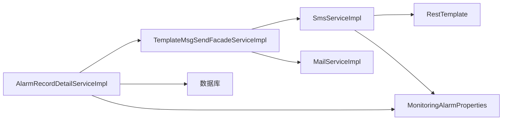

# 通知发送机制

<cite>
**本文引用的文件**
- [AlarmRecordDetailServiceImpl.java](file://phoenix-server/src/main/java/com/gitee/pifeng/monitoring/server/business/server/service/impl/AlarmRecordDetailServiceImpl.java)
- [TemplateMsgSendFacadeServiceImpl.java](file://phoenix-server/src/main/java/com/gitee/pifeng/monitoring/server/business/server/service/impl/TemplateMsgSendFacadeServiceImpl.java)
- [ITemplateMsgSendFacadeService.java](file://phoenix-server/src/main/java/com/gitee/pifeng/monitoring/server/business/server/service/ITemplateMsgSendFacadeService.java)
- [ISmsService.java](file://phoenix-server/src/main/java/com/gitee/pifeng/monitoring/server/business/server/service/ISmsService.java)
- [IMailService.java](file://phoenix-server/src/main/java/com/gitee/pifeng/monitoring/server/business/server/service/IMailService.java)
- [SmsServiceImpl.java](file://phoenix-server/src/main/java/com/gitee/pifeng/monitoring/server/business/server/service/impl/SmsServiceImpl.java)
- [AsyncConfig.java](file://phoenix-server/src/main/java/com/gitee/pifeng/monitoring/server/config/AsyncConfig.java)
- [ThreadPoolConfig.java](file://phoenix-server/src/main/java/com/gitee/pifeng/monitoring/server/config/ThreadPoolConfig.java)
- [RestTemplateConfig.java](file://phoenix-server/src/main/java/com/gitee/pifeng/monitoring/server/config/RestTemplateConfig.java)
- [application.yml](file://phoenix-server/src/main/resources/application.yml)
- [MonitoringAlarmProperties.java](file://phoenix-common/phoenix-common-core/src/main/java/com/gitee/pifeng/monitoring/common/property/server/MonitoringAlarmProperties.java)
- [MonitoringAlarmMailProperties.java](file://phoenix-common/phoenix-common-core/src/main/java/com/gitee/pifeng/monitoring/common/property/server/MonitoringAlarmMailProperties.java)
- [MonitoredThreadPoolExecutor.java](file://phoenix-common/phoenix-common-core/src/main/java/com/gitee/pifeng/monitoring/common/threadpool/MonitoredThreadPoolExecutor.java)
- [MonitoredScheduledThreadPoolExecutor.java](file://phoenix-common/phoenix-common-core/src/main/java/com/gitee/pifeng/monitoring/common/threadpool/MonitoredScheduledThreadPoolExecutor.java)
- [ThreadPool.java](file://phoenix-common/phoenix-common-core/src/main/java/com/gitee/pifeng/monitoring/common/threadpool/ThreadPool.java)
- [AbstractPoolSizeCalculator.java](file://phoenix-common/phoenix-common-core/src/main/java/com/gitee/pifeng/monitoring/common/abs/AbstractPoolSizeCalculator.java)
- [Sms.java](file://phoenix-server/src/main/java/com/gitee/pifeng/monitoring/server/business/server/domain/Sms.java)
- [MonitoringSms.java](file://phoenix-server/src/main/java/com/gitee/pifeng/monitoring/server/business/server/domain/MonitoringSms.java)
</cite>

## 目录
1. [引言](#引言)
2. [项目结构](#项目结构)
3. [核心组件](#核心组件)
4. [架构总览](#架构总览)
5. [组件详解](#组件详解)
6. [依赖关系分析](#依赖关系分析)
7. [性能考量](#性能考量)
8. [故障排查指南](#故障排查指南)
9. [结论](#结论)
10. [附录](#附录)

## 引言
本文件面向“通知发送机制”的技术文档，聚焦于告警通知的多渠道实现（邮件、短信）、异步处理架构（线程池、配置）、模板管理（变量替换、内容渲染）、扩展机制（新增通知渠道）、配置管理（渠道参数、频率限制、黑名单）、监控追踪（发送状态、成功率统计、失败处理）以及性能优化（批量发送、缓存、限流）。文档以代码为依据，结合架构图与流程图，帮助读者快速理解并实践。

## 项目结构
通知发送机制主要分布在以下模块与包中：
- 服务端（phoenix-server）
  - 业务层：告警记录详情服务、模板消息门面服务、短信/邮件服务实现
  - 配置层：异步配置、线程池配置、RestTemplate配置
  - 资源层：Thymeleaf模板（邮件HTML模板）
- 通用模块（phoenix-common）
  - 属性配置模型（告警配置、邮件配置）
  - 线程池抽象与监控执行器
- UI模块（phoenix-ui）
  - 页面模板与前端资源（与通知发送无直接耦合）

**图表来源**
- [AlarmRecordDetailServiceImpl.java:77-108](file://phoenix-server/src/main/java/com/gitee/pifeng/monitoring/server/business/server/service/impl/AlarmRecordDetailServiceImpl.java#L77-L108)
- [TemplateMsgSendFacadeServiceImpl.java:57-83](file://phoenix-server/src/main/java/com/gitee/pifeng/monitoring/server/business/server/service/impl/TemplateMsgSendFacadeServiceImpl.java#L57-L83)
- [SmsServiceImpl.java:48-113](file://phoenix-server/src/main/java/com/gitee/pifeng/monitoring/server/business/server/service/impl/SmsServiceImpl.java#L48-L113)
- [AsyncConfig.java:30-34](file://phoenix-server/src/main/java/com/gitee/pifeng/monitoring/server/config/AsyncConfig.java#L30-L34)
- [ThreadPoolConfig.java:191-193](file://phoenix-server/src/main/java/com/gitee/pifeng/monitoring/server/config/ThreadPoolConfig.java#L191-L193)
- [RestTemplateConfig.java:54-58](file://phoenix-server/src/main/java/com/gitee/pifeng/monitoring/server/config/RestTemplateConfig.java#L54-L58)
- [application.yml:107-114](file://phoenix-server/src/main/resources/application.yml#L107-L114)
- [MonitoringAlarmProperties.java:23-65](file://phoenix-common/phoenix-common-core/src/main/java/com/gitee/pifeng/monitoring/common/property/server/MonitoringAlarmProperties.java#L23-L65)
- [MonitoringAlarmMailProperties.java:19-26](file://phoenix-common/phoenix-common-core/src/main/java/com/gitee/pifeng/monitoring/common/property/server/MonitoringAlarmMailProperties.java#L19-L26)
- [MonitoredThreadPoolExecutor.java:87-108](file://phoenix-common/phoenix-common-core/src/main/java/com/gitee/pifeng/monitoring/common/threadpool/MonitoredThreadPoolExecutor.java#L87-L108)
- [ThreadPool.java:95-103](file://phoenix-common/phoenix-common-core/src/main/java/com/gitee/pifeng/monitoring/common/threadpool/ThreadPool.java#L95-L103)

**章节来源**
- [AlarmRecordDetailServiceImpl.java:1-215](file://phoenix-server/src/main/java/com/gitee/pifeng/monitoring/server/business/server/service/impl/AlarmRecordDetailServiceImpl.java#L1-L215)
- [application.yml:107-114](file://phoenix-server/src/main/resources/application.yml#L107-L114)

## 核心组件
- 告警执行与发送服务
  - 负责将告警详情入库、批量发送、回写发送状态与汇总结果
- 模板消息门面服务
  - 统一入口，按告警方式路由到短信或邮件服务
- 短信服务实现
  - 通过RestTemplate调用企业短信接口，封装请求参数并解析响应
- 邮件服务接口
  - 定义发送模板邮件的契约（实现位于服务端业务层）
- 异步配置与线程池
  - 提供异步执行器与专用线程池，支撑高并发通知发送
- 配置模型
  - 告警配置、邮件配置等，承载通知渠道参数与策略

**章节来源**
- [AlarmRecordDetailServiceImpl.java:77-108](file://phoenix-server/src/main/java/com/gitee/pifeng/monitoring/server/business/server/service/impl/AlarmRecordDetailServiceImpl.java#L77-L108)
- [TemplateMsgSendFacadeServiceImpl.java:57-83](file://phoenix-server/src/main/java/com/gitee/pifeng/monitoring/server/business/server/service/impl/TemplateMsgSendFacadeServiceImpl.java#L57-L83)
- [SmsServiceImpl.java:48-113](file://phoenix-server/src/main/java/com/gitee/pifeng/monitoring/server/business/server/service/impl/SmsServiceImpl.java#L48-L113)
- [ITemplateMsgSendFacadeService.java:17-32](file://phoenix-server/src/main/java/com/gitee/pifeng/monitoring/server/business/server/service/ITemplateMsgSendFacadeService.java#L17-L32)
- [AsyncConfig.java:30-34](file://phoenix-server/src/main/java/com/gitee/pifeng/monitoring/server/config/AsyncConfig.java#L30-L34)
- [ThreadPoolConfig.java:191-193](file://phoenix-server/src/main/java/com/gitee/pifeng/monitoring/server/config/ThreadPoolConfig.java#L191-L193)
- [MonitoringAlarmProperties.java:23-65](file://phoenix-common/phoenix-common-core/src/main/java/com/gitee/pifeng/monitoring/common/property/server/MonitoringAlarmProperties.java#L23-L65)
- [MonitoringAlarmMailProperties.java:19-26](file://phoenix-common/phoenix-common-core/src/main/java/com/gitee/pifeng/monitoring/common/property/server/MonitoringAlarmMailProperties.java#L19-L26)

## 架构总览
通知发送采用“门面路由 + 多渠道实现 + 异步执行 + 配置驱动”的架构。告警事件触发后，先落库再异步批量发送，短信通过HTTP接口调用，邮件通过模板引擎渲染后发送。

**图表来源**
- [AlarmRecordDetailServiceImpl.java:77-108](file://phoenix-server/src/main/java/com/gitee/pifeng/monitoring/server/business/server/service/impl/AlarmRecordDetailServiceImpl.java#L77-L108)
- [TemplateMsgSendFacadeServiceImpl.java:57-83](file://phoenix-server/src/main/java/com/gitee/pifeng/monitoring/server/business/server/service/impl/TemplateMsgSendFacadeServiceImpl.java#L57-L83)
- [SmsServiceImpl.java:48-113](file://phoenix-server/src/main/java/com/gitee/pifeng/monitoring/server/business/server/service/impl/SmsServiceImpl.java#L48-L113)
- [RestTemplateConfig.java:54-58](file://phoenix-server/src/main/java/com/gitee/pifeng/monitoring/server/config/RestTemplateConfig.java#L54-L58)

## 组件详解

### 告警执行与发送服务
- 功能职责
  - 插入告警详情（含接收人/邮箱等）
  - 读取配置的告警方式列表，逐项发送
  - 回写发送状态（成功/失败）、汇总发送方式与结果
- 关键流程
  - 批量发送：遍历告警方式，调用门面发送模板消息
  - 结果回写：根据返回结果更新状态与异常信息
- 并发特性
  - 通过异步配置与线程池执行器，避免阻塞主线程

**图表来源**
- [AlarmRecordDetailServiceImpl.java:77-108](file://phoenix-server/src/main/java/com/gitee/pifeng/monitoring/server/business/server/service/impl/AlarmRecordDetailServiceImpl.java#L77-L108)
- [AlarmRecordDetailServiceImpl.java:164-181](file://phoenix-server/src/main/java/com/gitee/pifeng/monitoring/server/business/server/service/impl/AlarmRecordDetailServiceImpl.java#L164-L181)
- [AlarmRecordDetailServiceImpl.java:195-213](file://phoenix-server/src/main/java/com/gitee/pifeng/monitoring/server/business/server/service/impl/AlarmRecordDetailServiceImpl.java#L195-L213)

**章节来源**
- [AlarmRecordDetailServiceImpl.java:77-108](file://phoenix-server/src/main/java/com/gitee/pifeng/monitoring/server/business/server/service/impl/AlarmRecordDetailServiceImpl.java#L77-L108)
- [AlarmRecordDetailServiceImpl.java:164-181](file://phoenix-server/src/main/java/com/gitee/pifeng/monitoring/server/business/server/service/impl/AlarmRecordDetailServiceImpl.java#L164-L181)
- [AlarmRecordDetailServiceImpl.java:195-213](file://phoenix-server/src/main/java/com/gitee/pifeng/monitoring/server/business/server/service/impl/AlarmRecordDetailServiceImpl.java#L195-L213)

### 模板消息门面服务
- 设计要点
  - 使用外观模式，屏蔽短信/邮件实现差异
  - 依据告警方式构建消息体（标题、内容、级别、接收人）
- 扩展性
  - 新增渠道只需在门面中增加分支并注入对应服务

**图表来源**
- [ITemplateMsgSendFacadeService.java:17-32](file://phoenix-server/src/main/java/com/gitee/pifeng/monitoring/server/business/server/service/ITemplateMsgSendFacadeService.java#L17-L32)
- [TemplateMsgSendFacadeServiceImpl.java:24-83](file://phoenix-server/src/main/java/com/gitee/pifeng/monitoring/server/business/server/service/impl/TemplateMsgSendFacadeServiceImpl.java#L24-L83)
- [ISmsService.java:14-26](file://phoenix-server/src/main/java/com/gitee/pifeng/monitoring/server/business/server/service/ISmsService.java#L14-L26)
- [IMailService.java:14-26](file://phoenix-server/src/main/java/com/gitee/pifeng/monitoring/server/business/server/service/IMailService.java#L14-L26)

**章节来源**
- [TemplateMsgSendFacadeServiceImpl.java:57-83](file://phoenix-server/src/main/java/com/gitee/pifeng/monitoring/server/business/server/service/impl/TemplateMsgSendFacadeServiceImpl.java#L57-L83)
- [ITemplateMsgSendFacadeService.java:17-32](file://phoenix-server/src/main/java/com/gitee/pifeng/monitoring/server/business/server/service/ITemplateMsgSendFacadeService.java#L17-L32)

### 短信通知
- 实现逻辑
  - 读取告警配置中的企业枚举与接口地址
  - 构造MonitoringSms对象（去换行、拼标题、拼接手机号）
  - 通过RestTemplate发起HTTP请求，解析响应体
- 错误处理
  - 异常捕获并返回失败结果，包含异常消息

**图表来源**
- [SmsServiceImpl.java:48-113](file://phoenix-server/src/main/java/com/gitee/pifeng/monitoring/server/business/server/service/impl/SmsServiceImpl.java#L48-L113)
- [Sms.java:20-42](file://phoenix-server/src/main/java/com/gitee/pifeng/monitoring/server/business/server/domain/Sms.java#L20-L42)
- [MonitoringSms.java:20-42](file://phoenix-server/src/main/java/com/gitee/pifeng/monitoring/server/business/server/domain/MonitoringSms.java#L20-L42)
- [RestTemplateConfig.java:54-58](file://phoenix-server/src/main/java/com/gitee/pifeng/monitoring/server/config/RestTemplateConfig.java#L54-L58)

**章节来源**
- [SmsServiceImpl.java:48-113](file://phoenix-server/src/main/java/com/gitee/pifeng/monitoring/server/business/server/service/impl/SmsServiceImpl.java#L48-L113)
- [Sms.java:20-42](file://phoenix-server/src/main/java/com/gitee/pifeng/monitoring/server/business/server/domain/Sms.java#L20-L42)
- [MonitoringSms.java:20-42](file://phoenix-server/src/main/java/com/gitee/pifeng/monitoring/server/business/server/domain/MonitoringSms.java#L20-L42)

### 邮件通知
- 接口契约
  - IMailService定义发送模板邮件的接口
- 实现位置
  - 邮件服务实现位于服务端业务层（接口已定义，实现文件存在于工程中）
- 模板渲染
  - application.yml中配置了Thymeleaf模板路径，邮件模板位于resources/templates/mail

**章节来源**
- [IMailService.java:14-26](file://phoenix-server/src/main/java/com/gitee/pifeng/monitoring/server/business/server/service/IMailService.java#L14-L26)
- [application.yml:107-114](file://phoenix-server/src/main/resources/application.yml#L107-L114)

### 异步处理与线程池
- 异步配置
  - AsyncConfig启用@EnableAsync并提供异步执行器
- 线程池配置
  - ThreadPoolConfig提供专用线程池（如alarmThreadPoolExecutor）
  - ThreadPool提供常用线程池工具方法
  - MonitoredThreadPoolExecutor与MonitoredScheduledThreadPoolExecutor提供监控与拒绝策略
- 计算器
  - AbstractPoolSizeCalculator提供线程池边界计算思路

**图表来源**
- [AsyncConfig.java:30-34](file://phoenix-server/src/main/java/com/gitee/pifeng/monitoring/server/config/AsyncConfig.java#L30-L34)
- [ThreadPoolConfig.java:191-193](file://phoenix-server/src/main/java/com/gitee/pifeng/monitoring/server/config/ThreadPoolConfig.java#L191-L193)
- [ThreadPool.java:95-103](file://phoenix-common/phoenix-common-core/src/main/java/com/gitee/pifeng/monitoring/common/threadpool/ThreadPool.java#L95-L103)
- [MonitoredThreadPoolExecutor.java:87-108](file://phoenix-common/phoenix-common-core/src/main/java/com/gitee/pifeng/monitoring/common/threadpool/MonitoredThreadPoolExecutor.java#L87-L108)
- [MonitoredScheduledThreadPoolExecutor.java:138-146](file://phoenix-common/phoenix-common-core/src/main/java/com/gitee/pifeng/monitoring/common/threadpool/MonitoredScheduledThreadPoolExecutor.java#L138-L146)

**章节来源**
- [AsyncConfig.java:30-34](file://phoenix-server/src/main/java/com/gitee/pifeng/monitoring/server/config/AsyncConfig.java#L30-L34)
- [ThreadPoolConfig.java:191-193](file://phoenix-server/src/main/java/com/gitee/pifeng/monitoring/server/config/ThreadPoolConfig.java#L191-L193)
- [ThreadPool.java:95-103](file://phoenix-common/phoenix-common-core/src/main/java/com/gitee/pifeng/monitoring/common/threadpool/ThreadPool.java#L95-L103)
- [MonitoredThreadPoolExecutor.java:87-108](file://phoenix-common/phoenix-common-core/src/main/java/com/gitee/pifeng/monitoring/common/threadpool/MonitoredThreadPoolExecutor.java#L87-L108)
- [MonitoredScheduledThreadPoolExecutor.java:138-146](file://phoenix-common/phoenix-common-core/src/main/java/com/gitee/pifeng/monitoring/common/threadpool/MonitoredScheduledThreadPoolExecutor.java#L138-L146)
- [AbstractPoolSizeCalculator.java:46-91](file://phoenix-common/phoenix-common-core/src/main/java/com/gitee/pifeng/monitoring/common/abs/AbstractPoolSizeCalculator.java#L46-L91)

### 通知模板管理
- 配置模型
  - MonitoringAlarmProperties：告警开关、级别、静默时段、告警方式数组、短信/邮件配置
  - MonitoringAlarmMailProperties：邮件收件人数组
- 模板路径
  - Thymeleaf模板路径在application.yml中配置，邮件模板位于resources/templates/mail
- 变量替换与渲染
  - 通过Thymeleaf模板引擎进行变量替换与内容渲染（具体模板文件存在于工程中）

**章节来源**
- [MonitoringAlarmProperties.java:23-65](file://phoenix-common/phoenix-common-core/src/main/java/com/gitee/pifeng/monitoring/common/property/server/MonitoringAlarmProperties.java#L23-L65)
- [MonitoringAlarmMailProperties.java:19-26](file://phoenix-common/phoenix-common-core/src/main/java/com/gitee/pifeng/monitoring/common/property/server/MonitoringAlarmMailProperties.java#L19-L26)
- [application.yml:107-114](file://phoenix-server/src/main/resources/application.yml#L107-L114)

### 扩展机制（新增通知渠道）
- 门面扩展
  - 在TemplateMsgSendFacadeServiceImpl中新增case分支，注入新渠道服务
- 接口契约
  - 新增渠道需实现对应服务接口（如ISmsService风格）
- 配置接入
  - 在MonitoringAlarmProperties中新增对应配置项，确保门面可读取

**章节来源**
- [TemplateMsgSendFacadeServiceImpl.java:57-83](file://phoenix-server/src/main/java/com/gitee/pifeng/monitoring/server/business/server/service/impl/TemplateMsgSendFacadeServiceImpl.java#L57-L83)
- [ISmsService.java:14-26](file://phoenix-server/src/main/java/com/gitee/pifeng/monitoring/server/business/server/service/ISmsService.java#L14-L26)
- [MonitoringAlarmProperties.java:50-63](file://phoenix-common/phoenix-common-core/src/main/java/com/gitee/pifeng/monitoring/common/property/server/MonitoringAlarmProperties.java#L50-L63)

### 配置管理
- 渠道参数
  - 短信：企业枚举、接口地址、手机号数组
  - 邮件：收件人数组
- 发送频率限制与黑名单
  - 当前代码未见显式频率限制与黑名单实现，可在短信服务中扩展（例如基于缓存的去重与速率控制）
- 全局配置
  - application.yml中包含缓存、Quartz、Thymeleaf、数据源等配置，间接影响通知发送的稳定性与性能

**章节来源**
- [SmsServiceImpl.java:48-58](file://phoenix-server/src/main/java/com/gitee/pifeng/monitoring/server/business/server/service/impl/SmsServiceImpl.java#L48-L58)
- [MonitoringAlarmProperties.java:50-63](file://phoenix-common/phoenix-common-core/src/main/java/com/gitee/pifeng/monitoring/common/property/server/MonitoringAlarmProperties.java#L50-L63)
- [application.yml:38-43](file://phoenix-server/src/main/resources/application.yml#L38-L43)
- [application.yml:67-104](file://phoenix-server/src/main/resources/application.yml#L67-L104)

### 监控与追踪
- 发送状态记录
  - AlarmRecordDetailServiceImpl在发送完成后回写状态与异常信息
- 成功率统计
  - 可基于回写后的状态字段进行聚合统计（当前未见专门统计接口，可在服务层扩展）
- 失败处理
  - Result.isSuccess()为false时记录异常消息；短信服务对异常进行捕获并返回失败

**章节来源**
- [AlarmRecordDetailServiceImpl.java:195-213](file://phoenix-server/src/main/java/com/gitee/pifeng/monitoring/server/business/server/service/impl/AlarmRecordDetailServiceImpl.java#L195-L213)
- [SmsServiceImpl.java:109-112](file://phoenix-server/src/main/java/com/gitee/pifeng/monitoring/server/business/server/service/impl/SmsServiceImpl.java#L109-L112)

## 依赖关系分析
- 组件耦合
  - AlarmRecordDetailServiceImpl依赖门面与配置加载器
  - 门面依赖短信/邮件服务接口
  - 短信服务依赖RestTemplate与配置加载器
- 外部依赖
  - Spring MVC异步、Quartz定时、MyBatis Plus、Caffeine缓存、Thymeleaf模板

**图表来源**
- [AlarmRecordDetailServiceImpl.java:54-60](file://phoenix-server/src/main/java/com/gitee/pifeng/monitoring/server/business/server/service/impl/AlarmRecordDetailServiceImpl.java#L54-L60)
- [TemplateMsgSendFacadeServiceImpl.java:29-42](file://phoenix-server/src/main/java/com/gitee/pifeng/monitoring/server/business/server/service/impl/TemplateMsgSendFacadeServiceImpl.java#L29-L42)
- [SmsServiceImpl.java:32-36](file://phoenix-server/src/main/java/com/gitee/pifeng/monitoring/server/business/server/service/impl/SmsServiceImpl.java#L32-L36)
- [RestTemplateConfig.java:54-58](file://phoenix-server/src/main/java/com/gitee/pifeng/monitoring/server/config/RestTemplateConfig.java#L54-L58)
- [MonitoringAlarmProperties.java:23-65](file://phoenix-common/phoenix-common-core/src/main/java/com/gitee/pifeng/monitoring/common/property/server/MonitoringAlarmProperties.java#L23-L65)

**章节来源**
- [AlarmRecordDetailServiceImpl.java:54-60](file://phoenix-server/src/main/java/com/gitee/pifeng/monitoring/server/business/server/service/impl/AlarmRecordDetailServiceImpl.java#L54-L60)
- [TemplateMsgSendFacadeServiceImpl.java:29-42](file://phoenix-server/src/main/java/com/gitee/pifeng/monitoring/server/business/server/service/impl/TemplateMsgSendFacadeServiceImpl.java#L29-L42)
- [SmsServiceImpl.java:32-36](file://phoenix-server/src/main/java/com/gitee/pifeng/monitoring/server/business/server/service/impl/SmsServiceImpl.java#L32-L36)

## 性能考量
- 异步执行
  - 通过AsyncConfig与线程池执行器，避免阻塞请求线程
- 线程池优化
  - IO密集型场景使用监控线程池，必要时为告警单独配置线程池
- 缓存与限流
  - 应用层使用Caffeine缓存；可在短信服务中引入限流与去重（建议）
- 批量发送
  - AlarmRecordDetailServiceImpl已实现批量发送与批量入库，减少数据库压力

**章节来源**
- [AsyncConfig.java:30-34](file://phoenix-server/src/main/java/com/gitee/pifeng/monitoring/server/config/AsyncConfig.java#L30-L34)
- [ThreadPoolConfig.java:191-193](file://phoenix-server/src/main/java/com/gitee/pifeng/monitoring/server/config/ThreadPoolConfig.java#L191-L193)
- [application.yml:38-43](file://phoenix-server/src/main/resources/application.yml#L38-L43)
- [AlarmRecordDetailServiceImpl.java:164-181](file://phoenix-server/src/main/java/com/gitee/pifeng/monitoring/server/business/server/service/impl/AlarmRecordDetailServiceImpl.java#L164-L181)

## 故障排查指南
- 短信发送失败
  - 检查短信企业枚举与接口地址配置
  - 查看异常日志与Result消息
- 邮件模板问题
  - 确认Thymeleaf模板路径与模板文件存在
- 发送状态异常
  - 核对AlarmRecordDetailServiceImpl的回写逻辑与数据库字段映射
- 线程池拒绝
  - 检查线程池配置与拒绝策略，必要时扩容或调整队列容量

**章节来源**
- [SmsServiceImpl.java:48-58](file://phoenix-server/src/main/java/com/gitee/pifeng/monitoring/server/business/server/service/impl/SmsServiceImpl.java#L48-L58)
- [SmsServiceImpl.java:109-112](file://phoenix-server/src/main/java/com/gitee/pifeng/monitoring/server/business/server/service/impl/SmsServiceImpl.java#L109-L112)
- [application.yml:107-114](file://phoenix-server/src/main/resources/application.yml#L107-L114)
- [AlarmRecordDetailServiceImpl.java:195-213](file://phoenix-server/src/main/java/com/gitee/pifeng/monitoring/server/business/server/service/impl/AlarmRecordDetailServiceImpl.java#L195-L213)

## 结论
通知发送机制以门面路由为核心，结合异步执行与线程池配置，实现了短信与邮件的统一接入。通过配置模型与模板引擎，满足了多渠道、可扩展的通知需求。建议后续在短信侧补充频率限制与黑名单、在服务层完善成功率统计与重试策略，以进一步提升可靠性与可观测性。

## 附录
- 关键类与职责速览
  - AlarmRecordDetailServiceImpl：告警执行与发送
  - TemplateMsgSendFacadeServiceImpl：模板消息门面
  - SmsServiceImpl：短信发送实现
  - IMailService：邮件服务接口
  - AsyncConfig/ThreadPoolConfig：异步与线程池配置
  - MonitoringAlarmProperties/MonitoringAlarmMailProperties：告警与邮件配置
  - MonitoredThreadPoolExecutor/MonitoredScheduledThreadPoolExecutor：监控线程池
  - RestTemplateConfig：HTTP客户端配置