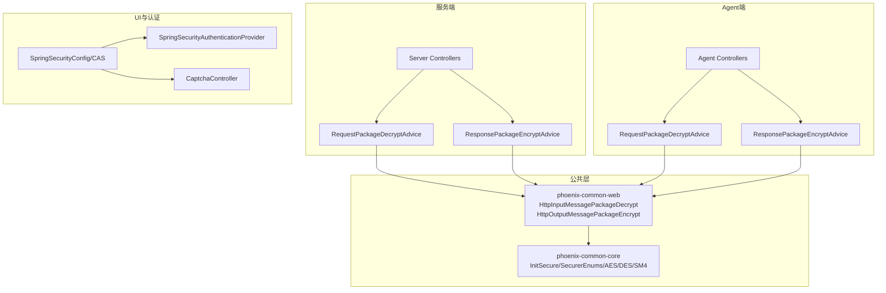
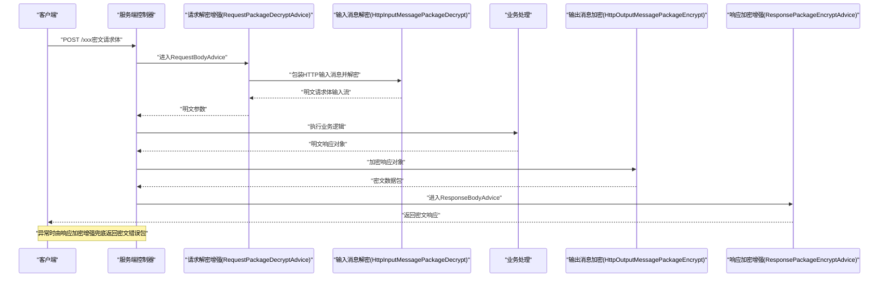
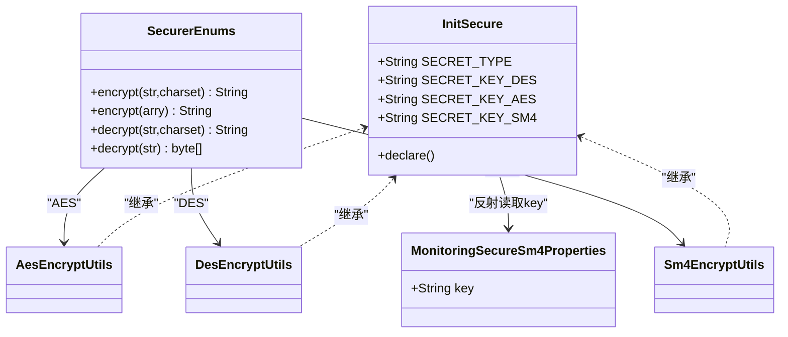
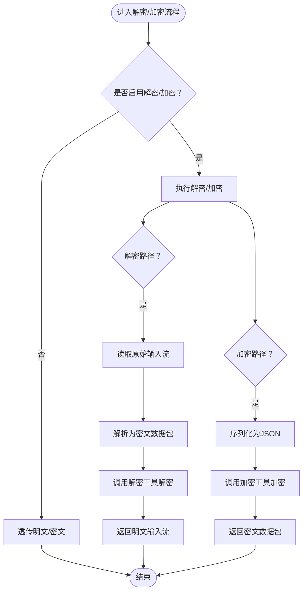
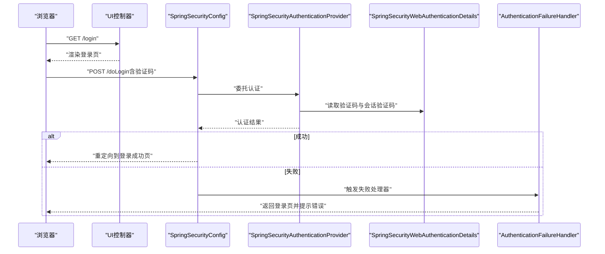
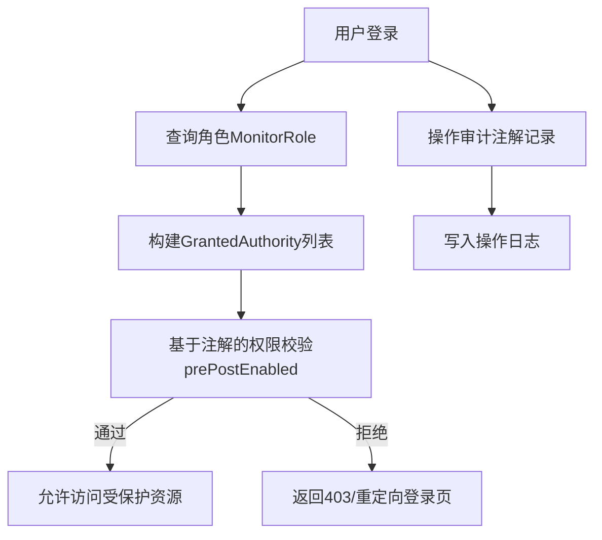
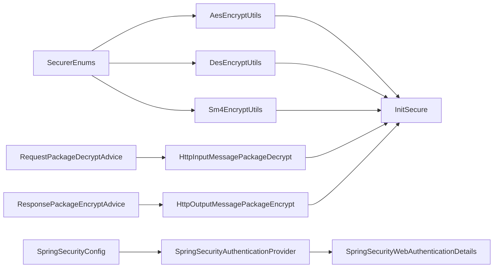

# 安全认证

<cite>
**本文引用的文件**
- [InitSecure.java](file://phoenix-common\phoenix-common-core\src\main\java\com\gitee\pifeng\monitoring\common\init\InitSecure.java)
- [SecurerEnums.java](file://phoenix-common\phoenix-common-core\src\main\java\com\gitee\pifeng\monitoring\common\constant\SecurerEnums.java)
- [AesEncryptUtils.java](file://phoenix-common\phoenix-common-core\src\main\java\com\gitee\pifeng\monitoring\common\util\secure\AesEncryptUtils.java)
- [DesEncryptUtils.java](file://phoenix-common\phoenix-common-core\src\main\java\com\gitee\pifeng\monitoring\common\util\secure\DesEncryptUtils.java)
- [Sm4EncryptUtils.java](file://phoenix-common\phoenix-common-core\src\main\java\com\gitee\pifeng\monitoring\common\util\secure\Sm4EncryptUtils.java)
- [MonitoringSecureSm4Properties.java](file://phoenix-common\phoenix-common-core\src\main\java\com\gitee\pifeng\monitoring\common\property\client\MonitoringSecureSm4Properties.java)
- [HttpInputMessagePackageDecrypt.java](file://phoenix-common\phoenix-common-web\src\main\java\com\gitee\pifeng\monitoring\common\web\core\http\HttpInputMessagePackageDecrypt.java)
- [HttpOutputMessagePackageEncrypt.java](file://phoenix-common\phoenix-common-web\src\main\java\com\gitee\pifeng\monitoring\common\web\core\http\HttpOutputMessagePackageEncrypt.java)
- [RequestPackageDecryptAdvice.java（服务端）](file://phoenix-server\src\main\java\com\gitee\pifeng\monitoring\server\business\server\component\RequestPackageDecryptAdvice.java)
- [ResponsePackageEncryptAdvice.java（服务端）](file://phoenix-server\src\main\java\com\gitee\pifeng\monitoring\server\business\server\component\ResponsePackageEncryptAdvice.java)
- [RequestPackageDecryptAdvice.java（Agent端）](file://phoenix-agent\src\main\java\com\gitee\pifeng\monitoring\agent\component\RequestPackageDecryptAdvice.java)
- [ResponsePackageEncryptAdvice.java（Agent端）](file://phoenix-agent\src\main\java\com\gitee\pifeng\monitoring\common\web\core\http\ResponsePackageEncryptAdvice.java)
- [SpringSecurityConfig.java](file://phoenix-ui\src\main\java\com\gitee\pifeng\monitoring\ui\config\springsecurity\SpringSecurityConfig.java)
- [BaseWebSecurityConfigurerAdapter.java](file://phoenix-ui\src\main\java\com\gitee\pifeng\monitoring\ui\config\springsecurity\BaseWebSecurityConfigurerAdapter.java)
- [SpringSecurityAuthenticationProvider.java](file://phoenix-ui\src\main\java\com\gitee\pifeng\monitoring\ui\config\springsecurity\SpringSecurityAuthenticationProvider.java)
- [SpringSecurityWebAuthenticationDetailsSource.java](file://phoenix-ui\src\main\java\com\gitee\pifeng\monitoring\ui\config\springsecurity\SpringSecurityWebAuthenticationDetailsSource.java)
- [SpringSecurityWebAuthenticationDetails.java](file://phoenix-ui\src\main\java\com\gitee\pifeng\monitoring\ui\config\springsecurity\SpringSecurityWebAuthenticationDetails.java)
- [SpringSecurityAuthenticationFailureHandler.java](file://phoenix-ui\src\main\java\com\gitee\pifeng\monitoring\ui\config\springsecurity\SpringSecurityAuthenticationFailureHandler.java)
- [SpringSecurityCasConfig.java](file://phoenix-ui\src\main\java\com\gitee\pifeng\monitoring\ui\config\springsecurity\SpringSecurityCasConfig.java)
- [CaptchaController.java](file://phoenix-ui\src\main\java\com\gitee\pifeng\monitoring\ui\business\web\controller\CaptchaController.java)
- [MonitorUserServiceImpl.java](file://phoenix-ui\src\main\java\com\gitee\pifeng\monitoring\ui\business\web\service\impl\MonitorUserServiceImpl.java)
- [MonitorRoleController.java](file://phoenix-ui\src\main\java\com\gitee\pifeng\monitoring\ui\business\web\controller\MonitorRoleController.java)
</cite>

## 目录
1. [简介](#简介)
2. [项目结构](#项目结构)
3. [核心组件](#核心组件)
4. [架构总览](#架构总览)
5. [详细组件分析](#详细组件分析)
6. [依赖分析](#依赖分析)
7. [性能考虑](#性能考虑)
8. [故障排查指南](#故障排查指南)
9. [结论](#结论)
10. [附录](#附录)

## 简介
本技术文档聚焦于Phoenix监控系统的安全认证模块，系统性阐述服务端的安全防护机制，涵盖数据传输加密、身份认证、权限控制与安全配置最佳实践。文档以代码为依据，结合序列图与流程图，帮助读者理解请求解密与响应加密的实现原理、密钥管理策略、签名与防重放思路、API密钥与令牌管理、会话控制、RBAC权限模型、资源权限管理与操作审计，并提供安全漏洞防范与监控审计建议。

## 项目结构
安全相关能力分布在以下模块：
- 公共安全与加解密：phoenix-common-core、phoenix-common-web
- 服务端：phoenix-server
- Agent端：phoenix-agent
- UI与认证：phoenix-ui

图表来源
- [InitSecure.java:50-87](file://phoenix-common\phoenix-common-core\src\main\java\com\gitee\pifeng\monitoring\common\init\InitSecure.java#L50-L87)
- [HttpInputMessagePackageDecrypt.java:65-84](file://phoenix-common\phoenix-common-web\src\main\java\com\gitee\pifeng\monitoring\common\web\core\http\HttpInputMessagePackageDecrypt.java#L65-L84)
- [HttpOutputMessagePackageEncrypt.java:29-38](file://phoenix-common\phoenix-common-web\src\main\java\com\gitee\pifeng\monitoring\common\web\core\http\HttpOutputMessagePackageEncrypt.java#L29-L38)
- [RequestPackageDecryptAdvice.java（服务端）:25-35](file://phoenix-server\src\main\java\com\gitee\pifeng\monitoring\server\business\server\component\RequestPackageDecryptAdvice.java#L25-L35)
- [ResponsePackageEncryptAdvice.java（服务端）:52-61](file://phoenix-server\src\main\java\com\gitee\pifeng\monitoring\server\business\server\component\ResponsePackageEncryptAdvice.java#L52-L61)
- [RequestPackageDecryptAdvice.java（Agent端）:28-36](file://phoenix-agent\src\main\java\com\gitee\pifeng\monitoring\agent\component\RequestPackageDecryptAdvice.java#L28-L36)
- [ResponsePackageEncryptAdvice.java（Agent端）:55-63](file://phoenix-agent\src\main\java\com\gitee\pifeng\monitoring\common\web\core\http\ResponsePackageEncryptAdvice.java#L55-L63)
- [SpringSecurityConfig.java:112-166](file://phoenix-ui\src\main\java\com\gitee\pifeng\monitoring\ui\config\springsecurity\SpringSecurityConfig.java#L112-L166)
- [SpringSecurityAuthenticationProvider.java:64-69](file://phoenix-ui\src\main\java\com\gitee\pifeng\monitoring\ui\config\springsecurity\SpringSecurityAuthenticationProvider.java#L64-L69)
- [CaptchaController.java:45-46](file://phoenix-ui\src\main\java\com\gitee\pifeng\monitoring\ui\business\web\controller\CaptchaController.java#L45-L46)

章节来源
- [InitSecure.java:50-87](file://phoenix-common\phoenix-common-core\src\main\java\com\gitee\pifeng\monitoring\common\init\InitSecure.java#L50-L87)
- [HttpInputMessagePackageDecrypt.java:65-84](file://phoenix-common\phoenix-common-web\src\main\java\com\gitee\pifeng\monitoring\common\web\core\http\HttpInputMessagePackageDecrypt.java#L65-L84)
- [HttpOutputMessagePackageEncrypt.java:29-38](file://phoenix-common\phoenix-common-web\src\main\java\com\gitee\pifeng\monitoring\common\web\core\http\HttpOutputMessagePackageEncrypt.java#L29-L38)
- [SpringSecurityConfig.java:112-166](file://phoenix-ui\src\main\java\com\gitee\pifeng\monitoring\ui\config\springsecurity\SpringSecurityConfig.java#L112-L166)

## 核心组件
- 加解密配置与算法选择
  - InitSecure：通过反射加载配置，动态确定加密算法类型与密钥（DES/AES/SM4），并提供静态声明方法以预热初始化。
  - SecurerEnums：统一的加解密接口实现入口，按算法类型分发至具体工具类。
  - AesEncryptUtils/DesEncryptUtils/Sm4EncryptUtils：基于hutool的对称加密工具封装，使用Base64解码的密钥进行加解密。
  - MonitoringSecureSm4Properties：SM4密钥配置载体（反射读取）。
- HTTP消息加解密
  - HttpInputMessagePackageDecrypt：从HTTP输入消息中读取密文包，解密并返回明文输入流。
  - HttpOutputMessagePackageEncrypt：将明文数据包序列化为JSON后加密，输出密文包。
- Spring Security认证与会话控制
  - SpringSecurityConfig：基于表单登录、记住我、会话并发控制、JDBC会话存储、忽略静态资源与健康端点等。
  - SpringSecurityAuthenticationProvider：扩展DaoAuthenticationProvider，支持登录验证码校验。
  - SpringSecurityWebAuthenticationDetailsSource/Details：承载验证码、会话验证码与过期时间等上下文。
  - SpringSecurityAuthenticationFailureHandler：认证失败处理。
  - SpringSecurityCasConfig：CAS认证配置（可选）。
  - CaptchaController：图形验证码生成。
- 控制器增强（服务端/Agent端）
  - RequestPackageDecryptAdvice：全局请求体解密增强。
  - ResponsePackageEncryptAdvice：全局响应体加密增强（含异常兜底）。

章节来源
- [SecurerEnums.java:18-65](file://phoenix-common\phoenix-common-core\src\main\java\com\gitee\pifeng\monitoring\common\constant\SecurerEnums.java#L18-L65)
- [AesEncryptUtils.java:30-79](file://phoenix-common\phoenix-common-core\src\main\java\com\gitee\pifeng\monitoring\common\util\secure\AesEncryptUtils.java#L30-L79)
- [DesEncryptUtils.java:30-79](file://phoenix-common\phoenix-common-core\src\main\java\com\gitee\pifeng\monitoring\common\util\secure\DesEncryptUtils.java#L30-L79)
- [Sm4EncryptUtils.java:30-79](file://phoenix-common\phoenix-common-core\src\main\java\com\gitee\pifeng\monitoring\common\util\secure\Sm4EncryptUtils.java#L30-L79)
- [MonitoringSecureSm4Properties.java:21-29](file://phoenix-common\phoenix-common-core\src\main\java\com\gitee\pifeng\monitoring\common\property\client\MonitoringSecureSm4Properties.java#L21-L29)
- [HttpInputMessagePackageDecrypt.java:65-84](file://phoenix-common\phoenix-common-web\src\main\java\com\gitee\pifeng\monitoring\common\web\core\http\HttpInputMessagePackageDecrypt.java#L65-L84)
- [HttpOutputMessagePackageEncrypt.java:29-38](file://phoenix-common\phoenix-common-web\src\main\java\com\gitee\pifeng\monitoring\common\web\core\http\HttpOutputMessagePackageEncrypt.java#L29-L38)
- [SpringSecurityConfig.java:80-166](file://phoenix-ui\src\main\java\com\gitee\pifeng\monitoring\ui\config\springsecurity\SpringSecurityConfig.java#L80-L166)
- [SpringSecurityAuthenticationProvider.java:64-69](file://phoenix-ui\src\main\java\com\gitee\pifeng\monitoring\ui\config\springsecurity\SpringSecurityAuthenticationProvider.java#L64-L69)
- [SpringSecurityWebAuthenticationDetailsSource.java:21-24](file://phoenix-ui\src\main\java\com\gitee\pifeng\monitoring\ui\config\springsecurity\SpringSecurityWebAuthenticationDetailsSource.java#L21-L24)
- [SpringSecurityAuthenticationFailureHandler.java:38-39](file://phoenix-ui\src\main\java\com\gitee\pifeng\monitoring\ui\config\springsecurity\SpringSecurityAuthenticationFailureHandler.java#L38-L39)
- [SpringSecurityCasConfig.java:192-206](file://phoenix-ui\src\main\java\com\gitee\pifeng\monitoring\ui\config\springsecurity\SpringSecurityCasConfig.java#L192-L206)
- [CaptchaController.java:45-46](file://phoenix-ui\src\main\java\com\gitee\pifeng\monitoring\ui\business\web\controller\CaptchaController.java#L45-L46)

## 架构总览
下图展示“请求解密—业务处理—响应加密”的端到端流程，以及Spring Security认证链路与验证码校验。

图表来源
- [RequestPackageDecryptAdvice.java（服务端）:25-35](file://phoenix-server\src\main\java\com\gitee\pifeng\monitoring\server\business\server\component\RequestPackageDecryptAdvice.java#L25-L35)
- [HttpInputMessagePackageDecrypt.java:65-84](file://phoenix-common\phoenix-common-web\src\main\java\com\gitee\pifeng\monitoring\common\web\core\http\HttpInputMessagePackageDecrypt.java#L65-L84)
- [HttpOutputMessagePackageEncrypt.java:29-38](file://phoenix-common\phoenix-common-web\src\main\java\com\gitee\pifeng\monitoring\common\web\core\http\HttpOutputMessagePackageEncrypt.java#L29-L38)
- [ResponsePackageEncryptAdvice.java（服务端）:52-61](file://phoenix-server\src\main\java\com\gitee\pifeng\monitoring\server\business\server\component\ResponsePackageEncryptAdvice.java#L52-L61)

## 详细组件分析

### 加密算法与密钥管理
- 算法选择
  - 通过SecurerEnums统一暴露DES/AES/SM4三种实现，运行时由InitSecure根据配置动态决定当前算法与密钥。
- 密钥来源
  - InitSecure通过反射从配置对象中读取对应算法的密钥；SM4密钥由MonitoringSecureSm4Properties.key提供。
- 工具类封装
  - AesEncryptUtils/DesEncryptUtils/Sm4EncryptUtils均使用Base64解码后的密钥进行加解密，返回Base64编码字符串或字节数组。

图表来源
- [InitSecure.java:25-40](file://phoenix-common\phoenix-common-core\src\main\java\com\gitee\pifeng\monitoring\common\init\InitSecure.java#L25-L40)
- [SecurerEnums.java:18-65](file://phoenix-common\phoenix-common-core\src\main\java\com\gitee\pifeng\monitoring\common\constant\SecurerEnums.java#L18-L65)
- [AesEncryptUtils.java:17](file://phoenix-common\phoenix-common-core\src\main\java\com\gitee\pifeng\monitoring\common\util\secure\AesEncryptUtils.java#L17)
- [DesEncryptUtils.java:17](file://phoenix-common\phoenix-common-core\src\main\java\com\gitee\pifeng\monitoring\common\util\secure\DesEncryptUtils.java#L17)
- [Sm4EncryptUtils.java:17](file://phoenix-common\phoenix-common-core\src\main\java\com\gitee\pifeng\monitoring\common\util\secure\Sm4EncryptUtils.java#L17)
- [MonitoringSecureSm4Properties.java:27](file://phoenix-common\phoenix-common-core\src\main\java\com\gitee\pifeng\monitoring\common\property\client\MonitoringSecureSm4Properties.java#L27)

章节来源
- [InitSecure.java:50-87](file://phoenix-common\phoenix-common-core\src\main\java\com\gitee\pifeng\monitoring\common\init\InitSecure.java#L50-L87)
- [SecurerEnums.java:18-65](file://phoenix-common\phoenix-common-core\src\main\java\com\gitee\pifeng\monitoring\common\constant\SecurerEnums.java#L18-L65)
- [AesEncryptUtils.java:30-79](file://phoenix-common\phoenix-common-core\src\main\java\com\gitee\pifeng\monitoring\common\util\secure\AesEncryptUtils.java#L30-L79)
- [DesEncryptUtils.java:30-79](file://phoenix-common\phoenix-common-core\src\main\java\com\gitee\pifeng\monitoring\common\util\secure\DesEncryptUtils.java#L30-L79)
- [Sm4EncryptUtils.java:30-79](file://phoenix-common\phoenix-common-core\src\main\java\com\gitee\pifeng\monitoring\common\util\secure\Sm4EncryptUtils.java#L30-L79)
- [MonitoringSecureSm4Properties.java:21-29](file://phoenix-common\phoenix-common-core\src\main\java\com\gitee\pifeng\monitoring\common\property\client\MonitoringSecureSm4Properties.java#L21-L29)

### 请求解密与响应加密实现
- 请求解密
  - RequestPackageDecryptAdvice在服务端/Agent端分别拦截请求体，支持总开关；实际解密由HttpInputMessagePackageDecrypt完成。
  - 解密流程：读取原始输入流→解析为密文数据包→调用MsgPayloadUtils解密→返回明文输入流。
- 响应加密
  - ResponsePackageEncryptAdvice在服务端/Agent端拦截响应；异常时也通过该增强统一返回密文错误包。
  - 加密流程：将明文对象序列化为JSON→调用MsgPayloadUtils加密→返回密文数据包。

图表来源
- [RequestPackageDecryptAdvice.java（服务端）:25-35](file://phoenix-server\src\main\java\com\gitee\pifeng\monitoring\server\business\server\component\RequestPackageDecryptAdvice.java#L25-L35)
- [RequestPackageDecryptAdvice.java（Agent端）:28-36](file://phoenix-agent\src\main\java\com\gitee\pifeng\monitoring\agent\component\RequestPackageDecryptAdvice.java#L28-L36)
- [HttpInputMessagePackageDecrypt.java:65-84](file://phoenix-common\phoenix-common-web\src\main\java\com\gitee\pifeng\monitoring\common\web\core\http\HttpInputMessagePackageDecrypt.java#L65-L84)
- [HttpOutputMessagePackageEncrypt.java:29-38](file://phoenix-common\phoenix-common-web\src\main\java\com\gitee\pifeng\monitoring\common\web\core\http\HttpOutputMessagePackageEncrypt.java#L29-L38)
- [ResponsePackageEncryptAdvice.java（服务端）:52-61](file://phoenix-server\src\main\java\com\gitee\pifeng\monitoring\server\business\server\component\ResponsePackageEncryptAdvice.java#L52-L61)
- [ResponsePackageEncryptAdvice.java（Agent端）:55-63](file://phoenix-agent\src\main\java\com\gitee\pifeng\monitoring\common\web\core\http\ResponsePackageEncryptAdvice.java#L55-L63)

章节来源
- [RequestPackageDecryptAdvice.java（服务端）:25-35](file://phoenix-server\src\main\java\com\gitee\pifeng\monitoring\server\business\server\component\RequestPackageDecryptAdvice.java#L25-L35)
- [RequestPackageDecryptAdvice.java（Agent端）:28-36](file://phoenix-agent\src\main\java\com\gitee\pifeng\monitoring\agent\component\RequestPackageDecryptAdvice.java#L28-L36)
- [HttpInputMessagePackageDecrypt.java:65-84](file://phoenix-common\phoenix-common-web\src\main\java\com\gitee\pifeng\monitoring\common\web\core\http\HttpInputMessagePackageDecrypt.java#L65-L84)
- [HttpOutputMessagePackageEncrypt.java:29-38](file://phoenix-common\phoenix-common-web\src\main\java\com\gitee\pifeng\monitoring\common\web\core\http\HttpOutputMessagePackageEncrypt.java#L29-L38)
- [ResponsePackageEncryptAdvice.java（服务端）:52-61](file://phoenix-server\src\main\java\com\gitee\pifeng\monitoring\server\business\server\component\ResponsePackageEncryptAdvice.java#L52-L61)
- [ResponsePackageEncryptAdvice.java（Agent端）:55-63](file://phoenix-agent\src\main\java\com\gitee\pifeng\monitoring\common\web\core\http\ResponsePackageEncryptAdvice.java#L55-L63)

### 身份认证与会话控制
- 自认证（UI侧）
  - SpringSecurityConfig启用表单登录、记住我、会话并发控制、JDBC会话存储、忽略静态资源与健康端点。
  - SpringSecurityAuthenticationProvider扩展DaoAuthenticationProvider，支持登录验证码校验。
  - SpringSecurityWebAuthenticationDetailsSource/Details承载验证码与过期时间；认证失败由SpringSecurityAuthenticationFailureHandler处理。
  - CaptchaController提供图形验证码接口。
- CAS认证（可选）
  - SpringSecurityCasConfig配置CAS客户端、过滤器与提供者，支持服务端登录URL与会话仓库集成。

图表来源
- [SpringSecurityConfig.java:112-166](file://phoenix-ui\src\main\java\com\gitee\pifeng\monitoring\ui\config\springsecurity\SpringSecurityConfig.java#L112-L166)
- [SpringSecurityAuthenticationProvider.java:64-69](file://phoenix-ui\src\main\java\com\gitee\pifeng\monitoring\ui\config\springsecurity\SpringSecurityAuthenticationProvider.java#L64-L69)
- [SpringSecurityWebAuthenticationDetailsSource.java:21-24](file://phoenix-ui\src\main\java\com\gitee\pifeng\monitoring\ui\config\springsecurity\SpringSecurityWebAuthenticationDetailsSource.java#L21-L24)
- [SpringSecurityAuthenticationFailureHandler.java:38-39](file://phoenix-ui\src\main\java\com\gitee\pifeng\monitoring\ui\config\springsecurity\SpringSecurityAuthenticationFailureHandler.java#L38-L39)
- [CaptchaController.java:45-46](file://phoenix-ui\src\main\java\com\gitee\pifeng\monitoring\ui\business\web\controller\CaptchaController.java#L45-L46)

章节来源
- [SpringSecurityConfig.java:80-166](file://phoenix-ui\src\main\java\com\gitee\pifeng\monitoring\ui\config\springsecurity\SpringSecurityConfig.java#L80-L166)
- [SpringSecurityAuthenticationProvider.java:48-69](file://phoenix-ui\src\main\java\com\gitee\pifeng\monitoring\ui\config\springsecurity\SpringSecurityAuthenticationProvider.java#L48-L69)
- [SpringSecurityWebAuthenticationDetailsSource.java:21-24](file://phoenix-ui\src\main\java\com\gitee\pifeng\monitoring\ui\config\springsecurity\SpringSecurityWebAuthenticationDetailsSource.java#L21-L24)
- [SpringSecurityAuthenticationFailureHandler.java:38-39](file://phoenix-ui\src\main\java\com\gitee\pifeng\monitoring\ui\config\springsecurity\SpringSecurityAuthenticationFailureHandler.java#L38-L39)
- [SpringSecurityCasConfig.java:192-206](file://phoenix-ui\src\main\java\com\gitee\pifeng\monitoring\ui\config\springsecurity\SpringSecurityCasConfig.java#L192-L206)
- [CaptchaController.java:45-46](file://phoenix-ui\src\main\java\com\gitee\pifeng\monitoring\ui\business\web\controller\CaptchaController.java#L45-L46)

### 权限控制与审计
- RBAC模型
  - 基于角色的访问控制：用户角色来源于数据库，通过MonitorUserServiceImpl获取角色并转换为GrantedAuthority集合。
  - 角色管理：MonitorRoleController提供角色列表查询等接口，配合操作审计注解记录用户行为。
- 审计与日志
  - 操作审计：通过注解记录增删改查等操作模块、类型与描述，便于追踪用户行为。
  - 异常兜底：服务端/Agent端响应加密增强在异常时统一返回密文错误包，保障异常信息不泄露明文。

图表来源
- [MonitorUserServiceImpl.java:76-90](file://phoenix-ui\src\main\java\com\gitee\pifeng\monitoring\ui\business\web\service\impl\MonitorUserServiceImpl.java#L76-L90)
- [MonitorRoleController.java:83-96](file://phoenix-ui\src\main\java\com\gitee\pifeng\monitoring\ui\business\web\controller\MonitorRoleController.java#L83-L96)
- [SpringSecurityConfig.java:36](file://phoenix-ui\src\main\java\com\gitee\pifeng\monitoring\ui\config\springsecurity\SpringSecurityConfig.java#L36)

章节来源
- [MonitorUserServiceImpl.java:76-90](file://phoenix-ui\src\main\java\com\gitee\pifeng\monitoring\ui\business\web\service\impl\MonitorUserServiceImpl.java#L76-L90)
- [MonitorRoleController.java:83-96](file://phoenix-ui\src\main\java\com\gitee\pifeng\monitoring\ui\business\web\controller\MonitorRoleController.java#L83-L96)
- [SpringSecurityConfig.java:36](file://phoenix-ui\src\main\java\com\gitee\pifeng\monitoring\ui\config\springsecurity\SpringSecurityConfig.java#L36)

## 依赖分析
- 组件耦合
  - 加解密工具类均继承InitSecure，依赖其静态密钥字段；SecurerEnums作为统一入口，降低上层对具体算法的耦合。
  - 控制器增强依赖公共Web层的输入/输出消息加解密类，形成清晰的横切关注点。
  - Spring Security配置与认证提供者相互协作，验证码细节通过WebAuthenticationDetails传递。
- 外部依赖
  - hutool用于AES/DES/SM4与SM4加解密。
  - Jackson/FastJSON用于JSON序列化与反序列化。
  - Spring Security/JDBC会话存储用于会话并发与持久化。

图表来源
- [SecurerEnums.java:18-65](file://phoenix-common\phoenix-common-core\src\main\java\com\gitee\pifeng\monitoring\common\constant\SecurerEnums.java#L18-L65)
- [AesEncryptUtils.java:17](file://phoenix-common\phoenix-common-core\src\main\java\com\gitee\pifeng\monitoring\common\util\secure\AesEncryptUtils.java#L17)
- [DesEncryptUtils.java:17](file://phoenix-common\phoenix-common-core\src\main\java\com\gitee\pifeng\monitoring\common\util\secure\DesEncryptUtils.java#L17)
- [Sm4EncryptUtils.java:17](file://phoenix-common\phoenix-common-core\src\main\java\com\gitee\pifeng\monitoring\common\util\secure\Sm4EncryptUtils.java#L17)
- [InitSecure.java:25-40](file://phoenix-common\phoenix-common-core\src\main\java\com\gitee\pifeng\monitoring\common\init\InitSecure.java#L25-L40)
- [RequestPackageDecryptAdvice.java（服务端）:25-35](file://phoenix-server\src\main\java\com\gitee\pifeng\monitoring\server\business\server\component\RequestPackageDecryptAdvice.java#L25-L35)
- [ResponsePackageEncryptAdvice.java（服务端）:52-61](file://phoenix-server\src\main\java\com\gitee\pifeng\monitoring\server\business\server\component\ResponsePackageEncryptAdvice.java#L52-L61)
- [HttpInputMessagePackageDecrypt.java:65-84](file://phoenix-common\phoenix-common-web\src\main\java\com\gitee\pifeng\monitoring\common\web\core\http\HttpInputMessagePackageDecrypt.java#L65-L84)
- [HttpOutputMessagePackageEncrypt.java:29-38](file://phoenix-common\phoenix-common-web\src\main\java\com\gitee\pifeng\monitoring\common\web\core\http\HttpOutputMessagePackageEncrypt.java#L29-L38)
- [SpringSecurityConfig.java:96-100](file://phoenix-ui\src\main\java\com\gitee\pifeng\monitoring\ui\config\springsecurity\SpringSecurityConfig.java#L96-L100)
- [SpringSecurityAuthenticationProvider.java:48-51](file://phoenix-ui\src\main\java\com\gitee\pifeng\monitoring\ui\config\springsecurity\SpringSecurityAuthenticationProvider.java#L48-L51)

章节来源
- [SecurerEnums.java:18-65](file://phoenix-common\phoenix-common-core\src\main\java\com\gitee\pifeng\monitoring\common\constant\SecurerEnums.java#L18-L65)
- [InitSecure.java:25-40](file://phoenix-common\phoenix-common-core\src\main\java\com\gitee\pifeng\monitoring\common\init\InitSecure.java#L25-L40)
- [HttpInputMessagePackageDecrypt.java:65-84](file://phoenix-common\phoenix-common-web\src\main\java\com\gitee\pifeng\monitoring\common\web\core\http\HttpInputMessagePackageDecrypt.java#L65-L84)
- [HttpOutputMessagePackageEncrypt.java:29-38](file://phoenix-common\phoenix-common-web\src\main\java\com\gitee\pifeng\monitoring\common\web\core\http\HttpOutputMessagePackageEncrypt.java#L29-L38)
- [SpringSecurityConfig.java:96-100](file://phoenix-ui\src\main\java\com\gitee\pifeng\monitoring\ui\config\springsecurity\SpringSecurityConfig.java#L96-L100)
- [SpringSecurityAuthenticationProvider.java:48-51](file://phoenix-ui\src\main\java\com\gitee\pifeng\monitoring\ui\config\springsecurity\SpringSecurityAuthenticationProvider.java#L48-L51)

## 性能考虑
- 反射与初始化
  - InitSecure在静态块中完成密钥加载与算法类型确定，建议通过静态声明方法提前触发初始化，避免首次加解密时的类加载与反射延迟。
- 编解码与序列化
  - 解密时一次性读取输入流并解析JSON，随后解密；加密时先序列化再加密，注意大对象的内存占用与GC压力。
- Spring Security
  - JDBC会话存储与会话并发控制会引入数据库与锁竞争，建议在高并发场景评估会话策略与数据库性能。

## 故障排查指南
- 解密失败
  - 现象：抛出解密异常，提示密钥或数据格式问题。
  - 排查：确认密钥配置正确、算法类型一致、请求体确为密文数据包格式。
- 加密异常
  - 现象：响应加密增强返回密文错误包。
  - 排查：检查异常栈日志，定位业务异常位置；确保异常处理链路生效。
- 认证失败
  - 现象：登录失败或验证码错误。
  - 排查：确认验证码是否过期、是否与会话中的验证码匹配；检查认证提供者与失败处理器配置。
- 会话并发冲突
  - 现象：达到最大会话数后新登录被拒绝或旧会话被踢出。
  - 排查：调整最大会话数策略与过期URL配置；检查会话注册表与JDBC会话存储。

章节来源
- [HttpInputMessagePackageDecrypt.java:82](file://phoenix-common\phoenix-common-web\src\main\java\com\gitee\pifeng\monitoring\common\web\core\http\HttpInputMessagePackageDecrypt.java#L82)
- [ResponsePackageEncryptAdvice.java（服务端）:52-61](file://phoenix-server\src\main\java\com\gitee\pifeng\monitoring\server\business\server\component\ResponsePackageEncryptAdvice.java#L52-L61)
- [SpringSecurityAuthenticationProvider.java:64-69](file://phoenix-ui\src\main\java\com\gitee\pifeng\monitoring\ui\config\springsecurity\SpringSecurityAuthenticationProvider.java#L64-L69)
- [SpringSecurityConfig.java:140-149](file://phoenix-ui\src\main\java\com\gitee\pifeng\monitoring\ui\config\springsecurity\SpringSecurityConfig.java#L140-L149)

## 结论
Phoenix安全认证模块通过“配置驱动的多算法加解密”“全局请求/响应加密增强”“Spring Security自认证与会话控制”“RBAC权限与操作审计”构建了完整的安全体系。建议在生产环境启用HTTPS、严格密钥轮换与最小权限原则，并结合会话并发策略与异常兜底机制，持续完善安全监控与审计能力。

## 附录
- 安全配置最佳实践
  - 密钥管理：使用强随机密钥，定期轮换；密钥存储采用安全配置中心或硬件安全模块（HSM）。
  - 传输安全：强制HTTPS，禁用弱密码套件与协议版本；启用HSTS与OCSP Stapling。
  - 会话安全：短超时、强制HTTPS、同站策略（SameSite）；启用会话固定攻击防护。
  - 权限最小化：基于角色的细粒度授权，定期审查角色与权限映射。
  - 审计与监控：记录登录、权限变更、敏感操作；建立告警与溯源机制。
- 漏洞防范要点
  - SQL注入：使用ORM与参数化查询，避免动态拼接SQL。
  - XSS：对输出进行HTML转义，启用CSP；限制富文本输入范围。
  - CSRF：启用Spring Security CSRF保护，校验同站请求来源。
  - 重放攻击：在请求中加入时间戳与随机nonce，服务端校验有效期与唯一性（可扩展）。