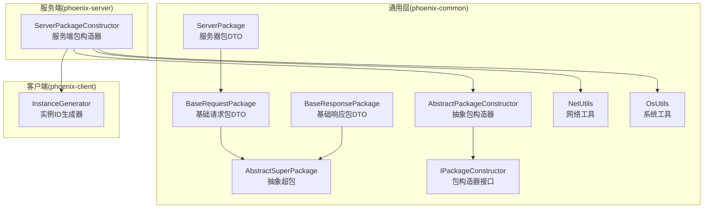
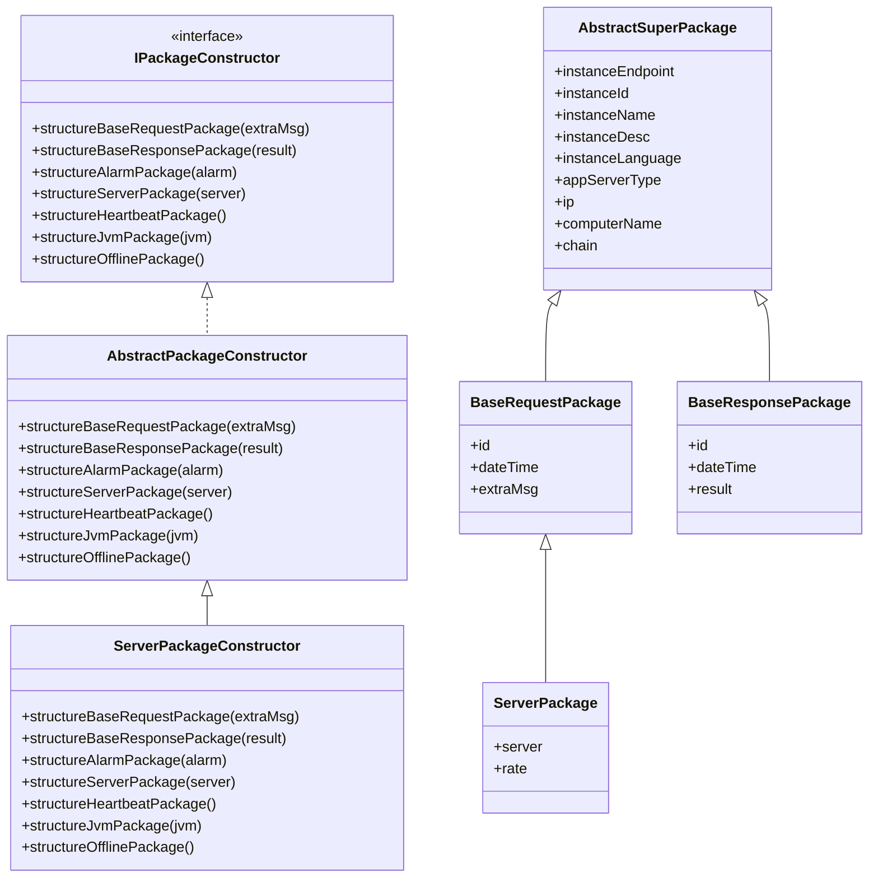
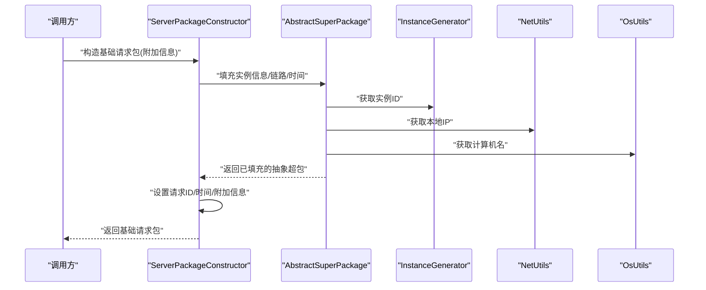
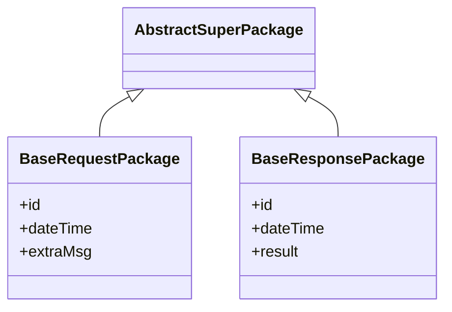
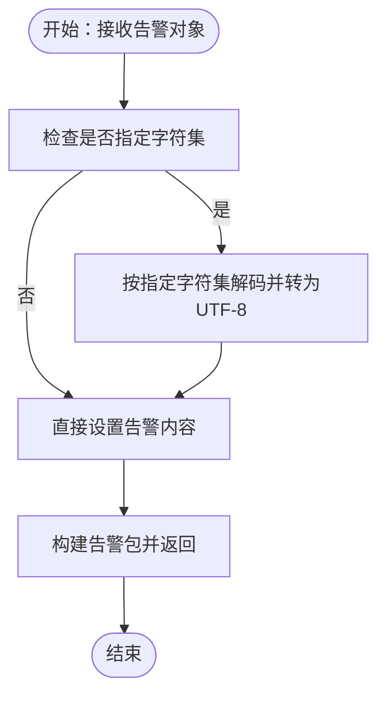
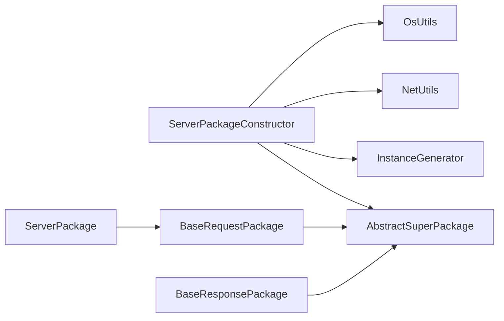

# 数据包构造与组装

<cite>
**本文引用的文件**
- [AbstractPackageConstructor.java](file://phoenix-common/phoenix-common-core/src/main/java/com/gitee/pifeng/monitoring/common/abs/AbstractPackageConstructor.java)
- [ServerPackageConstructor.java](file://phoenix-server/src/main/java/com/gitee/pifeng/monitoring/server/business/server/core/ServerPackageConstructor.java)
- [BaseRequestPackage.java](file://phoenix-common/phoenix-common-core/src/main/java/com/gitee/pifeng/monitoring/common/dto/BaseRequestPackage.java)
- [BaseResponsePackage.java](file://phoenix-common/phoenix-common-core/src/main/java/com/gitee/pifeng/monitoring/common/dto/BaseResponsePackage.java)
- [ServerPackage.java](file://phoenix-common/phoenix-common-core/src/main/java/com/gitee/pifeng/monitoring/common/dto/ServerPackage.java)
- [AbstractSuperPackage.java](file://phoenix-common/phoenix-common-core/src/main/java/com/gitee/pifeng/monitoring/common/abs/AbstractSuperPackage.java)
- [IPackageConstructor.java](file://phoenix-common/phoenix-common-core/src/main/java/com/gitee/pifeng/monitoring/common/inf/IPackageConstructor.java)
- [NetUtils.java](file://phoenix-common/phoenix-common-core/src/main/java/com/gitee/pifeng/monitoring/common/util/server/NetUtils.java)
- [OsUtils.java](file://phoenix-common/phoenix-common-core/src/main/java/com/gitee/pifeng/monitoring/common/util/server/OsUtils.java)
- [InstanceGenerator.java](file://phoenix-client/phoenix-client-core/src/main/java/com/gitee/pifeng/monitoring/plug/core/InstanceGenerator.java)
</cite>

## 目录
1. [引言](#引言)
2. [项目结构](#项目结构)
3. [核心组件](#核心组件)
4. [架构总览](#架构总览)
5. [详细组件分析](#详细组件分析)
6. [依赖分析](#依赖分析)
7. [性能考虑](#性能考虑)
8. [故障排查指南](#故障排查指南)
9. [结论](#结论)
10. [附录](#附录)

## 引言
本文件围绕“数据包构造与组装”主题，系统性阐述服务端数据包构造器 ServerPackageConstructor 的核心职责与实现方式，解析其如何将原始监控数据（如服务器、告警、心跳等）转换为统一的标准数据包格式；同时深入说明抽象基类 AbstractPackageConstructor 的设计理念与继承关系，梳理基础请求包、基础响应包与告警包的构造流程，并覆盖实例信息、链路信息、时间戳、字符集处理等关键字段的填充机制，最后给出验证与校验流程、最佳实践与性能优化建议。

## 项目结构
本功能主要分布在以下模块与包中：
- 抽象层：phoenix-common/common-core 中的抽象类与接口定义
- 实现层：phoenix-server 中的服务端包构造器
- DTO 层：phoenix-common/common-core 中的数据传输对象
- 工具层：phoenix-common/common-core 中的网络与操作系统工具类
- 客户端实例标识：phoenix-client/client-core 中的实例生成器

图表来源
- [AbstractPackageConstructor.java:1-133](file://phoenix-common/phoenix-common-core/src/main/java/com/gitee/pifeng/monitoring/common/abs/AbstractPackageConstructor.java#L1-L133)
- [ServerPackageConstructor.java:1-212](file://phoenix-server/src/main/java/com/gitee/pifeng/monitoring/server/business/server/core/ServerPackageConstructor.java#L1-L212)
- [BaseRequestPackage.java:1-42](file://phoenix-common/phoenix-common-core/src/main/java/com/gitee/pifeng/monitoring/common/dto/BaseRequestPackage.java#L1-L42)
- [BaseResponsePackage.java:1-42](file://phoenix-common/phoenix-common-core/src/main/java/com/gitee/pifeng/monitoring/common/dto/BaseResponsePackage.java#L1-L42)
- [ServerPackage.java:1-34](file://phoenix-common/phoenix-common-core/src/main/java/com/gitee/pifeng/monitoring/common/dto/ServerPackage.java#L1-L34)
- [AbstractSuperPackage.java](file://phoenix-common/phoenix-common-core/src/main/java/com/gitee/pifeng/monitoring/common/abs/AbstractSuperPackage.java)
- [IPackageConstructor.java](file://phoenix-common/phoenix-common-core/src/main/java/com/gitee/pifeng/monitoring/common/inf/IPackageConstructor.java)
- [NetUtils.java](file://phoenix-common/phoenix-common-core/src/main/java/com/gitee/pifeng/monitoring/common/util/server/NetUtils.java)
- [OsUtils.java](file://phoenix-common/phoenix-common-core/src/main/java/com/gitee/pifeng/monitoring/common/util/server/OsUtils.java)
- [InstanceGenerator.java](file://phoenix-client/phoenix-client-core/src/main/java/com/gitee/pifeng/monitoring/plug/core/InstanceGenerator.java)

章节来源
- [AbstractPackageConstructor.java:1-133](file://phoenix-common/phoenix-common-core/src/main/java/com/gitee/pifeng/monitoring/common/abs/AbstractPackageConstructor.java#L1-L133)
- [ServerPackageConstructor.java:1-212](file://phoenix-server/src/main/java/com/gitee/pifeng/monitoring/server/business/server/core/ServerPackageConstructor.java#L1-L212)

## 核心组件
- 抽象包构造器 AbstractPackageConstructor：提供包构造器接口的默认空实现，便于子类按需覆盖具体方法，降低重复代码。
- 服务端包构造器 ServerPackageConstructor：继承自抽象包构造器，负责实际的数据包组装，包括实例信息、链路信息、时间戳、字符集处理等。
- 基础请求包 BaseRequestPackage：承载请求场景下的公共字段（ID、时间、附加信息），作为多种业务包的父类。
- 基础响应包 BaseResponsePackage：承载响应场景下的公共字段（ID、时间、返回结果），用于统一响应格式。
- 服务器包 ServerPackage：在基础请求包基础上扩展服务器监控数据与传输频率。
- 抽象超包 AbstractSuperPackage：定义实例端点、实例ID、实例名、实例描述、语言、应用服务器类型、IP、主机名、链路等通用字段。
- 包构造器接口 IPackageConstructor：定义各类包的构造方法签名，约束实现行为。
- 工具类：NetUtils 提供本地IP获取，OsUtils 提供计算机名获取，InstanceGenerator 提供实例ID生成。

章节来源
- [AbstractPackageConstructor.java:1-133](file://phoenix-common/phoenix-common-core/src/main/java/com/gitee/pifeng/monitoring/common/abs/AbstractPackageConstructor.java#L1-L133)
- [ServerPackageConstructor.java:1-212](file://phoenix-server/src/main/java/com/gitee/pifeng/monitoring/server/business/server/core/ServerPackageConstructor.java#L1-L212)
- [BaseRequestPackage.java:1-42](file://phoenix-common/phoenix-common-core/src/main/java/com/gitee/pifeng/monitoring/common/dto/BaseRequestPackage.java#L1-L42)
- [BaseResponsePackage.java:1-42](file://phoenix-common/phoenix-common-core/src/main/java/com/gitee/pifeng/monitoring/common/dto/BaseResponsePackage.java#L1-L42)
- [ServerPackage.java:1-34](file://phoenix-common/phoenix-common-core/src/main/java/com/gitee/pifeng/monitoring/common/dto/ServerPackage.java#L1-L34)
- [AbstractSuperPackage.java](file://phoenix-common/phoenix-common-core/src/main/java/com/gitee/pifeng/monitoring/common/abs/AbstractSuperPackage.java)
- [IPackageConstructor.java](file://phoenix-common/phoenix-common-core/src/main/java/com/gitee/pifeng/monitoring/common/inf/IPackageConstructor.java)
- [NetUtils.java](file://phoenix-common/phoenix-common-core/src/main/java/com/gitee/pifeng/monitoring/common/util/server/NetUtils.java)
- [OsUtils.java](file://phoenix-common/phoenix-common-core/src/main/java/com/gitee/pifeng/monitoring/common/util/server/OsUtils.java)
- [InstanceGenerator.java](file://phoenix-client/phoenix-client-core/src/main/java/com/gitee/pifeng/monitoring/plug/core/InstanceGenerator.java)

## 架构总览
服务端包构造器 ServerPackageConstructor 通过组合抽象超包 AbstractSuperPackage 的通用字段，结合工具类与配置加载器，完成实例信息、链路信息、时间戳等关键字段的填充；随后根据业务场景分别构造基础请求包、基础响应包与告警包，确保所有包具备一致的元数据与可追溯性。

图表来源
- [IPackageConstructor.java](file://phoenix-common/phoenix-common-core/src/main/java/com/gitee/pifeng/monitoring/common/inf/IPackageConstructor.java)
- [AbstractPackageConstructor.java:1-133](file://phoenix-common/phoenix-common-core/src/main/java/com/gitee/pifeng/monitoring/common/abs/AbstractPackageConstructor.java#L1-L133)
- [ServerPackageConstructor.java:1-212](file://phoenix-server/src/main/java/com/gitee/pifeng/monitoring/server/business/server/core/ServerPackageConstructor.java#L1-L212)
- [AbstractSuperPackage.java](file://phoenix-common/phoenix-common-core/src/main/java/com/gitee/pifeng/monitoring/common/abs/AbstractSuperPackage.java)
- [BaseRequestPackage.java:1-42](file://phoenix-common/phoenix-common-core/src/main/java/com/gitee/pifeng/monitoring/common/dto/BaseRequestPackage.java#L1-L42)
- [BaseResponsePackage.java:1-42](file://phoenix-common/phoenix-common-core/src/main/java/com/gitee/pifeng/monitoring/common/dto/BaseResponsePackage.java#L1-L42)
- [ServerPackage.java:1-34](file://phoenix-common/phoenix-common-core/src/main/java/com/gitee/pifeng/monitoring/common/dto/ServerPackage.java#L1-L34)

## 详细组件分析

### 抽象包构造器 AbstractPackageConstructor
- 设计理念：以接口约束方法签名，以抽象类提供默认空实现，子类仅覆盖所需方法，降低实现成本并保持一致性。
- 继承关系：实现 IPackageConstructor 接口，被 ServerPackageConstructor 等具体实现类继承。
- 职责范围：声明基础请求包、基础响应包、告警包、服务器包、心跳包、JVM包、下线包的构造方法，便于统一调用入口。

章节来源
- [AbstractPackageConstructor.java:1-133](file://phoenix-common/phoenix-common-core/src/main/java/com/gitee/pifeng/monitoring/common/abs/AbstractPackageConstructor.java#L1-L133)
- [IPackageConstructor.java](file://phoenix-common/phoenix-common-core/src/main/java/com/gitee/pifeng/monitoring/common/inf/IPackageConstructor.java)

### 服务端包构造器 ServerPackageConstructor
- 核心职责：将原始监控数据转换为标准数据包格式，填充实例信息、链路信息、时间戳、字符集等关键字段。
- 关键方法：
  - 构造基础请求包：设置ID、时间、附加信息，并复用抽象超包填充逻辑。
  - 构造基础响应包：设置ID、时间、返回结果，并复用抽象超包填充逻辑。
  - 构造告警包：先进行字符集转换（若告警标题或消息指定字符集，则转为UTF-8），再填充告警内容。
  - 构造服务器包：在基础请求包基础上扩展服务器监控数据与传输频率。
- 字段填充机制：
  - 实例信息：端点类型、实例ID、实例名、实例描述、语言、应用服务器类型、IP、主机名。
  - 链路信息：网络链路（IP）、应用实例链路（实例ID）、时间链路（毫秒时间戳）。
  - 时间戳：请求/响应时间使用当前时间。
  - 字符集处理：告警包在字符集存在时进行编码转换，确保统一UTF-8存储与传输。

图表来源
- [ServerPackageConstructor.java:96-139](file://phoenix-server/src/main/java/com/gitee/pifeng/monitoring/server/business/server/core/ServerPackageConstructor.java#L96-L139)
- [AbstractSuperPackage.java](file://phoenix-common/phoenix-common-core/src/main/java/com/gitee/pifeng/monitoring/common/abs/AbstractSuperPackage.java)
- [InstanceGenerator.java](file://phoenix-client/phoenix-client-core/src/main/java/com/gitee/pifeng/monitoring/plug/core/InstanceGenerator.java)
- [NetUtils.java](file://phoenix-common/phoenix-common-core/src/main/java/com/gitee/pifeng/monitoring/common/util/server/NetUtils.java)
- [OsUtils.java](file://phoenix-common/phoenix-common-core/src/main/java/com/gitee/pifeng/monitoring/common/util/server/OsUtils.java)

章节来源
- [ServerPackageConstructor.java:1-212](file://phoenix-server/src/main/java/com/gitee/pifeng/monitoring/server/business/server/core/ServerPackageConstructor.java#L1-L212)

### 基础请求包与基础响应包
- 基础请求包 BaseRequestPackage：包含ID、时间、附加信息，作为请求场景的统一载体。
- 基础响应包 BaseResponsePackage：包含ID、时间、返回结果，作为响应场景的统一载体。
- 继承关系：两者均继承自抽象超包，共享实例信息、链路信息等元数据。

图表来源
- [BaseRequestPackage.java:1-42](file://phoenix-common/phoenix-common-core/src/main/java/com/gitee/pifeng/monitoring/common/dto/BaseRequestPackage.java#L1-L42)
- [BaseResponsePackage.java:1-42](file://phoenix-common/phoenix-common-core/src/main/java/com/gitee/pifeng/monitoring/common/dto/BaseResponsePackage.java#L1-L42)
- [AbstractSuperPackage.java](file://phoenix-common/phoenix-common-core/src/main/java/com/gitee/pifeng/monitoring/common/abs/AbstractSuperPackage.java)

章节来源
- [BaseRequestPackage.java:1-42](file://phoenix-common/phoenix-common-core/src/main/java/com/gitee/pifeng/monitoring/common/dto/BaseRequestPackage.java#L1-L42)
- [BaseResponsePackage.java:1-42](file://phoenix-common/phoenix-common-core/src/main/java/com/gitee/pifeng/monitoring/common/dto/BaseResponsePackage.java#L1-L42)

### 告警包的特殊处理逻辑
- 字符集转换：当告警对象携带字符集信息时，标题与消息会按该字符集解码后以UTF-8重新编码，确保后续处理与传输的一致性。
- 告警包构建：在完成字符集转换后，填充告警内容并返回告警包对象。

图表来源
- [ServerPackageConstructor.java:175-190](file://phoenix-server/src/main/java/com/gitee/pifeng/monitoring/server/business/server/core/ServerPackageConstructor.java#L175-L190)

章节来源
- [ServerPackageConstructor.java:175-190](file://phoenix-server/src/main/java/com/gitee/pifeng/monitoring/server/business/server/core/ServerPackageConstructor.java#L175-L190)

### 服务器包的扩展
- 在基础请求包之上增加服务器监控数据与传输频率字段，满足服务器维度监控数据的封装需求。

章节来源
- [ServerPackage.java:1-34](file://phoenix-common/phoenix-common-core/src/main/java/com/gitee/pifeng/monitoring/common/dto/ServerPackage.java#L1-L34)

## 依赖分析
- 组件耦合：
  - ServerPackageConstructor 依赖抽象超包与工具类，保证实例信息、链路信息、时间戳等字段的一致性与可追溯性。
  - DTO 层（BaseRequestPackage、BaseResponsePackage、ServerPackage）通过继承抽象超包形成清晰的层次关系。
- 外部依赖：
  - 工具类 NetUtils、OsUtils 提供网络与系统信息。
  - InstanceGenerator 提供实例ID生成能力。
- 可能的循环依赖：
  - 当前结构未见循环依赖迹象，抽象层与实现层分离良好。

图表来源
- [ServerPackageConstructor.java:1-212](file://phoenix-server/src/main/java/com/gitee/pifeng/monitoring/server/business/server/core/ServerPackageConstructor.java#L1-L212)
- [AbstractSuperPackage.java](file://phoenix-common/phoenix-common-core/src/main/java/com/gitee/pifeng/monitoring/common/abs/AbstractSuperPackage.java)
- [BaseRequestPackage.java:1-42](file://phoenix-common/phoenix-common-core/src/main/java/com/gitee/pifeng/monitoring/common/dto/BaseRequestPackage.java#L1-L42)
- [BaseResponsePackage.java:1-42](file://phoenix-common/phoenix-common-core/src/main/java/com/gitee/pifeng/monitoring/common/dto/BaseResponsePackage.java#L1-L42)
- [ServerPackage.java:1-34](file://phoenix-common/phoenix-common-core/src/main/java/com/gitee/pifeng/monitoring/common/dto/ServerPackage.java#L1-L34)
- [InstanceGenerator.java](file://phoenix-client/phoenix-client-core/src/main/java/com/gitee/pifeng/monitoring/plug/core/InstanceGenerator.java)
- [NetUtils.java](file://phoenix-common/phoenix-common-core/src/main/java/com/gitee/pifeng/monitoring/common/util/server/NetUtils.java)
- [OsUtils.java](file://phoenix-common/phoenix-common-core/src/main/java/com/gitee/pifeng/monitoring/common/util/server/OsUtils.java)

章节来源
- [ServerPackageConstructor.java:1-212](file://phoenix-server/src/main/java/com/gitee/pifeng/monitoring/server/business/server/core/ServerPackageConstructor.java#L1-L212)
- [AbstractPackageConstructor.java:1-133](file://phoenix-common/phoenix-common-core/src/main/java/com/gitee/pifeng/monitoring/common/abs/AbstractPackageConstructor.java#L1-L133)

## 性能考虑
- 字符集转换开销：告警包的字符集转换仅在告警对象携带字符集时触发，避免不必要的编码解码操作。
- 链路信息去重：链路集合采用有序集合结构，有助于减少重复IP、实例ID与时间戳的插入成本。
- 时间戳精度：使用毫秒级时间戳，兼顾精度与序列化效率。
- 工具类调用：网络与系统信息获取为轻量级操作，通常不会成为瓶颈；建议在批量构造时复用已获取的实例ID与IP，减少重复计算。

## 故障排查指南
- 网络信息异常：当无法获取本地IP或计算机名时，相关方法可能抛出网络异常。请检查网络环境与工具类可用性。
- 字符集不匹配：若告警标题或消息出现乱码，请确认告警对象的字符集设置是否正确，确保转换流程生效。
- 实例ID缺失：若实例ID为空，请检查实例生成器配置与初始化状态。
- 链路信息异常：若链路集合为空或顺序异常，请检查链路信息的填充逻辑与集合初始化。

章节来源
- [ServerPackageConstructor.java:54-83](file://phoenix-server/src/main/java/com/gitee/pifeng/monitoring/server/business/server/core/ServerPackageConstructor.java#L54-L83)
- [NetUtils.java](file://phoenix-common/phoenix-common-core/src/main/java/com/gitee/pifeng/monitoring/common/util/server/NetUtils.java)
- [OsUtils.java](file://phoenix-common/phoenix-common-core/src/main/java/com/gitee/pifeng/monitoring/common/util/server/OsUtils.java)
- [InstanceGenerator.java](file://phoenix-client/phoenix-client-core/src/main/java/com/gitee/pifeng/monitoring/plug/core/InstanceGenerator.java)

## 结论
ServerPackageConstructor 通过抽象超包与工具类的协同，实现了对原始监控数据到标准数据包的高效转换；抽象包构造器模式降低了实现复杂度，提升了可维护性；字符集转换、链路信息与时间戳填充等关键机制保障了数据的完整性与一致性。遵循本文的最佳实践与性能建议，可进一步提升数据包构造的稳定性与效率。

## 附录
- 最佳实践：
  - 明确区分请求包与响应包的构造场景，避免混用字段。
  - 对于告警包，优先显式设置字符集，确保跨系统兼容性。
  - 批量构造时尽量复用实例ID与IP，减少重复计算。
  - 在高并发场景下，注意链路集合的线程安全与去重策略。
- 验证与校验：
  - 校验实例信息与链路信息是否完整。
  - 校验时间戳是否合理且单调递增。
  - 校验字符集转换后的告警标题与消息编码是否正确。
  - 校验包ID唯一性与格式规范。