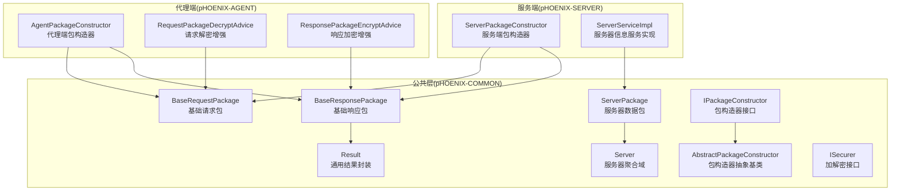
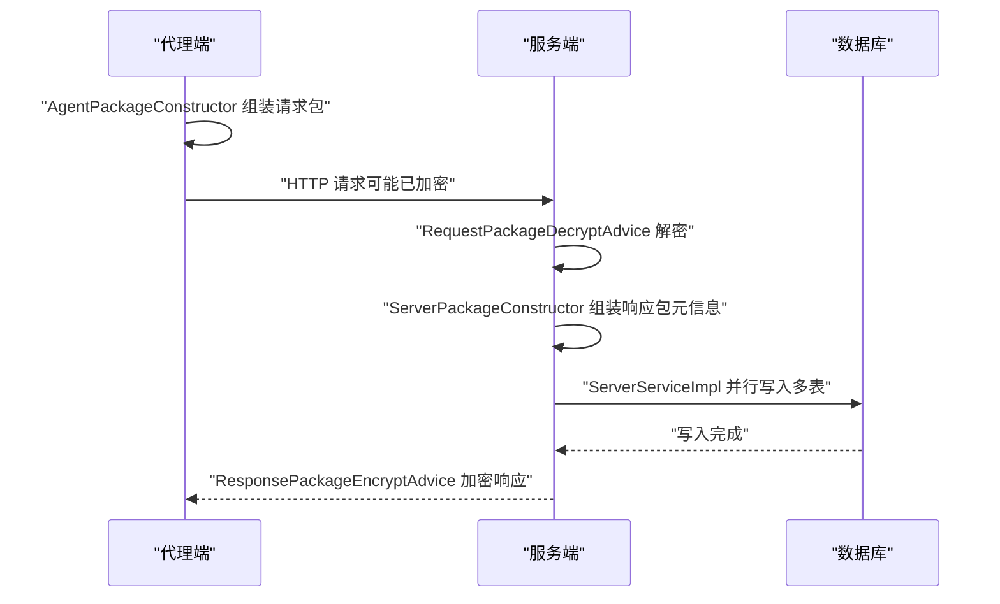
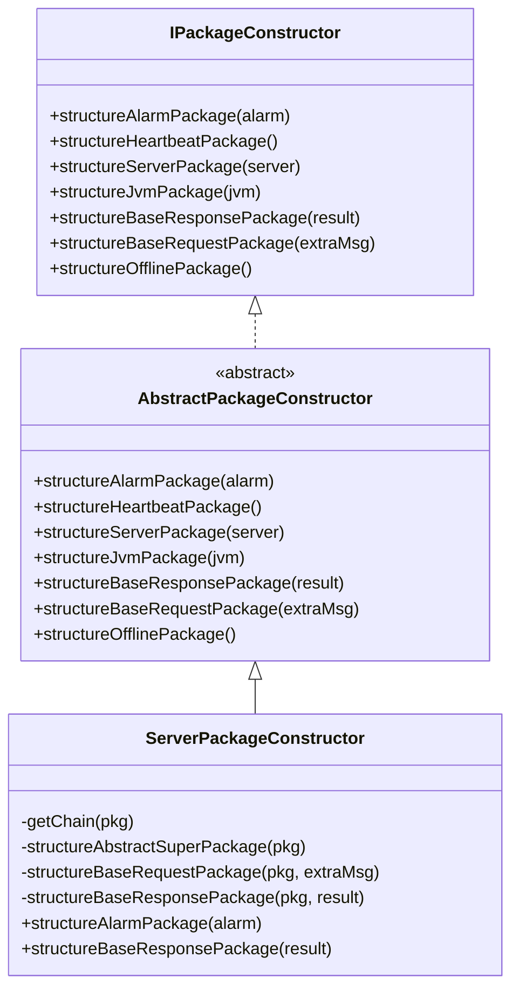
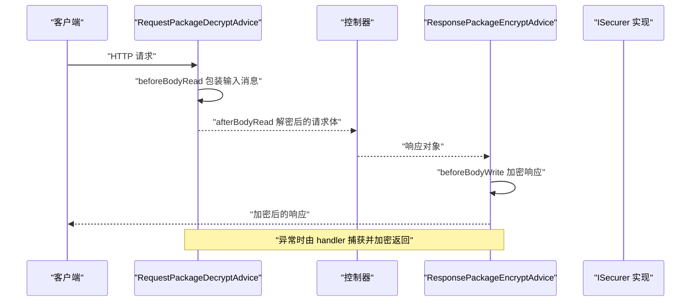
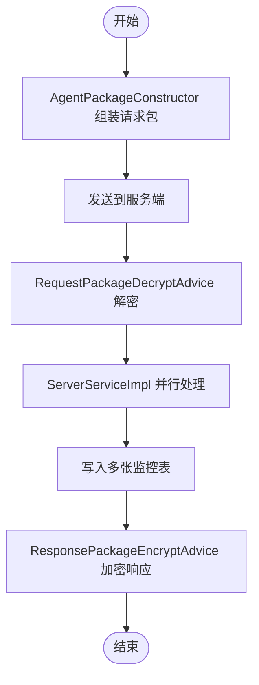
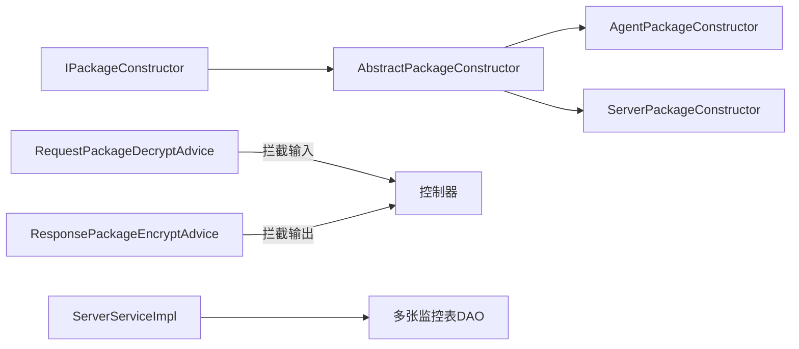
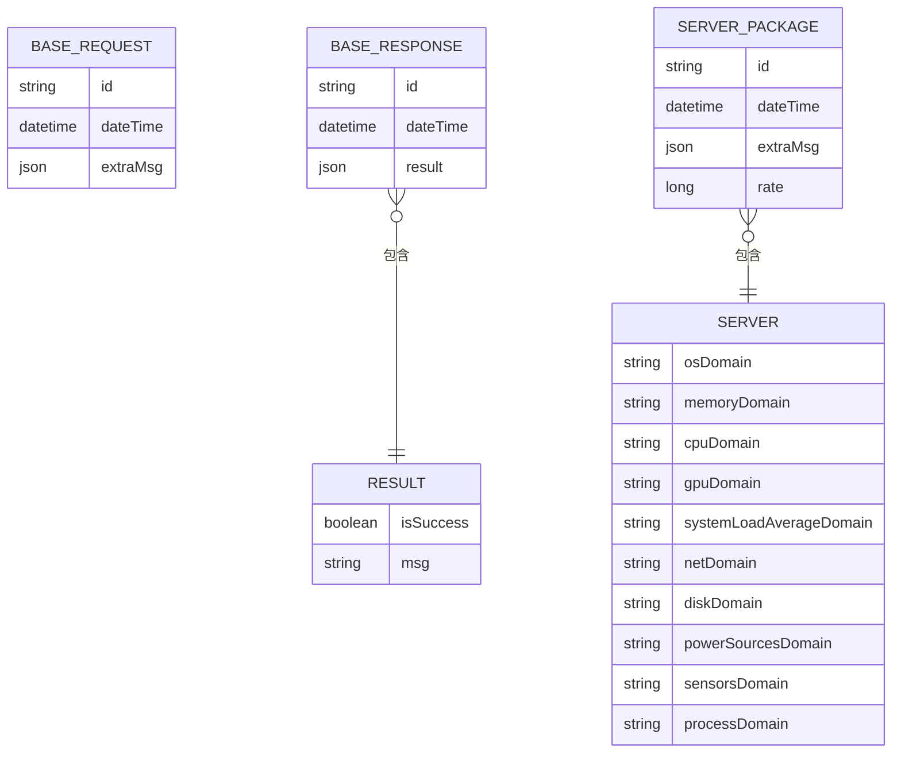

# 数据处理流水线

<cite>
**本文引用的文件**
- [ServerPackage.java](file://phoenix-common\phoenix-common-core\src\main\java\com\gitee\pifeng\monitoring\common\dto\ServerPackage.java)
- [BaseRequestPackage.java](file://phoenix-common\phoenix-common-core\src\main\java\com\gitee\pifeng\monitoring\common\dto\BaseRequestPackage.java)
- [BaseResponsePackage.java](file://phoenix-common\phoenix-common-core\src\main\java\com\gitee\pifeng\monitoring\common\dto\BaseResponsePackage.java)
- [AbstractPackageConstructor.java](file://phoenix-common\phoenix-common-core\src\main\java\com\gitee\pifeng\monitoring\common\abs\AbstractPackageConstructor.java)
- [IPackageConstructor.java](file://phoenix-common\phoenix-common-core\src\main\java\com\gitee\pifeng\monitoring\common\inf\IPackageConstructor.java)
- [ServerPackageConstructor.java](file://phoenix-server\src\main\java\com\gitee\pifeng\monitoring\server\business\server\core\ServerPackageConstructor.java)
- [AgentPackageConstructor.java](file://phoenix-agent\src\main\java\com\gitee\pifeng\monitoring\agent\core\AgentPackageConstructor.java)
- [RequestPackageDecryptAdvice.java](file://phoenix-agent\src\main\java\com\gitee\pifeng\monitoring\agent\component\RequestPackageDecryptAdvice.java)
- [ResponsePackageEncryptAdvice.java](file://phoenix-agent\src\main\java\com\gitee\pifeng\monitoring\agent\component\ResponsePackageEncryptAdvice.java)
- [ServerServiceImpl.java](file://phoenix-server\src\main\java\com\gitee\pifeng\monitoring\server\business\server\service\impl\ServerServiceImpl.java)
- [Server.java](file://phoenix-common\phoenix-common-core\src\main\java\com\gitee\pifeng\monitoring\common\domain\Server.java)
- [Result.java](file://phoenix-common\phoenix-common-core\src\main\java\com\gitee\pifeng\monitoring\common\domain\Result.java)
- [ISecurer.java](file://phoenix-common\phoenix-common-core\src\main\java\com\gitee\pifeng\monitoring\common\inf\ISecurer.java)
</cite>

## 目录
1. [引言](#引言)
2. [项目结构](#项目结构)
3. [核心组件](#核心组件)
4. [架构总览](#架构总览)
5. [详细组件分析](#详细组件分析)
6. [依赖分析](#依赖分析)
7. [性能考虑](#性能考虑)
8. [故障排查指南](#故障排查指南)
9. [结论](#结论)
10. [附录](#附录)

## 引言
本技术文档围绕“监控数据处理流水线”展开，系统性阐述从数据包接收、解密验证、格式转换到最终存储的完整流程。重点说明 ServerPackageConstructor 的作用与职责，涵盖数据包的组装、解析、验证等核心能力；解释请求解密与响应加密的实现机制（含接口契约与扩展点），以及安全传输相关的设计；介绍数据处理中间环节（清洗、标准化、异常处理）；梳理数据在各阶段的流转（代理端传输、服务端接收、内存缓存、数据库持久化）；给出性能优化策略（批量、异步、缓存）与监控调试方法，帮助开发者快速定位问题。

## 项目结构
该项目采用多模块分层架构，核心模块包括：
- phoenix-common：公共模型、DTO、接口与工具
- phoenix-agent：监控代理端，负责采集与上报
- phoenix-server：服务端，负责接收、处理与持久化
- phoenix-ui：前端界面，用于展示与配置
- phoenix-client：客户端SDK，提供埋点与发送能力

图表来源
- [ServerPackage.java:1-34](file://phoenix-common\phoenix-common-core\src\main\java\com\gitee\pifeng\monitoring\common\dto\ServerPackage.java#L1-L34)
- [BaseRequestPackage.java:1-42](file://phoenix-common\phoenix-common-core\src\main\java\com\gitee\pifeng\monitoring\common\dto\BaseRequestPackage.java#L1-L42)
- [BaseResponsePackage.java:1-42](file://phoenix-common\phoenix-common-core\src\main\java\com\gitee\pifeng\monitoring\common\dto\BaseResponsePackage.java#L1-L42)
- [IPackageConstructor.java:1-114](file://phoenix-common\phoenix-common-core\src\main\java\com\gitee\pifeng\monitoring\common\inf\IPackageConstructor.java#L1-L114)
- [AbstractPackageConstructor.java:1-133](file://phoenix-common\phoenix-common-core\src\main\java\com\gitee\pifeng\monitoring\common\abs\AbstractPackageConstructor.java#L1-L133)
- [ServerPackageConstructor.java:1-212](file://phoenix-server\src\main\java\com\gitee\pifeng\monitoring\server\business\server\core\ServerPackageConstructor.java#L1-L212)
- [AgentPackageConstructor.java:1-202](file://phoenix-agent\src\main\java\com\gitee\pifeng\monitoring\agent\core\AgentPackageConstructor.java#L1-L202)
- [RequestPackageDecryptAdvice.java:1-56](file://phoenix-agent\src\main\java\com\gitee\pifeng\monitoring\agent\component\RequestPackageDecryptAdvice.java#L1-L56)
- [ResponsePackageEncryptAdvice.java:1-84](file://phoenix-agent\src\main\java\com\gitee\pifeng\monitoring\agent\component\ResponsePackageEncryptAdvice.java#L1-L84)
- [ServerServiceImpl.java:1-345](file://phoenix-server\src\main\java\com\gitee\pifeng\monitoring\server\business\server\service\impl\ServerServiceImpl.java#L1-L345)
- [Server.java:1-76](file://phoenix-common\phoenix-common-core\src\main\java\com\gitee\pifeng\monitoring\common\domain\Server.java#L1-L76)
- [Result.java:1-35](file://phoenix-common\phoenix-common-core\src\main\java\com\gitee\pifeng\monitoring\common\domain\Result.java#L1-L35)
- [ISecurer.java:1-66](file://phoenix-common\phoenix-common-core\src\main\java\com\gitee\pifeng\monitoring\common\inf\ISecurer.java#L1-L66)

章节来源
- [ServerPackage.java:1-34](file://phoenix-common\phoenix-common-core\src\main\java\com\gitee\pifeng\monitoring\common\dto\ServerPackage.java#L1-L34)
- [BaseRequestPackage.java:1-42](file://phoenix-common\phoenix-common-core\src\main\java\com\gitee\pifeng\monitoring\common\dto\BaseRequestPackage.java#L1-L42)
- [BaseResponsePackage.java:1-42](file://phoenix-common\phoenix-common-core\src\main\java\com\gitee\pifeng\monitoring\common\dto\BaseResponsePackage.java#L1-L42)
- [IPackageConstructor.java:1-114](file://phoenix-common\phoenix-common-core\src\main\java\com\gitee\pifeng\monitoring\common\inf\IPackageConstructor.java#L1-L114)
- [AbstractPackageConstructor.java:1-133](file://phoenix-common\phoenix-common-core\src\main\java\com\gitee\pifeng\monitoring\common\abs\AbstractPackageConstructor.java#L1-L133)
- [ServerPackageConstructor.java:1-212](file://phoenix-server\src\main\java\com\gitee\pifeng\monitoring\server\business\server\core\ServerPackageConstructor.java#L1-L212)
- [AgentPackageConstructor.java:1-202](file://phoenix-agent\src\main\java\com\gitee\pifeng\monitoring\agent\core\AgentPackageConstructor.java#L1-L202)
- [RequestPackageDecryptAdvice.java:1-56](file://phoenix-agent\src\main\java\com\gitee\pifeng\monitoring\agent\component\RequestPackageDecryptAdvice.java#L1-L56)
- [ResponsePackageEncryptAdvice.java:1-84](file://phoenix-agent\src\main\java\com\gitee\pifeng\monitoring\agent\component\ResponsePackageEncryptAdvice.java#L1-L84)
- [ServerServiceImpl.java:1-345](file://phoenix-server\src\main\java\com\gitee\pifeng\monitoring\server\business\server\service\impl\ServerServiceImpl.java#L1-L345)
- [Server.java:1-76](file://phoenix-common\phoenix-common-core\src\main\java\com\gitee\pifeng\monitoring\common\domain\Server.java#L1-L76)
- [Result.java:1-35](file://phoenix-common\phoenix-common-core\src\main\java\com\gitee\pifeng\monitoring\common\domain\Result.java#L1-L35)
- [ISecurer.java:1-66](file://phoenix-common\phoenix-common-core\src\main\java\com\gitee\pifeng\monitoring\common\inf\ISecurer.java#L1-L66)

## 核心组件
- 包构造器接口与抽象基类
  - IPackageConstructor 定义了多种数据包的构造方法，统一了不同端点的包生成规范。
  - AbstractPackageConstructor 提供默认空实现，具体端点（代理端/服务端）按需覆盖关键方法。
- 代理端包构造器 AgentPackageConstructor
  - 负责为代理端生成统一的数据包元信息（实例标识、端点类型、链路信息、时间戳等），并支持基础请求/响应包的构造。
- 服务端包构造器 ServerPackageConstructor
  - 负责为服务端生成统一的数据包元信息，并提供告警包与基础响应包的构造逻辑。
- 数据包模型
  - BaseRequestPackage/BaseResponsePackage：统一的请求/响应包头字段（ID、时间、附加信息/结果）。
  - ServerPackage：服务器监控数据包，承载 Server 聚合域与传输频率。
  - Server：服务器多维度指标聚合（OS、内存、CPU、GPU、负载、网卡、磁盘、电源、传感器、进程等）。
  - Result：通用结果封装（是否成功、消息）。
- 安全组件
  - RequestPackageDecryptAdvice：拦截HTTP输入消息，执行请求包解密增强。
  - ResponsePackageEncryptAdvice：拦截HTTP输出消息，执行响应包加密增强。
  - ISecurer：加解密接口契约，定义字符串与字节数组的加解密方法。

章节来源
- [IPackageConstructor.java:22-113](file://phoenix-common\phoenix-common-core\src\main\java\com\gitee\pifeng\monitoring\common\inf\IPackageConstructor.java#L22-L113)
- [AbstractPackageConstructor.java:20-132](file://phoenix-common\phoenix-common-core\src\main\java\com\gitee\pifeng\monitoring\common\abs\AbstractPackageConstructor.java#L20-L132)
- [AgentPackageConstructor.java:41-200](file://phoenix-agent\src\main\java\com\gitee\pifeng\monitoring\agent\core\AgentPackageConstructor.java#L41-L200)
- [ServerPackageConstructor.java:40-211](file://phoenix-server\src\main\java\com\gitee\pifeng\monitoring\server\business\server\core\ServerPackageConstructor.java#L40-L211)
- [BaseRequestPackage.java:24-41](file://phoenix-common\phoenix-common-core\src\main\java\com\gitee\pifeng\monitoring\common\dto\BaseRequestPackage.java#L24-L41)
- [BaseResponsePackage.java:24-41](file://phoenix-common\phoenix-common-core\src\main\java\com\gitee\pifeng\monitoring\common\dto\BaseResponsePackage.java#L24-L41)
- [ServerPackage.java:21-33](file://phoenix-common\phoenix-common-core\src\main\java\com\gitee\pifeng\monitoring\common\dto\ServerPackage.java#L21-L33)
- [Server.java:23-75](file://phoenix-common\phoenix-common-core\src\main\java\com\gitee\pifeng\monitoring\common\domain\Server.java#L23-L75)
- [Result.java:22-34](file://phoenix-common\phoenix-common-core\src\main\java\com\gitee\pifeng\monitoring\common\domain\Result.java#L22-L34)
- [RequestPackageDecryptAdvice.java:26-55](file://phoenix-agent\src\main\java\com\gitee\pifeng\monitoring\agent\component\RequestPackageDecryptAdvice.java#L26-L55)
- [ResponsePackageEncryptAdvice.java:36-83](file://phoenix-agent\src\main\java\com\gitee\pifeng\monitoring\agent\component\ResponsePackageEncryptAdvice.java#L36-L83)
- [ISecurer.java:13-65](file://phoenix-common\phoenix-common-core\src\main\java\com\gitee\pifeng\monitoring\common\inf\ISecurer.java#L13-L65)

## 架构总览
数据处理流水线自上而下的关键路径如下：
- 代理端采集与打包：AgentPackageConstructor 组装请求包元信息，结合业务数据生成统一格式。
- 安全传输：RequestPackageDecryptAdvice 对请求进行解密增强；ResponsePackageEncryptAdvice 对响应进行加密增强。
- 服务端接收与处理：ServerPackageConstructor 组装服务端元信息；ServerServiceImpl 并行写入多张监控表。
- 存储与历史清理：服务端将数据持久化至数据库，并提供历史记录清理策略。

图表来源
- [AgentPackageConstructor.java:115-135](file://phoenix-agent\src\main\java\com\gitee\pifeng\monitoring\agent\core\AgentPackageConstructor.java#L115-L135)
- [RequestPackageDecryptAdvice.java:50-53](file://phoenix-agent\src\main\java\com\gitee\pifeng\monitoring\agent\component\RequestPackageDecryptAdvice.java#L50-L53)
- [ServerPackageConstructor.java:96-116](file://phoenix-server\src\main\java\com\gitee\pifeng\monitoring\server\business\server\core\ServerPackageConstructor.java#L96-L116)
- [ServerServiceImpl.java:194-247](file://phoenix-server\src\main\java\com\gitee\pifeng\monitoring\server\business\server\service\impl\ServerServiceImpl.java#L194-L247)
- [ResponsePackageEncryptAdvice.java:72-81](file://phoenix-agent\src\main\java\com\gitee\pifeng\monitoring\agent\component\ResponsePackageEncryptAdvice.java#L72-L81)

## 详细组件分析

### ServerPackageConstructor 分析
- 角色与职责
  - 作为服务端包构造器，负责为服务端生成统一的包元信息（实例端点、实例ID、语言、应用服务器类型、IP、计算机名、链路信息等）。
  - 提供告警包与基础响应包的构造方法，确保服务端侧的包结构一致。
- 关键流程
  - 链路信息生成：维护实例链路、网络链路与时间链路，便于追踪数据路径。
  - 元信息填充：依据配置与运行环境自动填充实例与网络信息。
  - 告警包字符集处理：对标题与消息进行字符集转换，保证统一编码。
- 与其他组件的关系
  - 与 IPackageConstructor/AbstractPackageConstructor 保持接口一致性，便于替换与扩展。
  - 与 ServerServiceImpl 协作，生成响应包以反馈处理结果。

图表来源
- [IPackageConstructor.java:22-113](file://phoenix-common\phoenix-common-core\src\main\java\com\gitee\pifeng\monitoring\common\inf\IPackageConstructor.java#L22-L113)
- [AbstractPackageConstructor.java:20-132](file://phoenix-common\phoenix-common-core\src\main\java\com\gitee\pifeng\monitoring\common\abs\AbstractPackageConstructor.java#L20-L132)
- [ServerPackageConstructor.java:40-211](file://phoenix-server\src\main\java\com\gitee\pifeng\monitoring\server\business\server\core\ServerPackageConstructor.java#L40-L211)

章节来源
- [ServerPackageConstructor.java:54-116](file://phoenix-server\src\main\java\com\gitee\pifeng\monitoring\server\business\server\core\ServerPackageConstructor.java#L54-L116)
- [ServerPackageConstructor.java:175-209](file://phoenix-server\src\main\java\com\gitee\pifeng\monitoring\server\business\server\core\ServerPackageConstructor.java#L175-L209)

### 请求解密与响应加密机制
- 请求解密
  - RequestPackageDecryptAdvice 通过拦截 HTTP 输入消息，将原始输入消息包装为可解密的消息体，从而在控制器方法参数解析前完成解密。
- 响应加密
  - ResponsePackageEncryptAdvice 通过拦截 HTTP 输出消息，对响应体进行加密包装；同时提供异常处理器，将异常转为密文响应包，保障错误信息的安全性。
- 加解密接口
  - ISecurer 定义了字符串与字节数组的加解密方法，为具体实现提供契约。

图表来源
- [RequestPackageDecryptAdvice.java:26-55](file://phoenix-agent\src\main\java\com\gitee\pifeng\monitoring\agent\component\RequestPackageDecryptAdvice.java#L26-L55)
- [ResponsePackageEncryptAdvice.java:36-83](file://phoenix-agent\src\main\java\com\gitee\pifeng\monitoring\agent\component\ResponsePackageEncryptAdvice.java#L36-L83)
- [ISecurer.java:13-65](file://phoenix-common\phoenix-common-core\src\main\java\com\gitee\pifeng\monitoring\common\inf\ISecurer.java#L13-L65)

章节来源
- [RequestPackageDecryptAdvice.java:28-53](file://phoenix-agent\src\main\java\com\gitee\pifeng\monitoring\agent\component\RequestPackageDecryptAdvice.java#L28-L53)
- [ResponsePackageEncryptAdvice.java:55-81](file://phoenix-agent\src\main\java\com\gitee\pifeng\monitoring\agent\component\ResponsePackageEncryptAdvice.java#L55-L81)
- [ISecurer.java:26-63](file://phoenix-common\phoenix-common-core\src\main\java\com\gitee\pifeng\monitoring\common\inf\ISecurer.java#L26-L63)

### 数据处理中间环节
- 数据清洗与标准化
  - 告警包字符集处理：在构造告警包时，若源字符集与目标字符集不一致，进行显式转换，确保统一编码。
  - 链路信息标准化：统一维护实例链路、网络链路与时间链路，便于跨模块追踪。
- 异常处理
  - 响应加密增强提供异常捕获处理器，将异常信息封装为密文响应包返回，避免敏感信息泄露。
- 数据包组装与验证
  - 通过包构造器统一设置包头字段（ID、时间、附加信息/结果），并在服务端侧进行链路与元信息校验。

章节来源
- [ServerPackageConstructor.java:180-189](file://phoenix-server\src\main\java\com\gitee\pifeng\monitoring\server\business\server\core\ServerPackageConstructor.java#L180-L189)
- [ResponsePackageEncryptAdvice.java:55-64](file://phoenix-agent\src\main\java\com\gitee\pifeng\monitoring\agent\component\ResponsePackageEncryptAdvice.java#L55-L64)

### 数据流转阶段
- 代理端传输
  - AgentPackageConstructor 组装请求包元信息，结合业务数据生成统一格式。
- 服务端接收
  - RequestPackageDecryptAdvice 对请求进行解密增强，随后进入业务控制器。
- 内存缓存
  - 服务端采用线程池与异步任务进行并行处理，减少阻塞；未见显式外部缓存组件。
- 数据库持久化
  - ServerServiceImpl 并行写入多个监控表，最后汇总返回结果；提供历史记录清理策略。

图表来源
- [AgentPackageConstructor.java:115-135](file://phoenix-agent\src\main\java\com\gitee\pifeng\monitoring\agent\core\AgentPackageConstructor.java#L115-L135)
- [RequestPackageDecryptAdvice.java:50-53](file://phoenix-agent\src\main\java\com\gitee\pifeng\monitoring\agent\component\RequestPackageDecryptAdvice.java#L50-L53)
- [ServerServiceImpl.java:194-247](file://phoenix-server\src\main\java\com\gitee\pifeng\monitoring\server\business\server\service\impl\ServerServiceImpl.java#L194-L247)
- [ResponsePackageEncryptAdvice.java:72-81](file://phoenix-agent\src\main\java\com\gitee\pifeng\monitoring\agent\component\ResponsePackageEncryptAdvice.java#L72-L81)

章节来源
- [ServerServiceImpl.java:190-247](file://phoenix-server\src\main\java\com\gitee\pifeng\monitoring\server\business\server\service\impl\ServerServiceImpl.java#L190-L247)

## 依赖分析
- 接口与实现
  - IPackageConstructor 是包构造器的统一接口；AbstractPackageConstructor 提供默认实现；AgentPackageConstructor 与 ServerPackageConstructor 分别实现代理端与服务端的差异化逻辑。
- 控制器增强
  - RequestPackageDecryptAdvice 与 ResponsePackageEncryptAdvice 通过 Spring MVC Advice 机制，分别在请求输入与响应输出阶段介入，实现解密与加密。
- 业务服务
  - ServerServiceImpl 依赖多个领域服务与 DAO，采用线程池并行写入，提升吞吐。

图表来源
- [IPackageConstructor.java:22-113](file://phoenix-common\phoenix-common-core\src\main\java\com\gitee\pifeng\monitoring\common\inf\IPackageConstructor.java#L22-L113)
- [AbstractPackageConstructor.java:20-132](file://phoenix-common\phoenix-common-core\src\main\java\com\gitee\pifeng\monitoring\common\abs\AbstractPackageConstructor.java#L20-L132)
- [AgentPackageConstructor.java:41-200](file://phoenix-agent\src\main\java\com\gitee\pifeng\monitoring\agent\core\AgentPackageConstructor.java#L41-L200)
- [ServerPackageConstructor.java:40-211](file://phoenix-server\src\main\java\com\gitee\pifeng\monitoring\server\business\server\core\ServerPackageConstructor.java#L40-L211)
- [RequestPackageDecryptAdvice.java:26-55](file://phoenix-agent\src\main\java\com\gitee\pifeng\monitoring\agent\component\RequestPackageDecryptAdvice.java#L26-L55)
- [ResponsePackageEncryptAdvice.java:36-83](file://phoenix-agent\src\main\java\com\gitee\pifeng\monitoring\agent\component\ResponsePackageEncryptAdvice.java#L36-L83)
- [ServerServiceImpl.java:194-247](file://phoenix-server\src\main\java\com\gitee\pifeng\monitoring\server\business\server\service\impl\ServerServiceImpl.java#L194-L247)

章节来源
- [ServerServiceImpl.java:172-176](file://phoenix-server\src\main\java\com\gitee\pifeng\monitoring\server\business\server\service\impl\ServerServiceImpl.java#L172-L176)

## 性能考虑
- 异步与并行
  - 服务端通过线程池与 CompletableFuture 并行处理多个监控维度，显著降低整体延迟。
- 批量与限流
  - 历史清理采用分批删除策略（每类限制条数），避免一次性大事务造成锁争用。
- 缓存策略
  - 代码未发现显式的外部缓存组件；可通过引入本地缓存（如 Guava/Caffeine）缓存热点查询结果，减少数据库压力。
- 线程池调优
  - 建议根据 CPU 核心数与监控指标数量调整线程池大小与队列容量，避免过度上下文切换与内存占用。
- I/O 优化
  - 压缩传输（如 GZIP）与合理的序列化格式（如 JSON/Protobuf）可进一步降低带宽消耗。

## 故障排查指南
- 请求解密失败
  - 检查 RequestPackageDecryptAdvice 的拦截范围与输入消息包装逻辑；确认密钥与算法配置正确。
- 响应加密异常
  - 检查 ResponsePackageEncryptAdvice 的 beforeBodyWrite 与异常处理器；确认加密实现可用且未抛出未捕获异常。
- 并行处理超时
  - 查看 ServerServiceImpl 中的超时配置与线程池状态；必要时增加超时阈值或扩容线程池。
- 数据库写入异常
  - 关注各领域服务的事务边界与重试策略；检查主从延迟与锁等待情况。
- 日志与追踪
  - 利用包构造器生成的链路信息（实例链路、网络链路、时间链路）进行端到端追踪；结合服务端日志定位问题节点。

章节来源
- [RequestPackageDecryptAdvice.java:28-53](file://phoenix-agent\src\main\java\com\gitee\pifeng\monitoring\agent\component\RequestPackageDecryptAdvice.java#L28-L53)
- [ResponsePackageEncryptAdvice.java:55-81](file://phoenix-agent\src\main\java\com\gitee\pifeng\monitoring\agent\component\ResponsePackageEncryptAdvice.java#L55-L81)
- [ServerServiceImpl.java:230-247](file://phoenix-server\src\main\java\com\gitee\pifeng\monitoring\server\business\server\service\impl\ServerServiceImpl.java#L230-L247)

## 结论
本数据处理流水线通过统一的包构造器接口与两端实现，配合请求解密与响应加密增强，实现了从采集、传输、处理到存储的闭环。服务端采用并行处理与历史清理策略，兼顾吞吐与稳定性。建议在现有基础上引入缓存与压缩、优化线程池配置，并完善密钥管理与审计日志，以进一步提升性能与安全性。

## 附录
- 数据包模型关系
  - BaseRequestPackage/BaseResponsePackage 作为包头，ServerPackage 承载服务器聚合域；Result 作为通用结果封装。
- 安全接口
  - ISecurer 提供加解密契约，便于替换具体实现（如 AES/国密算法）。

图表来源
- [BaseRequestPackage.java:24-41](file://phoenix-common\phoenix-common-core\src\main\java\com\gitee\pifeng\monitoring\common\dto\BaseRequestPackage.java#L24-L41)
- [BaseResponsePackage.java:24-41](file://phoenix-common\phoenix-common-core\src\main\java\com\gitee\pifeng\monitoring\common\dto\BaseResponsePackage.java#L24-L41)
- [ServerPackage.java:21-33](file://phoenix-common\phoenix-common-core\src\main\java\com\gitee\pifeng\monitoring\common\dto\ServerPackage.java#L21-L33)
- [Server.java:23-75](file://phoenix-common\phoenix-common-core\src\main\java\com\gitee\pifeng\monitoring\common\domain\Server.java#L23-L75)
- [Result.java:22-34](file://phoenix-common\phoenix-common-core\src\main\java\com\gitee\pifeng\monitoring\common\domain\Result.java#L22-L34)