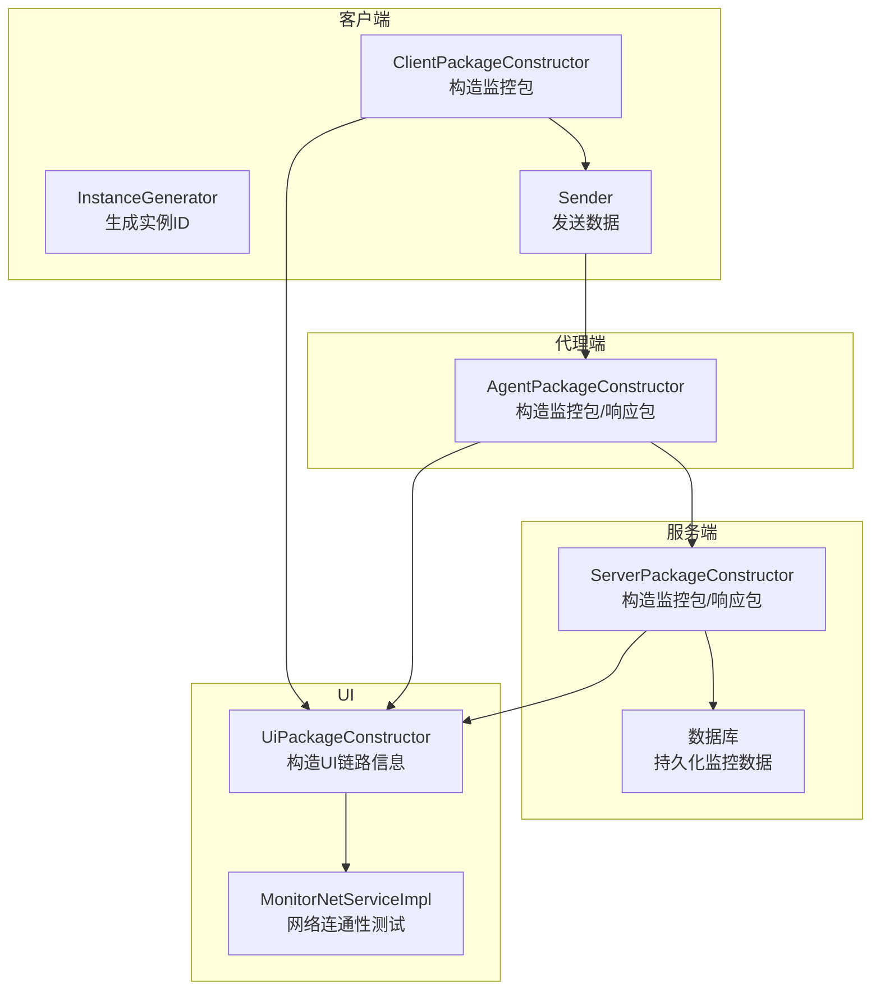
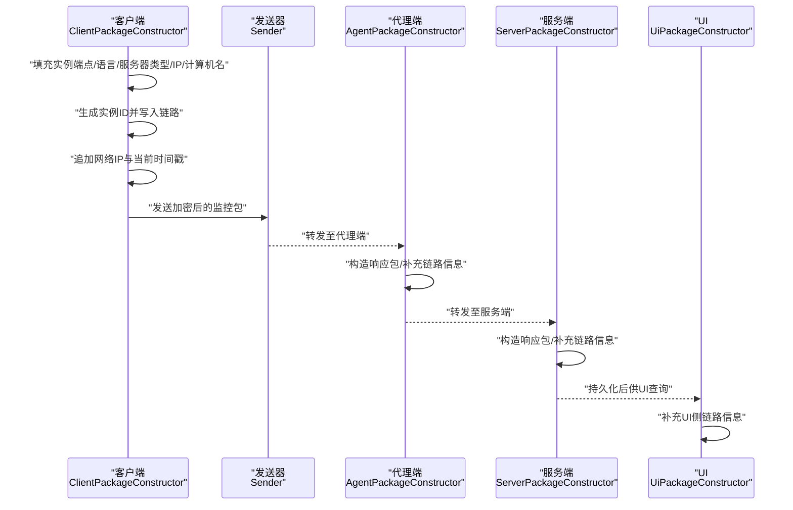
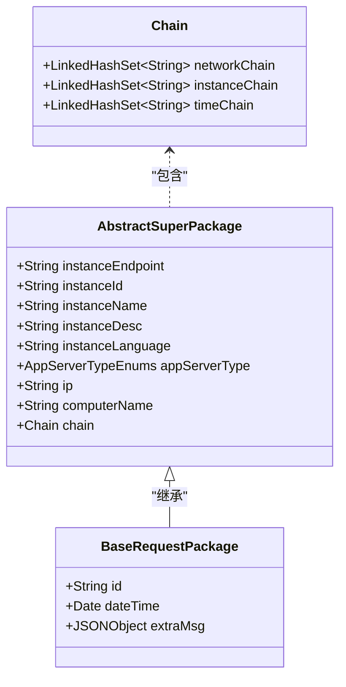
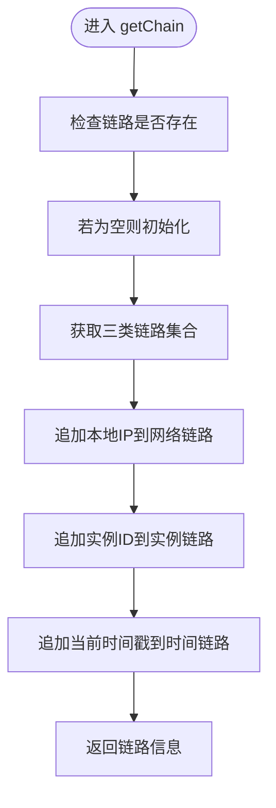
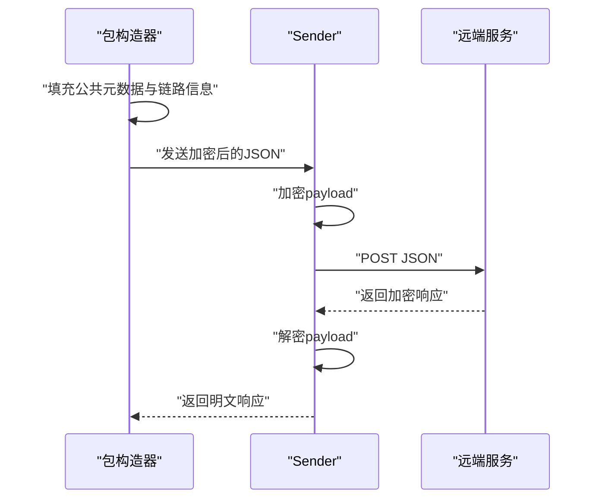
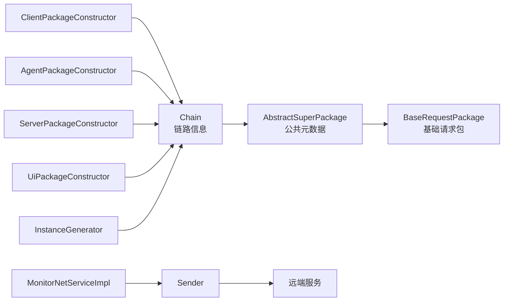

# 数据流监控与追踪

<cite>
**本文引用的文件**
- [Chain.java](file://phoenix-common\phoenix-common-core\src\main\java\com\gitee\pifeng\monitoring\common\domain\Chain.java)
- [AbstractSuperPackage.java](file://phoenix-common\phoenix-common-core\src\main\java\com\gitee\pifeng\monitoring\common\abs\AbstractSuperPackage.java)
- [BaseRequestPackage.java](file://phoenix-common\phoenix-common-core\src\main\java\com\gitee\pifeng\monitoring\common\dto\BaseRequestPackage.java)
- [ClientPackageConstructor.java](file://phoenix-client\phoenix-client-core\src\main\java\com\gitee\pifeng\monitoring\plug\core\ClientPackageConstructor.java)
- [AgentPackageConstructor.java](file://phoenix-agent\src\main\java\com\gitee\pifeng\monitoring\agent\core\AgentPackageConstructor.java)
- [ServerPackageConstructor.java](file://phoenix-server\src\main\java\com\gitee\pifeng\monitoring\server\business\server\core\ServerPackageConstructor.java)
- [UiPackageConstructor.java](file://phoenix-ui\src\main\java\com\gitee\pifeng\monitoring\ui\core\UiPackageConstructor.java)
- [InstanceGenerator.java](file://phoenix-client\phoenix-client-core\src\main\java\com\gitee\pifeng\monitoring\plug\core\InstanceGenerator.java)
- [Sender.java](file://phoenix-client\phoenix-client-core\src\main\java\com\gitee\pifeng\monitoring\plug\core\Sender.java)
- [MonitorNetServiceImpl.java](file://phoenix-ui\src\main\java\com\gitee\pifeng\monitoring\ui\business\web\service\impl\MonitorNetServiceImpl.java)
- [config.html](file://phoenix-ui\src\main\resources\templates\set\config.html)
- [phoenix.sql](file://doc\数据库设计\sql\mysql\phoenix.sql)
- [MonitoringProperties.java](file://phoenix-common\phoenix-common-core\src\main\java\com\gitee\pifeng\monitoring\common\property\client\MonitoringProperties.java)
- [MonitoringNetworkProperties.java](file://phoenix-common\phoenix-common-core\src\main\java\com\gitee\pifeng\monitoring\common\property\server\MonitoringNetworkProperties.java)
- [MonitoringInstanceProperties.java](file://phoenix-common\phoenix-common-core\src\main\java\com\gitee\pifeng\monitoring\common\property\server\MonitoringInstanceProperties.java)
- [MonitoringConfigPropertiesLoader.java](file://phoenix-server\src\main\java\com\gitee\pifeng\monitoring\server\business\server\core\MonitoringConfigPropertiesLoader.java)
</cite>

## 目录
1. [简介](#简介)
2. [项目结构](#项目结构)
3. [核心组件](#核心组件)
4. [架构总览](#架构总览)
5. [详细组件分析](#详细组件分析)
6. [依赖关系分析](#依赖关系分析)
7. [性能考量](#性能考量)
8. [故障排查指南](#故障排查指南)
9. [结论](#结论)
10. [附录](#附录)

## 简介
本文件围绕“数据流监控与追踪”主题，系统阐述监控数据在系统内的流转路径与追踪机制，重点包括：
- 链路信息的生成与维护：实例链路、网络链路、时间链路的构建逻辑与应用场景
- 数据流向的可视化展示：如何基于链路信息进行数据流追踪与呈现
- 关键监控指标：数据吞吐量、处理延迟、错误率等的统计与分析思路
- 追踪技术实现：分布式追踪、日志关联、性能采样等手段
- 配置与调优：如何通过配置项与调优策略保障监控系统的稳定性与可观测性

## 项目结构
Phoenix 由四端协同组成：客户端插件、代理端、服务端、UI 界面。监控数据以“包”为载体在各端之间传递，并通过链路信息串联起完整的数据流轨迹。

图表来源
- [ClientPackageConstructor.java:73-109](file://phoenix-client\phoenix-client-core\src\main\java\com\gitee\pifeng\monitoring\plug\core\ClientPackageConstructor.java#L73-L109)
- [AgentPackageConstructor.java:73-102](file://phoenix-agent\src\main\java\com\gitee\pifeng\monitoring\agent\core\AgentPackageConstructor.java#L73-L102)
- [ServerPackageConstructor.java:54-83](file://phoenix-server\src\main\java\com\gitee\pifeng\monitoring\server\business\server\core\ServerPackageConstructor.java#L54-L83)
- [UiPackageConstructor.java:47-69](file://phoenix-ui\src\main\java\com\gitee\pifeng\monitoring\ui\core\UiPackageConstructor.java#L47-L69)
- [Sender.java:42-59](file://phoenix-client\phoenix-client-core\src\main\java\com\gitee\pifeng\monitoring\plug\core\Sender.java#L42-L59)
- [MonitorNetServiceImpl.java:381-395](file://phoenix-ui\src\main\java\com\gitee\pifeng\monitoring\ui\business\web\service\impl\MonitorNetServiceImpl.java#L381-L395)

章节来源
- [ClientPackageConstructor.java:1-282](file://phoenix-client\phoenix-client-core\src\main\java\com\gitee\pifeng\monitoring\plug\core\ClientPackageConstructor.java#L1-L282)
- [AgentPackageConstructor.java:1-202](file://phoenix-agent\src\main\java\com\gitee\pifeng\monitoring\agent\core\AgentPackageConstructor.java#L1-L202)
- [ServerPackageConstructor.java:1-212](file://phoenix-server\src\main\java\com\gitee\pifeng\monitoring\server\business\server\core\ServerPackageConstructor.java#L1-L212)
- [UiPackageConstructor.java:1-120](file://phoenix-ui\src\main\java\com\gitee\pifeng\monitoring\ui\core\UiPackageConstructor.java#L1-L120)
- [Sender.java:1-61](file://phoenix-client\phoenix-client-core\src\main\java\com\gitee\pifeng\monitoring\plug\core\Sender.java#L1-L61)
- [MonitorNetServiceImpl.java:96-124](file://phoenix-ui\src\main\java\com\gitee\pifeng\monitoring\ui\business\web\service\impl\MonitorNetServiceImpl.java#L96-L124)

## 核心组件
- 链路信息模型：Chain 提供三类链路集合，分别承载网络路径、应用实例标识与时间戳序列，作为数据流追踪的“锚点”
- 包构造器：客户端、代理端、服务端均提供各自的包构造器，负责填充公共元数据与链路信息
- 实例标识：InstanceGenerator 生成稳定的实例ID，保证跨端一致的实例链路
- 数据发送：Sender 统一封装加密、发送与解密流程，保障数据在传输过程中的安全与可追踪
- UI 链路：UiPackageConstructor 在 UI 端补充链路信息，便于前端侧的可视化与回溯
- 网络连通性：MonitorNetServiceImpl 提供网络连通性测试接口，辅助定位网络链路问题

章节来源
- [Chain.java:1-43](file://phoenix-common\phoenix-common-core\src\main\java\com\gitee\pifeng\monitoring\common\domain\Chain.java#L1-L43)
- [AbstractSuperPackage.java:1-72](file://phoenix-common\phoenix-common-core\src\main\java\com\gitee\pifeng\monitoring\common\abs\AbstractSuperPackage.java#L1-L72)
- [BaseRequestPackage.java:1-42](file://phoenix-common\phoenix-common-core\src\main\java\com\gitee\pifeng\monitoring\common\dto\BaseRequestPackage.java#L1-L42)
- [ClientPackageConstructor.java:73-142](file://phoenix-client\phoenix-client-core\src\main\java\com\gitee\pifeng\monitoring\plug\core\ClientPackageConstructor.java#L73-L142)
- [AgentPackageConstructor.java:73-135](file://phoenix-agent\src\main\java\com\gitee\pifeng\monitoring\agent\core\AgentPackageConstructor.java#L73-L135)
- [ServerPackageConstructor.java:54-116](file://phoenix-server\src\main\java\com\gitee\pifeng\monitoring\server\business\server\core\ServerPackageConstructor.java#L54-L116)
- [UiPackageConstructor.java:47-69](file://phoenix-ui\src\main\java\com\gitee\pifeng\monitoring\ui\core\UiPackageConstructor.java#L47-L69)
- [InstanceGenerator.java:94-132](file://phoenix-client\phoenix-client-core\src\main\java\com\gitee\pifeng\monitoring\plug\core\InstanceGenerator.java#L94-L132)
- [Sender.java:42-59](file://phoenix-client\phoenix-client-core\src\main\java\com\gitee\pifeng\monitoring\plug\core\Sender.java#L42-L59)
- [MonitorNetServiceImpl.java:381-395](file://phoenix-ui\src\main\java\com\gitee\pifeng\monitoring\ui\business\web\service\impl\MonitorNetServiceImpl.java#L381-L395)

## 架构总览
数据流从客户端采集开始，经代理端汇聚，到达服务端处理并持久化，最终在 UI 层进行可视化展示与交互。链路信息贯穿始终，形成可追溯的数据流轨迹。

图表来源
- [ClientPackageConstructor.java:122-142](file://phoenix-client\phoenix-client-core\src\main\java\com\gitee\pifeng\monitoring\plug\core\ClientPackageConstructor.java#L122-L142)
- [AgentPackageConstructor.java:115-135](file://phoenix-agent\src\main\java\com\gitee\pifeng\monitoring\agent\core\AgentPackageConstructor.java#L115-L135)
- [ServerPackageConstructor.java:96-116](file://phoenix-server\src\main\java\com\gitee\pifeng\monitoring\server\business\server\core\ServerPackageConstructor.java#L96-L116)
- [UiPackageConstructor.java:47-69](file://phoenix-ui\src\main\java\com\gitee\pifeng\monitoring\ui\core\UiPackageConstructor.java#L47-L69)
- [Sender.java:42-59](file://phoenix-client\phoenix-client-core\src\main\java\com\gitee\pifeng\monitoring\plug\core\Sender.java#L42-L59)

## 详细组件分析

### Chain 类设计与作用
- 设计要点
  - 采用 LinkedHashSet 保持插入顺序，便于按时间轴回放
  - 分别维护网络链路（IP 序列）、实例链路（实例ID 序列）、时间链路（毫秒时间戳序列）
  - 通过 builder 模式与链式 setter，简化链路信息的构建与扩展
- 作用
  - 作为数据包的“元信息”，贯穿采集、传输、处理、展示全过程
  - 支持跨端一致性校验与数据流回溯
- 应用场景
  - 端到端链路追踪：从客户端到服务端的完整路径
  - 性能分析：基于时间链路计算端到端延迟
  - 故障定位：结合网络链路快速定位网络异常节点

图表来源
- [Chain.java:25-42](file://phoenix-common\phoenix-common-core\src\main\java\com\gitee\pifeng\monitoring\common\domain\Chain.java#L25-L42)
- [AbstractSuperPackage.java:24-71](file://phoenix-common\phoenix-common-core\src\main\java\com\gitee\pifeng\monitoring\common\abs\AbstractSuperPackage.java#L24-L71)
- [BaseRequestPackage.java:24-41](file://phoenix-common\phoenix-common-core\src\main\java\com\gitee\pifeng\monitoring\common\dto\BaseRequestPackage.java#L24-L41)

章节来源
- [Chain.java:1-43](file://phoenix-common\phoenix-common-core\src\main\java\com\gitee\pifeng\monitoring\common\domain\Chain.java#L1-L43)
- [AbstractSuperPackage.java:1-72](file://phoenix-common\phoenix-common-core\src\main\java\com\gitee\pifeng\monitoring\common\abs\AbstractSuperPackage.java#L1-L72)
- [BaseRequestPackage.java:1-42](file://phoenix-common\phoenix-common-core\src\main\java\com\gitee\pifeng\monitoring\common\dto\BaseRequestPackage.java#L1-L42)

### 链路信息生成与维护流程
- 客户端/代理端/服务端包构造器均实现 getChain 方法，统一追加：
  - 网络链路：本地 IP
  - 实例链路：实例ID（由 InstanceGenerator 生成）
  - 时间链路：当前时间戳
- UI 端通过 UiPackageConstructor 补充链路信息，便于前端侧的可视化与回溯

图表来源
- [ClientPackageConstructor.java:80-109](file://phoenix-client\phoenix-client-core\src\main\java\com\gitee\pifeng\monitoring\plug\core\ClientPackageConstructor.java#L80-L109)
- [AgentPackageConstructor.java:73-102](file://phoenix-agent\src\main\java\com\gitee\pifeng\monitoring\agent\core\AgentPackageConstructor.java#L73-L102)
- [ServerPackageConstructor.java:54-83](file://phoenix-server\src\main\java\com\gitee\pifeng\monitoring\server\business\server\core\ServerPackageConstructor.java#L54-L83)
- [UiPackageConstructor.java:47-69](file://phoenix-ui\src\main\java\com\gitee\pifeng\monitoring\ui\core\UiPackageConstructor.java#L47-L69)

章节来源
- [ClientPackageConstructor.java:80-109](file://phoenix-client\phoenix-client-core\src\main\java\com\gitee\pifeng\monitoring\plug\core\ClientPackageConstructor.java#L80-L109)
- [AgentPackageConstructor.java:73-102](file://phoenix-agent\src\main\java\com\gitee\pifeng\monitoring\agent\core\AgentPackageConstructor.java#L73-L102)
- [ServerPackageConstructor.java:54-83](file://phoenix-server\src\main\java\com\gitee\pifeng\monitoring\server\business\server\core\ServerPackageConstructor.java#L54-L83)
- [UiPackageConstructor.java:47-69](file://phoenix-ui\src\main\java\com\gitee\pifeng\monitoring\ui\core\UiPackageConstructor.java#L47-L69)

### 数据包构造与发送
- 包构造器统一填充：
  - 实例端点、实例ID、实例名、实例描述、语言、服务器类型、IP、计算机名
  - 链路信息（三类链路）
- Sender 统一执行：
  - 加密 payload
  - 发送 HTTP 请求
  - 解密响应 payload
  - 记录调试日志

图表来源
- [ClientPackageConstructor.java:122-166](file://phoenix-client\phoenix-client-core\src\main\java\com\gitee\pifeng\monitoring\plug\core\ClientPackageConstructor.java#L122-L166)
- [AgentPackageConstructor.java:149-158](file://phoenix-agent\src\main\java\com\gitee\pifeng\monitoring\agent\core\AgentPackageConstructor.java#L149-L158)
- [ServerPackageConstructor.java:130-139](file://phoenix-server\src\main\java\com\gitee\pifeng\monitoring\server\business\server\core\ServerPackageConstructor.java#L130-L139)
- [Sender.java:42-59](file://phoenix-client\phoenix-client-core\src\main\java\com\gitee\pifeng\monitoring\plug\core\Sender.java#L42-L59)

章节来源
- [ClientPackageConstructor.java:122-166](file://phoenix-client\phoenix-client-core\src\main\java\com\gitee\pifeng\monitoring\plug\core\ClientPackageConstructor.java#L122-L166)
- [AgentPackageConstructor.java:149-158](file://phoenix-agent\src\main\java\com\gitee\pifeng\monitoring\agent\core\AgentPackageConstructor.java#L149-L158)
- [ServerPackageConstructor.java:130-139](file://phoenix-server\src\main\java\com\gitee\pifeng\monitoring\server\business\server\core\ServerPackageConstructor.java#L130-L139)
- [Sender.java:1-61](file://phoenix-client\phoenix-client-core\src\main\java\com\gitee\pifeng\monitoring\plug\core\Sender.java#L1-L61)

### UI 侧链路与网络连通性
- UI 端通过 UiPackageConstructor 补充链路信息，便于前端侧的可视化与回溯
- MonitorNetServiceImpl 提供网络连通性测试接口，辅助定位网络链路问题

章节来源
- [UiPackageConstructor.java:47-69](file://phoenix-ui\src\main\java\com\gitee\pifeng\monitoring\ui\core\UiPackageConstructor.java#L47-L69)
- [MonitorNetServiceImpl.java:381-395](file://phoenix-ui\src\main\java\com\gitee\pifeng\monitoring\ui\business\web\service\impl\MonitorNetServiceImpl.java#L381-L395)

## 依赖关系分析
- 包构造器对链路信息的依赖：三类链路在各端包构造器中被统一维护
- 实例ID依赖：InstanceGenerator 生成全局唯一的实例ID，确保跨端一致性
- 配置依赖：MonitoringProperties、MonitoringNetworkProperties、MonitoringInstanceProperties 等配置项影响链路信息与监控行为
- UI 依赖：UI 侧通过链路信息与网络测试接口进行可视化与诊断

图表来源
- [Chain.java:25-42](file://phoenix-common\phoenix-common-core\src\main\java\com\gitee\pifeng\monitoring\common\domain\Chain.java#L25-L42)
- [AbstractSuperPackage.java:24-71](file://phoenix-common\phoenix-common-core\src\main\java\com\gitee\pifeng\monitoring\common\abs\AbstractSuperPackage.java#L24-L71)
- [BaseRequestPackage.java:24-41](file://phoenix-common\phoenix-common-core\src\main\java\com\gitee\pifeng\monitoring\common\dto\BaseRequestPackage.java#L24-L41)
- [ClientPackageConstructor.java:73-109](file://phoenix-client\phoenix-client-core\src\main\java\com\gitee\pifeng\monitoring\plug\core\ClientPackageConstructor.java#L73-L109)
- [AgentPackageConstructor.java:73-102](file://phoenix-agent\src\main\java\com\gitee\pifeng\monitoring\agent\core\AgentPackageConstructor.java#L73-L102)
- [ServerPackageConstructor.java:54-83](file://phoenix-server\src\main\java\com\gitee\pifeng\monitoring\server\business\server\core\ServerPackageConstructor.java#L54-L83)
- [UiPackageConstructor.java:47-69](file://phoenix-ui\src\main\java\com\gitee\pifeng\monitoring\ui\core\UiPackageConstructor.java#L47-L69)
- [InstanceGenerator.java:94-132](file://phoenix-client\phoenix-client-core\src\main\java\com\gitee\pifeng\monitoring\plug\core\InstanceGenerator.java#L94-L132)
- [Sender.java:42-59](file://phoenix-client\phoenix-client-core\src\main\java\com\gitee\pifeng\monitoring\plug\core\Sender.java#L42-L59)
- [MonitorNetServiceImpl.java:381-395](file://phoenix-ui\src\main\java\com\gitee\pifeng\monitoring\ui\business\web\service\impl\MonitorNetServiceImpl.java#L381-L395)

章节来源
- [MonitoringProperties.java:1-55](file://phoenix-common\phoenix-common-core\src\main\java\com\gitee\pifeng\monitoring\common\property\client\MonitoringProperties.java#L1-L55)
- [MonitoringNetworkProperties.java:1-31](file://phoenix-common\phoenix-common-core\src\main\java\com\gitee\pifeng\monitoring\common\property\server\MonitoringNetworkProperties.java#L1-L31)
- [MonitoringInstanceProperties.java:1-31](file://phoenix-common\phoenix-common-core\src\main\java\com\gitee\pifeng\monitoring\common\property\server\MonitoringInstanceProperties.java#L1-L31)
- [MonitoringConfigPropertiesLoader.java:162-176](file://phoenix-server\src\main\java\com\gitee\pifeng\monitoring\server\business\server\core\MonitoringConfigPropertiesLoader.java#L162-L176)

## 性能考量
- 链路信息维护成本
  - 三类链路均为有序集合，追加操作为 O(1)，整体开销极低
  - 时间链路用于端到端延迟计算，建议在高频场景下进行采样统计
- 网络传输
  - Sender 对 payload 进行加解密，建议根据业务吞吐量调整加密算法与线程池大小
  - 可通过配置项控制连接超时、套接字超时与连接请求超时，平衡可靠性与性能
- 实例ID生成
  - InstanceGenerator 采用缓存与文件落盘策略，避免重复计算与冲突
- 监控配置
  - 通过 MonitoringProperties 与各子配置类控制监控开关、频率与阈值，避免过度采集导致性能抖动

章节来源
- [ClientPackageConstructor.java:122-142](file://phoenix-client\phoenix-client-core\src\main\java\com\gitee\pifeng\monitoring\plug\core\ClientPackageConstructor.java#L122-L142)
- [AgentPackageConstructor.java:115-135](file://phoenix-agent\src\main\java\com\gitee\pifeng\monitoring\agent\core\AgentPackageConstructor.java#L115-L135)
- [ServerPackageConstructor.java:96-116](file://phoenix-server\src\main\java\com\gitee\pifeng\monitoring\server\business\server\core\ServerPackageConstructor.java#L96-L116)
- [MonitoringProperties.java:1-55](file://phoenix-common\phoenix-common-core\src\main\java\com\gitee\pifeng\monitoring\common\property\client\MonitoringProperties.java#L1-L55)
- [MonitoringNetworkProperties.java:1-31](file://phoenix-common\phoenix-common-core\src\main\java\com\gitee\pifeng\monitoring\common\property\server\MonitoringNetworkProperties.java#L1-L31)
- [MonitoringInstanceProperties.java:1-31](file://phoenix-common\phoenix-common-core\src\main\java\com\gitee\pifeng\monitoring\common\property\server\MonitoringInstanceProperties.java#L1-L31)
- [MonitoringConfigPropertiesLoader.java:162-176](file://phoenix-server\src\main\java\com\gitee\pifeng\monitoring\server\business\server\core\MonitoringConfigPropertiesLoader.java#L162-L176)

## 故障排查指南
- 网络连通性测试
  - 使用 MonitorNetServiceImpl 的网络测试接口验证源/目的 IP 的连通性
  - 若测试失败，优先检查网络链路中的 IP 是否正确、防火墙策略与路由配置
- 链路信息核对
  - 检查链路集合是否按预期追加：网络链路包含本地 IP、实例链路包含实例ID、时间链路包含时间戳
  - 若链路缺失，确认包构造器的 getChain 流程是否被执行
- 实例ID一致性
  - 确认 InstanceGenerator 生成的实例ID在客户端、代理端、服务端一致
  - 若不一致，检查实例ID生成逻辑与缓存/文件落盘策略
- 配置项校验
  - 核对 MonitoringProperties、MonitoringNetworkProperties、MonitoringInstanceProperties 等配置项
  - 特别关注网络监控开关、实例监控开关与告警阈值
- 数据库与持久化
  - 参考数据库表结构，确认网络连通性等指标字段是否正确写入
  - 如需排查历史数据，结合时间链路进行回放

章节来源
- [MonitorNetServiceImpl.java:381-395](file://phoenix-ui\src\main\java\com\gitee\pifeng\monitoring\ui\business\web\service\impl\MonitorNetServiceImpl.java#L381-L395)
- [ClientPackageConstructor.java:80-109](file://phoenix-client\phoenix-client-core\src\main\java\com\gitee\pifeng\monitoring\plug\core\ClientPackageConstructor.java#L80-L109)
- [AgentPackageConstructor.java:73-102](file://phoenix-agent\src\main\java\com\gitee\pifeng\monitoring\agent\core\AgentPackageConstructor.java#L73-L102)
- [ServerPackageConstructor.java:54-83](file://phoenix-server\src\main\java\com\gitee\pifeng\monitoring\server\business\server\core\ServerPackageConstructor.java#L54-L83)
- [InstanceGenerator.java:94-132](file://phoenix-client\phoenix-client-core\src\main\java\com\gitee\pifeng\monitoring\plug\core\InstanceGenerator.java#L94-L132)
- [MonitoringProperties.java:1-55](file://phoenix-common\phoenix-common-core\src\main\java\com\gitee\pifeng\monitoring\common\property\client\MonitoringProperties.java#L1-L55)
- [MonitoringNetworkProperties.java:1-31](file://phoenix-common\phoenix-common-core\src\main\java\com\gitee\pifeng\monitoring\common\property\server\MonitoringNetworkProperties.java#L1-L31)
- [MonitoringInstanceProperties.java:1-31](file://phoenix-common\phoenix-common-core\src\main\java\com\gitee\pifeng\monitoring\common\property\server\MonitoringInstanceProperties.java#L1-L31)
- [phoenix.sql:1104-1114](file://doc\数据库设计\sql\mysql\phoenix.sql#L1104-L1114)

## 结论
通过统一的链路信息模型与跨端包构造器，Phoenix 实现了从采集、传输、处理到可视化的完整数据流追踪闭环。借助链路信息，可以高效定位性能瓶颈与网络异常；通过合理的配置与调优，可在保证可观测性的同时兼顾系统性能与稳定性。

## 附录
- 配置页面参考：网络监控开关与相关参数可通过 UI 配置页面进行设置
- 数据库字段参考：网络连通性等指标字段定义见数据库脚本

章节来源
- [config.html:160-177](file://phoenix-ui\src\main\resources\templates\set\config.html#L160-L177)
- [phoenix.sql:1104-1114](file://doc\数据库设计\sql\mysql\phoenix.sql#L1104-L1114)