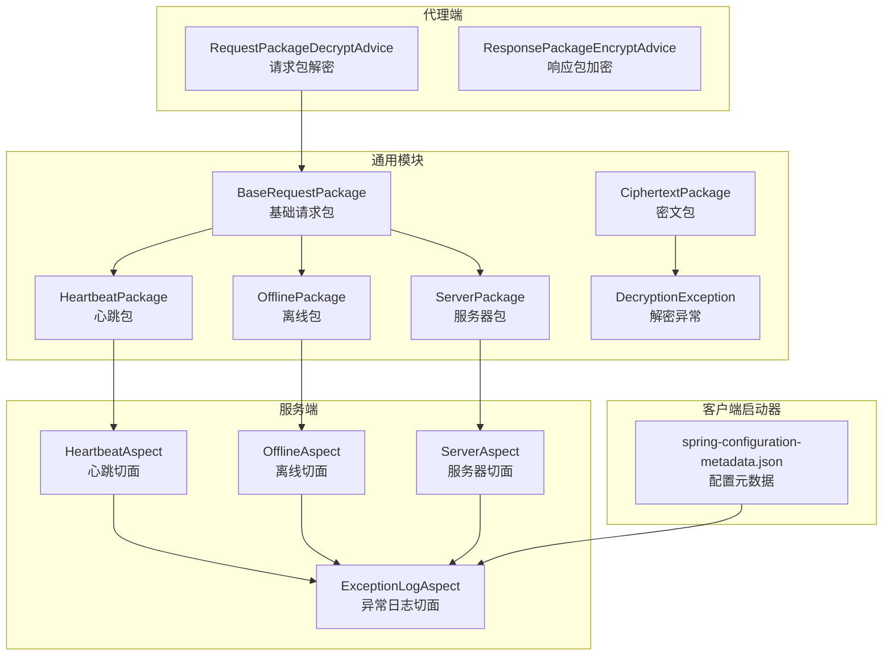
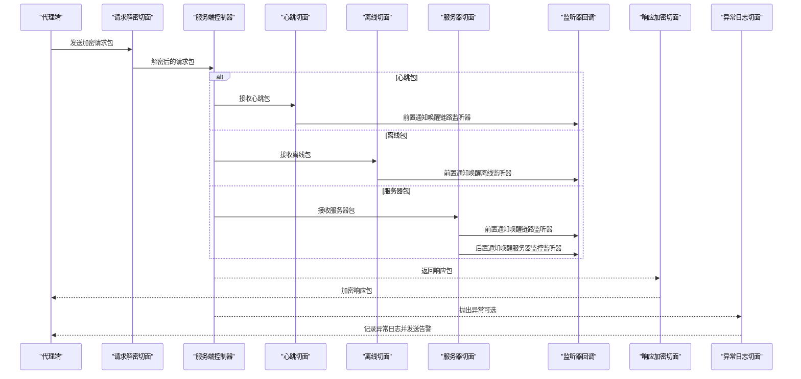
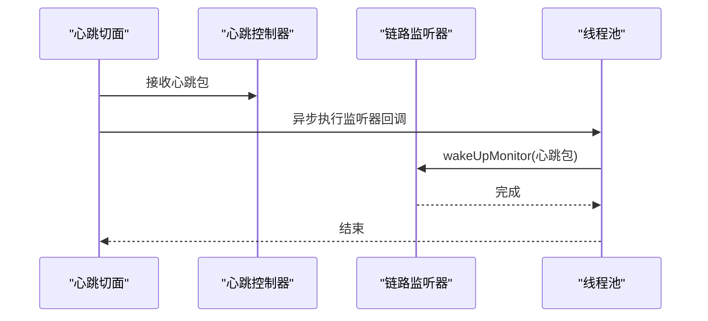
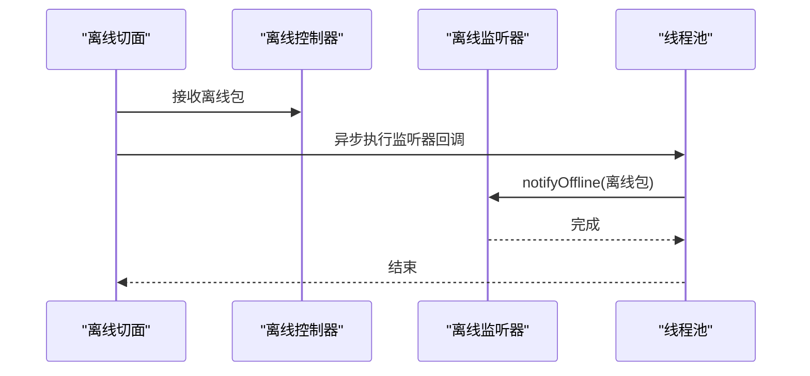
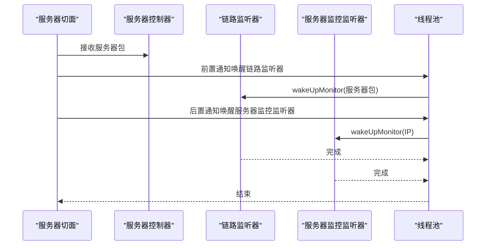
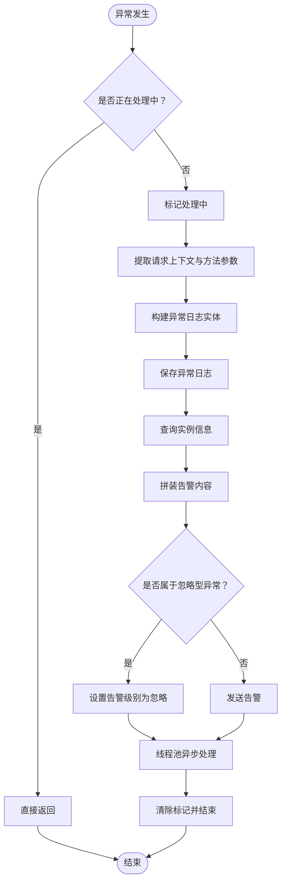
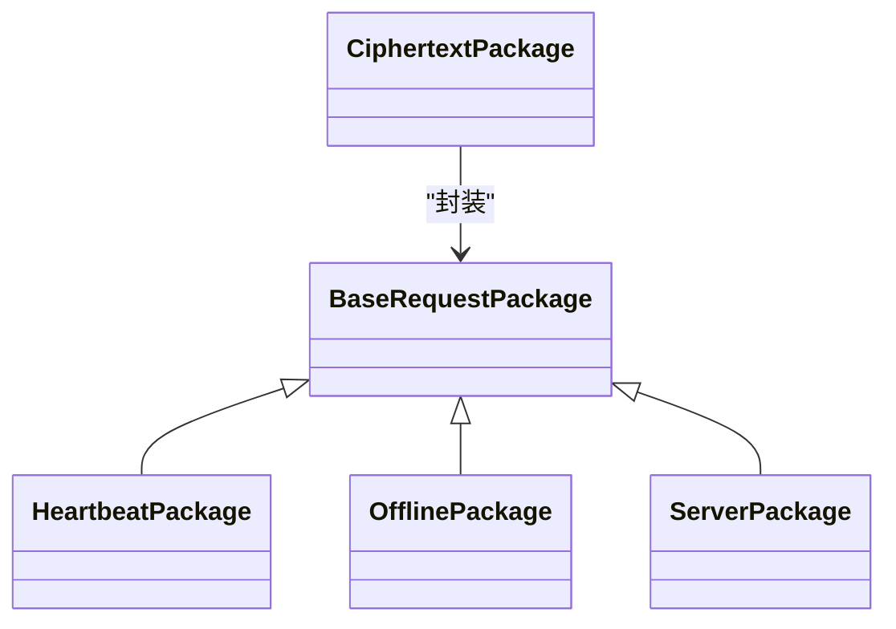
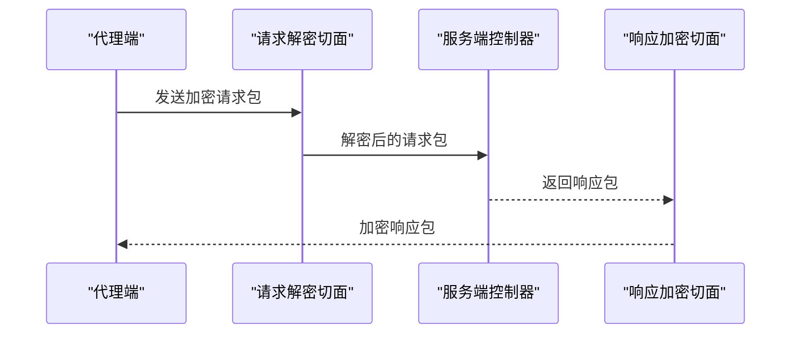
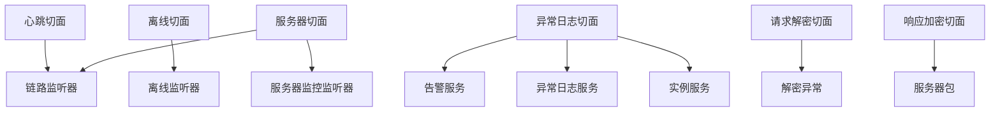

# 数据验证与预处理

<cite>
**本文引用的文件**
- [HeartbeatAspect.java](file://phoenix-server/src/main/java/com/gitee/pifeng/monitoring/server/business/server/component/HeartbeatAspect.java)
- [OfflineAspect.java](file://phoenix-server/src/main/java/com/gitee/pifeng/monitoring/server/business/server/component/OfflineAspect.java)
- [ServerAspect.java](file://phoenix-server/src/main/java/com/gitee/pifeng/monitoring/server/business/server/component/ServerAspect.java)
- [ExceptionLogAspect.java](file://phoenix-server/src/main/java/com/gitee/pifeng/monitoring/server/business/server/component/ExceptionLogAspect.java)
- [DecryptionException.java](file://phoenix-common/phoenix-common-core/src/main/java/com/gitee/pifeng/monitoring/common/exception/DecryptionException.java)
- [BaseRequestPackage.java](file://phoenix-common/phoenix-common-core/src/main/java/com/gitee/pifeng/monitoring/common/dto/BaseRequestPackage.java)
- [CiphertextPackage.java](file://phoenix-common/phoenix-common-core/src/main/java/com/gitee/pifeng/monitoring/common/dto/CiphertextPackage.java)
- [HeartbeatPackage.java](file://phoenix-common/phoenix-common-core/src/main/java/com/gitee/pifeng/monitoring/common/dto/HeartbeatPackage.java)
- [OfflinePackage.java](file://phoenix-common/phoenix-common-core/src/main/java/com/gitee/pifeng/monitoring/common/dto/OfflinePackage.java)
- [ServerPackage.java](file://phoenix-common/phoenix-common-core/src/main/java/com/gitee/pifeng/monitoring/common/dto/ServerPackage.java)
- [RequestPackageDecryptAdvice.java](file://phoenix-agent/src/main/java/com/gitee/pifeng/monitoring/agent/component/RequestPackageDecryptAdvice.java)
- [ResponsePackageEncryptAdvice.java](file://phoenix-agent/src/main/java/com/gitee/pifeng/monitoring/agent/component/ResponsePackageEncryptAdvice.java)
- [HttpInputMessagePackageDecrypt.java](file://phoenix-common/phoenix-common-web/src/main/java/com/gitee/pifeng/monitoring/common/web/core/http/HttpInputMessagePackageDecrypt.java)
- [spring-configuration-metadata.json](file://phoenix-client/phoenix-client-spring-boot-starter/src/main/resources/META-INF/spring-configuration-metadata.json)
</cite>

## 目录
1. [简介](#简介)
2. [项目结构](#项目结构)
3. [核心组件](#核心组件)
4. [架构总览](#架构总览)
5. [详细组件分析](#详细组件分析)
6. [依赖关系分析](#依赖关系分析)
7. [性能考虑](#性能考虑)
8. [故障排查指南](#故障排查指南)
9. [结论](#结论)
10. [附录](#附录)

## 简介
本文件聚焦于监控系统中的数据验证与预处理机制，涵盖心跳检测、离线检测、服务器状态检测等核心验证功能。通过对切面组件（HeartbeatAspect、OfflineAspect、ServerAspect）的拦截与处理流程进行深入解析，说明监控数据在服务端的验证、预处理与后续处理链路。同时，介绍数据包的解密/加密切面、异常处理策略（含 DecryptionException），以及可配置项与扩展点，帮助开发者按需定制验证规则与处理逻辑。

## 项目结构
围绕数据验证与预处理的关键模块分布如下：
- 代理端（phoenix-agent）：负责请求包解密、响应包加密，以及与服务端的数据交互。
- 通用模块（phoenix-common）：定义监控数据包模型、异常类型、工具类等。
- 服务端（phoenix-server）：实现验证切面（心跳、离线、服务器状态）、异常日志切面、监听器回调等。
- 客户端启动器（phoenix-client-spring-boot-starter）：提供配置元数据，便于外部配置扩展。

图表来源
- [RequestPackageDecryptAdvice.java](file://phoenix-agent/src/main/java/com/gitee/pifeng/monitoring/agent/component/RequestPackageDecryptAdvice.java)
- [ResponsePackageEncryptAdvice.java](file://phoenix-agent/src/main/java/com/gitee/pifeng/monitoring/agent/component/ResponsePackageEncryptAdvice.java)
- [BaseRequestPackage.java](file://phoenix-common/phoenix-common-core/src/main/java/com/gitee/pifeng/monitoring/common/dto/BaseRequestPackage.java)
- [CiphertextPackage.java](file://phoenix-common/phoenix-common-core/src/main/java/com/gitee/pifeng/monitoring/common/dto/CiphertextPackage.java)
- [HeartbeatPackage.java](file://phoenix-common/phoenix-common-core/src/main/java/com/gitee/pifeng/monitoring/common/dto/HeartbeatPackage.java)
- [OfflinePackage.java](file://phoenix-common/phoenix-common-core/src/main/java/com/gitee/pifeng/monitoring/common/dto/OfflinePackage.java)
- [ServerPackage.java](file://phoenix-common/phoenix-common-core/src/main/java/com/gitee/pifeng/monitoring/common/dto/ServerPackage.java)
- [DecryptionException.java](file://phoenix-common/phoenix-common-core/src/main/java/com/gitee/pifeng/monitoring/common/exception/DecryptionException.java)
- [HeartbeatAspect.java](file://phoenix-server/src/main/java/com/gitee/pifeng/monitoring/server/business/server/component/HeartbeatAspect.java)
- [OfflineAspect.java](file://phoenix-server/src/main/java/com/gitee/pifeng/monitoring/server/business/server/component/OfflineAspect.java)
- [ServerAspect.java](file://phoenix-server/src/main/java/com/gitee/pifeng/monitoring/server/business/server/component/ServerAspect.java)
- [ExceptionLogAspect.java](file://phoenix-server/src/main/java/com/gitee/pifeng/monitoring/server/business/server/component/ExceptionLogAspect.java)
- [spring-configuration-metadata.json](file://phoenix-client/phoenix-client-spring-boot-starter/src/main/resources/META-INF/spring-configuration-metadata.json)

章节来源
- [HeartbeatAspect.java:1-73](file://phoenix-server/src/main/java/com/gitee/pifeng/monitoring/server/business/server/component/HeartbeatAspect.java#L1-L73)
- [OfflineAspect.java:1-73](file://phoenix-server/src/main/java/com/gitee/pifeng/monitoring/server/business/server/component/OfflineAspect.java#L1-L73)
- [ServerAspect.java:1-107](file://phoenix-server/src/main/java/com/gitee/pifeng/monitoring/server/business/server/component/ServerAspect.java#L1-L107)
- [ExceptionLogAspect.java:1-224](file://phoenix-server/src/main/java/com/gitee/pifeng/monitoring/server/business/server/component/ExceptionLogAspect.java#L1-L224)
- [DecryptionException.java:1-28](file://phoenix-common/phoenix-common-core/src/main/java/com/gitee/pifeng/monitoring/common/exception/DecryptionException.java#L1-L28)

## 核心组件
- 心跳切面（HeartbeatAspect）
  - 作用：拦截心跳包接收方法，在前置通知中调用链路监听器，触发监控唤醒。
  - 关键点：使用线程池异步回调监听器，避免阻塞请求处理；监听器列表可为空，具备容错能力。
- 离线切面（OfflineAspect）
  - 作用：拦截离线包接收方法，在前置通知中调用离线监听器，通知实例下线。
  - 关键点：同样采用异步回调与空监听器保护。
- 服务器切面（ServerAspect）
  - 作用：拦截服务器包接收方法，前置通知唤醒链路监听器，后置通知唤醒服务器监控监听器。
  - 关键点：基于包内IP进行服务器监控回调，确保后续处理以实例维度触发。
- 异常日志切面（ExceptionLogAspect）
  - 作用：捕获服务端业务层异常，记录异常日志、构建告警包并发送告警。
  - 关键点：防重入保护、HTTP上下文提取、参数映射、忽略型异常集合、线程池异步处理。
- 解密异常（DecryptionException）
  - 作用：标识解密阶段发生的异常，便于统一处理与告警。
- 请求包解密切面（RequestPackageDecryptAdvice）
  - 作用：在进入控制器前对请求包进行解密，保障数据安全。
- 响应包加密切面（ResponsePackageEncryptAdvice）
  - 作用：在返回响应前对响应包进行加密，保障数据安全。
- HTTP输入消息解密（HttpInputMessagePackageDecrypt）
  - 作用：在HTTP层面对接收的消息进行解密处理，作为代理端与服务端通信的前置校验。

章节来源
- [HeartbeatAspect.java:25-73](file://phoenix-server/src/main/java/com/gitee/pifeng/monitoring/server/business/server/component/HeartbeatAspect.java#L25-L73)
- [OfflineAspect.java:25-73](file://phoenix-server/src/main/java/com/gitee/pifeng/monitoring/server/business/server/component/OfflineAspect.java#L25-L73)
- [ServerAspect.java:27-107](file://phoenix-server/src/main/java/com/gitee/pifeng/monitoring/server/business/server/component/ServerAspect.java#L27-L107)
- [ExceptionLogAspect.java:48-224](file://phoenix-server/src/main/java/com/gitee/pifeng/monitoring/server/business/server/component/ExceptionLogAspect.java#L48-L224)
- [DecryptionException.java:13-28](file://phoenix-common/phoenix-common-core/src/main/java/com/gitee/pifeng/monitoring/common/exception/DecryptionException.java#L13-L28)
- [RequestPackageDecryptAdvice.java](file://phoenix-agent/src/main/java/com/gitee/pifeng/monitoring/agent/component/RequestPackageDecryptAdvice.java)
- [ResponsePackageEncryptAdvice.java](file://phoenix-agent/src/main/java/com/gitee/pifeng/monitoring/agent/component/ResponsePackageEncryptAdvice.java)
- [HttpInputMessagePackageDecrypt.java](file://phoenix-common/phoenix-common-web/src/main/java/com/gitee/pifeng/monitoring/common/web/core/http/HttpInputMessagePackageDecrypt.java)

## 架构总览
下图展示了从代理端到服务端的心跳、离线、服务器状态数据流，以及异常处理与安全切面的协作关系：

图表来源
- [HeartbeatAspect.java:44-70](file://phoenix-server/src/main/java/com/gitee/pifeng/monitoring/server/business/server/component/HeartbeatAspect.java#L44-L70)
- [OfflineAspect.java:44-70](file://phoenix-server/src/main/java/com/gitee/pifeng/monitoring/server/business/server/component/OfflineAspect.java#L44-L70)
- [ServerAspect.java:52-104](file://phoenix-server/src/main/java/com/gitee/pifeng/monitoring/server/business/server/component/ServerAspect.java#L52-L104)
- [RequestPackageDecryptAdvice.java](file://phoenix-agent/src/main/java/com/gitee/pifeng/monitoring/agent/component/RequestPackageDecryptAdvice.java)
- [ResponsePackageEncryptAdvice.java](file://phoenix-agent/src/main/java/com/gitee/pifeng/monitoring/agent/component/ResponsePackageEncryptAdvice.java)
- [ExceptionLogAspect.java:105-221](file://phoenix-server/src/main/java/com/gitee/pifeng/monitoring/server/business/server/component/ExceptionLogAspect.java#L105-L221)

## 详细组件分析

### 心跳切面（HeartbeatAspect）
- 切入点定义：拦截心跳包接收控制器方法。
- 处理流程：
  - 在前置通知中提取心跳包参数；
  - 遍历链路监听器列表，通过线程池异步调用 wakeUpMonitor 回调；
  - 对异常进行日志记录，避免影响主流程。
- 数据验证要点：
  - 包类型为心跳包，包含必要的实例标识与时间戳；
  - 监听器回调确保后续监控任务被唤醒。
- 扩展建议：
  - 可在监听器中增加数据质量检查（如时间戳校验、重复检测）。

图表来源
- [HeartbeatAspect.java:44-70](file://phoenix-server/src/main/java/com/gitee/pifeng/monitoring/server/business/server/component/HeartbeatAspect.java#L44-L70)

章节来源
- [HeartbeatAspect.java:25-73](file://phoenix-server/src/main/java/com/gitee/pifeng/monitoring/server/business/server/component/HeartbeatAspect.java#L25-L73)

### 离线切面（OfflineAspect）
- 切入点定义：拦截离线包接收控制器方法。
- 处理流程：
  - 在前置通知中提取离线包参数；
  - 遍历离线监听器列表，通过线程池异步调用 notifyOffline 回调；
  - 对异常进行日志记录，保证主流程稳定。
- 数据验证要点：
  - 包类型为离线包，通常携带实例标识；
  - 监听器回调用于触发实例下线处理逻辑。
- 扩展建议：
  - 可在监听器中增加实例状态一致性检查与清理流程。

图表来源
- [OfflineAspect.java:44-70](file://phoenix-server/src/main/java/com/gitee/pifeng/monitoring/server/business/server/component/OfflineAspect.java#L44-L70)

章节来源
- [OfflineAspect.java:25-73](file://phoenix-server/src/main/java/com/gitee/pifeng/monitoring/server/business/server/component/OfflineAspect.java#L25-L73)

### 服务器切面（ServerAspect）
- 切入点定义：拦截服务器包接收控制器方法。
- 处理流程：
  - 前置通知：提取服务器包参数，遍历链路监听器列表，异步调用 wakeUpMonitor；
  - 后置通知：从服务器包中提取IP，遍历服务器监控监听器列表，异步调用 wakeUpMonitor(ip)。
- 数据验证要点：
  - 包类型为服务器包，包含实例标识与网络信息；
  - 后置通知确保以IP为维度触发服务器监控。
- 扩展建议：
  - 可在后置通知中增加IP合法性校验与黑白名单检查。

图表来源
- [ServerAspect.java:52-104](file://phoenix-server/src/main/java/com/gitee/pifeng/monitoring/server/business/server/component/ServerAspect.java#L52-L104)

章节来源
- [ServerAspect.java:27-107](file://phoenix-server/src/main/java/com/gitee/pifeng/monitoring/server/business/server/component/ServerAspect.java#L27-L107)

### 异常日志切面（ExceptionLogAspect）
- 切入点定义：拦截服务端所有业务层方法。
- 处理流程：
  - 防重入保护：使用线程局部变量避免切面递归；
  - 提取HTTP请求上下文与方法参数，构建异常日志实体；
  - 保存异常日志，并查询实例信息拼装告警内容；
  - 根据异常类型决定是否发送告警（忽略型异常仅记录）；
  - 通过线程池异步处理，避免阻塞请求。
- 异常类型与策略：
  - 忽略型异常集合：MyBatis/数据访问/事务相关异常不发送告警，仅记录；
  - 其他异常：构建告警包并发送。
- 扩展建议：
  - 可新增自定义忽略异常类型或扩展告警级别。

图表来源
- [ExceptionLogAspect.java:105-221](file://phoenix-server/src/main/java/com/gitee/pifeng/monitoring/server/business/server/component/ExceptionLogAspect.java#L105-L221)

章节来源
- [ExceptionLogAspect.java:48-224](file://phoenix-server/src/main/java/com/gitee/pifeng/monitoring/server/business/server/component/ExceptionLogAspect.java#L48-L224)

### 数据包模型与预处理
- 基础请求包（BaseRequestPackage）
  - 作用：定义通用请求包结构，承载数据包头与公共字段。
- 密文包（CiphertextPackage）
  - 作用：封装需要解密的数据载体。
- 心跳包（HeartbeatPackage）、离线包（OfflinePackage）、服务器包（ServerPackage）
  - 作用：分别承载心跳、离线、服务器状态数据，用于验证与后续处理。
- 预处理流程（代理端）
  - 请求解密：在进入控制器前对请求包进行解密；
  - 响应加密：在返回响应前对响应包进行加密；
  - HTTP输入消息解密：在HTTP层面对接收消息进行解密，作为通信前置校验。

图表来源
- [BaseRequestPackage.java](file://phoenix-common/phoenix-common-core/src/main/java/com/gitee/pifeng/monitoring/common/dto/BaseRequestPackage.java)
- [CiphertextPackage.java](file://phoenix-common/phoenix-common-core/src/main/java/com/gitee/pifeng/monitoring/common/dto/CiphertextPackage.java)
- [HeartbeatPackage.java](file://phoenix-common/phoenix-common-core/src/main/java/com/gitee/pifeng/monitoring/common/dto/HeartbeatPackage.java)
- [OfflinePackage.java](file://phoenix-common/phoenix-common-core/src/main/java/com/gitee/pifeng/monitoring/common/dto/OfflinePackage.java)
- [ServerPackage.java](file://phoenix-common/phoenix-common-core/src/main/java/com/gitee/pifeng/monitoring/common/dto/ServerPackage.java)

章节来源
- [BaseRequestPackage.java](file://phoenix-common/phoenix-common-core/src/main/java/com/gitee/pifeng/monitoring/common/dto/BaseRequestPackage.java)
- [CiphertextPackage.java](file://phoenix-common/phoenix-common-core/src/main/java/com/gitee/pifeng/monitoring/common/dto/CiphertextPackage.java)
- [HeartbeatPackage.java](file://phoenix-common/phoenix-common-core/src/main/java/com/gitee/pifeng/monitoring/common/dto/HeartbeatPackage.java)
- [OfflinePackage.java](file://phoenix-common/phoenix-common-core/src/main/java/com/gitee/pifeng/monitoring/common/dto/OfflinePackage.java)
- [ServerPackage.java](file://phoenix-common/phoenix-common-core/src/main/java/com/gitee/pifeng/monitoring/common/dto/ServerPackage.java)

### 安全切面与异常处理
- 请求解密切面（RequestPackageDecryptAdvice）
  - 作用：在控制器入口前完成请求包解密，确保数据安全。
- 响应加密切面（ResponsePackageEncryptAdvice）
  - 作用：在控制器返回前完成响应包加密，确保数据安全。
- HTTP输入消息解密（HttpInputMessagePackageDecrypt）
  - 作用：在HTTP层面对接收消息进行解密，作为代理端与服务端通信的前置校验。
- 解密异常（DecryptionException）
  - 作用：标识解密阶段发生的异常，便于统一处理与告警。

图表来源
- [RequestPackageDecryptAdvice.java](file://phoenix-agent/src/main/java/com/gitee/pifeng/monitoring/agent/component/RequestPackageDecryptAdvice.java)
- [ResponsePackageEncryptAdvice.java](file://phoenix-agent/src/main/java/com/gitee/pifeng/monitoring/agent/component/ResponsePackageEncryptAdvice.java)
- [HttpInputMessagePackageDecrypt.java](file://phoenix-common/phoenix-common-web/src/main/java/com/gitee/pifeng/monitoring/common/web/core/http/HttpInputMessagePackageDecrypt.java)
- [DecryptionException.java:13-28](file://phoenix-common/phoenix-common-core/src/main/java/com/gitee/pifeng/monitoring/common/exception/DecryptionException.java#L13-L28)

章节来源
- [RequestPackageDecryptAdvice.java](file://phoenix-agent/src/main/java/com/gitee/pifeng/monitoring/agent/component/RequestPackageDecryptAdvice.java)
- [ResponsePackageEncryptAdvice.java](file://phoenix-agent/src/main/java/com/gitee/pifeng/monitoring/agent/component/ResponsePackageEncryptAdvice.java)
- [HttpInputMessagePackageDecrypt.java](file://phoenix-common/phoenix-common-web/src/main/java/com/gitee/pifeng/monitoring/common/web/core/http/HttpInputMessagePackageDecrypt.java)
- [DecryptionException.java:13-28](file://phoenix-common/phoenix-common-core/src/main/java/com/gitee/pifeng/monitoring/common/exception/DecryptionException.java#L13-L28)

## 依赖关系分析
- 切面与监听器
  - 心跳/离线/服务器切面依赖链路监听器与服务器监控监听器，通过线程池异步回调，降低耦合度。
- 切面与异常日志
  - 异常日志切面覆盖所有业务层，对异常进行统一记录与告警，避免异常扩散。
- 切面与安全
  - 请求/响应加密切面贯穿代理端与服务端，保障数据传输安全；解密异常作为异常日志切面的输入之一。

图表来源
- [HeartbeatAspect.java:33-70](file://phoenix-server/src/main/java/com/gitee/pifeng/monitoring/server/business/server/component/HeartbeatAspect.java#L33-L70)
- [OfflineAspect.java:33-70](file://phoenix-server/src/main/java/com/gitee/pifeng/monitoring/server/business/server/component/OfflineAspect.java#L33-L70)
- [ServerAspect.java:35-103](file://phoenix-server/src/main/java/com/gitee/pifeng/monitoring/server/business/server/component/ServerAspect.java#L35-L103)
- [ExceptionLogAspect.java:56-75](file://phoenix-server/src/main/java/com/gitee/pifeng/monitoring/server/business/server/component/ExceptionLogAspect.java#L56-L75)
- [RequestPackageDecryptAdvice.java](file://phoenix-agent/src/main/java/com/gitee/pifeng/monitoring/agent/component/RequestPackageDecryptAdvice.java)
- [ResponsePackageEncryptAdvice.java](file://phoenix-agent/src/main/java/com/gitee/pifeng/monitoring/agent/component/ResponsePackageEncryptAdvice.java)
- [DecryptionException.java:13-28](file://phoenix-common/phoenix-common-core/src/main/java/com/gitee/pifeng/monitoring/common/exception/DecryptionException.java#L13-L28)

章节来源
- [HeartbeatAspect.java:33-70](file://phoenix-server/src/main/java/com/gitee/pifeng/monitoring/server/business/server/component/HeartbeatAspect.java#L33-L70)
- [OfflineAspect.java:33-70](file://phoenix-server/src/main/java/com/gitee/pifeng/monitoring/server/business/server/component/OfflineAspect.java#L33-L70)
- [ServerAspect.java:35-103](file://phoenix-server/src/main/java/com/gitee/pifeng/monitoring/server/business/server/component/ServerAspect.java#L35-L103)
- [ExceptionLogAspect.java:56-75](file://phoenix-server/src/main/java/com/gitee/pifeng/monitoring/server/business/server/component/ExceptionLogAspect.java#L56-L75)

## 性能考虑
- 异步回调：心跳、离线、服务器切面均通过线程池异步回调监听器，避免阻塞请求处理，提升吞吐量。
- 防重入保护：异常日志切面使用线程局部变量防止切面内部递归调用导致的无限循环。
- 忽略型异常：对数据库/事务类异常不发送告警，减少无效告警风暴，降低系统负载。
- 线程池管理：监听器回调与异常处理均使用线程池，建议结合业务规模调整线程池大小与队列容量。

## 故障排查指南
- 心跳/离线/服务器包未生效
  - 检查对应切面是否正确拦截目标控制器方法；
  - 确认监听器列表是否注入成功，是否存在异常回调；
  - 查看线程池是否正常运行。
- 解密异常
  - 检查请求包是否被正确解密；
  - 关注解密异常日志，定位密钥或算法问题；
  - 确认代理端与服务端的加密配置一致。
- 告警风暴
  - 检查异常日志切面的忽略型异常集合是否覆盖了预期异常；
  - 调整告警级别或新增忽略规则，避免频繁告警。
- 配置问题
  - 通过客户端启动器的配置元数据了解可配置项，按需扩展属性。

章节来源
- [ExceptionLogAspect.java:85-95](file://phoenix-server/src/main/java/com/gitee/pifeng/monitoring/server/business/server/component/ExceptionLogAspect.java#L85-L95)
- [DecryptionException.java:13-28](file://phoenix-common/phoenix-common-core/src/main/java/com/gitee/pifeng/monitoring/common/exception/DecryptionException.java#L13-L28)
- [spring-configuration-metadata.json:1-30](file://phoenix-client/phoenix-client-spring-boot-starter/src/main/resources/META-INF/spring-configuration-metadata.json#L1-L30)

## 结论
本系统通过切面化的设计实现了对心跳、离线、服务器状态等监控数据的高效验证与预处理。心跳/离线/服务器切面在进入控制器前后分别触发链路与服务器监控回调，异常日志切面统一处理异常并控制告警范围，代理端的安全切面保障数据传输安全。整体架构具备良好的扩展性与稳定性，开发者可通过监听器扩展、配置项调整与异常策略优化，满足多样化的业务需求。

## 附录
- 配置选项与扩展
  - 客户端启动器提供配置元数据，便于扩展监控属性与安全配置；
  - 可在监听器中增加数据质量检查、去重、过滤等预处理逻辑；
  - 可在异常日志切面中新增忽略异常类型或调整告警策略。

章节来源
- [spring-configuration-metadata.json:1-30](file://phoenix-client/phoenix-client-spring-boot-starter/src/main/resources/META-INF/spring-configuration-metadata.json#L1-L30)