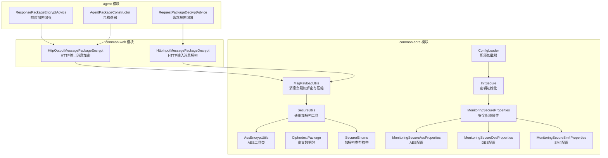
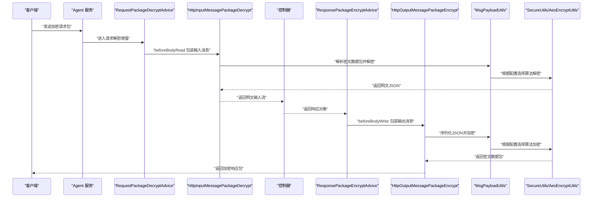
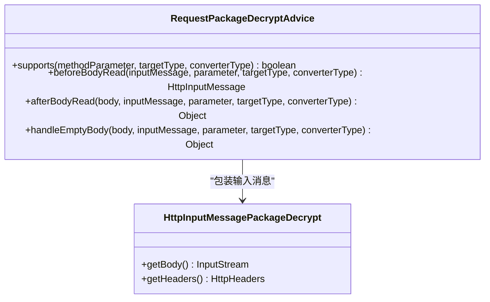
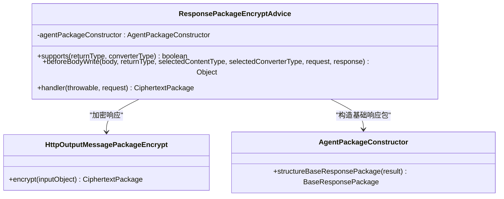
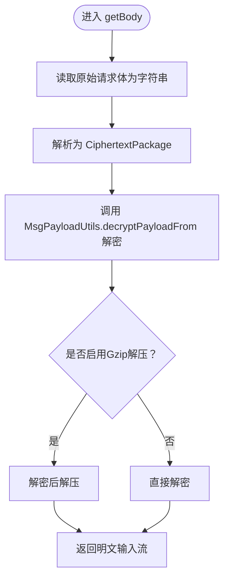
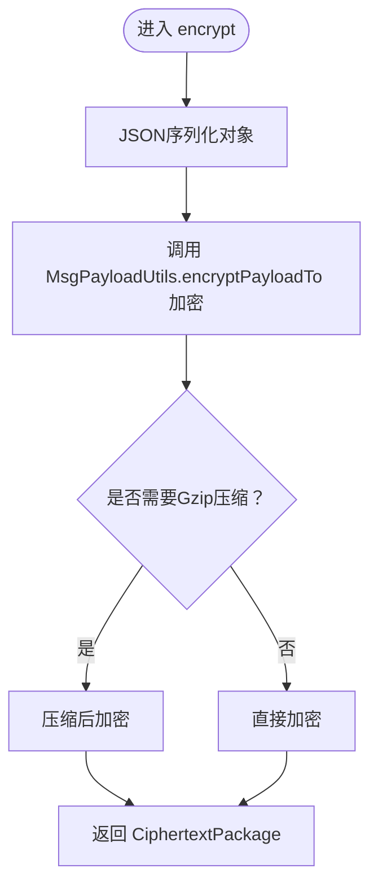
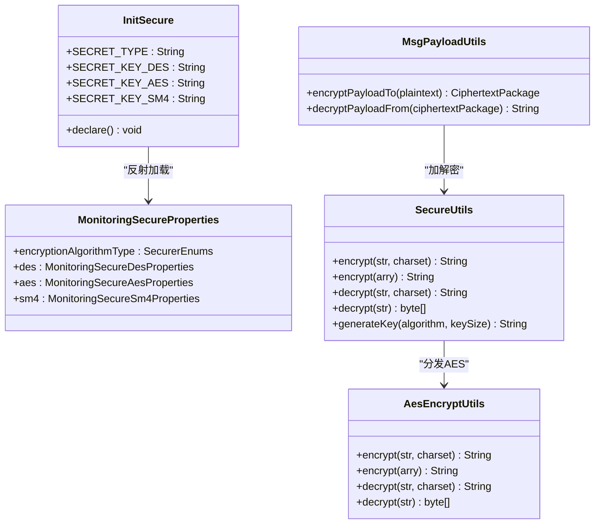
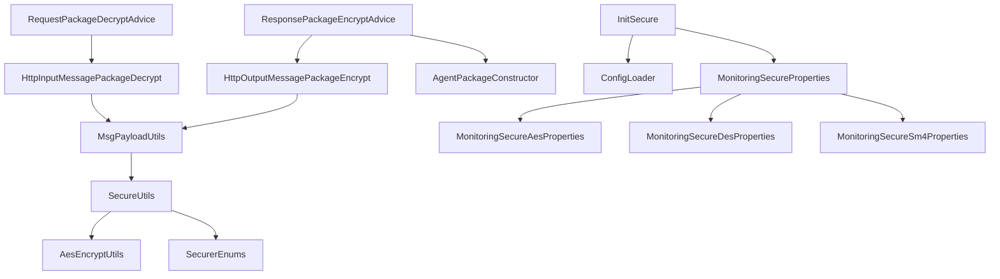

# 请求响应安全处理

<cite>
**本文引用的文件**
- [RequestPackageDecryptAdvice.java](file://phoenix-agent/src/main/java/com/gitee/pifeng/monitoring/agent/component/RequestPackageDecryptAdvice.java)
- [ResponsePackageEncryptAdvice.java](file://phoenix-agent/src/main/java/com/gitee/pifeng/monitoring/agent/component/ResponsePackageEncryptAdvice.java)
- [HttpInputMessagePackageDecrypt.java](file://phoenix-common/phoenix-common-web/src/main/java/com/gitee/pifeng/monitoring/common/web/core/http/HttpInputMessagePackageDecrypt.java)
- [HttpOutputMessagePackageEncrypt.java](file://phoenix-common/phoenix-common-web/src/main/java/com/gitee/pifeng/monitoring/common/web/core/http/HttpOutputMessagePackageEncrypt.java)
- [AesEncryptUtils.java](file://phoenix-common/phoenix-common-core/src/main/java/com/gitee/pifeng/monitoring/common/util/secure/AesEncryptUtils.java)
- [SecureUtils.java](file://phoenix-common/phoenix-common-core/src/main/java/com/gitee/pifeng/monitoring/common/util/secure/SecureUtils.java)
- [MsgPayloadUtils.java](file://phoenix-common/phoenix-common-core/src/main/java/com/gitee/pifeng/monitoring/common/util/MsgPayloadUtils.java)
- [CiphertextPackage.java](file://phoenix-common/phoenix-common-core/src/main/java/com/gitee/pifeng/monitoring/common/dto/CiphertextPackage.java)
- [SecurerEnums.java](file://phoenix-common/phoenix-common-core/src/main/java/com/gitee/pifeng/monitoring/common/constant/SecurerEnums.java)
- [InitSecure.java](file://phoenix-common/phoenix-common-core/src/main/java/com/gitee/pifeng/monitoring/common/init/InitSecure.java)
- [MonitoringSecureProperties.java](file://phoenix-common/phoenix-common-core/src/main/java/com/gitee/pifeng/monitoring/common/property/client/MonitoringSecureProperties.java)
- [MonitoringSecureAesProperties.java](file://phoenix-common/phoenix-common-core/src/main/java/com/gitee/pifeng/monitoring/common/property/client/MonitoringSecureAesProperties.java)
- [MonitoringSecureDesProperties.java](file://phoenix-common/phoenix-common-core/src/main/java/com/gitee/pifeng/monitoring/common/property/client/MonitoringSecureDesProperties.java)
- [MonitoringSecureSm4Properties.java](file://phoenix-common/phoenix-common-core/src/main/java/com/gitee/pifeng/monitoring/common/property/client/MonitoringSecureSm4Properties.java)
- [ConfigLoader.java](file://phoenix-client/phoenix-client-core/src/main/java/com/gitee/pifeng/monitoring/plug/core/ConfigLoader.java)
- [AgentPackageConstructor.java](file://phoenix-agent/src/main/java/com/gitee/pifeng/monitoring/agent/core/AgentPackageConstructor.java)
</cite>

## 目录
1. [简介](#简介)
2. [项目结构](#项目结构)
3. [核心组件](#核心组件)
4. [架构总览](#架构总览)
5. [详细组件分析](#详细组件分析)
6. [依赖分析](#依赖分析)
7. [性能考虑](#性能考虑)
8. [故障排查指南](#故障排查指南)
9. [结论](#结论)
10. [附录](#附录)

## 简介
本技术文档围绕监控系统中的“请求解密与响应加密”安全处理机制展开，重点阐述以下内容：
- 请求解密与响应加密的完整实现流程，涵盖 RequestPackageDecryptAdvice 与 ResponsePackageEncryptAdvice 的职责与协作。
- AES 加密算法在监控系统中的应用，包括密钥生成、加密解密流程、密钥管理策略等安全措施。
- 数据包在传输过程中的安全保护机制，包括数据完整性验证、防重放攻击、会话管理等安全特性。
- 安全工具类的使用方法，包括 AesEncryptUtils、SecureUtils、MsgPayloadUtils 等工具类的功能与最佳实践。
- 安全配置的详细说明，包括加密参数设置、安全策略配置、密钥轮换等运维操作指南。

## 项目结构
本功能涉及三个模块的关键文件：
- agent 模块：负责请求解密增强与响应加密增强的切面组件。
- common-web 模块：封装 HTTP 输入/输出消息的解密与加密适配器。
- common-core 模块：提供安全工具类、密钥管理、消息负载加解密与压缩工具、安全配置属性等。

图表来源
- [RequestPackageDecryptAdvice.java:22-53](file://phoenix-agent/src/main/java/com/gitee/pifeng/monitoring/agent/component/RequestPackageDecryptAdvice.java#L22-L53)
- [ResponsePackageEncryptAdvice.java:32-81](file://phoenix-agent/src/main/java/com/gitee/pifeng/monitoring/agent/component/ResponsePackageEncryptAdvice.java#L32-L81)
- [HttpInputMessagePackageDecrypt.java:27-100](file://phoenix-common/phoenix-common-web/src/main/java/com/gitee/pifeng/monitoring/common/web/core/http/HttpInputMessagePackageDecrypt.java#L27-L100)
- [HttpOutputMessagePackageEncrypt.java:17-38](file://phoenix-common/phoenix-common-web/src/main/java/com/gitee/pifeng/monitoring/common/web/core/http/HttpOutputMessagePackageEncrypt.java#L17-L38)
- [AesEncryptUtils.java:17-81](file://phoenix-common/phoenix-common-core/src/main/java/com/gitee/pifeng/monitoring/common/util/secure/AesEncryptUtils.java#L17-L81)
- [SecureUtils.java:21-112](file://phoenix-common/phoenix-common-core/src/main/java/com/gitee/pifeng/monitoring/common/util/secure/SecureUtils.java#L21-L112)
- [MsgPayloadUtils.java:19-119](file://phoenix-common/phoenix-common-core/src/main/java/com/gitee/pifeng/monitoring/common/util/MsgPayloadUtils.java#L19-L119)
- [CiphertextPackage.java:21-33](file://phoenix-common/phoenix-common-core/src/main/java/com/gitee/pifeng/monitoring/common/dto/CiphertextPackage.java#L21-L33)
- [SecurerEnums.java:18-94](file://phoenix-common/phoenix-common-core/src/main/java/com/gitee/pifeng/monitoring/common/constant/SecurerEnums.java#L18-L94)
- [InitSecure.java:20-215](file://phoenix-common/phoenix-common-core/src/main/java/com/gitee/pifeng/monitoring/common/init/InitSecure.java#L20-L215)
- [MonitoringSecureProperties.java:23-44](file://phoenix-common/phoenix-common-core/src/main/java/com/gitee/pifeng/monitoring/common/property/client/MonitoringSecureProperties.java#L23-L44)
- [MonitoringSecureAesProperties.java:21-28](file://phoenix-common/phoenix-common-core/src/main/java/com/gitee/pifeng/monitoring/common/property/client/MonitoringSecureAesProperties.java#L21-L28)
- [MonitoringSecureDesProperties.java:21-27](file://phoenix-common/phoenix-common-core/src/main/java/com/gitee/pifeng/monitoring/common/property/client/MonitoringSecureDesProperties.java#L21-L27)
- [MonitoringSecureSm4Properties.java:21-28](file://phoenix-common/phoenix-common-core/src/main/java/com/gitee/pifeng/monitoring/common/property/client/MonitoringSecureSm4Properties.java#L21-L28)
- [ConfigLoader.java:194-204](file://phoenix-client/phoenix-client-core/src/main/java/com/gitee/pifeng/monitoring/plug/core/ConfigLoader.java#L194-L204)

章节来源
- [RequestPackageDecryptAdvice.java:22-53](file://phoenix-agent/src/main/java/com/gitee/pifeng/monitoring/agent/component/RequestPackageDecryptAdvice.java#L22-L53)
- [ResponsePackageEncryptAdvice.java:32-81](file://phoenix-agent/src/main/java/com/gitee/pifeng/monitoring/agent/component/ResponsePackageEncryptAdvice.java#L32-L81)
- [HttpInputMessagePackageDecrypt.java:27-100](file://phoenix-common/phoenix-common-web/src/main/java/com/gitee/pifeng/monitoring/common/web/core/http/HttpInputMessagePackageDecrypt.java#L27-L100)
- [HttpOutputMessagePackageEncrypt.java:17-38](file://phoenix-common/phoenix-common-web/src/main/java/com/gitee/pifeng/monitoring/common/web/core/http/HttpOutputMessagePackageEncrypt.java#L17-L38)

## 核心组件
- RequestPackageDecryptAdvice：基于 Spring MVC 的 RequestBodyAdvice，拦截 HTTP 输入消息，在进入控制器前完成请求包解密。
- ResponsePackageEncryptAdvice：基于 Spring MVC 的 ResponseBodyAdvice，拦截控制器返回对象，在输出前完成响应包加密。
- HttpInputMessagePackageDecrypt：包装 HttpInputMessage，读取原始请求体，解析为密文数据包，解密后返回明文输入流。
- HttpOutputMessagePackageEncrypt：包装响应对象，序列化为 JSON，加密并封装为密文数据包。
- AesEncryptUtils：AES 加密工具类，提供字符串与字节数组的加解密能力。
- SecureUtils：通用加解密工具类，根据配置的加密算法类型分发至具体算法实现。
- MsgPayloadUtils：消息负载加解密与压缩工具，自动判断是否需要 Gzip 压缩后再加密。
- CiphertextPackage：密文数据包载体，包含密文与是否需要解压标志。
- SecurerEnums：加解密类型枚举，统一管理 DES、AES、SM4 的实现入口。
- InitSecure：密钥初始化与加载，通过反射从配置加载器中获取安全配置与密钥。
- MonitoringSecureProperties 及其子类：安全配置属性模型，定义加密算法类型与各算法密钥。
- ConfigLoader：配置加载器，负责封装与安全相关的监控属性并注入运行时。

章节来源
- [RequestPackageDecryptAdvice.java:22-53](file://phoenix-agent/src/main/java/com/gitee/pifeng/monitoring/agent/component/RequestPackageDecryptAdvice.java#L22-L53)
- [ResponsePackageEncryptAdvice.java:32-81](file://phoenix-agent/src/main/java/com/gitee/pifeng/monitoring/agent/component/ResponsePackageEncryptAdvice.java#L32-L81)
- [HttpInputMessagePackageDecrypt.java:27-100](file://phoenix-common/phoenix-common-web/src/main/java/com/gitee/pifeng/monitoring/common/web/core/http/HttpInputMessagePackageDecrypt.java#L27-L100)
- [HttpOutputMessagePackageEncrypt.java:17-38](file://phoenix-common/phoenix-common-web/src/main/java/com/gitee/pifeng/monitoring/common/web/core/http/HttpOutputMessagePackageEncrypt.java#L17-L38)
- [AesEncryptUtils.java:17-81](file://phoenix-common/phoenix-common-core/src/main/java/com/gitee/pifeng/monitoring/common/util/secure/AesEncryptUtils.java#L17-L81)
- [SecureUtils.java:21-112](file://phoenix-common/phoenix-common-core/src/main/java/com/gitee/pifeng/monitoring/common/util/secure/SecureUtils.java#L21-L112)
- [MsgPayloadUtils.java:19-119](file://phoenix-common/phoenix-common-core/src/main/java/com/gitee/pifeng/monitoring/common/util/MsgPayloadUtils.java#L19-L119)
- [CiphertextPackage.java:21-33](file://phoenix-common/phoenix-common-core/src/main/java/com/gitee/pifeng/monitoring/common/dto/CiphertextPackage.java#L21-L33)
- [SecurerEnums.java:18-94](file://phoenix-common/phoenix-common-core/src/main/java/com/gitee/pifeng/monitoring/common/constant/SecurerEnums.java#L18-L94)
- [InitSecure.java:20-215](file://phoenix-common/phoenix-common-core/src/main/java/com/gitee/pifeng/monitoring/common/init/InitSecure.java#L20-L215)
- [MonitoringSecureProperties.java:23-44](file://phoenix-common/phoenix-common-core/src/main/java/com/gitee/pifeng/monitoring/common/property/client/MonitoringSecureProperties.java#L23-L44)
- [MonitoringSecureAesProperties.java:21-28](file://phoenix-common/phoenix-common-core/src/main/java/com/gitee/pifeng/monitoring/common/property/client/MonitoringSecureAesProperties.java#L21-L28)
- [MonitoringSecureDesProperties.java:21-27](file://phoenix-common/phoenix-common-core/src/main/java/com/gitee/pifeng/monitoring/common/property/client/MonitoringSecureDesProperties.java#L21-L27)
- [MonitoringSecureSm4Properties.java:21-28](file://phoenix-common/phoenix-common-core/src/main/java/com/gitee/pifeng/monitoring/common/property/client/MonitoringSecureSm4Properties.java#L21-L28)
- [ConfigLoader.java:194-204](file://phoenix-client/phoenix-client-core/src/main/java/com/gitee/pifeng/monitoring/plug/core/ConfigLoader.java#L194-L204)

## 架构总览
下图展示了请求解密与响应加密在系统中的整体交互流程：

图表来源
- [RequestPackageDecryptAdvice.java:48-53](file://phoenix-agent/src/main/java/com/gitee/pifeng/monitoring/agent/component/RequestPackageDecryptAdvice.java#L48-L53)
- [ResponsePackageEncryptAdvice.java:72-81](file://phoenix-agent/src/main/java/com/gitee/pifeng/monitoring/agent/component/ResponsePackageEncryptAdvice.java#L72-L81)
- [HttpInputMessagePackageDecrypt.java:63-84](file://phoenix-common/phoenix-common-web/src/main/java/com/gitee/pifeng/monitoring/common/web/core/http/HttpInputMessagePackageDecrypt.java#L63-L84)
- [HttpOutputMessagePackageEncrypt.java:29-38](file://phoenix-common/phoenix-common-web/src/main/java/com/gitee/pifeng/monitoring/common/web/core/http/HttpOutputMessagePackageEncrypt.java#L29-L38)
- [MsgPayloadUtils.java:42-59](file://phoenix-common/phoenix-common-core/src/main/java/com/gitee/pifeng/monitoring/common/util/MsgPayloadUtils.java#L42-L59)
- [SecureUtils.java:34-58](file://phoenix-common/phoenix-common-core/src/main/java/com/gitee/pifeng/monitoring/common/util/secure/SecureUtils.java#L34-L58)
- [AesEncryptUtils.java:30-48](file://phoenix-common/phoenix-common-core/src/main/java/com/gitee/pifeng/monitoring/common/util/secure/AesEncryptUtils.java#L30-L48)

## 详细组件分析

### RequestPackageDecryptAdvice 分析
- 职责：作为@RestControllerAdvice，拦截目标控制器的请求体读取阶段，将原始 HttpInputMessage 包装为解密适配器，确保后续控制器接收的是明文数据。
- 关键点：
  - supports 返回 true 表示启用请求包解密。
  - beforeBodyRead 返回 HttpInputMessagePackageDecrypt，实现请求体解密。
  - afterBodyRead 与 handleEmptyBody 保持原样透传，不改变业务逻辑。

图表来源
- [RequestPackageDecryptAdvice.java:26-53](file://phoenix-agent/src/main/java/com/gitee/pifeng/monitoring/agent/component/RequestPackageDecryptAdvice.java#L26-L53)
- [HttpInputMessagePackageDecrypt.java:27-100](file://phoenix-common/phoenix-common-web/src/main/java/com/gitee/pifeng/monitoring/common/web/core/http/HttpInputMessagePackageDecrypt.java#L27-L100)

章节来源
- [RequestPackageDecryptAdvice.java:22-53](file://phoenix-agent/src/main/java/com/gitee/pifeng/monitoring/agent/component/RequestPackageDecryptAdvice.java#L22-L53)

### ResponsePackageEncryptAdvice 分析
- 职责：作为@RestControllerAdvice，拦截控制器返回的对象，在输出前将其加密为密文数据包。
- 关键点：
  - supports 返回 true 表示启用响应包加密。
  - beforeBodyWrite 对非空响应进行加密并返回密文数据包。
  - handler 捕获异常，构建错误响应并加密返回。
  - 依赖 AgentPackageConstructor 构造基础响应包。

图表来源
- [ResponsePackageEncryptAdvice.java:36-81](file://phoenix-agent/src/main/java/com/gitee/pifeng/monitoring/agent/component/ResponsePackageEncryptAdvice.java#L36-L81)
- [HttpOutputMessagePackageEncrypt.java:17-38](file://phoenix-common/phoenix-common-web/src/main/java/com/gitee/pifeng/monitoring/common/web/core/http/HttpOutputMessagePackageEncrypt.java#L17-L38)
- [AgentPackageConstructor.java:41-59](file://phoenix-agent/src/main/java/com/gitee/pifeng/monitoring/agent/core/AgentPackageConstructor.java#L41-L59)

章节来源
- [ResponsePackageEncryptAdvice.java:32-81](file://phoenix-agent/src/main/java/com/gitee/pifeng/monitoring/agent/component/ResponsePackageEncryptAdvice.java#L32-L81)

### HttpInputMessagePackageDecrypt 分析
- 职责：读取原始请求体，解析为密文数据包，根据是否启用 Gzip 压缩进行解密与解压，最终返回明文输入流。
- 关键点：
  - getBody 中将原始流转换为字符串，解析为 CiphertextPackage。
  - 调用 MsgPayloadUtils.decryptPayloadFrom 进行解密与解压。
  - 异常时抛出 DecryptionException，便于上层统一处理。

图表来源
- [HttpInputMessagePackageDecrypt.java:63-84](file://phoenix-common/phoenix-common-web/src/main/java/com/gitee/pifeng/monitoring/common/web/core/http/HttpInputMessagePackageDecrypt.java#L63-L84)
- [MsgPayloadUtils.java:85-102](file://phoenix-common/phoenix-common-core/src/main/java/com/gitee/pifeng/monitoring/common/util/MsgPayloadUtils.java#L85-L102)

章节来源
- [HttpInputMessagePackageDecrypt.java:63-84](file://phoenix-common/phoenix-common-web/src/main/java/com/gitee/pifeng/monitoring/common/web/core/http/HttpInputMessagePackageDecrypt.java#L63-L84)

### HttpOutputMessagePackageEncrypt 分析
- 职责：将明文对象序列化为 JSON，交由 MsgPayloadUtils.encryptPayloadTo 进行加密与压缩决策，最终返回密文数据包。
- 关键点：
  - encrypt 接收任意对象，先 JSON 序列化，再加密。
  - 日志记录明文 JSON，便于审计与调试。

图表来源
- [HttpOutputMessagePackageEncrypt.java:29-38](file://phoenix-common/phoenix-common-web/src/main/java/com/gitee/pifeng/monitoring/common/web/core/http/HttpOutputMessagePackageEncrypt.java#L29-L38)
- [MsgPayloadUtils.java:42-59](file://phoenix-common/phoenix-common-core/src/main/java/com/gitee/pifeng/monitoring/common/util/MsgPayloadUtils.java#L42-L59)

章节来源
- [HttpOutputMessagePackageEncrypt.java:29-38](file://phoenix-common/phoenix-common-web/src/main/java/com/gitee/pifeng/monitoring/common/web/core/http/HttpOutputMessagePackageEncrypt.java#L29-L38)

### AES 加密工具类与密钥管理
- AesEncryptUtils：提供字符串与字节数组的 AES 加解密，密钥来自 Base64 解码后的 SECRET_KEY_AES。
- SecureUtils：根据 SECRET_TYPE 动态选择加解密算法（DES/AES/SM4），并通过 SecurerEnums 分发。
- InitSecure：通过反射从 ConfigLoader 加载 MonitoringProperties，进而获取 MonitoringSecureProperties 与各算法密钥，完成静态初始化。
- MsgPayloadUtils：在加密前自动判断是否需要 Gzip 压缩，减少网络传输体积。

图表来源
- [InitSecure.java:50-87](file://phoenix-common/phoenix-common-core/src/main/java/com/gitee/pifeng/monitoring/common/init/InitSecure.java#L50-L87)
- [MonitoringSecureProperties.java:23-44](file://phoenix-common/phoenix-common-core/src/main/java/com/gitee/pifeng/monitoring/common/property/client/MonitoringSecureProperties.java#L23-L44)
- [AesEncryptUtils.java:17-81](file://phoenix-common/phoenix-common-core/src/main/java/com/gitee/pifeng/monitoring/common/util/secure/AesEncryptUtils.java#L17-L81)
- [SecureUtils.java:21-112](file://phoenix-common/phoenix-common-core/src/main/java/com/gitee/pifeng/monitoring/common/util/secure/SecureUtils.java#L21-L112)
- [MsgPayloadUtils.java:42-59](file://phoenix-common/phoenix-common-core/src/main/java/com/gitee/pifeng/monitoring/common/util/MsgPayloadUtils.java#L42-L59)

章节来源
- [AesEncryptUtils.java:17-81](file://phoenix-common/phoenix-common-core/src/main/java/com/gitee/pifeng/monitoring/common/util/secure/AesEncryptUtils.java#L17-L81)
- [SecureUtils.java:21-112](file://phoenix-common/phoenix-common-core/src/main/java/com/gitee/pifeng/monitoring/common/util/secure/SecureUtils.java#L21-L112)
- [InitSecure.java:50-87](file://phoenix-common/phoenix-common-core/src/main/java/com/gitee/pifeng/monitoring/common/init/InitSecure.java#L50-L87)
- [MsgPayloadUtils.java:42-59](file://phoenix-common/phoenix-common-core/src/main/java/com/gitee/pifeng/monitoring/common/util/MsgPayloadUtils.java#L42-L59)

### 数据包与安全特性
- CiphertextPackage：承载密文与压缩标志，保证传输层安全。
- 压缩与加密：MsgPayloadUtils 在加密前自动判断是否需要 Gzip 压缩，兼顾安全性与性能。
- 异常处理：解密失败抛出 DecryptionException，便于统一捕获与处理。

章节来源
- [CiphertextPackage.java:21-33](file://phoenix-common/phoenix-common-core/src/main/java/com/gitee/pifeng/monitoring/common/dto/CiphertextPackage.java#L21-L33)
- [MsgPayloadUtils.java:42-59](file://phoenix-common/phoenix-common-core/src/main/java/com/gitee/pifeng/monitoring/common/util/MsgPayloadUtils.java#L42-L59)
- [HttpInputMessagePackageDecrypt.java:81-83](file://phoenix-common/phoenix-common-web/src/main/java/com/gitee/pifeng/monitoring/common/web/core/http/HttpInputMessagePackageDecrypt.java#L81-L83)

## 依赖分析
- RequestPackageDecryptAdvice 依赖 HttpInputMessagePackageDecrypt。
- ResponsePackageEncryptAdvice 依赖 HttpOutputMessagePackageEncrypt 与 AgentPackageConstructor。
- HttpInputMessagePackageDecrypt 与 HttpOutputMessagePackageEncrypt 依赖 MsgPayloadUtils。
- MsgPayloadUtils 依赖 SecureUtils 与 AesEncryptUtils。
- SecureUtils 依赖 SecurerEnums。
- InitSecure 通过反射依赖 ConfigLoader 与 MonitoringSecureProperties。
- MonitoringSecureProperties 依赖各算法配置类（AES/DES/SM4）。

图表来源
- [RequestPackageDecryptAdvice.java:26-53](file://phoenix-agent/src/main/java/com/gitee/pifeng/monitoring/agent/component/RequestPackageDecryptAdvice.java#L26-L53)
- [ResponsePackageEncryptAdvice.java:36-81](file://phoenix-agent/src/main/java/com/gitee/pifeng/monitoring/agent/component/ResponsePackageEncryptAdvice.java#L36-L81)
- [HttpInputMessagePackageDecrypt.java:27-100](file://phoenix-common/phoenix-common-web/src/main/java/com/gitee/pifeng/monitoring/common/web/core/http/HttpInputMessagePackageDecrypt.java#L27-L100)
- [HttpOutputMessagePackageEncrypt.java:17-38](file://phoenix-common/phoenix-common-web/src/main/java/com/gitee/pifeng/monitoring/common/web/core/http/HttpOutputMessagePackageEncrypt.java#L17-L38)
- [MsgPayloadUtils.java:19-119](file://phoenix-common/phoenix-common-core/src/main/java/com/gitee/pifeng/monitoring/common/util/MsgPayloadUtils.java#L19-L119)
- [SecureUtils.java:21-112](file://phoenix-common/phoenix-common-core/src/main/java/com/gitee/pifeng/monitoring/common/util/secure/SecureUtils.java#L21-L112)
- [AesEncryptUtils.java:17-81](file://phoenix-common/phoenix-common-core/src/main/java/com/gitee/pifeng/monitoring/common/util/secure/AesEncryptUtils.java#L17-L81)
- [SecurerEnums.java:18-94](file://phoenix-common/phoenix-common-core/src/main/java/com/gitee/pifeng/monitoring/common/constant/SecurerEnums.java#L18-L94)
- [InitSecure.java:50-87](file://phoenix-common/phoenix-common-core/src/main/java/com/gitee/pifeng/monitoring/common/init/InitSecure.java#L50-L87)
- [ConfigLoader.java:194-204](file://phoenix-client/phoenix-client-core/src/main/java/com/gitee/pifeng/monitoring/plug/core/ConfigLoader.java#L194-L204)
- [MonitoringSecureProperties.java:23-44](file://phoenix-common/phoenix-common-core/src/main/java/com/gitee/pifeng/monitoring/common/property/client/MonitoringSecureProperties.java#L23-L44)
- [MonitoringSecureAesProperties.java:21-28](file://phoenix-common/phoenix-common-core/src/main/java/com/gitee/pifeng/monitoring/common/property/client/MonitoringSecureAesProperties.java#L21-L28)
- [MonitoringSecureDesProperties.java:21-27](file://phoenix-common/phoenix-common-core/src/main/java/com/gitee/pifeng/monitoring/common/property/client/MonitoringSecureDesProperties.java#L21-L27)
- [MonitoringSecureSm4Properties.java:21-28](file://phoenix-common/phoenix-common-core/src/main/java/com/gitee/pifeng/monitoring/common/property/client/MonitoringSecureSm4Properties.java#L21-L28)

## 性能考虑
- 自动压缩：MsgPayloadUtils 在加密前判断是否需要 Gzip 压缩，减少大对象传输体积，提升吞吐。
- 反射优化：InitSecure 使用 setAccessibleQuietly 提升反射性能，避免频繁权限检查带来的开销。
- 静态初始化：InitSecure 的静态块在类加载时完成密钥加载，避免首次加解密的延迟。
- 日志级别：Debug 日志仅在调试时开启，生产环境建议关闭以降低 I/O 开销。

## 故障排查指南
- 解密失败：检查密钥配置是否正确、算法类型是否匹配、请求体格式是否符合 CiphertextPackage 规范。
- 加密异常：确认加密算法类型已正确设置，密钥长度与算法要求一致。
- 配置加载失败：确认 ConfigLoader 已正确封装 MonitoringSecureProperties，且属性名称与反射约定一致。
- 压缩解压问题：检查 isUnGzipEnabled 标志位与实际压缩情况是否一致。

章节来源
- [HttpInputMessagePackageDecrypt.java:81-83](file://phoenix-common/phoenix-common-web/src/main/java/com/gitee/pifeng/monitoring/common/web/core/http/HttpInputMessagePackageDecrypt.java#L81-L83)
- [InitSecure.java:98-120](file://phoenix-common/phoenix-common-core/src/main/java/com/gitee/pifeng/monitoring/common/init/InitSecure.java#L98-L120)
- [ConfigLoader.java:194-204](file://phoenix-client/phoenix-client-core/src/main/java/com/gitee/pifeng/monitoring/plug/core/ConfigLoader.java#L194-L204)

## 结论
本方案通过 Spring MVC 切面与 HTTP 消息适配器，实现了请求解密与响应加密的自动化处理，结合 AES/DES/SM4 等多种算法与密钥管理机制，有效保障了监控系统数据在传输过程中的机密性与完整性。配合 Gzip 压缩与统一异常处理，既提升了性能又增强了可用性。建议在生产环境中严格管理密钥与算法配置，定期轮换密钥并监控加解密性能与日志。

## 附录

### 安全配置与密钥轮换指南
- 配置项说明
  - encryptionAlgorithmType：加密算法类型（DES/AES/SM4）。
  - aes.key：AES 密钥（Base64 编码）。
  - des.key：DES 密钥（Base64 编码）。
  - sm4.key：SM4 密钥（Base64 编码）。
- 密钥生成
  - 使用 SecureUtils.generateKey 生成指定算法的随机密钥，长度按算法要求设置。
- 密钥轮换
  - 更新配置中的对应 key 字段，重启或触发 InitSecure.declare 重新加载。
  - 建议采用滚动更新策略，先更新一半节点，验证无误后再更新剩余节点。

章节来源
- [MonitoringSecureProperties.java:23-44](file://phoenix-common/phoenix-common-core/src/main/java/com/gitee/pifeng/monitoring/common/property/client/MonitoringSecureProperties.java#L23-L44)
- [MonitoringSecureAesProperties.java:21-28](file://phoenix-common/phoenix-common-core/src/main/java/com/gitee/pifeng/monitoring/common/property/client/MonitoringSecureAesProperties.java#L21-L28)
- [MonitoringSecureDesProperties.java:21-27](file://phoenix-common/phoenix-common-core/src/main/java/com/gitee/pifeng/monitoring/common/property/client/MonitoringSecureDesProperties.java#L21-L27)
- [MonitoringSecureSm4Properties.java:21-28](file://phoenix-common/phoenix-common-core/src/main/java/com/gitee/pifeng/monitoring/common/property/client/MonitoringSecureSm4Properties.java#L21-L28)
- [SecureUtils.java:108-110](file://phoenix-common/phoenix-common-core/src/main/java/com/gitee/pifeng/monitoring/common/util/secure/SecureUtils.java#L108-L110)
- [InitSecure.java:210-213](file://phoenix-common/phoenix-common-core/src/main/java/com/gitee/pifeng/monitoring/common/init/InitSecure.java#L210-L213)