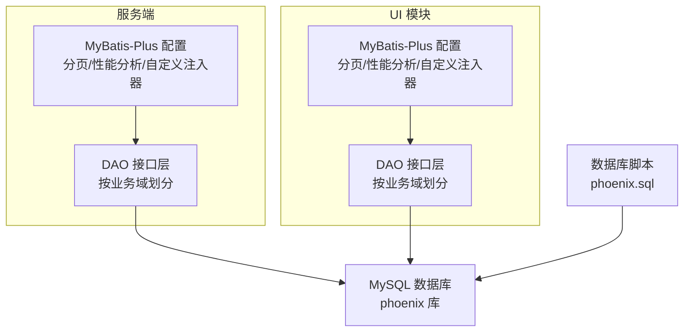
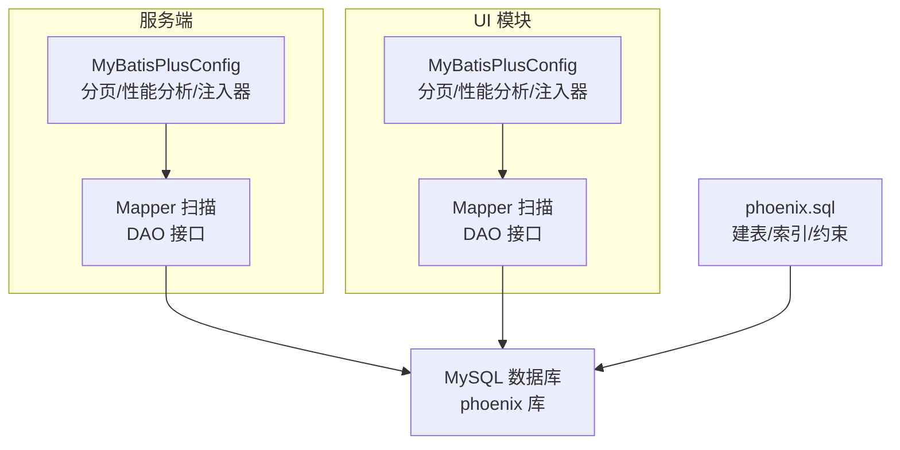
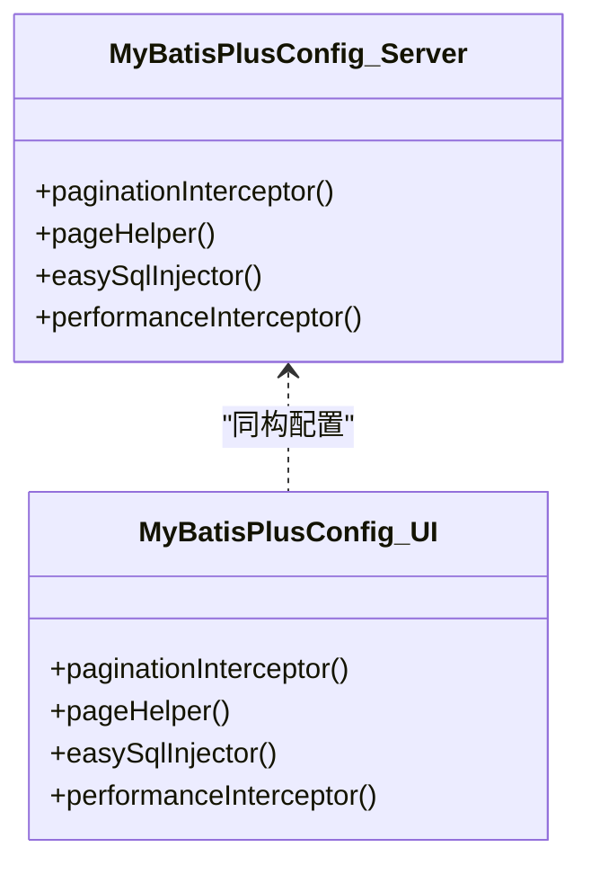
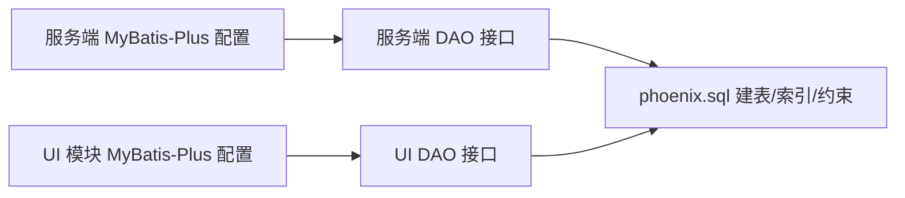

# 数据库存储层

<cite>
**本文引用的文件**
- [phoenix-server/src/main/java/com/gitee/pifeng/monitoring/server/config/MybatisPlusConfig.java](file://phoenix-server/src/main/java/com/gitee/pifeng/monitoring/server/config/MybatisPlusConfig.java)
- [phoenix-ui/src/main/java/com/gitee/pifeng/monitoring/ui/config/mybatisplus/MybatisPlusConfig.java](file://phoenix-ui/src/main/java/com/gitee/pifeng/monitoring/ui/config/mybatisplus/MybatisPlusConfig.java)
- [doc/数据库设计/sql/mysql/phoenix.sql](file://doc/数据库设计/sql/mysql/phoenix.sql)
</cite>

## 目录
1. [简介](#简介)
2. [项目结构](#项目结构)
3. [核心组件](#核心组件)
4. [架构总览](#架构总览)
5. [详细组件分析](#详细组件分析)
6. [依赖关系分析](#依赖关系分析)
7. [性能考量](#性能考量)
8. [故障排查指南](#故障排查指南)
9. [结论](#结论)
10. [附录](#附录)

## 简介
本章节面向数据库存储层，系统性阐述项目中基于 MyBatis-Plus 的配置与使用，覆盖实体类映射、DAO 接口设计、SQL 映射文件、监控数据存储模型、表结构设计思路、数据访问层实现模式、持久化最佳实践以及性能优化与迁移策略。文档以仓库中提供的数据库脚本与 MyBatis-Plus 配置为依据，结合常见工程实践给出可操作的指导。

## 项目结构
数据库相关的核心内容分布在以下位置：
- MyBatis-Plus 配置：服务端与 UI 模块分别提供独立的配置类，统一扫描 DAO 层并启用分页、性能分析等插件。
- 数据库脚本：完整的建表语句与索引定义，涵盖服务器监控、JVM 内存、HTTP 监控、TCP/网络、数据库实例、告警、用户与角色、Quartz 调度、Spring Session 等业务域。

图表来源
- [phoenix-server/src/main/java/com/gitee/pifeng/monitoring/server/config/MybatisPlusConfig.java:24-112](file://phoenix-server/src/main/java/com/gitee/pifeng/monitoring/server/config/MybatisPlusConfig.java#L24-L112)
- [phoenix-ui/src/main/java/com/gitee/pifeng/monitoring/ui/config/mybatisplus/MybatisPlusConfig.java:24-112](file://phoenix-ui/src/main/java/com/gitee/pifeng/monitoring/ui/config/mybatisplus/MybatisPlusConfig.java#L24-L112)
- [doc/数据库设计/sql/mysql/phoenix.sql:1-1478](file://doc/数据库设计/sql/mysql/phoenix.sql#L1-L1478)

章节来源
- [phoenix-server/src/main/java/com/gitee/pifeng/monitoring/server/config/MybatisPlusConfig.java:24-112](file://phoenix-server/src/main/java/com/gitee/pifeng/monitoring/server/config/MybatisPlusConfig.java#L24-L112)
- [phoenix-ui/src/main/java/com/gitee/pifeng/monitoring/ui/config/mybatisplus/MybatisPlusConfig.java:24-112](file://phoenix-ui/src/main/java/com/gitee/pifeng/monitoring/ui/config/mybatisplus/MybatisPlusConfig.java#L24-L112)
- [doc/数据库设计/sql/mysql/phoenix.sql:1-1478](file://doc/数据库设计/sql/mysql/phoenix.sql#L1-L1478)

## 核心组件
- MyBatis-Plus 配置
  - 分页插件：启用分页拦截器与优化 count 查询，支持 limit 与 overflow 行为控制。
  - PageHelper 插件：通过属性控制 offset 作为 pageNum、RowBounds 计数行为与分页合理化。
  - 自定义 SQL 注入器：扩展通用 CRUD 能力，便于在不同模块复用。
  - 性能分析插件：在 dev/test/profile 下启用，用于 SQL 执行效率分析。
  - Mapper 扫描：按模块路径扫描 DAO 接口，生成唯一 Bean 名称。

- 数据库脚本与表结构
  - 完整的监控数据模型：服务器、JVM、HTTP、TCP/网络、数据库实例、告警、用户与角色、Quartz、Spring Session 等。
  - 主键策略：绝大多数表采用自增主键（UNSIGNED BIGINT），部分表采用复合唯一索引或组合索引。
  - 索引设计：围绕高频查询字段建立普通索引与唯一索引，如环境名、分组名、实例标识、时间戳等。
  - 字段类型选择：大文本使用 TEXT/longtext，数值型使用 BIGINT/DOUBLE，时间戳使用 DATETIME，枚举类字段使用 VARCHAR 并配合业务约束。

章节来源
- [phoenix-server/src/main/java/com/gitee/pifeng/monitoring/server/config/MybatisPlusConfig.java:24-112](file://phoenix-server/src/main/java/com/gitee/pifeng/monitoring/server/config/MybatisPlusConfig.java#L24-L112)
- [phoenix-ui/src/main/java/com/gitee/pifeng/monitoring/ui/config/mybatisplus/MybatisPlusConfig.java:24-112](file://phoenix-ui/src/main/java/com/gitee/pifeng/monitoring/ui/config/mybatisplus/MybatisPlusConfig.java#L24-L112)
- [doc/数据库设计/sql/mysql/phoenix.sql:1-1478](file://doc/数据库设计/sql/mysql/phoenix.sql#L1-L1478)

## 架构总览
下图展示 MyBatis-Plus 在服务端与 UI 模块中的装配与交互关系，以及与数据库脚本的对应关系。

图表来源
- [phoenix-server/src/main/java/com/gitee/pifeng/monitoring/server/config/MybatisPlusConfig.java:24-112](file://phoenix-server/src/main/java/com/gitee/pifeng/monitoring/server/config/MybatisPlusConfig.java#L24-L112)
- [phoenix-ui/src/main/java/com/gitee/pifeng/monitoring/ui/config/mybatisplus/MybatisPlusConfig.java:24-112](file://phoenix-ui/src/main/java/com/gitee/pifeng/monitoring/ui/config/mybatisplus/MybatisPlusConfig.java#L24-L112)
- [doc/数据库设计/sql/mysql/phoenix.sql:1-1478](file://doc/数据库设计/sql/mysql/phoenix.sql#L1-L1478)

## 详细组件分析

### MyBatis-Plus 配置组件
- 分页插件
  - 启用分页拦截器并开启 count 优化，减少复杂 JOIN 的 count 压力。
  - 支持 limit 与 overflow 控制，便于在高并发场景下稳定分页行为。
- PageHelper 插件
  - 将 RowBounds 的 offset 视作 pageNum，开启 RowBounds 计数，合理化分页边界。
- 自定义 SQL 注入器
  - 提供扩展能力，统一处理 insert/update/delete 等通用逻辑。
- 性能分析插件
  - 在 dev/test/profile 下启用，输出慢 SQL 与执行耗时，辅助定位性能瓶颈。
- Mapper 扫描
  - 按模块路径扫描 DAO 接口，避免重复命名冲突，提升可维护性。

图表来源
- [phoenix-server/src/main/java/com/gitee/pifeng/monitoring/server/config/MybatisPlusConfig.java:24-112](file://phoenix-server/src/main/java/com/gitee/pifeng/monitoring/server/config/MybatisPlusConfig.java#L24-L112)
- [phoenix-ui/src/main/java/com/gitee/pifeng/monitoring/ui/config/mybatisplus/MybatisPlusConfig.java:24-112](file://phoenix-ui/src/main/java/com/gitee/pifeng/monitoring/ui/config/mybatisplus/MybatisPlusConfig.java#L24-L112)

章节来源
- [phoenix-server/src/main/java/com/gitee/pifeng/monitoring/server/config/MybatisPlusConfig.java:24-112](file://phoenix-server/src/main/java/com/gitee/pifeng/monitoring/server/config/MybatisPlusConfig.java#L24-L112)
- [phoenix-ui/src/main/java/com/gitee/pifeng/monitoring/ui/config/mybatisplus/MybatisPlusConfig.java:24-112](file://phoenix-ui/src/main/java/com/gitee/pifeng/monitoring/ui/config/mybatisplus/MybatisPlusConfig.java#L24-L112)

### 监控数据存储模型与表结构设计

#### 服务器监控数据
- 主表：MONITOR_SERVER（按 IP 唯一）
- CPU：MONITOR_SERVER_CPU（按 IP+CPU_NO 唯一）
- 内存：MONITOR_SERVER_MEMORY（按 IP 唯一）
- 磁盘：MONITOR_SERVER_DISK（按 IP+DISK_NO 唯一）
- GPU：MONITOR_SERVER_GPU（按 IP+GPU_NO 唯一）
- 平均负载：MONITOR_SERVER_LOAD_AVERAGE（按 IP 唯一）
- 网卡：MONITOR_SERVER_NETCARD（按 IP+NET_NO 唯一）
- 传感器：MONITOR_SERVER_SENSORS（按 IP 唯一）
- 进程：MONITOR_SERVER_PROCESS（按 IP 索引）
- 历史表：各主表对应 *_HISTORY 表，按时间维度归档

设计要点
- 主键策略：自增主键 + 复合唯一索引（如 IP+CPU_NO），确保聚合维度唯一性。
- 索引设计：围绕查询热点字段建立索引（如 IP、时间戳），历史表增加时间维度索引。
- 字段类型：大文本使用 TEXT/longtext，数值型使用 BIGINT/DOUBLE，时间戳使用 DATETIME。

章节来源
- [doc/数据库设计/sql/mysql/phoenix.sql:623-1071](file://doc/数据库设计/sql/mysql/phoenix.sql#L623-L1071)

#### JVM 监控数据
- 运行时：MONITOR_JVM_RUNTIME（按实例 ID 唯一）
- 类加载：MONITOR_JVM_CLASS_LOADING（按实例 ID 唯一）
- GC：MONITOR_JVM_GARBAGE_COLLECTOR（按实例 ID+名称唯一）
- 内存：MONITOR_JVM_MEMORY（按实例 ID+类型唯一）
- 历史表：MONITOR_JVM_MEMORY_HISTORY（按时间维度归档）

设计要点
- 实例维度唯一性：通过实例 ID 与类型/名称组合唯一索引保证 JVM 维度数据不重复。
- 历史表：按时间字段建立索引，支持趋势分析与回溯。

章节来源
- [doc/数据库设计/sql/mysql/phoenix.sql:307-449](file://doc/数据库设计/sql/mysql/phoenix.sql#L307-L449)

#### HTTP 监控数据
- 主表：MONITOR_HTTP（按环境、分组外键约束）
- 历史表：MONITOR_HTTP_HISTORY（按时间维度归档）

设计要点
- 外键约束：环境与分组字段通过外键关联到环境与分组表，保证数据一致性。
- 索引设计：按来源主机、目标 URL、时间戳建立索引，支撑查询与统计。

章节来源
- [doc/数据库设计/sql/mysql/phoenix.sql:200-268](file://doc/数据库设计/sql/mysql/phoenix.sql#L200-L268)

#### TCP/网络监控数据
- TCP：MONITOR_TCP（按环境、分组外键约束）
- 网络：MONITOR_NET（按环境、分组外键约束）
- 历史表：MONITOR_TCP_HISTORY、MONITOR_NET_HISTORY

设计要点
- 复合索引：源/目标主机、端口、时间戳等字段建立索引。
- 外键约束：与环境、分组表关联，确保业务域一致性。

章节来源
- [doc/数据库设计/sql/mysql/phoenix.sql:1094-1152](file://doc/数据库设计/sql/mysql/phoenix.sql#L1094-L1152)

#### 数据库实例与配置
- 数据库实例：MONITOR_DB（连接名称、URL、驱动类、状态、监控分组等）
- 监控配置：MONITOR_CONFIG（JSON 配置内容）
- 环境与分组：MONITOR_ENV、MONITOR_GROUP（多模块通用）

设计要点
- 字段类型：长文本使用 TEXT/longtext，布尔类使用 VARCHAR 存储 0/1。
- 外键：实例表与环境/分组表建立外键约束。

章节来源
- [doc/数据库设计/sql/mysql/phoenix.sql:110-139](file://doc/数据库设计/sql/mysql/phoenix.sql#L110-L139)

#### 告警与日志
- 告警定义：MONITOR_ALARM_DEFINITION（类型、分级、编码、标题、内容）
- 告警记录：MONITOR_ALARM_RECORD（UUID 编码、类型、级别、方式、内容）
- 告警详情：MONITOR_ALARM_RECORD_DETAIL（发送状态、异常信息）
- 异常日志：MONITOR_LOG_EXCEPTION（异常名称、消息、请求参数、是否告警）
- 操作日志：MONITOR_LOG_OPERATION（模块、类型、描述、耗时）

设计要点
- UUID 编码：告警记录使用 UUID，便于跨系统引用。
- 时间维度索引：INSERT_TIME、UPDATE_TIME 等字段建立索引，支撑快速检索与清理。

章节来源
- [doc/数据库设计/sql/mysql/phoenix.sql:16-91](file://doc/数据库设计/sql/mysql/phoenix.sql#L16-L91)
- [doc/数据库设计/sql/mysql/phoenix.sql:472-522](file://doc/数据库设计/sql/mysql/phoenix.sql#L472-L522)

#### 用户与角色、分布式锁、Quartz、Spring Session
- 用户与角色：MONITOR_USER、MONITOR_ROLE
- 分布式锁：MONITOR_DISTRIBUTED_LOCK（锁键、持有者、过期时间）
- Quartz：QRTZ_* 系列表（作业调度）
- Spring Session：SPRING_SESSION、SPRING_SESSION_ATTRIBUTES（会话管理）

设计要点
- 分布式锁：过期时间字段带毫秒精度，索引命中过期时间，便于清理。
- Quartz：标准调度表结构，支持集群与恢复。
- Spring Session：标准会话表结构，支持主从与横向扩展。

章节来源
- [doc/数据库设计/sql/mysql/phoenix.sql:142-1478](file://doc/数据库设计/sql/mysql/phoenix.sql#L142-L1478)

### 数据访问层实现模式
- 通用 DAO 接口
  - 使用 MyBatis-Plus 的通用 Mapper，继承 BaseMapper<T> 即可获得 CRUD 能力。
  - 对于复杂查询，可通过条件构造器 Wrapper 实现动态拼装。
- 条件构造器
  - 支持链式调用，构建 where 条件、排序、分组、having、联表等。
  - 结合 Page 对象实现分页查询，结合 PageHelper 或 PaginationInterceptor。
- 分页查询
  - 通过 Page 对象传入 pageNum 与 pageSize，自动注入分页 SQL。
  - 建议结合索引与 LIMIT 优化，避免全表扫描。
- 批量操作
  - 批量插入/更新建议使用 JDBC 批处理或 MyBatis-Plus 的批量工具，减少往返开销。
- 事务管理
  - 建议在 Service 层使用 @Transactional 管理事务边界，确保一致性。
  - 对于写多读少的监控数据，可考虑读写分离与异步落库策略。

章节来源
- [phoenix-server/src/main/java/com/gitee/pifeng/monitoring/server/config/MybatisPlusConfig.java:24-112](file://phoenix-server/src/main/java/com/gitee/pifeng/monitoring/server/config/MybatisPlusConfig.java#L24-L112)
- [phoenix-ui/src/main/java/com/gitee/pifeng/monitoring/ui/config/mybatisplus/MybatisPlusConfig.java:24-112](file://phoenix-ui/src/main/java/com/gitee/pifeng/monitoring/ui/config/mybatisplus/MybatisPlusConfig.java#L24-L112)

### 数据持久化最佳实践
- 主键策略
  - 优先使用自增主键，保证写入顺序性与索引局部性。
  - 对于跨系统唯一标识（如告警记录），使用 UUID。
- 索引设计
  - 针对高频查询字段建立索引，避免全表扫描。
  - 对时间维度字段建立复合索引，支撑范围查询与排序。
- 字段类型
  - 文本内容使用 TEXT/longtext，避免过长的 VARCHAR 导致行溢出。
  - 数值型字段根据业务范围选择 BIGINT/DOUBLE，避免精度丢失。
- 批量插入/更新
  - 使用 JDBC 批处理或 MyBatis-Plus 批处理工具，减少网络往返。
  - 控制批次大小，避免内存压力过大。
- 事务与一致性
  - 在 Service 层统一管理事务，避免脏读与幻读。
  - 对于历史表写入，建议先写主表再写历史表，保证原子性。
- 清理与归档
  - 历史表按时间维度定期归档或清理，降低主表膨胀。
  - 建立定时任务清理过期数据，释放空间。

章节来源
- [doc/数据库设计/sql/mysql/phoenix.sql:1-1478](file://doc/数据库设计/sql/mysql/phoenix.sql#L1-L1478)

### 数据库性能优化建议
- 查询优化
  - 使用 EXPLAIN 分析慢查询，检查索引使用情况与执行计划。
  - 避免 SELECT *，仅查询必要字段，减少 IO 与网络传输。
- 索引优化
  - 为 WHERE、ORDER BY、JOIN 字段建立合适索引。
  - 对复合查询条件建立联合索引，遵循最左前缀原则。
- 连接池配置
  - 合理设置连接池大小、空闲超时、最大生命周期，避免连接泄漏。
  - 开启连接校验与健康检查，提升稳定性。
- 分页与缓存
  - 对高频分页查询建立合适索引，避免深度分页导致的性能问题。
  - 对静态配置与只读数据引入缓存，降低数据库压力。

章节来源
- [phoenix-server/src/main/java/com/gitee/pifeng/monitoring/server/config/MybatisPlusConfig.java:24-112](file://phoenix-server/src/main/java/com/gitee/pifeng/monitoring/server/config/MybatisPlusConfig.java#L24-L112)
- [phoenix-ui/src/main/java/com/gitee/pifeng/monitoring/ui/config/mybatisplus/MybatisPlusConfig.java:24-112](file://phoenix-ui/src/main/java/com/gitee/pifeng/monitoring/ui/config/mybatisplus/MybatisPlusConfig.java#L24-L112)

### 数据迁移与版本管理策略
- 版本化脚本
  - 将数据库变更脚本按版本命名，记录每次变更的上下文与影响范围。
  - 变更前备份，变更后验证，确保回滚路径可用。
- 迁移工具
  - 使用 Flyway/Liquibase 等工具管理迁移脚本，自动识别已执行版本。
  - 在 CI/CD 中集成迁移流程，确保部署一致性。
- 兼容性与回滚
  - 新增字段建议默认值与非空约束谨慎评估，避免阻塞迁移。
  - 建立回滚脚本，确保紧急情况下可快速恢复。
- 历史表与归档
  - 对历史表进行周期性归档，减少主表数据量，提升查询性能。
  - 归档策略需考虑合规与审计要求。

章节来源
- [doc/数据库设计/sql/mysql/phoenix.sql:1-1478](file://doc/数据库设计/sql/mysql/phoenix.sql#L1-L1478)

## 依赖关系分析
- MyBatis-Plus 配置类在服务端与 UI 模块中保持一致的装配方式，分别扫描各自模块的 DAO 接口。
- DAO 接口通过通用 Mapper 与条件构造器与数据库脚本中的表结构一一对应。
- 历史表与主表通过外键或时间维度索引形成数据链路，支撑趋势分析与回溯。

图表来源
- [phoenix-server/src/main/java/com/gitee/pifeng/monitoring/server/config/MybatisPlusConfig.java:24-112](file://phoenix-server/src/main/java/com/gitee/pifeng/monitoring/server/config/MybatisPlusConfig.java#L24-L112)
- [phoenix-ui/src/main/java/com/gitee/pifeng/monitoring/ui/config/mybatisplus/MybatisPlusConfig.java:24-112](file://phoenix-ui/src/main/java/com/gitee/pifeng/monitoring/ui/config/mybatisplus/MybatisPlusConfig.java#L24-L112)
- [doc/数据库设计/sql/mysql/phoenix.sql:1-1478](file://doc/数据库设计/sql/mysql/phoenix.sql#L1-L1478)

章节来源
- [phoenix-server/src/main/java/com/gitee/pifeng/monitoring/server/config/MybatisPlusConfig.java:24-112](file://phoenix-server/src/main/java/com/gitee/pifeng/monitoring/server/config/MybatisPlusConfig.java#L24-L112)
- [phoenix-ui/src/main/java/com/gitee/pifeng/monitoring/ui/config/mybatisplus/MybatisPlusConfig.java:24-112](file://phoenix-ui/src/main/java/com/gitee/pifeng/monitoring/ui/config/mybatisplus/MybatisPlusConfig.java#L24-L112)
- [doc/数据库设计/sql/mysql/phoenix.sql:1-1478](file://doc/数据库设计/sql/mysql/phoenix.sql#L1-L1478)

## 性能考量
- 分页与索引
  - 合理使用分页插件与 PageHelper，结合索引避免深度分页。
- SQL 分析
  - 在 dev/test 环境启用性能分析插件，识别慢 SQL 并优化。
- 批处理与事务
  - 批量写入采用批处理，事务边界明确，避免长事务锁表。
- 历史表与归档
  - 历史表按时间维度建立索引，定期归档降低主表压力。

章节来源
- [phoenix-server/src/main/java/com/gitee/pifeng/monitoring/server/config/MybatisPlusConfig.java:24-112](file://phoenix-server/src/main/java/com/gitee/pifeng/monitoring/server/config/MybatisPlusConfig.java#L24-L112)
- [phoenix-ui/src/main/java/com/gitee/pifeng/monitoring/ui/config/mybatisplus/MybatisPlusConfig.java:24-112](file://phoenix-ui/src/main/java/com/gitee/pifeng/monitoring/ui/config/mybatisplus/MybatisPlusConfig.java#L24-L112)
- [doc/数据库设计/sql/mysql/phoenix.sql:1-1478](file://doc/数据库设计/sql/mysql/phoenix.sql#L1-L1478)

## 故障排查指南
- SQL 性能问题
  - 使用性能分析插件定位慢 SQL，结合 EXPLAIN 分析执行计划。
  - 检查索引是否命中，必要时补充或重构索引。
- 分页异常
  - 检查分页参数与 limit/overflow 配置，确认 count 优化是否生效。
- 外键约束错误
  - 确认外键字段与被引用表的值存在性，避免插入失败。
- 历史表数据缺失
  - 检查归档任务是否正常执行，确认时间维度索引是否正确。

章节来源
- [phoenix-server/src/main/java/com/gitee/pifeng/monitoring/server/config/MybatisPlusConfig.java:24-112](file://phoenix-server/src/main/java/com/gitee/pifeng/monitoring/server/config/MybatisPlusConfig.java#L24-L112)
- [phoenix-ui/src/main/java/com/gitee/pifeng/monitoring/ui/config/mybatisplus/MybatisPlusConfig.java:24-112](file://phoenix-ui/src/main/java/com/gitee/pifeng/monitoring/ui/config/mybatisplus/MybatisPlusConfig.java#L24-L112)
- [doc/数据库设计/sql/mysql/phoenix.sql:1-1478](file://doc/数据库设计/sql/mysql/phoenix.sql#L1-L1478)

## 结论
本存储层以 MyBatis-Plus 为核心，结合完善的数据库脚本与索引设计，覆盖服务器、JVM、HTTP、TCP/网络、数据库实例、告警与日志等监控数据域。通过分页插件、性能分析与自定义注入器，提升了开发效率与查询性能。建议在实际落地中严格遵循主键与索引策略、批量写入与事务边界、历史表归档与迁移管理，持续优化查询与索引，保障系统在高并发场景下的稳定性与可维护性。

## 附录
- 数据库脚本参考路径：[phoenix.sql:1-1478](file://doc/数据库设计/sql/mysql/phoenix.sql#L1-L1478)
- 服务端 MyBatis-Plus 配置：[MybatisPlusConfig.java:24-112](file://phoenix-server/src/main/java/com/gitee/pifeng/monitoring/server/config/MybatisPlusConfig.java#L24-L112)
- UI 模块 MyBatis-Plus 配置：[MybatisPlusConfig.java:24-112](file://phoenix-ui/src/main/java/com/gitee/pifeng/monitoring/ui/config/mybatisplus/MybatisPlusConfig.java#L24-L112)