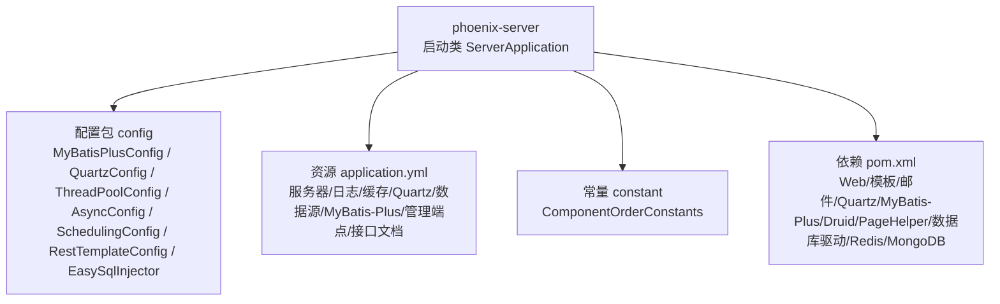
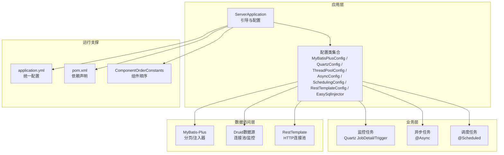
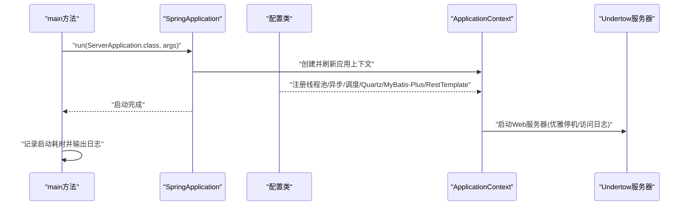
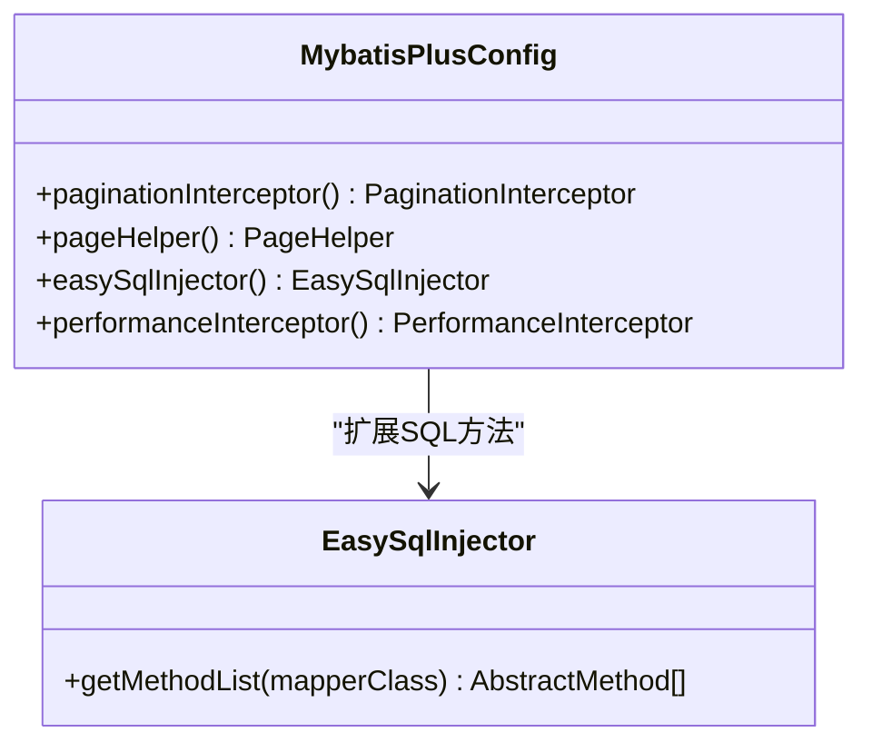
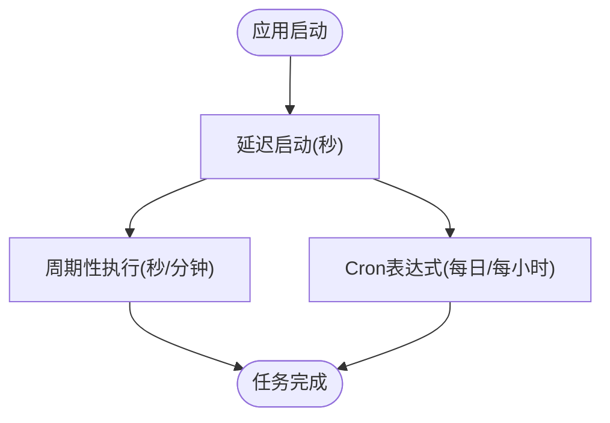
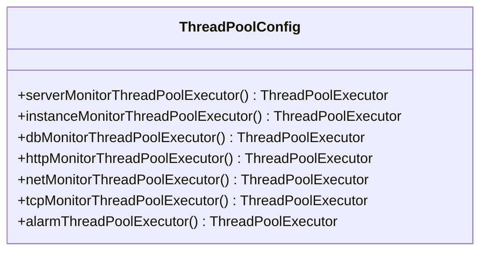
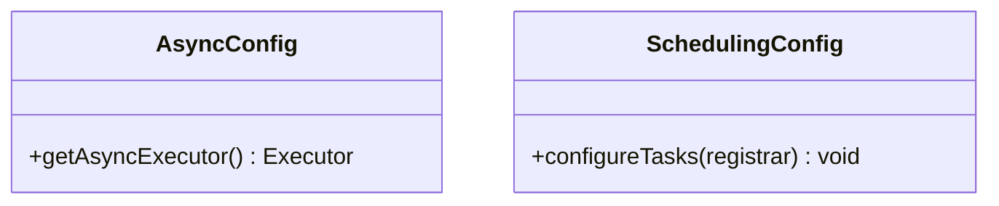
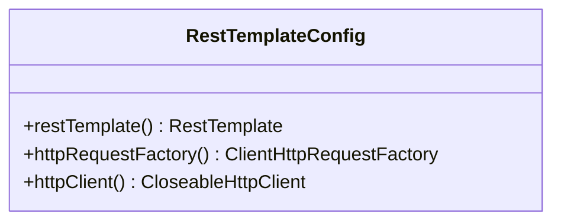
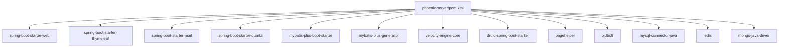

# 服务端架构设计

<cite>
**本文引用的文件**
- [ServerApplication.java](file://phoenix-server/src/main/java/com/gitee/pifeng/monitoring/server/ServerApplication.java)
- [MybatisPlusConfig.java](file://phoenix-server/src/main/java/com/gitee/pifeng/monitoring/server/config/MybatisPlusConfig.java)
- [QuartzConfig.java](file://phoenix-server/src/main/java/com/gitee/pifeng/monitoring/server/config/QuartzConfig.java)
- [AsyncConfig.java](file://phoenix-server/src/main/java/com/gitee/pifeng/monitoring/server/config/AsyncConfig.java)
- [SchedulingConfig.java](file://phoenix-server/src/main/java/com/gitee/pifeng/monitoring/server/config/SchedulingConfig.java)
- [ThreadPoolConfig.java](file://phoenix-server/src/main/java/com/gitee/pifeng/monitoring/server/config/ThreadPoolConfig.java)
- [RestTemplateConfig.java](file://phoenix-server/src/main/java/com/gitee/pifeng/monitoring/server/config/RestTemplateConfig.java)
- [EasySqlInjector.java](file://phoenix-server/src/main/java/com/gitee/pifeng/monitoring/server/config/EasySqlInjector.java)
- [ComponentOrderConstants.java](file://phoenix-server/src/main/java/com/gitee/pifeng/monitoring/server/constant/ComponentOrderConstants.java)
- [application.yml](file://phoenix-server/src/main/resources/application.yml)
- [pom.xml](file://phoenix-server/pom.xml)
</cite>

## 目录
1. [引言](#引言)
2. [项目结构](#项目结构)
3. [核心组件](#核心组件)
4. [架构总览](#架构总览)
5. [详细组件分析](#详细组件分析)
6. [依赖分析](#依赖分析)
7. [性能考量](#性能考量)
8. [故障排查指南](#故障排查指南)
9. [结论](#结论)
10. [附录](#附录)

## 引言
本技术文档面向监控服务端（phoenix-server）的架构设计与实现细节，重点阐述以下内容：
- 启动流程与初始化过程：从main方法执行到Spring Boot自动装配、组件扫描、缓存启用、事务管理等核心配置的落地。
- 整体架构模式：分层架构、模块化组织、依赖注入机制与组件生命周期管理。
- 核心配置类的作用：MyBatis-Plus配置、Quartz定时任务配置、线程池配置、异步与调度配置、HTTP客户端连接池配置等。
- 性能优化策略：缓存配置、异步处理、连接池优化、线程池调优与监控指标。
- 架构图与组件关系图：帮助开发者快速理解服务端整体设计思路。

## 项目结构
phoenix-server作为独立的Spring Boot应用，采用标准的Maven多模块布局，核心源码位于phoenix-server模块内，主要包含：
- 启动类：ServerApplication，负责引导Spring Boot应用并记录启动耗时。
- 配置包：config，集中管理MyBatis-Plus、Quartz、线程池、异步、调度、RestTemplate等配置。
- 常量包：constant，定义组件执行顺序常量，辅助控制组件加载优先级。
- 资源：application.yml，集中管理服务端运行所需的各类配置项（服务器、日志、缓存、Quartz、数据源、MyBatis-Plus、管理端点、接口文档等）。
- 依赖：pom.xml，声明Web、模板引擎、邮件、Quartz、MyBatis-Plus、Druid、分页插件、数据库驱动、Redis、MongoDB等依赖。

**图表来源**
- [ServerApplication.java:38-45](file://phoenix-server/src/main/java/com/gitee/pifeng/monitoring/server/ServerApplication.java#L38-L45)
- [application.yml:1-271](file://phoenix-server/src/main/resources/application.yml#L1-L271)
- [pom.xml:1-145](file://phoenix-server/pom.xml#L1-L145)

**章节来源**
- [ServerApplication.java:1-48](file://phoenix-server/src/main/java/com/gitee/pifeng/monitoring/server/ServerApplication.java#L1-L48)
- [application.yml:1-271](file://phoenix-server/src/main/resources/application.yml#L1-L271)
- [pom.xml:1-145](file://phoenix-server/pom.xml#L1-L145)

## 核心组件
本节聚焦于服务端启动与初始化的关键组件及其职责：
- 启动类与引导：ServerApplication通过SpringApplication.run引导应用，启用缓存、事务管理、组件扫描、AOP代理与重试机制，并记录启动耗时。
- 配置类：MyBatis-Plus配置、Quartz定时任务配置、线程池配置、异步与调度配置、RestTemplate连接池配置、自定义SQL注入器。
- 资源与依赖：application.yml集中管理运行参数，pom.xml声明运行所需依赖。

**章节来源**
- [ServerApplication.java:28-45](file://phoenix-server/src/main/java/com/gitee/pifeng/monitoring/server/ServerApplication.java#L28-L45)
- [MybatisPlusConfig.java:24-112](file://phoenix-server/src/main/java/com/gitee/pifeng/monitoring/server/config/MybatisPlusConfig.java#L24-L112)
- [QuartzConfig.java:25-399](file://phoenix-server/src/main/java/com/gitee/pifeng/monitoring/server/config/QuartzConfig.java#L25-L399)
- [ThreadPoolConfig.java:21-211](file://phoenix-server/src/main/java/com/gitee/pifeng/monitoring/server/config/ThreadPoolConfig.java#L21-L211)
- [AsyncConfig.java:18-37](file://phoenix-server/src/main/java/com/gitee/pifeng/monitoring/server/config/AsyncConfig.java#L18-L37)
- [SchedulingConfig.java:19-38](file://phoenix-server/src/main/java/com/gitee/pifeng/monitoring/server/config/SchedulingConfig.java#L19-L38)
- [RestTemplateConfig.java:41-144](file://phoenix-server/src/main/java/com/gitee/pifeng/monitoring/server/config/RestTemplateConfig.java#L41-L144)
- [EasySqlInjector.java:17-27](file://phoenix-server/src/main/java/com/gitee/pifeng/monitoring/server/config/EasySqlInjector.java#L17-L27)
- [application.yml:34-271](file://phoenix-server/src/main/resources/application.yml#L34-L271)
- [pom.xml:27-101](file://phoenix-server/pom.xml#L27-L101)

## 架构总览
服务端采用分层架构与模块化组织，结合Spring Boot自动装配与组件扫描，形成清晰的职责边界与扩展点。核心架构要点如下：
- 分层架构：表现层（Web控制器）、业务层（监控任务与服务）、数据访问层（MyBatis-Plus + Druid连接池）。
- 模块化组织：配置类按功能拆分，便于维护与替换；资源文件集中管理运行参数。
- 依赖注入：通过@ComponentScan与@EnableAspectJAutoProxy、@EnableTransactionManagement等注解启用容器管理与AOP事务。
- 定时与异步：Quartz负责周期性监控任务，@Async与@Scheduled分别承担异步与调度任务的线程池管理。
- 性能与可观测性：缓存（Caffeine）、连接池（Druid/HTTP）、线程池（IO密集型）、管理端点（shutdown/health）与接口文档（Knife4j/SpringDoc）。

**图表来源**
- [ServerApplication.java:36-45](file://phoenix-server/src/main/java/com/gitee/pifeng/monitoring/server/ServerApplication.java#L36-L45)
- [MybatisPlusConfig.java:26-93](file://phoenix-server/src/main/java/com/gitee/pifeng/monitoring/server/config/MybatisPlusConfig.java#L26-L93)
- [QuartzConfig.java:25-399](file://phoenix-server/src/main/java/com/gitee/pifeng/monitoring/server/config/QuartzConfig.java#L25-L399)
- [ThreadPoolConfig.java:21-211](file://phoenix-server/src/main/java/com/gitee/pifeng/monitoring/server/config/ThreadPoolConfig.java#L21-L211)
- [AsyncConfig.java:18-37](file://phoenix-server/src/main/java/com/gitee/pifeng/monitoring/server/config/AsyncConfig.java#L18-L37)
- [SchedulingConfig.java:19-38](file://phoenix-server/src/main/java/com/gitee/pifeng/monitoring/server/config/SchedulingConfig.java#L19-L38)
- [RestTemplateConfig.java:41-144](file://phoenix-server/src/main/java/com/gitee/pifeng/monitoring/server/config/RestTemplateConfig.java#L41-L144)
- [application.yml:34-271](file://phoenix-server/src/main/resources/application.yml#L34-L271)
- [pom.xml:27-101](file://phoenix-server/pom.xml#L27-L101)
- [ComponentOrderConstants.java:14-52](file://phoenix-server/src/main/java/com/gitee/pifeng/monitoring/server/constant/ComponentOrderConstants.java#L14-L52)

## 详细组件分析

### 启动流程与初始化过程
- main方法执行：ServerApplication.main启动计时器，调用SpringApplication.run引导应用，记录启动耗时并输出日志。
- 自动配置与组件扫描：@SpringBootApplication排除Mongo自动配置，启用缓存、事务管理、AOP代理与重试；@ComponentScan使用自定义Bean命名生成器以避免冲突。
- Web服务器定制：继承自自定义的Undertow Web服务器工厂定制器，支持优雅停机与访问日志配置。
- 初始化阶段：Spring容器加载配置类，注册线程池、异步执行器、调度器、Quartz、MyBatis-Plus、RestTemplate等组件。

**图表来源**
- [ServerApplication.java:38-45](file://phoenix-server/src/main/java/com/gitee/pifeng/monitoring/server/ServerApplication.java#L38-L45)
- [application.yml:2-21](file://phoenix-server/src/main/resources/application.yml#L2-L21)

**章节来源**
- [ServerApplication.java:28-45](file://phoenix-server/src/main/java/com/gitee/pifeng/monitoring/server/ServerApplication.java#L28-L45)
- [application.yml:2-21](file://phoenix-server/src/main/resources/application.yml#L2-L21)

### MyBatis-Plus配置
- Mapper扫描：通过@MapperScan扫描业务DAO包，使用自定义Bean命名生成器避免命名冲突。
- 分页插件：配置PaginationInterceptor与PageHelper，支持合理化分页与RowBounds兼容。
- 自定义SQL注入器：扩展DefaultSqlInjector，新增批量插入方法，提升批量写入效率。
- 性能拦截（开发环境）：在test Profile下启用PerformanceInterceptor，辅助SQL性能分析。
- MyBatis-Plus全局配置：映射驼峰、数据库标识、表名下划线策略等。

**图表来源**
- [MybatisPlusConfig.java:26-93](file://phoenix-server/src/main/java/com/gitee/pifeng/monitoring/server/config/MybatisPlusConfig.java#L26-L93)
- [EasySqlInjector.java:17-27](file://phoenix-server/src/main/java/com/gitee/pifeng/monitoring/server/config/EasySqlInjector.java#L17-L27)

**章节来源**
- [MybatisPlusConfig.java:24-112](file://phoenix-server/src/main/java/com/gitee/pifeng/monitoring/server/config/MybatisPlusConfig.java#L24-L112)
- [application.yml:186-217](file://phoenix-server/src/main/resources/application.yml#L186-L217)

### Quartz定时任务配置
- JobDetail与Trigger：为应用实例、服务器、数据库、网络、TCP、HTTP、历史数据清理、告警监控等任务分别配置JobDetail与Trigger。
- 触发策略：部分任务延迟启动后周期执行，部分使用Cron表达式按日/小时频率执行。
- Quartz持久化：使用LocalDataSourceJobStore与JDBC持久化，开启集群与优雅停机等待。

**图表来源**
- [QuartzConfig.java:49-75](file://phoenix-server/src/main/java/com/gitee/pifeng/monitoring/server/config/QuartzConfig.java#L49-L75)
- [QuartzConfig.java:106-115](file://phoenix-server/src/main/java/com/gitee/pifeng/monitoring/server/config/QuartzConfig.java#L106-L115)
- [QuartzConfig.java:146-155](file://phoenix-server/src/main/java/com/gitee/pifeng/monitoring/server/config/QuartzConfig.java#L146-L155)
- [QuartzConfig.java:346-356](file://phoenix-server/src/main/java/com/gitee/pifeng/monitoring/server/config/QuartzConfig.java#L346-L356)

**章节来源**
- [QuartzConfig.java:25-399](file://phoenix-server/src/main/java/com/gitee/pifeng/monitoring/server/config/QuartzConfig.java#L25-L399)
- [application.yml:67-105](file://phoenix-server/src/main/resources/application.yml#L67-L105)

### 线程池配置
- IO密集型线程池：基于CPU核数与阻塞系数计算线程数，使用LinkedBlockingQueue与AbortPolicy拒绝策略，守护线程命名规范。
- 多任务专用线程池：分别为服务器监控、应用实例监控、数据库监控、HTTP监控、网络监控、TCP监控、告警任务提供独立线程池，确保任务隔离与资源可控。
- 懒加载：通过@Lazy避免启动时过度占用资源。

**图表来源**
- [ThreadPoolConfig.java:33-50](file://phoenix-server/src/main/java/com/gitee/pifeng/monitoring/server/config/ThreadPoolConfig.java#L33-L50)
- [ThreadPoolConfig.java:61-78](file://phoenix-server/src/main/java/com/gitee/pifeng/monitoring/server/config/ThreadPoolConfig.java#L61-L78)
- [ThreadPoolConfig.java:87-104](file://phoenix-server/src/main/java/com/gitee/pifeng/monitoring/server/config/ThreadPoolConfig.java#L87-L104)
- [ThreadPoolConfig.java:113-130](file://phoenix-server/src/main/java/com/gitee/pifeng/monitoring/server/config/ThreadPoolConfig.java#L113-L130)
- [ThreadPoolConfig.java:139-156](file://phoenix-server/src/main/java/com/gitee/pifeng/monitoring/server/config/ThreadPoolConfig.java#L139-L156)
- [ThreadPoolConfig.java:165-182](file://phoenix-server/src/main/java/com/gitee/pifeng/monitoring/server/config/ThreadPoolConfig.java#L165-L182)
- [ThreadPoolConfig.java:191-208](file://phoenix-server/src/main/java/com/gitee/pifeng/monitoring/server/config/ThreadPoolConfig.java#L191-L208)

**章节来源**
- [ThreadPoolConfig.java:21-211](file://phoenix-server/src/main/java/com/gitee/pifeng/monitoring/server/config/ThreadPoolConfig.java#L21-L211)

### 异步与调度配置
- 异步配置：@EnableAsync + AsyncConfigurer，使用通用IO密集型线程池作为异步执行器。
- 调度配置：@EnableScheduling + SchedulingConfigurer，使用通用IO密集型Scheduled线程池作为调度执行器。

**图表来源**
- [AsyncConfig.java:18-37](file://phoenix-server/src/main/java/com/gitee/pifeng/monitoring/server/config/AsyncConfig.java#L18-L37)
- [SchedulingConfig.java:19-38](file://phoenix-server/src/main/java/com/gitee/pifeng/monitoring/server/config/SchedulingConfig.java#L19-L38)

**章节来源**
- [AsyncConfig.java:18-37](file://phoenix-server/src/main/java/com/gitee/pifeng/monitoring/server/config/AsyncConfig.java#L18-L37)
- [SchedulingConfig.java:19-38](file://phoenix-server/src/main/java/com/gitee/pifeng/monitoring/server/config/SchedulingConfig.java#L19-L38)

### HTTP客户端连接池配置
- 连接池：基于Apache HttpClient的PoolingHttpClientConnectionManager，设置最大连接、路由并发、空闲回收、超时与重试策略。
- 请求工厂：HttpComponentsClientHttpRequestFactory封装，供RestTemplate使用。
- 日志与监控：初始化成功日志输出，Druid监控可选。

**图表来源**
- [RestTemplateConfig.java:54-59](file://phoenix-server/src/main/java/com/gitee/pifeng/monitoring/server/config/RestTemplateConfig.java#L54-L59)
- [RestTemplateConfig.java:70-73](file://phoenix-server/src/main/java/com/gitee/pifeng/monitoring/server/config/RestTemplateConfig.java#L70-L73)
- [RestTemplateConfig.java:84-141](file://phoenix-server/src/main/java/com/gitee/pifeng/monitoring/server/config/RestTemplateConfig.java#L84-L141)

**章节来源**
- [RestTemplateConfig.java:41-144](file://phoenix-server/src/main/java/com/gitee/pifeng/monitoring/server/config/RestTemplateConfig.java#L41-L144)

### 缓存与事务管理
- 缓存：Caffeine缓存，最大条数与访问过期策略配置，适用于查询热点数据。
- 事务：启用事务管理，结合AOP代理与重试机制，提升数据一致性与容错能力。
- 组件顺序：通过ComponentOrderConstants为不同监控组件设定加载顺序，确保依赖满足。

**章节来源**
- [application.yml:38-47](file://phoenix-server/src/main/resources/application.yml#L38-L47)
- [ServerApplication.java:30-34](file://phoenix-server/src/main/java/com/gitee/pifeng/monitoring/server/ServerApplication.java#L30-L34)
- [ComponentOrderConstants.java:14-52](file://phoenix-server/src/main/java/com/gitee/pifeng/monitoring/server/constant/ComponentOrderConstants.java#L14-L52)

## 依赖分析
服务端依赖围绕Web、模板引擎、邮件、Quartz、MyBatis-Plus、Druid、分页插件、数据库驱动、Redis、MongoDB展开，构建完整的监控平台后端能力。

**图表来源**
- [pom.xml:27-101](file://phoenix-server/pom.xml#L27-L101)

**章节来源**
- [pom.xml:1-145](file://phoenix-server/pom.xml#L1-L145)

## 性能考量
- 缓存策略：Caffeine缓存用于热点查询，合理设置最大条数与过期策略，减少数据库压力。
- 异步处理：@Async与@Scheduled使用IO密集型线程池，避免阻塞主线程，提升吞吐。
- 连接池优化：
  - Druid数据源：合理设置初始连接、最小空闲、最大活跃、等待超时、PSCache大小与慢SQL统计，开启Web监控与Spring监控。
  - HTTP连接池：设置最大连接、路由并发、空闲回收、超时与重试，避免连接池瓶颈。
- 线程池调优：按任务类型划分线程池，避免相互影响；守护线程命名规范，便于问题定位。
- 监控与可观测性：管理端点暴露shutdown/health，接口文档集成Knife4j/SpringDoc，便于运维与开发调试。

**章节来源**
- [application.yml:116-184](file://phoenix-server/src/main/resources/application.yml#L116-L184)
- [RestTemplateConfig.java:102-138](file://phoenix-server/src/main/java/com/gitee/pifeng/monitoring/server/config/RestTemplateConfig.java#L102-L138)
- [ThreadPoolConfig.java:33-50](file://phoenix-server/src/main/java/com/gitee/pifeng/monitoring/server/config/ThreadPoolConfig.java#L33-L50)
- [AsyncConfig.java:30-34](file://phoenix-server/src/main/java/com/gitee/pifeng/monitoring/server/config/AsyncConfig.java#L30-L34)
- [SchedulingConfig.java:32-35](file://phoenix-server/src/main/java/com/gitee/pifeng/monitoring/server/config/SchedulingConfig.java#L32-L35)
- [application.yml:219-271](file://phoenix-server/src/main/resources/application.yml#L219-L271)

## 故障排查指南
- 启动耗时与日志：关注ServerApplication启动计时与日志输出，定位启动阶段耗时过长的问题。
- 缓存与事务：确认缓存配置与事务注解使用正确，避免缓存穿透与事务传播异常。
- Quartz集群与持久化：检查Quartz JDBC持久化配置与集群检查间隔，确保分布式节点一致性。
- 数据源与连接池：监控Druid连接池指标（活跃/空闲/等待/超时），调整初始大小与最大活跃，避免连接不足或泄漏。
- HTTP连接池：关注连接池等待超时与重试次数，必要时增大最大连接与超时阈值。
- 线程池：观察线程池队列长度与拒绝策略触发情况，按任务类型扩容或分离线程池。
- 管理端点：通过/actuator/shutdown与/actuator/health进行健康检查与优雅停机验证。

**章节来源**
- [ServerApplication.java:38-45](file://phoenix-server/src/main/java/com/gitee/pifeng/monitoring/server/ServerApplication.java#L38-L45)
- [application.yml:219-234](file://phoenix-server/src/main/resources/application.yml#L219-L234)
- [application.yml:67-105](file://phoenix-server/src/main/resources/application.yml#L67-L105)
- [application.yml:116-184](file://phoenix-server/src/main/resources/application.yml#L116-L184)
- [RestTemplateConfig.java:102-138](file://phoenix-server/src/main/java/com/gitee/pifeng/monitoring/server/config/RestTemplateConfig.java#L102-L138)
- [ThreadPoolConfig.java:33-50](file://phoenix-server/src/main/java/com/gitee/pifeng/monitoring/server/config/ThreadPoolConfig.java#L33-L50)

## 结论
服务端通过Spring Boot自动装配与模块化配置，实现了监控任务的高可靠与高性能运行。启动流程清晰、配置层次分明、线程池与连接池优化到位，配合Quartz与异步/调度机制，满足大规模监控场景下的稳定性与扩展性需求。建议在生产环境中持续关注缓存命中率、线程池饱和度、数据库连接池健康度与HTTP连接池利用率，以维持最优性能。

## 附录
- 接口文档：Knife4j与SpringDoc集成，路径与基本认证可在application.yml中配置。
- 环境切换：通过profiles.active切换dev/prod等环境，配合不同配置文件实现差异化部署。

**章节来源**
- [application.yml:236-271](file://phoenix-server/src/main/resources/application.yml#L236-L271)
- [pom.xml:56-58](file://phoenix-server/pom.xml#L56-L58)