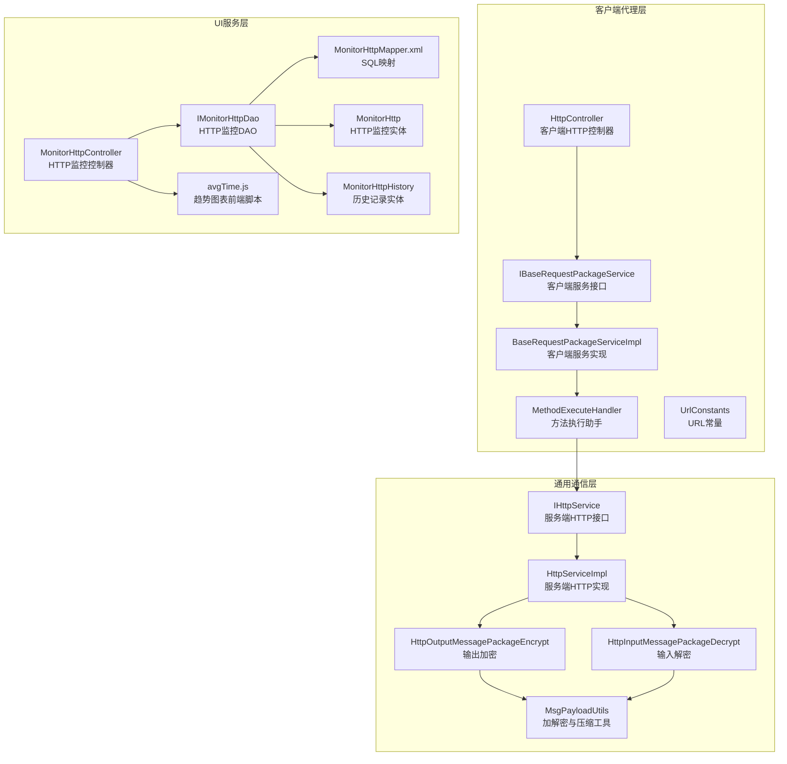
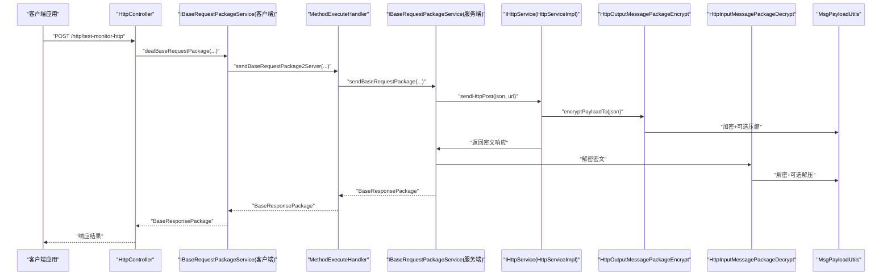
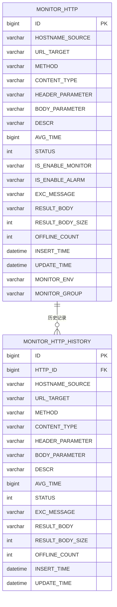
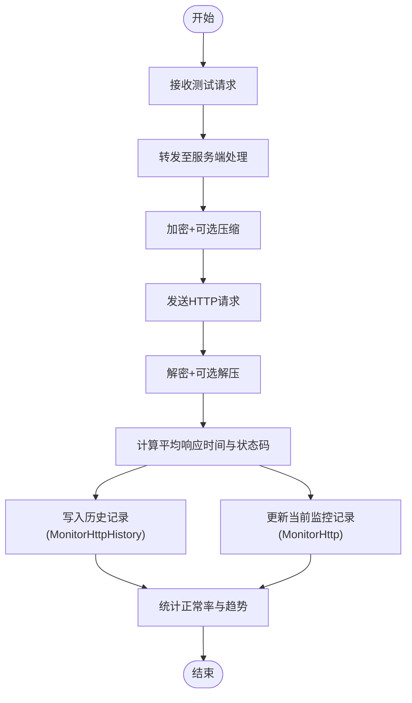
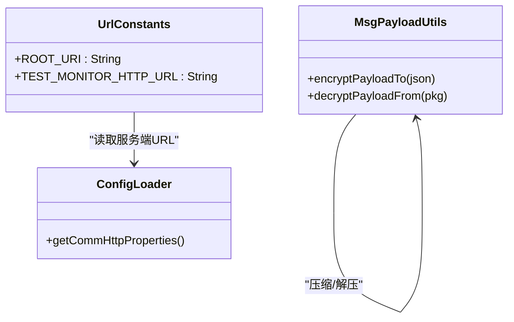
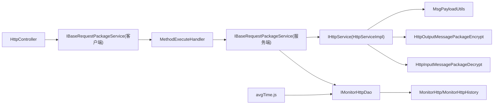

# HTTP监控业务

<cite>
**本文引用的文件**
- [HttpController.java](file://phoenix-agent/src/main/java/com/gitee/pifeng/monitoring/agent/business/client/controller/HttpController.java)
- [IBaseRequestPackageService.java](file://phoenix-agent/src/main/java/com/gitee/pifeng/monitoring/agent/business/client/service/IBaseRequestPackageService.java)
- [BaseRequestPackageServiceImpl.java](file://phoenix-agent/src/main/java/com/gitee/pifeng/monitoring/agent/business/client/service/impl/BaseRequestPackageServiceImpl.java)
- [IBaseRequestPackageService.java](file://phoenix-agent/src/main/java/com/gitee/pifeng/monitoring/agent/business/server/service/IBaseRequestPackageService.java)
- [BaseRequestPackageServiceImpl.java](file://phoenix-agent/src/main/java/com/gitee/pifeng/monitoring/agent/business/server/service/impl/BaseRequestPackageServiceImpl.java)
- [IHttpService.java](file://phoenix-agent/src/main/java/com/gitee/pifeng/monitoring/agent/business/server/service/IHttpService.java)
- [HttpServiceImpl.java](file://phoenix-agent/src/main/java/com/gitee/pifeng/monitoring/agent/business/server/service/impl/HttpServiceImpl.java)
- [MethodExecuteHandler.java](file://phoenix-agent/src/main/java/com/gitee/pifeng/monitoring/agent/core/MethodExecuteHandler.java)
- [UrlConstants.java](file://phoenix-agent/src/main/java/com/gitee/pifeng/monitoring/agent/constant/UrlConstants.java)
- [HttpOutputMessagePackageEncrypt.java](file://phoenix-common/phoenix-common-web/src/main/java/com/gitee/pifeng/monitoring/common/web/core/http/HttpOutputMessagePackageEncrypt.java)
- [HttpInputMessagePackageDecrypt.java](file://phoenix-common/phoenix-common-web/src/main/java/com/gitee/pifeng/monitoring/common/web/core/http/HttpInputMessagePackageDecrypt.java)
- [MsgPayloadUtils.java](file://phoenix-common/phoenix-common-core/src/main/java/com/gitee/pifeng/monitoring/common/util/MsgPayloadUtils.java)
- [MonitorHttp.java](file://phoenix-ui/src/main/java/com/gitee/pifeng/monitoring/ui/business/web/entity/MonitorHttp.java)
- [MonitorHttpHistory.java](file://phoenix-ui/src/main/java/com/gitee/pifeng/monitoring/ui/business/web/entity/MonitorHttpHistory.java)
- [IMonitorHttpDao.java](file://phoenix-ui/src/main/java/com/gitee/pifeng/monitoring/ui/business/web/dao/IMonitorHttpDao.java)
- [MonitorHttpMapper.xml](file://phoenix-ui/src/main/java/com/gitee/pifeng/monitoring/ui/business/web/mapper/MonitorHttpMapper.xml)
- [MonitorHttpController.java](file://phoenix-ui/src/main/java/com/gitee/pifeng/monitoring/ui/business/web/controller/MonitorHttpController.java)
- [MonitorHttpHistoryServiceImpl.java](file://phoenix-ui/src/main/java/com/gitee/pifeng/monitoring/ui/business/web/service/impl/MonitorHttpHistoryServiceImpl.java)
- [avgTime.js](file://phoenix-ui/src/main/resources/static/modules/http/avgTime.js)
- [HomeHttpVo.java](file://phoenix-ui/src/main/java/com/gitee/pifeng/monitoring/ui/business/web/vo/HomeHttpVo.java)
- [ConfigLoader.java](file://phoenix-client/phoenix-client-core/src/main/java/com/gitee/pifeng/monitoring/plug/core/ConfigLoader.java)
</cite>

## 目录
1. [引言](#引言)
2. [项目结构](#项目结构)
3. [核心组件](#核心组件)
4. [架构总览](#架构总览)
5. [详细组件分析](#详细组件分析)
6. [依赖分析](#依赖分析)
7. [性能考虑](#性能考虑)
8. [故障排查指南](#故障排查指南)
9. [结论](#结论)
10. [附录](#附录)

## 引言
本文件面向HTTP监控业务，围绕HttpController的实现与相关数据模型、业务流程、配置与扩展性进行系统化说明。重点覆盖以下方面：
- HTTP请求监控：从客户端发起测试请求到服务端处理与回传响应的完整链路
- 响应时间统计：平均响应时间、异常与正常区分、历史趋势分析
- 错误率与成功率：基于状态码的统计口径与可视化呈现
- 数据模型：MonitorHttp与MonitorHttpHistory实体及DAO映射
- 配置管理与扩展：客户端HTTP连接超时、服务端URL配置、加密压缩策略

## 项目结构
HTTP监控涉及三层协作：
- 客户端代理层：负责封装请求、转发至服务端
- 通用通信层：负责数据包加密/解密、压缩/解压、RestTemplate调用
- UI服务层：负责HTTP监控配置、历史统计、趋势图表

**图表来源**
- [HttpController.java:1-61](file://phoenix-agent/src/main/java/com/gitee/pifeng/monitoring/agent/business/client/controller/HttpController.java#L1-L61)
- [IBaseRequestPackageService.java:1-29](file://phoenix-agent/src/main/java/com/gitee/pifeng/monitoring/agent/business/client/service/IBaseRequestPackageService.java#L1-L29)
- [BaseRequestPackageServiceImpl.java:1-37](file://phoenix-agent/src/main/java/com/gitee/pifeng/monitoring/agent/business/client/service/impl/BaseRequestPackageServiceImpl.java#L1-L37)
- [MethodExecuteHandler.java:1-164](file://phoenix-agent/src/main/java/com/gitee/pifeng/monitoring/agent/core/MethodExecuteHandler.java#L1-L164)
- [UrlConstants.java:1-127](file://phoenix-agent/src/main/java/com/gitee/pifeng/monitoring/agent/constant/UrlConstants.java#L1-L127)
- [IHttpService.java:1-35](file://phoenix-agent/src/main/java/com/gitee/pifeng/monitoring/agent/business/server/service/IHttpService.java#L1-L35)
- [HttpServiceImpl.java:1-66](file://phoenix-agent/src/main/java/com/gitee/pifeng/monitoring/agent/business/server/service/impl/HttpServiceImpl.java#L1-L66)
- [HttpOutputMessagePackageEncrypt.java:1-40](file://phoenix-common/phoenix-common-web/src/main/java/com/gitee/pifeng/monitoring/common/web/core/http/HttpOutputMessagePackageEncrypt.java#L1-L40)
- [HttpInputMessagePackageDecrypt.java:1-102](file://phoenix-common/phoenix-common-web/src/main/java/com/gitee/pifeng/monitoring/common/web/core/http/HttpInputMessagePackageDecrypt.java#L1-L102)
- [MsgPayloadUtils.java:1-120](file://phoenix-common/phoenix-common-core/src/main/java/com/gitee/pifeng/monitoring/common/util/MsgPayloadUtils.java#L1-L120)
- [MonitorHttp.java:1-116](file://phoenix-ui/src/main/java/com/gitee/pifeng/monitoring/ui/business/web/entity/MonitorHttp.java#L1-L116)
- [MonitorHttpHistory.java:1-106](file://phoenix-ui/src/main/java/com/gitee/pifeng/monitoring/ui/business/web/entity/MonitorHttpHistory.java#L1-L106)
- [IMonitorHttpDao.java:1-28](file://phoenix-ui/src/main/java/com/gitee/pifeng/monitoring/ui/business/web/dao/IMonitorHttpDao.java#L1-L28)
- [MonitorHttpMapper.xml:1-20](file://phoenix-ui/src/main/java/com/gitee/pifeng/monitoring/ui/business/web/mapper/MonitorHttpMapper.xml#L1-L20)
- [MonitorHttpController.java:125-293](file://phoenix-ui/src/main/java/com/gitee/pifeng/monitoring/ui/business/web/controller/MonitorHttpController.java#L125-L293)
- [avgTime.js:31-62](file://phoenix-ui/src/main/resources/static/modules/http/avgTime.js#L31-L62)

**章节来源**
- [HttpController.java:1-61](file://phoenix-agent/src/main/java/com/gitee/pifeng/monitoring/agent/business/client/controller/HttpController.java#L1-L61)
- [MonitorHttpController.java:125-293](file://phoenix-ui/src/main/java/com/gitee/pifeng/monitoring/ui/business/web/controller/MonitorHttpController.java#L125-L293)

## 核心组件
- 客户端HTTP控制器：对外暴露“测试HTTP连通性”接口，接收基础请求包并转发给服务端
- 基础请求包服务：客户端与服务端均提供该服务，用于统一封装与转发请求
- 服务端HTTP服务：负责加密、压缩、发送HTTP请求并解密响应
- 数据模型：MonitorHttp（当前监控状态）、MonitorHttpHistory（历史统计）
- DAO与SQL：提供HTTP正常率统计与历史趋势查询能力
- 前端脚本：根据历史数据生成平均响应时间趋势图

**章节来源**
- [HttpController.java:52-58](file://phoenix-agent/src/main/java/com/gitee/pifeng/monitoring/agent/business/client/controller/HttpController.java#L52-L58)
- [MonitorHttp.java:67-113](file://phoenix-ui/src/main/java/com/gitee/pifeng/monitoring/ui/business/web/entity/MonitorHttp.java#L67-L113)
- [MonitorHttpHistory.java:73-103](file://phoenix-ui/src/main/java/com/gitee/pifeng/monitoring/ui/business/web/entity/MonitorHttpHistory.java#L73-L103)
- [IMonitorHttpDao.java:18-27](file://phoenix-ui/src/main/java/com/gitee/pifeng/monitoring/ui/business/web/dao/IMonitorHttpDao.java#L18-L27)
- [MonitorHttpMapper.xml:5-18](file://phoenix-ui/src/main/java/com/gitee/pifeng/monitoring/ui/business/web/mapper/MonitorHttpMapper.xml#L5-L18)
- [avgTime.js:31-62](file://phoenix-ui/src/main/resources/static/modules/http/avgTime.js#L31-L62)

## 架构总览
HTTP监控的端到端链路如下：

**图表来源**
- [HttpController.java:52-58](file://phoenix-agent/src/main/java/com/gitee/pifeng/monitoring/agent/business/client/controller/HttpController.java#L52-L58)
- [IBaseRequestPackageService.java:14-28](file://phoenix-agent/src/main/java/com/gitee/pifeng/monitoring/agent/business/client/service/IBaseRequestPackageService.java#L14-L28)
- [BaseRequestPackageServiceImpl.java:31-35](file://phoenix-agent/src/main/java/com/gitee/pifeng/monitoring/agent/business/client/service/impl/BaseRequestPackageServiceImpl.java#L31-L35)
- [MethodExecuteHandler.java:131-136](file://phoenix-agent/src/main/java/com/gitee/pifeng/monitoring/agent/core/MethodExecuteHandler.java#L131-L136)
- [IBaseRequestPackageService.java:16-32](file://phoenix-agent/src/main/java/com/gitee/pifeng/monitoring/agent/business/server/service/IBaseRequestPackageService.java#L16-L32)
- [BaseRequestPackageServiceImpl.java:46-46](file://phoenix-agent/src/main/java/com/gitee/pifeng/monitoring/agent/business/server/service/impl/BaseRequestPackageServiceImpl.java#L46-L46)
- [IHttpService.java:13-33](file://phoenix-agent/src/main/java/com/gitee/pifeng/monitoring/agent/business/server/service/IHttpService.java#L13-L33)
- [HttpServiceImpl.java:50-64](file://phoenix-agent/src/main/java/com/gitee/pifeng/monitoring/agent/business/server/service/impl/HttpServiceImpl.java#L50-L64)
- [HttpOutputMessagePackageEncrypt.java:29-38](file://phoenix-common/phoenix-common-web/src/main/java/com/gitee/pifeng/monitoring/common/web/core/http/HttpOutputMessagePackageEncrypt.java#L29-L38)
- [HttpInputMessagePackageDecrypt.java:72-84](file://phoenix-common/phoenix-common-web/src/main/java/com/gitee/pifeng/monitoring/common/web/core/http/HttpInputMessagePackageDecrypt.java#L72-L84)
- [MsgPayloadUtils.java:42-102](file://phoenix-common/phoenix-common-core/src/main/java/com/gitee/pifeng/monitoring/common/util/MsgPayloadUtils.java#L42-L102)

## 详细组件分析

### 数据模型与统计口径
- MonitorHttp：记录当前HTTP监控实例的关键字段，如主机来源、目标URL、请求方法、媒体类型、请求头/体参数、平均响应时间、状态码、是否启用监控/告警、异常信息、结果体大小、离线次数、插入/更新时间、监控环境与分组等
- MonitorHttpHistory：记录历史统计，包含相同维度的历史快照，便于趋势分析
- DAO与SQL：提供HTTP正常率统计（按状态码200计为正常），以及历史趋势查询（区分所有与异常）

**图表来源**
- [MonitorHttp.java:27-115](file://phoenix-ui/src/main/java/com/gitee/pifeng/monitoring/ui/business/web/entity/MonitorHttp.java#L27-L115)
- [MonitorHttpHistory.java:28-105](file://phoenix-ui/src/main/java/com/gitee/pifeng/monitoring/ui/business/web/entity/MonitorHttpHistory.java#L28-L105)
- [IMonitorHttpDao.java:16-27](file://phoenix-ui/src/main/java/com/gitee/pifeng/monitoring/ui/business/web/dao/IMonitorHttpDao.java#L16-L27)
- [MonitorHttpMapper.xml:5-18](file://phoenix-ui/src/main/java/com/gitee/pifeng/monitoring/ui/business/web/mapper/MonitorHttpMapper.xml#L5-L18)

**章节来源**
- [MonitorHttp.java:67-113](file://phoenix-ui/src/main/java/com/gitee/pifeng/monitoring/ui/business/web/entity/MonitorHttp.java#L67-L113)
- [MonitorHttpHistory.java:73-103](file://phoenix-ui/src/main/java/com/gitee/pifeng/monitoring/ui/business/web/entity/MonitorHttpHistory.java#L73-L103)
- [IMonitorHttpDao.java:18-27](file://phoenix-ui/src/main/java/com/gitee/pifeng/monitoring/ui/business/web/dao/IMonitorHttpDao.java#L18-L27)
- [MonitorHttpMapper.xml:5-18](file://phoenix-ui/src/main/java/com/gitee/pifeng/monitoring/ui/business/web/mapper/MonitorHttpMapper.xml#L5-L18)

### 业务流程：请求接收、性能采集、统计分析与历史存储
- 请求接收：客户端通过HttpController暴露的接口提交测试请求
- 性能采集：服务端通过IBaseRequestPackageService转发请求，IHttpService执行加密压缩后发送HTTP请求，再解密响应，得到平均响应时间与状态码
- 统计分析：DAO层提供HTTP正常率统计；历史趋势由MonitorHttpHistory记录并按天聚合
- 历史存储：历史数据按来源主机、目标URL、方法等维度写入历史表，供前端图表使用

**图表来源**
- [HttpController.java:52-58](file://phoenix-agent/src/main/java/com/gitee/pifeng/monitoring/agent/business/client/controller/HttpController.java#L52-L58)
- [IBaseRequestPackageService.java:16-32](file://phoenix-agent/src/main/java/com/gitee/pifeng/monitoring/agent/business/server/service/IBaseRequestPackageService.java#L16-L32)
- [HttpServiceImpl.java:50-64](file://phoenix-agent/src/main/java/com/gitee/pifeng/monitoring/agent/business/server/service/impl/HttpServiceImpl.java#L50-L64)
- [MsgPayloadUtils.java:42-102](file://phoenix-common/phoenix-common-core/src/main/java/com/gitee/pifeng/monitoring/common/util/MsgPayloadUtils.java#L42-L102)
- [MonitorHttp.java:67-113](file://phoenix-ui/src/main/java/com/gitee/pifeng/monitoring/ui/business/web/entity/MonitorHttp.java#L67-L113)
- [MonitorHttpHistory.java:73-103](file://phoenix-ui/src/main/java/com/gitee/pifeng/monitoring/ui/business/web/entity/MonitorHttpHistory.java#L73-L103)
- [IMonitorHttpDao.java:18-27](file://phoenix-ui/src/main/java/com/gitee/pifeng/monitoring/ui/business/web/dao/IMonitorHttpDao.java#L18-L27)

**章节来源**
- [MonitorHttpController.java:125-147](file://phoenix-ui/src/main/java/com/gitee/pifeng/monitoring/ui/business/web/controller/MonitorHttpController.java#L125-L147)
- [MonitorHttpHistoryServiceImpl.java:55-85](file://phoenix-ui/src/main/java/com/gitee/pifeng/monitoring/ui/business/web/service/impl/MonitorHttpHistoryServiceImpl.java#L55-L85)

### 关键业务逻辑示例（以路径代替代码片段）
- 请求处理与转发
  - [HttpController.java:52-58](file://phoenix-agent/src/main/java/com/gitee/pifeng/monitoring/agent/business/client/controller/HttpController.java#L52-L58)
  - [IBaseRequestPackageService.java:14-28](file://phoenix-agent/src/main/java/com/gitee/pifeng/monitoring/agent/business/client/service/IBaseRequestPackageService.java#L14-L28)
  - [BaseRequestPackageServiceImpl.java:31-35](file://phoenix-agent/src/main/java/com/gitee/pifeng/monitoring/agent/business/client/service/impl/BaseRequestPackageServiceImpl.java#L31-L35)
  - [MethodExecuteHandler.java:131-136](file://phoenix-agent/src/main/java/com/gitee/pifeng/monitoring/agent/core/MethodExecuteHandler.java#L131-L136)
- 响应时间计算与状态码统计
  - [HttpServiceImpl.java:50-64](file://phoenix-agent/src/main/java/com/gitee/pifeng/monitoring/agent/business/server/service/impl/HttpServiceImpl.java#L50-L64)
  - [MsgPayloadUtils.java:85-102](file://phoenix-common/phoenix-common-core/src/main/java/com/gitee/pifeng/monitoring/common/util/MsgPayloadUtils.java#L85-L102)
- 错误统计与成功率分析
  - [MonitorHttpMapper.xml:5-18](file://phoenix-ui/src/main/java/com/gitee/pifeng/monitoring/ui/business/web/mapper/MonitorHttpMapper.xml#L5-L18)
  - [HomeHttpVo.java:27-41](file://phoenix-ui/src/main/java/com/gitee/pifeng/monitoring/ui/business/web/vo/HomeHttpVo.java#L27-L41)
- 性能趋势分析
  - [MonitorHttpHistoryServiceImpl.java:55-85](file://phoenix-ui/src/main/java/com/gitee/pifeng/monitoring/ui/business/web/service/impl/MonitorHttpHistoryServiceImpl.java#L55-L85)
  - [avgTime.js:31-62](file://phoenix-ui/src/main/resources/static/modules/http/avgTime.js#L31-L62)

**章节来源**
- [HttpController.java:52-58](file://phoenix-agent/src/main/java/com/gitee/pifeng/monitoring/agent/business/client/controller/HttpController.java#L52-L58)
- [HttpServiceImpl.java:50-64](file://phoenix-agent/src/main/java/com/gitee/pifeng/monitoring/agent/business/server/service/impl/HttpServiceImpl.java#L50-L64)
- [MonitorHttpMapper.xml:5-18](file://phoenix-ui/src/main/java/com/gitee/pifeng/monitoring/ui/business/web/mapper/MonitorHttpMapper.xml#L5-L18)
- [avgTime.js:31-62](file://phoenix-ui/src/main/resources/static/modules/http/avgTime.js#L31-L62)

### 配置管理与扩展性设计
- 服务端URL配置：UrlConstants从配置加载服务端根URL，拼接具体测试接口URL
- 客户端HTTP超时配置：ConfigLoader从配置中读取连接、套接字、连接池获取超时参数
- 加密与压缩：MsgPayloadUtils自动判断是否压缩，统一加解密流程
- 扩展性：通过接口抽象（IBaseRequestPackageService、IHttpService）与常量配置，支持不同监控场景与协议扩展

**图表来源**
- [UrlConstants.java:29-74](file://phoenix-agent/src/main/java/com/gitee/pifeng/monitoring/agent/constant/UrlConstants.java#L29-L74)
- [ConfigLoader.java:388-402](file://phoenix-client/phoenix-client-core/src/main/java/com/gitee/pifeng/monitoring/plug/core/ConfigLoader.java#L388-L402)
- [MsgPayloadUtils.java:42-102](file://phoenix-common/phoenix-common-core/src/main/java/com/gitee/pifeng/monitoring/common/util/MsgPayloadUtils.java#L42-L102)

**章节来源**
- [UrlConstants.java:29-74](file://phoenix-agent/src/main/java/com/gitee/pifeng/monitoring/agent/constant/UrlConstants.java#L29-L74)
- [ConfigLoader.java:388-402](file://phoenix-client/phoenix-client-core/src/main/java/com/gitee/pifeng/monitoring/plug/core/ConfigLoader.java#L388-L402)
- [MsgPayloadUtils.java:42-102](file://phoenix-common/phoenix-common-core/src/main/java/com/gitee/pifeng/monitoring/common/util/MsgPayloadUtils.java#L42-L102)

## 依赖分析
- 控制器到服务层：HttpController依赖IBaseRequestPackageService；服务端IBaseRequestPackageService依赖IHttpService
- 通信层：HttpServiceImpl依赖RestTemplate与MsgPayloadUtils；HttpOutputMessagePackageEncrypt与HttpInputMessagePackageDecrypt贯穿请求/响应处理
- 数据层：IMonitorHttpDao提供统计与历史查询；MonitorHttp与MonitorHttpHistory承载数据模型
- 前端：avgTime.js消费历史数据，生成趋势图

**图表来源**
- [HttpController.java:52-58](file://phoenix-agent/src/main/java/com/gitee/pifeng/monitoring/agent/business/client/controller/HttpController.java#L52-L58)
- [IBaseRequestPackageService.java:14-28](file://phoenix-agent/src/main/java/com/gitee/pifeng/monitoring/agent/business/client/service/IBaseRequestPackageService.java#L14-L28)
- [MethodExecuteHandler.java:131-136](file://phoenix-agent/src/main/java/com/gitee/pifeng/monitoring/agent/core/MethodExecuteHandler.java#L131-L136)
- [IBaseRequestPackageService.java:16-32](file://phoenix-agent/src/main/java/com/gitee/pifeng/monitoring/agent/business/server/service/IBaseRequestPackageService.java#L16-L32)
- [HttpServiceImpl.java:50-64](file://phoenix-agent/src/main/java/com/gitee/pifeng/monitoring/agent/business/server/service/impl/HttpServiceImpl.java#L50-L64)
- [MsgPayloadUtils.java:42-102](file://phoenix-common/phoenix-common-core/src/main/java/com/gitee/pifeng/monitoring/common/util/MsgPayloadUtils.java#L42-L102)
- [HttpOutputMessagePackageEncrypt.java:29-38](file://phoenix-common/phoenix-common-web/src/main/java/com/gitee/pifeng/monitoring/common/web/core/http/HttpOutputMessagePackageEncrypt.java#L29-L38)
- [HttpInputMessagePackageDecrypt.java:72-84](file://phoenix-common/phoenix-common-web/src/main/java/com/gitee/pifeng/monitoring/common/web/core/http/HttpInputMessagePackageDecrypt.java#L72-L84)
- [IMonitorHttpDao.java:16-27](file://phoenix-ui/src/main/java/com/gitee/pifeng/monitoring/ui/business/web/dao/IMonitorHttpDao.java#L16-L27)
- [MonitorHttp.java:27-115](file://phoenix-ui/src/main/java/com/gitee/pifeng/monitoring/ui/business/web/entity/MonitorHttp.java#L27-L115)
- [MonitorHttpHistory.java:28-105](file://phoenix-ui/src/main/java/com/gitee/pifeng/monitoring/ui/business/web/entity/MonitorHttpHistory.java#L28-L105)
- [avgTime.js:31-62](file://phoenix-ui/src/main/resources/static/modules/http/avgTime.js#L31-L62)

**章节来源**
- [HttpController.java:52-58](file://phoenix-agent/src/main/java/com/gitee/pifeng/monitoring/agent/business/client/controller/HttpController.java#L52-L58)
- [HttpServiceImpl.java:50-64](file://phoenix-agent/src/main/java/com/gitee/pifeng/monitoring/agent/business/server/service/impl/HttpServiceImpl.java#L50-L64)
- [IMonitorHttpDao.java:16-27](file://phoenix-ui/src/main/java/com/gitee/pifeng/monitoring/ui/business/web/dao/IMonitorHttpDao.java#L16-L27)

## 性能考虑
- 加密与压缩：对大体量请求/响应自动进行gzip压缩与对称加密，降低传输体积与安全风险
- 超时与重试：客户端HTTP超时参数可配置；服务端HTTP实现具备重试注解，提升稳定性
- 统计口径：正常率按状态码200统计，异常与未知分别统计，便于快速定位问题
- 历史聚合：按天粒度的历史记录便于趋势分析与报表生成

[本节为通用指导，无需特定文件引用]

## 故障排查指南
- 解密失败：检查密钥与数据格式一致性，确认HttpInputMessagePackageDecrypt抛出的异常信息
- 连接超时/Socket超时：调整ConfigLoader中的连接超时参数，确保网络与服务端可达
- 状态码异常：结合MonitorHttpHistory的状态字段与EXC_MESSAGE字段定位问题
- 前端图表无数据：确认avgTime.js请求参数（id、hostnameSource、urlTarget、method、dateValue）与后端历史查询逻辑一致

**章节来源**
- [HttpInputMessagePackageDecrypt.java:81-83](file://phoenix-common/phoenix-common-web/src/main/java/com/gitee/pifeng/monitoring/common/web/core/http/HttpInputMessagePackageDecrypt.java#L81-L83)
- [ConfigLoader.java:388-402](file://phoenix-client/phoenix-client-core/src/main/java/com/gitee/pifeng/monitoring/plug/core/ConfigLoader.java#L388-L402)
- [MonitorHttpHistory.java:81-83](file://phoenix-ui/src/main/java/com/gitee/pifeng/monitoring/ui/business/web/entity/MonitorHttpHistory.java#L81-L83)
- [avgTime.js:31-46](file://phoenix-ui/src/main/resources/static/modules/http/avgTime.js#L31-L46)

## 结论
HTTP监控业务通过客户端控制器、服务端HTTP服务与通用通信层的协同，实现了从请求测试到性能统计与历史趋势分析的闭环。数据模型清晰、统计口径明确、配置灵活，能够满足多场景的HTTP监控需求。建议在生产环境中结合超时与重试策略、完善的告警机制与历史归档策略，持续优化监控效果。

[本节为总结性内容，无需特定文件引用]

## 附录
- 关键接口与路径参考
  - [HttpController.java:52-58](file://phoenix-agent/src/main/java/com/gitee/pifeng/monitoring/agent/business/client/controller/HttpController.java#L52-L58)
  - [IBaseRequestPackageService.java:14-28](file://phoenix-agent/src/main/java/com/gitee/pifeng/monitoring/agent/business/client/service/IBaseRequestPackageService.java#L14-L28)
  - [BaseRequestPackageServiceImpl.java:31-35](file://phoenix-agent/src/main/java/com/gitee/pifeng/monitoring/agent/business/client/service/impl/BaseRequestPackageServiceImpl.java#L31-L35)
  - [MethodExecuteHandler.java:131-136](file://phoenix-agent/src/main/java/com/gitee/pifeng/monitoring/agent/core/MethodExecuteHandler.java#L131-L136)
  - [IHttpService.java:13-33](file://phoenix-agent/src/main/java/com/gitee/pifeng/monitoring/agent/business/server/service/IHttpService.java#L13-L33)
  - [HttpServiceImpl.java:50-64](file://phoenix-agent/src/main/java/com/gitee/pifeng/monitoring/agent/business/server/service/impl/HttpServiceImpl.java#L50-L64)
  - [MsgPayloadUtils.java:42-102](file://phoenix-common/phoenix-common-core/src/main/java/com/gitee/pifeng/monitoring/common/util/MsgPayloadUtils.java#L42-L102)
  - [MonitorHttp.java:67-113](file://phoenix-ui/src/main/java/com/gitee/pifeng/monitoring/ui/business/web/entity/MonitorHttp.java#L67-L113)
  - [MonitorHttpHistory.java:73-103](file://phoenix-ui/src/main/java/com/gitee/pifeng/monitoring/ui/business/web/entity/MonitorHttpHistory.java#L73-L103)
  - [IMonitorHttpDao.java:18-27](file://phoenix-ui/src/main/java/com/gitee/pifeng/monitoring/ui/business/web/dao/IMonitorHttpDao.java#L18-L27)
  - [MonitorHttpMapper.xml:5-18](file://phoenix-ui/src/main/java/com/gitee/pifeng/monitoring/ui/business/web/mapper/MonitorHttpMapper.xml#L5-L18)
  - [avgTime.js:31-62](file://phoenix-ui/src/main/resources/static/modules/http/avgTime.js#L31-L62)
  - [UrlConstants.java:29-74](file://phoenix-agent/src/main/java/com/gitee/pifeng/monitoring/agent/constant/UrlConstants.java#L29-L74)
  - [ConfigLoader.java:388-402](file://phoenix-client/phoenix-client-core/src/main/java/com/gitee/pifeng/monitoring/plug/core/ConfigLoader.java#L388-L402)

[本节为补充索引，无需特定文件引用]