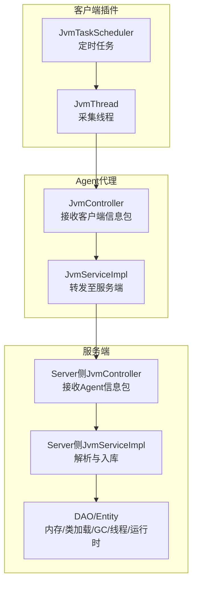
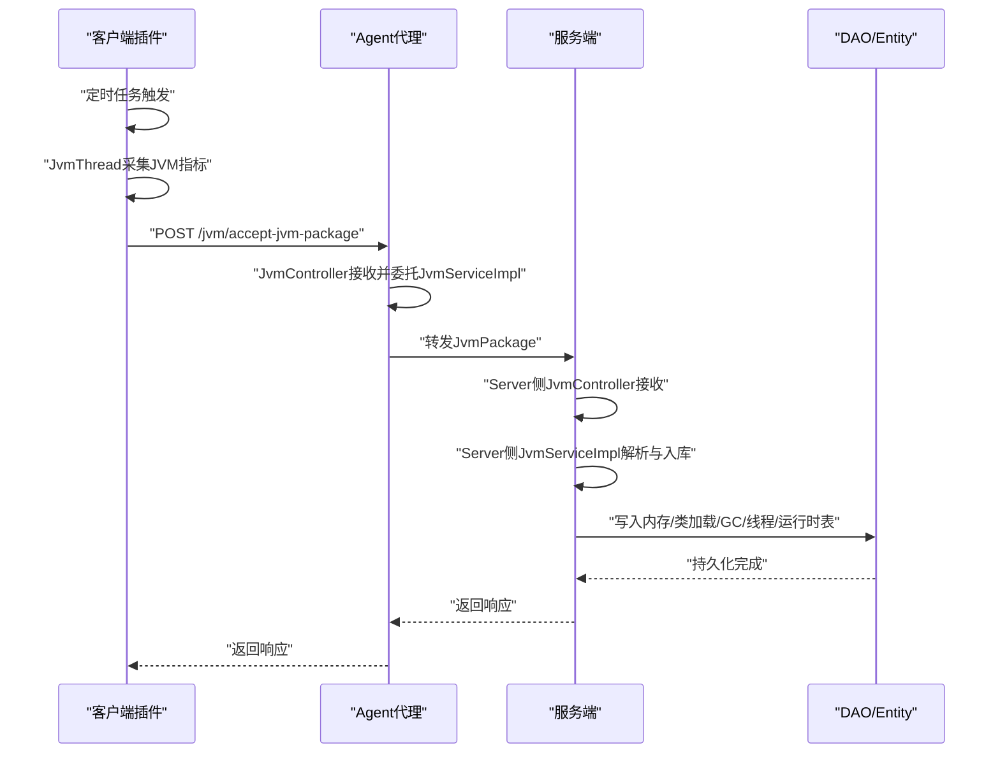
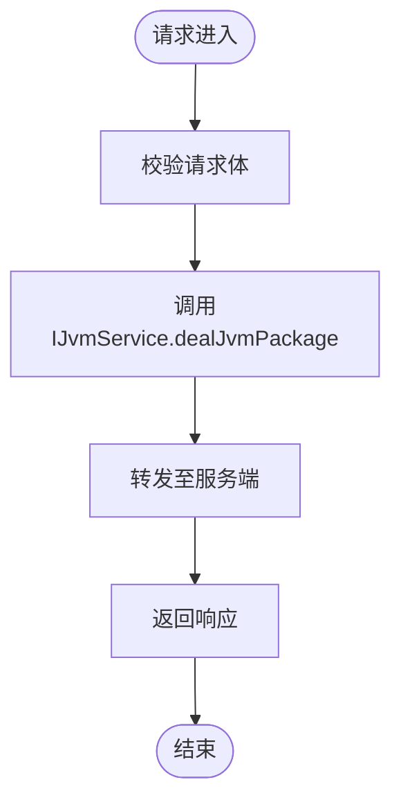
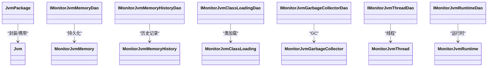
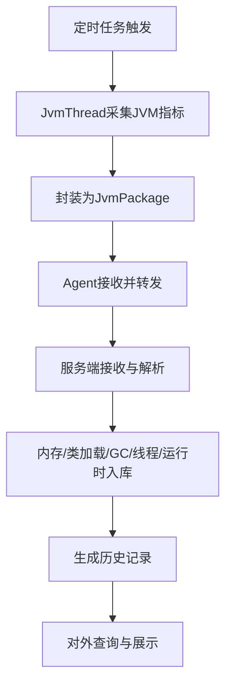
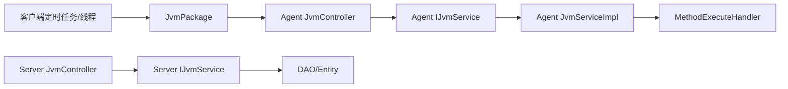

# JVM监控业务

<cite>
**本文引用的文件**
- [phoenix-agent/src/main/java/com/gitee/pifeng/monitoring/agent/business/client/controller/JvmController.java](file://phoenix-agent/src/main/java/com/gitee/pifeng/monitoring/agent/business/client/controller/JvmController.java)
- [phoenix-agent/src/main/java/com/gitee/pifeng/monitoring/agent/business/client/service/IJvmService.java](file://phoenix-agent/src/main/java/com/gitee/pifeng/monitoring/agent/business/client/service/IJvmService.java)
- [phoenix-agent/src/main/java/com/gitee/pifeng/monitoring/agent/business/client/service/impl/JvmServiceImpl.java](file://phoenix-agent/src/main/java/com/gitee/pifeng/monitoring/agent/business/client/service/impl/JvmServiceImpl.java)
- [phoenix-common/phoenix-common-core/src/main/java/com/gitee/pifeng/monitoring/common/domain/Jvm.java](file://phoenix-common/phoenix-common-core/src/main/java/com/gitee/pifeng/monitoring/common/domain/Jvm.java)
- [phoenix-common/phoenix-common-core/src/main/java/com/gitee/pifeng/monitoring/common/dto/JvmPackage.java](file://phoenix-common/phoenix-common-core/src/main/java/com/gitee/pifeng/monitoring/common/dto/JvmPackage.java)
- [phoenix-common/phoenix-common-core/src/main/java/com/gitee/pifeng/monitoring/common/util/jvm/JvmUtils.java](file://phoenix-common/phoenix-common-core/src/main/java/com/gitee/pifeng/monitoring/common/util/jvm/JvmUtils.java)
- [phoenix-client/phoenix-client-core/src/main/java/com/gitee/pifeng/monitoring/plug/scheduler/JvmTaskScheduler.java](file://phoenix-client/phoenix-client-core/src/main/java/com/gitee/pifeng/monitoring/plug/scheduler/JvmTaskScheduler.java)
- [phoenix-client/phoenix-client-core/src/main/java/com/gitee/pifeng/monitoring/plug/thread/JvmThread.java](file://phoenix-client/phoenix-client-core/src/main/java/com/gitee/pifeng/monitoring/plug/thread/JvmThread.java)
- [phoenix-server/src/main/java/com/gitee/pifeng/monitoring/server/business/server/controller/JvmController.java](file://phoenix-server/src/main/java/com/gitee/pifeng/monitoring/server/business/server/controller/JvmController.java)
- [phoenix-server/src/main/java/com/gitee/pifeng/monitoring/server/business/server/service/impl/JvmServiceImpl.java](file://phoenix-server/src/main/java/com/gitee/pifeng/monitoring/server/business/server/service/impl/JvmServiceImpl.java)
- [phoenix-server/src/main/java/com/gitee/pifeng/monitoring/server/business/server/dao/IMonitorJvmMemoryDao.java](file://phoenix-server/src/main/java/com/gitee/pifeng/monitoring/server/business/server/dao/IMonitorJvmMemoryDao.java)
- [phoenix-server/src/main/java/com/gitee/pifeng/monitoring/server/business/server/dao/IMonitorJvmMemoryHistoryDao.java](file://phoenix-server/src/main/java/com/gitee/pifeng/monitoring/server/business/server/dao/IMonitorJvmMemoryHistoryDao.java)
- [phoenix-server/src/main/java/com/gitee/pifeng/monitoring/server/business/server/dao/IMonitorJvmClassLoadingDao.java](file://phoenix-server/src/main/java/com/gitee/pifeng/monitoring/server/business/server/dao/IMonitorJvmClassLoadingDao.java)
- [phoenix-server/src/main/java/com/gitee/pifeng/monitoring/server/business/server/dao/IMonitorJvmGarbageCollectorDao.java](file://phoenix-server/src/main/java/com/gitee/pifeng/monitoring/server/business/server/dao/IMonitorJvmGarbageCollectorDao.java)
- [phoenix-server/src/main/java/com/gitee/pifeng/monitoring/server/business/server/dao/IMonitorJvmThreadDao.java](file://phoenix-server/src/main/java/com/gitee/pifeng/monitoring/server/business/server/dao/IMonitorJvmThreadDao.java)
- [phoenix-server/src/main/java/com/gitee/pifeng/monitoring/server/business/server/dao/IMonitorJvmRuntimeDao.java](file://phoenix-server/src/main/java/com/gitee/pifeng/monitoring/server/business/server/dao/IMonitorJvmRuntimeDao.java)
- [phoenix-server/src/main/java/com/gitee/pifeng/monitoring/server/business/server/entity/MonitorJvmMemory.java](file://phoenix-server/src/main/java/com/gitee/pifeng/monitoring/server/business/server/entity/MonitorJvmMemory.java)
- [phoenix-server/src/main/java/com/gitee/pifeng/monitoring/server/business/server/entity/MonitorJvmMemoryHistory.java](file://phoenix-server/src/main/java/com/gitee/pifeng/monitoring/server/business/server/entity/MonitorJvmMemoryHistory.java)
- [phoenix-server/src/main/java/com/gitee/pifeng/monitoring/server/business/server/entity/MonitorJvmClassLoading.java](file://phoenix-server/src/main/java/com/gitee/pifeng/monitoring/server/business/server/entity/MonitorJvmClassLoading.java)
- [phoenix-server/src/main/java/com/gitee/pifeng/monitoring/server/business/server/entity/MonitorJvmGarbageCollector.java](file://phoenix-server/src/main/java/com/gitee/pifeng/monitoring/server/business/server/entity/MonitorJvmGarbageCollector.java)
- [phoenix-server/src/main/java/com/gitee/pifeng/monitoring/server/business/server/entity/MonitorJvmThread.java](file://phoenix-server/src/main/java/com/gitee/pifeng/monitoring/server/business/server/entity/MonitorJvmThread.java)
- [phoenix-server/src/main/java/com/gitee/pifeng/monitoring/server/business/server/entity/MonitorJvmRuntime.java](file://phoenix-server/src/main/java/com/gitee/pifeng/monitoring/server/business/server/entity/MonitorJvmRuntime.java)
</cite>

## 目录
1. [简介](#简介)
2. [项目结构](#项目结构)
3. [核心组件](#核心组件)
4. [架构总览](#架构总览)
5. [详细组件分析](#详细组件分析)
6. [依赖分析](#依赖分析)
7. [性能考虑](#性能考虑)
8. [故障排查指南](#故障排查指南)
9. [结论](#结论)
10. [附录](#附录)

## 简介
本文件面向JVM监控业务，系统化阐述Phoenix项目的JVM监控能力与实现，重点覆盖以下方面：
- JvmController的职责与调用链路：从客户端采集到服务端落库的完整流程
- JVM监控数据模型：MemoryDomain、ClassLoadingDomain、GarbageCollectorDomain、ThreadDomain等实体类的设计与用途
- 业务流程：运行时信息采集、内存使用统计、GC活动监控、线程状态分析、历史数据存储
- 关键实现示例路径：JVM信息获取、内存使用率计算、GC事件统计、线程状态分析
- 性能影响与优化策略：采样频率、批量写入、异步处理
- 不同JVM实现的兼容性处理建议

## 项目结构
Phoenix采用多模块分层架构，JVM监控涉及“客户端插件”、“Agent代理”、“服务端存储与展示”三层：
- 客户端插件：定时采集JVM指标，封装为JvmPackage并通过线程/调度器发送
- Agent代理：接收客户端信息包，转发至服务端
- 服务端：解析并持久化JVM指标，提供查询与展示

图表来源
- [phoenix-client/phoenix-client-core/src/main/java/com/gitee/pifeng/monitoring/plug/scheduler/JvmTaskScheduler.java](file://phoenix-client/phoenix-client-core/src/main/java/com/gitee/pifeng/monitoring/plug/scheduler/JvmTaskScheduler.java)
- [phoenix-client/phoenix-client-core/src/main/java/com/gitee/pifeng/monitoring/plug/thread/JvmThread.java](file://phoenix-client/phoenix-client-core/src/main/java/com/gitee/pifeng/monitoring/plug/thread/JvmThread.java)
- [phoenix-agent/src/main/java/com/gitee/pifeng/monitoring/agent/business/client/controller/JvmController.java](file://phoenix-agent/src/main/java/com/gitee/pifeng/monitoring/agent/business/client/controller/JvmController.java)
- [phoenix-agent/src/main/java/com/gitee/pifeng/monitoring/agent/business/client/service/impl/JvmServiceImpl.java](file://phoenix-agent/src/main/java/com/gitee/pifeng/monitoring/agent/business/client/service/impl/JvmServiceImpl.java)
- [phoenix-server/src/main/java/com/gitee/pifeng/monitoring/server/business/server/controller/JvmController.java](file://phoenix-server/src/main/java/com/gitee/pifeng/monitoring/server/business/server/controller/JvmController.java)
- [phoenix-server/src/main/java/com/gitee/pifeng/monitoring/server/business/server/service/impl/JvmServiceImpl.java](file://phoenix-server/src/main/java/com/gitee/pifeng/monitoring/server/business/server/service/impl/JvmServiceImpl.java)

章节来源
- [phoenix-agent/src/main/java/com/gitee/pifeng/monitoring/agent/business/client/controller/JvmController.java:1-55](file://phoenix-agent/src/main/java/com/gitee/pifeng/monitoring/agent/business/client/controller/JvmController.java#L1-L55)
- [phoenix-agent/src/main/java/com/gitee/pifeng/monitoring/agent/business/client/service/impl/JvmServiceImpl.java:1-36](file://phoenix-agent/src/main/java/com/gitee/pifeng/monitoring/agent/business/client/service/impl/JvmServiceImpl.java#L1-L36)
- [phoenix-server/src/main/java/com/gitee/pifeng/monitoring/server/business/server/controller/JvmController.java](file://phoenix-server/src/main/java/com/gitee/pifeng/monitoring/server/business/server/controller/JvmController)

## 核心组件
- JvmController（Agent侧）：接收来自客户端的JvmPackage，委托IJvmService处理
- IJvmService与JvmServiceImpl（Agent侧）：定义并实现“转发到服务端”的处理逻辑
- JvmPackage（公共DTO）：承载一次JVM监控数据的载体
- Jvm（公共Domain）：JVM运行时信息的领域对象
- JvmUtils（公共工具）：提供JVM相关计算与转换方法
- 客户端定时任务与线程：负责周期性采集JVM指标
- 服务端Controller/Service/DAO/Entity：接收、解析、入库JVM指标

章节来源
- [phoenix-agent/src/main/java/com/gitee/pifeng/monitoring/agent/business/client/controller/JvmController.java:18-55](file://phoenix-agent/src/main/java/com/gitee/pifeng/monitoring/agent/business/client/controller/JvmController.java#L18-L55)
- [phoenix-agent/src/main/java/com/gitee/pifeng/monitoring/agent/business/client/service/IJvmService.java:1-29](file://phoenix-agent/src/main/java/com/gitee/pifeng/monitoring/agent/business/client/service/IJvmService.java#L1-L29)
- [phoenix-agent/src/main/java/com/gitee/pifeng/monitoring/agent/business/client/service/impl/JvmServiceImpl.java:17-36](file://phoenix-agent/src/main/java/com/gitee/pifeng/monitoring/agent/business/client/service/impl/JvmServiceImpl.java#L17-L36)
- [phoenix-common/phoenix-common-core/src/main/java/com/gitee/pifeng/monitoring/common/dto/JvmPackage.java](file://phoenix-common/phoenix-common-core/src/main/java/com/gitee/pifeng/monitoring/common/dto/JvmPackage.java)
- [phoenix-common/phoenix-common-core/src/main/java/com/gitee/pifeng/monitoring/common/domain/Jvm.java](file://phoenix-common/phoenix-common-core/src/main/java/com/gitee/pifeng/monitoring/common/domain/Jvm.java)
- [phoenix-common/phoenix-common-core/src/main/java/com/gitee/pifeng/monitoring/common/util/jvm/JvmUtils.java](file://phoenix-common/phoenix-common-core/src/main/java/com/gitee/pifeng/monitoring/common/util/jvm/JvmUtils.java)
- [phoenix-client/phoenix-client-core/src/main/java/com/gitee/pifeng/monitoring/plug/scheduler/JvmTaskScheduler.java](file://phoenix-client/phoenix-client-core/src/main/java/com/gitee/pifeng/monitoring/plug/scheduler/JvmTaskScheduler.java)
- [phoenix-client/phoenix-client-core/src/main/java/com/gitee/pifeng/monitoring/plug/thread/JvmThread.java](file://phoenix-client/phoenix-client-core/src/main/java/com/gitee/pifeng/monitoring/plug/thread/JvmThread.java)

## 架构总览
下图展示了JVM监控从采集到落库的关键交互：

图表来源
- [phoenix-client/phoenix-client-core/src/main/java/com/gitee/pifeng/monitoring/plug/scheduler/JvmTaskScheduler.java](file://phoenix-client/phoenix-client-core/src/main/java/com/gitee/pifeng/monitoring/plug/scheduler/JvmTaskScheduler.java)
- [phoenix-client/phoenix-client-core/src/main/java/com/gitee/pifeng/monitoring/plug/thread/JvmThread.java](file://phoenix-client/phoenix-client-core/src/main/java/com/gitee/pifeng/monitoring/plug/thread/JvmThread.java)
- [phoenix-agent/src/main/java/com/gitee/pifeng/monitoring/agent/business/client/controller/JvmController.java:47-53](file://phoenix-agent/src/main/java/com/gitee/pifeng/monitoring/agent/business/client/controller/JvmController.java#L47-L53)
- [phoenix-agent/src/main/java/com/gitee/pifeng/monitoring/agent/business/client/service/impl/JvmServiceImpl.java:30-34](file://phoenix-agent/src/main/java/com/gitee/pifeng/monitoring/agent/business/client/service/impl/JvmServiceImpl.java#L30-L34)
- [phoenix-server/src/main/java/com/gitee/pifeng/monitoring/server/business/server/controller/JvmController.java](file://phoenix-server/src/main/java/com/gitee/pifeng/monitoring/server/business/server/controller/JvmController)
- [phoenix-server/src/main/java/com/gitee/pifeng/monitoring/server/business/server/service/impl/JvmServiceImpl.java](file://phoenix-server/src/main/java/com/gitee/pifeng/monitoring/server/business/server/service/impl/JvmServiceImpl.java)

## 详细组件分析

### JvmController（Agent侧）
- 职责：暴露REST接口接收客户端发送的JvmPackage；调用IJvmService进行处理
- 接口路径：/jvm/accept-jvm-package
- 返回值：BaseResponsePackage
- 与服务端对接：通过MethodExecuteHandler将信息包转发至服务端

图表来源
- [phoenix-agent/src/main/java/com/gitee/pifeng/monitoring/agent/business/client/controller/JvmController.java:47-53](file://phoenix-agent/src/main/java/com/gitee/pifeng/monitoring/agent/business/client/controller/JvmController.java#L47-L53)
- [phoenix-agent/src/main/java/com/gitee/pifeng/monitoring/agent/business/client/service/impl/JvmServiceImpl.java:30-34](file://phoenix-agent/src/main/java/com/gitee/pifeng/monitoring/agent/business/client/service/impl/JvmServiceImpl.java#L30-L34)

章节来源
- [phoenix-agent/src/main/java/com/gitee/pifeng/monitoring/agent/business/client/controller/JvmController.java:18-55](file://phoenix-agent/src/main/java/com/gitee/pifeng/monitoring/agent/business/client/controller/JvmController.java#L18-L55)
- [phoenix-agent/src/main/java/com/gitee/pifeng/monitoring/agent/business/client/service/impl/JvmServiceImpl.java:17-36](file://phoenix-agent/src/main/java/com/gitee/pifeng/monitoring/agent/business/client/service/impl/JvmServiceImpl.java#L17-L36)

### IJvmService与JvmServiceImpl（Agent侧）
- IJvmService：定义dealJvmPackage方法
- JvmServiceImpl：实现转发逻辑，调用MethodExecuteHandler.sendJvmPackage2Server

章节来源
- [phoenix-agent/src/main/java/com/gitee/pifeng/monitoring/agent/business/client/service/IJvmService.java:14-28](file://phoenix-agent/src/main/java/com/gitee/pifeng/monitoring/agent/business/client/service/IJvmService.java#L14-L28)
- [phoenix-agent/src/main/java/com/gitee/pifeng/monitoring/agent/business/client/service/impl/JvmServiceImpl.java:17-36](file://phoenix-agent/src/main/java/com/gitee/pifeng/monitoring/agent/business/client/service/impl/JvmServiceImpl.java#L17-L36)

### 客户端采集与发送
- JvmTaskScheduler：定时调度，驱动采集周期
- JvmThread：实际执行JVM指标采集，构造JvmPackage并发送
- JvmPackage：封装一次采集的JVM数据
- JvmUtils：提供JVM相关计算与格式化工具

章节来源
- [phoenix-client/phoenix-client-core/src/main/java/com/gitee/pifeng/monitoring/plug/scheduler/JvmTaskScheduler.java](file://phoenix-client/phoenix-client-core/src/main/java/com/gitee/pifeng/monitoring/plug/scheduler/JvmTaskScheduler.java)
- [phoenix-client/phoenix-client-core/src/main/java/com/gitee/pifeng/monitoring/plug/thread/JvmThread.java](file://phoenix-client/phoenix-client-core/src/main/java/com/gitee/pifeng/monitoring/plug/thread/JvmThread.java)
- [phoenix-common/phoenix-common-core/src/main/java/com/gitee/pifeng/monitoring/common/dto/JvmPackage.java](file://phoenix-common/phoenix-common-core/src/main/java/com/gitee/pifeng/monitoring/common/dto/JvmPackage.java)
- [phoenix-common/phoenix-common-core/src/main/java/com/gitee/pifeng/monitoring/common/util/jvm/JvmUtils.java](file://phoenix-common/phoenix-common-core/src/main/java/com/gitee/pifeng/monitoring/common/util/jvm/JvmUtils.java)

### 服务端接收与入库
- Server侧JvmController：接收Agent转发的JvmPackage
- Server侧JvmServiceImpl：解析并持久化JVM指标
- DAO/Entity：内存、类加载、垃圾收集器、线程、运行时等维度的持久化实体

图表来源
- [phoenix-common/phoenix-common-core/src/main/java/com/gitee/pifeng/monitoring/common/dto/JvmPackage.java](file://phoenix-common/phoenix-common-core/src/main/java/com/gitee/pifeng/monitoring/common/dto/JvmPackage.java)
- [phoenix-common/phoenix-common-core/src/main/java/com/gitee/pifeng/monitoring/common/domain/Jvm.java](file://phoenix-common/phoenix-common-core/src/main/java/com/gitee/pifeng/monitoring/common/domain/Jvm.java)
- [phoenix-server/src/main/java/com/gitee/pifeng/monitoring/server/business/server/dao/IMonitorJvmMemoryDao.java](file://phoenix-server/src/main/java/com/gitee/pifeng/monitoring/server/business/server/dao/IMonitorJvmMemoryDao.java)
- [phoenix-server/src/main/java/com/gitee/pifeng/monitoring/server/business/server/dao/IMonitorJvmMemoryHistoryDao.java](file://phoenix-server/src/main/java/com/gitee/pifeng/monitoring/server/business/server/dao/IMonitorJvmMemoryHistoryDao.java)
- [phoenix-server/src/main/java/com/gitee/pifeng/monitoring/server/business/server/dao/IMonitorJvmClassLoadingDao.java](file://phoenix-server/src/main/java/com/gitee/pifeng/monitoring/server/business/server/dao/IMonitorJvmClassLoadingDao.java)
- [phoenix-server/src/main/java/com/gitee/pifeng/monitoring/server/business/server/dao/IMonitorJvmGarbageCollectorDao.java](file://phoenix-server/src/main/java/com/gitee/pifeng/monitoring/server/business/server/dao/IMonitorJvmGarbageCollectorDao.java)
- [phoenix-server/src/main/java/com/gitee/pifeng/monitoring/server/business/server/dao/IMonitorJvmThreadDao.java](file://phoenix-server/src/main/java/com/gitee/pifeng/monitoring/server/business/server/dao/IMonitorJvmThreadDao.java)
- [phoenix-server/src/main/java/com/gitee/pifeng/monitoring/server/business/server/dao/IMonitorJvmRuntimeDao.java](file://phoenix-server/src/main/java/com/gitee/pifeng/monitoring/server/business/server/dao/IMonitorJvmRuntimeDao.java)
- [phoenix-server/src/main/java/com/gitee/pifeng/monitoring/server/business/server/entity/MonitorJvmMemory.java](file://phoenix-server/src/main/java/com/gitee/pifeng/monitoring/server/business/server/entity/MonitorJvmMemory.java)
- [phoenix-server/src/main/java/com/gitee/pifeng/monitoring/server/business/server/entity/MonitorJvmMemoryHistory.java](file://phoenix-server/src/main/java/com/gitee/pifeng/monitoring/server/business/server/entity/MonitorJvmMemoryHistory.java)
- [phoenix-server/src/main/java/com/gitee/pifeng/monitoring/server/business/server/entity/MonitorJvmClassLoading.java](file://phoenix-server/src/main/java/com/gitee/pifeng/monitoring/server/business/server/entity/MonitorJvmClassLoading.java)
- [phoenix-server/src/main/java/com/gitee/pifeng/monitoring/server/business/server/entity/MonitorJvmGarbageCollector.java](file://phoenix-server/src/main/java/com/gitee/pifeng/monitoring/server/business/server/entity/MonitorJvmGarbageCollector.java)
- [phoenix-server/src/main/java/com/gitee/pifeng/monitoring/server/business/server/entity/MonitorJvmThread.java](file://phoenix-server/src/main/java/com/gitee/pifeng/monitoring/server/business/server/entity/MonitorJvmThread.java)
- [phoenix-server/src/main/java/com/gitee/pifeng/monitoring/server/business/server/entity/MonitorJvmRuntime.java](file://phoenix-server/src/main/java/com/gitee/pifeng/monitoring/server/business/server/entity/MonitorJvmRuntime.java)

章节来源
- [phoenix-server/src/main/java/com/gitee/pifeng/monitoring/server/business/server/controller/JvmController.java](file://phoenix-server/src/main/java/com/gitee/pifeng/monitoring/server/business/server/controller/JvmController)
- [phoenix-server/src/main/java/com/gitee/pifeng/monitoring/server/business/server/service/impl/JvmServiceImpl.java](file://phoenix-server/src/main/java/com/gitee/pifeng/monitoring/server/business/server/service/impl/JvmServiceImpl.java)
- [phoenix-server/src/main/java/com/gitee/pifeng/monitoring/server/business/server/dao/IMonitorJvmMemoryDao.java](file://phoenix-server/src/main/java/com/gitee/pifeng/monitoring/server/business/server/dao/IMonitorJvmMemoryDao.java)
- [phoenix-server/src/main/java/com/gitee/pifeng/monitoring/server/business/server/dao/IMonitorJvmMemoryHistoryDao.java](file://phoenix-server/src/main/java/com/gitee/pifeng/monitoring/server/business/server/dao/IMonitorJvmMemoryHistoryDao.java)
- [phoenix-server/src/main/java/com/gitee/pifeng/monitoring/server/business/server/dao/IMonitorJvmClassLoadingDao.java](file://phoenix-server/src/main/java/com/gitee/pifeng/monitoring/server/business/server/dao/IMonitorJvmClassLoadingDao.java)
- [phoenix-server/src/main/java/com/gitee/pifeng/monitoring/server/business/server/dao/IMonitorJvmGarbageCollectorDao.java](file://phoenix-server/src/main/java/com/gitee/pifeng/monitoring/server/business/server/dao/IMonitorJvmGarbageCollectorDao.java)
- [phoenix-server/src/main/java/com/gitee/pifeng/monitoring/server/business/server/dao/IMonitorJvmThreadDao.java](file://phoenix-server/src/main/java/com/gitee/pifeng/monitoring/server/business/server/dao/IMonitorJvmThreadDao.java)
- [phoenix-server/src/main/java/com/gitee/pifeng/monitoring/server/business/server/dao/IMonitorJvmRuntimeDao.java](file://phoenix-server/src/main/java/com/gitee/pifeng/monitoring/server/business/server/dao/IMonitorJvmRuntimeDao.java)
- [phoenix-server/src/main/java/com/gitee/pifeng/monitoring/server/business/server/entity/MonitorJvmMemory.java](file://phoenix-server/src/main/java/com/gitee/pifeng/monitoring/server/business/server/entity/MonitorJvmMemory.java)
- [phoenix-server/src/main/java/com/gitee/pifeng/monitoring/server/business/server/entity/MonitorJvmMemoryHistory.java](file://phoenix-server/src/main/java/com/gitee/pifeng/monitoring/server/business/server/entity/MonitorJvmMemoryHistory.java)
- [phoenix-server/src/main/java/com/gitee/pifeng/monitoring/server/business/server/entity/MonitorJvmClassLoading.java](file://phoenix-server/src/main/java/com/gitee/pifeng/monitoring/server/business/server/entity/MonitorJvmClassLoading.java)
- [phoenix-server/src/main/java/com/gitee/pifeng/monitoring/server/business/server/entity/MonitorJvmGarbageCollector.java](file://phoenix-server/src/main/java/com/gitee/pifeng/monitoring/server/business/server/entity/MonitorJvmGarbageCollector.java)
- [phoenix-server/src/main/java/com/gitee/pifeng/monitoring/server/business/server/entity/MonitorJvmThread.java](file://phoenix-server/src/main/java/com/gitee/pifeng/monitoring/server/business/server/entity/MonitorJvmThread.java)
- [phoenix-server/src/main/java/com/gitee/pifeng/monitoring/server/business/server/entity/MonitorJvmRuntime.java](file://phoenix-server/src/main/java/com/gitee/pifeng/monitoring/server/business/server/entity/MonitorJvmRuntime.java)

### 数据模型与实体类
- JvmPackage：一次JVM监控数据的传输载体
- Jvm：JVM运行时信息的领域对象
- MonitorJvmMemory：内存使用情况
- MonitorJvmMemoryHistory：内存历史记录
- MonitorJvmClassLoading：类加载统计
- MonitorJvmGarbageCollector：垃圾收集器统计
- MonitorJvmThread：线程统计
- MonitorJvmRuntime：运行时信息

章节来源
- [phoenix-common/phoenix-common-core/src/main/java/com/gitee/pifeng/monitoring/common/dto/JvmPackage.java](file://phoenix-common/phoenix-common-core/src/main/java/com/gitee/pifeng/monitoring/common/dto/JvmPackage.java)
- [phoenix-common/phoenix-common-core/src/main/java/com/gitee/pifeng/monitoring/common/domain/Jvm.java](file://phoenix-common/phoenix-common-core/src/main/java/com/gitee/pifeng/monitoring/common/domain/Jvm.java)
- [phoenix-server/src/main/java/com/gitee/pifeng/monitoring/server/business/server/entity/MonitorJvmMemory.java](file://phoenix-server/src/main/java/com/gitee/pifeng/monitoring/server/business/server/entity/MonitorJvmMemory.java)
- [phoenix-server/src/main/java/com/gitee/pifeng/monitoring/server/business/server/entity/MonitorJvmMemoryHistory.java](file://phoenix-server/src/main/java/com/gitee/pifeng/monitoring/server/business/server/entity/MonitorJvmMemoryHistory.java)
- [phoenix-server/src/main/java/com/gitee/pifeng/monitoring/server/business/server/entity/MonitorJvmClassLoading.java](file://phoenix-server/src/main/java/com/gitee/pifeng/monitoring/server/business/server/entity/MonitorJvmClassLoading.java)
- [phoenix-server/src/main/java/com/gitee/pifeng/monitoring/server/business/server/entity/MonitorJvmGarbageCollector.java](file://phoenix-server/src/main/java/com/gitee/pifeng/monitoring/server/business/server/entity/MonitorJvmGarbageCollector.java)
- [phoenix-server/src/main/java/com/gitee/pifeng/monitoring/server/business/server/entity/MonitorJvmThread.java](file://phoenix-server/src/main/java/com/gitee/pifeng/monitoring/server/business/server/entity/MonitorJvmThread.java)
- [phoenix-server/src/main/java/com/gitee/pifeng/monitoring/server/business/server/entity/MonitorJvmRuntime.java](file://phoenix-server/src/main/java/com/gitee/pifeng/monitoring/server/business/server/entity/MonitorJvmRuntime.java)

### 业务流程详解
- 运行时信息采集：客户端定时任务触发，JvmThread执行JVM指标采集
- 内存使用统计：通过JVM内存池与堆/非堆信息计算使用率
- GC活动监控：统计各GC收集器的次数与耗时，识别异常波动
- 线程状态分析：统计线程总数、守护线程数、峰值、阻塞计数等
- 历史数据存储：将当前指标与历史记录分别入库，支持趋势分析

图表来源
- [phoenix-client/phoenix-client-core/src/main/java/com/gitee/pifeng/monitoring/plug/scheduler/JvmTaskScheduler.java](file://phoenix-client/phoenix-client-core/src/main/java/com/gitee/pifeng/monitoring/plug/scheduler/JvmTaskScheduler.java)
- [phoenix-client/phoenix-client-core/src/main/java/com/gitee/pifeng/monitoring/plug/thread/JvmThread.java](file://phoenix-client/phoenix-client-core/src/main/java/com/gitee/pifeng/monitoring/plug/thread/JvmThread.java)
- [phoenix-agent/src/main/java/com/gitee/pifeng/monitoring/agent/business/client/controller/JvmController.java:47-53](file://phoenix-agent/src/main/java/com/gitee/pifeng/monitoring/agent/business/client/controller/JvmController.java#L47-L53)
- [phoenix-server/src/main/java/com/gitee/pifeng/monitoring/server/business/server/controller/JvmController.java](file://phoenix-server/src/main/java/com/gitee/pifeng/monitoring/server/business/server/controller/JvmController)
- [phoenix-server/src/main/java/com/gitee/pifeng/monitoring/server/business/server/service/impl/JvmServiceImpl.java](file://phoenix-server/src/main/java/com/gitee/pifeng/monitoring/server/business/server/service/impl/JvmServiceImpl.java)

## 依赖分析
- 控制器依赖服务接口IJvmService，服务实现依赖MethodExecuteHandler进行网络转发
- 服务端Controller依赖Server侧IJvmService实现，最终通过DAO/Entity持久化
- 客户端通过JvmPackage与JVM工具类与公共模型解耦

图表来源
- [phoenix-agent/src/main/java/com/gitee/pifeng/monitoring/agent/business/client/controller/JvmController.java:26-35](file://phoenix-agent/src/main/java/com/gitee/pifeng/monitoring/agent/business/client/controller/JvmController.java#L26-L35)
- [phoenix-agent/src/main/java/com/gitee/pifeng/monitoring/agent/business/client/service/impl/JvmServiceImpl.java:30-34](file://phoenix-agent/src/main/java/com/gitee/pifeng/monitoring/agent/business/client/service/impl/JvmServiceImpl.java#L30-L34)
- [phoenix-server/src/main/java/com/gitee/pifeng/monitoring/server/business/server/controller/JvmController.java](file://phoenix-server/src/main/java/com/gitee/pifeng/monitoring/server/business/server/controller/JvmController)
- [phoenix-server/src/main/java/com/gitee/pifeng/monitoring/server/business/server/service/impl/JvmServiceImpl.java](file://phoenix-server/src/main/java/com/gitee/pifeng/monitoring/server/business/server/service/impl/JvmServiceImpl.java)
- [phoenix-common/phoenix-common-core/src/main/java/com/gitee/pifeng/monitoring/common/dto/JvmPackage.java](file://phoenix-common/phoenix-common-core/src/main/java/com/gitee/pifeng/monitoring/common/dto/JvmPackage.java)

章节来源
- [phoenix-agent/src/main/java/com/gitee/pifeng/monitoring/agent/business/client/controller/JvmController.java:26-35](file://phoenix-agent/src/main/java/com/gitee/pifeng/monitoring/agent/business/client/controller/JvmController.java#L26-L35)
- [phoenix-agent/src/main/java/com/gitee/pifeng/monitoring/agent/business/client/service/impl/JvmServiceImpl.java:30-34](file://phoenix-agent/src/main/java/com/gitee/pifeng/monitoring/agent/business/client/service/impl/JvmServiceImpl.java#L30-L34)
- [phoenix-server/src/main/java/com/gitee/pifeng/monitoring/server/business/server/controller/JvmController.java](file://phoenix-server/src/main/java/com/gitee/pifeng/monitoring/server/business/server/controller/JvmController)
- [phoenix-server/src/main/java/com/gitee/pifeng/monitoring/server/business/server/service/impl/JvmServiceImpl.java](file://phoenix-server/src/main/java/com/gitee/pifeng/monitoring/server/business/server/service/impl/JvmServiceImpl.java)

## 性能考虑
- 采样频率控制：根据业务需求设置合理的采集间隔，避免频繁JMX访问造成开销
- 批量写入与异步处理：服务端入库可采用批量提交与异步队列，降低数据库压力
- 缓存与热点数据：对高频查询的指标进行缓存，减少重复计算
- 监控自身开销：记录采集耗时与失败率，动态调整采样策略
- JVM实现兼容：针对HotSpot、OpenJ9等不同JVM实现，统一抽象JMX接口或使用通用工具库，确保指标一致性

## 故障排查指南
- 采集失败：检查客户端定时任务是否正常启动、JvmThread是否成功采集
- 传输异常：确认Agent与服务端网络连通性，查看MethodExecuteHandler的转发日志
- 解析入库错误：核对JvmPackage字段映射与服务端解析逻辑，检查DAO/Entity字段一致性
- 指标异常：结合JvmUtils的计算逻辑，验证内存使用率、GC次数与耗时是否合理
- 历史数据缺失：检查历史表写入逻辑与定时归档任务

章节来源
- [phoenix-client/phoenix-client-core/src/main/java/com/gitee/pifeng/monitoring/plug/scheduler/JvmTaskScheduler.java](file://phoenix-client/phoenix-client-core/src/main/java/com/gitee/pifeng/monitoring/plug/scheduler/JvmTaskScheduler.java)
- [phoenix-client/phoenix-client-core/src/main/java/com/gitee/pifeng/monitoring/plug/thread/JvmThread.java](file://phoenix-client/phoenix-client-core/src/main/java/com/gitee/pifeng/monitoring/plug/thread/JvmThread.java)
- [phoenix-agent/src/main/java/com/gitee/pifeng/monitoring/agent/business/client/service/impl/JvmServiceImpl.java:30-34](file://phoenix-agent/src/main/java/com/gitee/pifeng/monitoring/agent/business/client/service/impl/JvmServiceImpl.java#L30-L34)
- [phoenix-server/src/main/java/com/gitee/pifeng/monitoring/server/business/server/service/impl/JvmServiceImpl.java](file://phoenix-server/src/main/java/com/gitee/pifeng/monitoring/server/business/server/service/impl/JvmServiceImpl.java)

## 结论
Phoenix的JVM监控体系以“客户端采集—Agent转发—服务端入库—历史分析”为主线，通过清晰的分层与数据模型实现了对内存、类加载、GC、线程与运行时的全栈监控。配合合理的性能优化与兼容性策略，可在保证可观测性的同时兼顾系统稳定性。

## 附录
- 关键实现示例路径（不展示具体代码内容）：
  - JVM信息获取：[phoenix-client/phoenix-client-core/src/main/java/com/gitee/pifeng/monitoring/plug/thread/JvmThread.java](file://phoenix-client/phoenix-client-core/src/main/java/com/gitee/pifeng/monitoring/plug/thread/JvmThread.java)
  - 内存使用率计算：[phoenix-common/phoenix-common-core/src/main/java/com/gitee/pifeng/monitoring/common/util/jvm/JvmUtils.java](file://phoenix-common/phoenix-common-core/src/main/java/com/gitee/pifeng/monitoring/common/util/jvm/JvmUtils.java)
  - GC事件统计：[phoenix-server/src/main/java/com/gitee/pifeng/monitoring/server/business/server/entity/MonitorJvmGarbageCollector.java](file://phoenix-server/src/main/java/com/gitee/pifeng/monitoring/server/business/server/entity/MonitorJvmGarbageCollector.java)
  - 线程状态分析：[phoenix-server/src/main/java/com/gitee/pifeng/monitoring/server/business/server/entity/MonitorJvmThread.java](file://phoenix-server/src/main/java/com/gitee/pifeng/monitoring/server/business/server/entity/MonitorJvmThread.java)
  - 历史数据存储：[phoenix-server/src/main/java/com/gitee/pifeng/monitoring/server/business/server/dao/IMonitorJvmMemoryHistoryDao.java](file://phoenix-server/src/main/java/com/gitee/pifeng/monitoring/server/business/server/dao/IMonitorJvmMemoryHistoryDao.java)