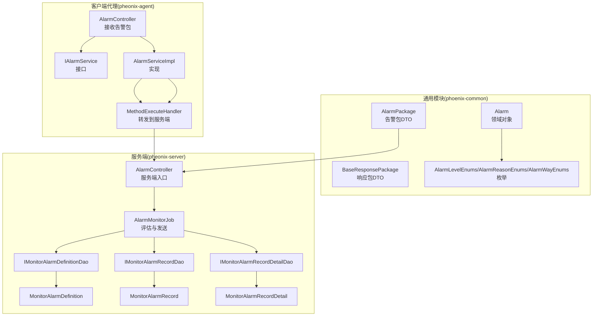
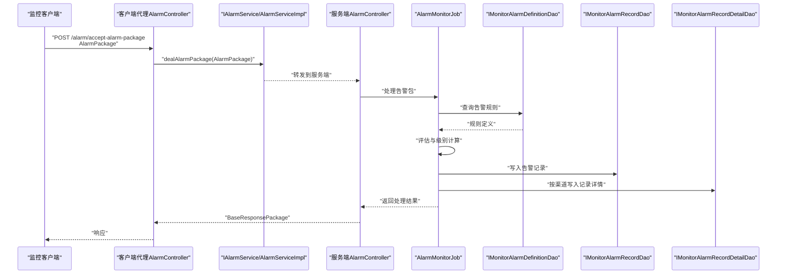
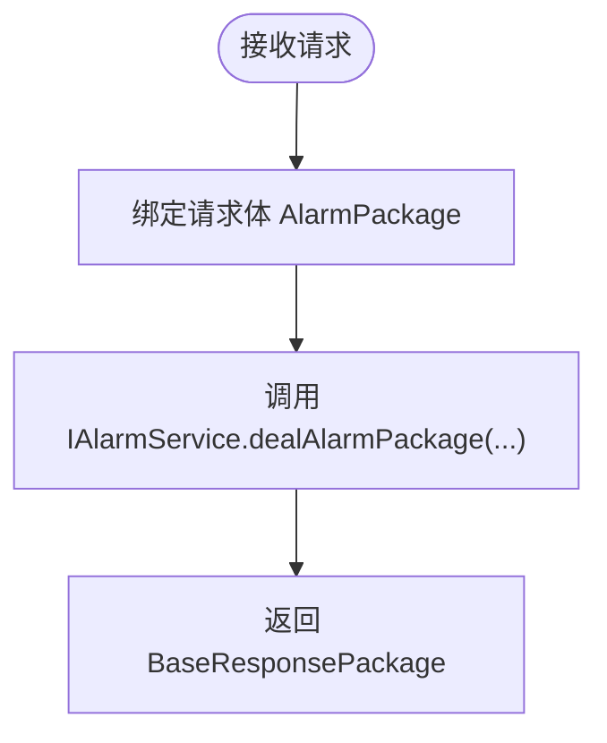
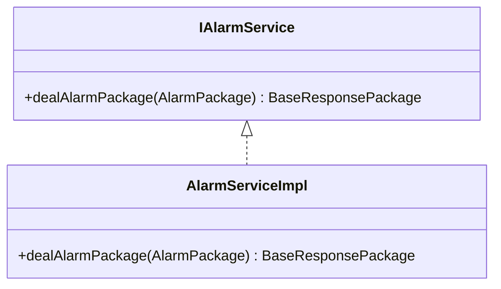
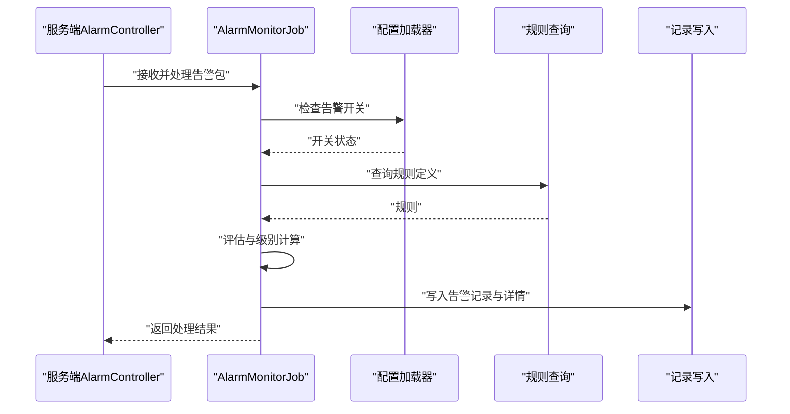
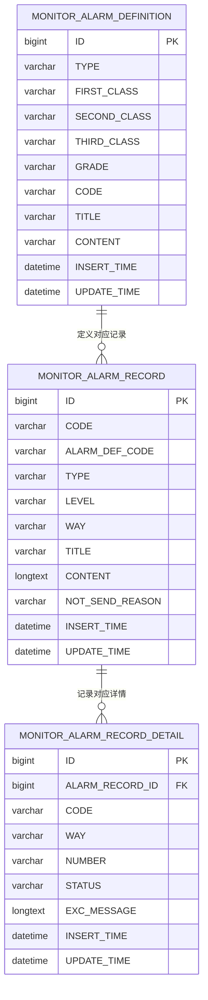
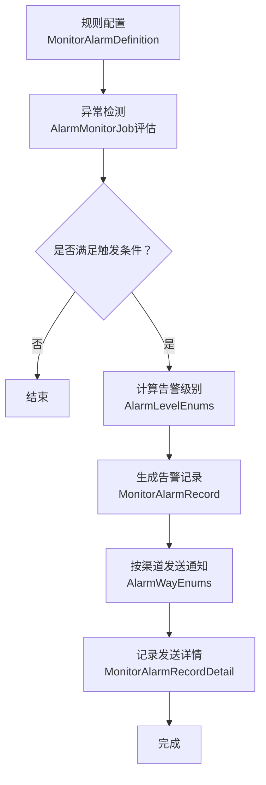
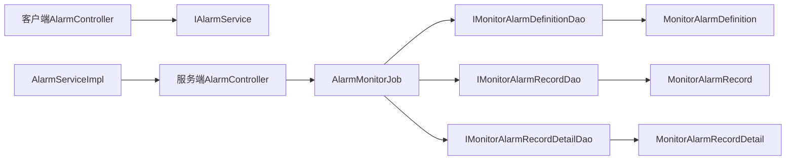

# 告警业务逻辑

<cite>
**本文引用的文件**
- [AlarmController.java](file://phoenix-agent\src\main\java\com\gitee\pifeng\monitoring\agent\business\client\controller\AlarmController.java)
- [IAlarmService.java](file://phoenix-agent\src\main\java\com\gitee\pifeng\monitoring\agent\business\client\service\IAlarmService.java)
- [AlarmServiceImpl.java](file://phoenix-agent\src\main\java\com\gitee\pifeng\monitoring\agent\business\client\service\impl\AlarmServiceImpl.java)
- [AlarmPackage.java](file://phoenix-common\src\main\java\com\gitee\pifeng\monitoring\common\dto\AlarmPackage.java)
- [BaseResponsePackage.java](file://phoenix-common\src\main\java\com\gitee\pifeng\monitoring\common\dto\BaseResponsePackage.java)
- [Alarm.java](file://phoenix-common\src\main\java\com\gitee\pifeng\monitoring\common\domain\Alarm.java)
- [AlarmLevelEnums.java](file://phoenix-common\src\main\java\com\gitee\pifeng\monitoring\common\constant\alarm\AlarmLevelEnums.java)
- [AlarmReasonEnums.java](file://phoenix-common\src\main\java\com\gitee\pifeng\monitoring\common\constant\alarm\AlarmReasonEnums.java)
- [AlarmWayEnums.java](file://phoenix-common\src\main\java\com\gitee\pifeng\monitoring\common\constant\alarm\AlarmWayEnums.java)
- [NoTSendAlarmReasonEnums.java](file://phoenix-common\src\main\java\com\gitee\pifeng\monitoring\common\constant\alarm\NoTSendAlarmReasonEnums.java)
- [AlarmController.java](file://phoenix-server\src\main\java\com\gitee\pifeng\monitoring\server\business\server\controller\AlarmController.java)
- [AlarmMonitorJob.java](file://phoenix-server\src\main\java\com\gitee\pifeng\monitoring\server\business\server\monitor\AlarmMonitorJob.java)
- [IMonitorAlarmDefinitionDao.java](file://phoenix-server\src\main\java\com\gitee\pifeng\monitoring\server\business\server\dao\IMonitorAlarmDefinitionDao.java)
- [IMonitorAlarmRecordDao.java](file://phoenix-server\src\main\java\com\gitee\pifeng\monitoring\server\business\server\dao\IMonitorAlarmRecordDao.java)
- [IMonitorAlarmRecordDetailDao.java](file://phoenix-server\src\main\java\com\gitee\pifeng\monitoring\server\business\server\dao\IMonitorAlarmRecordDetailDao.java)
- [MonitorAlarmDefinition.java](file://phoenix-server\src\main\java\com\gitee\pifeng\monitoring\server\business\server\entity\MonitorAlarmDefinition.java)
- [MonitorAlarmRecord.java](file://phoenix-server\src\main\java\com\gitee\pifeng\monitoring\server\business\server\entity\MonitorAlarmRecord.java)
- [MonitorAlarmRecordDetail.java](file://phoenix-server\src\main\java\com\gitee\pifeng\monitoring\server\business\server\entity\MonitorAlarmRecordDetail.java)
- [IMonitorAlarmDefinitionService.java](file://phoenix-ui\src\main\java\com\gitee\pifeng\monitoring\ui\business\web\service\IMonitorAlarmDefinitionService.java)
- [IMonitorAlarmRecordService.java](file://phoenix-ui\src\main\java\com\gitee\pifeng\monitoring\ui\business\web\service\IMonitorAlarmRecordService.java)
- [phoenix.sql](file://doc\数据库设计\sql\mysql\phoenix.sql)
</cite>

## 目录
1. [简介](#简介)
2. [项目结构](#项目结构)
3. [核心组件](#核心组件)
4. [架构总览](#架构总览)
5. [详细组件分析](#详细组件分析)
6. [依赖分析](#依赖分析)
7. [性能考虑](#性能考虑)
8. [故障排查指南](#故障排查指南)
9. [结论](#结论)
10. [附录](#附录)

## 简介
本文件面向告警业务逻辑，系统化梳理从“告警规则定义”到“告警触发处理”、“通知发送”、“历史记录存储”的全流程。重点覆盖以下方面：
- AlarmController 的职责与调用链
- 告警规则与记录的数据模型（MonitorAlarmDefinition、MonitorAlarmRecord、MonitorAlarmRecordDetail）
- 告警评估、级别计算、通知渠道选择、重复告警抑制等关键逻辑
- 告警业务的扩展性设计（自定义规则与通知方式）

## 项目结构
告警业务横跨三个模块：
- 客户端代理模块（phoenix-agent）：负责接收来自监控客户端的告警包并转发至服务端
- 通用模块（phoenix-common）：提供告警领域对象、枚举与DTO
- 服务端模块（phoenix-server）：负责规则与记录的持久化、告警评估与通知调度
- UI模块（phoenix-ui）：提供告警规则与记录的管理界面与服务接口

**图表来源**
- [AlarmController.java:28-53](file://phoenix-agent\src\main\java\com\gitee\pifeng\monitoring\agent\business\client\controller\AlarmController.java#L28-L53)
- [AlarmServiceImpl.java:18-39](file://phoenix-agent\src\main\java\com\gitee\pifeng\monitoring\agent\business\client\service\impl\AlarmServiceImpl.java#L18-L39)
- [AlarmController.java](file://phoenix-server\src\main\java\com\gitee\pifeng\monitoring\server\business\server\controller\AlarmController.java)
- [AlarmMonitorJob.java:101-127](file://phoenix-server\src\main\java\com\gitee\pifeng\monitoring\server\business\server\monitor\AlarmMonitorJob.java#L101-L127)
- [IMonitorAlarmDefinitionDao.java:1-15](file://phoenix-server\src\main\java\com\gitee\pifeng\monitoring\server\business\server\dao\IMonitorAlarmDefinitionDao.java#L1-L15)
- [IMonitorAlarmRecordDao.java:1-33](file://phoenix-server\src\main\java\com\gitee\pifeng\monitoring\server\business\server\dao\IMonitorAlarmRecordDao.java#L1-L33)
- [IMonitorAlarmRecordDetailDao.java:1-16](file://phoenix-server\src\main\java\com\gitee\pifeng\monitoring\server\business\server\dao\IMonitorAlarmRecordDetailDao.java#L1-L16)

**章节来源**
- [AlarmController.java:28-53](file://phoenix-agent\src\main\java\com\gitee\pifeng\monitoring\agent\business\client\controller\AlarmController.java#L28-L53)
- [AlarmServiceImpl.java:18-39](file://phoenix-agent\src\main\java\com\gitee\pifeng\monitoring\agent\business\client\service\impl\AlarmServiceImpl.java#L18-L39)
- [AlarmController.java](file://phoenix-server\src\main\java\com\gitee\pifeng\monitoring\server\business\server\controller\AlarmController.java)
- [AlarmMonitorJob.java:101-127](file://phoenix-server\src\main\java\com\gitee\pifeng\monitoring\server\business\server\monitor\AlarmMonitorJob.java#L101-L127)

## 核心组件
- 客户端告警入口
  - AlarmController：接收来自监控客户端的告警包，调用IAlarmService进行处理
  - IAlarmService：定义处理告警包的接口
  - AlarmServiceImpl：将告警包转发给服务端
- 通用领域与DTO
  - AlarmPackage：告警包载体
  - BaseResponsePackage：响应包载体
  - Alarm：告警领域对象，包含级别、原因、监控类型等
  - AlarmLevelEnums/AlarmReasonEnums/AlarmWayEnums：告警级别、原因、通知方式枚举
- 服务端告警处理
  - AlarmController：服务端入口（用于接收来自客户端代理的告警包）
  - AlarmMonitorJob：评估与发送告警的核心作业，负责规则查询、级别计算、通知发送、历史记录写入
- 数据模型
  - MonitorAlarmDefinition：告警规则定义
  - MonitorAlarmRecord：告警记录
  - MonitorAlarmRecordDetail：告警记录详情（按通知渠道拆分）

**章节来源**
- [AlarmController.java:28-53](file://phoenix-agent\src\main\java\com\gitee\pifeng\monitoring\agent\business\client\controller\AlarmController.java#L28-L53)
- [IAlarmService.java:14-28](file://phoenix-agent\src\main\java\com\gitee\pifeng\monitoring\agent\business\client\service\IAlarmService.java#L14-L28)
- [AlarmServiceImpl.java:18-39](file://phoenix-agent\src\main\java\com\gitee\pifeng\monitoring\agent\business\client\service\impl\AlarmServiceImpl.java#L18-L39)
- [AlarmPackage.java](file://phoenix-common\src\main\java\com\gitee\pifeng\monitoring\common\dto\AlarmPackage.java)
- [BaseResponsePackage.java](file://phoenix-common\src\main\java\com\gitee\pifeng\monitoring\common\dto\BaseResponsePackage.java)
- [Alarm.java:37-83](file://phoenix-common\src\main\java\com\gitee\pifeng\monitoring\common\domain\Alarm.java#L37-L83)
- [AlarmLevelEnums.java](file://phoenix-common\src\main\java\com\gitee\pifeng\monitoring\common\constant\alarm\AlarmLevelEnums.java)
- [AlarmReasonEnums.java](file://phoenix-common\src\main\java\com\gitee\pifeng\monitoring\common\constant\alarm\AlarmReasonEnums.java)
- [AlarmWayEnums.java](file://phoenix-common\src\main\java\com\gitee\pifeng\monitoring\common\constant\alarm\AlarmWayEnums.java)
- [AlarmController.java](file://phoenix-server\src\main\java\com\gitee\pifeng\monitoring\server\business\server\controller\AlarmController.java)
- [AlarmMonitorJob.java:101-127](file://phoenix-server\src\main\java\com\gitee\pifeng\monitoring\server\business\server\monitor\AlarmMonitorJob.java#L101-L127)
- [MonitorAlarmDefinition.java:20-95](file://phoenix-server\src\main\java\com\gitee\pifeng\monitoring\server\business\server\entity\MonitorAlarmDefinition.java#L20-L95)
- [MonitorAlarmRecord.java:17-93](file://phoenix-server\src\main\java\com\gitee\pifeng\monitoring\server\business\server\entity\MonitorAlarmRecord.java#L17-L93)
- [MonitorAlarmRecordDetail.java:20-84](file://phoenix-server\src\main\java\com\gitee\pifeng\monitoring\server\business\server\entity\MonitorAlarmRecordDetail.java#L20-L84)

## 架构总览
告警流程从客户端代理接收告警包开始，经由IAlarmService转发至服务端入口，再由AlarmMonitorJob完成规则评估、级别计算、通知发送与历史记录落库。

**图表来源**
- [AlarmController.java:28-53](file://phoenix-agent\src\main\java\com\gitee\pifeng\monitoring\agent\business\client\controller\AlarmController.java#L28-L53)
- [AlarmServiceImpl.java:18-39](file://phoenix-agent\src\main\java\com\gitee\pifeng\monitoring\agent\business\client\service\impl\AlarmServiceImpl.java#L18-L39)
- [AlarmController.java](file://phoenix-server\src\main\java\com\gitee\pifeng\monitoring\server\business\server\controller\AlarmController.java)
- [AlarmMonitorJob.java:101-127](file://phoenix-server\src\main\java\com\gitee\pifeng\monitoring\server\business\server\monitor\AlarmMonitorJob.java#L101-L127)
- [IMonitorAlarmDefinitionDao.java:1-15](file://phoenix-server\src\main\java\com\gitee\pifeng\monitoring\server\business\server\dao\IMonitorAlarmDefinitionDao.java#L1-L15)
- [IMonitorAlarmRecordDao.java:1-33](file://phoenix-server\src\main\java\com\gitee\pifeng\monitoring\server\business\server\dao\IMonitorAlarmRecordDao.java#L1-L33)
- [IMonitorAlarmRecordDetailDao.java:1-16](file://phoenix-server\src\main\java\com\gitee\pifeng\monitoring\server\business\server\dao\IMonitorAlarmRecordDetailDao.java#L1-L16)

## 详细组件分析

### 客户端告警入口（AlarmController）
- 职责
  - 接收来自监控客户端的告警包
  - 将告警包委托给IAlarmService处理
- 关键点
  - 使用注解声明REST接口与OpenAPI描述
  - 返回BaseResponsePackage作为统一响应载体

**图表来源**
- [AlarmController.java:28-53](file://phoenix-agent\src\main\java\com\gitee\pifeng\monitoring\agent\business\client\controller\AlarmController.java#L28-L53)
- [IAlarmService.java:14-28](file://phoenix-agent\src\main\java\com\gitee\pifeng\monitoring\agent\business\client\service\IAlarmService.java#L14-L28)
- [AlarmPackage.java](file://phoenix-common\src\main\java\com\gitee\pifeng\monitoring\common\dto\AlarmPackage.java)
- [BaseResponsePackage.java](file://phoenix-common\src\main\java\com\gitee\pifeng\monitoring\common\dto\BaseResponsePackage.java)

**章节来源**
- [AlarmController.java:28-53](file://phoenix-agent\src\main\java\com\gitee\pifeng\monitoring\agent\business\client\controller\AlarmController.java#L28-L53)
- [IAlarmService.java:14-28](file://phoenix-agent\src\main\java\com\gitee\pifeng\monitoring\agent\business\client\service\IAlarmService.java#L14-L28)

### 客户端告警服务（IAlarmService/AlarmServiceImpl）
- IAlarmService：定义处理告警包的契约
- AlarmServiceImpl：将告警包通过MethodExecuteHandler转发到服务端

**图表来源**
- [IAlarmService.java:14-28](file://phoenix-agent\src\main\java\com\gitee\pifeng\monitoring\agent\business\client\service\IAlarmService.java#L14-L28)
- [AlarmServiceImpl.java:18-39](file://phoenix-agent\src\main\java\com\gitee\pifeng\monitoring\agent\business\client\service\impl\AlarmServiceImpl.java#L18-L39)

**章节来源**
- [AlarmServiceImpl.java:18-39](file://phoenix-agent\src\main\java\com\gitee\pifeng\monitoring\agent\business\client\service\impl\AlarmServiceImpl.java#L18-L39)

### 服务端告警入口与作业（AlarmController/AlarmMonitorJob）
- AlarmController：服务端接收来自客户端代理的告警包
- AlarmMonitorJob：核心处理逻辑
  - 读取配置决定是否启用告警
  - 组装Alarm领域对象
  - 结构化AlarmPackage并调用告警处理流程

**图表来源**
- [AlarmController.java](file://phoenix-server\src\main\java\com\gitee\pifeng\monitoring\server\business\server\controller\AlarmController.java)
- [AlarmMonitorJob.java:101-127](file://phoenix-server\src\main\java\com\gitee\pifeng\monitoring\server\business\server\monitor\AlarmMonitorJob.java#L101-L127)

**章节来源**
- [AlarmController.java](file://phoenix-server\src\main\java\com\gitee\pifeng\monitoring\server\business\server\controller\AlarmController.java)
- [AlarmMonitorJob.java:101-127](file://phoenix-server\src\main\java\com\gitee\pifeng\monitoring\server\business\server\monitor\AlarmMonitorJob.java#L101-L127)

### 告警规则与记录的数据模型
- MonitorAlarmDefinition：告警规则定义，包含类型、级别、编码、标题、内容等
- MonitorAlarmRecord：告警记录，包含告警代码、定义编码、类型、级别、通知方式、标题、内容、不发送原因等
- MonitorAlarmRecordDetail：告警记录详情，按通知渠道拆分，记录发送状态与异常信息

**图表来源**
- [MonitorAlarmDefinition.java:20-95](file://phoenix-server\src\main\java\com\gitee\pifeng\monitoring\server\business\server\entity\MonitorAlarmDefinition.java#L20-L95)
- [MonitorAlarmRecord.java:17-93](file://phoenix-server\src\main\java\com\gitee\pifeng\monitoring\server\business\server\entity\MonitorAlarmRecord.java#L17-L93)
- [MonitorAlarmRecordDetail.java:20-84](file://phoenix-server\src\main\java\com\gitee\pifeng\monitoring\server\business\server\entity\MonitorAlarmRecordDetail.java#L20-L84)
- [phoenix.sql:26-89](file://doc\数据库设计\sql\mysql\phoenix.sql#L26-L89)

**章节来源**
- [MonitorAlarmDefinition.java:20-95](file://phoenix-server\src\main\java\com\gitee\pifeng\monitoring\server\business\server\entity\MonitorAlarmDefinition.java#L20-L95)
- [MonitorAlarmRecord.java:17-93](file://phoenix-server\src\main\java\com\gitee\pifeng\monitoring\server\business\server\entity\MonitorAlarmRecord.java#L17-L93)
- [MonitorAlarmRecordDetail.java:20-84](file://phoenix-server\src\main\java\com\gitee\pifeng\monitoring\server\business\server\entity\MonitorAlarmRecordDetail.java#L20-L84)
- [phoenix.sql:26-89](file://doc\数据库设计\sql\mysql\phoenix.sql#L26-L89)

### 告警业务流程详解
- 规则配置阶段
  - 通过UI或服务端DAO维护MonitorAlarmDefinition
  - 定义告警类型、级别、编码、标题与内容
- 监控数据异常检测
  - AlarmMonitorJob基于配置与监控指标进行评估
- 告警触发判断
  - 根据规则与阈值计算告警级别（参考AlarmLevelEnums）
  - 记录不发送原因（参考NoTSendAlarmReasonEnums）
- 通知发送
  - 依据AlarmWayEnums选择通知渠道（短信、邮件等）
  - 写入MonitorAlarmRecord与MonitorAlarmRecordDetail
- 历史记录存储
  - 告警记录与详情分别持久化，便于查询与统计

**图表来源**
- [AlarmMonitorJob.java:101-127](file://phoenix-server\src\main\java\com\gitee\pifeng\monitoring\server\business\server\monitor\AlarmMonitorJob.java#L101-L127)
- [AlarmLevelEnums.java](file://phoenix-common\src\main\java\com\gitee\pifeng\monitoring\common\constant\alarm\AlarmLevelEnums.java)
- [AlarmWayEnums.java](file://phoenix-common\src\main\java\com\gitee\pifeng\monitoring\common\constant\alarm\AlarmWayEnums.java)
- [NoTSendAlarmReasonEnums.java](file://phoenix-common\src\main\java\com\gitee\pifeng\monitoring\common\constant\alarm\NoTSendAlarmReasonEnums.java)
- [MonitorAlarmRecord.java:17-93](file://phoenix-server\src\main\java\com\gitee\pifeng\monitoring\server\business\server\entity\MonitorAlarmRecord.java#L17-L93)
- [MonitorAlarmRecordDetail.java:20-84](file://phoenix-server\src\main\java\com\gitee\pifeng\monitoring\server\business\server\entity\MonitorAlarmRecordDetail.java#L20-L84)

**章节来源**
- [AlarmMonitorJob.java:101-127](file://phoenix-server\src\main\java\com\gitee\pifeng\monitoring\server\business\server\monitor\AlarmMonitorJob.java#L101-L127)
- [AlarmLevelEnums.java](file://phoenix-common\src\main\java\com\gitee\pifeng\monitoring\common\constant\alarm\AlarmLevelEnums.java)
- [AlarmWayEnums.java](file://phoenix-common\src\main\java\com\gitee\pifeng\monitoring\common\constant\alarm\AlarmWayEnums.java)
- [NoTSendAlarmReasonEnums.java](file://phoenix-common\src\main\java\com\gitee\pifeng\monitoring\common\constant\alarm\NoTSendAlarmReasonEnums.java)
- [MonitorAlarmRecord.java:17-93](file://phoenix-server\src\main\java\com\gitee\pifeng\monitoring\server\business\server\entity\MonitorAlarmRecord.java#L17-L93)
- [MonitorAlarmRecordDetail.java:20-84](file://phoenix-server\src\main\java\com\gitee\pifeng\monitoring\server\business\server\entity\MonitorAlarmRecordDetail.java#L20-L84)

### 关键业务逻辑示例（以路径代替代码）
- 告警规则评估
  - 参考路径：[AlarmMonitorJob.java:101-127](file://phoenix-server\src\main\java\com\gitee\pifeng\monitoring\server\business\server\monitor\AlarmMonitorJob.java#L101-L127)
- 告警级别计算
  - 参考路径：[AlarmLevelEnums.java](file://phoenix-common\src\main\java\com\gitee\pifeng\monitoring\common\constant\alarm\AlarmLevelEnums.java)
- 通知渠道选择
  - 参考路径：[AlarmWayEnums.java](file://phoenix-common\src\main\java\com\gitee\pifeng\monitoring\common\constant\alarm\AlarmWayEnums.java)
- 重复告警抑制
  - 参考路径：[IMonitorAlarmRecordDao.java:19-30](file://phoenix-server\src\main\java\com\gitee\pifeng\monitoring\server\business\server\dao\IMonitorAlarmRecordDao.java#L19-L30)
- 告警原因与不发送原因
  - 参考路径：[AlarmReasonEnums.java](file://phoenix-common\src\main\java\com\gitee\pifeng\monitoring\common\constant\alarm\AlarmReasonEnums.java)，[NoTSendAlarmReasonEnums.java](file://phoenix-common\src\main\java\com\gitee\pifeng\monitoring\common\constant\alarm\NoTSendAlarmReasonEnums.java)

**章节来源**
- [AlarmMonitorJob.java:101-127](file://phoenix-server\src\main\java\com\gitee\pifeng\monitoring\server\business\server\monitor\AlarmMonitorJob.java#L101-L127)
- [AlarmLevelEnums.java](file://phoenix-common\src\main\java\com\gitee\pifeng\monitoring\common\constant\alarm\AlarmLevelEnums.java)
- [AlarmWayEnums.java](file://phoenix-common\src\main\java\com\gitee\pifeng\monitoring\common\constant\alarm\AlarmWayEnums.java)
- [IMonitorAlarmRecordDao.java:19-30](file://phoenix-server\src\main\java\com\gitee\pifeng\monitoring\server\business\server\dao\IMonitorAlarmRecordDao.java#L19-L30)
- [AlarmReasonEnums.java](file://phoenix-common\src\main\java\com\gitee\pifeng\monitoring\common\constant\alarm\AlarmReasonEnums.java)
- [NoTSendAlarmReasonEnums.java](file://phoenix-common\src\main\java\com\gitee\pifeng\monitoring\common\constant\alarm\NoTSendAlarmReasonEnums.java)

### 扩展性设计
- 自定义告警规则
  - 通过MonitorAlarmDefinition扩展类型、级别与内容
  - 通过IMonitorAlarmDefinitionDao维护规则
- 自定义通知方式
  - 通过AlarmWayEnums扩展通知渠道
  - 通过MonitorAlarmRecordDetail按渠道拆分记录
- UI管理能力
  - IMonitorAlarmDefinitionService与IMonitorAlarmRecordService提供规则与记录的增删改查与统计

**章节来源**
- [MonitorAlarmDefinition.java:20-95](file://phoenix-server\src\main\java\com\gitee\pifeng\monitoring\server\business\server\entity\MonitorAlarmDefinition.java#L20-L95)
- [MonitorAlarmRecordDetail.java:20-84](file://phoenix-server\src\main\java\com\gitee\pifeng\monitoring\server\business\server\entity\MonitorAlarmRecordDetail.java#L20-L84)
- [IMonitorAlarmDefinitionService.java:19-75](file://phoenix-ui\src\main\java\com\gitee\pifeng\monitoring\ui\business\web\service\IMonitorAlarmDefinitionService.java#L19-L75)
- [IMonitorAlarmRecordService.java:64-122](file://phoenix-ui\src\main\java\com\gitee\pifeng\monitoring\ui\business\web\service\IMonitorAlarmRecordService.java#L64-L122)

## 依赖分析
- 组件耦合
  - 客户端代理仅依赖IAlarmService接口，低耦合
  - 服务端通过DAO与实体类进行规则与记录的持久化
- 外部依赖
  - MyBatis-Plus用于DAO映射
  - Spring MVC用于REST接口
  - Swagger用于API文档

**图表来源**
- [AlarmController.java:28-53](file://phoenix-agent\src\main\java\com\gitee\pifeng\monitoring\agent\business\client\controller\AlarmController.java#L28-L53)
- [AlarmServiceImpl.java:18-39](file://phoenix-agent\src\main\java\com\gitee\pifeng\monitoring\agent\business\client\service\impl\AlarmServiceImpl.java#L18-L39)
- [AlarmController.java](file://phoenix-server\src\main\java\com\gitee\pifeng\monitoring\server\business\server\controller\AlarmController.java)
- [AlarmMonitorJob.java:101-127](file://phoenix-server\src\main\java\com\gitee\pifeng\monitoring\server\business\server\monitor\AlarmMonitorJob.java#L101-L127)
- [IMonitorAlarmDefinitionDao.java:1-15](file://phoenix-server\src\main\java\com\gitee\pifeng\monitoring\server\business\server\dao\IMonitorAlarmDefinitionDao.java#L1-L15)
- [IMonitorAlarmRecordDao.java:1-33](file://phoenix-server\src\main\java\com\gitee\pifeng\monitoring\server\business\server\dao\IMonitorAlarmRecordDao.java#L1-L33)
- [IMonitorAlarmRecordDetailDao.java:1-16](file://phoenix-server\src\main\java\com\gitee\pifeng\monitoring\server\business\server\dao\IMonitorAlarmRecordDetailDao.java#L1-L16)

**章节来源**
- [AlarmController.java:28-53](file://phoenix-agent\src\main\java\com\gitee\pifeng\monitoring\agent\business\client\controller\AlarmController.java#L28-L53)
- [AlarmServiceImpl.java:18-39](file://phoenix-agent\src\main\java\com\gitee\pifeng\monitoring\agent\business\client\service\impl\AlarmServiceImpl.java#L18-L39)
- [AlarmController.java](file://phoenix-server\src\main\java\com\gitee\pifeng\monitoring\server\business\server\controller\AlarmController.java)
- [AlarmMonitorJob.java:101-127](file://phoenix-server\src\main\java\com\gitee\pifeng\monitoring\server\business\server\monitor\AlarmMonitorJob.java#L101-L127)

## 性能考虑
- 告警开关控制：在AlarmMonitorJob中先检查配置开关，避免无效计算
- DAO查询优化：利用索引字段（如插入时间、类型、级别）进行高效查询与统计
- 记录拆分：将通知详情拆分为独立表，降低单表膨胀风险
- 批量处理：建议在高并发场景下对通知发送采用异步队列或批处理策略（扩展点）

## 故障排查指南
- 告警未发送
  - 检查告警开关状态与不发送原因（MonitorAlarmRecord.NOT_SEND_REASON）
  - 核对通知渠道配置与发送状态（MonitorAlarmRecordDetail.STATUS）
- 重复告警
  - 查询时间段内的告警记录数，确认是否存在静默策略
- 规则缺失
  - 核对MonitorAlarmDefinition是否存在对应编码与类型

**章节来源**
- [MonitorAlarmRecord.java:74-78](file://phoenix-server\src\main\java\com\gitee\pifeng\monitoring\server\business\server\entity\MonitorAlarmRecord.java#L74-L78)
- [MonitorAlarmRecordDetail.java:61-69](file://phoenix-server\src\main\java\com\gitee\pifeng\monitoring\server\business\server\entity\MonitorAlarmRecordDetail.java#L61-L69)
- [IMonitorAlarmRecordDao.java:19-30](file://phoenix-server\src\main\java\com\gitee\pifeng\monitoring\server\business\server\dao\IMonitorAlarmRecordDao.java#L19-L30)
- [MonitorAlarmDefinition.java:66-69](file://phoenix-server\src\main\java\com\gitee\pifeng\monitoring\server\business\server\entity\MonitorAlarmDefinition.java#L66-L69)

## 结论
告警业务通过清晰的分层与数据模型实现了从规则定义到通知发送与历史记录的闭环。客户端代理负责接收与转发，服务端作业负责评估与落库，UI提供规则与记录管理能力。该设计具备良好的扩展性，可通过新增规则与通知渠道满足多样化需求。

## 附录
- 数据库脚本位置：[phoenix.sql:26-89](file://doc\数据库设计\sql\mysql\phoenix.sql#L26-L89)
- 告警领域对象与枚举：[Alarm.java:37-83](file://phoenix-common\src\main\java\com\gitee\pifeng\monitoring\common\domain\Alarm.java#L37-L83)，[AlarmLevelEnums.java](file://phoenix-common\src\main\java\com\gitee\pifeng\monitoring\common\constant\alarm\AlarmLevelEnums.java)，[AlarmReasonEnums.java](file://phoenix-common\src\main\java\com\gitee\pifeng\monitoring\common\constant\alarm\AlarmReasonEnums.java)，[AlarmWayEnums.java](file://phoenix-common\src\main\java\com\gitee\pifeng\monitoring\common\constant\alarm\AlarmWayEnums.java)