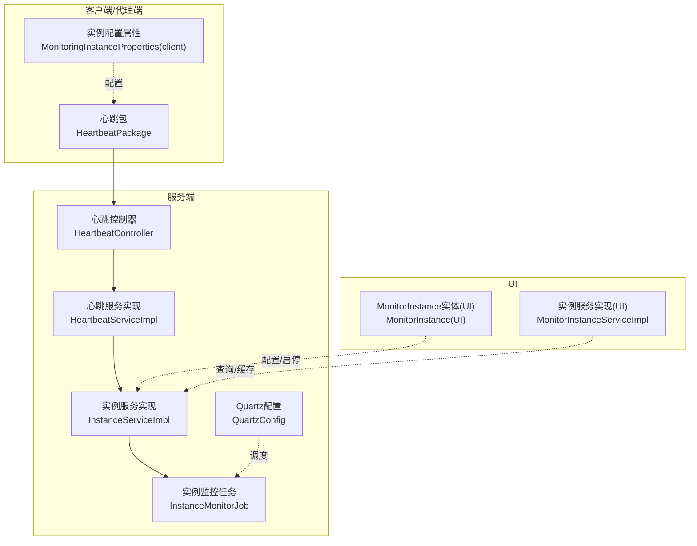
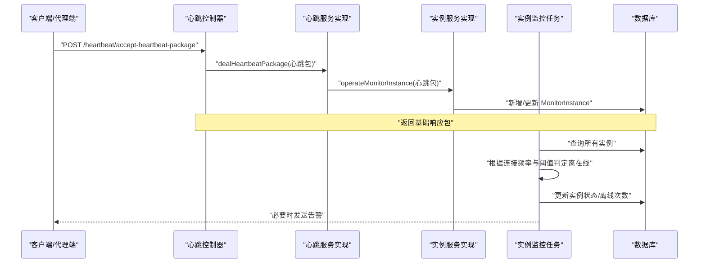
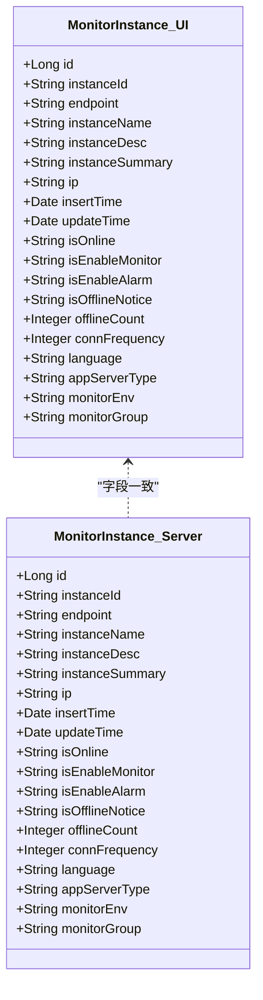
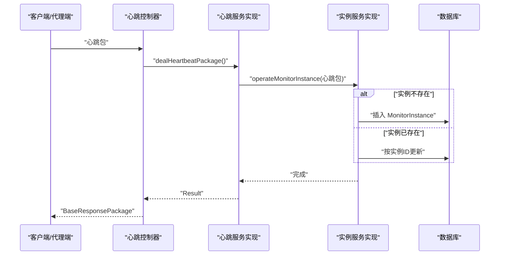
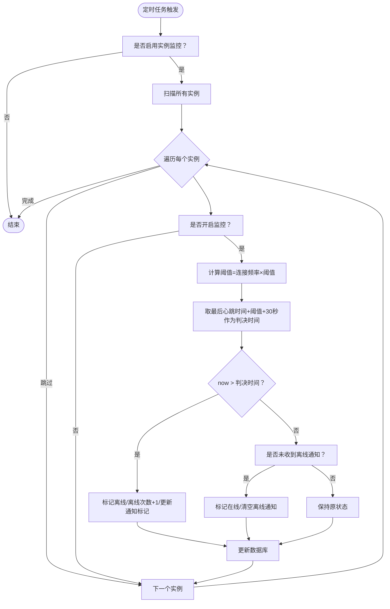
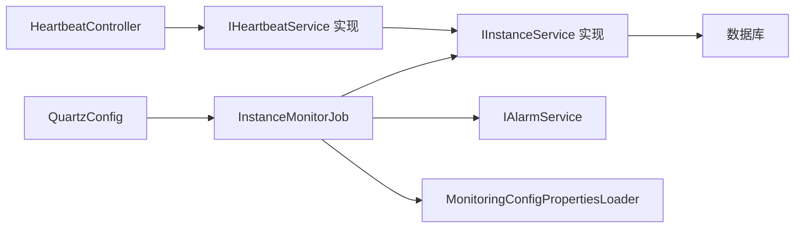

# 实例监控业务

<cite>
**本文引用的文件**
- [phoenix-server/src/main/java/com/gitee/pifeng/monitoring/server/business/server/controller/HeartbeatController.java](file://phoenix-server/src/main/java/com/gitee/pifeng/monitoring/server/business/server/controller/HeartbeatController.java)
- [phoenix-server/src/main/java/com/gitee/pifeng/monitoring/server/business/server/service/impl/HeartbeatServiceImpl.java](file://phoenix-server/src/main/java/com/gitee/pifeng/monitoring/server/business/server/service/impl/HeartbeatServiceImpl.java)
- [phoenix-server/src/main/java/com/gitee/pifeng/monitoring/server/business/server/service/IHeartbeatService.java](file://phoenix-server/src/main/java/com/gitee/pifeng/monitoring/server/business/server/service/IHeartbeatService.java)
- [phoenix-server/src/main/java/com/gitee/pifeng/monitoring/server/business/server/service/impl/InstanceServiceImpl.java](file://phoenix-server/src/main/java/com/gitee/pifeng/monitoring/server/business/server/service/impl/InstanceServiceImpl.java)
- [phoenix-server/src/main/java/com/gitee/pifeng/monitoring/server/business/server/service/IInstanceService.java](file://phoenix-server/src/main/java/com/gitee/pifeng/monitoring/server/business/server/service/IInstanceService.java)
- [phoenix-server/src/main/java/com/gitee/pifeng/monitoring/server/business/server/entity/MonitorInstance.java](file://phoenix-server/src/main/java/com/gitee/pifeng/monitoring/server/business/server/entity/MonitorInstance.java)
- [phoenix-server/src/main/java/com/gitee/pifeng/monitoring/server/business/server/monitor/instance/InstanceMonitorJob.java](file://phoenix-server/src/main/java/com/gitee/pifeng/monitoring/server/business/server/monitor/instance/InstanceMonitorJob.java)
- [phoenix-server/src/main/java/com/gitee/pifeng/monitoring/server/config/QuartzConfig.java](file://phoenix-server/src/main/java/com/gitee/pifeng/monitoring/server/config/QuartzConfig.java)
- [phoenix-common/phoenix-common-core/src/main/java/com/gitee/pifeng/monitoring/common/dto/HeartbeatPackage.java](file://phoenix-common/phoenix-common-core/src/main/java/com/gitee/pifeng/monitoring/common/dto/HeartbeatPackage.java)
- [phoenix-common/phoenix-common-core/src/main/java/com/gitee/pifeng/monitoring/common/property/server/MonitoringInstanceProperties.java](file://phoenix-common/phoenix-common-core/src/main/java/com/gitee/pifeng/monitoring/common/property/server/MonitoringInstanceProperties.java)
- [phoenix-common/phoenix-common-core/src/main/java/com/gitee/pifeng/monitoring/common/property/client/MonitoringInstanceProperties.java](file://phoenix-common/phoenix-common-core/src/main/java/com/gitee/pifeng/monitoring/common/property/client/MonitoringInstanceProperties.java)
- [phoenix-ui/src/main/java/com/gitee/pifeng/monitoring/ui/business/web/entity/MonitorInstance.java](file://phoenix-ui/src/main/java/com/gitee/pifeng/monitoring/ui/business/web/entity/MonitorInstance.java)
- [phoenix-ui/src/main/java/com/gitee/pifeng/monitoring/ui/business/web/service/impl/MonitorInstanceServiceImpl.java](file://phoenix-ui/src/main/java/com/gitee/pifeng/monitoring/ui/business/web/service/impl/MonitorInstanceServiceImpl.java)
- [doc/数据库设计/sql/mysql/phoenix.sql](file://doc/数据库设计/sql/mysql/phoenix.sql)
</cite>

## 目录
1. [简介](#简介)
2. [项目结构](#项目结构)
3. [核心组件](#核心组件)
4. [架构总览](#架构总览)
5. [详细组件分析](#详细组件分析)
6. [依赖分析](#依赖分析)
7. [性能考量](#性能考量)
8. [故障排查指南](#故障排查指南)
9. [结论](#结论)
10. [附录](#附录)

## 简介
本文件面向“实例监控业务”，系统化阐述应用实例注册、实例状态监控、实例健康检查与实例性能统计等核心能力。重点覆盖以下方面：
- 实例监控的数据模型：MonitorInstance 实体类、实例配置信息、运行状态等
- 业务流程：从实例注册信息接收、健康状态检查、性能数据收集到状态更新的完整过程
- 关键业务逻辑：实例信息验证、状态变更检测、性能指标聚合、实例生命周期管理
- 分布式处理与扩展性：如何支持大规模实例的监控管理

## 项目结构
实例监控涉及三大模块协作：
- 客户端/代理端：负责采集与上报心跳包与性能数据
- 服务端：负责接收、入库、状态判定与告警
- UI：负责实例配置、启停监控与可视化展示

图表来源
- [phoenix-server/src/main/java/com/gitee/pifeng/monitoring/server/business/server/controller/HeartbeatController.java:61-77](file://phoenix-server/src/main/java/com/gitee/pifeng/monitoring/server/business/server/controller/HeartbeatController.java#L61-L77)
- [phoenix-server/src/main/java/com/gitee/pifeng/monitoring/server/business/server/service/impl/HeartbeatServiceImpl.java:39-45](file://phoenix-server/src/main/java/com/gitee/pifeng/monitoring/server/business/server/service/impl/HeartbeatServiceImpl.java#L39-L45)
- [phoenix-server/src/main/java/com/gitee/pifeng/monitoring/server/business/server/service/impl/InstanceServiceImpl.java:43-78](file://phoenix-server/src/main/java/com/gitee/pifeng/monitoring/server/business/server/service/impl/InstanceServiceImpl.java#L43-L78)
- [phoenix-server/src/main/java/com/gitee/pifeng/monitoring/server/business/server/monitor/instance/InstanceMonitorJob.java:122-172](file://phoenix-server/src/main/java/com/gitee/pifeng/monitoring/server/business/server/monitor/instance/InstanceMonitorJob.java#L122-L172)
- [phoenix-server/src/main/java/com/gitee/pifeng/monitoring/server/config/QuartzConfig.java:49-71](file://phoenix-server/src/main/java/com/gitee/pifeng/monitoring/server/config/QuartzConfig.java#L49-L71)
- [phoenix-ui/src/main/java/com/gitee/pifeng/monitoring/ui/business/web/service/impl/MonitorInstanceServiceImpl.java:463-470](file://phoenix-ui/src/main/java/com/gitee/pifeng/monitoring/ui/business/web/service/impl/MonitorInstanceServiceImpl.java#L463-L470)

章节来源
- [phoenix-server/src/main/java/com/gitee/pifeng/monitoring/server/business/server/controller/HeartbeatController.java:61-77](file://phoenix-server/src/main/java/com/gitee/pifeng/monitoring/server/business/server/controller/HeartbeatController.java#L61-L77)
- [phoenix-server/src/main/java/com/gitee/pifeng/monitoring/server/business/server/service/impl/HeartbeatServiceImpl.java:39-45](file://phoenix-server/src/main/java/com/gitee/pifeng/monitoring/server/business/server/service/impl/HeartbeatServiceImpl.java#L39-L45)
- [phoenix-server/src/main/java/com/gitee/pifeng/monitoring/server/business/server/service/impl/InstanceServiceImpl.java:43-78](file://phoenix-server/src/main/java/com/gitee/pifeng/monitoring/server/business/server/service/impl/InstanceServiceImpl.java#L43-L78)
- [phoenix-server/src/main/java/com/gitee/pifeng/monitoring/server/business/server/monitor/instance/InstanceMonitorJob.java:122-172](file://phoenix-server/src/main/java/com/gitee/pifeng/monitoring/server/business/server/monitor/instance/InstanceMonitorJob.java#L122-L172)
- [phoenix-server/src/main/java/com/gitee/pifeng/monitoring/server/config/QuartzConfig.java:49-71](file://phoenix-server/src/main/java/com/gitee/pifeng/monitoring/server/config/QuartzConfig.java#L49-L71)
- [phoenix-ui/src/main/java/com/gitee/pifeng/monitoring/ui/business/web/service/impl/MonitorInstanceServiceImpl.java:463-470](file://phoenix-ui/src/main/java/com/gitee/pifeng/monitoring/ui/business/web/service/impl/MonitorInstanceServiceImpl.java#L463-L470)

## 核心组件
- 心跳包与配置
  - 心跳包载体：包含实例标识、端点、语言、应用服务器类型、上报频率等
  - 客户端配置：实例端点、名称、描述、语言等
- 服务端处理链路
  - 控制器接收心跳包并返回响应
  - 服务层持久化实例信息（新增/更新）
  - 监控任务周期扫描实例状态并触发告警
- 数据模型
  - 服务端实体：MonitorInstance（含实例ID、端点、状态、监控开关、离线次数、连接频率等）
  - UI实体：MonitorInstance（用于前端展示与配置）
- 配置与调度
  - 服务端实例监控配置项
  - Quartz定时任务调度实例状态扫描

章节来源
- [phoenix-common/phoenix-common-core/src/main/java/com/gitee/pifeng/monitoring/common/dto/HeartbeatPackage.java:20-27](file://phoenix-common/phoenix-common-core/src/main/java/com/gitee/pifeng/monitoring/common/dto/HeartbeatPackage.java#L20-L27)
- [phoenix-common/phoenix-common-core/src/main/java/com/gitee/pifeng/monitoring/common/property/client/MonitoringInstanceProperties.java:20-47](file://phoenix-common/phoenix-common-core/src/main/java/com/gitee/pifeng/monitoring/common/property/client/MonitoringInstanceProperties.java#L20-L47)
- [phoenix-server/src/main/java/com/gitee/pifeng/monitoring/server/business/server/entity/MonitorInstance.java:27-143](file://phoenix-server/src/main/java/com/gitee/pifeng/monitoring/server/business/server/entity/MonitorInstance.java#L27-L143)
- [phoenix-ui/src/main/java/com/gitee/pifeng/monitoring/ui/business/web/entity/MonitorInstance.java:29-110](file://phoenix-ui/src/main/java/com/gitee/pifeng/monitoring/ui/business/web/entity/MonitorInstance.java#L29-L110)
- [phoenix-common/phoenix-common-core/src/main/java/com/gitee/pifeng/monitoring/common/property/server/MonitoringInstanceProperties.java:19-31](file://phoenix-common/phoenix-common-core/src/main/java/com/gitee/pifeng/monitoring/common/property/server/MonitoringInstanceProperties.java#L19-L31)

## 架构总览
实例监控的端到端流程如下：
- 客户端/代理端周期上报心跳包
- 服务端控制器接收并调用心跳服务
- 心跳服务持久化实例信息（新增或更新）
- 定时任务扫描实例状态，基于阈值判断离在线并触发告警
- UI可对实例进行启停监控、查看详情与分组配置

图表来源
- [phoenix-server/src/main/java/com/gitee/pifeng/monitoring/server/business/server/controller/HeartbeatController.java:61-77](file://phoenix-server/src/main/java/com/gitee/pifeng/monitoring/server/business/server/controller/HeartbeatController.java#L61-L77)
- [phoenix-server/src/main/java/com/gitee/pifeng/monitoring/server/business/server/service/impl/HeartbeatServiceImpl.java:39-45](file://phoenix-server/src/main/java/com/gitee/pifeng/monitoring/server/business/server/service/impl/HeartbeatServiceImpl.java#L39-L45)
- [phoenix-server/src/main/java/com/gitee/pifeng/monitoring/server/business/server/service/impl/InstanceServiceImpl.java:43-78](file://phoenix-server/src/main/java/com/gitee/pifeng/monitoring/server/business/server/service/impl/InstanceServiceImpl.java#L43-L78)
- [phoenix-server/src/main/java/com/gitee/pifeng/monitoring/server/business/server/monitor/instance/InstanceMonitorJob.java:122-172](file://phoenix-server/src/main/java/com/gitee/pifeng/monitoring/server/business/server/monitor/instance/InstanceMonitorJob.java#L122-L172)

## 详细组件分析

### 数据模型：MonitorInstance
- 服务端实体（持久化）：包含实例ID、端点、名称、描述、摘要、IP、新增/更新时间、在线状态、监控/告警开关、离线通知标记、离线次数、连接频率、语言、应用服务器类型、监控环境与分组等
- UI实体（展示/配置）：字段与服务端实体一致，用于前端启停监控、编辑描述与摘要、分组与环境配置

图表来源
- [phoenix-server/src/main/java/com/gitee/pifeng/monitoring/server/business/server/entity/MonitorInstance.java:27-143](file://phoenix-server/src/main/java/com/gitee/pifeng/monitoring/server/business/server/entity/MonitorInstance.java#L27-L143)
- [phoenix-ui/src/main/java/com/gitee/pifeng/monitoring/ui/business/web/entity/MonitorInstance.java:29-110](file://phoenix-ui/src/main/java/com/gitee/pifeng/monitoring/ui/business/web/entity/MonitorInstance.java#L29-L110)

章节来源
- [phoenix-server/src/main/java/com/gitee/pifeng/monitoring/server/business/server/entity/MonitorInstance.java:27-143](file://phoenix-server/src/main/java/com/gitee/pifeng/monitoring/server/business/server/entity/MonitorInstance.java#L27-L143)
- [phoenix-ui/src/main/java/com/gitee/pifeng/monitoring/ui/business/web/entity/MonitorInstance.java:29-110](file://phoenix-ui/src/main/java/com/gitee/pifeng/monitoring/ui/business/web/entity/MonitorInstance.java#L29-L110)
- [doc/数据库设计/sql/mysql/phoenix.sql:286-296](file://doc/数据库设计/sql/mysql/phoenix.sql#L286-L296)

### 实例注册与持久化
- 接收心跳包：控制器接收客户端/代理端上报的心跳包
- 处理逻辑：服务层根据实例ID是否存在决定新增或更新，同时写入连接频率、语言、应用服务器类型等
- 并发与事务：服务层方法具备重试与事务控制，确保一致性

图表来源
- [phoenix-server/src/main/java/com/gitee/pifeng/monitoring/server/business/server/controller/HeartbeatController.java:61-77](file://phoenix-server/src/main/java/com/gitee/pifeng/monitoring/server/business/server/controller/HeartbeatController.java#L61-L77)
- [phoenix-server/src/main/java/com/gitee/pifeng/monitoring/server/business/server/service/impl/HeartbeatServiceImpl.java:39-45](file://phoenix-server/src/main/java/com/gitee/pifeng/monitoring/server/business/server/service/impl/HeartbeatServiceImpl.java#L39-L45)
- [phoenix-server/src/main/java/com/gitee/pifeng/monitoring/server/business/server/service/impl/InstanceServiceImpl.java:43-78](file://phoenix-server/src/main/java/com/gitee/pifeng/monitoring/server/business/server/service/impl/InstanceServiceImpl.java#L43-L78)

章节来源
- [phoenix-server/src/main/java/com/gitee/pifeng/monitoring/server/business/server/controller/HeartbeatController.java:61-77](file://phoenix-server/src/main/java/com/gitee/pifeng/monitoring/server/business/server/controller/HeartbeatController.java#L61-L77)
- [phoenix-server/src/main/java/com/gitee/pifeng/monitoring/server/business/server/service/impl/HeartbeatServiceImpl.java:39-45](file://phoenix-server/src/main/java/com/gitee/pifeng/monitoring/server/business/server/service/impl/HeartbeatServiceImpl.java#L39-L45)
- [phoenix-server/src/main/java/com/gitee/pifeng/monitoring/server/business/server/service/impl/InstanceServiceImpl.java:43-78](file://phoenix-server/src/main/java/com/gitee/pifeng/monitoring/server/business/server/service/impl/InstanceServiceImpl.java#L43-L78)

### 实例状态监控与健康检查
- 启动初始化：项目启动后，将之前在线的实例更新时间为当前时间，维持在线状态
- 周期扫描：定时任务扫描所有实例，依据连接频率与阈值计算“判决时间”，超过则判定离线
- 状态切换：离线→在线或在线→离线时，发送相应告警并更新离线次数与通知标记
- 下线回调：收到下线信息包时，立即执行离线处理

图表来源
- [phoenix-server/src/main/java/com/gitee/pifeng/monitoring/server/business/server/monitor/instance/InstanceMonitorJob.java:122-172](file://phoenix-server/src/main/java/com/gitee/pifeng/monitoring/server/business/server/monitor/instance/InstanceMonitorJob.java#L122-L172)
- [phoenix-server/src/main/java/com/gitee/pifeng/monitoring/server/business/server/monitor/instance/InstanceMonitorJob.java:275-296](file://phoenix-server/src/main/java/com/gitee/pifeng/monitoring/server/business/server/monitor/instance/InstanceMonitorJob.java#L275-L296)
- [phoenix-server/src/main/java/com/gitee/pifeng/monitoring/server/business/server/monitor/instance/InstanceMonitorJob.java:308-328](file://phoenix-server/src/main/java/com/gitee/pifeng/monitoring/server/business/server/monitor/instance/InstanceMonitorJob.java#L308-L328)

章节来源
- [phoenix-server/src/main/java/com/gitee/pifeng/monitoring/server/business/server/monitor/instance/InstanceMonitorJob.java:94-110](file://phoenix-server/src/main/java/com/gitee/pifeng/monitoring/server/business/server/monitor/instance/InstanceMonitorJob.java#L94-L110)
- [phoenix-server/src/main/java/com/gitee/pifeng/monitoring/server/business/server/monitor/instance/InstanceMonitorJob.java:122-172](file://phoenix-server/src/main/java/com/gitee/pifeng/monitoring/server/business/server/monitor/instance/InstanceMonitorJob.java#L122-L172)
- [phoenix-server/src/main/java/com/gitee/pifeng/monitoring/server/business/server/monitor/instance/InstanceMonitorJob.java:275-296](file://phoenix-server/src/main/java/com/gitee/pifeng/monitoring/server/business/server/monitor/instance/InstanceMonitorJob.java#L275-L296)
- [phoenix-server/src/main/java/com/gitee/pifeng/monitoring/server/business/server/monitor/instance/InstanceMonitorJob.java:308-328](file://phoenix-server/src/main/java/com/gitee/pifeng/monitoring/server/business/server/monitor/instance/InstanceMonitorJob.java#L308-L328)

### 性能统计与指标聚合
- JVM信息包：客户端/代理端周期上报JVM信息包，包含类加载、GC、内存、运行时、线程等域
- 服务端处理：服务端提供JVM运行时信息服务接口，用于将JVM信息包落库或聚合
- 采集频率：客户端配置JVM信息采集开关与上报频率，服务端按频率处理

章节来源
- [phoenix-common/phoenix-common-core/src/main/java/com/gitee/pifeng/monitoring/common/dto/JvmPackage.java:21-33](file://phoenix-common/phoenix-common-core/src/main/java/com/gitee/pifeng/monitoring/common/dto/JvmPackage.java#L21-L33)
- [phoenix-common/phoenix-common-core/src/main/java/com/gitee/pifeng/monitoring/common/domain/Jvm.java:23-50](file://phoenix-common/phoenix-common-core/src/main/java/com/gitee/pifeng/monitoring/common/domain/Jvm.java#L23-L50)
- [phoenix-common/phoenix-common-core/src/main/java/com/gitee/pifeng/monitoring/common/property/client/MonitoringJvmInfoProperties.java:20-32](file://phoenix-common/phoenix-common-core/src/main/java/com/gitee/pifeng/monitoring/common/property/client/MonitoringJvmInfoProperties.java#L20-L32)
- [phoenix-server/src/main/java/com/gitee/pifeng/monitoring/server/business/server/service/IJvmRuntimeService.java:15-27](file://phoenix-server/src/main/java/com/gitee/pifeng/monitoring/server/business/server/service/IJvmRuntimeService.java#L15-L27)

### 实例生命周期管理与UI交互
- 启停监控：UI可对实例设置“是否开启监控”，关闭时会将在线状态置空以避免误判
- 查询缓存：UI与服务端均提供按实例ID查询并带缓存的接口，提升读取性能
- 配置项：实例端点、名称、描述、语言、监控环境与分组等

章节来源
- [phoenix-ui/src/main/java/com/gitee/pifeng/monitoring/ui/business/web/service/impl/MonitorInstanceServiceImpl.java:387-398](file://phoenix-ui/src/main/java/com/gitee/pifeng/monitoring/ui/business/web/service/impl/MonitorInstanceServiceImpl.java#L387-L398)
- [phoenix-ui/src/main/java/com/gitee/pifeng/monitoring/ui/business/web/service/impl/MonitorInstanceServiceImpl.java:463-470](file://phoenix-ui/src/main/java/com/gitee/pifeng/monitoring/ui/business/web/service/impl/MonitorInstanceServiceImpl.java#L463-L470)
- [phoenix-ui/src/main/java/com/gitee/pifeng/monitoring/ui/business/web/entity/MonitorInstance.java:29-110](file://phoenix-ui/src/main/java/com/gitee/pifeng/monitoring/ui/business/web/entity/MonitorInstance.java#L29-L110)

## 依赖分析
- 组件耦合
  - 控制器依赖心跳服务接口
  - 心跳服务依赖实例服务接口
  - 实例监控任务依赖实例服务、告警服务与配置加载器
- 外部依赖
  - Quartz：定时任务调度
  - MyBatis-Plus：实体映射与查询
  - Spring Retry/Cache：事务与缓存增强

图表来源
- [phoenix-server/src/main/java/com/gitee/pifeng/monitoring/server/business/server/controller/HeartbeatController.java:36-48](file://phoenix-server/src/main/java/com/gitee/pifeng/monitoring/server/business/server/controller/HeartbeatController.java#L36-L48)
- [phoenix-server/src/main/java/com/gitee/pifeng/monitoring/server/business/server/service/impl/HeartbeatServiceImpl.java:21-27](file://phoenix-server/src/main/java/com/gitee/pifeng/monitoring/server/business/server/service/impl/HeartbeatServiceImpl.java#L21-L27)
- [phoenix-server/src/main/java/com/gitee/pifeng/monitoring/server/business/server/service/impl/InstanceServiceImpl.java](file://phoenix-server/src/main/java/com/gitee/pifeng/monitoring/server/business/server/service/impl/InstanceServiceImpl.java#L29)
- [phoenix-server/src/main/java/com/gitee/pifeng/monitoring/server/business/server/monitor/instance/InstanceMonitorJob.java:53-77](file://phoenix-server/src/main/java/com/gitee/pifeng/monitoring/server/business/server/monitor/instance/InstanceMonitorJob.java#L53-L77)
- [phoenix-server/src/main/java/com/gitee/pifeng/monitoring/server/config/QuartzConfig.java:49-71](file://phoenix-server/src/main/java/com/gitee/pifeng/monitoring/server/config/QuartzConfig.java#L49-L71)

章节来源
- [phoenix-server/src/main/java/com/gitee/pifeng/monitoring/server/business/server/controller/HeartbeatController.java:36-48](file://phoenix-server/src/main/java/com/gitee/pifeng/monitoring/server/business/server/controller/HeartbeatController.java#L36-L48)
- [phoenix-server/src/main/java/com/gitee/pifeng/monitoring/server/business/server/service/impl/HeartbeatServiceImpl.java:21-27](file://phoenix-server/src/main/java/com/gitee/pifeng/monitoring/server/business/server/service/impl/HeartbeatServiceImpl.java#L21-L27)
- [phoenix-server/src/main/java/com/gitee/pifeng/monitoring/server/business/server/service/impl/InstanceServiceImpl.java](file://phoenix-server/src/main/java/com/gitee/pifeng/monitoring/server/business/server/service/impl/InstanceServiceImpl.java#L29)
- [phoenix-server/src/main/java/com/gitee/pifeng/monitoring/server/business/server/monitor/instance/InstanceMonitorJob.java:53-77](file://phoenix-server/src/main/java/com/gitee/pifeng/monitoring/server/business/server/monitor/instance/InstanceMonitorJob.java#L53-L77)
- [phoenix-server/src/main/java/com/gitee/pifeng/monitoring/server/config/QuartzConfig.java:49-71](file://phoenix-server/src/main/java/com/gitee/pifeng/monitoring/server/config/QuartzConfig.java#L49-L71)

## 性能考量
- 事务与重试：实例持久化方法具备事务与重试注解，降低并发写入失败风险
- 缓存策略：按实例ID查询实例信息使用缓存，减少数据库压力
- 定时任务节流：通过阈值与连接频率共同决定“判决时间”，避免频繁抖动
- 异步与并发：定时任务禁止并发执行，确保状态判定一致性

章节来源
- [phoenix-server/src/main/java/com/gitee/pifeng/monitoring/server/business/server/service/impl/InstanceServiceImpl.java:40-41](file://phoenix-server/src/main/java/com/gitee/pifeng/monitoring/server/business/server/service/impl/InstanceServiceImpl.java#L40-L41)
- [phoenix-server/src/main/java/com/gitee/pifeng/monitoring/server/business/server/service/impl/InstanceServiceImpl.java:91-97](file://phoenix-server/src/main/java/com/gitee/pifeng/monitoring/server/business/server/service/impl/InstanceServiceImpl.java#L91-L97)
- [phoenix-server/src/main/java/com/gitee/pifeng/monitoring/server/business/server/monitor/instance/InstanceMonitorJob.java](file://phoenix-server/src/main/java/com/gitee/pifeng/monitoring/server/business/server/monitor/instance/InstanceMonitorJob.java#L52)
- [phoenix-server/src/main/java/com/gitee/pifeng/monitoring/server/business/server/monitor/instance/InstanceMonitorJob.java:148-153](file://phoenix-server/src/main/java/com/gitee/pifeng/monitoring/server/business/server/monitor/instance/InstanceMonitorJob.java#L148-L153)

## 故障排查指南
- 心跳包处理耗时告警：控制器在处理心跳包耗时超过阈值时输出警告日志，便于定位慢调用
- 状态误判排查：确认实例连接频率与全局阈值配置是否合理；检查实例是否被意外关闭监控
- 离线告警核验：核对实例是否收到离线通知标记，以及离线次数是否持续增长
- 下线回调：确认下线信息包是否正确下发并触发离线回调

章节来源
- [phoenix-server/src/main/java/com/gitee/pifeng/monitoring/server/business/server/controller/HeartbeatController.java:66-76](file://phoenix-server/src/main/java/com/gitee/pifeng/monitoring/server/business/server/controller/HeartbeatController.java#L66-L76)
- [phoenix-server/src/main/java/com/gitee/pifeng/monitoring/server/business/server/monitor/instance/InstanceMonitorJob.java:155-166](file://phoenix-server/src/main/java/com/gitee/pifeng/monitoring/server/business/server/monitor/instance/InstanceMonitorJob.java#L155-L166)
- [phoenix-server/src/main/java/com/gitee/pifeng/monitoring/server/business/server/monitor/instance/InstanceMonitorJob.java:227-264](file://phoenix-server/src/main/java/com/gitee/pifeng/monitoring/server/business/server/monitor/instance/InstanceMonitorJob.java#L227-L264)

## 结论
实例监控通过“心跳上报—持久化—定时扫描—状态判定—告警”的闭环机制，实现了对大规模实例的稳定监控。结合缓存、事务与重试、Quartz调度与阈值策略，系统在可用性与性能之间取得平衡。UI侧提供启停监控与配置能力，进一步增强了运维效率。

## 附录
- 关键配置项
  - 服务端实例监控总开关与状态监控开关
  - 客户端实例端点、名称、描述、语言等
- 数据库表字段参考
  - MONITOR_INSTANCE 表的关键字段：实例ID、端点、在线状态、监控开关、告警开关、离线通知、离线次数、连接频率、监控环境与分组等

章节来源
- [phoenix-common/phoenix-common-core/src/main/java/com/gitee/pifeng/monitoring/common/property/server/MonitoringInstanceProperties.java:19-31](file://phoenix-common/phoenix-common-core/src/main/java/com/gitee/pifeng/monitoring/common/property/server/MonitoringInstanceProperties.java#L19-L31)
- [phoenix-common/phoenix-common-core/src/main/java/com/gitee/pifeng/monitoring/common/property/client/MonitoringInstanceProperties.java:20-47](file://phoenix-common/phoenix-common-core/src/main/java/com/gitee/pifeng/monitoring/common/property/client/MonitoringInstanceProperties.java#L20-L47)
- [doc/数据库设计/sql/mysql/phoenix.sql:286-296](file://doc/数据库设计/sql/mysql/phoenix.sql#L286-L296)