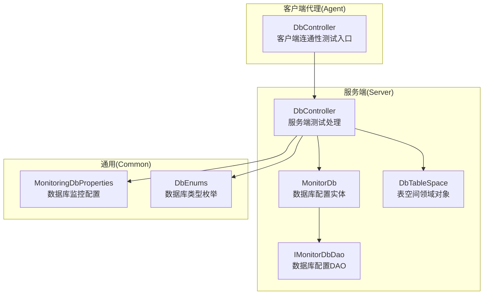
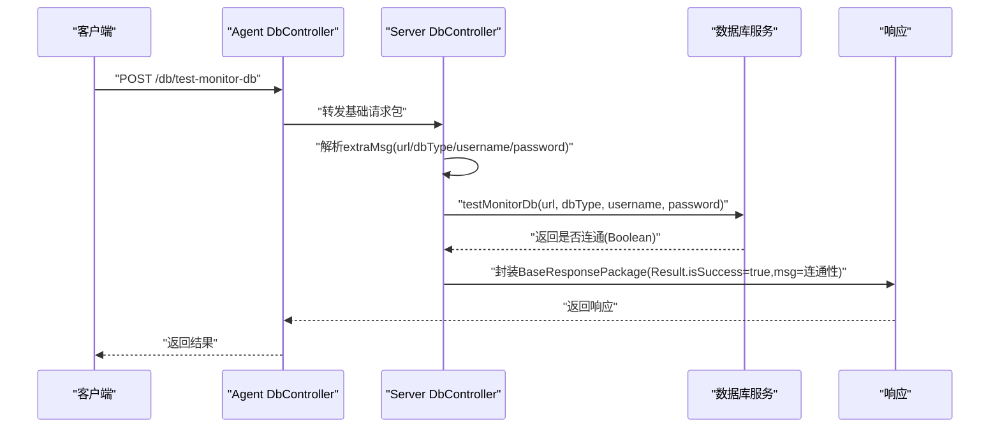
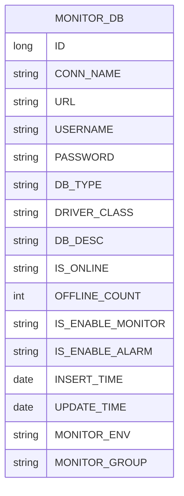
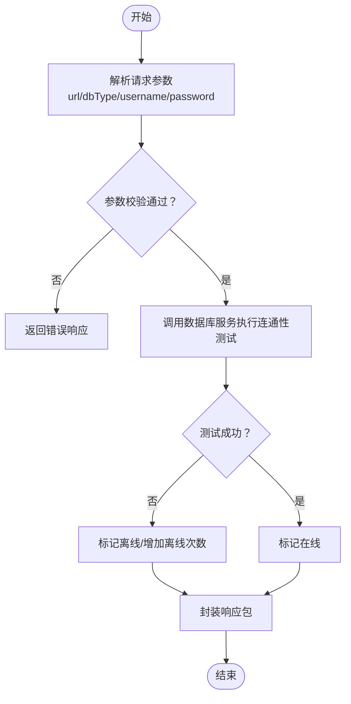
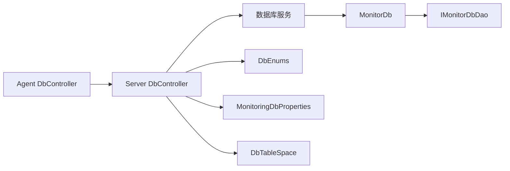

# 数据库监控业务

<cite>
**本文引用的文件**
- [DbController.java](file://phoenix-agent/src/main/java/com/gitee/pifeng/monitoring/agent/business/client/controller/DbController.java)
- [DbController.java](file://phoenix-server/src/main/java/com/gitee/pifeng/monitoring/server/business/server/controller/DbController.java)
- [MonitorDb.java](file://phoenix-server/src/main/java/com/gitee/pifeng/monitoring/server/business/server/entity/MonitorDb.java)
- [IMonitorDbDao.java](file://phoenix-server/src/main/java/com/gitee/pifeng/monitoring/server/business/server/dao/IMonitorDbDao.java)
- [DbTableSpace.java](file://phoenix-server/src/main/java/com/gitee/pifeng/monitoring/server/business/server/domain/DbTableSpace.java)
- [MonitoringDbProperties.java](file://phoenix-common/phoenix-common-core/src/main/java/com/gitee/pifeng/monitoring/common/property/server/MonitoringDbProperties.java)
- [DbEnums.java](file://phoenix-common/phoenix-common-core/src/main/java/com/gitee/pifeng/monitoring/common/constant/DbEnums.java)
</cite>

## 目录
1. [简介](#简介)
2. [项目结构](#项目结构)
3. [核心组件](#核心组件)
4. [架构总览](#架构总览)
5. [详细组件分析](#详细组件分析)
6. [依赖分析](#依赖分析)
7. [性能考虑](#性能考虑)
8. [故障排查指南](#故障排查指南)
9. [结论](#结论)
10. [附录](#附录)

## 简介
本文件面向数据库监控业务，围绕 DbController 的实现进行深入解析，涵盖数据库连通性测试、数据库信息采集、连接池监控等核心能力；梳理数据库监控的数据模型（MonitorDb 实体类、数据库连接配置、连接状态管理）；阐述从客户端数据接收、验证、到服务端处理与存储的完整业务链路；并给出可扩展的设计说明，以支持 MySQL、Oracle、Redis、MongoDB 等多数据库类型的监控。

## 项目结构
数据库监控相关模块分布于以下位置：
- 客户端代理层（Agent）：负责采集与上报，包含数据库连通性测试入口。
- 服务端（Server）：负责接收请求、执行测试、封装响应、持久化与查询。
- 通用模块（Common）：提供数据库类型枚举、监控配置属性等公共能力。
- UI 层：提供数据库配置与监控界面（不在本文件重点分析范围内）。

图表来源
- [DbController.java:1-61](file://phoenix-agent/src/main/java/com/gitee/pifeng/monitoring/agent/business/client/controller/DbController.java#L1-L61)
- [DbController.java:1-85](file://phoenix-server/src/main/java/com/gitee/pifeng/monitoring/server/business/server/controller/DbController.java#L1-L85)
- [MonitorDb.java:1-126](file://phoenix-server/src/main/java/com/gitee/pifeng/monitoring/server/business/server/entity/MonitorDb.java#L1-L126)
- [IMonitorDbDao.java:1-16](file://phoenix-server/src/main/java/com/gitee/pifeng/monitoring/server/business/server/dao/IMonitorDbDao.java#L1-L16)
- [DbTableSpace.java:1-55](file://phoenix-server/src/main/java/com/gitee/pifeng/monitoring/server/business/server/domain/DbTableSpace.java#L1-L55)
- [MonitoringDbProperties.java:1-37](file://phoenix-common/phoenix-common-core/src/main/java/com/gitee/pifeng/monitoring/common/property/server/MonitoringDbProperties.java#L1-L37)
- [DbEnums.java:1-67](file://phoenix-common/phoenix-common-core/src/main/java/com/gitee/pifeng/monitoring/common/constant/DbEnums.java#L1-L67)

章节来源
- [DbController.java:1-61](file://phoenix-agent/src/main/java/com/gitee/pifeng/monitoring/agent/business/client/controller/DbController.java#L1-L61)
- [DbController.java:1-85](file://phoenix-server/src/main/java/com/gitee/pifeng/monitoring/server/business/server/controller/DbController.java#L1-L85)
- [MonitorDb.java:1-126](file://phoenix-server/src/main/java/com/gitee/pifeng/monitoring/server/business/server/entity/MonitorDb.java#L1-L126)
- [IMonitorDbDao.java:1-16](file://phoenix-server/src/main/java/com/gitee/pifeng/monitoring/server/business/server/dao/IMonitorDbDao.java#L1-L16)
- [DbTableSpace.java:1-55](file://phoenix-server/src/main/java/com/gitee/pifeng/monitoring/server/business/server/domain/DbTableSpace.java#L1-L55)
- [MonitoringDbProperties.java:1-37](file://phoenix-common/phoenix-common-core/src/main/java/com/gitee/pifeng/monitoring/common/property/server/MonitoringDbProperties.java#L1-L37)
- [DbEnums.java:1-67](file://phoenix-common/phoenix-common-core/src/main/java/com/gitee/pifeng/monitoring/common/constant/DbEnums.java#L1-L67)

## 核心组件
- 客户端 DbController：对外暴露“测试数据库连通性”接口，将请求转发至基础请求包服务。
- 服务端 DbController：接收客户端请求，解析参数，调用数据库服务执行连通性测试，返回结果。
- MonitorDb 实体：数据库连接配置的持久化载体，包含连接名、URL、用户名、密码、驱动类、状态、是否启用监控/告警、监控环境与分组等字段。
- IMonitorDbDao：基于 MyBatis-Plus 的 Mapper 接口，用于数据库配置的 CRUD。
- DbTableSpace 领域对象：封装 Oracle 表空间信息（总量、使用量、剩余量、使用率、剩余率）。
- MonitoringDbProperties：数据库监控配置属性，包含是否启用、数据库状态配置、表空间配置等。
- DbEnums：数据库类型枚举（Oracle、MySQL、Redis、Mongo），并提供字符串到枚举的转换方法。

章节来源
- [DbController.java:35-58](file://phoenix-agent/src/main/java/com/gitee/pifeng/monitoring/agent/business/client/controller/DbController.java#L35-L58)
- [DbController.java:62-82](file://phoenix-server/src/main/java/com/gitee/pifeng/monitoring/server/business/server/controller/DbController.java#L62-L82)
- [MonitorDb.java:27-124](file://phoenix-server/src/main/java/com/gitee/pifeng/monitoring/server/business/server/entity/MonitorDb.java#L27-L124)
- [IMonitorDbDao.java:14-15](file://phoenix-server/src/main/java/com/gitee/pifeng/monitoring/server/business/server/dao/IMonitorDbDao.java#L14-L15)
- [DbTableSpace.java:22-53](file://phoenix-server/src/main/java/com/gitee/pifeng/monitoring/server/business/server/domain/DbTableSpace.java#L22-L53)
- [MonitoringDbProperties.java:19-36](file://phoenix-common/phoenix-common-core/src/main/java/com/gitee/pifeng/monitoring/common/property/server/MonitoringDbProperties.java#L19-L36)
- [DbEnums.java:14-66](file://phoenix-common/phoenix-common-core/src/main/java/com/gitee/pifeng/monitoring/common/constant/DbEnums.java#L14-L66)

## 架构总览
数据库监控的端到端链路如下：
- 客户端通过 DbController 发起“测试数据库连通性”请求。
- 服务端 DbController 解析请求中的数据库连接参数（URL、类型、用户名、密码）。
- 调用数据库服务执行连通性测试，返回布尔结果。
- 封装响应包并返回给客户端。

图表来源
- [DbController.java:52-58](file://phoenix-agent/src/main/java/com/gitee/pifeng/monitoring/agent/business/client/controller/DbController.java#L52-L58)
- [DbController.java:65-82](file://phoenix-server/src/main/java/com/gitee/pifeng/monitoring/server/business/server/controller/DbController.java#L65-L82)

## 详细组件分析

### 客户端 DbController（Agent）
- 职责：提供“测试数据库连通性”的入口，接收 BaseRequestPackage，调用基础请求包服务进行处理。
- 关键点：
  - 请求映射：/db/test-monitor-db
  - 参数：BaseRequestPackage（包含加密载荷）
  - 返回：BaseResponsePackage
- 扩展性：该控制器仅负责转发，具体测试逻辑在服务端实现，便于按数据库类型扩展不同测试策略。

章节来源
- [DbController.java:52-58](file://phoenix-agent/src/main/java/com/gitee/pifeng/monitoring/agent/business/client/controller/DbController.java#L52-L58)

### 服务端 DbController（Server）
- 职责：接收客户端请求，解析数据库连接参数，调用数据库服务执行连通性测试，记录耗时并返回结果。
- 关键点：
  - 请求映射：/db/test-monitor-db
  - 参数解析：从 extraMsg 中提取 url、dbType、username、password
  - 处理流程：调用 dbService.testMonitorDb(...)，封装 Result.success(true) 并返回 BaseResponsePackage
  - 性能监控：使用计时器统计耗时，超过阈值输出警告日志
- 与通用模块协作：依赖数据库类型枚举与监控配置属性，确保类型安全与配置可控。

章节来源
- [DbController.java:62-82](file://phoenix-server/src/main/java/com/gitee/pifeng/monitoring/server/business/server/controller/DbController.java#L62-L82)
- [DbEnums.java:46-66](file://phoenix-common/phoenix-common-core/src/main/java/com/gitee/pifeng/monitoring/common/constant/DbEnums.java#L46-L66)
- [MonitoringDbProperties.java:24-34](file://phoenix-common/phoenix-common-core/src/main/java/com/gitee/pifeng/monitoring/common/property/server/MonitoringDbProperties.java#L24-L34)

### 数据模型：MonitorDb 实体类
- 表名：MONITOR_DB
- 字段概览：
  - 连接名(connName)、URL(url)、用户名(username)、密码(password)
  - 数据库类型(dbType)、驱动类(driverClass)
  - 描述(dbDesc)、在线状态(isOnline)、离线次数(offlineCount)
  - 是否启用监控(isEnableMonitor)、是否启用告警(isEnableAlarm)
  - 插入时间(insertTime)、更新时间(updateTime)
  - 监控环境(monitorEnv)、监控分组(monitorGroup)
- 设计要点：
  - 使用 MyBatis-Plus 注解映射表结构
  - 提供 Lombok 简化 getter/setter/toString
  - 支持按监控环境与分组进行筛选与聚合

图表来源
- [MonitorDb.java:27-124](file://phoenix-server/src/main/java/com/gitee/pifeng/monitoring/server/business/server/entity/MonitorDb.java#L27-L124)

章节来源
- [MonitorDb.java:27-124](file://phoenix-server/src/main/java/com/gitee/pifeng/monitoring/server/business/server/entity/MonitorDb.java#L27-L124)
- [IMonitorDbDao.java:14-15](file://phoenix-server/src/main/java/com/gitee/pifeng/monitoring/server/business/server/dao/IMonitorDbDao.java#L14-L15)

### 数据模型：表空间领域对象 DbTableSpace
- 用途：封装 Oracle 表空间监控指标（表空间名、总量、使用量、剩余量、使用率、剩余率）
- 设计要点：继承抽象基类，提供链式构建能力，便于跨模块传递与计算

章节来源
- [DbTableSpace.java:22-53](file://phoenix-server/src/main/java/com/gitee/pifeng/monitoring/server/business/server/domain/DbTableSpace.java#L22-L53)

### 数据库类型与配置
- 数据库类型枚举 DbEnums：统一管理 Oracle、MySQL、Redis、Mongo 等类型，并提供字符串到枚举的安全转换
- 监控配置 MonitoringDbProperties：集中管理数据库监控开关、状态配置与表空间配置

章节来源
- [DbEnums.java:14-66](file://phoenix-common/phoenix-common-core/src/main/java/com/gitee/pifeng/monitoring/common/constant/DbEnums.java#L14-L66)
- [MonitoringDbProperties.java:19-36](file://phoenix-common/phoenix-common-core/src/main/java/com/gitee/pifeng/monitoring/common/property/server/MonitoringDbProperties.java#L19-L36)

### 业务流程详解：连通性测试

图表来源
- [DbController.java:65-82](file://phoenix-server/src/main/java/com/gitee/pifeng/monitoring/server/business/server/controller/DbController.java#L65-L82)
- [MonitorDb.java:77-93](file://phoenix-server/src/main/java/com/gitee/pifeng/monitoring/server/business/server/entity/MonitorDb.java#L77-L93)

## 依赖分析
- 组件耦合：
  - Agent DbController 仅依赖基础请求包服务，职责单一，便于扩展
  - Server DbController 依赖数据库服务与通用配置/枚举，形成清晰的控制层
  - MonitorDb 实体与 DAO 形成稳定的持久化层
- 外部依赖：
  - MyBatis-Plus：提供 ORM 能力与 Mapper 接口
  - Swagger/OpenAPI：提供接口文档与参数描述
  - Hutool：提供计时与日期工具
- 潜在风险：
  - 参数校验与异常处理需在服务端完善，避免空指针或非法输入
  - 不同数据库类型的测试策略应通过策略/工厂模式隔离，避免在控制器中直接分支

图表来源
- [DbController.java:52-58](file://phoenix-agent/src/main/java/com/gitee/pifeng/monitoring/agent/business/client/controller/DbController.java#L52-L58)
- [DbController.java:65-82](file://phoenix-server/src/main/java/com/gitee/pifeng/monitoring/server/business/server/controller/DbController.java#L65-L82)
- [MonitorDb.java:27-124](file://phoenix-server/src/main/java/com/gitee/pifeng/monitoring/server/business/server/entity/MonitorDb.java#L27-L124)
- [IMonitorDbDao.java:14-15](file://phoenix-server/src/main/java/com/gitee/pifeng/monitoring/server/business/server/dao/IMonitorDbDao.java#L14-L15)
- [DbTableSpace.java:22-53](file://phoenix-server/src/main/java/com/gitee/pifeng/monitoring/server/business/server/domain/DbTableSpace.java#L22-L53)
- [DbEnums.java:14-66](file://phoenix-common/phoenix-common-core/src/main/java/com/gitee/pifeng/monitoring/common/constant/DbEnums.java#L14-L66)
- [MonitoringDbProperties.java:19-36](file://phoenix-common/phoenix-common-core/src/main/java/com/gitee/pifeng/monitoring/common/property/server/MonitoringDbProperties.java#L19-L36)

## 性能考虑
- 计时与日志：服务端对连通性测试过程进行计时，超过阈值输出警告，有助于定位慢查询或网络问题。
- 结果缓存：对于频繁测试的连接，可在服务端引入短期缓存，降低重复测试开销。
- 异步处理：对批量测试或高并发场景，可采用异步任务队列，避免阻塞主线程。
- 资源释放：确保数据库连接在测试后及时关闭，防止连接泄漏。

章节来源
- [DbController.java:67-81](file://phoenix-server/src/main/java/com/gitee/pifeng/monitoring/server/business/server/controller/DbController.java#L67-L81)

## 故障排查指南
- 常见问题
  - 连接失败：检查 URL、用户名、密码与驱动类是否正确；确认网络可达与防火墙策略。
  - 类型不匹配：确保 dbType 与实际数据库一致，避免字符串大小写差异导致的转换异常。
  - 权限不足：确认目标数据库用户具备最小权限集（如只读权限）。
- 日志与监控
  - 关注服务端测试耗时日志，识别异常延迟。
  - 对于失败的连通性测试，记录失败原因并触发告警（若已启用）。
- 参数校验
  - 在服务端对请求参数进行严格校验，避免空值或非法字符引发异常。

章节来源
- [DbController.java:65-82](file://phoenix-server/src/main/java/com/gitee/pifeng/monitoring/server/business/server/controller/DbController.java#L65-L82)
- [DbEnums.java:46-66](file://phoenix-common/phoenix-common-core/src/main/java/com/gitee/pifeng/monitoring/common/constant/DbEnums.java#L46-L66)

## 结论
本数据库监控方案以 DbController 为核心入口，结合 MonitorDb 实体与 DAO，实现了数据库连接配置的持久化与查询；通过服务端控制器完成参数解析与连通性测试，并以领域对象承载表空间等监控指标。整体架构清晰、职责分离，具备良好的扩展性，可进一步通过策略模式支持 MySQL、Oracle、Redis、MongoDB 等多数据库类型的差异化监控实现。

## 附录
- 代码示例路径（不展示具体代码内容）
  - 客户端连通性测试入口：[DbController.java:52-58](file://phoenix-agent/src/main/java/com/gitee/pifeng/monitoring/agent/business/client/controller/DbController.java#L52-L58)
  - 服务端连通性测试处理：[DbController.java:65-82](file://phoenix-server/src/main/java/com/gitee/pifeng/monitoring/server/business/server/controller/DbController.java#L65-L82)
  - 数据库配置实体定义：[MonitorDb.java:27-124](file://phoenix-server/src/main/java/com/gitee/pifeng/monitoring/server/business/server/entity/MonitorDb.java#L27-L124)
  - 数据库配置 DAO 接口：[IMonitorDbDao.java:14-15](file://phoenix-server/src/main/java/com/gitee/pifeng/monitoring/server/business/server/dao/IMonitorDbDao.java#L14-L15)
  - 表空间领域对象：[DbTableSpace.java:22-53](file://phoenix-server/src/main/java/com/gitee/pifeng/monitoring/server/business/server/domain/DbTableSpace.java#L22-L53)
  - 数据库类型枚举与转换：[DbEnums.java:46-66](file://phoenix-common/phoenix-common-core/src/main/java/com/gitee/pifeng/monitoring/common/constant/DbEnums.java#L46-L66)
  - 监控配置属性：[MonitoringDbProperties.java:19-36](file://phoenix-common/phoenix-common-core/src/main/java/com/gitee/pifeng/monitoring/common/property/server/MonitoringDbProperties.java#L19-L36)