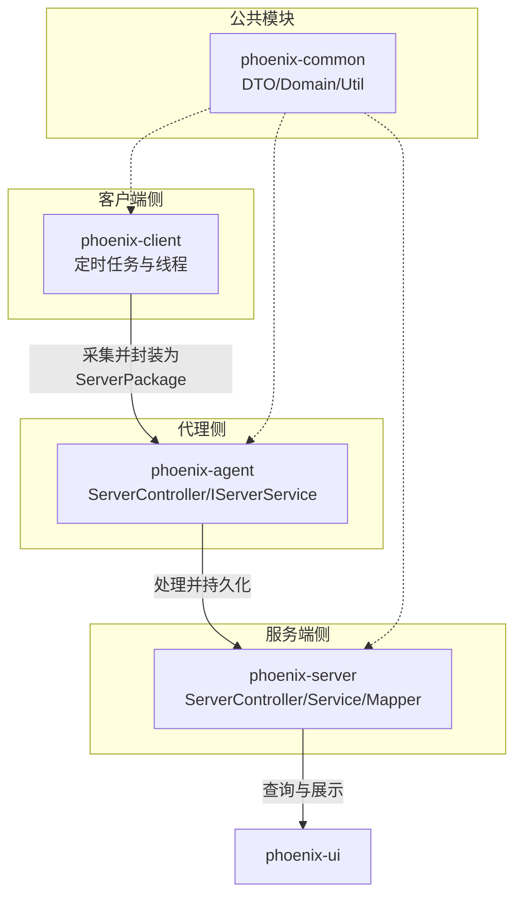
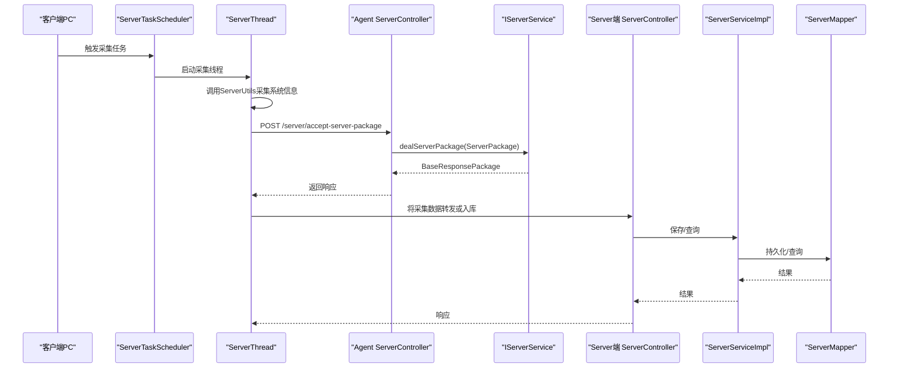
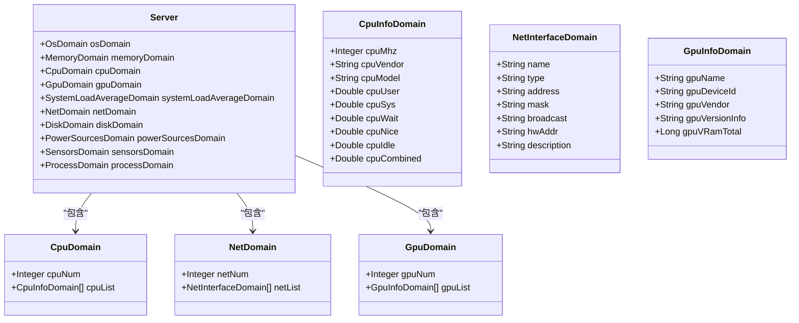
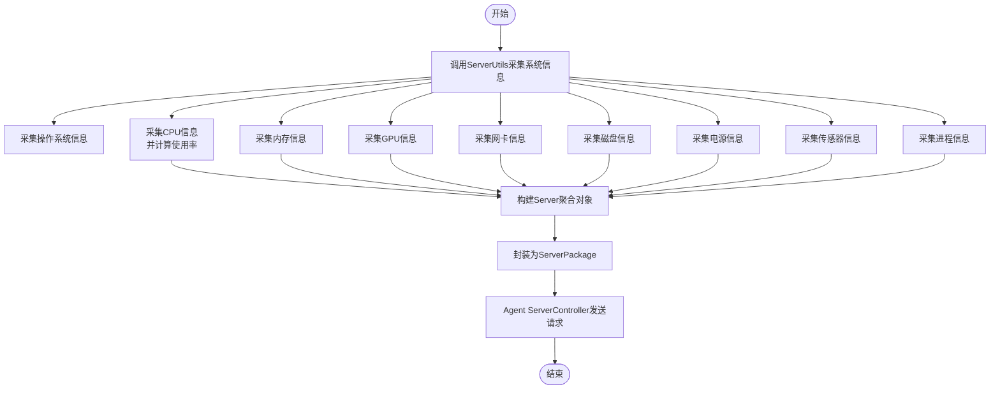
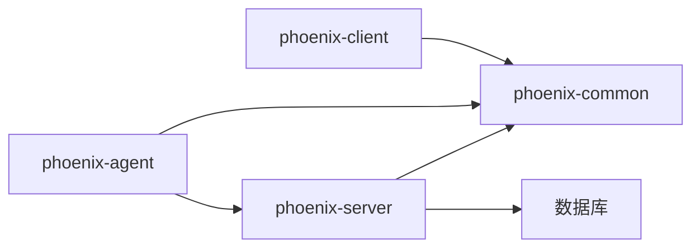

# 服务器监控业务

<cite>
**本文引用的文件**   
- [ServerController.java](file://phoenix-agent/src/main/java/com/gitee/pifeng/monitoring/agent/business/client/controller/ServerController.java)
- [IServerService.java](file://phoenix-agent/src/main/java/com/gitee/pifeng/monitoring/agent/business/client/service/IServerService.java)
- [Server.java](file://phoenix-common/src/main/java/com/gitee/pifeng/monitoring/common/domain/Server.java)
- [CpuDomain.java](file://phoenix-common/src/main/java/com/gitee/pifeng/monitoring/common/domain/server/CpuDomain.java)
- [NetDomain.java](file://phoenix-common/src/main/java/com/gitee/pifeng/monitoring/common/domain/server/NetDomain.java)
- [GpuDomain.java](file://phoenix-common/src/main/java/com/gitee/pifeng/monitoring/common/domain/server/GpuDomain.java)
- [ServerUtils.java](file://phoenix-common/src/main/java/com/gitee/pifeng/monitoring/common/util/server/ServerUtils.java)
- [ServerPackage.java](file://phoenix-common/src/main/java/com/gitee/pifeng/monitoring/common/dto/ServerPackage.java)
- [BaseResponsePackage.java](file://phoenix-common/src/main/java/com/gitee/pifeng/monitoring/common/dto/BaseResponsePackage.java)
- [CiphertextPackage.java](file://phoenix-common/src/main/java/com/gitee/pifeng/monitoring/common/dto/CiphertextPackage.java)
- [ServerTaskScheduler.java](file://phoenix-client/src/main/java/com/gitee/pifeng/monitoring/plug/scheduler/ServerTaskScheduler.java)
- [ServerThread.java](file://phoenix-client/src/main/java/com/gitee/pifeng/monitoring/plug/thread/ServerThread.java)
- [ServerService.java](file://phoenix-agent/src/main/java/com/gitee/pifeng/monitoring/agent/business/client/service/impl/ServerService.java)
- [ServerMapper.java](file://phoenix-server/src/main/java/com/gitee/pifeng/monitoring/server/business/server/mapper/ServerMapper.java)
- [ServerServiceImpl.java](file://phoenix-server/src/main/java/com/gitee/pifeng/monitoring/server/business/server/service/impl/ServerServiceImpl.java)
- [ServerController.java](file://phoenix-server/src/main/java/com/gitee/pifeng/monitoring/server/business/server/controller/ServerController.java)
- [ServerEntity.java](file://phoenix-server/src/main/java/com/gitee/pifeng/monitoring/server/business/server/entity/ServerEntity.java)
- [ServerPackage.java](file://phoenix-agent/src/main/java/com/gitee/pifeng/monitoring/agent/business/client/controller/ServerPackage.java)
</cite>

## 目录
1. [简介](#简介)
2. [项目结构](#项目结构)
3. [核心组件](#核心组件)
4. [架构总览](#架构总览)
5. [详细组件分析](#详细组件分析)
6. [依赖分析](#依赖分析)
7. [性能考虑](#性能考虑)
8. [故障排查指南](#故障排查指南)
9. [结论](#结论)
10. [附录](#附录)

## 简介
本文件面向“服务器监控业务”，围绕 Agent 客户端与 Server 服务端之间的服务器资源监控闭环进行系统化说明。重点覆盖以下方面：
- ServerController 的职责与调用链路
- 服务器监控数据模型（CpuDomain、MemoryDomain、DiskDomain、NetDomain、GpuDomain、ProcessDomain 等）的设计与用途
- 业务流程：从硬件与系统信息采集、资源使用率统计，到监控数据存储与查询的完整过程
- 关键实现示例的代码片段路径（以源码定位代替具体代码内容）
- 性能优化策略与扩展性设计建议

## 项目结构
Phoenix 采用多模块分层架构，监控相关的关键模块如下：
- phoenix-client：监控客户端插件，负责周期性采集与上报
- phoenix-agent：监控代理，接收客户端上报并处理
- phoenix-common：公共模块，包含 DTO、领域模型与工具类
- phoenix-server：监控服务端，负责数据持久化与对外展示
- phoenix-ui：前端界面，用于展示与管理

下图为概念化的模块关系与交互：

## 核心组件
本节聚焦于服务器监控的核心组件及其职责：
- Agent 侧 ServerController：接收来自客户端的服务器信息包，委派给 IServerService 处理
- IServerService：定义服务器信息包处理契约
- ServerUtils：统一采集入口，聚合 CPU、内存、磁盘、网络、GPU、进程、系统负载等信息
- Server 与各 Domain：承载采集到的服务器资源数据
- 客户端定时任务与线程：周期性触发采集与上报
- 服务端 ServerController/Service/Mapper：接收、入库与查询

章节来源
- [ServerController.java:1-55](file://phoenix-agent/src/main/java/com/gitee/pifeng/monitoring/agent/business/client/controller/ServerController.java#L1-L55)
- [IServerService.java](file://phoenix-agent/src/main/java/com/gitee/pifeng/monitoring/agent/business/client/service/IServerService.java)
- [ServerUtils.java:68-79](file://phoenix-common/src/main/java/com/gitee/pifeng/monitoring/common/util/server/ServerUtils.java#L68-L79)
- [Server.java:1-75](file://phoenix-common/src/main/java/com/gitee/pifeng/monitoring/common/domain/Server.java#L1-L75)
- [CpuDomain.java:1-88](file://phoenix-common/src/main/java/com/gitee/pifeng/monitoring/common/domain/server/CpuDomain.java#L1-L88)
- [NetDomain.java:1-65](file://phoenix-common/src/main/java/com/gitee/pifeng/monitoring/common/domain/server/NetDomain.java#L1-L65)
- [GpuDomain.java:1-68](file://phoenix-common/src/main/java/com/gitee/pifeng/monitoring/common/domain/server/GpuDomain.java#L1-L68)

## 架构总览
下图展示了从客户端采集到服务端存储与查询的完整链路，映射到实际源码文件。

图表来源
- [ServerTaskScheduler.java](file://phoenix-client/src/main/java/com/gitee/pifeng/monitoring/plug/scheduler/ServerTaskScheduler.java)
- [ServerThread.java](file://phoenix-client/src/main/java/com/gitee/pifeng/monitoring/plug/thread/ServerThread.java)
- [ServerController.java:1-55](file://phoenix-agent/src/main/java/com/gitee/pifeng/monitoring/agent/business/client/controller/ServerController.java#L1-L55)
- [IServerService.java](file://phoenix-agent/src/main/java/com/gitee/pifeng/monitoring/agent/business/client/service/IServerService.java)
- [ServerController.java](file://phoenix-server/src/main/java/com/gitee/pifeng/monitoring/server/business/server/controller/ServerController.java)
- [ServerServiceImpl.java](file://phoenix-server/src/main/java/com/gitee/pifeng/monitoring/server/business/server/service/impl/ServerServiceImpl.java)
- [ServerMapper.java](file://phoenix-server/src/main/java/com/gitee/pifeng/monitoring/server/business/server/mapper/ServerMapper.java)

## 详细组件分析

### 组件一：Agent 侧 ServerController
- 职责：接收客户端发送的服务器信息包，调用 IServerService 进行处理并返回响应
- 接口路径：POST /server/accept-server-package
- 请求体与响应体：均封装在 CiphertextPackage/ServerPackage 与 BaseResponsePackage 中

章节来源
- [ServerController.java:1-55](file://phoenix-agent/src/main/java/com/gitee/pifeng/monitoring/agent/business/client/controller/ServerController.java#L1-L55)
- [ServerPackage.java](file://phoenix-common/src/main/java/com/gitee/pifeng/monitoring/common/dto/ServerPackage.java)
- [BaseResponsePackage.java](file://phoenix-common/src/main/java/com/gitee/pifeng/monitoring/common/dto/BaseResponsePackage.java)
- [CiphertextPackage.java](file://phoenix-common/src/main/java/com/gitee/pifeng/monitoring/common/dto/CiphertextPackage.java)

### 组件二：IServerService 与处理流程
- IServerService 定义了 dealServerPackage(ServerPackage) 方法，Agent 侧 Controller 仅做委派
- 实现类 ServerService 在 Agent 侧完成数据处理与转发（例如入库或进一步处理）

章节来源
- [IServerService.java](file://phoenix-agent/src/main/java/com/gitee/pifeng/monitoring/agent/business/client/service/IServerService.java)
- [ServerService.java](file://phoenix-agent/src/main/java/com/gitee/pifeng/monitoring/agent/business/client/service/impl/ServerService.java)

### 组件三：客户端采集与上报
- 定时任务：ServerTaskScheduler 负责周期调度
- 采集线程：ServerThread 执行采集逻辑，调用 ServerUtils 统一采集系统信息
- 数据封装：ServerPackage 作为传输载体，包含完整的 Server 领域对象

章节来源
- [ServerTaskScheduler.java](file://phoenix-client/src/main/java/com/gitee/pifeng/monitoring/plug/scheduler/ServerTaskScheduler.java)
- [ServerThread.java](file://phoenix-client/src/main/java/com/gitee/pifeng/monitoring/plug/thread/ServerThread.java)
- [ServerUtils.java:68-79](file://phoenix-common/src/main/java/com/gitee/pifeng/monitoring/common/util/server/ServerUtils.java#L68-L79)
- [ServerPackage.java](file://phoenix-common/src/main/java/com/gitee/pifeng/monitoring/common/dto/ServerPackage.java)

### 组件四：服务端接收与持久化
- ServerController：接收 Agent 转发或直接上报的数据
- ServerServiceImpl：实现业务逻辑，调用 Mapper 进行持久化
- ServerMapper：MyBatis Plus 映射器，执行数据库操作
- ServerEntity：对应数据库表的实体类

章节来源
- [ServerController.java](file://phoenix-server/src/main/java/com/gitee/pifeng/monitoring/server/business/server/controller/ServerController.java)
- [ServerServiceImpl.java](file://phoenix-server/src/main/java/com/gitee/pifeng/monitoring/server/business/server/service/impl/ServerServiceImpl.java)
- [ServerMapper.java](file://phoenix-server/src/main/java/com/gitee/pifeng/monitoring/server/business/server/mapper/ServerMapper.java)
- [ServerEntity.java](file://phoenix-server/src/main/java/com/gitee/pifeng/monitoring/server/business/server/entity/ServerEntity.java)

### 组件五：服务器监控数据模型
- Server：顶层聚合根，包含操作系统、内存、CPU、GPU、系统负载、网卡、磁盘、电源、传感器、进程等子域
- CpuDomain：CPU 数量与每核指标（频率、卖主、型号、用户/系统/等待/错误/空闲/综合使用率）
- NetDomain：网卡数量与网卡列表，每项包含名称、类型、地址、掩码、广播、MAC、描述等
- GpuDomain：GPU 数量与 GPU 列表，每项包含名称、设备 ID、供应商、版本信息、显存总量等
- 其他子域：MemoryDomain、DiskDomain、SystemLoadAverageDomain、PowerSourcesDomain、SensorsDomain、ProcessDomain 等由 ServerUtils 统一采集并装配

图表来源
- [Server.java:1-75](file://phoenix-common/src/main/java/com/gitee/pifeng/monitoring/common/domain/Server.java#L1-L75)
- [CpuDomain.java:1-88](file://phoenix-common/src/main/java/com/gitee/pifeng/monitoring/common/domain/server/CpuDomain.java#L1-L88)
- [NetDomain.java:1-65](file://phoenix-common/src/main/java/com/gitee/pifeng/monitoring/common/domain/server/NetDomain.java#L1-L65)
- [GpuDomain.java:1-68](file://phoenix-common/src/main/java/com/gitee/pifeng/monitoring/common/domain/server/GpuDomain.java#L1-L68)

章节来源
- [Server.java:1-75](file://phoenix-common/src/main/java/com/gitee/pifeng/monitoring/common/domain/Server.java#L1-L75)
- [CpuDomain.java:1-88](file://phoenix-common/src/main/java/com/gitee/pifeng/monitoring/common/domain/server/CpuDomain.java#L1-L88)
- [NetDomain.java:1-65](file://phoenix-common/src/main/java/com/gitee/pifeng/monitoring/common/domain/server/NetDomain.java#L1-L65)
- [GpuDomain.java:1-68](file://phoenix-common/src/main/java/com/gitee/pifeng/monitoring/common/domain/server/GpuDomain.java#L1-L68)

### 组件六：采集与使用率计算流程
- 采集入口：ServerUtils 调用各子域工具类（OS、内存、磁盘、网络、GPU、进程、系统负载、传感器、电源）统一采集
- 使用率计算：CPU 用户/系统/等待/错误/空闲/综合使用率等字段由底层工具计算后填充
- 数据封装：ServerPackage 包含 Server 聚合对象，通过 Agent ServerController 发送至服务端

图表来源
- [ServerUtils.java:68-79](file://phoenix-common/src/main/java/com/gitee/pifeng/monitoring/common/util/server/ServerUtils.java#L68-L79)
- [ServerPackage.java](file://phoenix-common/src/main/java/com/gitee/pifeng/monitoring/common/dto/ServerPackage.java)

章节来源
- [ServerUtils.java:68-79](file://phoenix-common/src/main/java/com/gitee/pifeng/monitoring/common/util/server/ServerUtils.java#L68-L79)

### 组件七：服务端存储与查询
- 接收：ServerController 接收 Agent 转发或直接上报的数据
- 保存：ServerServiceImpl 调用 Mapper 持久化 ServerEntity
- 查询：Mapper 提供查询接口，支持按条件检索与分页

章节来源
- [ServerController.java](file://phoenix-server/src/main/java/com/gitee/pifeng/monitoring/server/business/server/controller/ServerController.java)
- [ServerServiceImpl.java](file://phoenix-server/src/main/java/com/gitee/pifeng/monitoring/server/business/server/service/impl/ServerServiceImpl.java)
- [ServerMapper.java](file://phoenix-server/src/main/java/com/gitee/pifeng/monitoring/server/business/server/mapper/ServerMapper.java)
- [ServerEntity.java](file://phoenix-server/src/main/java/com/gitee/pifeng/monitoring/server/business/server/entity/ServerEntity.java)

## 依赖分析
- 客户端侧依赖公共模块的 DTO 与 Domain，以及定时任务与线程组件
- Agent 侧依赖公共模块的 DTO/Domain/Util，同时通过 IServerService 与服务端解耦
- 服务端侧依赖 Mapper 与 Entity，提供对外接口与业务实现

图表来源
- [ServerTaskScheduler.java](file://phoenix-client/src/main/java/com/gitee/pifeng/monitoring/plug/scheduler/ServerTaskScheduler.java)
- [ServerThread.java](file://phoenix-client/src/main/java/com/gitee/pifeng/monitoring/plug/thread/ServerThread.java)
- [ServerController.java:1-55](file://phoenix-agent/src/main/java/com/gitee/pifeng/monitoring/agent/business/client/controller/ServerController.java#L1-L55)
- [ServerController.java](file://phoenix-server/src/main/java/com/gitee/pifeng/monitoring/server/business/server/controller/ServerController.java)
- [ServerMapper.java](file://phoenix-server/src/main/java/com/gitee/pifeng/monitoring/server/business/server/mapper/ServerMapper.java)

## 性能考虑
- 采集频率控制：通过定时任务配置合理设置采集间隔，避免频繁系统调用造成抖动
- 资源使用率计算：优先使用增量式指标（如累计值差分）减少一次性全量扫描成本
- 线程池与并发：客户端与服务端均应使用受控线程池，避免高并发下的资源争用
- 序列化与网络开销：对传输包体进行必要裁剪，减少不必要的字段序列化
- 缓存与热点数据：对高频查询结果进行缓存，降低数据库压力
- 异步化：将非阻塞的落库与通知逻辑异步化，提升整体吞吐

## 故障排查指南
- 采集失败：检查客户端定时任务是否正常启动、ServerThread 是否成功调用 ServerUtils
- 传输异常：确认 Agent ServerController 的接口路径与参数正确，查看 IServerService 的处理逻辑
- 存储异常：检查服务端 ServerServiceImpl 的持久化流程与 Mapper 映射，关注数据库连接与事务配置
- 数据不一致：核对 CPU/内存/磁盘等使用率计算逻辑，确保时间窗口与采样点位一致

章节来源
- [ServerTaskScheduler.java](file://phoenix-client/src/main/java/com/gitee/pifeng/monitoring/plug/scheduler/ServerTaskScheduler.java)
- [ServerThread.java](file://phoenix-client/src/main/java/com/gitee/pifeng/monitoring/plug/thread/ServerThread.java)
- [ServerController.java:1-55](file://phoenix-agent/src/main/java/com/gitee/pifeng/monitoring/agent/business/client/controller/ServerController.java#L1-L55)
- [ServerController.java](file://phoenix-server/src/main/java/com/gitee/pifeng/monitoring/server/business/server/controller/ServerController.java)
- [ServerServiceImpl.java](file://phoenix-server/src/main/java/com/gitee/pifeng/monitoring/server/business/server/service/impl/ServerServiceImpl.java)
- [ServerMapper.java](file://phoenix-server/src/main/java/com/gitee/pifeng/monitoring/server/business/server/mapper/ServerMapper.java)

## 结论
本方案通过“客户端采集—代理处理—服务端存储—前端展示”的闭环，实现了对服务器 CPU、内存、磁盘、网络、GPU、进程等核心资源的持续监控。借助统一的数据模型与可扩展的采集工具链，系统具备良好的可维护性与扩展性；结合性能优化策略，可在保证实时性的前提下提升整体吞吐与稳定性。

## 附录
- 关键实现示例的代码片段路径（以源码定位代替具体代码内容）
  - 客户端采集入口与封装：[ServerUtils.java:68-79](file://phoenix-common/src/main/java/com/gitee/pifeng/monitoring/common/util/server/ServerUtils.java#L68-L79)，[ServerPackage.java](file://phoenix-common/src/main/java/com/gitee/pifeng/monitoring/common/dto/ServerPackage.java)
  - Agent 接收与处理：[ServerController.java:1-55](file://phoenix-agent/src/main/java/com/gitee/pifeng/monitoring/agent/business/client/controller/ServerController.java#L1-L55)，[IServerService.java](file://phoenix-agent/src/main/java/com/gitee/pifeng/monitoring/agent/business/client/service/IServerService.java)
  - 服务端存储与查询：[ServerController.java](file://phoenix-server/src/main/java/com/gitee/pifeng/monitoring/server/business/server/controller/ServerController.java)，[ServerServiceImpl.java](file://phoenix-server/src/main/java/com/gitee/pifeng/monitoring/server/business/server/service/impl/ServerServiceImpl.java)，[ServerMapper.java](file://phoenix-server/src/main/java/com/gitee/pifeng/monitoring/server/business/server/mapper/ServerMapper.java)
  - 数据模型定义：[Server.java:1-75](file://phoenix-common/src/main/java/com/gitee/pifeng/monitoring/common/domain/Server.java#L1-L75)，[CpuDomain.java:1-88](file://phoenix-common/src/main/java/com/gitee/pifeng/monitoring/common/domain/server/CpuDomain.java#L1-L88)，[NetDomain.java:1-65](file://phoenix-common/src/main/java/com/gitee/pifeng/monitoring/common/domain/server/NetDomain.java#L1-L65)，[GpuDomain.java:1-68](file://phoenix-common/src/main/java/com/gitee/pifeng/monitoring/common/domain/server/GpuDomain.java#L1-L68)