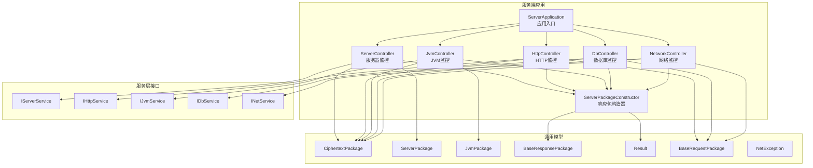
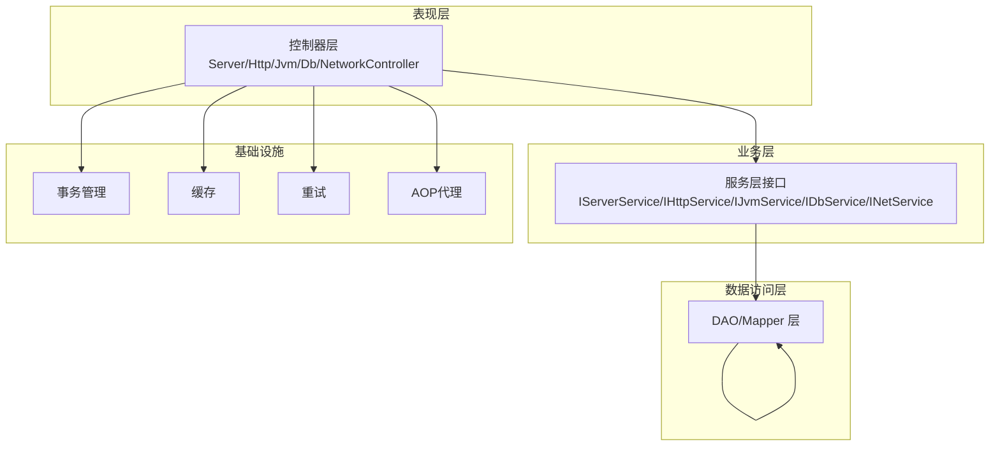
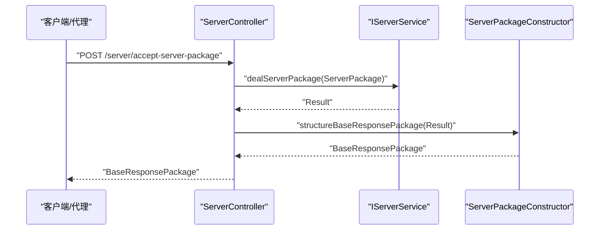
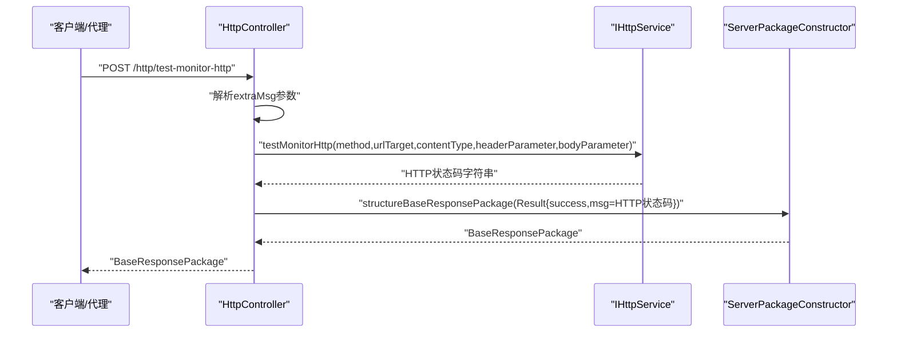
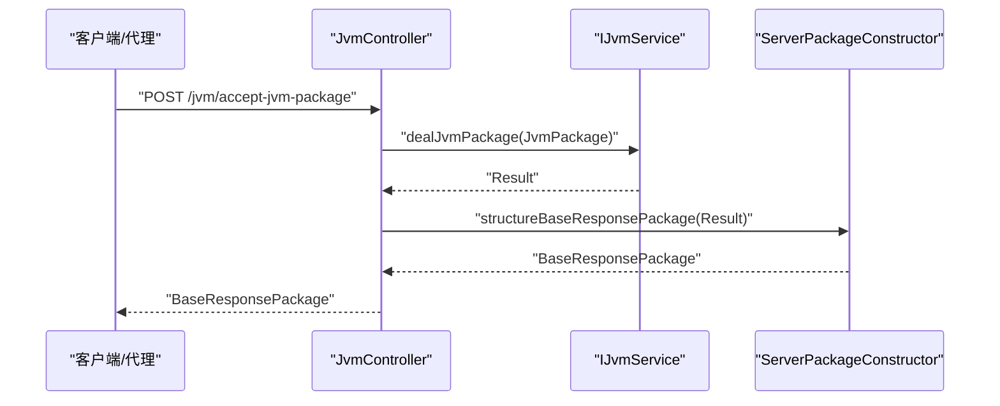
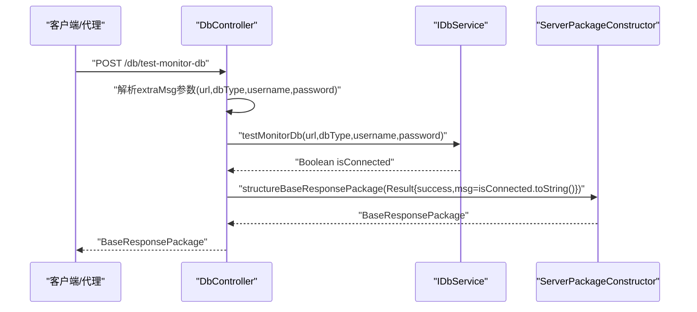
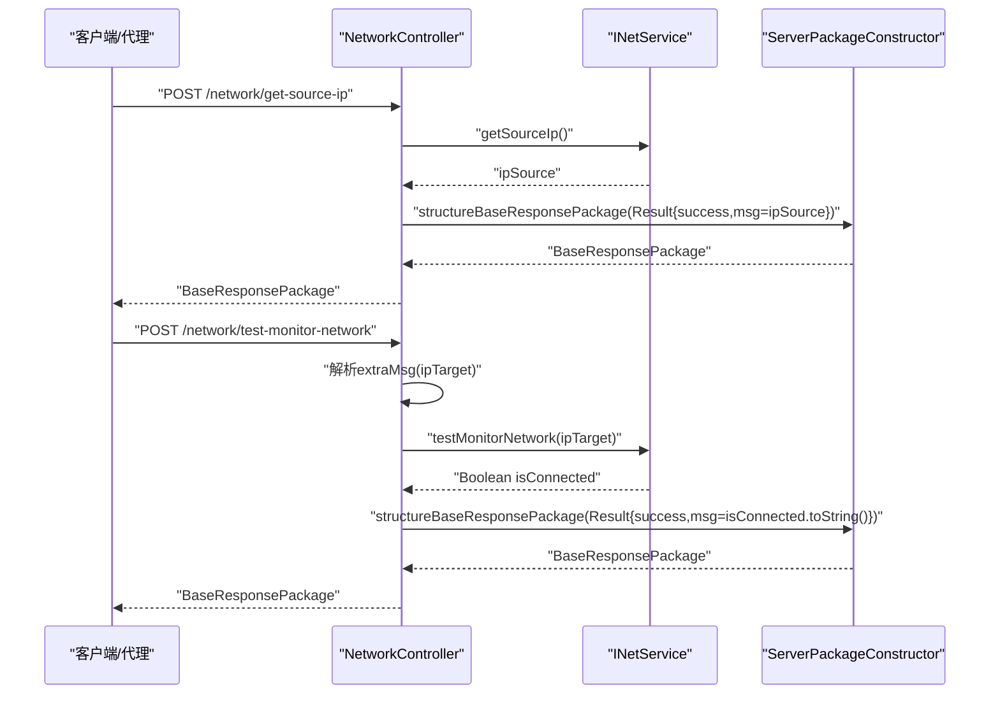
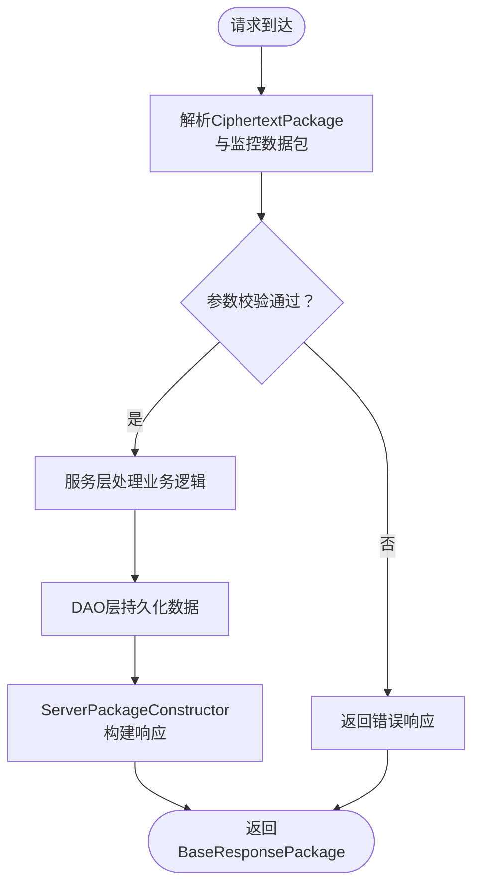
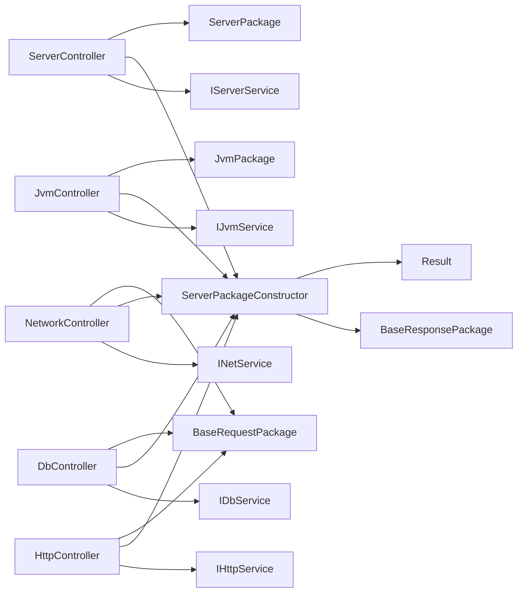

# 核心业务逻辑

<cite>
**本文引用的文件**
- [ServerApplication.java](file://phoenix-server/src/main/java/com/gitee/pifeng/monitoring/server/ServerApplication.java)
- [ServerController.java](file://phoenix-server/src/main/java/com/gitee/pifeng/monitoring/server/business/server/controller/ServerController.java)
- [HttpController.java](file://phoenix-server/src/main/java/com/gitee/pifeng/monitoring/server/business/server/controller/HttpController.java)
- [JvmController.java](file://phoenix-server/src/main/java/com/gitee/pifeng/monitoring/server/business/server/controller/JvmController.java)
- [DbController.java](file://phoenix-server/src/main/java/com/gitee/pifeng/monitoring/server/business/server/controller/DbController.java)
- [NetworkController.java](file://phoenix-server/src/main/java/com/gitee/pifeng/monitoring/server/business/server/controller/NetworkController.java)
- [ServerPackageConstructor.java](file://phoenix-server/src/main/java/com/gitee/pifeng/monitoring/server/business/server/core/ServerPackageConstructor.java)
- [IServerService.java](file://phoenix-server/src/main/java/com/gitee/pifeng/monitoring/server/business/server/service/IServerService.java)
- [IHttpService.java](file://phoenix-server/src/main/java/com/gitee/pifeng/monitoring/server/business/server/service/IHttpService.java)
- [IJvmService.java](file://phoenix-server/src/main/java/com/gitee/pifeng/monitoring/server/business/server/service/IJvmService.java)
- [IDbService.java](file://phoenix-server/src/main/java/com/gitee/pifeng/monitoring/server/business/server/service/IDbService.java)
- [INetService.java](file://phoenix-server/src/main/java/com/gitee/pifeng/monitoring/server/business/server/service/INetService.java)
- [Result.java](file://phoenix-common/src/main/java/com/gitee/pifeng/monitoring/common/domain/Result.java)
- [BaseResponsePackage.java](file://phoenix-common/src/main/java/com/gitee/pifeng/monitoring/common/dto/BaseResponsePackage.java)
- [CiphertextPackage.java](file://phoenix-common/src/main/java/com/gitee/pifeng/monitoring/common/dto/CiphertextPackage.java)
- [ServerPackage.java](file://phoenix-common/src/main/java/com/gitee/pifeng/monitoring/common/dto/ServerPackage.java)
- [JvmPackage.java](file://phoenix-common/src/main/java/com/gitee/pifeng/monitoring/common/dto/JvmPackage.java)
- [BaseRequestPackage.java](file://phoenix-common/src/main/java/com/gitee/pifeng/monitoring/common/dto/BaseRequestPackage.java)
- [NetException.java](file://phoenix-common/src/main/java/com/gitee/pifeng/monitoring/common/exception/NetException.java)
</cite>

## 目录
1. [引言](#引言)
2. [项目结构](#项目结构)
3. [核心组件](#核心组件)
4. [架构总览](#架构总览)
5. [详细组件分析](#详细组件分析)
6. [依赖分析](#依赖分析)
7. [性能考虑](#性能考虑)
8. [故障排查指南](#故障排查指南)
9. [结论](#结论)
10. [附录](#附录)

## 引言
本文件聚焦于服务端核心业务逻辑，围绕控制器层展开，系统性阐述数据库监控、服务器监控、HTTP监控、JVM监控、网络监控等核心功能模块的业务实现与处理流程。文档覆盖控制器职责、数据接收/验证/处理/响应的完整链路，解释控制器-服务-DAO三层架构、异常处理机制与事务管理策略，并给出监控数据从原始数据接收到最终存储的处理路径与扩展建议。

## 项目结构
服务端采用Spring Boot应用入口，通过统一的控制器对外暴露REST接口，接收来自监控代理或客户端的加密数据包，经服务层处理后返回标准响应包。核心结构如下：
- 应用入口：ServerApplication 启动并启用缓存、事务、重试与AOP代理
- 控制器层：按监控类型划分控制器，负责请求接收、参数解析、调用服务层、构造响应
- 服务层：IServerService、IHttpService、IJvmService、IDbService、INetService 接口定义业务能力
- 包构造器：ServerPackageConstructor 统一构造响应包
- 通用DTO/Domain：CiphertextPackage、ServerPackage、JvmPackage、BaseRequestPackage、BaseResponsePackage、Result 提供数据载体与结果封装

图表来源
- [ServerApplication.java:36-45](file://phoenix-server/src/main/java/com/gitee/pifeng/monitoring/server/ServerApplication.java#L36-L45)
- [ServerController.java:35-76](file://phoenix-server/src/main/java/com/gitee/pifeng/monitoring/server/business/server/controller/ServerController.java#L35-L76)
- [HttpController.java:37-85](file://phoenix-server/src/main/java/com/gitee/pifeng/monitoring/server/business/server/controller/HttpController.java#L37-L85)
- [JvmController.java:35-76](file://phoenix-server/src/main/java/com/gitee/pifeng/monitoring/server/business/server/controller/JvmController.java#L35-L76)
- [DbController.java:37-84](file://phoenix-server/src/main/java/com/gitee/pifeng/monitoring/server/business/server/controller/DbController.java#L37-L84)
- [NetworkController.java:37-108](file://phoenix-server/src/main/java/com/gitee/pifeng/monitoring/server/business/server/controller/NetworkController.java#L37-L108)
- [ServerPackageConstructor.java](file://phoenix-server/src/main/java/com/gitee/pifeng/monitoring/server/business/server/core/ServerPackageConstructor.java)
- [IServerService.java](file://phoenix-server/src/main/java/com/gitee/pifeng/monitoring/server/business/server/service/IServerService.java)
- [IHttpService.java](file://phoenix-server/src/main/java/com/gitee/pifeng/monitoring/server/business/server/service/IHttpService.java)
- [IJvmService.java](file://phoenix-server/src/main/java/com/gitee/pifeng/monitoring/server/business/server/service/IJvmService.java)
- [IDbService.java](file://phoenix-server/src/main/java/com/gitee/pifeng/monitoring/server/business/server/service/IDbService.java)
- [INetService.java](file://phoenix-server/src/main/java/com/gitee/pifeng/monitoring/server/business/server/service/INetService.java)
- [CiphertextPackage.java](file://phoenix-common/src/main/java/com/gitee/pifeng/monitoring/common/dto/CiphertextPackage.java)
- [ServerPackage.java](file://phoenix-common/src/main/java/com/gitee/pifeng/monitoring/common/dto/ServerPackage.java)
- [JvmPackage.java](file://phoenix-common/src/main/java/com/gitee/pifeng/monitoring/common/dto/JvmPackage.java)
- [BaseRequestPackage.java](file://phoenix-common/src/main/java/com/gitee/pifeng/monitoring/common/dto/BaseRequestPackage.java)
- [BaseResponsePackage.java](file://phoenix-common/src/main/java/com/gitee/pifeng/monitoring/common/dto/BaseResponsePackage.java)
- [Result.java](file://phoenix-common/src/main/java/com/gitee/pifeng/monitoring/common/domain/Result.java)
- [NetException.java](file://phoenix-common/src/main/java/com/gitee/pifeng/monitoring/common/exception/NetException.java)

章节来源
- [ServerApplication.java:36-45](file://phoenix-server/src/main/java/com/gitee/pifeng/monitoring/server/ServerApplication.java#L36-L45)

## 核心组件
- 控制器层：各监控类型的控制器负责接收加密数据包，解析必要参数，调用对应服务层接口，使用ServerPackageConstructor构造统一响应包返回
- 服务层接口：IServerService、IHttpService、IJvmService、IDbService、INetService 定义具体业务处理契约
- 响应包构造器：ServerPackageConstructor 将服务层返回的Result统一封装为BaseResponsePackage
- 通用模型：CiphertextPackage、ServerPackage、JvmPackage、BaseRequestPackage、BaseResponsePackage、Result 提供跨模块的数据传输与结果封装

章节来源
- [ServerController.java:35-76](file://phoenix-server/src/main/java/com/gitee/pifeng/monitoring/server/business/server/controller/ServerController.java#L35-L76)
- [HttpController.java:37-85](file://phoenix-server/src/main/java/com/gitee/pifeng/monitoring/server/business/server/controller/HttpController.java#L37-L85)
- [JvmController.java:35-76](file://phoenix-server/src/main/java/com/gitee/pifeng/monitoring/server/business/server/controller/JvmController.java#L35-L76)
- [DbController.java:37-84](file://phoenix-server/src/main/java/com/gitee/pifeng/monitoring/server/business/server/controller/DbController.java#L37-L84)
- [NetworkController.java:37-108](file://phoenix-server/src/main/java/com/gitee/pifeng/monitoring/server/business/server/controller/NetworkController.java#L37-L108)
- [ServerPackageConstructor.java](file://phoenix-server/src/main/java/com/gitee/pifeng/monitoring/server/business/server/core/ServerPackageConstructor.java)
- [IServerService.java](file://phoenix-server/src/main/java/com/gitee/pifeng/monitoring/server/business/server/service/IServerService.java)
- [IHttpService.java](file://phoenix-server/src/main/java/com/gitee/pifeng/monitoring/server/business/server/service/IHttpService.java)
- [IJvmService.java](file://phoenix-server/src/main/java/com/gitee/pifeng/monitoring/server/business/server/service/IJvmService.java)
- [IDbService.java](file://phoenix-server/src/main/java/com/gitee/pifeng/monitoring/server/business/server/service/IDbService.java)
- [INetService.java](file://phoenix-server/src/main/java/com/gitee/pifeng/monitoring/server/business/server/service/INetService.java)
- [CiphertextPackage.java](file://phoenix-common/src/main/java/com/gitee/pifeng/monitoring/common/dto/CiphertextPackage.java)
- [ServerPackage.java](file://phoenix-common/src/main/java/com/gitee/pifeng/monitoring/common/dto/ServerPackage.java)
- [JvmPackage.java](file://phoenix-common/src/main/java/com/gitee/pifeng/monitoring/common/dto/JvmPackage.java)
- [BaseRequestPackage.java](file://phoenix-common/src/main/java/com/gitee/pifeng/monitoring/common/dto/BaseRequestPackage.java)
- [BaseResponsePackage.java](file://phoenix-common/src/main/java/com/gitee/pifeng/monitoring/common/dto/BaseResponsePackage.java)
- [Result.java](file://phoenix-common/src/main/java/com/gitee/pifeng/monitoring/common/domain/Result.java)
- [NetException.java](file://phoenix-common/src/main/java/com/gitee/pifeng/monitoring/common/exception/NetException.java)

## 架构总览
服务端采用“控制器-服务-DAO”分层架构，控制器仅负责请求接入与响应封装，业务逻辑下沉至服务层，持久化由DAO层承担。事务管理通过@EnableTransactionManagement开启，缓存与重试分别用于提升查询性能与增强可靠性。

图表来源
- [ServerApplication.java:30-36](file://phoenix-server/src/main/java/com/gitee/pifeng/monitoring/server/ServerApplication.java#L30-L36)
- [ServerController.java:35-76](file://phoenix-server/src/main/java/com/gitee/pifeng/monitoring/server/business/server/controller/ServerController.java#L35-L76)
- [HttpController.java:37-85](file://phoenix-server/src/main/java/com/gitee/pifeng/monitoring/server/business/server/controller/HttpController.java#L37-L85)
- [JvmController.java:35-76](file://phoenix-server/src/main/java/com/gitee/pifeng/monitoring/server/business/server/controller/JvmController.java#L35-L76)
- [DbController.java:37-84](file://phoenix-server/src/main/java/com/gitee/pifeng/monitoring/server/business/server/controller/DbController.java#L37-L84)
- [NetworkController.java:37-108](file://phoenix-server/src/main/java/com/gitee/pifeng/monitoring/server/business/server/controller/NetworkController.java#L37-L108)

## 详细组件分析

### 服务器监控控制器（ServerController）
- 职责范围
  - 接收服务器监控数据包（ServerPackage）
  - 调用IServerService.dealServerPackage进行业务处理
  - 使用ServerPackageConstructor构造BaseResponsePackage统一响应
  - 记录处理耗时并进行告警
- 处理流程
  - 请求进入：@PostMapping "/accept-server-package"
  - 参数校验：基于CiphertextPackage与ServerPackage的约定
  - 业务处理：IServerService.dealServerPackage
  - 响应构造：ServerPackageConstructor.structureBaseResponsePackage
  - 性能监控：超过1秒记录warn日志
- 关键接口路径
  - [ServerController.acceptServerPackage:63-74](file://phoenix-server/src/main/java/com/gitee/pifeng/monitoring/server/business/server/controller/ServerController.java#L63-L74)
  - [IServerService.dealServerPackage](file://phoenix-server/src/main/java/com/gitee/pifeng/monitoring/server/business/server/service/IServerService.java)
  - [ServerPackageConstructor.structureBaseResponsePackage](file://phoenix-server/src/main/java/com/gitee/pifeng/monitoring/server/business/server/core/ServerPackageConstructor.java)
  - [ServerPackage](file://phoenix-common/src/main/java/com/gitee/pifeng/monitoring/common/dto/ServerPackage.java)
  - [CiphertextPackage](file://phoenix-common/src/main/java/com/gitee/pifeng/monitoring/common/dto/CiphertextPackage.java)
  - [BaseResponsePackage](file://phoenix-common/src/main/java/com/gitee/pifeng/monitoring/common/dto/BaseResponsePackage.java)
  - [Result](file://phoenix-common/src/main/java/com/gitee/pifeng/monitoring/common/domain/Result.java)

图表来源
- [ServerController.java:63-74](file://phoenix-server/src/main/java/com/gitee/pifeng/monitoring/server/business/server/controller/ServerController.java#L63-L74)
- [IServerService.java](file://phoenix-server/src/main/java/com/gitee/pifeng/monitoring/server/business/server/service/IServerService.java)
- [ServerPackageConstructor.java](file://phoenix-server/src/main/java/com/gitee/pifeng/monitoring/server/business/server/core/ServerPackageConstructor.java)
- [ServerPackage.java](file://phoenix-common/src/main/java/com/gitee/pifeng/monitoring/common/dto/ServerPackage.java)
- [BaseResponsePackage.java](file://phoenix-common/src/main/java/com/gitee/pifeng/monitoring/common/dto/BaseResponsePackage.java)
- [Result.java](file://phoenix-common/src/main/java/com/gitee/pifeng/monitoring/common/domain/Result.java)

章节来源
- [ServerController.java:35-76](file://phoenix-server/src/main/java/com/gitee/pifeng/monitoring/server/business/server/controller/ServerController.java#L35-L76)
- [ServerPackage.java](file://phoenix-common/src/main/java/com/gitee/pifeng/monitoring/common/dto/ServerPackage.java)
- [CiphertextPackage.java](file://phoenix-common/src/main/java/com/gitee/pifeng/monitoring/common/dto/CiphertextPackage.java)
- [BaseResponsePackage.java](file://phoenix-common/src/main/java/com/gitee/pifeng/monitoring/common/dto/BaseResponsePackage.java)
- [Result.java](file://phoenix-common/src/main/java/com/gitee/pifeng/monitoring/common/domain/Result.java)

### HTTP监控控制器（HttpController）
- 职责范围
  - 接收基础请求包（BaseRequestPackage），提取额外参数（method、urlTarget、contentType、headerParameter、bodyParameter）
  - 调用IHttpService.testMonitorHttp执行HTTP连通性测试
  - 返回包含HTTP状态码的结果
- 处理流程
  - 请求进入：@PostMapping "/test-monitor-http"
  - 参数解析：从extraMsg中读取目标URL与请求参数
  - 业务处理：IHttpService.testMonitorHttp
  - 响应构造：ServerPackageConstructor.structureBaseResponsePackage(Result.success(msg=HTTP状态码))
  - 性能监控：超过1秒记录warn日志
- 关键接口路径
  - [HttpController.testMonitorHttp:66-83](file://phoenix-server/src/main/java/com/gitee/pifeng/monitoring/server/business/server/controller/HttpController.java#L66-L83)
  - [IHttpService.testMonitorHttp](file://phoenix-server/src/main/java/com/gitee/pifeng/monitoring/server/business/server/service/IHttpService.java)
  - [BaseRequestPackage](file://phoenix-common/src/main/java/com/gitee/pifeng/monitoring/common/dto/BaseRequestPackage.java)
  - [NetException](file://phoenix-common/src/main/java/com/gitee/pifeng/monitoring/common/exception/NetException.java)

图表来源
- [HttpController.java:66-83](file://phoenix-server/src/main/java/com/gitee/pifeng/monitoring/server/business/server/controller/HttpController.java#L66-L83)
- [IHttpService.java](file://phoenix-server/src/main/java/com/gitee/pifeng/monitoring/server/business/server/service/IHttpService.java)
- [BaseRequestPackage.java](file://phoenix-common/src/main/java/com/gitee/pifeng/monitoring/common/dto/BaseRequestPackage.java)
- [ServerPackageConstructor.java](file://phoenix-server/src/main/java/com/gitee/pifeng/monitoring/server/business/server/core/ServerPackageConstructor.java)
- [BaseResponsePackage.java](file://phoenix-common/src/main/java/com/gitee/pifeng/monitoring/common/dto/BaseResponsePackage.java)
- [Result.java](file://phoenix-common/src/main/java/com/gitee/pifeng/monitoring/common/domain/Result.java)

章节来源
- [HttpController.java:37-85](file://phoenix-server/src/main/java/com/gitee/pifeng/monitoring/server/business/server/controller/HttpController.java#L37-L85)
- [BaseRequestPackage.java](file://phoenix-common/src/main/java/com/gitee/pifeng/monitoring/common/dto/BaseRequestPackage.java)
- [NetException.java](file://phoenix-common/src/main/java/com/gitee/pifeng/monitoring/common/exception/NetException.java)

### JVM监控控制器（JvmController）
- 职责范围
  - 接收JVM监控数据包（JvmPackage）
  - 调用IJvmService.dealJvmPackage进行业务处理
  - 使用ServerPackageConstructor构造统一响应
  - 记录处理耗时并进行告警
- 处理流程
  - 请求进入：@PostMapping "/accept-jvm-package"
  - 参数校验：基于CiphertextPackage与JvmPackage的约定
  - 业务处理：IJvmService.dealJvmPackage
  - 响应构造：ServerPackageConstructor.structureBaseResponsePackage
  - 性能监控：超过1秒记录warn日志
- 关键接口路径
  - [JvmController.acceptJvmPackage:63-74](file://phoenix-server/src/main/java/com/gitee/pifeng/monitoring/server/business/server/controller/JvmController.java#L63-L74)
  - [IJvmService.dealJvmPackage](file://phoenix-server/src/main/java/com/gitee/pifeng/monitoring/server/business/server/service/IJvmService.java)
  - [JvmPackage](file://phoenix-common/src/main/java/com/gitee/pifeng/monitoring/common/dto/JvmPackage.java)

图表来源
- [JvmController.java:63-74](file://phoenix-server/src/main/java/com/gitee/pifeng/monitoring/server/business/server/controller/JvmController.java#L63-L74)
- [IJvmService.java](file://phoenix-server/src/main/java/com/gitee/pifeng/monitoring/server/business/server/service/IJvmService.java)
- [JvmPackage.java](file://phoenix-common/src/main/java/com/gitee/pifeng/monitoring/common/dto/JvmPackage.java)
- [ServerPackageConstructor.java](file://phoenix-server/src/main/java/com/gitee/pifeng/monitoring/server/business/server/core/ServerPackageConstructor.java)
- [BaseResponsePackage.java](file://phoenix-common/src/main/java/com/gitee/pifeng/monitoring/common/dto/BaseResponsePackage.java)
- [Result.java](file://phoenix-common/src/main/java/com/gitee/pifeng/monitoring/common/domain/Result.java)

章节来源
- [JvmController.java:35-76](file://phoenix-server/src/main/java/com/gitee/pifeng/monitoring/server/business/server/controller/JvmController.java#L35-L76)
- [JvmPackage.java](file://phoenix-common/src/main/java/com/gitee/pifeng/monitoring/common/dto/JvmPackage.java)

### 数据库监控控制器（DbController）
- 职责范围
  - 接收基础请求包（BaseRequestPackage），提取数据库连接参数（url、dbType、username、password）
  - 调用IDbService.testMonitorDb执行数据库连通性测试
  - 返回布尔结果表示是否连通
- 处理流程
  - 请求进入：@PostMapping "/test-monitor-db"
  - 参数解析：从extraMsg中读取数据库连接信息
  - 业务处理：IDbService.testMonitorDb
  - 响应构造：ServerPackageConstructor.structureBaseResponsePackage(Result.success(msg=String.valueOf(isConnected)))
  - 性能监控：超过1秒记录warn日志
- 关键接口路径
  - [DbController.testMonitorDb:66-82](file://phoenix-server/src/main/java/com/gitee/pifeng/monitoring/server/business/server/controller/DbController.java#L66-L82)
  - [IDbService.testMonitorDb](file://phoenix-server/src/main/java/com/gitee/pifeng/monitoring/server/business/server/service/IDbService.java)
  - [BaseRequestPackage](file://phoenix-common/src/main/java/com/gitee/pifeng/monitoring/common/dto/BaseRequestPackage.java)
  - [NetException](file://phoenix-common/src/main/java/com/gitee/pifeng/monitoring/common/exception/NetException.java)

图表来源
- [DbController.java:66-82](file://phoenix-server/src/main/java/com/gitee/pifeng/monitoring/server/business/server/controller/DbController.java#L66-L82)
- [IDbService.java](file://phoenix-server/src/main/java/com/gitee/pifeng/monitoring/server/business/server/service/IDbService.java)
- [BaseRequestPackage.java](file://phoenix-common/src/main/java/com/gitee/pifeng/monitoring/common/dto/BaseRequestPackage.java)
- [ServerPackageConstructor.java](file://phoenix-server/src/main/java/com/gitee/pifeng/monitoring/server/business/server/core/ServerPackageConstructor.java)
- [BaseResponsePackage.java](file://phoenix-common/src/main/java/com/gitee/pifeng/monitoring/common/dto/BaseResponsePackage.java)
- [Result.java](file://phoenix-common/src/main/java/com/gitee/pifeng/monitoring/common/domain/Result.java)

章节来源
- [DbController.java:37-84](file://phoenix-server/src/main/java/com/gitee/pifeng/monitoring/server/business/server/controller/DbController.java#L37-L84)
- [BaseRequestPackage.java](file://phoenix-common/src/main/java/com/gitee/pifeng/monitoring/common/dto/BaseRequestPackage.java)
- [NetException.java](file://phoenix-common/src/main/java/com/gitee/pifeng/monitoring/common/exception/NetException.java)

### 网络监控控制器（NetworkController）
- 职责范围
  - 提供“获取被监控网络源IP地址”与“测试网络连通性”两个接口
  - 解析目标IP（ipTarget）并调用INetService执行测试
- 处理流程
  - 获取源IP：@PostMapping "/get-source-ip"
    - 调用INetService.getSourceIp
    - 响应构造：ServerPackageConstructor.structureBaseResponsePackage(Result.success(msg=ipSource))
  - 测试连通性：@PostMapping "/test-monitor-network"
    - 从extraMsg读取ipTarget
    - 调用INetService.testMonitorNetwork(ipTarget)
    - 响应构造：ServerPackageConstructor.structureBaseResponsePackage(Result.success(msg=String.valueOf(isConnected)))
  - 性能监控：超过1秒记录warn日志
- 关键接口路径
  - [NetworkController.getSourceIp:65-76](file://phoenix-server/src/main/java/com/gitee/pifeng/monitoring/server/business/server/controller/NetworkController.java#L65-L76)
  - [NetworkController.testMonitorNetwork:93-106](file://phoenix-server/src/main/java/com/gitee/pifeng/monitoring/server/business/server/controller/NetworkController.java#L93-L106)
  - [INetService.getSourceIp](file://phoenix-server/src/main/java/com/gitee/pifeng/monitoring/server/business/server/service/INetService.java)
  - [INetService.testMonitorNetwork](file://phoenix-server/src/main/java/com/gitee/pifeng/monitoring/server/business/server/service/INetService.java)
  - [NetException](file://phoenix-common/src/main/java/com/gitee/pifeng/monitoring/common/exception/NetException.java)

图表来源
- [NetworkController.java:65-76](file://phoenix-server/src/main/java/com/gitee/pifeng/monitoring/server/business/server/controller/NetworkController.java#L65-L76)
- [NetworkController.java:93-106](file://phoenix-server/src/main/java/com/gitee/pifeng/monitoring/server/business/server/controller/NetworkController.java#L93-L106)
- [INetService.java](file://phoenix-server/src/main/java/com/gitee/pifeng/monitoring/server/business/server/service/INetService.java)
- [ServerPackageConstructor.java](file://phoenix-server/src/main/java/com/gitee/pifeng/monitoring/server/business/server/core/ServerPackageConstructor.java)
- [BaseResponsePackage.java](file://phoenix-common/src/main/java/com/gitee/pifeng/monitoring/common/dto/BaseResponsePackage.java)
- [Result.java](file://phoenix-common/src/main/java/com/gitee/pifeng/monitoring/common/domain/Result.java)

章节来源
- [NetworkController.java:37-108](file://phoenix-server/src/main/java/com/gitee/pifeng/monitoring/server/business/server/controller/NetworkController.java#L37-L108)
- [NetException.java](file://phoenix-common/src/main/java/com/gitee/pifeng/monitoring/common/exception/NetException.java)

### 数据流与处理链路（从原始数据到存储）
- 数据接收
  - 控制器接收CiphertextPackage包裹的监控数据包（ServerPackage/JvmPackage/BaseRequestPackage）
- 数据验证
  - 控制器对请求体进行基本校验（如参数存在性），服务层进一步做业务规则校验
- 数据处理
  - 服务层根据监控类型执行相应处理逻辑（如HTTP连通性、JVM指标聚合、数据库连通性、网络连通性）
- 结果封装
  - ServerPackageConstructor将Result统一封装为BaseResponsePackage返回
- 数据存储
  - 服务层内部调用DAO层持久化监控数据；事务管理由@EnableTransactionManagement提供支持

图表来源
- [ServerController.java:63-74](file://phoenix-server/src/main/java/com/gitee/pifeng/monitoring/server/business/server/controller/ServerController.java#L63-L74)
- [HttpController.java:66-83](file://phoenix-server/src/main/java/com/gitee/pifeng/monitoring/server/business/server/controller/HttpController.java#L66-L83)
- [JvmController.java:63-74](file://phoenix-server/src/main/java/com/gitee/pifeng/monitoring/server/business/server/controller/JvmController.java#L63-L74)
- [DbController.java:66-82](file://phoenix-server/src/main/java/com/gitee/pifeng/monitoring/server/business/server/controller/DbController.java#L66-L82)
- [NetworkController.java:65-76](file://phoenix-server/src/main/java/com/gitee/pifeng/monitoring/server/business/server/controller/NetworkController.java#L65-L76)
- [NetworkController.java:93-106](file://phoenix-server/src/main/java/com/gitee/pifeng/monitoring/server/business/server/controller/NetworkController.java#L93-L106)
- [ServerPackageConstructor.java](file://phoenix-server/src/main/java/com/gitee/pifeng/monitoring/server/business/server/core/ServerPackageConstructor.java)
- [Result.java](file://phoenix-common/src/main/java/com/gitee/pifeng/monitoring/common/domain/Result.java)
- [BaseResponsePackage.java](file://phoenix-common/src/main/java/com/gitee/pifeng/monitoring/common/dto/BaseResponsePackage.java)

## 依赖分析
- 控制器与服务层
  - 每个控制器均注入对应的服务接口（IServerService/IHttpService/IJvmService/IDbService/INetService）
  - 控制器不直接操作DAO，职责清晰，耦合度低
- 控制器与包构造器
  - 所有控制器在处理完成后均通过ServerPackageConstructor构造统一响应包
- 通用模型依赖
  - 控制器依赖CiphertextPackage、ServerPackage、JvmPackage、BaseRequestPackage作为输入载体
  - 返回统一依赖BaseResponsePackage与Result

图表来源
- [ServerController.java:40-47](file://phoenix-server/src/main/java/com/gitee/pifeng/monitoring/server/business/server/controller/ServerController.java#L40-L47)
- [HttpController.java:42-49](file://phoenix-server/src/main/java/com/gitee/pifeng/monitoring/server/business/server/controller/HttpController.java#L42-L49)
- [JvmController.java:40-47](file://phoenix-server/src/main/java/com/gitee/pifeng/monitoring/server/business/server/controller/JvmController.java#L40-L47)
- [DbController.java:42-49](file://phoenix-server/src/main/java/com/gitee/pifeng/monitoring/server/business/server/controller/DbController.java#L42-L49)
- [NetworkController.java:42-49](file://phoenix-server/src/main/java/com/gitee/pifeng/monitoring/server/business/server/controller/NetworkController.java#L42-L49)
- [ServerPackageConstructor.java](file://phoenix-server/src/main/java/com/gitee/pifeng/monitoring/server/business/server/core/ServerPackageConstructor.java)
- [ServerPackage.java](file://phoenix-common/src/main/java/com/gitee/pifeng/monitoring/common/dto/ServerPackage.java)
- [JvmPackage.java](file://phoenix-common/src/main/java/com/gitee/pifeng/monitoring/common/dto/JvmPackage.java)
- [BaseRequestPackage.java](file://phoenix-common/src/main/java/com/gitee/pifeng/monitoring/common/dto/BaseRequestPackage.java)
- [BaseResponsePackage.java](file://phoenix-common/src/main/java/com/gitee/pifeng/monitoring/common/dto/BaseResponsePackage.java)
- [Result.java](file://phoenix-common/src/main/java/com/gitee/pifeng/monitoring/common/domain/Result.java)

章节来源
- [ServerController.java:35-76](file://phoenix-server/src/main/java/com/gitee/pifeng/monitoring/server/business/server/controller/ServerController.java#L35-L76)
- [HttpController.java:37-85](file://phoenix-server/src/main/java/com/gitee/pifeng/monitoring/server/business/server/controller/HttpController.java#L37-L85)
- [JvmController.java:35-76](file://phoenix-server/src/main/java/com/gitee/pifeng/monitoring/server/business/server/controller/JvmController.java#L35-L76)
- [DbController.java:37-84](file://phoenix-server/src/main/java/com/gitee/pifeng/monitoring/server/business/server/controller/DbController.java#L37-L84)
- [NetworkController.java:37-108](file://phoenix-server/src/main/java/com/gitee/pifeng/monitoring/server/business/server/controller/NetworkController.java#L37-L108)

## 性能考虑
- 响应时间监控：所有控制器在处理前后使用计时器统计耗时，超过1秒记录warn日志，便于定位慢接口
- 缓存与事务：应用入口启用缓存与事务管理，有助于减少重复计算与保证数据一致性
- 并发与线程池：通过线程池配置与异步任务调度（参考配置类）提升吞吐量
- 建议
  - 对热点接口增加缓存策略
  - 对耗时操作引入异步处理
  - 对数据库访问增加连接池与超时控制

章节来源
- [ServerController.java:65-73](file://phoenix-server/src/main/java/com/gitee/pifeng/monitoring/server/business/server/controller/ServerController.java#L65-L73)
- [HttpController.java:67-82](file://phoenix-server/src/main/java/com/gitee/pifeng/monitoring/server/business/server/controller/HttpController.java#L67-L82)
- [JvmController.java:65-73](file://phoenix-server/src/main/java/com/gitee/pifeng/monitoring/server/business/server/controller/JvmController.java#L65-L73)
- [DbController.java:67-81](file://phoenix-server/src/main/java/com/gitee/pifeng/monitoring/server/business/server/controller/DbController.java#L67-L81)
- [NetworkController.java:66-105](file://phoenix-server/src/main/java/com/gitee/pifeng/monitoring/server/business/server/controller/NetworkController.java#L66-L105)
- [ServerApplication.java:30-36](file://phoenix-server/src/main/java/com/gitee/pifeng/monitoring/server/ServerApplication.java#L30-L36)

## 故障排查指南
- 常见异常
  - 网络相关异常：NetException，用于HTTP/网络连通性测试失败场景
- 排查步骤
  - 检查控制器日志：关注超过1秒的处理耗时警告
  - 核对请求参数：确认CiphertextPackage与监控数据包字段完整
  - 验证服务层实现：确认IHttpService/IDbService/INetService等接口实现正确
  - 查看事务与缓存配置：确保事务边界与缓存命中符合预期
- 关键接口路径
  - [NetException](file://phoenix-common/src/main/java/com/gitee/pifeng/monitoring/common/exception/NetException.java)
  - [HttpController.testMonitorHttp:66-83](file://phoenix-server/src/main/java/com/gitee/pifeng/monitoring/server/business/server/controller/HttpController.java#L66-L83)
  - [DbController.testMonitorDb:66-82](file://phoenix-server/src/main/java/com/gitee/pifeng/monitoring/server/business/server/controller/DbController.java#L66-L82)
  - [NetworkController.testMonitorNetwork:93-106](file://phoenix-server/src/main/java/com/gitee/pifeng/monitoring/server/business/server/controller/NetworkController.java#L93-L106)

章节来源
- [NetException.java](file://phoenix-common/src/main/java/com/gitee/pifeng/monitoring/common/exception/NetException.java)
- [HttpController.java:56-83](file://phoenix-server/src/main/java/com/gitee/pifeng/monitoring/server/business/server/controller/HttpController.java#L56-L83)
- [DbController.java:55-82](file://phoenix-server/src/main/java/com/gitee/pifeng/monitoring/server/business/server/controller/DbController.java#L55-L82)
- [NetworkController.java:88-106](file://phoenix-server/src/main/java/com/gitee/pifeng/monitoring/server/business/server/controller/NetworkController.java#L88-L106)

## 结论
服务端控制器层以清晰的职责划分实现了数据库、服务器、HTTP、JVM与网络监控的核心业务逻辑。通过统一的响应包构造器与服务层接口，系统具备良好的可维护性与扩展性。结合事务管理、缓存与重试机制，整体具备较好的性能与可靠性。后续可通过新增服务接口与控制器端点的方式平滑扩展新的监控类型与业务功能。

## 附录
- 扩展新监控类型建议
  - 新增服务接口：在server/business/server/service下新增接口定义（如IXxxService）
  - 实现服务：在同目录下提供实现类，完成业务处理与DAO交互
  - 新增控制器：在server/business/server/controller下新增控制器，接收数据包并调用服务
  - 响应构造：复用ServerPackageConstructor统一构造响应
  - DTO与常量：在common模块补充必要的DTO与枚举常量
  - 配置与路由：在应用配置中完善相关参数与路由映射