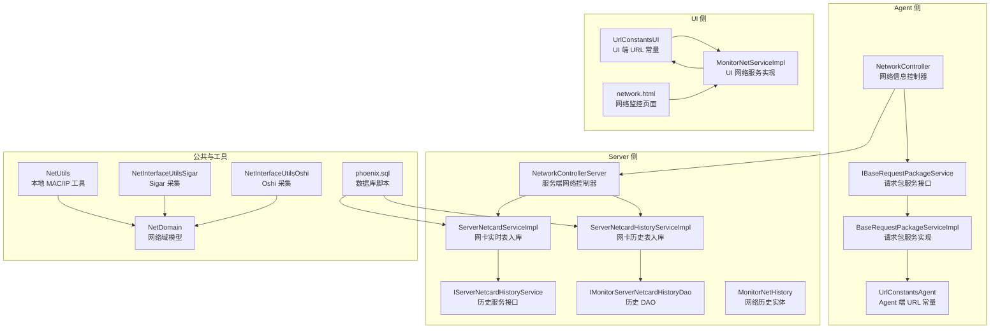
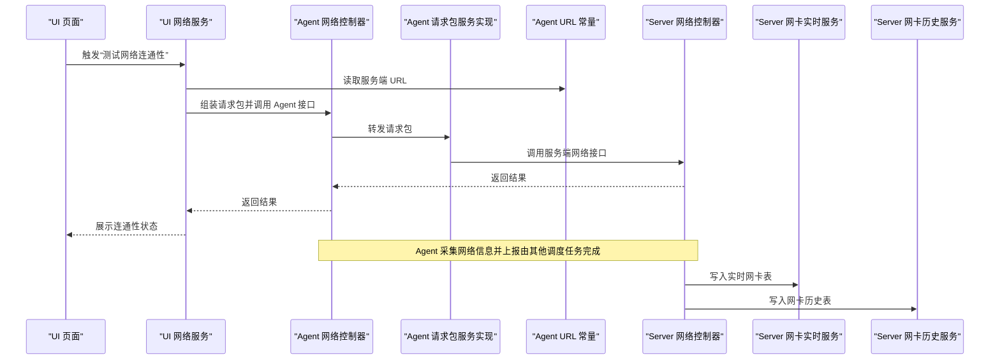
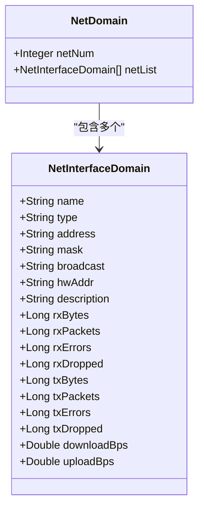
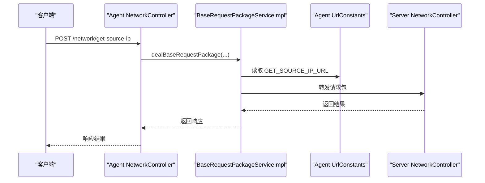
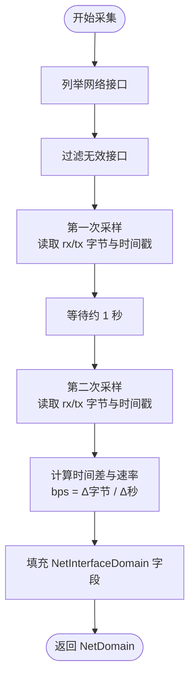
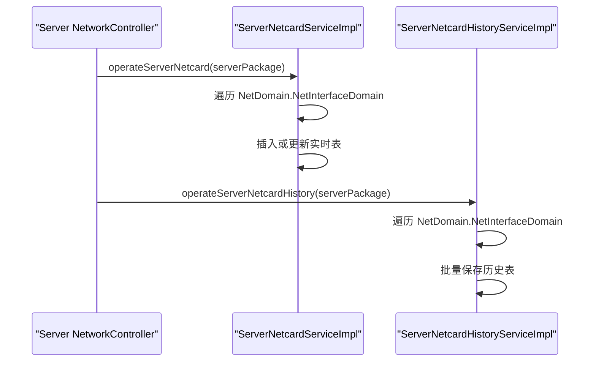
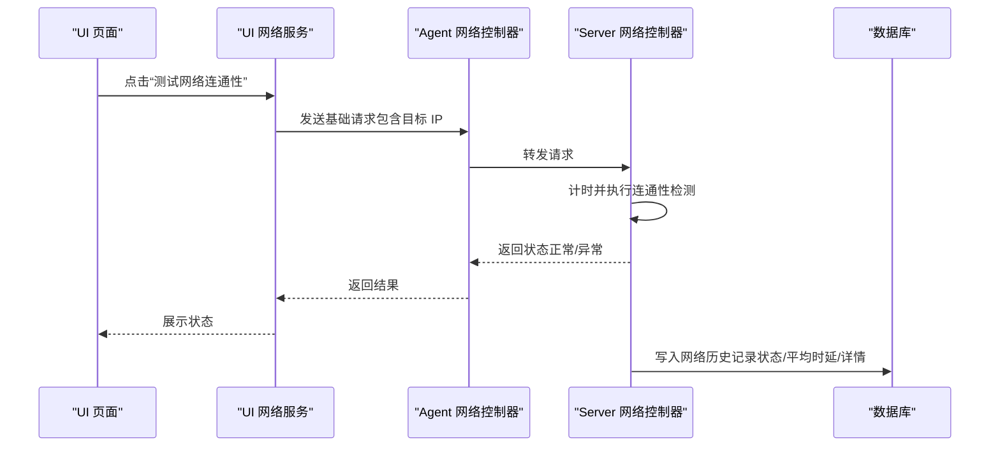
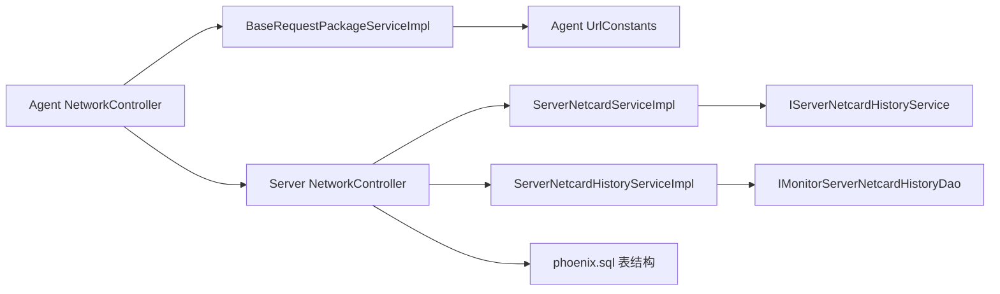

# 网络监控业务

<cite>
**本文引用的文件**
- [NetworkController.java](file://phoenix-agent/src/main/java/com/gitee/pifeng/monitoring/agent/business/client/controller/NetworkController.java)
- [IBaseRequestPackageService.java](file://phoenix-agent/src/main/java/com/gitee/pifeng/monitoring/agent/business/client/service/IBaseRequestPackageService.java)
- [BaseRequestPackageServiceImpl.java](file://phoenix-agent/src/main/java/com/gitee/pifeng/monitoring/agent/business/client/service/impl/BaseRequestPackageServiceImpl.java)
- [UrlConstants.java（Agent）](file://phoenix-agent/src/main/java/com/gitee/pifeng/monitoring/agent/constant/UrlConstants.java)
- [UrlConstants.java（UI）](file://phoenix-ui/src/main/java/com/gitee/pifeng/monitoring/ui/constant/UrlConstants.java)
- [NetworkController.java（Server）](file://phoenix-server/src/main/java/com/gitee/pifeng/monitoring/server/business/server/controller/NetworkController.java)
- [NetDomain.java](file://phoenix-common/phoenix-common-core/src/main/java/com/gitee/pifeng/monitoring/common/domain/server/NetDomain.java)
- [NetInterfaceUtils（Oshi）.java](file://phoenix-common/phoenix-common-core/src/main/java/com/gitee/pifeng/monitoring/common/util/server/oshi/NetInterfaceUtils.java)
- [NetInterfaceUtils（Sigar）.java](file://phoenix-common/phoenix-common-core/src/main/java/com/gitee/pifeng/monitoring/common/util/server/sigar/NetInterfaceUtils.java)
- [NetUtils.java](file://phoenix-common/phoenix-common-core/src/main/java/com/gitee/pifeng/monitoring/common/util/server/NetUtils.java)
- [ServerNetcardServiceImpl.java](file://phoenix-server/src/main/java/com/gitee/pifeng/monitoring/server/business/server/service/impl/ServerNetcardServiceImpl.java)
- [ServerNetcardHistoryServiceImpl.java](file://phoenix-server/src/main/java/com/gitee/pifeng/monitoring/server/business/server/service/impl/ServerNetcardHistoryServiceImpl.java)
- [IServerNetcardHistoryService.java](file://phoenix-server/src/main/java/com/gitee/pifeng/monitoring/server/business/server/service/IServerNetcardHistoryService.java)
- [IMonitorServerNetcardHistoryDao.java](file://phoenix-server/src/main/java/com/gitee/pifeng/monitoring/server/business/server/dao/IMonitorServerNetcardHistoryDao.java)
- [MonitorNetHistory.java](file://phoenix-server/src/main/java/com/gitee/pifeng/monitoring/server/business/server/entity/MonitorNetHistory.java)
- [phoenix.sql（数据库脚本）](file://doc/数据库设计/sql/mysql/phoenix.sql)
- [network.html](file://phoenix-ui/src/main/resources/templates/network/network.html)
- [MonitorNetServiceImpl.java](file://phoenix-ui/src/main/java/com/gitee/pifeng/monitoring/ui/business/web/service/impl/MonitorNetServiceImpl.java)
</cite>

## 目录
1. [简介](#简介)
2. [项目结构](#项目结构)
3. [核心组件](#核心组件)
4. [架构总览](#架构总览)
5. [详细组件分析](#详细组件分析)
6. [依赖分析](#依赖分析)
7. [性能考虑](#性能考虑)
8. [故障排查指南](#故障排查指南)
9. [结论](#结论)
10. [附录](#附录)

## 简介
本文件面向网络监控业务，围绕 NetworkController 的实现进行深入解析，涵盖网络接口监控、带宽使用监控、连接状态监控、网络延迟监控等核心网络性能监控能力。文档同时阐述网络监控的数据模型（NetDomain 实体类及网络接口信息、流量统计字段），并给出从网络接口信息采集、流量统计、连接状态检测到历史数据存储的完整业务链路。最后提供可定位到具体源码位置的“代码示例路径”，帮助读者快速定位关键业务逻辑。

## 项目结构
网络监控涉及三大模块：
- Agent 侧：负责采集本机网络信息并通过统一请求包转发至服务端。
- Server 侧：接收 Agent 上报的网络信息，进行持久化与历史归档。
- UI 侧：提供前端页面与服务端交互，支持网络连通性测试等。

图表来源
- [NetworkController.java:1-80](file://phoenix-agent/src/main/java/com/gitee/pifeng/monitoring/agent/business/client/controller/NetworkController.java#L1-L80)
- [IBaseRequestPackageService.java:1-29](file://phoenix-agent/src/main/java/com/gitee/pifeng/monitoring/agent/business/client/service/IBaseRequestPackageService.java#L1-L29)
- [BaseRequestPackageServiceImpl.java:1-37](file://phoenix-agent/src/main/java/com/gitee/pifeng/monitoring/agent/business/client/service/impl/BaseRequestPackageServiceImpl.java#L1-L37)
- [UrlConstants.java（Agent）:1-127](file://phoenix-agent/src/main/java/com/gitee/pifeng/monitoring/agent/constant/UrlConstants.java#L1-L127)
- [NetworkController.java（Server）:66-94](file://phoenix-server/src/main/java/com/gitee/pifeng/monitoring/server/business/server/controller/NetworkController.java#L66-L94)
- [ServerNetcardServiceImpl.java:1-108](file://phoenix-server/src/main/java/com/gitee/pifeng/monitoring/server/business/server/service/impl/ServerNetcardServiceImpl.java#L1-L108)
- [ServerNetcardHistoryServiceImpl.java:1-88](file://phoenix-server/src/main/java/com/gitee/pifeng/monitoring/server/business/server/service/impl/ServerNetcardHistoryServiceImpl.java#L1-L88)
- [IServerNetcardHistoryService.java:1-28](file://phoenix-server/src/main/java/com/gitee/pifeng/monitoring/server/business/server/service/IServerNetcardHistoryService.java#L1-L28)
- [IMonitorServerNetcardHistoryDao.java:1-15](file://phoenix-server/src/main/java/com/gitee/pifeng/monitoring/server/business/server/dao/IMonitorServerNetcardHistoryDao.java#L1-L15)
- [MonitorNetHistory.java:60-95](file://phoenix-server/src/main/java/com/gitee/pifeng/monitoring/server/business/server/entity/MonitorNetHistory.java#L60-L95)
- [NetDomain.java:1-122](file://phoenix-common/phoenix-common-core/src/main/java/com/gitee/pifeng/monitoring/common/domain/server/NetDomain.java#L1-L122)
- [NetInterfaceUtils（Oshi）.java:1-137](file://phoenix-common/phoenix-common-core/src/main/java/com/gitee/pifeng/monitoring/common/util/server/oshi/NetInterfaceUtils.java#L1-L137)
- [NetInterfaceUtils（Sigar）.java:1-126](file://phoenix-common/phoenix-common-core/src/main/java/com/gitee/pifeng/monitoring/common/util/server/sigar/NetInterfaceUtils.java#L1-L126)
- [NetUtils.java:121-176](file://phoenix-common/phoenix-common-core/src/main/java/com/gitee/pifeng/monitoring/common/util/server/NetUtils.java#L121-L176)
- [UrlConstants.java（UI）:1-53](file://phoenix-ui/src/main/java/com/gitee/pifeng/monitoring/ui/constant/UrlConstants.java#L1-L53)
- [network.html:458-479](file://phoenix-ui/src/main/resources/templates/network/network.html#L458-L479)
- [MonitorNetServiceImpl.java:348-381](file://phoenix-ui/src/main/java/com/gitee/pifeng/monitoring/ui/business/web/service/impl/MonitorNetServiceImpl.java#L348-L381)
- [phoenix.sql（数据库脚本）:529-581](file://doc/数据库设计/sql/mysql/phoenix.sql#L529-L581)

章节来源
- [NetworkController.java:1-80](file://phoenix-agent/src/main/java/com/gitee/pifeng/monitoring/agent/business/client/controller/NetworkController.java#L1-L80)
- [NetworkController.java（Server）:66-94](file://phoenix-server/src/main/java/com/gitee/pifeng/monitoring/server/business/server/controller/NetworkController.java#L66-L94)

## 核心组件
- 网络信息控制器（Agent 侧）：对外暴露“获取被监控网络源IP地址”“测试网络连通性”两个接口，内部通过统一请求包服务转发至服务端。
- 网络域模型（NetDomain）：承载网络接口配置信息（名称、类型、地址、掩码、广播、MAC、描述）与状态统计（接收/发送字节、包数、错误、丢弃）及带宽速率（下载/上传 bps）。
- 网络采集工具（Oshi/Sigar）：分别基于 OSHI 与 SIGAR 提供跨平台网络接口信息采集与带宽计算。
- 服务端网络控制器：接收 Agent 请求，执行业务逻辑并返回结果。
- 服务端网卡数据服务：将实时网卡信息写入实时表，同时生成历史记录写入历史表。
- UI 网络服务：封装请求参数，调用服务端网络接口，驱动前端页面交互。

章节来源
- [NetworkController.java:1-80](file://phoenix-agent/src/main/java/com/gitee/pifeng/monitoring/agent/business/client/controller/NetworkController.java#L1-L80)
- [NetDomain.java:1-122](file://phoenix-common/phoenix-common-core/src/main/java/com/gitee/pifeng/monitoring/common/domain/server/NetDomain.java#L1-L122)
- [NetInterfaceUtils（Oshi）.java:1-137](file://phoenix-common/phoenix-common-core/src/main/java/com/gitee/pifeng/monitoring/common/util/server/oshi/NetInterfaceUtils.java#L1-L137)
- [NetInterfaceUtils（Sigar）.java:1-126](file://phoenix-common/phoenix-common-core/src/main/java/com/gitee/pifeng/monitoring/common/util/server/sigar/NetInterfaceUtils.java#L1-L126)
- [NetworkController.java（Server）:66-94](file://phoenix-server/src/main/java/com/gitee/pifeng/monitoring/server/business/server/controller/NetworkController.java#L66-L94)
- [ServerNetcardServiceImpl.java:1-108](file://phoenix-server/src/main/java/com/gitee/pifeng/monitoring/server/business/server/service/impl/ServerNetcardServiceImpl.java#L1-L108)
- [ServerNetcardHistoryServiceImpl.java:1-88](file://phoenix-server/src/main/java/com/gitee/pifeng/monitoring/server/business/server/service/impl/ServerNetcardHistoryServiceImpl.java#L1-L88)
- [MonitorNetServiceImpl.java:348-381](file://phoenix-ui/src/main/java/com/gitee/pifeng/monitoring/ui/business/web/service/impl/MonitorNetServiceImpl.java#L348-L381)

## 架构总览
下图展示了从 Agent 采集、请求转发、服务端处理到数据入库的历史归档全链路。

图表来源
- [MonitorNetServiceImpl.java:348-381](file://phoenix-ui/src/main/java/com/gitee/pifeng/monitoring/ui/business/web/service/impl/MonitorNetServiceImpl.java#L348-L381)
- [UrlConstants.java（Agent）:1-127](file://phoenix-agent/src/main/java/com/gitee/pifeng/monitoring/agent/constant/UrlConstants.java#L1-L127)
- [NetworkController.java（Server）:66-94](file://phoenix-server/src/main/java/com/gitee/pifeng/monitoring/server/business/server/controller/NetworkController.java#L66-L94)
- [ServerNetcardServiceImpl.java:1-108](file://phoenix-server/src/main/java/com/gitee/pifeng/monitoring/server/business/server/service/impl/ServerNetcardServiceImpl.java#L1-L108)
- [ServerNetcardHistoryServiceImpl.java:1-88](file://phoenix-server/src/main/java/com/gitee/pifeng/monitoring/server/business/server/service/impl/ServerNetcardHistoryServiceImpl.java#L1-L88)

## 详细组件分析

### 数据模型：NetDomain 与 NetInterfaceDomain
- NetDomain：包含网卡数量与网卡列表。
- NetInterfaceDomain：包含网卡配置（name/type/address/mask/broadcast/hwAddr/description）与状态统计（rx/tx 字节、包数、错误、丢弃）与带宽速率（download/upload bps）。

图表来源
- [NetDomain.java:1-122](file://phoenix-common/phoenix-common-core/src/main/java/com/gitee/pifeng/monitoring/common/domain/server/NetDomain.java#L1-L122)

章节来源
- [NetDomain.java:1-122](file://phoenix-common/phoenix-common-core/src/main/java/com/gitee/pifeng/monitoring/common/domain/server/NetDomain.java#L1-L122)

### Agent 侧：NetworkController 与请求包转发
- 提供“获取被监控网络源IP地址”“测试网络连通性”两个接口，请求体为加密后的基础请求包。
- 通过 IBaseRequestPackageService 将请求包转发至服务端对应 URL。

图表来源
- [NetworkController.java:1-80](file://phoenix-agent/src/main/java/com/gitee/pifeng/monitoring/agent/business/client/controller/NetworkController.java#L1-L80)
- [IBaseRequestPackageService.java:1-29](file://phoenix-agent/src/main/java/com/gitee/pifeng/monitoring/agent/business/client/service/IBaseRequestPackageService.java#L1-L29)
- [BaseRequestPackageServiceImpl.java:1-37](file://phoenix-agent/src/main/java/com/gitee/pifeng/monitoring/agent/business/client/service/impl/BaseRequestPackageServiceImpl.java#L1-L37)
- [UrlConstants.java（Agent）:1-127](file://phoenix-agent/src/main/java/com/gitee/pifeng/monitoring/agent/constant/UrlConstants.java#L1-L127)
- [NetworkController.java（Server）:66-94](file://phoenix-server/src/main/java/com/gitee/pifeng/monitoring/server/business/server/controller/NetworkController.java#L66-L94)

章节来源
- [NetworkController.java:1-80](file://phoenix-agent/src/main/java/com/gitee/pifeng/monitoring/agent/business/client/controller/NetworkController.java#L1-L80)
- [IBaseRequestPackageService.java:1-29](file://phoenix-agent/src/main/java/com/gitee/pifeng/monitoring/agent/business/client/service/IBaseRequestPackageService.java#L1-L29)
- [BaseRequestPackageServiceImpl.java:1-37](file://phoenix-agent/src/main/java/com/gitee/pifeng/monitoring/agent/business/client/service/impl/BaseRequestPackageServiceImpl.java#L1-L37)
- [UrlConstants.java（Agent）:1-127](file://phoenix-agent/src/main/java/com/gitee/pifeng/monitoring/agent/constant/UrlConstants.java#L1-L127)

### 采集与带宽计算：Oshi 与 Sigar
- 两者均遍历网络接口，过滤回环、空地址、无效 MAC、docker/lo 等接口。
- 通过两次采样（间隔约 1 秒）计算下载/上传速率（bps）。
- Oshi 使用 updateAttributes 后再次读取字节计数；Sigar 直接读取两次统计值。

图表来源
- [NetInterfaceUtils（Oshi）.java:1-137](file://phoenix-common/phoenix-common-core/src/main/java/com/gitee/pifeng/monitoring/common/util/server/oshi/NetInterfaceUtils.java#L1-L137)
- [NetInterfaceUtils（Sigar）.java:1-126](file://phoenix-common/phoenix-common-core/src/main/java/com/gitee/pifeng/monitoring/common/util/server/sigar/NetInterfaceUtils.java#L1-L126)

章节来源
- [NetInterfaceUtils（Oshi）.java:1-137](file://phoenix-common/phoenix-common-core/src/main/java/com/gitee/pifeng/monitoring/common/util/server/oshi/NetInterfaceUtils.java#L1-L137)
- [NetInterfaceUtils（Sigar）.java:1-126](file://phoenix-common/phoenix-common-core/src/main/java/com/gitee/pifeng/monitoring/common/util/server/sigar/NetInterfaceUtils.java#L1-L126)

### 服务端处理与数据落库
- 服务端 NetworkController 接收请求后，执行业务逻辑并返回结果。
- ServerNetcardServiceImpl：将网卡配置、状态与速率写入“实时网卡表”，并按需更新时间。
- ServerNetcardHistoryServiceImpl：将相同字段写入“网卡历史表”，并设置插入/更新时间。

图表来源
- [NetworkController.java（Server）:66-94](file://phoenix-server/src/main/java/com/gitee/pifeng/monitoring/server/business/server/controller/NetworkController.java#L66-L94)
- [ServerNetcardServiceImpl.java:1-108](file://phoenix-server/src/main/java/com/gitee/pifeng/monitoring/server/business/server/service/impl/ServerNetcardServiceImpl.java#L1-L108)
- [ServerNetcardHistoryServiceImpl.java:1-88](file://phoenix-server/src/main/java/com/gitee/pifeng/monitoring/server/business/server/service/impl/ServerNetcardHistoryServiceImpl.java#L1-L88)

章节来源
- [ServerNetcardServiceImpl.java:1-108](file://phoenix-server/src/main/java/com/gitee/pifeng/monitoring/server/business/server/service/impl/ServerNetcardServiceImpl.java#L1-L108)
- [ServerNetcardHistoryServiceImpl.java:1-88](file://phoenix-server/src/main/java/com/gitee/pifeng/monitoring/server/business/server/service/impl/ServerNetcardHistoryServiceImpl.java#L1-L88)

### 连接状态与网络延迟监控
- UI 侧提供“测试网络连通性”入口，调用 Agent 的网络接口，服务端返回状态（正常/异常）。
- 服务端 NetworkController 对该接口进行计时与超时告警，确保响应及时性。
- 数据库层面存在“网络历史记录表”（MONITOR_NET_HISTORY），用于存储目标 IP、状态、平均响应时间、离线次数、详情等。

图表来源
- [MonitorNetServiceImpl.java:348-381](file://phoenix-ui/src/main/java/com/gitee/pifeng/monitoring/ui/business/web/service/impl/MonitorNetServiceImpl.java#L348-L381)
- [network.html:458-479](file://phoenix-ui/src/main/resources/templates/network/network.html#L458-L479)
- [NetworkController.java（Server）:66-94](file://phoenix-server/src/main/java/com/gitee/pifeng/monitoring/server/business/server/controller/NetworkController.java#L66-L94)
- [MonitorNetHistory.java:60-95](file://phoenix-server/src/main/java/com/gitee/pifeng/monitoring/server/business/server/entity/MonitorNetHistory.java#L60-L95)
- [phoenix.sql（数据库脚本）:529-581](file://doc/数据库设计/sql/mysql/phoenix.sql#L529-L581)

章节来源
- [MonitorNetServiceImpl.java:348-381](file://phoenix-ui/src/main/java/com/gitee/pifeng/monitoring/ui/business/web/service/impl/MonitorNetServiceImpl.java#L348-L381)
- [network.html:458-479](file://phoenix-ui/src/main/resources/templates/network/network.html#L458-L479)
- [NetworkController.java（Server）:66-94](file://phoenix-server/src/main/java/com/gitee/pifeng/monitoring/server/business/server/controller/NetworkController.java#L66-L94)
- [MonitorNetHistory.java:60-95](file://phoenix-server/src/main/java/com/gitee/pifeng/monitoring/server/business/server/entity/MonitorNetHistory.java#L60-L95)
- [phoenix.sql（数据库脚本）:529-581](file://doc/数据库设计/sql/mysql/phoenix.sql#L529-L581)

### 本地 MAC 地址获取与跨平台兼容
- NetUtils 提供基于 Oshi 与 Sigar 的本地 MAC 地址获取策略，优先匹配当前 IP 对应的网卡 MAC。
- 若无法匹配或采集失败，抛出自定义网络异常，便于上层捕获与告警。

章节来源
- [NetUtils.java:121-176](file://phoenix-common/phoenix-common-core/src/main/java/com/gitee/pifeng/monitoring/common/util/server/NetUtils.java#L121-L176)

## 依赖分析
- Agent 与 UI 通过 UrlConstants 统一管理服务端 URL，避免硬编码。
- Agent 的 NetworkController 仅负责请求转发，核心业务在服务端实现，降低 Agent 端复杂度。
- 服务端通过 MyBatis-Plus DAO 与 Service 实现数据持久化，历史表与实时表分离，提升查询与写入性能。

图表来源
- [NetworkController.java:1-80](file://phoenix-agent/src/main/java/com/gitee/pifeng/monitoring/agent/business/client/controller/NetworkController.java#L1-L80)
- [BaseRequestPackageServiceImpl.java:1-37](file://phoenix-agent/src/main/java/com/gitee/pifeng/monitoring/agent/business/client/service/impl/BaseRequestPackageServiceImpl.java#L1-L37)
- [UrlConstants.java（Agent）:1-127](file://phoenix-agent/src/main/java/com/gitee/pifeng/monitoring/agent/constant/UrlConstants.java#L1-L127)
- [NetworkController.java（Server）:66-94](file://phoenix-server/src/main/java/com/gitee/pifeng/monitoring/server/business/server/controller/NetworkController.java#L66-L94)
- [ServerNetcardServiceImpl.java:1-108](file://phoenix-server/src/main/java/com/gitee/pifeng/monitoring/server/business/server/service/impl/ServerNetcardServiceImpl.java#L1-L108)
- [ServerNetcardHistoryServiceImpl.java:1-88](file://phoenix-server/src/main/java/com/gitee/pifeng/monitoring/server/business/server/service/impl/ServerNetcardHistoryServiceImpl.java#L1-L88)
- [IServerNetcardHistoryService.java:1-28](file://phoenix-server/src/main/java/com/gitee/pifeng/monitoring/server/business/server/service/IServerNetcardHistoryService.java#L1-L28)
- [IMonitorServerNetcardHistoryDao.java:1-15](file://phoenix-server/src/main/java/com/gitee/pifeng/monitoring/server/business/server/dao/IMonitorServerNetcardHistoryDao.java#L1-L15)
- [phoenix.sql（数据库脚本）:529-581](file://doc/数据库设计/sql/mysql/phoenix.sql#L529-L581)

## 性能考虑
- 带宽计算采用两次采样（约 1 秒间隔），在保证精度的同时兼顾 CPU 开销。
- 服务端写入实时表与历史表采用批量保存，减少数据库往返次数。
- 服务端对网络连通性接口增加计时与超时告警，避免长时间阻塞影响整体吞吐。
- 通过 DAO 与 Service 分层，结合 MyBatis-Plus 的批处理能力，优化写入性能。

## 故障排查指南
- Agent 侧
  - 确认 UrlConstants 中服务端 URL 配置正确。
  - 检查 NetworkController 的请求体是否为加密后的基础请求包。
- 服务端侧
  - 查看 NetworkController 接口耗时日志，超过阈值时输出警告。
  - 核对 ServerNetcardServiceImpl 与 ServerNetcardHistoryServiceImpl 的入库逻辑，确认字段映射一致。
- 采集侧
  - 若 Oshi/Sigar 采集失败，检查系统权限与依赖库加载情况。
  - 关注 NetInterfaceUtils 的过滤条件，排除 docker/lo 回环等无效接口。
- UI 侧
  - 确认 UI 网络服务 MonitorNetServiceImpl 的请求参数（如目标 IP）正确。
  - 检查前端 network.html 的提交逻辑与 CSRF 头部配置。

章节来源
- [NetworkController.java（Server）:66-94](file://phoenix-server/src/main/java/com/gitee/pifeng/monitoring/server/business/server/controller/NetworkController.java#L66-L94)
- [ServerNetcardServiceImpl.java:1-108](file://phoenix-server/src/main/java/com/gitee/pifeng/monitoring/server/business/server/service/impl/ServerNetcardServiceImpl.java#L1-L108)
- [ServerNetcardHistoryServiceImpl.java:1-88](file://phoenix-server/src/main/java/com/gitee/pifeng/monitoring/server/business/server/service/impl/ServerNetcardHistoryServiceImpl.java#L1-L88)
- [NetInterfaceUtils（Oshi）.java:1-137](file://phoenix-common/phoenix-common-core/src/main/java/com/gitee/pifeng/monitoring/common/util/server/oshi/NetInterfaceUtils.java#L1-L137)
- [NetInterfaceUtils（Sigar）.java:1-126](file://phoenix-common/phoenix-common-core/src/main/java/com/gitee/pifeng/monitoring/common/util/server/sigar/NetInterfaceUtils.java#L1-L126)
- [MonitorNetServiceImpl.java:348-381](file://phoenix-ui/src/main/java/com/gitee/pifeng/monitoring/ui/business/web/service/impl/MonitorNetServiceImpl.java#L348-L381)

## 结论
本网络监控方案以 Agent 采集、服务端处理与 UI 交互为核心，借助 NetDomain 数据模型统一承载网络接口配置、状态与带宽指标，并通过实时表与历史表分离实现高效存储与查询。采集层提供 Oshi/Sigar 两种实现，增强跨平台兼容性；服务端通过批量入库与计时告警保障性能与稳定性；UI 侧提供连通性测试与可视化展示，形成完整的网络监控闭环。

## 附录
- 代码示例路径（不含具体代码内容，仅提供定位）
  - 获取被监控网络源 IP 地址（Agent → 服务端）
    - [NetworkController.java:52-58](file://phoenix-agent/src/main/java/com/gitee/pifeng/monitoring/agent/business/client/controller/NetworkController.java#L52-L58)
    - [IBaseRequestPackageService.java:14-29](file://phoenix-agent/src/main/java/com/gitee/pifeng/monitoring/agent/business/client/service/IBaseRequestPackageService.java#L14-L29)
    - [BaseRequestPackageServiceImpl.java:31-37](file://phoenix-agent/src/main/java/com/gitee/pifeng/monitoring/agent/business/client/service/impl/BaseRequestPackageServiceImpl.java#L31-L37)
    - [UrlConstants.java（Agent）:62-64](file://phoenix-agent/src/main/java/com/gitee/pifeng/monitoring/agent/constant/UrlConstants.java#L62-L64)
    - [NetworkController.java（Server）:66-76](file://phoenix-server/src/main/java/com/gitee/pifeng/monitoring/server/business/server/controller/NetworkController.java#L66-L76)
  - 测试网络连通性（UI → Agent → 服务端）
    - [MonitorNetServiceImpl.java:375-381](file://phoenix-ui/src/main/java/com/gitee/pifeng/monitoring/ui/business/web/service/impl/MonitorNetServiceImpl.java#L375-L381)
    - [UrlConstants.java（UI）:37-40](file://phoenix-ui/src/main/java/com/gitee/pifeng/monitoring/ui/constant/UrlConstants.java#L37-L40)
    - [network.html:458-479](file://phoenix-ui/src/main/resources/templates/network/network.html#L458-L479)
    - [NetworkController.java（Server）:89-94](file://phoenix-server/src/main/java/com/gitee/pifeng/monitoring/server/business/server/controller/NetworkController.java#L89-L94)
  - 网络接口信息采集与带宽计算
    - [NetInterfaceUtils（Oshi）.java:40-111](file://phoenix-common/phoenix-common-core/src/main/java/com/gitee/pifeng/monitoring/common/util/server/oshi/NetInterfaceUtils.java#L40-L111)
    - [NetInterfaceUtils（Sigar）.java:37-124](file://phoenix-common/phoenix-common-core/src/main/java/com/gitee/pifeng/monitoring/common/util/server/sigar/NetInterfaceUtils.java#L37-L124)
  - 网卡信息入库（实时与历史）
    - [ServerNetcardServiceImpl.java:41-105](file://phoenix-server/src/main/java/com/gitee/pifeng/monitoring/server/business/server/service/impl/ServerNetcardServiceImpl.java#L41-L105)
    - [ServerNetcardHistoryServiceImpl.java:38-85](file://phoenix-server/src/main/java/com/gitee/pifeng/monitoring/server/business/server/service/impl/ServerNetcardHistoryServiceImpl.java#L38-L85)
  - 数据模型定义
    - [NetDomain.java:17-121](file://phoenix-common/phoenix-common-core/src/main/java/com/gitee/pifeng/monitoring/common/domain/server/NetDomain.java#L17-L121)
  - 数据库表结构参考
    - [phoenix.sql（数据库脚本）:529-581](file://doc/数据库设计/sql/mysql/phoenix.sql#L529-L581)