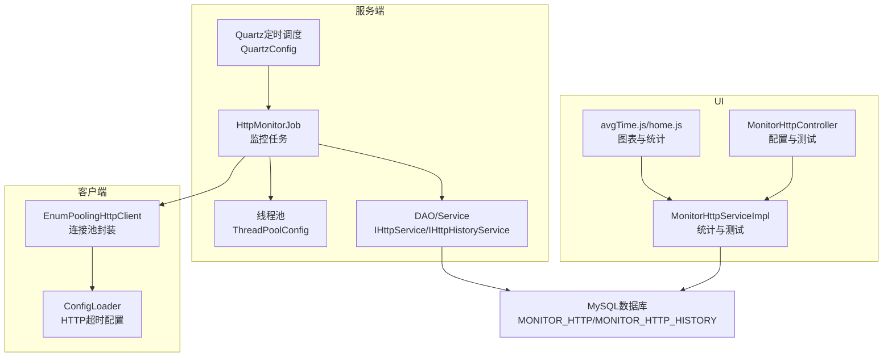
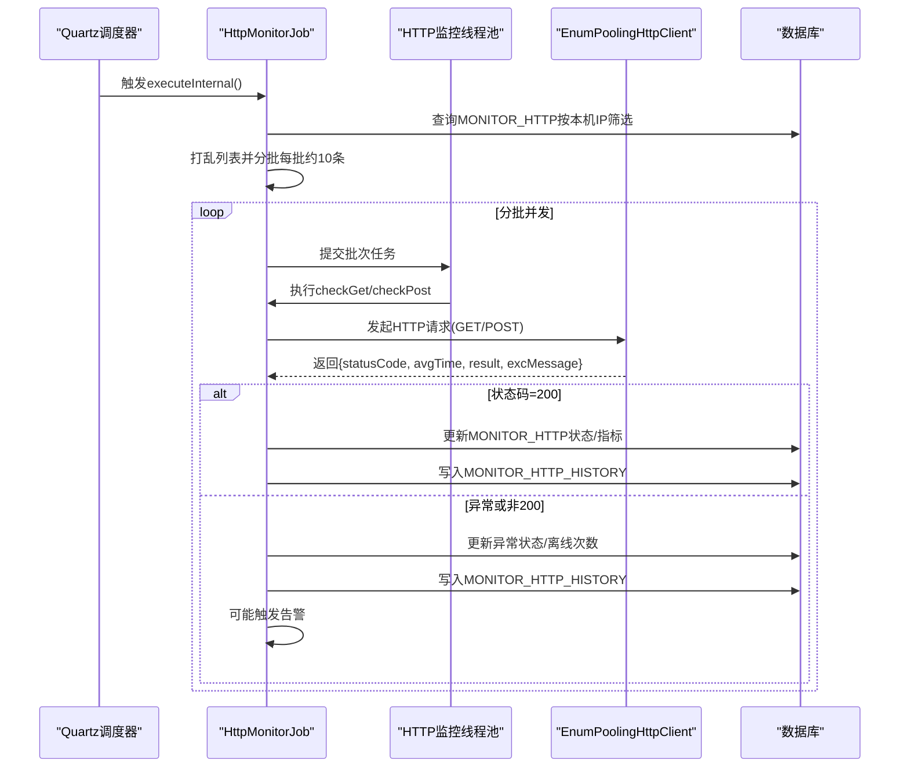
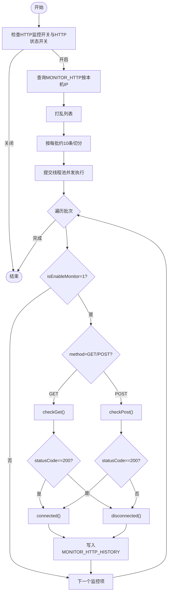
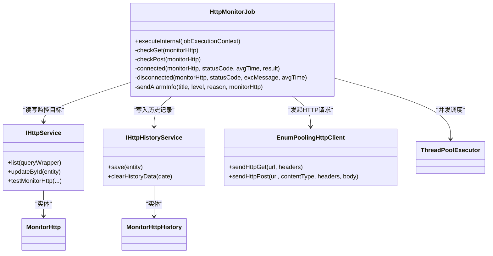
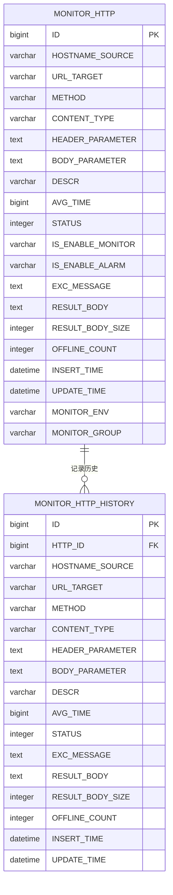

# HTTP监控任务

<cite>
**本文档引用的文件**
- [HttpMonitorJob.java](file://phoenix-server/src/main/java/com/gitee/pifeng/monitoring/server/business/server/monitor/http/HttpMonitorJob.java)
- [MonitorHttp.java](file://phoenix-server/src/main/java/com/gitee/pifeng/monitoring/server/business/server/entity/MonitorHttp.java)
- [MonitorHttpHistory.java](file://phoenix-server/src/main/java/com/gitee/pifeng/monitoring/server/business/server/entity/MonitorHttpHistory.java)
- [IHttpService.java](file://phoenix-server/src/main/java/com/gitee/pifeng/monitoring/server/business/server/service/IHttpService.java)
- [IHttpHistoryService.java](file://phoenix-server/src/main/java/com/gitee/pifeng/monitoring/server/business/server/service/IHttpHistoryService.java)
- [ThreadPoolConfig.java](file://phoenix-server/src/main/java/com/gitee/pifeng/monitoring/server/config/ThreadPoolConfig.java)
- [QuartzConfig.java](file://phoenix-server/src/main/java/com/gitee/pifeng/monitoring/server/config/QuartzConfig.java)
- [MonitoringProperties.java](file://phoenix-common/phoenix-common-core/src/main/java/com/gitee/pifeng/monitoring/common/property/server/MonitoringProperties.java)
- [MonitoringHttpProperties.java](file://phoenix-common/phoenix-common-core/src/main/java/com/gitee/pifeng/monitoring/common/property/server/MonitoringHttpProperties.java)
- [MonitoringHttpStatusProperties.java](file://phoenix-common/phoenix-common-core/src/main/java/com/gitee/pifeng/monitoring/common/property/server/MonitoringHttpStatusProperties.java)
- [EnumPoolingHttpClient.java](file://phoenix-client/phoenix-client-core/src/main/java/com/gitee/pifeng/monitoring/plug/core/EnumPoolingHttpClient.java)
- [ConfigLoader.java](file://phoenix-client/phoenix-client-core/src/main/java/com/gitee/pifeng/monitoring/plug/core/ConfigLoader.java)
- [RestTemplateConfig.java](file://phoenix-agent/src/main/java/com/gitee/pifeng/monitoring/agent/config/RestTemplateConfig.java)
- [phoenix.sql](file://doc/数据库设计/sql/mysql/phoenix.sql)
- [MonitorHttpController.java](file://phoenix-ui/src/main/java/com/gitee/pifeng/monitoring/ui/business/web/controller/MonitorHttpController.java)
- [MonitorHttpServiceImpl.java](file://phoenix-ui/src/main/java/com/gitee/pifeng/monitoring/ui/business/web/service/impl/MonitorHttpServiceImpl.java)
- [avgTime.js](file://phoenix-ui/src/main/resources/static/modules/http/avgTime.js)
- [home.js](file://phoenix-ui/src/main/resources/static/modules/home.js)
- [home.html](file://phoenix-ui/src/main/resources/templates/home.html)
</cite>

## 目录
1. [简介](#简介)
2. [项目结构](#项目结构)
3. [核心组件](#核心组件)
4. [架构总览](#架构总览)
5. [详细组件分析](#详细组件分析)
6. [依赖关系分析](#依赖关系分析)
7. [性能考量](#性能考量)
8. [故障排查指南](#故障排查指南)
9. [结论](#结论)
10. [附录](#附录)

## 简介
本文件面向HTTP监控任务，系统化阐述HttpMonitorJob类的实现原理与运行机制，覆盖以下主题：
- HTTP请求监控的核心逻辑与并发处理
- 请求响应时间统计与成功率计算
- 数据采集流程：请求发起、响应解析、性能指标提取
- 告警规则配置：响应时间阈值、失败率阈值、超时检测
- 统计数据收集：平均响应时间、95百分位响应时间、吞吐量统计
- 配置参数说明：监控周期、超时时间、重试次数等
- 性能优化策略与故障诊断方法

## 项目结构
HTTP监控任务涉及服务端、客户端、UI与数据库四部分协作：
- 服务端：定时调度与监控执行（Quartz + 自定义Job）
- 客户端：HTTP请求封装与连接池配置
- UI：监控配置、测试连通性、统计图表展示
- 数据库：监控目标与历史记录存储

**图表来源**
- [QuartzConfig.java:278-312](file://phoenix-server/src/main/java/com/gitee/pifeng/monitoring/server/config/QuartzConfig.java#L278-L312)
- [HttpMonitorJob.java:109-159](file://phoenix-server/src/main/java/com/gitee/pifeng/monitoring/server/business/server/monitor/http/HttpMonitorJob.java#L109-L159)
- [ThreadPoolConfig.java:113-130](file://phoenix-server/src/main/java/com/gitee/pifeng/monitoring/server/config/ThreadPoolConfig.java#L113-L130)
- [EnumPoolingHttpClient.java:157-177](file://phoenix-client/phoenix-client-core/src/main/java/com/gitee/pifeng/monitoring/plug/core/EnumPoolingHttpClient.java#L157-L177)
- [ConfigLoader.java:364-423](file://phoenix-client/phoenix-client-core/src/main/java/com/gitee/pifeng/monitoring/plug/core/ConfigLoader.java#L364-L423)
- [MonitorHttpController.java:375-412](file://phoenix-ui/src/main/java/com/gitee/pifeng/monitoring/ui/business/web/controller/MonitorHttpController.java#L375-L412)
- [MonitorHttpServiceImpl.java:337-367](file://phoenix-ui/src/main/java/com/gitee/pifeng/monitoring/ui/business/web/service/impl/MonitorHttpServiceImpl.java#L337-L367)
- [avgTime.js:31-62](file://phoenix-ui/src/main/resources/static/modules/http/avgTime.js#L31-L62)
- [home.js:487-518](file://phoenix-ui/src/main/resources/static/modules/home.js#L487-L518)

**章节来源**
- [QuartzConfig.java:278-312](file://phoenix-server/src/main/java/com/gitee/pifeng/monitoring/server/config/QuartzConfig.java#L278-L312)
- [ThreadPoolConfig.java:113-130](file://phoenix-server/src/main/java/com/gitee/pifeng/monitoring/server/config/ThreadPoolConfig.java#L113-L130)
- [HttpMonitorJob.java:109-159](file://phoenix-server/src/main/java/com/gitee/pifeng/monitoring/server/business/server/monitor/http/HttpMonitorJob.java#L109-L159)

## 核心组件
- HttpMonitorJob：基于Quartz的HTTP监控任务，负责扫描监控目标、并发发起HTTP请求、统计指标、更新状态与历史记录、按需发送告警。
- MonitorHttp/MonitorHttpHistory：监控目标与历史记录的实体模型，承载状态、响应时间、结果体、离线次数等字段。
- IHttpService/IHttpHistoryService：对MONITOR_HTTP与MONITOR_HTTP_HISTORY表的业务服务接口。
- EnumPoolingHttpClient：封装Apache HttpClient连接池，统一超时配置与请求执行。
- ThreadPoolConfig：为HTTP监控任务提供专用线程池，支持高并发请求。
- QuartzConfig：定义HTTP监控JobDetail与Trigger，设定调度周期与延迟。

**章节来源**
- [HttpMonitorJob.java:49-98](file://phoenix-server/src/main/java/com/gitee/pifeng/monitoring/server/business/server/monitor/http/HttpMonitorJob.java#L49-L98)
- [MonitorHttp.java:24-146](file://phoenix-server/src/main/java/com/gitee/pifeng/monitoring/server/business/server/entity/MonitorHttp.java#L24-L146)
- [MonitorHttpHistory.java:22-113](file://phoenix-server/src/main/java/com/gitee/pifeng/monitoring/server/business/server/entity/MonitorHttpHistory.java#L22-L113)
- [IHttpService.java:14-32](file://phoenix-server/src/main/java/com/gitee/pifeng/monitoring/server/business/server/service/IHttpService.java#L14-L32)
- [IHttpHistoryService.java:16-29](file://phoenix-server/src/main/java/com/gitee/pifeng/monitoring/server/business/server/service/IHttpHistoryService.java#L16-L29)
- [EnumPoolingHttpClient.java:157-177](file://phoenix-client/phoenix-client-core/src/main/java/com/gitee/pifeng/monitoring/plug/core/EnumPoolingHttpClient.java#L157-L177)
- [ThreadPoolConfig.java:113-130](file://phoenix-server/src/main/java/com/gitee/pifeng/monitoring/server/config/ThreadPoolConfig.java#L113-L130)
- [QuartzConfig.java:289-312](file://phoenix-server/src/main/java/com/gitee/pifeng/monitoring/server/config/QuartzConfig.java#L289-L312)

## 架构总览
HTTP监控任务采用“定时扫描 + 并发请求 + 指标统计 + 告警推送”的流水线式架构。下图展示了从调度到数据落库的关键交互：

**图表来源**
- [HttpMonitorJob.java:110-159](file://phoenix-server/src/main/java/com/gitee/pifeng/monitoring/server/business/server/monitor/http/HttpMonitorJob.java#L110-L159)
- [HttpMonitorJob.java:143-151](file://phoenix-server/src/main/java/com/gitee/pifeng/monitoring/server/business/server/monitor/http/HttpMonitorJob.java#L143-L151)
- [HttpMonitorJob.java:237-277](file://phoenix-server/src/main/java/com/gitee/pifeng/monitoring/server/business/server/monitor/http/HttpMonitorJob.java#L237-L277)
- [HttpMonitorJob.java:291-382](file://phoenix-server/src/main/java/com/gitee/pifeng/monitoring/server/business/server/monitor/http/HttpMonitorJob.java#L291-L382)
- [EnumPoolingHttpClient.java:157-177](file://phoenix-client/phoenix-client-core/src/main/java/com/gitee/pifeng/monitoring/plug/core/EnumPoolingHttpClient.java#L157-L177)

## 详细组件分析

### HttpMonitorJob 类实现原理
- 调度入口：executeInternal()在Quartz触发后执行，先检查全局HTTP开关与HTTP状态开关，再按本机IP筛选监控目标。
- 并发策略：将监控目标随机打乱后按每批约10条切分，提交至专用线程池并发执行，提升整体吞吐。
- 请求类型：分别支持GET与POST两种方法，POST支持表单与JSON两种请求体格式。
- 重试机制：通过配置的threshold参数循环尝试，直到状态码为200或达到最大重试次数。
- 指标采集：从返回Map中提取avgTime（毫秒）、statusCode、result、excMessage等。
- 状态更新：根据结果调用connected/disconnected，更新MONITOR_HTTP并写入MONITOR_HTTP_HISTORY。
- 告警控制：仅当全局告警开关与目标级告警开关同时开启时才发送告警。

**图表来源**
- [HttpMonitorJob.java:110-159](file://phoenix-server/src/main/java/com/gitee/pifeng/monitoring/server/business/server/monitor/http/HttpMonitorJob.java#L110-L159)
- [HttpMonitorJob.java:143-151](file://phoenix-server/src/main/java/com/gitee/pifeng/monitoring/server/business/server/monitor/http/HttpMonitorJob.java#L143-L151)
- [HttpMonitorJob.java:237-277](file://phoenix-server/src/main/java/com/gitee/pifeng/monitoring/server/business/server/monitor/http/HttpMonitorJob.java#L237-L277)
- [HttpMonitorJob.java:291-382](file://phoenix-server/src/main/java/com/gitee/pifeng/monitoring/server/business/server/monitor/http/HttpMonitorJob.java#L291-L382)

**章节来源**
- [HttpMonitorJob.java:109-159](file://phoenix-server/src/main/java/com/gitee/pifeng/monitoring/server/business/server/monitor/http/HttpMonitorJob.java#L109-L159)
- [HttpMonitorJob.java:170-226](file://phoenix-server/src/main/java/com/gitee/pifeng/monitoring/server/business/server/monitor/http/HttpMonitorJob.java#L170-L226)
- [HttpMonitorJob.java:237-277](file://phoenix-server/src/main/java/com/gitee/pifeng/monitoring/server/business/server/monitor/http/HttpMonitorJob.java#L237-L277)
- [HttpMonitorJob.java:291-382](file://phoenix-server/src/main/java/com/gitee/pifeng/monitoring/server/business/server/monitor/http/HttpMonitorJob.java#L291-L382)
- [HttpMonitorJob.java:396-465](file://phoenix-server/src/main/java/com/gitee/pifeng/monitoring/server/business/server/monitor/http/HttpMonitorJob.java#L396-L465)

### 数据采集机制
- 请求发起：通过EnumPoolingHttpClient封装的连接池发起HTTP请求，GET使用sendHttpGet，POST使用sendHttpPost。
- 响应解析：返回Map包含statusCode、avgTime、result、excMessage等字段。
- 性能指标提取：avgTime用于统计与告警判断；result用于记录响应体及大小；status用于状态判定。
- 历史记录：每次请求后将当前状态与指标写入MONITOR_HTTP_HISTORY，便于后续统计与可视化。

**章节来源**
- [EnumPoolingHttpClient.java:157-177](file://phoenix-client/phoenix-client-core/src/main/java/com/gitee/pifeng/monitoring/plug/core/EnumPoolingHttpClient.java#L157-L177)
- [HttpMonitorJob.java:196-220](file://phoenix-server/src/main/java/com/gitee/pifeng/monitoring/server/business/server/monitor/http/HttpMonitorJob.java#L196-L220)
- [HttpMonitorJob.java:248-276](file://phoenix-server/src/main/java/com/gitee/pifeng/monitoring/server/business/server/monitor/http/HttpMonitorJob.java#L248-L276)
- [HttpMonitorJob.java:365-381](file://phoenix-server/src/main/java/com/gitee/pifeng/monitoring/server/business/server/monitor/http/HttpMonitorJob.java#L365-L381)

### 告警规则配置
- 开关控制：全局HTTP监控开关、HTTP状态监控开关、目标级告警开关三者均需开启才会发送告警。
- 告警内容：包含源主机、目标URL、请求方法、请求头、请求体（POST时）、描述、环境、分组、时间等。
- 告警类型：服务中断（致命）与服务恢复（信息）两类，分别对应异常到正常与正常到异常的状态转换。

**章节来源**
- [HttpMonitorJob.java:396-465](file://phoenix-server/src/main/java/com/gitee/pifeng/monitoring/server/business/server/monitor/http/HttpMonitorJob.java#L396-L465)
- [MonitoringHttpStatusProperties.java:18-30](file://phoenix-common/phoenix-common-core/src/main/java/com/gitee/pifeng/monitoring/common/property/server/MonitoringHttpStatusProperties.java#L18-L30)
- [MonitoringHttpProperties.java:18-30](file://phoenix-common/phoenix-common-core/src/main/java/com/gitee/pifeng/monitoring/common/property/server/MonitoringHttpProperties.java#L18-L30)

### 并发处理能力
- 线程池：专用线程池httpMonitorThreadPoolExecutor，核心与最大线程数按CPU核数与IO阻塞系数计算，队列容量为最大值，线程命名规范，守护线程。
- 并发粒度：按监控目标列表分批（每批约10条），每批提交一个任务，内部逐条并发执行，避免单次任务过大导致阻塞。
- 资源池管理：连接池默认每路由最大连接200，空闲连接定期回收，连接超时、等待数据超时、连接请求超时由配置加载器统一注入。

**章节来源**
- [ThreadPoolConfig.java:113-130](file://phoenix-server/src/main/java/com/gitee/pifeng/monitoring/server/config/ThreadPoolConfig.java#L113-L130)
- [HttpMonitorJob.java:127-154](file://phoenix-server/src/main/java/com/gitee/pifeng/monitoring/server/business/server/monitor/http/HttpMonitorJob.java#L127-L154)
- [EnumPoolingHttpClient.java:157-177](file://phoenix-client/phoenix-client-core/src/main/java/com/gitee/pifeng/monitoring/plug/core/EnumPoolingHttpClient.java#L157-L177)

### 统计数据收集
- 平均响应时间：来自请求返回的avgTime字段，按监控目标维度存储于MONITOR_HTTP与MONITOR_HTTP_HISTORY。
- 95百分位响应时间：UI侧通过avgTime.js按日期范围查询MONITOR_HTTP_HISTORY的avgTime序列，前端聚合计算得到。
- 吞吐量统计：UI首页home.js/home.html展示HTTP总数、正常数、异常数、未知数与正常率，来源于数据库统计查询。

**章节来源**
- [avgTime.js:31-62](file://phoenix-ui/src/main/resources/static/modules/http/avgTime.js#L31-L62)
- [MonitorHttpServiceImpl.java:337-367](file://phoenix-ui/src/main/java/com/gitee/pifeng/monitoring/ui/business/web/service/impl/MonitorHttpServiceImpl.java#L337-L367)
- [home.js:487-518](file://phoenix-ui/src/main/resources/static/modules/home.js#L487-L518)
- [home.html:246-268](file://phoenix-ui/src/main/resources/templates/home.html#L246-L268)

### 配置参数说明
- 监控周期：HTTP监控Trigger设定为启动后延迟10秒，之后每5分钟执行一次。
- 超时时间：连接超时、等待数据超时、连接请求超时由ConfigLoader加载，缺省均为15秒，且必须大于0。
- 重试次数：threshold参数控制每次请求的最大重试次数，直到状态码为200或达到上限。
- 监控目标：通过UI控制器MonitorHttpController提供的接口进行增删改查与测试连通性。

**章节来源**
- [QuartzConfig.java:307-312](file://phoenix-server/src/main/java/com/gitee/pifeng/monitoring/server/config/QuartzConfig.java#L307-L312)
- [ConfigLoader.java:364-423](file://phoenix-client/phoenix-client-core/src/main/java/com/gitee/pifeng/monitoring/plug/core/ConfigLoader.java#L364-L423)
- [MonitoringProperties.java:22-24](file://phoenix-common/phoenix-common-core/src/main/java/com/gitee/pifeng/monitoring/common/property/server/MonitoringProperties.java#L22-L24)
- [MonitorHttpController.java:375-412](file://phoenix-ui/src/main/java/com/gitee/pifeng/monitoring/ui/business/web/controller/MonitorHttpController.java#L375-L412)

## 依赖关系分析
- 组件耦合：HttpMonitorJob依赖IHttpService/IHttpHistoryService进行数据读写，依赖EnumPoolingHttpClient进行HTTP请求，依赖线程池executor进行并发调度。
- 外部依赖：Apache HttpClient连接池、Quartz调度器、MyBatis-Plus数据访问层。
- 数据模型：MONITOR_HTTP与MONITOR_HTTP_HISTORY表结构清晰，字段覆盖状态、指标、历史记录等关键信息。

**图表来源**
- [HttpMonitorJob.java:66-98](file://phoenix-server/src/main/java/com/gitee/pifeng/monitoring/server/business/server/monitor/http/HttpMonitorJob.java#L66-L98)
- [IHttpService.java:14-32](file://phoenix-server/src/main/java/com/gitee/pifeng/monitoring/server/business/server/service/IHttpService.java#L14-L32)
- [IHttpHistoryService.java:16-29](file://phoenix-server/src/main/java/com/gitee/pifeng/monitoring/server/business/server/service/IHttpHistoryService.java#L16-L29)
- [MonitorHttp.java:24-146](file://phoenix-server/src/main/java/com/gitee/pifeng/monitoring/server/business/server/entity/MonitorHttp.java#L24-L146)
- [MonitorHttpHistory.java:22-113](file://phoenix-server/src/main/java/com/gitee/pifeng/monitoring/server/business/server/entity/MonitorHttpHistory.java#L22-L113)
- [EnumPoolingHttpClient.java:157-177](file://phoenix-client/phoenix-client-core/src/main/java/com/gitee/pifeng/monitoring/plug/core/EnumPoolingHttpClient.java#L157-L177)

**章节来源**
- [phoenix.sql:200-246](file://doc/数据库设计/sql/mysql/phoenix.sql#L200-L246)

## 性能考量
- 并发度调优：线程池大小按CPU核数与IO阻塞系数计算，建议结合实际QPS与目标服务性能动态评估。
- 连接池参数：每路由最大连接200，空闲连接定期回收，避免连接泄漏；超时参数需与目标服务SLA匹配。
- 请求批处理：按约10条分批提交，平衡并发与内存占用；可根据监控目标数量调整批次大小。
- 指标统计：avgTime来自连接池封装的统计，建议在UI侧增加缓存与分页，避免大数据量查询阻塞。
- 调度频率：默认5分钟一次，建议根据业务SLA与目标服务负载调优。

[本节为通用指导，无需特定文件引用]

## 故障排查指南
- 常见异常定位
  - HTTP请求异常：查看HttpMonitorJob的日志输出，定位具体监控项与异常消息。
  - 连接池超时：检查连接超时、等待数据超时、连接请求超时配置，确认目标服务可用性。
  - 告警未触发：确认全局HTTP开关、HTTP状态开关、目标级告警开关均开启。
- 数据一致性
  - 确认MONITOR_HTTP与MONITOR_HTTP_HISTORY表字段一致，历史记录是否正确写入。
  - 检查UI统计接口返回的数据范围与日期参数是否正确。
- 资源使用
  - 监控线程池是否饱和，观察队列长度与拒绝策略触发情况。
  - Apache HttpClient连接池是否频繁回收空闲连接，适当调整回收策略。

**章节来源**
- [HttpMonitorJob.java:272-276](file://phoenix-server/src/main/java/com/gitee/pifeng/monitoring/server/business/server/monitor/http/HttpMonitorJob.java#L272-L276)
- [HttpMonitorJob.java:291-332](file://phoenix-server/src/main/java/com/gitee/pifeng/monitoring/server/business/server/monitor/http/HttpMonitorJob.java#L291-L332)
- [EnumPoolingHttpClient.java:157-177](file://phoenix-client/phoenix-client-core/src/main/java/com/gitee/pifeng/monitoring/plug/core/EnumPoolingHttpClient.java#L157-L177)
- [RestTemplateConfig.java:115-138](file://phoenix-agent/src/main/java/com/gitee/pifeng/monitoring/agent/config/RestTemplateConfig.java#L115-L138)

## 结论
HttpMonitorJob通过Quartz+线程池+连接池的组合，实现了高并发、可配置的HTTP监控能力。其核心优势在于：
- 明确的并发分批策略与重试机制，兼顾稳定性与效率
- 完整的历史记录与指标采集，支撑可视化与统计分析
- 可插拔的告警开关与内容模板，满足不同场景需求
建议在生产环境中结合业务SLA与目标服务性能，持续优化线程池大小、超时参数与调度周期，确保监控系统的稳定与高效。

[本节为总结性内容，无需特定文件引用]

## 附录

### 数据模型关系

**图表来源**
- [phoenix.sql:200-246](file://doc/数据库设计/sql/mysql/phoenix.sql#L200-L246)