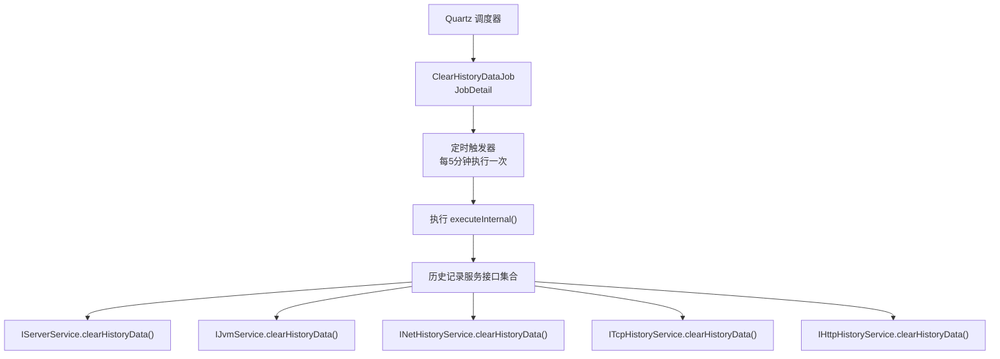
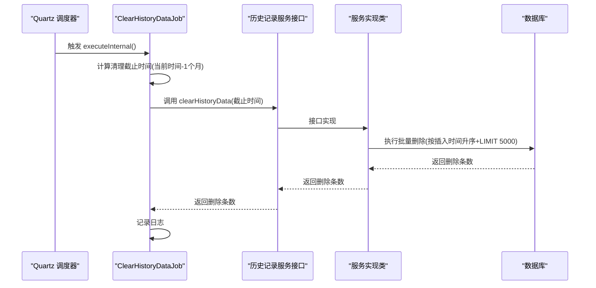
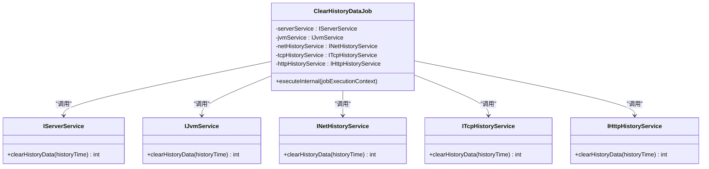
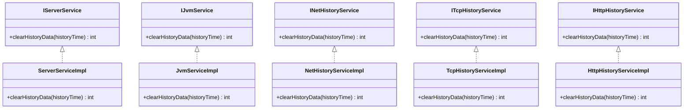
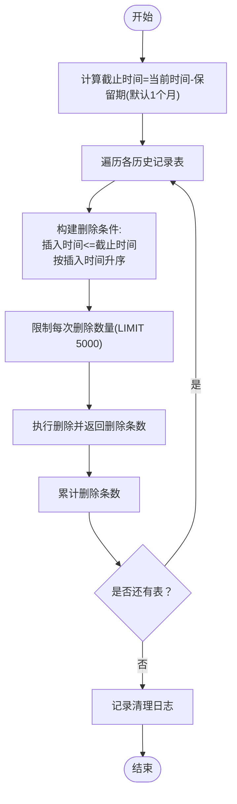
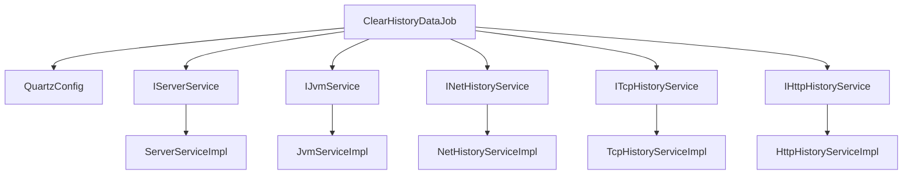

# 历史数据清理任务

<cite>
**本文档引用的文件**
- [ClearHistoryDataJob.java](file://phoenix-server/src/main/java/com/gitee/pifeng/monitoring/server/business/server/monitor/ClearHistoryDataJob.java)
- [QuartzConfig.java](file://phoenix-server/src/main/java/com/gitee/pifeng/monitoring/server/config/QuartzConfig.java)
- [IServerService.java](file://phoenix-server/src/main/java/com/gitee/pifeng/monitoring/server/business/server/service/IServerService.java)
- [IJvmService.java](file://phoenix-server/src/main/java/com/gitee/pifeng/monitoring/server/business/server/service/IJvmService.java)
- [INetHistoryService.java](file://phoenix-server/src/main/java/com/gitee/pifeng/monitoring/server/business/server/service/INetHistoryService.java)
- [ITcpHistoryService.java](file://phoenix-server/src/main/java/com/gitee/pifeng/monitoring/server/business/server/service/ITcpHistoryService.java)
- [IHttpHistoryService.java](file://phoenix-server/src/main/java/com/gitee/pifeng/monitoring/server/business/server/service/IHttpHistoryService.java)
- [ServerServiceImpl.java](file://phoenix-server/src/main/java/com/gitee/pifeng/monitoring/server/business/server/service/impl/ServerServiceImpl.java)
- [JvmServiceImpl.java](file://phoenix-server/src/main/java/com/gitee/pifeng/monitoring/server/business/server/service/impl/JvmServiceImpl.java)
- [NetHistoryServiceImpl.java](file://phoenix-server/src/main/java/com/gitee/pifeng/monitoring/server/business/server/service/impl/NetHistoryServiceImpl.java)
- [TcpHistoryServiceImpl.java](file://phoenix-server/src/main/java/com/gitee/pifeng/monitoring/server/business/server/service/impl/TcpHistoryServiceImpl.java)
- [HttpHistoryServiceImpl.java](file://phoenix-server/src/main/java/com/gitee/pifeng/monitoring/server/business/server/service/impl/HttpHistoryServiceImpl.java)
</cite>

## 目录
1. [简介](#简介)
2. [项目结构](#项目结构)
3. [核心组件](#核心组件)
4. [架构总览](#架构总览)
5. [详细组件分析](#详细组件分析)
6. [依赖关系分析](#依赖关系分析)
7. [性能考量](#性能考量)
8. [故障排查指南](#故障排查指南)
9. [结论](#结论)
10. [附录](#附录)

## 简介
本文件围绕历史数据清理任务进行系统化技术文档编制，重点解析 ClearHistoryDataJob 类的实现机制与数据库维护策略。历史数据清理是保障数据库健康运行的关键手段，能够优化查询性能、释放存储空间、减少冗余数据对业务的影响。本文将从清理逻辑、数据保留策略、批量删除、配置参数、性能影响、监控验证及最佳实践等方面进行全面阐述。

## 项目结构
历史数据清理任务位于服务端模块中，采用 Quartz 定时调度框架驱动，通过 Spring 组件装配各历史记录服务接口，统一执行批量清理操作。整体结构清晰，职责分离明确：

- 调度配置：QuartzConfig 中定义清理任务的 JobDetail 与 Trigger
- 任务执行：ClearHistoryDataJob 实现 QuartzJobBean 的 executeInternal 方法
- 服务接口：IServerService、IJvmService、INetHistoryService、ITcpHistoryService、IHttpHistoryService 提供统一清理入口
- 服务实现：各具体实现类按表维度执行批量删除

图表来源
- [QuartzConfig.java:318-357](file://phoenix-server/src/main/java/com/gitee/pifeng/monitoring/server/config/QuartzConfig.java#L318-L357)
- [ClearHistoryDataJob.java:68-86](file://phoenix-server/src/main/java/com/gitee/pifeng/monitoring/server/business/server/monitor/ClearHistoryDataJob.java#L68-L86)

章节来源
- [QuartzConfig.java:1-399](file://phoenix-server/src/main/java/com/gitee/pifeng/monitoring/server/config/QuartzConfig.java#L1-L399)
- [ClearHistoryDataJob.java:1-89](file://phoenix-server/src/main/java/com/gitee/pifeng/monitoring/server/business/server/monitor/ClearHistoryDataJob.java#L1-L89)

## 核心组件
- ClearHistoryDataJob：定时清理历史数据的 Quartz 任务，负责计算清理截止时间并调用各服务接口执行批量删除
- 各历史记录服务接口：定义统一的清理方法签名，便于集中调度与扩展
- 服务实现类：针对不同历史表执行带排序与限制的批量删除，避免一次性全量删除带来的锁竞争与长事务风险

章节来源
- [ClearHistoryDataJob.java:28-88](file://phoenix-server/src/main/java/com/gitee/pifeng/monitoring/server/business/server/monitor/ClearHistoryDataJob.java#L28-L88)
- [IServerService.java:53](file://phoenix-server/src/main/java/com/gitee/pifeng/monitoring/server/business/server/service/IServerService.java#L53)
- [IJvmService.java:40](file://phoenix-server/src/main/java/com/gitee/pifeng/monitoring/server/business/server/service/IJvmService.java#L40)
- [INetHistoryService.java:28](file://phoenix-server/src/main/java/com/gitee/pifeng/monitoring/server/business/server/service/INetHistoryService.java#L28)
- [ITcpHistoryService.java:28](file://phoenix-server/src/main/java/com/gitee/pifeng/monitoring/server/business/server/service/ITcpHistoryService.java#L28)
- [IHttpHistoryService.java:28](file://phoenix-server/src/main/java/com/gitee/pifeng/monitoring/server/business/server/service/IHttpHistoryService.java#L28)

## 架构总览
历史数据清理任务采用“调度器 → 任务 → 服务接口 → DAO 删除”的分层架构。调度器按固定周期触发任务，任务根据当前时间减去固定保留期生成清理截止时间，随后依次调用各服务接口执行批量删除，并记录清理条目数量的日志。

图表来源
- [ClearHistoryDataJob.java:68-86](file://phoenix-server/src/main/java/com/gitee/pifeng/monitoring/server/business/server/monitor/ClearHistoryDataJob.java#L68-L86)
- [ServerServiceImpl.java:304-342](file://phoenix-server/src/main/java/com/gitee/pifeng/monitoring/server/business/server/service/impl/ServerServiceImpl.java#L304-L342)
- [JvmServiceImpl.java:154-161](file://phoenix-server/src/main/java/com/gitee/pifeng/monitoring/server/business/server/service/impl/JvmServiceImpl.java#L154-L161)
- [NetHistoryServiceImpl.java:34-41](file://phoenix-server/src/main/java/com/gitee/pifeng/monitoring/server/business/server/service/impl/NetHistoryServiceImpl.java#L34-L41)
- [TcpHistoryServiceImpl.java:34-41](file://phoenix-server/src/main/java/com/gitee/pifeng/monitoring/server/business/server/service/impl/TcpHistoryServiceImpl.java#L34-L41)
- [HttpHistoryServiceImpl.java:34-40](file://phoenix-server/src/main/java/com/gitee/pifeng/monitoring/server/business/server/service/impl/HttpHistoryServiceImpl.java#L34-L40)

## 详细组件分析

### ClearHistoryDataJob 类分析
- 角色定位：Quartz 定时任务，负责在固定周期内统一触发各类历史记录清理
- 关键逻辑：
  - 计算清理截止时间：使用当前时间减去固定月数（默认1个月）
  - 逐项调用各服务接口的清理方法，传入截止时间
  - 记录每次清理返回的删除条目数量
  - 异常捕获：出现异常时记录错误日志，避免中断后续清理
- 并发控制：通过注解禁止并发执行，确保同一时刻仅有一个清理任务在运行

图表来源
- [ClearHistoryDataJob.java:28-88](file://phoenix-server/src/main/java/com/gitee/pifeng/monitoring/server/business/server/monitor/ClearHistoryDataJob.java#L28-L88)
- [IServerService.java:53](file://phoenix-server/src/main/java/com/gitee/pifeng/monitoring/server/business/server/service/IServerService.java#L53)
- [IJvmService.java:40](file://phoenix-server/src/main/java/com/gitee/pifeng/monitoring/server/business/server/service/IJvmService.java#L40)
- [INetHistoryService.java:28](file://phoenix-server/src/main/java/com/gitee/pifeng/monitoring/server/business/server/service/INetHistoryService.java#L28)
- [ITcpHistoryService.java:28](file://phoenix-server/src/main/java/com/gitee/pifeng/monitoring/server/business/server/service/ITcpHistoryService.java#L28)
- [IHttpHistoryService.java:28](file://phoenix-server/src/main/java/com/gitee/pifeng/monitoring/server/business/server/service/IHttpHistoryService.java#L28)

章节来源
- [ClearHistoryDataJob.java:68-86](file://phoenix-server/src/main/java/com/gitee/pifeng/monitoring/server/business/server/monitor/ClearHistoryDataJob.java#L68-L86)

### 各历史记录服务接口与实现
- 接口职责：统一定义清理方法，接收截止时间参数，返回删除条目数量
- 实现策略：均采用“按插入时间升序 + 限制删除数量”的方式，避免单次删除过大导致锁竞争与长事务

图表来源
- [IServerService.java:53](file://phoenix-server/src/main/java/com/gitee/pifeng/monitoring/server/business/server/service/IServerService.java#L53)
- [IJvmService.java:40](file://phoenix-server/src/main/java/com/gitee/pifeng/monitoring/server/business/server/service/IJvmService.java#L40)
- [INetHistoryService.java:28](file://phoenix-server/src/main/java/com/gitee/pifeng/monitoring/server/business/server/service/INetHistoryService.java#L28)
- [ITcpHistoryService.java:28](file://phoenix-server/src/main/java/com/gitee/pifeng/monitoring/server/business/server/service/ITcpHistoryService.java#L28)
- [IHttpHistoryService.java:28](file://phoenix-server/src/main/java/com/gitee/pifeng/monitoring/server/business/server/service/IHttpHistoryService.java#L28)
- [ServerServiceImpl.java:304-342](file://phoenix-server/src/main/java/com/gitee/pifeng/monitoring/server/business/server/service/impl/ServerServiceImpl.java#L304-L342)
- [JvmServiceImpl.java:154-161](file://phoenix-server/src/main/java/com/gitee/pifeng/monitoring/server/business/server/service/impl/JvmServiceImpl.java#L154-L161)
- [NetHistoryServiceImpl.java:34-41](file://phoenix-server/src/main/java/com/gitee/pifeng/monitoring/server/business/server/service/impl/NetHistoryServiceImpl.java#L34-L41)
- [TcpHistoryServiceImpl.java:34-41](file://phoenix-server/src/main/java/com/gitee/pifeng/monitoring/server/business/server/service/impl/TcpHistoryServiceImpl.java#L34-L41)
- [HttpHistoryServiceImpl.java:34-40](file://phoenix-server/src/main/java/com/gitee/pifeng/monitoring/server/business/server/service/impl/HttpHistoryServiceImpl.java#L34-L40)

章节来源
- [ServerServiceImpl.java:304-342](file://phoenix-server/src/main/java/com/gitee/pifeng/monitoring/server/business/server/service/impl/ServerServiceImpl.java#L304-L342)
- [JvmServiceImpl.java:154-161](file://phoenix-server/src/main/java/com/gitee/pifeng/monitoring/server/business/server/service/impl/JvmServiceImpl.java#L154-L161)
- [NetHistoryServiceImpl.java:34-41](file://phoenix-server/src/main/java/com/gitee/pifeng/monitoring/server/business/server/service/impl/NetHistoryServiceImpl.java#L34-L41)
- [TcpHistoryServiceImpl.java:34-41](file://phoenix-server/src/main/java/com/gitee/pifeng/monitoring/server/business/server/service/impl/TcpHistoryServiceImpl.java#L34-L41)
- [HttpHistoryServiceImpl.java:34-40](file://phoenix-server/src/main/java/com/gitee/pifeng/monitoring/server/business/server/service/impl/HttpHistoryServiceImpl.java#L34-L40)

### 清理流程与批量删除算法
- 流程要点：
  - 计算截止时间：当前时间减去固定保留期（默认1个月）
  - 对每个历史表执行“小于等于截止时间”的删除
  - 按插入时间升序排序，限制每次删除数量（默认5000条）
  - 累计返回删除总数
- 算法复杂度与性能：
  - 排序与限制：通过 ORDER BY + LIMIT 控制单次删除规模，降低锁持有时间
  - 分批执行：多次触发可逐步清空历史数据，避免长时间锁表

图表来源
- [ClearHistoryDataJob.java:70-82](file://phoenix-server/src/main/java/com/gitee/pifeng/monitoring/server/business/server/monitor/ClearHistoryDataJob.java#L70-L82)
- [ServerServiceImpl.java:306-341](file://phoenix-server/src/main/java/com/gitee/pifeng/monitoring/server/business/server/service/impl/ServerServiceImpl.java#L306-L341)
- [JvmServiceImpl.java:156-160](file://phoenix-server/src/main/java/com/gitee/pifeng/monitoring/server/business/server/service/impl/JvmServiceImpl.java#L156-L160)
- [NetHistoryServiceImpl.java:36-40](file://phoenix-server/src/main/java/com/gitee/pifeng/monitoring/server/business/server/service/impl/NetHistoryServiceImpl.java#L36-L40)
- [TcpHistoryServiceImpl.java:36-40](file://phoenix-server/src/main/java/com/gitee/pifeng/monitoring/server/business/server/service/impl/TcpHistoryServiceImpl.java#L36-L40)
- [HttpHistoryServiceImpl.java:35-39](file://phoenix-server/src/main/java/com/gitee/pifeng/monitoring/server/business/server/service/impl/HttpHistoryServiceImpl.java#L35-L39)

## 依赖关系分析
- 组件耦合：
  - ClearHistoryDataJob 依赖多个服务接口，体现高内聚、低耦合的设计
  - 各服务实现类独立封装删除逻辑，便于扩展新的历史表清理策略
- 外部依赖：
  - Quartz 调度框架负责任务触发与生命周期管理
  - MyBatis-Plus 提供条件构造器与分页能力，简化批量删除实现

图表来源
- [ClearHistoryDataJob.java:28-88](file://phoenix-server/src/main/java/com/gitee/pifeng/monitoring/server/business/server/monitor/ClearHistoryDataJob.java#L28-L88)
- [QuartzConfig.java:318-357](file://phoenix-server/src/main/java/com/gitee/pifeng/monitoring/server/config/QuartzConfig.java#L318-L357)
- [ServerServiceImpl.java:304-342](file://phoenix-server/src/main/java/com/gitee/pifeng/monitoring/server/business/server/service/impl/ServerServiceImpl.java#L304-L342)
- [JvmServiceImpl.java:154-161](file://phoenix-server/src/main/java/com/gitee/pifeng/monitoring/server/business/server/service/impl/JvmServiceImpl.java#L154-L161)
- [NetHistoryServiceImpl.java:34-41](file://phoenix-server/src/main/java/com/gitee/pifeng/monitoring/server/business/server/service/impl/NetHistoryServiceImpl.java#L34-L41)
- [TcpHistoryServiceImpl.java:34-41](file://phoenix-server/src/main/java/com/gitee/pifeng/monitoring/server/business/server/service/impl/TcpHistoryServiceImpl.java#L34-L41)
- [HttpHistoryServiceImpl.java:34-40](file://phoenix-server/src/main/java/com/gitee/pifeng/monitoring/server/business/server/service/impl/HttpHistoryServiceImpl.java#L34-L40)

章节来源
- [QuartzConfig.java:318-357](file://phoenix-server/src/main/java/com/gitee/pifeng/monitoring/server/config/QuartzConfig.java#L318-L357)

## 性能考量
- 清理时机选择：
  - 触发频率：默认每5分钟执行一次，兼顾清理及时性与系统负载
  - 建议：在业务低峰时段执行更密集的清理，或根据数据增长速率动态调整
- 批量操作优化：
  - 单次删除上限：限制每次删除5000条，降低锁竞争与长事务风险
  - 排序删除：按插入时间升序删除，有利于索引利用与一致性
- 数据库锁控制：
  - 通过分批删除与短事务策略，减少行级锁持有时间
  - 避免在清理过程中进行大范围全表扫描或全表删除
- 并发与幂等：
  - 任务禁并发执行，防止重复清理与资源争用
  - 清理条件基于截止时间，具备幂等特性

章节来源
- [QuartzConfig.java:347-356](file://phoenix-server/src/main/java/com/gitee/pifeng/monitoring/server/config/QuartzConfig.java#L347-L356)
- [ServerServiceImpl.java:306-341](file://phoenix-server/src/main/java/com/gitee/pifeng/monitoring/server/business/server/service/impl/ServerServiceImpl.java#L306-L341)
- [JvmServiceImpl.java:156-160](file://phoenix-server/src/main/java/com/gitee/pifeng/monitoring/server/business/server/service/impl/JvmServiceImpl.java#L156-L160)
- [NetHistoryServiceImpl.java:36-40](file://phoenix-server/src/main/java/com/gitee/pifeng/monitoring/server/business/server/service/impl/NetHistoryServiceImpl.java#L36-L40)
- [TcpHistoryServiceImpl.java:36-40](file://phoenix-server/src/main/java/com/gitee/pifeng/monitoring/server/business/server/service/impl/TcpHistoryServiceImpl.java#L36-L40)
- [HttpHistoryServiceImpl.java:35-39](file://phoenix-server/src/main/java/com/gitee/pifeng/monitoring/server/business/server/service/impl/HttpHistoryServiceImpl.java#L35-L39)

## 故障排查指南
- 常见问题与处理：
  - 清理未生效：检查 Quartz 触发器配置与任务是否成功注册；确认清理截止时间计算逻辑
  - 删除条数为零：确认历史表中是否存在超过保留期的数据；检查插入时间字段是否正确
  - 性能抖动：适当降低清理频率或增大单次删除上限；评估索引与查询条件
- 日志与监控：
  - 查看清理任务日志输出，核对每次清理返回的删除条数
  - 结合数据库慢查询日志与锁等待监控，定位潜在瓶颈
- 回滚与恢复：
  - 若清理策略不当导致误删，建议通过备份恢复或重新导入历史数据

章节来源
- [ClearHistoryDataJob.java:83-85](file://phoenix-server/src/main/java/com/gitee/pifeng/monitoring/server/business/server/monitor/ClearHistoryDataJob.java#L83-L85)

## 结论
历史数据清理任务通过 Quartz 调度与服务接口抽象，实现了对多类历史表的统一、可控、分批清理。其核心优势在于：保留期可配置、批量删除降低锁竞争、日志可观测、并发安全。结合合理的清理频率与监控验证，可在保证系统性能的同时维持数据库健康运行。

## 附录

### 配置参数说明
- 保留期（默认）：1个月
- 清理频率：每5分钟一次
- 单次删除上限：5000条
- 触发器表达式：每5分钟一次（cron 表达式）

章节来源
- [ClearHistoryDataJob.java:71-72](file://phoenix-server/src/main/java/com/gitee/pifeng/monitoring/server/business/server/monitor/ClearHistoryDataJob.java#L71-L72)
- [QuartzConfig.java:347-356](file://phoenix-server/src/main/java/com/gitee/pifeng/monitoring/server/config/QuartzConfig.java#L347-L356)

### 最佳实践与注意事项
- 保留期设置：根据业务需求与存储成本权衡，避免过短导致频繁清理、过长造成存储压力
- 清理窗口：尽量安排在业务低峰时段；若数据量较大，可考虑临时降低清理频率
- 监控与验证：定期检查清理日志与数据库容量变化；对关键历史表建立清理前后对比
- 扩展新表：新增历史表清理时，遵循现有接口与实现模式，保持一致的删除策略与日志规范