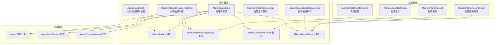
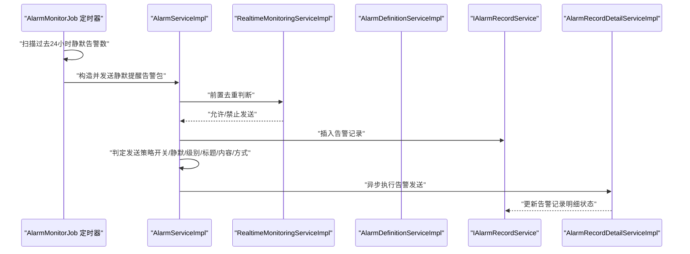
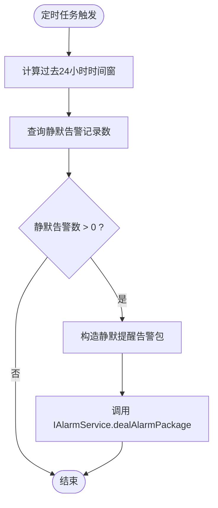
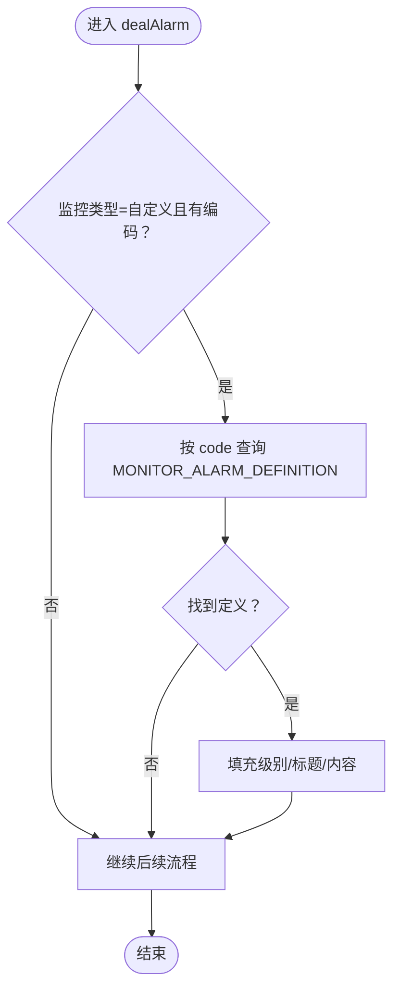
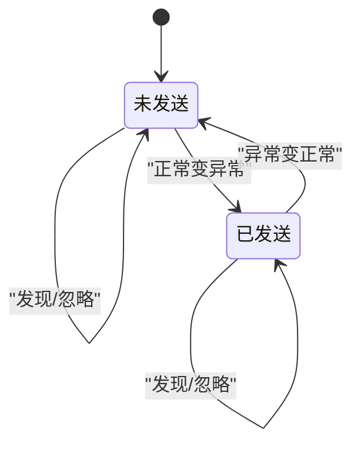
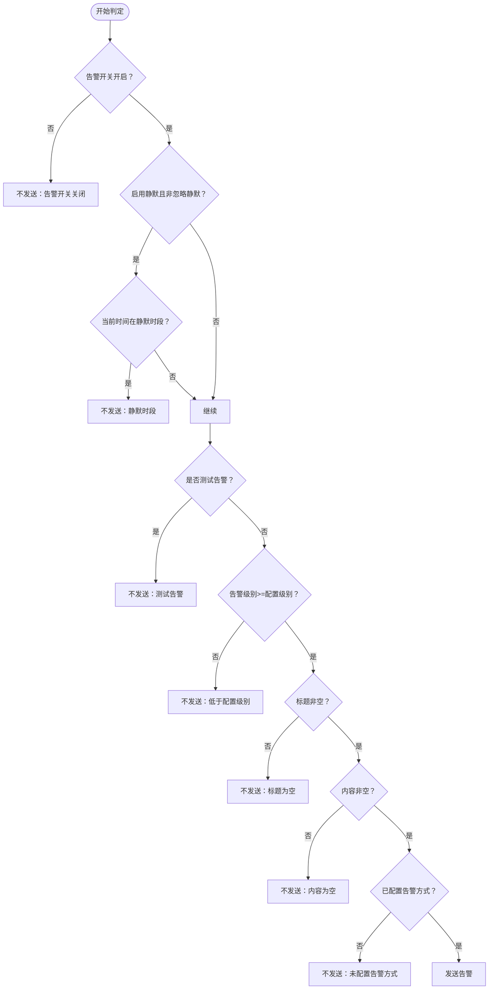
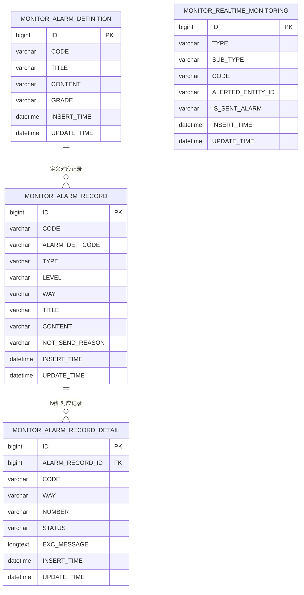
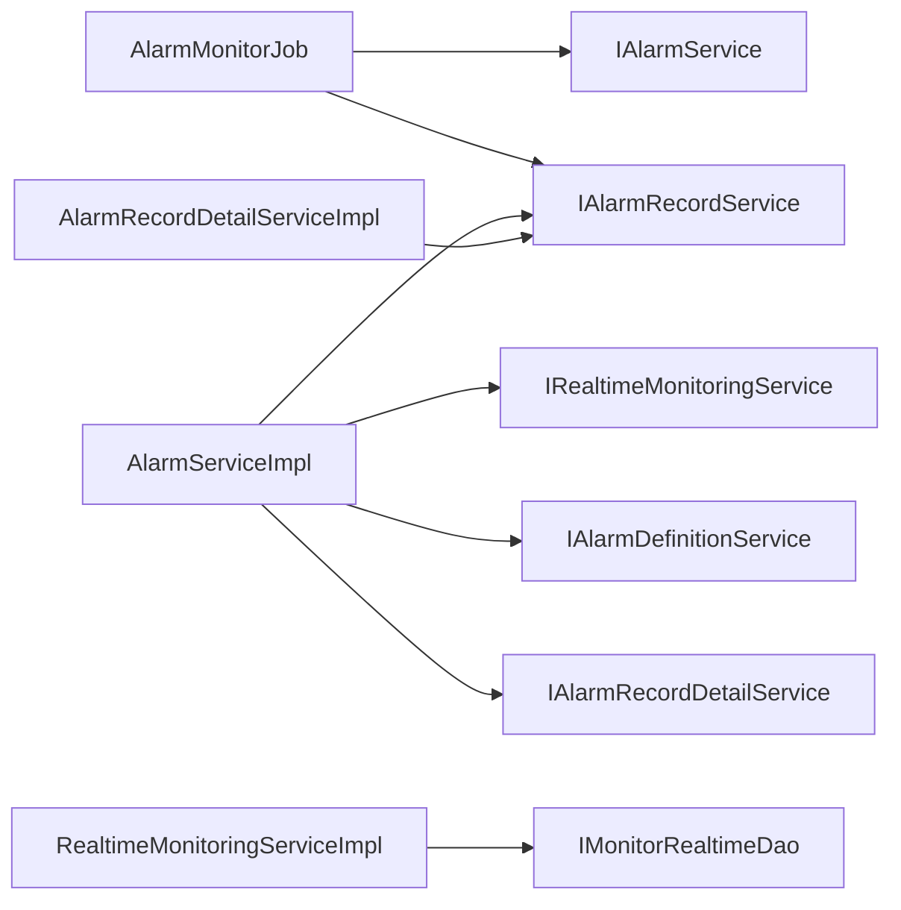

# 告警监控任务

<cite>
**本文引用的文件**
- [AlarmMonitorJob.java](file://phoenix-server/src/main/java/com/gitee/pifeng/monitoring/server/business/server/monitor/AlarmMonitorJob.java)
- [AlarmServiceImpl.java](file://phoenix-server/src/main/java/com/gitee/pifeng/monitoring/server/business/server/service/impl/AlarmServiceImpl.java)
- [IAlarmService.java](file://phoenix-server/src/main/java/com/gitee/pifeng/monitoring/server/business/server/service/IAlarmService.java)
- [IRealtimeMonitoringService.java](file://phoenix-server/src/main/java/com/gitee/pifeng/monitoring/server/business/server/service/IRealtimeMonitoringService.java)
- [RealtimeMonitoringServiceImpl.java](file://phoenix-server/src/main/java/com/gitee/pifeng/monitoring/server/business/server/service/impl/RealtimeMonitoringServiceImpl.java)
- [Alarm.java](file://phoenix-common/phoenix-common-core/src/main/java/com/gitee/pifeng/monitoring/common/domain/Alarm.java)
- [AlarmLevelEnums.java](file://phoenix-common/phoenix-common-core/src/main/java/com/gitee/pifeng/monitoring/common/constant/alarm/AlarmLevelEnums.java)
- [AlarmReasonEnums.java](file://phoenix-common/phoenix-common-core/src/main/java/com/gitee/pifeng/monitoring/common/constant/alarm/AlarmReasonEnums.java)
- [MonitorAlarmDefinition.java](file://phoenix-server/src/main/java/com/gitee/pifeng/monitoring/server/business/server/entity/MonitorAlarmDefinition.java)
- [MonitorAlarmRecord.java](file://phoenix-server/src/main/java/com/gitee/pifeng/monitoring/server/business/server/entity/MonitorAlarmRecord.java)
- [MonitorAlarmRecordDetail.java](file://phoenix-server/src/main/java/com/gitee/pifeng/monitoring/server/business/server/entity/MonitorAlarmRecordDetail.java)
- [AlarmDefinitionServiceImpl.java](file://phoenix-server/src/main/java/com/gitee/pifeng/monitoring/server/business/server/service/impl/AlarmDefinitionServiceImpl.java)
- [IAlarmDefinitionService.java](file://phoenix-server/src/main/java/com/gitee/pifeng/monitoring/server/business/server/service/IAlarmDefinitionService.java)
- [AlarmRecordDetailServiceImpl.java](file://phoenix-server/src/main/java/com/gitee/pifeng/monitoring/server/business/server/service/impl/AlarmRecordDetailServiceImpl.java)
- [IAlarmRecordService.java](file://phoenix-server/src/main/java/com/gitee/pifeng/monitoring/server/business/server/service/IAlarmRecordService.java)
- [phoenix.sql](file://doc/数据库设计/sql/mysql/phoenix.sql)
</cite>

## 目录
1. [简介](#简介)
2. [项目结构](#项目结构)
3. [核心组件](#核心组件)
4. [架构总览](#架构总览)
5. [详细组件分析](#详细组件分析)
6. [依赖关系分析](#依赖关系分析)
7. [性能考量](#性能考量)
8. [故障排查指南](#故障排查指南)
9. [结论](#结论)
10. [附录](#附录)

## 简介
本技术文档围绕告警监控任务展开，重点阐述 AlarmMonitorJob 类的实现机制与工作原理，涵盖以下方面：
- 告警规则监控：基于数据库表 MONITOR_ALARM_RECORD 的定时扫描与静默告警提醒。
- 告警状态跟踪：通过 MONITOR_REALTIME_MONITORING 表实现去重与状态流转控制。
- 告警历史管理：通过 MONITOR_ALARM_RECORD 与 MONITOR_ALARM_RECORD_DETAIL 记录告警历史与发送明细。
- 动态规则加载：自定义业务告警支持通过告警编码从 MONITOR_ALARM_DEFINITION 动态加载规则。
- 触发条件判断：结合配置开关、静默时段、告警级别阈值、标题/内容完整性、告警方式配置等综合判定。
- 协作关系：AlarmMonitorJob 作为定时任务与其他监控任务协同，接收来自各监控任务的告警信号并统一处理。
- 配置管理：告警开关、静默时段、告警级别、告警模板与通知渠道等配置项。
- 调试与维护：日志分析、规则有效性校验、性能监控与问题定位。

## 项目结构
告警监控相关代码主要分布在以下模块与包中：
- 服务器端监控任务与服务：phoenix-server
- 通用领域模型与常量：phoenix-common
- 数据库脚本与实体映射：doc/数据库设计/sql/mysql/phoenix.sql 与对应实体类

图表来源
- [AlarmMonitorJob.java:1-127](file://phoenix-server/src/main/java/com/gitee/pifeng/monitoring/server/business/server/monitor/AlarmMonitorJob.java#L1-L127)
- [AlarmServiceImpl.java:1-304](file://phoenix-server/src/main/java/com/gitee/pifeng/monitoring/server/business/server/service/impl/AlarmServiceImpl.java#L1-L304)
- [RealtimeMonitoringServiceImpl.java:1-161](file://phoenix-server/src/main/java/com/gitee/pifeng/monitoring/server/business/server/service/impl/RealtimeMonitoringServiceImpl.java#L1-L161)
- [AlarmDefinitionServiceImpl.java:1-19](file://phoenix-server/src/main/java/com/gitee/pifeng/monitoring/server/business/server/service/impl/AlarmDefinitionServiceImpl.java#L1-L19)
- [AlarmRecordDetailServiceImpl.java:113-138](file://phoenix-server/src/main/java/com/gitee/pifeng/monitoring/server/business/server/service/impl/AlarmRecordDetailServiceImpl.java#L113-L138)
- [Alarm.java:1-117](file://phoenix-common/phoenix-common-core/src/main/java/com/gitee/pifeng/monitoring/common/domain/Alarm.java#L1-L117)
- [AlarmLevelEnums.java:1-118](file://phoenix-common/phoenix-common-core/src/main/java/com/gitee/pifeng/monitoring/common/constant/alarm/AlarmLevelEnums.java#L1-L118)
- [AlarmReasonEnums.java:1-34](file://phoenix-common/phoenix-common-core/src/main/java/com/gitee/pifeng/monitoring/common/constant/alarm/AlarmReasonEnums.java#L1-L34)
- [MonitorAlarmDefinition.java:1-95](file://phoenix-server/src/main/java/com/gitee/pifeng/monitoring/server/business/server/entity/MonitorAlarmDefinition.java#L1-L95)
- [MonitorAlarmRecord.java:1-93](file://phoenix-server/src/main/java/com/gitee/pifeng/monitoring/server/business/server/entity/MonitorAlarmRecord.java#L1-L93)
- [MonitorAlarmRecordDetail.java:1-84](file://phoenix-server/src/main/java/com/gitee/pifeng/monitoring/server/business/server/entity/MonitorAlarmRecordDetail.java#L1-L84)

章节来源
- [AlarmMonitorJob.java:1-127](file://phoenix-server/src/main/java/com/gitee/pifeng/monitoring/server/business/server/monitor/AlarmMonitorJob.java#L1-L127)
- [AlarmServiceImpl.java:1-304](file://phoenix-server/src/main/java/com/gitee/pifeng/monitoring/server/business/server/service/impl/AlarmServiceImpl.java#L1-L304)
- [RealtimeMonitoringServiceImpl.java:1-161](file://phoenix-server/src/main/java/com/gitee/pifeng/monitoring/server/business/server/service/impl/RealtimeMonitoringServiceImpl.java#L1-L161)

## 核心组件
- AlarmMonitorJob：基于 Quartz 的定时任务，每周期扫描数据库中过去24小时的静默告警记录数，若存在则发送“静默告警提醒”通知。
- AlarmServiceImpl：告警处理的核心服务，负责前置去重判断、规则解析（自定义业务告警）、告警记录入库、发送策略判定与异步发送。
- RealtimeMonitoringServiceImpl：前置去重与状态跟踪，通过分布式锁与实时监控表实现同一监控对象的状态一致性与去重。
- Alarm 领域对象：承载告警级别、原因、类型、子类型、标题、内容、编码、被告警主体ID、是否测试、是否忽略静默等字段。
- 告警枚举：AlarmLevelEnums、AlarmReasonEnums 提供告警级别的比较与告警原因的语义化标识。
- 数据模型：MonitorAlarmDefinition（告警定义）、MonitorAlarmRecord（告警记录）、MonitorAlarmRecordDetail（告警记录明细）、MonitorRealtimeMonitoring（实时监控）。

章节来源
- [AlarmMonitorJob.java:37-86](file://phoenix-server/src/main/java/com/gitee/pifeng/monitoring/server/business/server/monitor/AlarmMonitorJob.java#L37-L86)
- [AlarmServiceImpl.java:86-170](file://phoenix-server/src/main/java/com/gitee/pifeng/monitoring/server/business/server/service/impl/AlarmServiceImpl.java#L86-L170)
- [RealtimeMonitoringServiceImpl.java:55-139](file://phoenix-server/src/main/java/com/gitee/pifeng/monitoring/server/business/server/service/impl/RealtimeMonitoringServiceImpl.java#L55-L139)
- [Alarm.java:28-116](file://phoenix-common/phoenix-common-core/src/main/java/com/gitee/pifeng/monitoring/common/domain/Alarm.java#L28-L116)
- [AlarmLevelEnums.java:13-81](file://phoenix-common/phoenix-common-core/src/main/java/com/gitee/pifeng/monitoring/common/constant/alarm/AlarmLevelEnums.java#L13-L81)
- [AlarmReasonEnums.java:11-32](file://phoenix-common/phoenix-common-core/src/main/java/com/gitee/pifeng/monitoring/common/constant/alarm/AlarmReasonEnums.java#L11-L32)
- [MonitorAlarmDefinition.java:27-94](file://phoenix-server/src/main/java/com/gitee/pifeng/monitoring/server/business/server/entity/MonitorAlarmDefinition.java#L27-L94)
- [MonitorAlarmRecord.java:24-92](file://phoenix-server/src/main/java/com/gitee/pifeng/monitoring/server/business/server/entity/MonitorAlarmRecord.java#L24-L92)
- [MonitorAlarmRecordDetail.java:27-83](file://phoenix-server/src/main/java/com/gitee/pifeng/monitoring/server/business/server/entity/MonitorAlarmRecordDetail.java#L27-L83)

## 架构总览
告警监控任务的整体工作流如下：
- 定时任务 AlarmMonitorJob 周期性扫描静默告警记录，触发“静默提醒”通知。
- 告警包由上层监控任务构建并通过 IAlarmService.dealAlarmPackage 传入。
- AlarmServiceImpl 执行前置去重判断、动态规则加载、记录入库与发送策略判定。
- RealtimeMonitoringServiceImpl 通过分布式锁与实时监控表实现去重与状态变更。
- 告警发送通过线程池异步执行，写入告警记录明细表并更新发送状态。

图表来源
- [AlarmMonitorJob.java:70-86](file://phoenix-server/src/main/java/com/gitee/pifeng/monitoring/server/business/server/monitor/AlarmMonitorJob.java#L70-L86)
- [AlarmServiceImpl.java:105-170](file://phoenix-server/src/main/java/com/gitee/pifeng/monitoring/server/business/server/service/impl/AlarmServiceImpl.java#L105-L170)
- [RealtimeMonitoringServiceImpl.java:55-139](file://phoenix-server/src/main/java/com/gitee/pifeng/monitoring/server/business/server/service/impl/RealtimeMonitoringServiceImpl.java#L55-L139)
- [AlarmRecordDetailServiceImpl.java:113-138](file://phoenix-server/src/main/java/com/gitee/pifeng/monitoring/server/business/server/service/impl/AlarmRecordDetailServiceImpl.java#L113-L138)

## 详细组件分析

### AlarmMonitorJob 组件分析
- 职责：定时扫描数据库中过去24小时的静默告警记录数，若大于0，则发送“静默告警提醒”通知。
- 关键点：
  - 使用 Quartz 的 @DisallowConcurrentExecution 防止并发执行。
  - 通过 IAlarmRecordService.getSilenceAlarmCount 获取静默告警数量。
  - 通过 sendAlarmInfo 构造并发送告警包，使用 IGNORE 级别与 CUSTOM 类型。
- 与其他组件的关系：依赖 IAlarmService 与 IAlarmRecordService，间接依赖 MonitoringConfigPropertiesLoader 与 ServerPackageConstructor。

图表来源
- [AlarmMonitorJob.java:70-86](file://phoenix-server/src/main/java/com/gitee/pifeng/monitoring/server/business/server/monitor/AlarmMonitorJob.java#L70-L86)
- [AlarmMonitorJob.java:103-125](file://phoenix-server/src/main/java/com/gitee/pifeng/monitoring/server/business/server/monitor/AlarmMonitorJob.java#L103-L125)

章节来源
- [AlarmMonitorJob.java:37-86](file://phoenix-server/src/main/java/com/gitee/pifeng/monitoring/server/business/server/monitor/AlarmMonitorJob.java#L37-L86)
- [AlarmMonitorJob.java:103-125](file://phoenix-server/src/main/java/com/gitee/pifeng/monitoring/server/business/server/monitor/AlarmMonitorJob.java#L103-L125)

### 告警规则解析与动态加载
- 自定义业务告警（MonitorTypeEnums.CUSTOM）支持通过告警编码 code 从 MONITOR_ALARM_DEFINITION 动态加载规则：
  - 告警级别（grade）覆盖默认级别。
  - 告警标题（title）与内容（content）覆盖默认值。
- 加载逻辑在 AlarmServiceImpl.dealAlarm 中完成，使用 IAlarmDefinitionService 查询并回填 Alarm 对象。

图表来源
- [AlarmServiceImpl.java:121-149](file://phoenix-server/src/main/java/com/gitee/pifeng/monitoring/server/business/server/service/impl/AlarmServiceImpl.java#L121-L149)
- [IAlarmDefinitionService.java:1-15](file://phoenix-server/src/main/java/com/gitee/pifeng/monitoring/server/business/server/service/IAlarmDefinitionService.java#L1-L15)
- [AlarmDefinitionServiceImpl.java:1-19](file://phoenix-server/src/main/java/com/gitee/pifeng/monitoring/server/business/server/service/impl/AlarmDefinitionServiceImpl.java#L1-L19)
- [MonitorAlarmDefinition.java:27-94](file://phoenix-server/src/main/java/com/gitee/pifeng/monitoring/server/business/server/entity/MonitorAlarmDefinition.java#L27-L94)

章节来源
- [AlarmServiceImpl.java:121-149](file://phoenix-server/src/main/java/com/gitee/pifeng/monitoring/server/business/server/service/impl/AlarmServiceImpl.java#L121-L149)
- [IAlarmDefinitionService.java:1-15](file://phoenix-server/src/main/java/com/gitee/pifeng/monitoring/server/business/server/service/IAlarmDefinitionService.java#L1-L15)
- [AlarmDefinitionServiceImpl.java:1-19](file://phoenix-server/src/main/java/com/gitee/pifeng/monitoring/server/business/server/service/impl/AlarmDefinitionServiceImpl.java#L1-L19)
- [MonitorAlarmDefinition.java:27-94](file://phoenix-server/src/main/java/com/gitee/pifeng/monitoring/server/business/server/entity/MonitorAlarmDefinition.java#L27-L94)

### 告警去重与状态跟踪
- 去重策略：
  - 通过分布式锁（MySQL 实现）保证同一监控对象在同一时刻仅有一个判断在执行。
  - 使用 MONITOR_REALTIME_MONITORING 表记录每个监控对象的告警状态（是否已发送）。
- 状态流转：
  - 正常变异常：允许发送且标记已发送。
  - 异常变正常：仅在已发送状态下允许发送。
  - 发现（DISCOVERY）：允许发送。
  - 忽略（IGNORE）：直接放行。
- 并发与性能：
  - 锁等待与过期时间控制在安全范围内，避免长时间占用。
  - 超过临界值的耗时会输出警告日志。

图表来源
- [RealtimeMonitoringServiceImpl.java:55-139](file://phoenix-server/src/main/java/com/gitee/pifeng/monitoring/server/business/server/service/impl/RealtimeMonitoringServiceImpl.java#L55-L139)
- [MonitorRealtimeMonitoring.java:42-64](file://phoenix-ui/src/main/java/com/gitee/pifeng/monitoring/ui/business/web/entity/MonitorRealtimeMonitoring.java#L42-L64)

章节来源
- [RealtimeMonitoringServiceImpl.java:55-139](file://phoenix-server/src/main/java/com/gitee/pifeng/monitoring/server/business/server/service/impl/RealtimeMonitoringServiceImpl.java#L55-L139)
- [MonitorRealtimeMonitoring.java:42-64](file://phoenix-ui/src/main/java/com/gitee/pifeng/monitoring/ui/business/web/entity/MonitorRealtimeMonitoring.java#L42-L64)

### 告警触发条件与发送策略
- 发送策略判定（isSendAlarm）：
  - 告警开关是否开启。
  - 是否启用静默时段且当前不在忽略静默模式。
  - 是否为测试告警。
  - 告警级别是否达到配置阈值。
  - 告警标题与内容是否非空。
  - 是否配置了告警方式。
- 判定结果将写入告警记录的“不发送原因”字段，便于后续审计与排查。

图表来源
- [AlarmServiceImpl.java:206-284](file://phoenix-server/src/main/java/com/gitee/pifeng/monitoring/server/business/server/service/impl/AlarmServiceImpl.java#L206-L284)

章节来源
- [AlarmServiceImpl.java:206-284](file://phoenix-server/src/main/java/com/gitee/pifeng/monitoring/server/business/server/service/impl/AlarmServiceImpl.java#L206-L284)

### 告警历史管理
- 告警记录（MONITOR_ALARM_RECORD）：
  - 记录告警代码、告警定义编码、类型、级别、方式、标题、内容、不发送原因、时间戳。
- 告警记录明细（MONITOR_ALARM_RECORD_DETAIL）：
  - 记录每种告警方式的发送状态、接收人、异常信息、发送时间与更新时间。
- 历史管理流程：
  - 无论是否发送，均先插入告警记录。
  - 若满足发送条件，异步执行发送并将结果写入明细表。
  - 通过数据库外键约束与索引保障查询效率与数据一致性。

图表来源
- [MonitorAlarmDefinition.java:27-94](file://phoenix-server/src/main/java/com/gitee/pifeng/monitoring/server/business/server/entity/MonitorAlarmDefinition.java#L27-L94)
- [MonitorAlarmRecord.java:24-92](file://phoenix-server/src/main/java/com/gitee/pifeng/monitoring/server/business/server/entity/MonitorAlarmRecord.java#L24-L92)
- [MonitorAlarmRecordDetail.java:27-83](file://phoenix-server/src/main/java/com/gitee/pifeng/monitoring/server/business/server/entity/MonitorAlarmRecordDetail.java#L27-L83)
- [phoenix.sql:76-89](file://doc/数据库设计/sql/mysql/phoenix.sql#L76-L89)

章节来源
- [MonitorAlarmDefinition.java:27-94](file://phoenix-server/src/main/java/com/gitee/pifeng/monitoring/server/business/server/entity/MonitorAlarmDefinition.java#L27-L94)
- [MonitorAlarmRecord.java:24-92](file://phoenix-server/src/main/java/com/gitee/pifeng/monitoring/server/business/server/entity/MonitorAlarmRecord.java#L24-L92)
- [MonitorAlarmRecordDetail.java:27-83](file://phoenix-server/src/main/java/com/gitee/pifeng/monitoring/server/business/server/entity/MonitorAlarmRecordDetail.java#L27-L83)
- [phoenix.sql:76-89](file://doc/数据库设计/sql/mysql/phoenix.sql#L76-L89)

### 与其他监控任务的协作关系
- AlarmMonitorJob 作为独立的定时任务，不直接参与具体监控指标采集，而是接收来自各监控任务的告警信号。
- 各监控任务在检测到异常或状态变化后，通过统一的告警通道（AlarmServiceImpl）提交告警包，由其完成去重、规则解析与发送。
- 协作要点：
  - 统一的告警领域对象与枚举，确保跨任务的一致性。
  - 前置去重与分布式锁，避免重复告警。
  - 动态规则加载，支持多任务共享一套告警模板与级别。

章节来源
- [AlarmServiceImpl.java:105-170](file://phoenix-server/src/main/java/com/gitee/pifeng/monitoring/server/business/server/service/impl/AlarmServiceImpl.java#L105-L170)
- [RealtimeMonitoringServiceImpl.java:55-139](file://phoenix-server/src/main/java/com/gitee/pifeng/monitoring/server/business/server/service/impl/RealtimeMonitoringServiceImpl.java#L55-L139)

### 配置管理
- 告警开关与静默时段：
  - 通过配置加载器读取开关、静默起止时间，用于 isSendAlarm 判定。
- 告警级别阈值：
  - AlarmLevelEnums 提供级别比较逻辑，支持 IGNORE/INFO/WARN/ERROR/FATAL 的层级关系。
- 告警模板与通知渠道：
  - 自定义业务告警可通过告警编码从数据库加载模板。
  - 告警方式（如短信、邮件）在明细表中体现，发送状态与异常信息可追踪。

章节来源
- [AlarmServiceImpl.java:206-284](file://phoenix-server/src/main/java/com/gitee/pifeng/monitoring/server/business/server/service/impl/AlarmServiceImpl.java#L206-L284)
- [AlarmLevelEnums.java:51-81](file://phoenix-common/phoenix-common-core/src/main/java/com/gitee/pifeng/monitoring/common/constant/alarm/AlarmLevelEnums.java#L51-L81)
- [AlarmRecordDetailServiceImpl.java:123-138](file://phoenix-server/src/main/java/com/gitee/pifeng/monitoring/server/business/server/service/impl/AlarmRecordDetailServiceImpl.java#L123-L138)

## 依赖关系分析
- AlarmMonitorJob 依赖 IAlarmService 与 IAlarmRecordService，间接依赖配置加载器与包构造器。
- AlarmServiceImpl 依赖：
  - IRealtimeMonitoringService（前置去重）
  - IAlarmDefinitionService（动态规则）
  - IAlarmRecordService（记录入库）
  - IAlarmRecordDetailService（发送执行）
  - 线程池（异步发送）
- RealtimeMonitoringServiceImpl 依赖：
  - MySQL 分布式锁
  - 实时监控 DAO 与实体
- 数据模型之间通过外键关联，明细表依赖告警记录表。

图表来源
- [AlarmMonitorJob.java:37-61](file://phoenix-server/src/main/java/com/gitee/pifeng/monitoring/server/business/server/monitor/AlarmMonitorJob.java#L37-L61)
- [AlarmServiceImpl.java:37-74](file://phoenix-server/src/main/java/com/gitee/pifeng/monitoring/server/business/server/service/impl/AlarmServiceImpl.java#L37-L74)
- [RealtimeMonitoringServiceImpl.java:37-44](file://phoenix-server/src/main/java/com/gitee/pifeng/monitoring/server/business/server/service/impl/RealtimeMonitoringServiceImpl.java#L37-L44)

章节来源
- [AlarmMonitorJob.java:37-61](file://phoenix-server/src/main/java/com/gitee/pifeng/monitoring/server/business/server/monitor/AlarmMonitorJob.java#L37-L61)
- [AlarmServiceImpl.java:37-74](file://phoenix-server/src/main/java/com/gitee/pifeng/monitoring/server/business/server/service/impl/AlarmServiceImpl.java#L37-L74)
- [RealtimeMonitoringServiceImpl.java:37-44](file://phoenix-server/src/main/java/com/gitee/pifeng/monitoring/server/business/server/service/impl/RealtimeMonitoringServiceImpl.java#L37-L44)

## 性能考量
- 去重前置判断：
  - 使用分布式锁与数据库查询，注意锁超时与事务时长控制，避免长时间占用。
  - 超过临界值的耗时会输出警告日志，建议优化热点键与索引。
- 异步发送：
  - 通过线程池异步执行告警发送，降低主流程阻塞风险。
- 定时任务频率：
  - AlarmMonitorJob 周期性扫描静默告警，建议根据业务量合理设置周期，避免频繁全表扫描。
- 数据库索引与约束：
  - 明细表对告警记录ID、告警方式建立索引，有助于快速查询与去重。

## 故障排查指南
- 日志分析：
  - 关注前置去重与发送策略判定的日志，定位“不发送原因”。
  - 异步发送异常会记录错误日志，检查异常信息与发送状态。
- 规则有效性验证：
  - 自定义业务告警需确保告警编码在数据库中存在对应定义，否则级别/标题/内容将无法回填。
- 性能监控：
  - 监控前置判断耗时，超过临界值时需优化锁竞争与查询路径。
  - 关注静默告警提醒的触发频率，避免误报或漏报。

章节来源
- [AlarmServiceImpl.java:296-302](file://phoenix-server/src/main/java/com/gitee/pifeng/monitoring/server/business/server/service/impl/AlarmServiceImpl.java#L296-L302)
- [RealtimeMonitoringServiceImpl.java:154-158](file://phoenix-server/src/main/java/com/gitee/pifeng/monitoring/server/business/server/service/impl/RealtimeMonitoringServiceImpl.java#L154-L158)
- [AlarmRecordDetailServiceImpl.java:188-190](file://phoenix-server/src/main/java/com/gitee/pifeng/monitoring/server/business/server/service/impl/AlarmRecordDetailServiceImpl.java#L188-L190)

## 结论
AlarmMonitorJob 作为告警监控任务的定时扫描器，配合 AlarmServiceImpl 的规则解析与发送策略、RealtimeMonitoringServiceImpl 的去重与状态跟踪，形成了完整的告警闭环。通过数据库驱动的告警定义与明细表，系统实现了灵活的规则管理与可观测的历史追踪。建议在高并发场景下进一步优化分布式锁与查询路径，并完善告警模板与通知渠道的配置管理。

## 附录
- 数据库表结构参考：phoenix.sql
- 告警领域对象与枚举：Alarm.java、AlarmLevelEnums.java、AlarmReasonEnums.java
- 实体类映射：MonitorAlarmDefinition.java、MonitorAlarmRecord.java、MonitorAlarmRecordDetail.java、MonitorRealtimeMonitoring.java