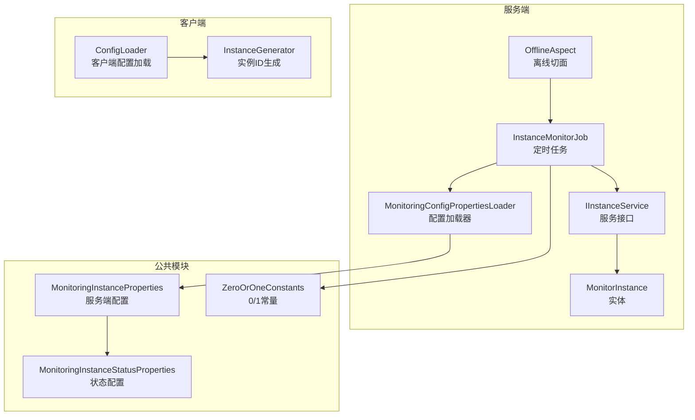
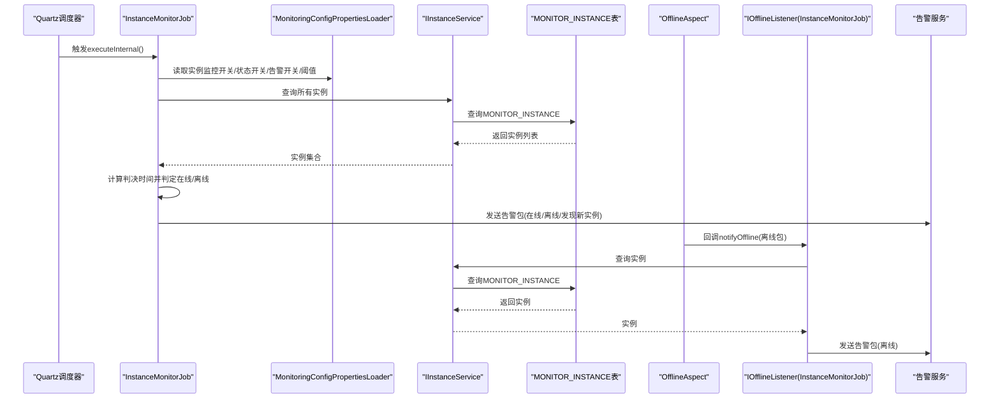
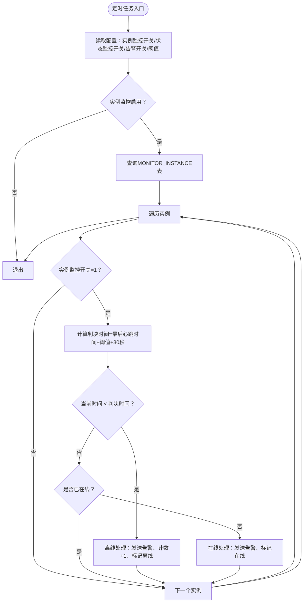
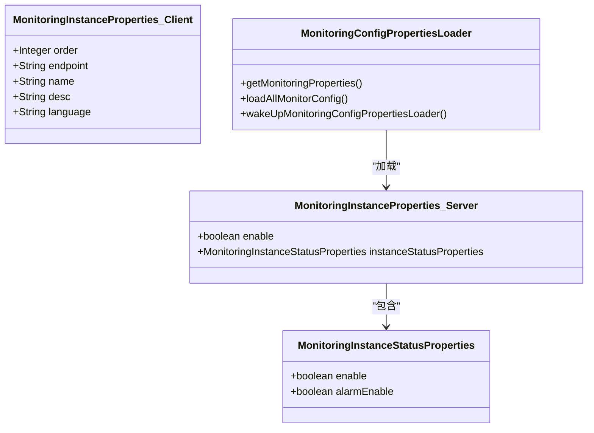
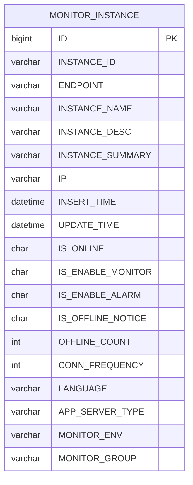
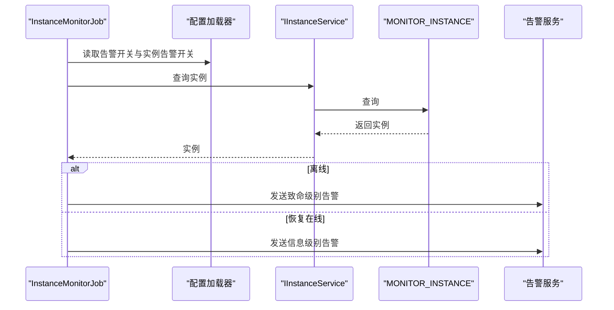
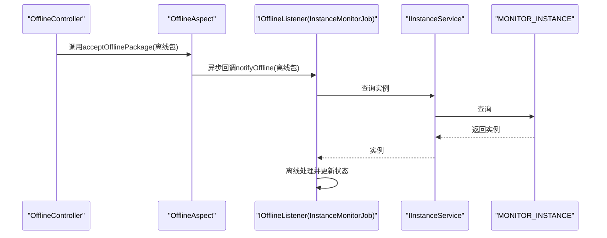
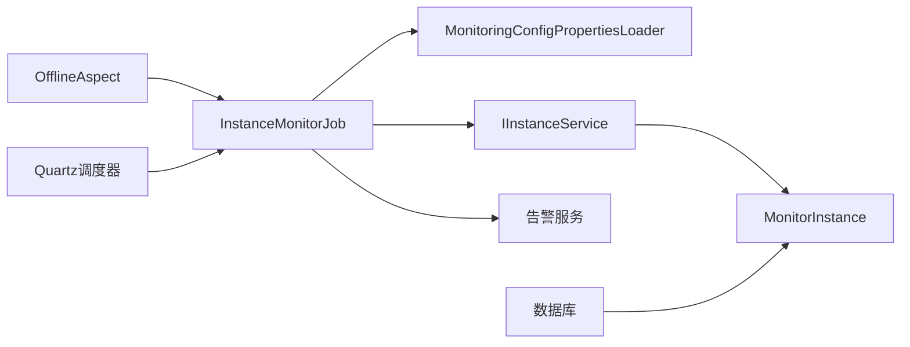

# 实例监控任务

<cite>
**本文引用的文件**
- [InstanceMonitorJob.java](file://phoenix-server/src/main/java/com/gitee/pifeng/monitoring/server/business/server/monitor/instance/InstanceMonitorJob.java)
- [MonitoringConfigPropertiesLoader.java](file://phoenix-server/src/main/java/com/gitee/pifeng/monitoring/server/business/server/core/MonitoringConfigPropertiesLoader.java)
- [MonitorInstance.java](file://phoenix-server/src/main/java/com/gitee/pifeng/monitoring/server/business/server/entity/MonitorInstance.java)
- [IInstanceService.java](file://phoenix-server/src/main/java/com/gitee/pifeng/monitoring/server/business/server/service/IInstanceService.java)
- [OfflineAspect.java](file://phoenix-server/src/main/java/com/gitee/pifeng/monitoring/server/business/server/component/OfflineAspect.java)
- [application.yml](file://phoenix-server/src/main/resources/application.yml)
- [MonitoringInstanceProperties.java（服务端）](file://phoenix-common/src/main/java/com/gitee/pifeng/monitoring/common/property/server/MonitoringInstanceProperties.java)
- [MonitoringInstanceStatusProperties.java](file://phoenix-common/src/main/java/com/gitee/pifeng/monitoring/common/property/server/MonitoringInstanceStatusProperties.java)
- [MonitoringInstanceProperties.java（客户端）](file://phoenix-common/src/main/java/com/gitee/pifeng/monitoring/common/property/client/MonitoringInstanceProperties.java)
- [ConfigLoader.java](file://phoenix-client/phoenix-client-core/src/main/java/com/gitee/pifeng/monitoring/plug/core/ConfigLoader.java)
- [ZeroOrOneConstants.java](file://phoenix-common/src/main/java/com/gitee/pifeng/monitoring/common/constant/ZeroOrOneConstants.java)
</cite>

## 目录
1. [简介](#简介)
2. [项目结构](#项目结构)
3. [核心组件](#核心组件)
4. [架构总览](#架构总览)
5. [详细组件分析](#详细组件分析)
6. [依赖关系分析](#依赖关系分析)
7. [性能考量](#性能考量)
8. [故障排查指南](#故障排查指南)
9. [结论](#结论)
10. [附录](#附录)

## 简介
本文件围绕实例监控任务展开，系统性阐述 InstanceMonitorJob 类的实现机制与职责边界，涵盖应用实例监控的范围、数据采集与判定流程、告警机制、配置参数、性能影响与故障诊断方法。InstanceMonitorJob 作为基于 Quartz 的定时任务，负责周期性扫描数据库中的应用实例，结合心跳时间与阈值计算，判定实例在线/离线状态并触发告警；同时通过切面监听离线事件包，实现即时离线回调。

## 项目结构
- 服务端模块（phoenix-server）包含实例监控任务、配置加载器、实体与服务接口、以及 Quartz 调度配置。
- 公共模块（phoenix-common）提供监控配置属性模型与常量。
- 客户端模块（phoenix-client）提供实例侧配置加载与实例标识生成能力。

图表来源
- [InstanceMonitorJob.java:53-397](file://phoenix-server/src/main/java/com/gitee/pifeng/monitoring/server/business/server/monitor/instance/InstanceMonitorJob.java#L53-L397)
- [MonitoringConfigPropertiesLoader.java:33-203](file://phoenix-server/src/main/java/com/gitee/pifeng/monitoring/server/business/server/core/MonitoringConfigPropertiesLoader.java#L33-L203)
- [MonitorInstance.java:27-144](file://phoenix-server/src/main/java/com/gitee/pifeng/monitoring/server/business/server/entity/MonitorInstance.java#L27-L144)
- [IInstanceService.java:15-41](file://phoenix-server/src/main/java/com/gitee/pifeng/monitoring/server/business/server/service/IInstanceService.java#L15-L41)
- [OfflineAspect.java:28-73](file://phoenix-server/src/main/java/com/gitee/pifeng/monitoring/server/business/server/component/OfflineAspect.java#L28-L73)
- [MonitoringInstanceProperties.java（服务端）:19-31](file://phoenix-common/src/main/java/com/gitee/pifeng/monitoring/common/property/server/MonitoringInstanceProperties.java#L19-L31)
- [MonitoringInstanceStatusProperties.java:19-31](file://phoenix-common/src/main/java/com/gitee/pifeng/monitoring/common/property/server/MonitoringInstanceStatusProperties.java#L19-L31)
- [ConfigLoader.java:388-467](file://phoenix-client/phoenix-client-core/src/main/java/com/gitee/pifeng/monitoring/plug/core/ConfigLoader.java#L388-L467)

章节来源
- [InstanceMonitorJob.java:53-397](file://phoenix-server/src/main/java/com/gitee/pifeng/monitoring/server/business/server/monitor/instance/InstanceMonitorJob.java#L53-L397)
- [application.yml:67-105](file://phoenix-server/src/main/resources/application.yml#L67-L105)

## 核心组件
- InstanceMonitorJob：定时扫描 MONITOR_INSTANCE 表，依据心跳时间与阈值判定实例在线/离线，维护状态并发送告警；同时实现 CommandLineRunner 与 DisposableBean 生命周期钩子，确保应用启动与优雅停机时的状态一致性。
- MonitoringConfigPropertiesLoader：从数据库加载监控配置（含实例监控开关、状态监控开关、告警开关、阈值等），并定时刷新内存配置。
- MonitorInstance：MONITOR_INSTANCE 表对应的实体，承载实例标识、端点、名称、描述、IP、在线状态、监控/告警开关、离线次数、连接频率、语言、服务器类型、监控环境与分组等字段。
- IInstanceService：实例服务接口，提供实例新增/更新与带缓存的按实例ID查询能力。
- OfflineAspect：基于 AOP 的离线切面，拦截 OfflineController 接收离线包的方法，异步回调所有 IOfflineListener 实现（如 InstanceMonitorJob）。
- 配置属性模型：服务端提供 MonitoringInstanceProperties 与 MonitoringInstanceStatusProperties，定义实例监控与状态监控的开关及告警开关；客户端提供 MonitoringInstanceProperties，定义实例端点、名称、描述、语言等元信息。
- 零一常量：ZeroOrOneConstants 统一枚举“开启/关闭”的存储值（0/1），贯穿状态字段与开关字段。

章节来源
- [InstanceMonitorJob.java:53-397](file://phoenix-server/src/main/java/com/gitee/pifeng/monitoring/server/business/server/monitor/instance/InstanceMonitorJob.java#L53-L397)
- [MonitoringConfigPropertiesLoader.java:33-203](file://phoenix-server/src/main/java/com/gitee/pifeng/monitoring/server/business/server/core/MonitoringConfigPropertiesLoader.java#L33-L203)
- [MonitorInstance.java:27-144](file://phoenix-server/src/main/java/com/gitee/pifeng/monitoring/server/business/server/entity/MonitorInstance.java#L27-L144)
- [IInstanceService.java:15-41](file://phoenix-server/src/main/java/com/gitee/pifeng/monitoring/server/business/server/service/IInstanceService.java#L15-L41)
- [OfflineAspect.java:28-73](file://phoenix-server/src/main/java/com/gitee/pifeng/monitoring/server/business/server/component/OfflineAspect.java#L28-L73)
- [MonitoringInstanceProperties.java（服务端）:19-31](file://phoenix-common/src/main/java/com/gitee/pifeng/monitoring/common/property/server/MonitoringInstanceProperties.java#L19-L31)
- [MonitoringInstanceStatusProperties.java:19-31](file://phoenix-common/src/main/java/com/gitee/pifeng/monitoring/common/property/server/MonitoringInstanceStatusProperties.java#L19-L31)
- [MonitoringInstanceProperties.java（客户端）:20-47](file://phoenix-common/src/main/java/com/gitee/pifeng/monitoring/common/property/client/MonitoringInstanceProperties.java#L20-L47)
- [ZeroOrOneConstants.java](file://phoenix-common/src/main/java/com/gitee/pifeng/monitoring/common/constant/ZeroOrOneConstants.java)

## 架构总览
InstanceMonitorJob 作为定时任务，依赖配置加载器提供的阈值与开关，扫描实例表，结合心跳时间与容差阈值进行状态判定；当实例离线或恢复在线时，构造告警包并通过告警服务发送。同时，服务端通过 OfflineAspect 监听离线包，异步回调监听器，确保即时离线处理。

图表来源
- [InstanceMonitorJob.java:121-172](file://phoenix-server/src/main/java/com/gitee/pifeng/monitoring/server/business/server/monitor/instance/InstanceMonitorJob.java#L121-L172)
- [MonitoringConfigPropertiesLoader.java:55-71](file://phoenix-server/src/main/java/com/gitee/pifeng/monitoring/server/business/server/core/MonitoringConfigPropertiesLoader.java#L55-L71)
- [IInstanceService.java:15-41](file://phoenix-server/src/main/java/com/gitee/pifeng/monitoring/server/business/server/service/IInstanceService.java#L15-L41)
- [OfflineAspect.java:57-70](file://phoenix-server/src/main/java/com/gitee/pifeng/monitoring/server/business/server/component/OfflineAspect.java#L57-L70)

## 详细组件分析

### InstanceMonitorJob 类分析
- 职责边界
  - 启动阶段：CommandLineRunner 将所有在线实例的更新时间刷新为当前时间，维持在线状态。
  - 定时扫描：Quartz 触发 executeInternal，按配置开关与阈值判定实例状态，更新数据库并发送告警。
  - 生命周期：DisposableBean 在应用销毁时，根据实例ID查询并标记离线。
  - 即时离线：IOfflineListener 回调，接收离线包后按实例ID查询并处理离线。
- 关键判定逻辑
  - 容差阈值：thresholdSecond = connFrequency × 全局阈值，结合“最后心跳时间 + 阈值 + 30 秒”作为判决时间，若当前时间早于判决时间则判定离线。
  - 在线/离线切换：仅在状态发生变更时发送告警；首次在线发送“发现新实例”告警，后续在线发送“恢复正常”告警。
- 告警构造
  - 当配置允许且实例开启告警时，构造包含实例ID、名称、描述/摘要、环境、分组、端点、IP、时间等信息的告警包，提交至告警服务处理。

图表来源
- [InstanceMonitorJob.java:121-172](file://phoenix-server/src/main/java/com/gitee/pifeng/monitoring/server/business/server/monitor/instance/InstanceMonitorJob.java#L121-L172)
- [InstanceMonitorJob.java:275-328](file://phoenix-server/src/main/java/com/gitee/pifeng/monitoring/server/business/server/monitor/instance/InstanceMonitorJob.java#L275-L328)
- [InstanceMonitorJob.java:343-394](file://phoenix-server/src/main/java/com/gitee/pifeng/monitoring/server/business/server/monitor/instance/InstanceMonitorJob.java#L343-L394)

章节来源
- [InstanceMonitorJob.java:94-110](file://phoenix-server/src/main/java/com/gitee/pifeng/monitoring/server/business/server/monitor/instance/InstanceMonitorJob.java#L94-L110)
- [InstanceMonitorJob.java:121-172](file://phoenix-server/src/main/java/com/gitee/pifeng/monitoring/server/business/server/monitor/instance/InstanceMonitorJob.java#L121-L172)
- [InstanceMonitorJob.java:182-215](file://phoenix-server/src/main/java/com/gitee/pifeng/monitoring/server/business/server/monitor/instance/InstanceMonitorJob.java#L182-L215)
- [InstanceMonitorJob.java:227-264](file://phoenix-server/src/main/java/com/gitee/pifeng/monitoring/server/business/server/monitor/instance/InstanceMonitorJob.java#L227-L264)
- [InstanceMonitorJob.java:275-328](file://phoenix-server/src/main/java/com/gitee/pifeng/monitoring/server/business/server/monitor/instance/InstanceMonitorJob.java#L275-L328)
- [InstanceMonitorJob.java:343-394](file://phoenix-server/src/main/java/com/gitee/pifeng/monitoring/server/business/server/monitor/instance/InstanceMonitorJob.java#L343-L394)

### 配置加载与参数
- 服务端配置加载
  - MonitoringConfigPropertiesLoader 从数据库读取监控配置，解析为 MonitoringProperties 对象，包含实例监控总开关、实例状态监控开关、告警开关、阈值等；并定时刷新内存配置。
- 实例监控配置项
  - MonitoringInstanceProperties.enable：是否监控应用实例。
  - MonitoringInstanceStatusProperties.enable：是否监控应用实例状态。
  - MonitoringInstanceStatusProperties.alarmEnable：是否开启告警。
  - 全局阈值：由配置加载器提供，用于计算容差阈值。
- 客户端实例元信息
  - MonitoringInstanceProperties.endpoint/name/desc/language/order：实例端点类型、名称、描述、语言、顺序等，用于实例注册与展示。

图表来源
- [MonitoringConfigPropertiesLoader.java:55-71](file://phoenix-server/src/main/java/com/gitee/pifeng/monitoring/server/business/server/core/MonitoringConfigPropertiesLoader.java#L55-L71)
- [MonitoringInstanceProperties.java（服务端）:19-31](file://phoenix-common/src/main/java/com/gitee/pifeng/monitoring/common/property/server/MonitoringInstanceProperties.java#L19-L31)
- [MonitoringInstanceStatusProperties.java:19-31](file://phoenix-common/src/main/java/com/gitee/pifeng/monitoring/common/property/server/MonitoringInstanceStatusProperties.java#L19-L31)
- [MonitoringInstanceProperties.java（客户端）:20-47](file://phoenix-common/src/main/java/com/gitee/pifeng/monitoring/common/property/client/MonitoringInstanceProperties.java#L20-L47)

章节来源
- [MonitoringConfigPropertiesLoader.java:81-115](file://phoenix-server/src/main/java/com/gitee/pifeng/monitoring/server/business/server/core/MonitoringConfigPropertiesLoader.java#L81-L115)
- [MonitoringConfigPropertiesLoader.java:197-200](file://phoenix-server/src/main/java/com/gitee/pifeng/monitoring/server/business/server/core/MonitoringConfigPropertiesLoader.java#L197-L200)
- [MonitoringInstanceProperties.java（服务端）:19-31](file://phoenix-common/src/main/java/com/gitee/pifeng/monitoring/common/property/server/MonitoringInstanceProperties.java#L19-L31)
- [MonitoringInstanceStatusProperties.java:19-31](file://phoenix-common/src/main/java/com/gitee/pifeng/monitoring/common/property/server/MonitoringInstanceStatusProperties.java#L19-L31)
- [MonitoringInstanceProperties.java（客户端）:20-47](file://phoenix-common/src/main/java/com/gitee/pifeng/monitoring/common/property/client/MonitoringInstanceProperties.java#L20-L47)
- [ConfigLoader.java:448-467](file://phoenix-client/phoenix-client-core/src/main/java/com/gitee/pifeng/monitoring/plug/core/ConfigLoader.java#L448-L467)

### 数据采集与状态判定
- 数据采集来源
  - MONITOR_INSTANCE 表：实例ID、端点、名称、描述/摘要、IP、插入/更新时间、在线状态、监控/告警开关、离线次数、连接频率、语言、服务器类型、监控环境与分组。
- 判定策略
  - 在线：当前时间未达到“最后心跳时间 + 阈值 + 30 秒”。
  - 离线：当前时间已超过判决时间，且未收到离线通知包时，标记离线并计数+1。
- 状态变更检测
  - 仅在状态发生变更（离线→在线 或 首次在线）时发送告警；避免频繁重复告警。

图表来源
- [MonitorInstance.java:27-144](file://phoenix-server/src/main/java/com/gitee/pifeng/monitoring/server/business/server/entity/MonitorInstance.java#L27-L144)

章节来源
- [MonitorInstance.java:27-144](file://phoenix-server/src/main/java/com/gitee/pifeng/monitoring/server/business/server/entity/MonitorInstance.java#L27-L144)
- [InstanceMonitorJob.java:148-167](file://phoenix-server/src/main/java/com/gitee/pifeng/monitoring/server/business/server/monitor/instance/InstanceMonitorJob.java#L148-L167)

### 告警机制
- 触发条件
  - 实例离线：发送致命级别告警，包含实例ID、名称、描述/摘要、环境、分组、端点、IP、时间等。
  - 恢复在线：发送信息级别告警，区分“发现新实例”与“恢复正常”。
  - 启动阶段：将在线实例的更新时间刷新为当前时间，维持在线状态。
- 告警内容
  - 构造包含实例关键信息的告警消息体，设置告警级别与原因，提交至告警服务处理。

图表来源
- [InstanceMonitorJob.java:343-394](file://phoenix-server/src/main/java/com/gitee/pifeng/monitoring/server/business/server/monitor/instance/InstanceMonitorJob.java#L343-L394)
- [InstanceMonitorJob.java:275-328](file://phoenix-server/src/main/java/com/gitee/pifeng/monitoring/server/business/server/monitor/instance/InstanceMonitorJob.java#L275-L328)

章节来源
- [InstanceMonitorJob.java:275-328](file://phoenix-server/src/main/java/com/gitee/pifeng/monitoring/server/business/server/monitor/instance/InstanceMonitorJob.java#L275-L328)
- [InstanceMonitorJob.java:343-394](file://phoenix-server/src/main/java/com/gitee/pifeng/monitoring/server/business/server/monitor/instance/InstanceMonitorJob.java#L343-L394)

### 离线监听与即时回调
- 切面拦截
  - OfflineAspect 定义切入点拦截 OfflineController.acceptOfflinePackage 方法，前置通知中遍历所有 IOfflineListener 并异步回调。
- 监听实现
  - InstanceMonitorJob 实现 IOfflineListener，接收离线包后按实例ID查询并执行离线处理，避免重复告警。

图表来源
- [OfflineAspect.java:44-70](file://phoenix-server/src/main/java/com/gitee/pifeng/monitoring/server/business/server/component/OfflineAspect.java#L44-L70)
- [InstanceMonitorJob.java:227-264](file://phoenix-server/src/main/java/com/gitee/pifeng/monitoring/server/business/server/monitor/instance/InstanceMonitorJob.java#L227-L264)

章节来源
- [OfflineAspect.java:44-70](file://phoenix-server/src/main/java/com/gitee/pifeng/monitoring/server/business/server/component/OfflineAspect.java#L44-L70)
- [InstanceMonitorJob.java:227-264](file://phoenix-server/src/main/java/com/gitee/pifeng/monitoring/server/business/server/monitor/instance/InstanceMonitorJob.java#L227-L264)

## 依赖关系分析
- 组件耦合
  - InstanceMonitorJob 依赖 MonitoringConfigPropertiesLoader 提供的配置，依赖 IInstanceService 访问 MONITOR_INSTANCE 表，依赖告警服务发送告警。
  - OfflineAspect 通过 Spring 自动注入 IOfflineListener 列表，实现松耦合的回调扩展。
- 外部依赖
  - Quartz 调度器负责定时触发任务。
  - 数据库持久化 MONITOR_INSTANCE 表，MyBatis-Plus 提供 ORM 能力。
  - Spring Cache 与 Caffeine 提供缓存能力（用于实例查询缓存）。

图表来源
- [InstanceMonitorJob.java:58-77](file://phoenix-server/src/main/java/com/gitee/pifeng/monitoring/server/business/server/monitor/instance/InstanceMonitorJob.java#L58-L77)
- [MonitoringConfigPropertiesLoader.java:43-44](file://phoenix-server/src/main/java/com/gitee/pifeng/monitoring/server/business/server/core/MonitoringConfigPropertiesLoader.java#L43-L44)
- [IInstanceService.java:15-41](file://phoenix-server/src/main/java/com/gitee/pifeng/monitoring/server/business/server/service/IInstanceService.java#L15-L41)
- [OfflineAspect.java:33-34](file://phoenix-server/src/main/java/com/gitee/pifeng/monitoring/server/business/server/component/OfflineAspect.java#L33-L34)

章节来源
- [application.yml:67-105](file://phoenix-server/src/main/resources/application.yml#L67-L105)
- [IInstanceService.java:15-41](file://phoenix-server/src/main/java/com/gitee/pifeng/monitoring/server/business/server/service/IInstanceService.java#L15-L41)

## 性能考量
- 定时任务频率与并发
  - Quartz 线程池规模较大（threadCount=100），但 InstanceMonitorJob 使用同步块保护核心扫描逻辑，避免并发冲突；建议合理设置扫描周期，避免对数据库造成压力。
- 数据库访问
  - 每次扫描需查询全量实例，实例量较大时建议评估索引与分页策略；当前实现为全表扫描，注意监控实例增长带来的查询成本。
- 缓存利用
  - IInstanceService 提供按实例ID查询的缓存能力，可减少重复查询；建议在高频场景下充分利用缓存。
- 告警风暴控制
  - 仅在状态变更时发送告警，避免重复告警；建议结合告警静默策略与告警级别分级，降低噪声。

## 故障排查指南
- 启动后无在线状态刷新
  - 确认 CommandLineRunner 已执行（commandLineRunnerHasRun 标志位），检查实例监控开关与状态监控开关。
- 定时任务未执行
  - 检查 Quartz 配置与调度器状态，确认任务是否被正确注册与触发。
- 离线判定异常
  - 检查实例的 connFrequency 与全局阈值配置，确认“最后心跳时间 + 阈值 + 30 秒”是否合理；核对实例更新时间是否正常更新。
- 告警未发送
  - 确认实例告警开关与全局告警开关均开启；检查告警服务可用性与网络连通性。
- 离线包未生效
  - 检查 OfflineAspect 切面是否正确拦截 OfflineController 的 acceptOfflinePackage 方法；确认 IOfflineListener 注册与线程池执行情况。

章节来源
- [InstanceMonitorJob.java:94-110](file://phoenix-server/src/main/java/com/gitee/pifeng/monitoring/server/business/server/monitor/instance/InstanceMonitorJob.java#L94-L110)
- [InstanceMonitorJob.java:121-172](file://phoenix-server/src/main/java/com/gitee/pifeng/monitoring/server/business/server/monitor/instance/InstanceMonitorJob.java#L121-L172)
- [InstanceMonitorJob.java:227-264](file://phoenix-server/src/main/java/com/gitee/pifeng/monitoring/server/business/server/monitor/instance/InstanceMonitorJob.java#L227-L264)
- [application.yml:67-105](file://phoenix-server/src/main/resources/application.yml#L67-L105)

## 结论
InstanceMonitorJob 通过定时扫描与阈值判定实现了对应用实例的在线/离线监控，并结合离线切面实现即时离线回调，形成完整的实例状态治理闭环。配合灵活的配置体系与告警机制，可在不同环境中平衡监控灵敏度与告警噪声。建议在大规模实例场景下优化数据库访问与缓存策略，确保任务性能与稳定性。

## 附录
- 关键配置项
  - 服务端：实例监控总开关、实例状态监控开关、告警开关、全局阈值。
  - 客户端：实例端点类型、名称、描述、语言、顺序。
- 常用字段
  - 实例ID、端点、名称、描述/摘要、IP、插入/更新时间、在线状态、监控/告警开关、离线次数、连接频率、语言、服务器类型、监控环境与分组。