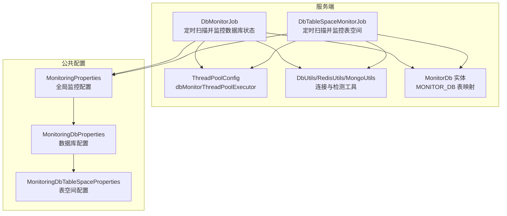
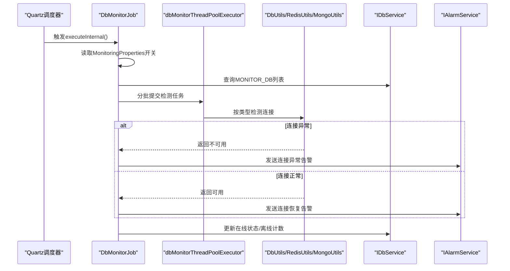
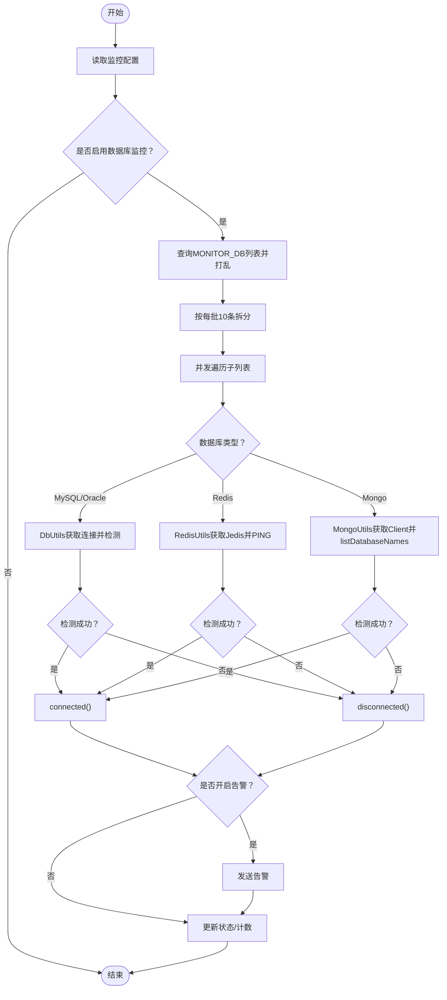
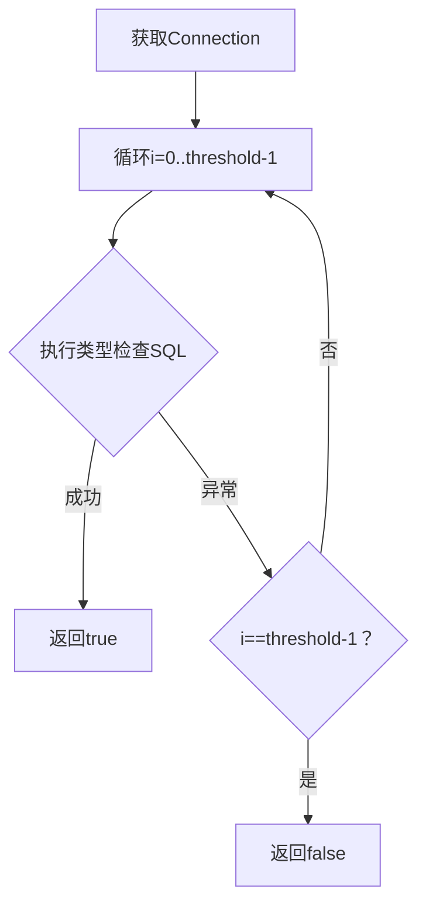
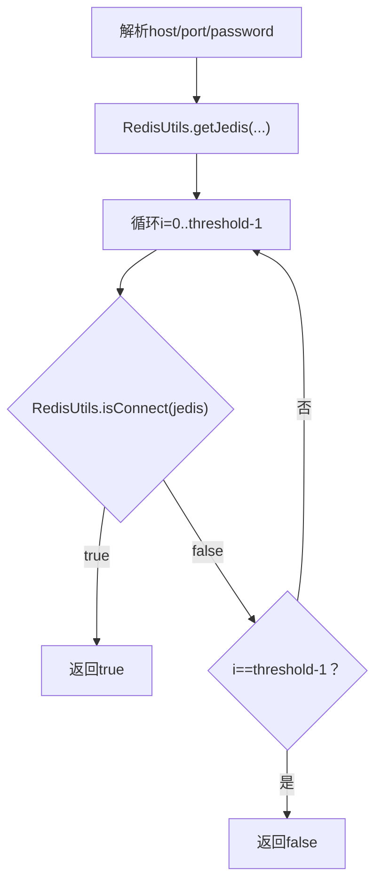
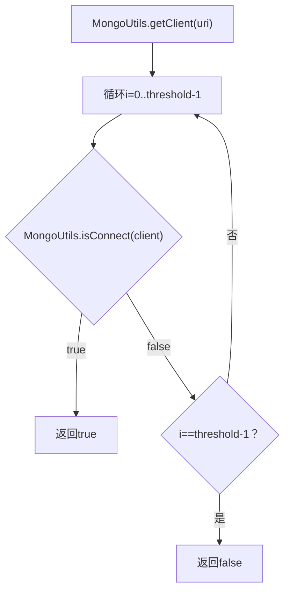
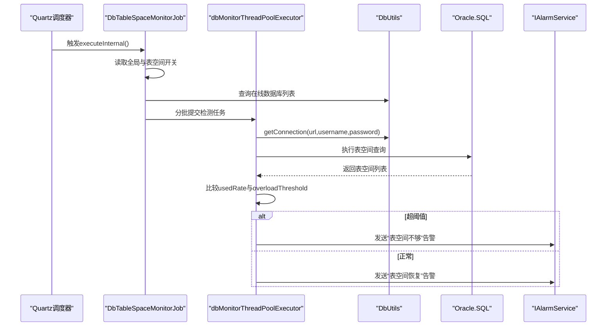
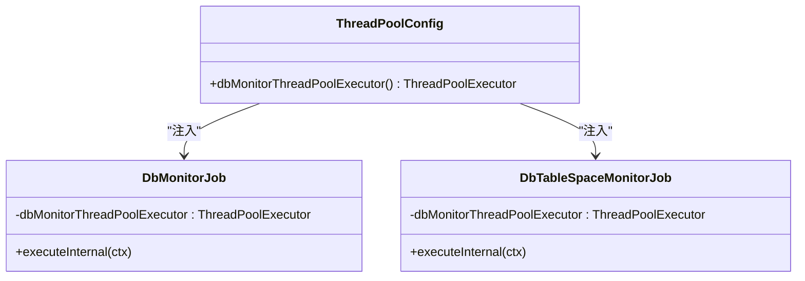
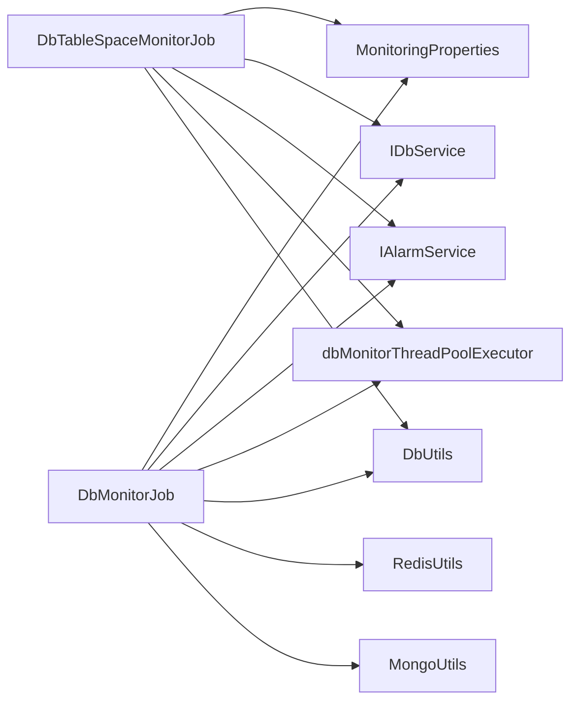

# 数据库监控任务

<cite>
**本文引用的文件**
- [DbMonitorJob.java](file://phoenix-server/src/main/java/com/gitee/pifeng/monitoring/server/business/server/monitor/db/DbMonitorJob.java)
- [DbTableSpaceMonitorJob.java](file://phoenix-server/src/main/java/com/gitee/pifeng/monitoring/server/business/server/monitor/db/DbTableSpaceMonitorJob.java)
- [DbUtils.java](file://phoenix-server/src/main/java/com/gitee/pifeng/monitoring/server/util/db/DbUtils.java)
- [RedisUtils.java](file://phoenix-server/src/main/java/com/gitee/pifeng/monitoring/server/util/db/RedisUtils.java)
- [MongoUtils.java](file://phoenix-server/src/main/java/com/gitee/pifeng/monitoring/server/util/db/MongoUtils.java)
- [MonitoringProperties.java](file://phoenix-common/phoenix-common-core/src/main/java/com/gitee/pifeng/monitoring/common/property/server/MonitoringProperties.java)
- [MonitoringDbProperties.java](file://phoenix-common/phoenix-common-core/src/main/java/com/gitee/pifeng/monitoring/common/property/server/MonitoringDbProperties.java)
- [MonitoringDbTableSpaceProperties.java](file://phoenix-common/phoenix-common-core/src/main/java/com/gitee/pifeng/monitoring/common/property/server/MonitoringDbTableSpaceProperties.java)
- [ThreadPoolConfig.java](file://phoenix-server/src/main/java/com/gitee/pifeng/monitoring/server/config/ThreadPoolConfig.java)
- [MonitorDb.java](file://phoenix-server/src/main/java/com/gitee/pifeng/monitoring/server/business/server/entity/MonitorDb.java)
- [DbEnums.java](file://phoenix-common/phoenix-common-core/src/main/java/com/gitee/pifeng/monitoring/common/constant/DbEnums.java)
</cite>

## 目录
1. [简介](#简介)
2. [项目结构](#项目结构)
3. [核心组件](#核心组件)
4. [架构总览](#架构总览)
5. [详细组件分析](#详细组件分析)
6. [依赖分析](#依赖分析)
7. [性能考虑](#性能考虑)
8. [故障排除指南](#故障排除指南)
9. [结论](#结论)
10. [附录](#附录)

## 简介
本文面向数据库监控任务，系统性解析以下内容：
- DbMonitorJob 类的实现机制：覆盖关系型数据库（MySQL、Oracle）、Redis、MongoDB 的监控流程与连接检测算法。
- 连接状态判断逻辑与异常处理机制。
- 数据库表空间监控任务 DbTableSpaceMonitorJob 的实现：重点说明 Oracle 表空间使用率监控与预警策略。
- 线程池配置、并发控制策略与性能优化方法。
- 告警机制：连接异常/恢复告警、表空间不足告警等。
- 配置参数说明：监控开关、告警开关、阈值等。
- 调试与故障排除方法。

## 项目结构
数据库监控相关代码主要位于服务端模块，采用 Quartz 定时调度 + 自定义线程池并发执行的方式，对 MONITOR_DB 表中的数据库连接进行周期性健康检查与表空间监控。

图表来源
- [DbMonitorJob.java:101-156](file://phoenix-server/src/main/java/com/gitee/pifeng/monitoring/server/business/server/monitor/db/DbMonitorJob.java#L101-L156)
- [DbTableSpaceMonitorJob.java:105-151](file://phoenix-server/src/main/java/com/gitee/pifeng/monitoring/server/business/server/monitor/db/DbTableSpaceMonitorJob.java#L105-L151)
- [ThreadPoolConfig.java:87-104](file://phoenix-server/src/main/java/com/gitee/pifeng/monitoring/server/config/ThreadPoolConfig.java#L87-L104)
- [DbUtils.java:46-55](file://phoenix-server/src/main/java/com/gitee/pifeng/monitoring/server/util/db/DbUtils.java#L46-L55)
- [RedisUtils.java:44-79](file://phoenix-server/src/main/java/com/gitee/pifeng/monitoring/server/util/db/RedisUtils.java#L44-L79)
- [MongoUtils.java:41-77](file://phoenix-server/src/main/java/com/gitee/pifeng/monitoring/server/util/db/MongoUtils.java#L41-L77)
- [MonitoringProperties.java:19-61](file://phoenix-common/phoenix-common-core/src/main/java/com/gitee/pifeng/monitoring/common/property/server/MonitoringProperties.java#L19-L61)
- [MonitoringDbProperties.java:19-36](file://phoenix-common/phoenix-common-core/src/main/java/com/gitee/pifeng/monitoring/common/property/server/MonitoringDbProperties.java#L19-L36)
- [MonitoringDbTableSpaceProperties.java:20-42](file://phoenix-common/phoenix-common-core/src/main/java/com/gitee/pifeng/monitoring/common/property/server/MonitoringDbTableSpaceProperties.java#L20-L42)
- [MonitorDb.java:27-125](file://phoenix-server/src/main/java/com/gitee/pifeng/monitoring/server/business/server/entity/MonitorDb.java#L27-L125)

章节来源
- [DbMonitorJob.java:101-156](file://phoenix-server/src/main/java/com/gitee/pifeng/monitoring/server/business/server/monitor/db/DbMonitorJob.java#L101-L156)
- [DbTableSpaceMonitorJob.java:105-151](file://phoenix-server/src/main/java/com/gitee/pifeng/monitoring/server/business/server/monitor/db/DbTableSpaceMonitorJob.java#L105-L151)
- [ThreadPoolConfig.java:87-104](file://phoenix-server/src/main/java/com/gitee/pifeng/monitoring/server/config/ThreadPoolConfig.java#L87-L104)
- [MonitoringProperties.java:19-61](file://phoenix-common/phoenix-common-core/src/main/java/com/gitee/pifeng/monitoring/common/property/server/MonitoringProperties.java#L19-L61)

## 核心组件
- DbMonitorJob：定时扫描 MONITOR_DB 中的数据库连接，按类型分别检测连接可用性，并在状态变化时发送告警，同时更新在线状态与离线计数。
- DbTableSpaceMonitorJob：仅对在线数据库进行表空间扫描，目前针对 Oracle 的表空间使用率进行阈值判断并发送告警。
- 工具类：DbUtils（关系型数据库连接）、RedisUtils（Redis 连接与 PING 检测）、MongoUtils（MongoDB 连接与 listDatabaseNames 检测）。
- 配置类：MonitoringProperties、MonitoringDbProperties、MonitoringDbTableSpaceProperties 提供全局阈值、开关与告警级别等配置。
- 线程池：dbMonitorThreadPoolExecutor 用于并发处理多个数据库连接的检测任务。

章节来源
- [DbMonitorJob.java:101-156](file://phoenix-server/src/main/java/com/gitee/pifeng/monitoring/server/business/server/monitor/db/DbMonitorJob.java#L101-L156)
- [DbTableSpaceMonitorJob.java:105-151](file://phoenix-server/src/main/java/com/gitee/pifeng/monitoring/server/business/server/monitor/db/DbTableSpaceMonitorJob.java#L105-L151)
- [DbUtils.java:46-55](file://phoenix-server/src/main/java/com/gitee/pifeng/monitoring/server/util/db/DbUtils.java#L46-L55)
- [RedisUtils.java:44-79](file://phoenix-server/src/main/java/com/gitee/pifeng/monitoring/server/util/db/RedisUtils.java#L44-L79)
- [MongoUtils.java:41-77](file://phoenix-server/src/main/java/com/gitee/pifeng/monitoring/server/util/db/MongoUtils.java#L41-L77)
- [MonitoringDbProperties.java:19-36](file://phoenix-common/phoenix-common-core/src/main/java/com/gitee/pifeng/monitoring/common/property/server/MonitoringDbProperties.java#L19-L36)
- [MonitoringDbTableSpaceProperties.java:20-42](file://phoenix-common/phoenix-common-core/src/main/java/com/gitee/pifeng/monitoring/common/property/server/MonitoringDbTableSpaceProperties.java#L20-L42)
- [ThreadPoolConfig.java:87-104](file://phoenix-server/src/main/java/com/gitee/pifeng/monitoring/server/config/ThreadPoolConfig.java#L87-L104)

## 架构总览
下图展示数据库监控任务的整体调用链：Quartz 触发 -> 任务加载配置 -> 并发执行 -> 工具类检测 -> 告警与状态更新。

图表来源
- [DbMonitorJob.java:101-156](file://phoenix-server/src/main/java/com/gitee/pifeng/monitoring/server/business/server/monitor/db/DbMonitorJob.java#L101-L156)
- [DbMonitorJob.java:312-352](file://phoenix-server/src/main/java/com/gitee/pifeng/monitoring/server/business/server/monitor/db/DbMonitorJob.java#L312-L352)
- [ThreadPoolConfig.java:87-104](file://phoenix-server/src/main/java/com/gitee/pifeng/monitoring/server/config/ThreadPoolConfig.java#L87-L104)
- [DbUtils.java:46-55](file://phoenix-server/src/main/java/com/gitee/pifeng/monitoring/server/util/db/DbUtils.java#L46-L55)
- [RedisUtils.java:69-79](file://phoenix-server/src/main/java/com/gitee/pifeng/monitoring/server/util/db/RedisUtils.java#L69-L79)
- [MongoUtils.java:60-77](file://phoenix-server/src/main/java/com/gitee/pifeng/monitoring/server/util/db/MongoUtils.java#L60-L77)

## 详细组件分析

### DbMonitorJob 组件分析
- 触发与入口
  - executeInternal 读取全局开关与数据库状态开关，若关闭则直接返回。
  - 对 MONITOR_DB 列表打乱后按每批 10 条拆分，提交至 dbMonitorThreadPoolExecutor 并行处理。
- 类型分支与检测
  - 关系型数据库：MySQL/Oracle 通过 DbUtils 获取连接后，循环尝试检测（阈值次数），任一成功即认为可用。
  - Redis：通过 RedisUtils 获取 Jedis，使用 PING 检测。
  - MongoDB：通过 MongoUtils 获取 MongoClient，使用 listDatabaseNames 快速探测。
- 连接状态判断与异常处理
  - connected/disconnected 分别处理状态变更与告警发送；异常统一走 disconnected 流程并记录错误日志。
- 告警机制
  - 连接异常告警：FATAL 级别，异常转异常。
  - 连接恢复告警：INFO 级别，仅当原状态非在线时触发。
  - 告警开关受数据库状态开关与单条连接的告警开关共同控制。

图表来源
- [DbMonitorJob.java:101-156](file://phoenix-server/src/main/java/com/gitee/pifeng/monitoring/server/business/server/monitor/db/DbMonitorJob.java#L101-L156)
- [DbMonitorJob.java:262-301](file://phoenix-server/src/main/java/com/gitee/pifeng/monitoring/server/business/server/monitor/db/DbMonitorJob.java#L262-L301)
- [DbMonitorJob.java:211-251](file://phoenix-server/src/main/java/com/gitee/pifeng/monitoring/server/business/server/monitor/db/DbMonitorJob.java#L211-L251)
- [DbMonitorJob.java:167-200](file://phoenix-server/src/main/java/com/gitee/pifeng/monitoring/server/business/server/monitor/db/DbMonitorJob.java#L167-L200)
- [DbMonitorJob.java:312-352](file://phoenix-server/src/main/java/com/gitee/pifeng/monitoring/server/business/server/monitor/db/DbMonitorJob.java#L312-L352)

章节来源
- [DbMonitorJob.java:101-156](file://phoenix-server/src/main/java/com/gitee/pifeng/monitoring/server/business/server/monitor/db/DbMonitorJob.java#L101-L156)
- [DbMonitorJob.java:167-200](file://phoenix-server/src/main/java/com/gitee/pifeng/monitoring/server/business/server/monitor/db/DbMonitorJob.java#L167-L200)
- [DbMonitorJob.java:211-251](file://phoenix-server/src/main/java/com/gitee/pifeng/monitoring/server/business/server/monitor/db/DbMonitorJob.java#L211-L251)
- [DbMonitorJob.java:262-301](file://phoenix-server/src/main/java/com/gitee/pifeng/monitoring/server/business/server/monitor/db/DbMonitorJob.java#L262-L301)
- [DbMonitorJob.java:312-352](file://phoenix-server/src/main/java/com/gitee/pifeng/monitoring/server/business/server/monitor/db/DbMonitorJob.java#L312-L352)

### 关系型数据库连接检测算法
- 步骤
  - 通过 DbUtils.getConnection(url, username, password) 获取连接。
  - 循环执行 isRelationalDbConnect，根据数据库类型选择对应 SQL 检查语句（MySQL/Oracle）。
  - 若连续尝试次数达到阈值仍未成功，则判定为不可用。
- 复杂度
  - 单连接检测为 O(1)，整体复杂度取决于连接数与阈值，通常较小。

图表来源
- [DbMonitorJob.java:273-283](file://phoenix-server/src/main/java/com/gitee/pifeng/monitoring/server/business/server/monitor/db/DbMonitorJob.java#L273-L283)
- [DbMonitorJob.java:365-385](file://phoenix-server/src/main/java/com/gitee/pifeng/monitoring/server/business/server/monitor/db/DbMonitorJob.java#L365-L385)
- [DbUtils.java:46-55](file://phoenix-server/src/main/java/com/gitee/pifeng/monitoring/server/util/db/DbUtils.java#L46-L55)

章节来源
- [DbMonitorJob.java:273-283](file://phoenix-server/src/main/java/com/gitee/pifeng/monitoring/server/business/server/monitor/db/DbMonitorJob.java#L273-L283)
- [DbMonitorJob.java:365-385](file://phoenix-server/src/main/java/com/gitee/pifeng/monitoring/server/business/server/monitor/db/DbMonitorJob.java#L365-L385)
- [DbUtils.java:46-55](file://phoenix-server/src/main/java/com/gitee/pifeng/monitoring/server/util/db/DbUtils.java#L46-L55)

### Redis 连接检测算法
- 步骤
  - 从 url 解析 host/port，password 可选。
  - 通过 RedisUtils.getJedis(host, port, password) 获取 Jedis。
  - 使用 RedisUtils.isConnect(jedis) 执行 PING 检测。
  - 循环尝试直至成功或超过阈值。
- 异常处理
  - 任何异常均视为不可用，统一进入 disconnected 流程。

图表来源
- [DbMonitorJob.java:211-251](file://phoenix-server/src/main/java/com/gitee/pifeng/monitoring/server/business/server/monitor/db/DbMonitorJob.java#L211-L251)
- [RedisUtils.java:44-79](file://phoenix-server/src/main/java/com/gitee/pifeng/monitoring/server/util/db/RedisUtils.java#L44-L79)

章节来源
- [DbMonitorJob.java:211-251](file://phoenix-server/src/main/java/com/gitee/pifeng/monitoring/server/business/server/monitor/db/DbMonitorJob.java#L211-L251)
- [RedisUtils.java:44-79](file://phoenix-server/src/main/java/com/gitee/pifeng/monitoring/server/util/db/RedisUtils.java#L44-L79)

### MongoDB 连接检测算法
- 步骤
  - 通过 MongoUtils.getClient(uri) 获取 MongoClient。
  - 使用 MongoUtils.isConnect(client) 调用 listDatabaseNames 并快速迭代一次以验证连通性。
  - 循环尝试直至成功或超过阈值。
- 异常处理
  - 任何异常均视为不可用，统一进入 disconnected 流程。

图表来源
- [DbMonitorJob.java:167-200](file://phoenix-server/src/main/java/com/gitee/pifeng/monitoring/server/business/server/monitor/db/DbMonitorJob.java#L167-L200)
- [MongoUtils.java:41-77](file://phoenix-server/src/main/java/com/gitee/pifeng/monitoring/server/util/db/MongoUtils.java#L41-L77)

章节来源
- [DbMonitorJob.java:167-200](file://phoenix-server/src/main/java/com/gitee/pifeng/monitoring/server/business/server/monitor/db/DbMonitorJob.java#L167-L200)
- [MongoUtils.java:41-77](file://phoenix-server/src/main/java/com/gitee/pifeng/monitoring/server/util/db/MongoUtils.java#L41-L77)

### 表空间监控任务 DbTableSpaceMonitorJob
- 触发与入口
  - 仅对在线数据库（IS_ONLINE=1）进行表空间扫描。
  - 与主监控类似，按每批 10 条并发处理。
- Oracle 表空间监控
  - 通过 DbUtils 获取连接后执行 Oracle.TABLE_SPACE_SELECT_ALL 查询，遍历结果集。
  - 使用 overloadThreshold 阈值比较 usedRate，超过阈值则发送“表空间不够”告警，否则发送“表空间恢复”告警。
- 告警机制
  - 告警开关与级别来自 MonitoringDbTableSpaceProperties。
  - 告警内容包含连接名、URL、类型、表空间名、总量、使用量、剩余量、使用率、剩余率等。

图表来源
- [DbTableSpaceMonitorJob.java:105-151](file://phoenix-server/src/main/java/com/gitee/pifeng/monitoring/server/business/server/monitor/db/DbTableSpaceMonitorJob.java#L105-L151)
- [DbTableSpaceMonitorJob.java:164-210](file://phoenix-server/src/main/java/com/gitee/pifeng/monitoring/server/business/server/monitor/db/DbTableSpaceMonitorJob.java#L164-L210)
- [ThreadPoolConfig.java:87-104](file://phoenix-server/src/main/java/com/gitee/pifeng/monitoring/server/config/ThreadPoolConfig.java#L87-L104)
- [DbUtils.java:46-55](file://phoenix-server/src/main/java/com/gitee/pifeng/monitoring/server/util/db/DbUtils.java#L46-L55)

章节来源
- [DbTableSpaceMonitorJob.java:105-151](file://phoenix-server/src/main/java/com/gitee/pifeng/monitoring/server/business/server/monitor/db/DbTableSpaceMonitorJob.java#L105-L151)
- [DbTableSpaceMonitorJob.java:164-210](file://phoenix-server/src/main/java/com/gitee/pifeng/monitoring/server/business/server/monitor/db/DbTableSpaceMonitorJob.java#L164-L210)

### 线程池配置与并发控制
- dbMonitorThreadPoolExecutor
  - 核心线程数与最大线程数均设置为 Ncpu / (1 - 0.8)，适配 IO 密集场景。
  - 队列为无界 LinkedBlockingQueue，拒绝策略为 AbortPolicy。
  - 线程命名模式含“phoenix-server-db-monitor-pool-thread-%d”，守护线程。
- 并发控制策略
  - 通过 synchronized (DbMonitorJob/DbTableSpaceMonitorJob) 保证同一时刻仅一个调度周期在执行。
  - 将数据库列表打乱后按每批 10 条提交，避免单个线程长时间占用。

图表来源
- [ThreadPoolConfig.java:87-104](file://phoenix-server/src/main/java/com/gitee/pifeng/monitoring/server/config/ThreadPoolConfig.java#L87-L104)
- [DbMonitorJob.java:88-92](file://phoenix-server/src/main/java/com/gitee/pifeng/monitoring/server/business/server/monitor/db/DbMonitorJob.java#L88-L92)
- [DbTableSpaceMonitorJob.java:90-94](file://phoenix-server/src/main/java/com/gitee/pifeng/monitoring/server/business/server/monitor/db/DbTableSpaceMonitorJob.java#L90-L94)

章节来源
- [ThreadPoolConfig.java:87-104](file://phoenix-server/src/main/java/com/gitee/pifeng/monitoring/server/config/ThreadPoolConfig.java#L87-L104)
- [DbMonitorJob.java:88-92](file://phoenix-server/src/main/java/com/gitee/pifeng/monitoring/server/business/server/monitor/db/DbMonitorJob.java#L88-L92)
- [DbTableSpaceMonitorJob.java:90-94](file://phoenix-server/src/main/java/com/gitee/pifeng/monitoring/server/business/server/monitor/db/DbTableSpaceMonitorJob.java#L90-L94)

### 告警机制
- 连接异常告警
  - 触发条件：检测失败且原状态为在线或未知。
  - 告警级别：FATAL。
  - 内容字段：连接名、URL/地址、类型、描述、环境、分组、时间。
- 连接恢复告警
  - 触发条件：检测成功且原状态非在线。
  - 告警级别：INFO。
- 表空间告警
  - 触发条件：Oracle 表空间使用率 ≥ overloadThreshold。
  - 告警级别：来自配置。
  - 内容字段：连接名、URL、类型、表空间名、总量、使用量、剩余量、使用率、剩余率、环境、分组、时间。

章节来源
- [DbMonitorJob.java:312-352](file://phoenix-server/src/main/java/com/gitee/pifeng/monitoring/server/business/server/monitor/db/DbMonitorJob.java#L312-L352)
- [DbMonitorJob.java:400-446](file://phoenix-server/src/main/java/com/gitee/pifeng/monitoring/server/business/server/monitor/db/DbMonitorJob.java#L400-L446)
- [DbTableSpaceMonitorJob.java:196-210](file://phoenix-server/src/main/java/com/gitee/pifeng/monitoring/server/business/server/monitor/db/DbTableSpaceMonitorJob.java#L196-L210)
- [DbTableSpaceMonitorJob.java:226-271](file://phoenix-server/src/main/java/com/gitee/pifeng/monitoring/server/business/server/monitor/db/DbTableSpaceMonitorJob.java#L226-L271)

## 依赖分析
- 组件耦合
  - DbMonitorJob/DbTableSpaceMonitorJob 依赖 MonitoringProperties、IDbService、IAlarmService、dbMonitorThreadPoolExecutor。
  - 工具类 DbUtils/RedisUtils/MongoUtils 与具体数据库驱动解耦，便于扩展其他类型。
- 外部依赖
  - Quartz 用于定时调度。
  - Hutool Db/SqlExecutor 用于关系型数据库查询。
  - Jedis/MongoClient 用于 Redis/MongoDB 连接。

图表来源
- [DbMonitorJob.java:66-86](file://phoenix-server/src/main/java/com/gitee/pifeng/monitoring/server/business/server/monitor/db/DbMonitorJob.java#L66-L86)
- [DbTableSpaceMonitorJob.java:68-87](file://phoenix-server/src/main/java/com/gitee/pifeng/monitoring/server/business/server/monitor/db/DbTableSpaceMonitorJob.java#L68-L87)
- [ThreadPoolConfig.java:87-104](file://phoenix-server/src/main/java/com/gitee/pifeng/monitoring/server/config/ThreadPoolConfig.java#L87-L104)

章节来源
- [DbMonitorJob.java:66-86](file://phoenix-server/src/main/java/com/gitee/pifeng/monitoring/server/business/server/monitor/db/DbMonitorJob.java#L66-L86)
- [DbTableSpaceMonitorJob.java:68-87](file://phoenix-server/src/main/java/com/gitee/pifeng/monitoring/server/business/server/monitor/db/DbTableSpaceMonitorJob.java#L68-L87)
- [ThreadPoolConfig.java:87-104](file://phoenix-server/src/main/java/com/gitee/pifeng/monitoring/server/config/ThreadPoolConfig.java#L87-L104)

## 性能考虑
- 并发策略
  - 使用固定大小线程池，避免过多线程竞争导致上下文切换开销。
  - 每批 10 条减少单次提交的线程压力。
- 连接检测重试
  - 通过阈值参数控制重试次数，平衡准确性与性能。
- IO 密集优化
  - 线程数按 Ncpu/(1-阻塞系数) 设定，适合数据库 IO 场景。
- 建议
  - 根据数据库数量与延迟动态调整阈值与批大小。
  - 对高延迟网络建议增加阈值，避免误判。

[本节为通用性能讨论，无需列出章节来源]

## 故障排除指南
- 常见问题
  - 连接异常但未触发告警：检查数据库状态开关与单条连接告警开关是否开启。
  - 表空间告警未触发：确认表空间监控开关与阈值配置正确。
  - 线程池饱和：观察队列长度与拒绝策略触发情况，必要时增大线程数或降低并发度。
- 排查步骤
  - 查看任务日志：定位 executeInternal 抛出的异常。
  - 检查工具类连接：DbUtils/RedisUtils/MongoUtils 的异常日志。
  - 核对 MONITOR_DB 字段：确保 URL、用户名、密码、类型、开关字段正确。
  - 验证配置：MonitoringProperties 的 threshold、开关与 MonitoringDbTableSpaceProperties 的阈值与级别。

章节来源
- [DbMonitorJob.java:152-154](file://phoenix-server/src/main/java/com/gitee/pifeng/monitoring/server/business/server/monitor/db/DbMonitorJob.java#L152-L154)
- [DbTableSpaceMonitorJob.java:147-149](file://phoenix-server/src/main/java/com/gitee/pifeng/monitoring/server/business/server/monitor/db/DbTableSpaceMonitorJob.java#L147-L149)
- [DbUtils.java:51-54](file://phoenix-server/src/main/java/com/gitee/pifeng/monitoring/server/util/db/DbUtils.java#L51-L54)
- [RedisUtils.java:53-56](file://phoenix-server/src/main/java/com/gitee/pifeng/monitoring/server/util/db/RedisUtils.java#L53-L56)
- [MongoUtils.java:44-47](file://phoenix-server/src/main/java/com/gitee/pifeng/monitoring/server/util/db/MongoUtils.java#L44-L47)

## 结论
本文系统梳理了数据库监控任务的实现细节，包括：
- 多类型数据库的连接检测算法与异常处理。
- 表空间监控的 Oracle 实现与阈值告警。
- 线程池配置与并发控制策略。
- 告警机制与配置参数。
- 调试与故障排除方法。

这些机制共同保障了数据库连接健康与资源使用风险的及时发现与处置。

[本节为总结性内容，无需列出章节来源]

## 附录

### 配置参数说明
- 全局配置 MonitoringProperties
  - threshold：连接检测重试阈值。
  - dbProperties.enable：是否启用数据库监控。
  - dbProperties.dbStatusProperties.enable：是否启用数据库状态监控。
  - dbProperties.dbStatusProperties.alarmEnable：数据库状态告警开关。
  - dbProperties.dbTableSpaceProperties.enable：是否启用数据库表空间监控。
  - dbProperties.dbTableSpaceProperties.alarmEnable：表空间告警开关。
  - dbProperties.dbTableSpaceProperties.overloadThreshold：表空间使用率阈值。
  - dbProperties.dbTableSpaceProperties.levelEnum：告警级别。

章节来源
- [MonitoringProperties.java:19-61](file://phoenix-common/phoenix-common-core/src/main/java/com/gitee/pifeng/monitoring/common/property/server/MonitoringProperties.java#L19-L61)
- [MonitoringDbProperties.java:19-36](file://phoenix-common/phoenix-common-core/src/main/java/com/gitee/pifeng/monitoring/common/property/server/MonitoringDbProperties.java#L19-L36)
- [MonitoringDbTableSpaceProperties.java:20-42](file://phoenix-common/phoenix-common-core/src/main/java/com/gitee/pifeng/monitoring/common/property/server/MonitoringDbTableSpaceProperties.java#L20-L42)

### 数据库类型与实体字段
- 数据库类型枚举 DbEnums：Oracle、MySQL、Redis、Mongo。
- MONITOR_DB 实体 MonitorDb 字段：连接名、URL、用户名、密码、类型、驱动类、描述、在线状态、离线次数、监控/告警开关、环境、分组等。

章节来源
- [DbEnums.java:14-66](file://phoenix-common/phoenix-common-core/src/main/java/com/gitee/pifeng/monitoring/common/constant/DbEnums.java#L14-L66)
- [MonitorDb.java:27-125](file://phoenix-server/src/main/java/com/gitee/pifeng/monitoring/server/business/server/entity/MonitorDb.java#L27-L125)