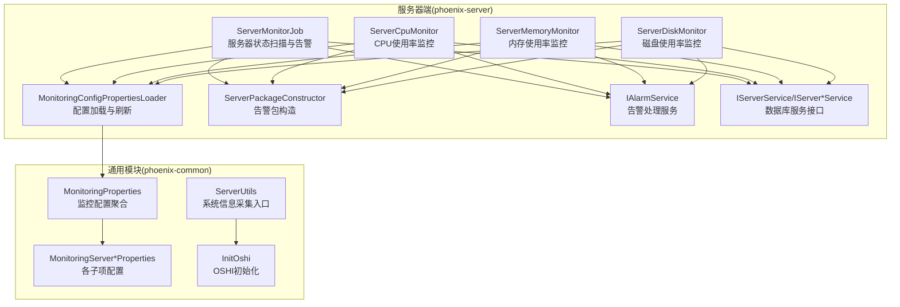
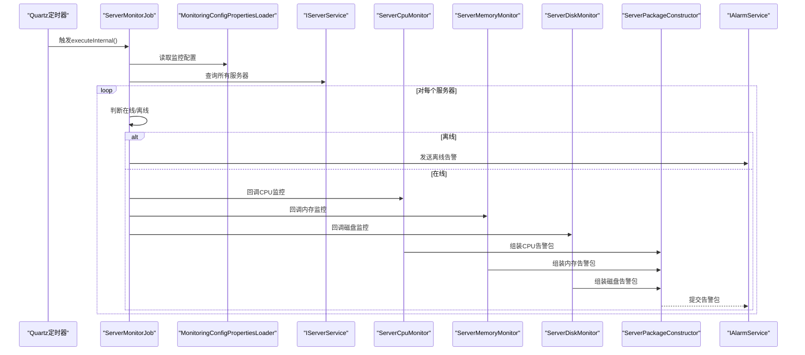
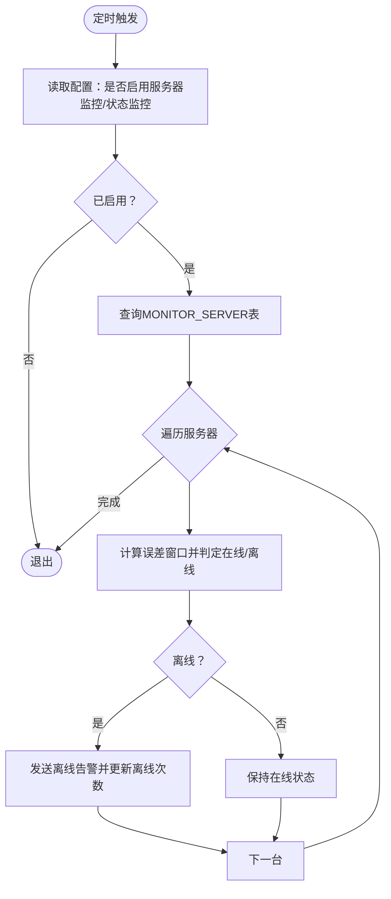
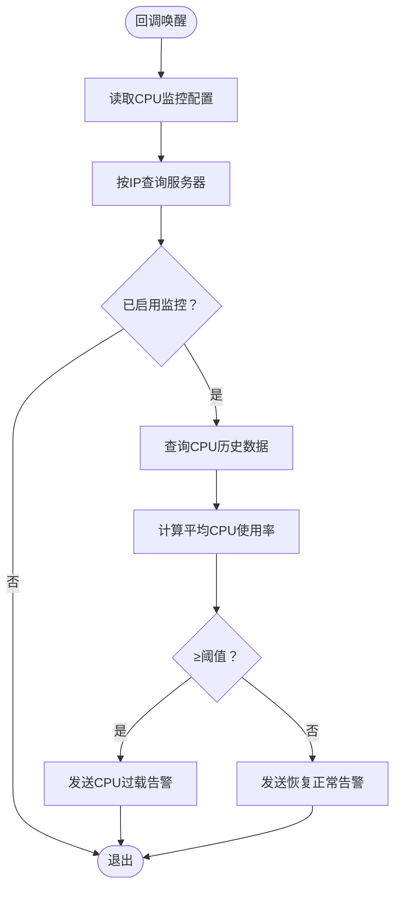
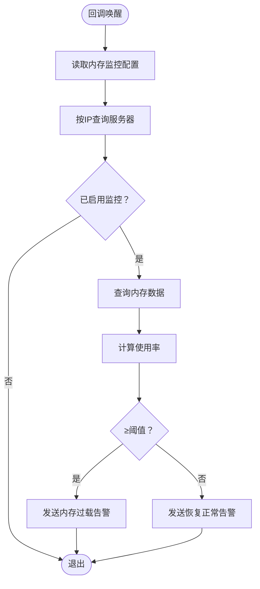
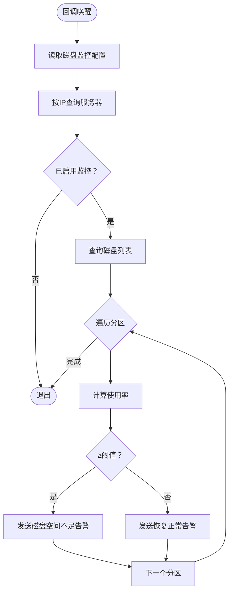
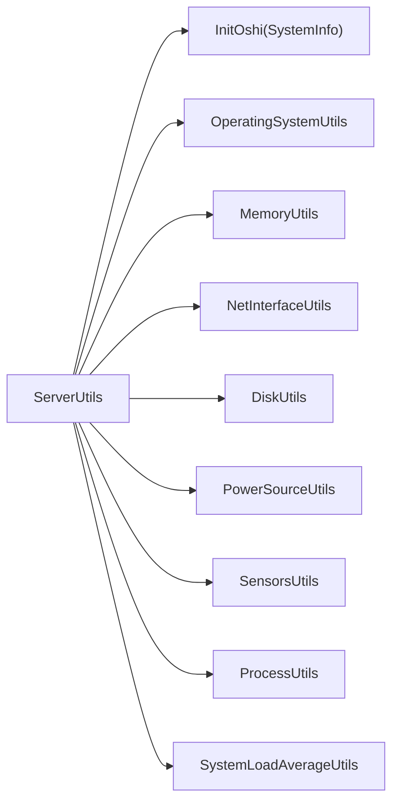
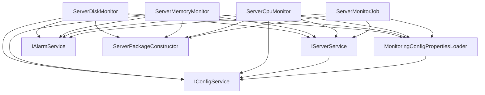

# 服务器监控任务

<cite>
**本文引用的文件**
- [ServerMonitorJob.java](file://phoenix-server/src/main/java/com/gitee/pifeng/monitoring/server/business/server/monitor/server/ServerMonitorJob.java)
- [ServerCpuMonitor.java](file://phoenix-server/src/main/java/com/gitee/pifeng/monitoring/server/business/server/monitor/server/ServerCpuMonitor.java)
- [ServerMemoryMonitor.java](file://phoenix-server/src/main/java/com/gitee/pifeng/monitoring/server/business/server/monitor/server/ServerMemoryMonitor.java)
- [ServerDiskMonitor.java](file://phoenix-server/src/main/java/com/gitee/pifeng/monitoring/server/business/server/monitor/server/ServerDiskMonitor.java)
- [MonitoringConfigPropertiesLoader.java](file://phoenix-server/src/main/java/com/gitee/pifeng/monitoring/server/business/server/core/MonitoringConfigPropertiesLoader.java)
- [MonitoringServerProperties.java](file://phoenix-common/phoenix-common-core/src/main/java/com/gitee/pifeng/monitoring/common/property/server/MonitoringServerProperties.java)
- [MonitoringServerCpuProperties.java](file://phoenix-common/phoenix-common-core/src/main/java/com/gitee/pifeng/monitoring/common/property/server/MonitoringServerCpuProperties.java)
- [MonitoringServerMemoryProperties.java](file://phoenix-common/phoenix-common-core/src/main/java/com/gitee/pifeng/monitoring/common/property/server/MonitoringServerMemoryProperties.java)
- [MonitoringServerDiskProperties.java](file://phoenix-common/phoenix-common-core/src/main/java/com/gitee/pifeng/monitoring/common/property/server/MonitoringServerDiskProperties.java)
- [MonitoringServerLoadAverageProperties.java](file://phoenix-common/phoenix-common-core/src/main/java/com/gitee/pifeng/monitoring/common/property/server/MonitoringServerLoadAverageProperties.java)
- [MonitoringProperties.java](file://phoenix-common/phoenix-common-core/src/main/java/com/gitee/pifeng/monitoring/common/property/server/MonitoringProperties.java)
- [ServerUtils.java](file://phoenix-common/phoenix-common-core/src/main/java/com/gitee/pifeng/monitoring/common/util/server/ServerUtils.java)
- [InitOshi.java](file://phoenix-common/phoenix-common-core/src/main/java/com/gitee/pifeng/monitoring/common/init/InitOshi.java)
- [OperatingSystemUtils.java](file://phoenix-common/phoenix-common-core/src/main/java/com/gitee/pifeng/monitoring/common/util/server/oshi/OperatingSystemUtils.java)
- [QuartzConfig.java](file://phoenix-server/src/main/java/com/gitee/pifeng/monitoring/server/config/QuartzConfig.java)
- [ServerServiceImpl.java](file://phoenix-server/src/main/java/com/gitee/pifeng/monitoring/server/business/server/service/impl/ServerServiceImpl.java)
- [IServerMemoryService.java](file://phoenix-server/src/main/java/com/gitee/pifeng/monitoring/server/business/server/service/IServerMemoryService.java)
- [IServerDiskService.java](file://phoenix-server/src/main/java/com/gitee/pifeng/monitoring/server/business/server/service/IServerDiskService.java)
- [ServerPackageConstructor.java](file://phoenix-server/src/main/java/com/gitee/pifeng/monitoring/server/business/server/core/ServerPackageConstructor.java)
- [IAlarmService.java](file://phoenix-server/src/main/java/com/gitee/pifeng/monitoring/server/business/server/service/IAlarmService.java)
- [IServerService.java](file://phoenix-server/src/main/java/com/gitee/pifeng/monitoring/server/business/server/service/IServerService.java)
</cite>

## 目录
1. [简介](#简介)
2. [项目结构](#项目结构)
3. [核心组件](#核心组件)
4. [架构总览](#架构总览)
5. [详细组件分析](#详细组件分析)
6. [依赖分析](#依赖分析)
7. [性能考虑](#性能考虑)
8. [故障排查指南](#故障排查指南)
9. [结论](#结论)
10. [附录](#附录)

## 简介
本文件围绕服务器监控任务展开，重点阐述 ServerMonitorJob 的整体调度与控制流，以及 CPU、内存、磁盘等子监控任务的实现机制。文档还涵盖数据采集方式（基于 OSHI 的系统信息获取）、性能指标统计、历史数据对比、告警规则与触发条件、系统兼容性（跨平台支持与硬件信息获取）、配置参数（监控间隔、告警阈值、采样频率等），并提供性能影响分析与优化建议。

## 项目结构
服务器监控功能主要分布在以下模块：
- 服务器端监控调度与业务：phoenix-server
- 监控通用属性与工具：phoenix-common
- 客户端采集与发送：phoenix-client（用于被监控端采集）

图表来源
- [ServerMonitorJob.java:110-159](file://phoenix-server/src/main/java/com/gitee/pifeng/monitoring/server/business/server/monitor/server/ServerMonitorJob.java#L110-L159)
- [MonitoringConfigPropertiesLoader.java:98-187](file://phoenix-server/src/main/java/com/gitee/pifeng/monitoring/server/business/server/core/MonitoringConfigPropertiesLoader.java#L98-L187)
- [MonitoringProperties.java:1-61](file://phoenix-common/phoenix-common-core/src/main/java/com/gitee/pifeng/monitoring/common/property/server/MonitoringProperties.java#L1-L61)
- [MonitoringServerProperties.java:1-52](file://phoenix-common/phoenix-common-core/src/main/java/com/gitee/pifeng/monitoring/common/property/server/MonitoringServerProperties.java#L1-L52)
- [ServerUtils.java:68-79](file://phoenix-common/phoenix-common-core/src/main/java/com/gitee/pifeng/monitoring/common/util/server/ServerUtils.java#L68-L79)
- [InitOshi.java:1-40](file://phoenix-common/phoenix-common-core/src/main/java/com/gitee/pifeng/monitoring/common/init/InitOshi.java#L1-L40)

章节来源
- [ServerMonitorJob.java:1-278](file://phoenix-server/src/main/java/com/gitee/pifeng/monitoring/server/business/server/monitor/server/ServerMonitorJob.java#L1-L278)
- [MonitoringConfigPropertiesLoader.java:1-200](file://phoenix-server/src/main/java/com/gitee/pifeng/monitoring/server/business/server/core/MonitoringConfigPropertiesLoader.java#L1-L200)
- [MonitoringProperties.java:1-61](file://phoenix-common/phoenix-common-core/src/main/java/com/gitee/pifeng/monitoring/common/property/server/MonitoringProperties.java#L1-L61)
- [MonitoringServerProperties.java:1-52](file://phoenix-common/phoenix-common-core/src/main/java/com/gitee/pifeng/monitoring/common/property/server/MonitoringServerProperties.java#L1-L52)
- [ServerUtils.java:68-79](file://phoenix-common/phoenix-common-core/src/main/java/com/gitee/pifeng/monitoring/common/util/server/ServerUtils.java#L68-L79)
- [InitOshi.java:1-40](file://phoenix-common/phoenix-common-core/src/main/java/com/gitee/pifeng/monitoring/common/init/InitOshi.java#L1-L40)

## 核心组件
- ServerMonitorJob：负责定时扫描“MONITOR_SERVER”表，判断服务器在线/离线状态并发送相应告警；同时作为服务器状态监控的入口。
- ServerCpuMonitor：根据最近一段时间的 CPU 使用率计算平均值，超过阈值触发告警。
- ServerMemoryMonitor：根据内存使用率与总量，超过阈值触发告警。
- ServerDiskMonitor：遍历磁盘分区，对每个分区的使用率进行阈值判断并触发告警。
- MonitoringConfigPropertiesLoader：从数据库加载监控配置，支持定时刷新；默认配置包含服务器 CPU/内存/磁盘/平均负载等阈值与告警级别。
- ServerPackageConstructor：构造告警包，交由 IAlarmService 处理。
- IServerService 及其子服务：提供服务器与各类监控数据的持久化能力。

章节来源
- [ServerMonitorJob.java:47-278](file://phoenix-server/src/main/java/com/gitee/pifeng/monitoring/server/business/server/monitor/server/ServerMonitorJob.java#L47-L278)
- [ServerCpuMonitor.java:42-251](file://phoenix-server/src/main/java/com/gitee/pifeng/monitoring/server/business/server/monitor/server/ServerCpuMonitor.java#L42-L251)
- [ServerMemoryMonitor.java:41-238](file://phoenix-server/src/main/java/com/gitee/pifeng/monitoring/server/business/server/monitor/server/ServerMemoryMonitor.java#L41-L238)
- [ServerDiskMonitor.java:43-256](file://phoenix-server/src/main/java/com/gitee/pifeng/monitoring/server/business/server/monitor/server/ServerDiskMonitor.java#L43-L256)
- [MonitoringConfigPropertiesLoader.java:98-187](file://phoenix-server/src/main/java/com/gitee/pifeng/monitoring/server/business/server/core/MonitoringConfigPropertiesLoader.java#L98-L187)
- [ServerPackageConstructor.java](file://phoenix-server/src/main/java/com/gitee/pifeng/monitoring/server/business/server/core/ServerPackageConstructor.java)
- [IAlarmService.java](file://phoenix-server/src/main/java/com/gitee/pifeng/monitoring/server/business/server/service/IAlarmService.java)
- [IServerService.java](file://phoenix-server/src/main/java/com/gitee/pifeng/monitoring/server/business/server/service/IServerService.java)

## 架构总览
服务器监控采用“配置驱动 + 事件回调 + 告警封装”的架构：
- 配置层：MonitoringProperties 聚合各子项配置，包含监控开关、阈值、告警级别等。
- 执行层：ServerMonitorJob 周期性扫描服务器状态；ServerCpu/Memory/DiskMonitor 通过监听回调处理实时数据。
- 数据层：ServerUtils 结合 OSHI 获取系统信息，写入数据库；各 IServer*Service 负责持久化。
- 告警层：ServerPackageConstructor 组装告警包，IAlarmService 处理告警发送。

图表来源
- [ServerMonitorJob.java:110-159](file://phoenix-server/src/main/java/com/gitee/pifeng/monitoring/server/business/server/monitor/server/ServerMonitorJob.java#L110-L159)
- [MonitoringConfigPropertiesLoader.java:98-187](file://phoenix-server/src/main/java/com/gitee/pifeng/monitoring/server/business/server/core/MonitoringConfigPropertiesLoader.java#L98-L187)
- [ServerCpuMonitor.java:84-124](file://phoenix-server/src/main/java/com/gitee/pifeng/monitoring/server/business/server/monitor/server/ServerCpuMonitor.java#L84-L124)
- [ServerMemoryMonitor.java:83-127](file://phoenix-server/src/main/java/com/gitee/pifeng/monitoring/server/business/server/monitor/server/ServerMemoryMonitor.java#L83-L127)
- [ServerDiskMonitor.java:85-136](file://phoenix-server/src/main/java/com/gitee/pifeng/monitoring/server/business/server/monitor/server/ServerDiskMonitor.java#L85-L136)
- [ServerPackageConstructor.java](file://phoenix-server/src/main/java/com/gitee/pifeng/monitoring/server/business/server/core/ServerPackageConstructor.java)
- [IAlarmService.java](file://phoenix-server/src/main/java/com/gitee/pifeng/monitoring/server/business/server/service/IAlarmService.java)

## 详细组件分析

### ServerMonitorJob：服务器状态扫描与告警
- 启动阶段：实现 CommandLineRunner，在应用启动后将在线服务器的“更新时间”刷新为当前时间，维持在线状态。
- 定时扫描：在 executeInternal 中按配置判断是否启用服务器监控与服务器状态监控；若启用，则查询 MONITOR_SERVER 表中所有服务器。
- 在线/离线判定：根据服务器最后更新时间与 connFrequency×threshold 的误差窗口，结合固定额外误差，判断是否离线并发送相应告警。
- 告警内容：包含 IP、服务器名、描述、环境、分组、时间等字段，使用 ServerPackageConstructor 组装告警包并交由 IAlarmService 处理。

图表来源
- [ServerMonitorJob.java:110-159](file://phoenix-server/src/main/java/com/gitee/pifeng/monitoring/server/business/server/monitor/server/ServerMonitorJob.java#L110-L159)
- [ServerMonitorJob.java:170-220](file://phoenix-server/src/main/java/com/gitee/pifeng/monitoring/server/business/server/monitor/server/ServerMonitorJob.java#L170-L220)

章节来源
- [ServerMonitorJob.java:88-159](file://phoenix-server/src/main/java/com/gitee/pifeng/monitoring/server/business/server/monitor/server/ServerMonitorJob.java#L88-L159)
- [ServerMonitorJob.java:170-275](file://phoenix-server/src/main/java/com/gitee/pifeng/monitoring/server/business/server/monitor/server/ServerMonitorJob.java#L170-L275)

### ServerCpuMonitor：CPU使用率监控
- 监控入口：实现 IServerMonitoringListener，通过回调接收服务器 IP，定位 MonitorServer。
- 数据获取：查询该 IP 的 MonitorServerCpu 列表，计算平均 CPU 使用率（百分比）。
- 阈值判断：若平均使用率 ≥ overloadThreshold，则按配置的 AlarmLevelEnums 发送“CPU过载”告警；否则发送“恢复正常”告警。
- 告警内容：包含 IP、服务器名、使用率、时间等。

图表来源
- [ServerCpuMonitor.java:84-124](file://phoenix-server/src/main/java/com/gitee/pifeng/monitoring/server/business/server/monitor/server/ServerCpuMonitor.java#L84-L124)
- [ServerCpuMonitor.java:156-188](file://phoenix-server/src/main/java/com/gitee/pifeng/monitoring/server/business/server/monitor/server/ServerCpuMonitor.java#L156-L188)
- [ServerCpuMonitor.java:204-248](file://phoenix-server/src/main/java/com/gitee/pifeng/monitoring/server/business/server/monitor/server/ServerCpuMonitor.java#L204-L248)

章节来源
- [ServerCpuMonitor.java:84-124](file://phoenix-server/src/main/java/com/gitee/pifeng/monitoring/server/business/server/monitor/server/ServerCpuMonitor.java#L84-L124)
- [ServerCpuMonitor.java:156-188](file://phoenix-server/src/main/java/com/gitee/pifeng/monitoring/server/business/server/monitor/server/ServerCpuMonitor.java#L156-L188)
- [ServerCpuMonitor.java:204-248](file://phoenix-server/src/main/java/com/gitee/pifeng/monitoring/server/business/server/monitor/server/ServerCpuMonitor.java#L204-L248)

### ServerMemoryMonitor：内存使用率监控
- 监控入口：实现 IServerMonitoringListener，按 IP 查询 MonitorServerMemory。
- 阈值判断：若内存使用率 ≥ overloadThreshold，则按配置的 AlarmLevelEnums 发送“内存过载”告警；否则发送“恢复正常”告警。
- 告警内容：包含 IP、服务器名、使用量/总量、使用率、时间等。

图表来源
- [ServerMemoryMonitor.java:83-127](file://phoenix-server/src/main/java/com/gitee/pifeng/monitoring/server/business/server/monitor/server/ServerMemoryMonitor.java#L83-L127)
- [ServerMemoryMonitor.java:163-172](file://phoenix-server/src/main/java/com/gitee/pifeng/monitoring/server/business/server/monitor/server/ServerMemoryMonitor.java#L163-L172)
- [ServerMemoryMonitor.java:190-236](file://phoenix-server/src/main/java/com/gitee/pifeng/monitoring/server/business/server/monitor/server/ServerMemoryMonitor.java#L190-L236)

章节来源
- [ServerMemoryMonitor.java:83-127](file://phoenix-server/src/main/java/com/gitee/pifeng/monitoring/server/business/server/monitor/server/ServerMemoryMonitor.java#L83-L127)
- [ServerMemoryMonitor.java:163-172](file://phoenix-server/src/main/java/com/gitee/pifeng/monitoring/server/business/server/monitor/server/ServerMemoryMonitor.java#L163-L172)
- [ServerMemoryMonitor.java:190-236](file://phoenix-server/src/main/java/com/gitee/pifeng/monitoring/server/business/server/monitor/server/ServerMemoryMonitor.java#L190-L236)

### ServerDiskMonitor：磁盘使用率监控
- 监控入口：实现 IServerMonitoringListener，按 IP 查询 MonitorServerDisk 列表。
- 阈值判断：对每个分区使用率进行判断，若 ≥ overloadThreshold，则按配置的 AlarmLevelEnums 发送“磁盘空间不足”告警；否则发送“恢复正常”告警。
- 告警内容：包含 IP、服务器名、分区名称/路径、使用量/总量、使用率、时间等。

图表来源
- [ServerDiskMonitor.java:85-136](file://phoenix-server/src/main/java/com/gitee/pifeng/monitoring/server/business/server/monitor/server/ServerDiskMonitor.java#L85-L136)
- [ServerDiskMonitor.java:176-185](file://phoenix-server/src/main/java/com/gitee/pifeng/monitoring/server/business/server/monitor/server/ServerDiskMonitor.java#L176-L185)
- [ServerDiskMonitor.java:205-253](file://phoenix-server/src/main/java/com/gitee/pifeng/monitoring/server/business/server/monitor/server/ServerDiskMonitor.java#L205-L253)

章节来源
- [ServerDiskMonitor.java:85-136](file://phoenix-server/src/main/java/com/gitee/pifeng/monitoring/server/business/server/monitor/server/ServerDiskMonitor.java#L85-L136)
- [ServerDiskMonitor.java:176-185](file://phoenix-server/src/main/java/com/gitee/pifeng/monitoring/server/business/server/monitor/server/ServerDiskMonitor.java#L176-L185)
- [ServerDiskMonitor.java:205-253](file://phoenix-server/src/main/java/com/gitee/pifeng/monitoring/server/business/server/monitor/server/ServerDiskMonitor.java#L205-L253)

### 数据采集与系统兼容性
- 数据采集入口：ServerUtils 将 OS、内存、网卡、磁盘、电源、传感器、进程、系统平均负载等信息统一采集。
- OSHI 初始化：InitOshi 在应用启动时初始化 SystemInfo，并设置 Windows 平均负载相关全局配置。
- 操作系统支持：通过 OSHI 的 OperatingSystemUtils 获取操作系统信息，具备跨平台能力（Windows/Linux 等）。
- 硬件信息获取：磁盘、内存、网卡、传感器等均通过 OSHI 工具类获取，确保在不同平台上的一致性。

图表来源
- [ServerUtils.java:68-79](file://phoenix-common/phoenix-common-core/src/main/java/com/gitee/pifeng/monitoring/common/util/server/ServerUtils.java#L68-L79)
- [InitOshi.java:32-38](file://phoenix-common/phoenix-common-core/src/main/java/com/gitee/pifeng/monitoring/common/init/InitOshi.java#L32-L38)
- [OperatingSystemUtils.java:25-26](file://phoenix-common/phoenix-common-core/src/main/java/com/gitee/pifeng/monitoring/common/util/server/oshi/OperatingSystemUtils.java#L25-L26)

章节来源
- [ServerUtils.java:68-79](file://phoenix-common/phoenix-common-core/src/main/java/com/gitee/pifeng/monitoring/common/util/server/ServerUtils.java#L68-L79)
- [InitOshi.java:1-40](file://phoenix-common/phoenix-common-core/src/main/java/com/gitee/pifeng/monitoring/common/init/InitOshi.java#L1-L40)
- [OperatingSystemUtils.java:1-29](file://phoenix-common/phoenix-common-core/src/main/java/com/gitee/pifeng/monitoring/common/util/server/oshi/OperatingSystemUtils.java#L1-L29)

### 告警机制与规则
- 告警触发条件：
  - 服务器状态：依据最后更新时间与阈值窗口判断离线/在线切换，发送“发现新服务器/上线/离线”等告警。
  - CPU：平均使用率 ≥ 配置阈值，按配置级别发送“CPU过载/恢复正常”告警。
  - 内存：使用率 ≥ 配置阈值，按配置级别发送“内存过载/恢复正常”告警。
  - 磁盘：任一分区使用率 ≥ 配置阈值，按配置级别发送“磁盘空间不足/恢复正常”告警。
- 告警内容：包含服务器标识、描述、环境、分组、时间及关键指标。
- 告警包构造：通过 ServerPackageConstructor 组装 AlarmPackage，交由 IAlarmService 处理。

章节来源
- [ServerMonitorJob.java:235-275](file://phoenix-server/src/main/java/com/gitee/pifeng/monitoring/server/business/server/monitor/server/ServerMonitorJob.java#L235-L275)
- [ServerCpuMonitor.java:156-165](file://phoenix-server/src/main/java/com/gitee/pifeng/monitoring/server/business/server/monitor/server/ServerCpuMonitor.java#L156-L165)
- [ServerMemoryMonitor.java:163-172](file://phoenix-server/src/main/java/com/gitee/pifeng/monitoring/server/business/server/monitor/server/ServerMemoryMonitor.java#L163-L172)
- [ServerDiskMonitor.java:176-185](file://phoenix-server/src/main/java/com/gitee/pifeng/monitoring/server/business/server/monitor/server/ServerDiskMonitor.java#L176-L185)
- [ServerPackageConstructor.java](file://phoenix-server/src/main/java/com/gitee/pifeng/monitoring/server/business/server/core/ServerPackageConstructor.java)
- [IAlarmService.java](file://phoenix-server/src/main/java/com/gitee/pifeng/monitoring/server/business/server/service/IAlarmService.java)

### 配置参数
- 监控配置聚合：MonitoringProperties 包含阈值（threshold）、告警属性、网络/TCP/HTTP/实例/服务器/数据库等子项配置。
- 服务器子项配置：
  - MonitoringServerProperties：服务器总开关、状态、CPU、内存、磁盘、平均负载等。
  - MonitoringServerCpuProperties：CPU 开关、告警开关、过载阈值、告警级别。
  - MonitoringServerMemoryProperties：内存开关、告警开关、过载阈值、告警级别。
  - MonitoringServerDiskProperties：磁盘开关、告警开关、过载阈值、告警级别。
  - MonitoringServerLoadAverageProperties：平均负载开关、告警开关、15分钟阈值、告警级别。
- 默认配置：MonitoringConfigPropertiesLoader 在数据库无配置时生成默认值，并写入数据库；随后每 5 分钟定时刷新内存中的配置。

章节来源
- [MonitoringProperties.java:1-61](file://phoenix-common/phoenix-common-core/src/main/java/com/gitee/pifeng/monitoring/common/property/server/MonitoringProperties.java#L1-L61)
- [MonitoringServerProperties.java:1-52](file://phoenix-common/phoenix-common-core/src/main/java/com/gitee/pifeng/monitoring/common/property/server/MonitoringServerProperties.java#L1-L52)
- [MonitoringServerCpuProperties.java:1-43](file://phoenix-common/phoenix-common-core/src/main/java/com/gitee/pifeng/monitoring/common/property/server/MonitoringServerCpuProperties.java#L1-L43)
- [MonitoringServerMemoryProperties.java:1-42](file://phoenix-common/phoenix-common-core/src/main/java/com/gitee/pifeng/monitoring/common/property/server/MonitoringServerMemoryProperties.java#L1-L42)
- [MonitoringServerDiskProperties.java:1-43](file://phoenix-common/phoenix-common-core/src/main/java/com/gitee/pifeng/monitoring/common/property/server/MonitoringServerDiskProperties.java#L1-L43)
- [MonitoringServerLoadAverageProperties.java:1-41](file://phoenix-common/phoenix-common-core/src/main/java/com/gitee/pifeng/monitoring/common/property/server/MonitoringServerLoadAverageProperties.java#L1-L41)
- [MonitoringConfigPropertiesLoader.java:126-187](file://phoenix-server/src/main/java/com/gitee/pifeng/monitoring/server/business/server/core/MonitoringConfigPropertiesLoader.java#L126-L187)
- [MonitoringConfigPropertiesLoader.java:197-200](file://phoenix-server/src/main/java/com/gitee/pifeng/monitoring/server/business/server/core/MonitoringConfigPropertiesLoader.java#L197-L200)

### 系统兼容性
- OSHI 跨平台：通过 InitOshi 初始化 SystemInfo，并在 Windows 上启用平均负载支持；ServerUtils 统一采集 OS、内存、磁盘、网卡、传感器、进程、电源、系统平均负载等信息。
- 操作系统支持：OperatingSystemUtils 提供操作系统信息获取，适用于主流桌面/服务器操作系统。
- 硬件信息一致性：磁盘、内存、网卡、传感器等均来自 OSHI 工具类，确保在不同平台上的可用性与一致性。

章节来源
- [InitOshi.java:32-38](file://phoenix-common/phoenix-common-core/src/main/java/com/gitee/pifeng/monitoring/common/init/InitOshi.java#L32-L38)
- [ServerUtils.java:68-79](file://phoenix-common/phoenix-common-core/src/main/java/com/gitee/pifeng/monitoring/common/util/server/ServerUtils.java#L68-L79)
- [OperatingSystemUtils.java:25-26](file://phoenix-common/phoenix-common-core/src/main/java/com/gitee/pifeng/monitoring/common/util/server/oshi/OperatingSystemUtils.java#L25-L26)

## 依赖分析
- 组件耦合：
  - ServerMonitorJob 依赖配置加载器、服务器服务、告警服务与包构造器。
  - 子监控器（CPU/Memory/Disk）依赖各自服务、配置加载器、包构造器与告警服务。
  - 配置加载器依赖数据库服务，提供默认配置与定时刷新。
- 外部依赖：
  - OSHI：用于系统信息采集。
  - Quartz：用于定时调度（ServerMonitorJob 为 QuartzJobBean）。
  - MyBatis-Plus：用于数据库访问（IServer*Service 接口）。

图表来源
- [ServerMonitorJob.java:47-71](file://phoenix-server/src/main/java/com/gitee/pifeng/monitoring/server/business/server/monitor/server/ServerMonitorJob.java#L47-L71)
- [ServerCpuMonitor.java:42-72](file://phoenix-server/src/main/java/com/gitee/pifeng/monitoring/server/business/server/monitor/server/ServerCpuMonitor.java#L42-L72)
- [ServerMemoryMonitor.java:41-71](file://phoenix-server/src/main/java/com/gitee/pifeng/monitoring/server/business/server/monitor/server/ServerMemoryMonitor.java#L41-L71)
- [ServerDiskMonitor.java:43-73](file://phoenix-server/src/main/java/com/gitee/pifeng/monitoring/server/business/server/monitor/server/ServerDiskMonitor.java#L43-L73)
- [MonitoringConfigPropertiesLoader.java:98-187](file://phoenix-server/src/main/java/com/gitee/pifeng/monitoring/server/business/server/core/MonitoringConfigPropertiesLoader.java#L98-L187)

章节来源
- [ServerMonitorJob.java:47-71](file://phoenix-server/src/main/java/com/gitee/pifeng/monitoring/server/business/server/monitor/server/ServerMonitorJob.java#L47-L71)
- [ServerCpuMonitor.java:42-72](file://phoenix-server/src/main/java/com/gitee/pifeng/monitoring/server/business/server/monitor/server/ServerCpuMonitor.java#L42-L72)
- [ServerMemoryMonitor.java:41-71](file://phoenix-server/src/main/java/com/gitee/pifeng/monitoring/server/business/server/monitor/server/ServerMemoryMonitor.java#L41-L71)
- [ServerDiskMonitor.java:43-73](file://phoenix-server/src/main/java/com/gitee/pifeng/monitoring/server/business/server/monitor/server/ServerDiskMonitor.java#L43-L73)
- [MonitoringConfigPropertiesLoader.java:98-187](file://phoenix-server/src/main/java/com/gitee/pifeng/monitoring/server/business/server/core/MonitoringConfigPropertiesLoader.java#L98-L187)

## 性能考虑
- 异步处理：ServerServiceImpl 在接收到服务器信息包后，将内存、CPU、磁盘、网卡、GPU、进程、传感器、电源等信息的入库与历史记录入库提交至线程池异步执行，降低主流程阻塞风险。
- 配置刷新：MonitoringConfigPropertiesLoader 每 5 分钟定时刷新一次配置，避免频繁读库带来的压力。
- 监控粒度：CPU/内存/磁盘分别独立监控，避免单点瓶颈；阈值与告警级别可按需调整，减少误报与噪声。
- I/O 优化：批量异步入库与历史记录分离，有助于数据库写入吞吐提升。

章节来源
- [ServerServiceImpl.java:199-223](file://phoenix-server/src/main/java/com/gitee/pifeng/monitoring/server/business/server/service/impl/ServerServiceImpl.java#L199-L223)
- [MonitoringConfigPropertiesLoader.java:197-200](file://phoenix-server/src/main/java/com/gitee/pifeng/monitoring/server/business/server/core/MonitoringConfigPropertiesLoader.java#L197-L200)

## 故障排查指南
- 服务器离线告警频繁：
  - 检查阈值（threshold）与 connFrequency 的组合是否合理。
  - 确认被监控端心跳上报是否正常。
- 告警未触发：
  - 确认服务器监控与对应子项监控开关已启用。
  - 检查告警开关与服务器级告警开关是否开启。
  - 核对阈值与告警级别配置是否正确。
- 配置不生效：
  - 确认数据库中存在 MonitorConfig 记录且 JSON 格式正确。
  - 等待定时刷新（每 5 分钟）或手动触发配置加载。
- 数据采集异常：
  - 检查 OSHI 初始化是否成功（InitOshi 日志）。
  - 确认操作系统支持与权限（如磁盘/传感器访问）。

章节来源
- [ServerMonitorJob.java:115-125](file://phoenix-server/src/main/java/com/gitee/pifeng/monitoring/server/business/server/monitor/server/ServerMonitorJob.java#L115-L125)
- [ServerCpuMonitor.java:85-95](file://phoenix-server/src/main/java/com/gitee/pifeng/monitoring/server/business/server/monitor/server/ServerCpuMonitor.java#L85-L95)
- [ServerMemoryMonitor.java:84-94](file://phoenix-server/src/main/java/com/gitee/pifeng/monitoring/server/business/server/monitor/server/ServerMemoryMonitor.java#L84-L94)
- [ServerDiskMonitor.java:86-96](file://phoenix-server/src/main/java/com/gitee/pifeng/monitoring/server/business/server/monitor/server/ServerDiskMonitor.java#L86-L96)
- [MonitoringConfigPropertiesLoader.java:197-200](file://phoenix-server/src/main/java/com/gitee/pifeng/monitoring/server/business/server/core/MonitoringConfigPropertiesLoader.java#L197-L200)
- [InitOshi.java:32-38](file://phoenix-common/phoenix-common-core/src/main/java/com/gitee/pifeng/monitoring/common/init/InitOshi.java#L32-L38)

## 结论
本文档系统梳理了服务器监控任务的架构与实现，明确了 ServerMonitorJob 的调度逻辑与 ServerCpuMonitor、ServerMemoryMonitor、ServerDiskMonitor 的监控策略，给出了数据采集、告警规则、系统兼容性、配置参数与性能优化建议。通过配置驱动与异步处理，系统在保证实时性的同时兼顾稳定性与可维护性。

## 附录
- Quartz 定时任务注册：QuartzConfig 中注册了 ServerMonitorJob 等多个 Job，确保定时扫描与监控任务按计划执行。
- 数据持久化接口：IServerMemoryService、IServerDiskService 等接口定义了内存、磁盘等监控数据的增删改查能力。

章节来源
- [QuartzConfig.java:1-35](file://phoenix-server/src/main/java/com/gitee/pifeng/monitoring/server/config/QuartzConfig.java#L1-L35)
- [IServerMemoryService.java:1-28](file://phoenix-server/src/main/java/com/gitee/pifeng/monitoring/server/business/server/service/IServerMemoryService.java#L1-L28)
- [IServerDiskService.java:1-28](file://phoenix-server/src/main/java/com/gitee/pifeng/monitoring/server/business/server/service/IServerDiskService.java#L1-L28)