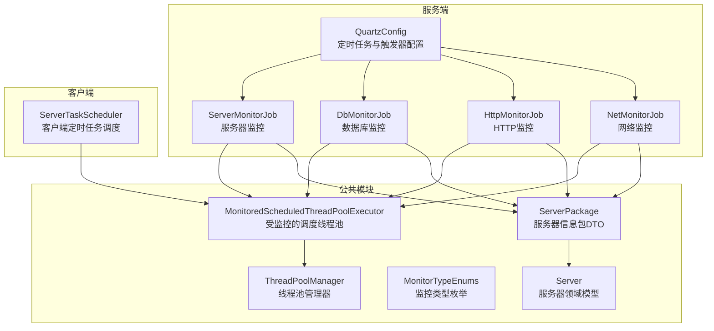
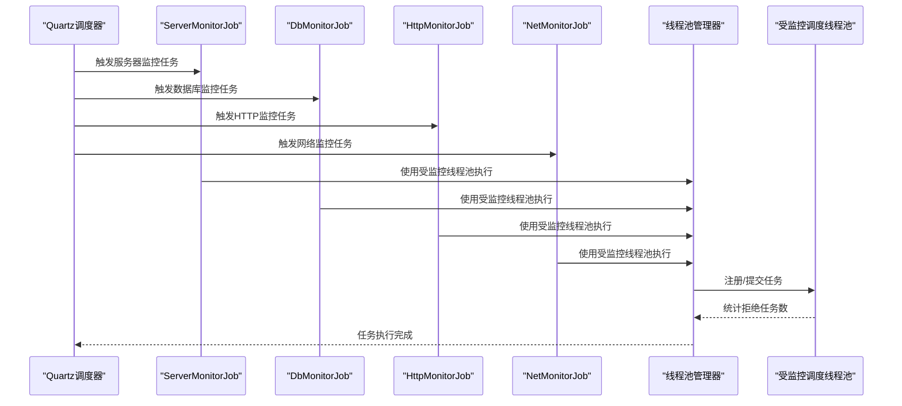
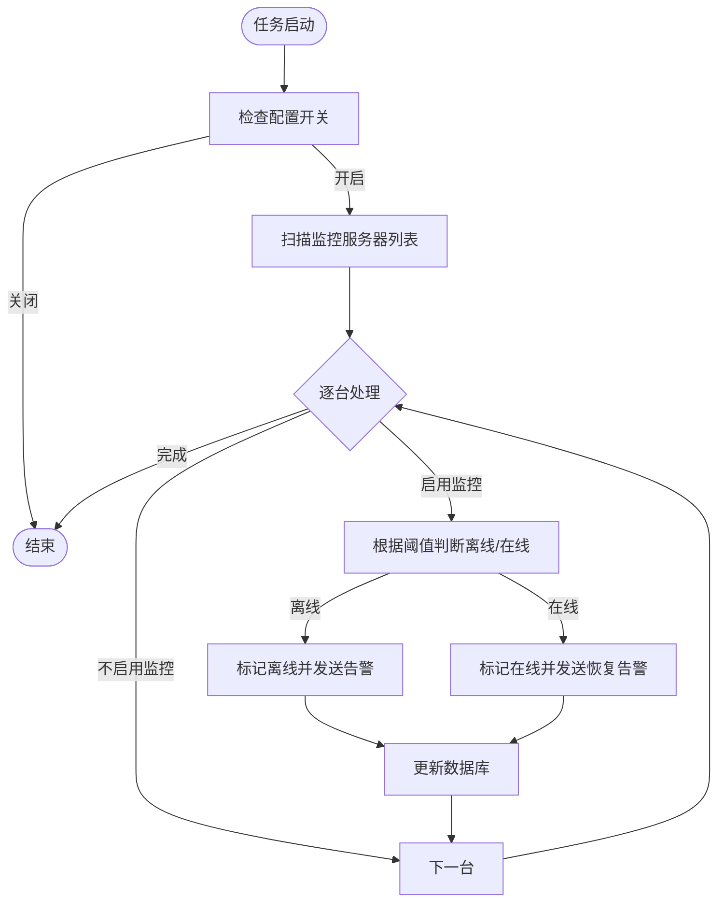
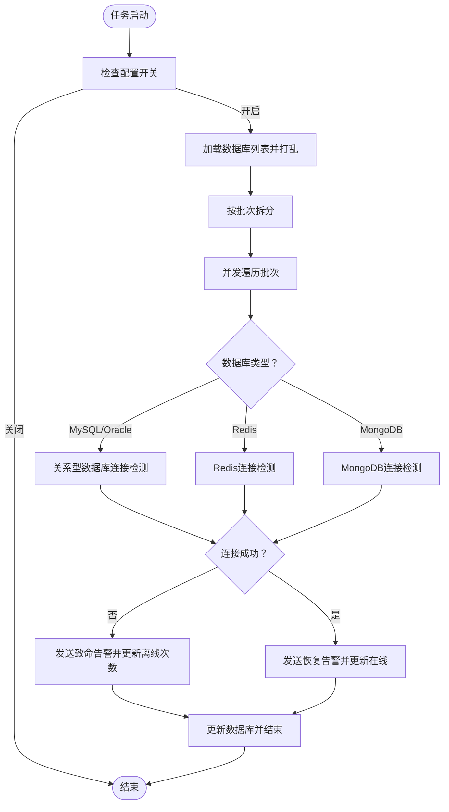
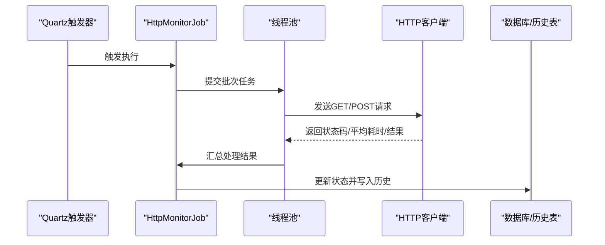
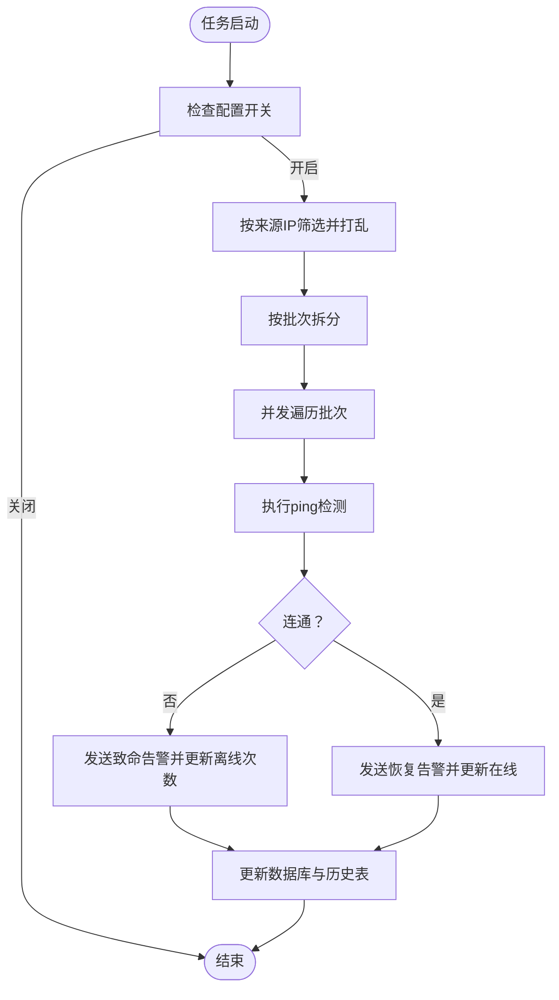
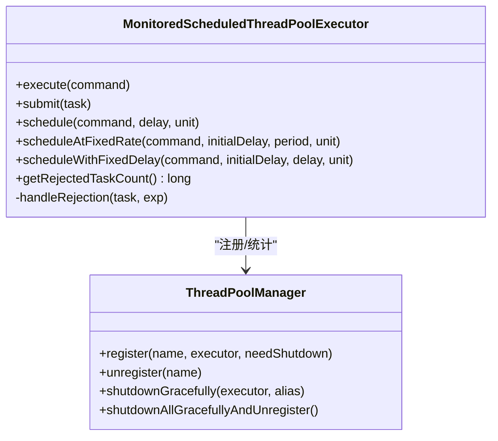
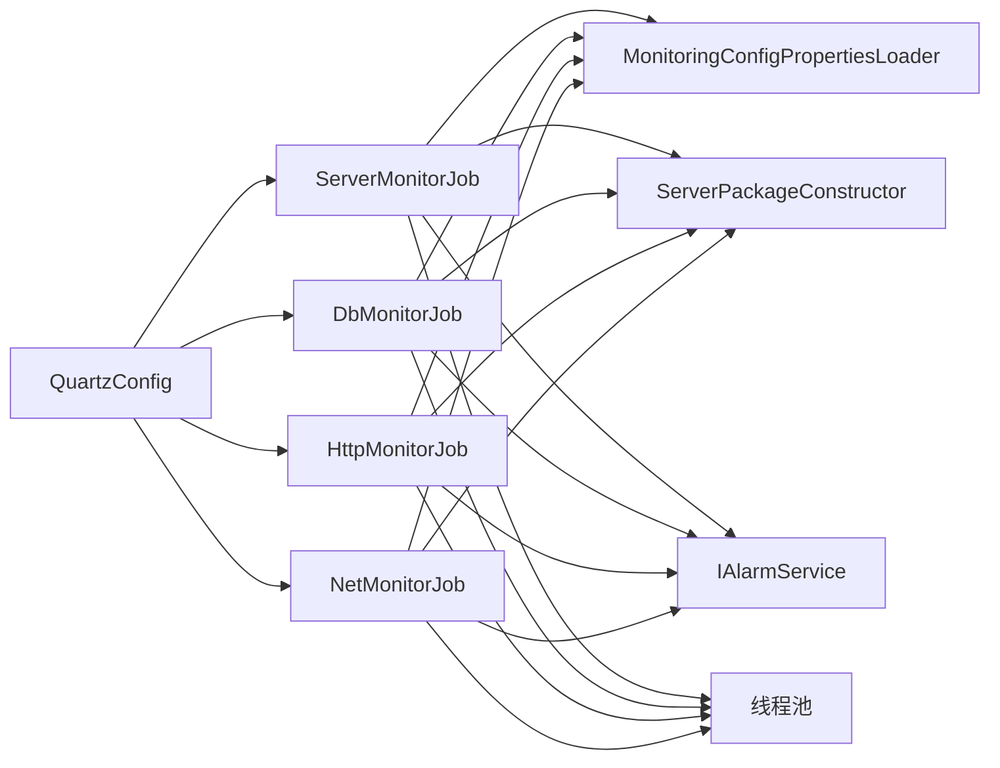

# 监控任务调度

<cite>
**本文引用的文件**   
- [QuartzConfig.java](file://phoenix-server/src/main/java/com/gitee/pifeng/monitoring/server/config/QuartzConfig.java)
- [ServerMonitorJob.java](file://phoenix-server/src/main/java/com/gitee/pifeng/monitoring/server/business/server/monitor/server/ServerMonitorJob.java)
- [DbMonitorJob.java](file://phoenix-server/src/main/java/com/gitee/pifeng/monitoring/server/business/server/monitor/db/DbMonitorJob.java)
- [HttpMonitorJob.java](file://phoenix-server/src/main/java/com/gitee/pifeng/monitoring/server/business/server/monitor/http/HttpMonitorJob.java)
- [NetMonitorJob.java](file://phoenix-server/src/main/java/com/gitee/pifeng/monitoring/server/business/server/monitor/net/NetMonitorJob.java)
- [ServerTaskScheduler.java](file://phoenix-client/phoenix-client-core/src/main/java/com/gitee/pifeng/monitoring/plug/scheduler/ServerTaskScheduler.java)
- [MonitoredScheduledThreadPoolExecutor.java](file://phoenix-common/phoenix-common-core/src/main/java/com/gitee/pifeng/monitoring/common/threadpool/MonitoredScheduledThreadPoolExecutor.java)
- [ThreadPoolManager.java](file://phoenix-common/phoenix-common-core/src/main/java/com/gitee/pifeng/monitoring/common/threadpool/ThreadPoolManager.java)
- [ServerPackage.java](file://phoenix-common/phoenix-common-core/src/main/java/com/gitee/pifeng/monitoring/common/dto/ServerPackage.java)
- [MonitorTypeEnums.java](file://phoenix-common/phoenix-common-core/src/main/java/com/gitee/pifeng/monitoring/common/constant/MonitorTypeEnums.java)
- [Server.java](file://phoenix-common/phoenix-common-core/src/main/java/com/gitee/pifeng/monitoring/common/domain/Server.java)
</cite>

## 目录
1. [简介](#简介)
2. [项目结构](#项目结构)
3. [核心组件](#核心组件)
4. [架构总览](#架构总览)
5. [详细组件分析](#详细组件分析)
6. [依赖分析](#依赖分析)
7. [性能考虑](#性能考虑)
8. [故障排查指南](#故障排查指南)
9. [结论](#结论)
10. [附录](#附录)

## 简介
本技术文档围绕监控任务调度体系展开，系统性阐述数据库监控、HTTP监控、服务器监控与网络监控等任务的实现机制，解析基于 Quartz 的定时任务框架配置与使用方式，覆盖任务调度策略、执行频率、并发控制、生命周期管理、扩展机制以及性能优化与调试方法。读者可据此快速理解并高效维护与扩展监控任务。

## 项目结构
监控任务调度相关代码主要分布在以下模块：
- 服务端（phoenix-server）：Quartz 定时任务配置、各类监控 Job 实现、线程池与任务生命周期管理
- 客户端（phoenix-client）：客户端侧定时任务调度器（如服务器信息发送）
- 公共模块（phoenix-common）：线程池监控与管理、监控类型枚举、数据传输对象与领域模型

图表来源
- [QuartzConfig.java:26-399](file://phoenix-server/src/main/java/com/gitee/pifeng/monitoring/server/config/QuartzConfig.java#L26-L399)
- [ServerMonitorJob.java:47-278](file://phoenix-server/src/main/java/com/gitee/pifeng/monitoring/server/business/server/monitor/server/ServerMonitorJob.java#L47-L278)
- [DbMonitorJob.java:61-449](file://phoenix-server/src/main/java/com/gitee/pifeng/monitoring/server/business/server/monitor/db/DbMonitorJob.java#L61-L449)
- [HttpMonitorJob.java:61-468](file://phoenix-server/src/main/java/com/gitee/pifeng/monitoring/server/business/server/monitor/http/HttpMonitorJob.java#L61-L468)
- [NetMonitorJob.java:54-310](file://phoenix-server/src/main/java/com/gitee/pifeng/monitoring/server/business/server/monitor/net/NetMonitorJob.java#L54-L310)
- [ServerTaskScheduler.java:17-51](file://phoenix-client/phoenix-client-core/src/main/java/com/gitee/pifeng/monitoring/plug/scheduler/ServerTaskScheduler.java#L17-L51)
- [MonitoredScheduledThreadPoolExecutor.java:18-209](file://phoenix-common/phoenix-common-core/src/main/java/com/gitee/pifeng/monitoring/common/threadpool/MonitoredScheduledThreadPoolExecutor.java#L18-L209)
- [ThreadPoolManager.java:22-131](file://phoenix-common/phoenix-common-core/src/main/java/com/gitee/pifeng/monitoring/common/threadpool/ThreadPoolManager.java#L22-L131)
- [ServerPackage.java:21-34](file://phoenix-common/phoenix-common-core/src/main/java/com/gitee/pifeng/monitoring/common/dto/ServerPackage.java#L21-L34)
- [MonitorTypeEnums.java:11-49](file://phoenix-common/phoenix-common-core/src/main/java/com/gitee/pifeng/monitoring/common/constant/MonitorTypeEnums.java#L11-L49)
- [Server.java:23-76](file://phoenix-common/phoenix-common-core/src/main/java/com/gitee/pifeng/monitoring/common/domain/Server.java#L23-L76)

章节来源
- [QuartzConfig.java:26-399](file://phoenix-server/src/main/java/com/gitee/pifeng/monitoring/server/config/QuartzConfig.java#L26-L399)

## 核心组件
- Quartz 定时任务配置：集中定义各监控 Job 的 JobDetail 与 Trigger，包括启动延迟、重复间隔、Cron 表达式等
- 监控 Job 实现：服务器、数据库、HTTP、网络监控任务，负责数据采集、状态判定、异常检测与告警
- 线程池与任务管理：受监控的调度线程池与线程池管理器，支持拒绝统计、优雅关闭与统一注册
- 客户端定时任务：客户端侧按配置周期发送服务器信息包
- 数据模型与传输：监控类型枚举、服务器信息包 DTO、服务器领域模型

章节来源
- [ServerMonitorJob.java:47-278](file://phoenix-server/src/main/java/com/gitee/pifeng/monitoring/server/business/server/monitor/server/ServerMonitorJob.java#L47-L278)
- [DbMonitorJob.java:61-449](file://phoenix-server/src/main/java/com/gitee/pifeng/monitoring/server/business/server/monitor/db/DbMonitorJob.java#L61-L449)
- [HttpMonitorJob.java:61-468](file://phoenix-server/src/main/java/com/gitee/pifeng/monitoring/server/business/server/monitor/http/HttpMonitorJob.java#L61-L468)
- [NetMonitorJob.java:54-310](file://phoenix-server/src/main/java/com/gitee/pifeng/monitoring/server/business/server/monitor/net/NetMonitorJob.java#L54-L310)
- [MonitoredScheduledThreadPoolExecutor.java:18-209](file://phoenix-common/phoenix-common-core/src/main/java/com/gitee/pifeng/monitoring/common/threadpool/MonitoredScheduledThreadPoolExecutor.java#L18-L209)
- [ThreadPoolManager.java:22-131](file://phoenix-common/phoenix-common-core/src/main/java/com/gitee/pifeng/monitoring/common/threadpool/ThreadPoolManager.java#L22-L131)
- [ServerTaskScheduler.java:17-51](file://phoenix-client/phoenix-client-core/src/main/java/com/gitee/pifeng/monitoring/plug/scheduler/ServerTaskScheduler.java#L17-L51)
- [MonitorTypeEnums.java:11-49](file://phoenix-common/phoenix-common-core/src/main/java/com/gitee/pifeng/monitoring/common/constant/MonitorTypeEnums.java#L11-L49)
- [ServerPackage.java:21-34](file://phoenix-common/phoenix-common-core/src/main/java/com/gitee/pifeng/monitoring/common/dto/ServerPackage.java#L21-L34)
- [Server.java:23-76](file://phoenix-common/phoenix-common-core/src/main/java/com/gitee/pifeng/monitoring/common/domain/Server.java#L23-L76)

## 架构总览
下图展示 Quartz 任务配置与各监控 Job 的交互关系，以及线程池与客户端任务调度的协同：

图表来源
- [QuartzConfig.java:26-399](file://phoenix-server/src/main/java/com/gitee/pifeng/monitoring/server/config/QuartzConfig.java#L26-L399)
- [ServerMonitorJob.java:110-159](file://phoenix-server/src/main/java/com/gitee/pifeng/monitoring/server/business/server/monitor/server/ServerMonitorJob.java#L110-L159)
- [DbMonitorJob.java:101-156](file://phoenix-server/src/main/java/com/gitee/pifeng/monitoring/server/business/server/monitor/db/DbMonitorJob.java#L101-L156)
- [HttpMonitorJob.java:109-159](file://phoenix-server/src/main/java/com/gitee/pifeng/monitoring/server/business/server/monitor/http/HttpMonitorJob.java#L109-L159)
- [NetMonitorJob.java:100-167](file://phoenix-server/src/main/java/com/gitee/pifeng/monitoring/server/business/server/monitor/net/NetMonitorJob.java#L100-L167)
- [ThreadPoolManager.java:45-90](file://phoenix-common/phoenix-common-core/src/main/java/com/gitee/pifeng/monitoring/common/threadpool/ThreadPoolManager.java#L45-L90)
- [MonitoredScheduledThreadPoolExecutor.java:93-178](file://phoenix-common/phoenix-common-core/src/main/java/com/gitee/pifeng/monitoring/common/threadpool/MonitoredScheduledThreadPoolExecutor.java#L93-L178)

## 详细组件分析

### Quartz 定时任务配置
- 分组与触发策略：统一使用 JobDetail 分组与 Trigger 分组，便于集中管理
- 启动延迟与执行频率：
  - 服务器、应用实例、HTTP、网络、TCP、数据库等任务均设置启动延迟与固定间隔
  - 数据库与网络/TCP/HTTP任务采用分钟级周期
  - 数据库表空间与历史清理采用 Cron 表达式
  - 告警监控在指定时间点执行
- 并发控制：各 Job 使用禁止并发注解，避免同一任务同时执行

章节来源
- [QuartzConfig.java:26-399](file://phoenix-server/src/main/java/com/gitee/pifeng/monitoring/server/config/QuartzConfig.java#L26-L399)

### 服务器监控任务（ServerMonitorJob）
- 生命周期与初始化：实现命令行启动回调，启动后批量刷新在线服务器的更新时间，维持在线状态
- 执行流程：
  - 读取配置开关与子开关
  - 扫描监控服务器列表，按阈值判断离线/在线
  - 离线/在线时分别发送告警并更新数据库
- 并发与同步：使用同步块保护执行过程，避免并发冲突
- 告警封装：根据监控类型与子类型构建告警包并通过告警服务处理

图表来源
- [ServerMonitorJob.java:110-159](file://phoenix-server/src/main/java/com/gitee/pifeng/monitoring/server/business/server/monitor/server/ServerMonitorJob.java#L110-L159)

章节来源
- [ServerMonitorJob.java:47-278](file://phoenix-server/src/main/java/com/gitee/pifeng/monitoring/server/business/server/monitor/server/ServerMonitorJob.java#L47-L278)

### 数据库监控任务（DbMonitorJob）
- 并发与批处理：对数据库列表打乱后按批次拆分，使用线程池并发处理，提升吞吐
- 支持类型：MySQL、Oracle、Redis、MongoDB
- 连接检测与阈值重试：对每种数据库类型进行连接测试，结合阈值参数进行多次尝试
- 状态更新与告警：连接成功标记在线并发送恢复告警；失败则累计离线次数并发送致命告警
- 关系型数据库连接验证：通过 SQL 查询验证连接有效性

图表来源
- [DbMonitorJob.java:101-156](file://phoenix-server/src/main/java/com/gitee/pifeng/monitoring/server/business/server/monitor/db/DbMonitorJob.java#L101-L156)
- [DbMonitorJob.java:167-200](file://phoenix-server/src/main/java/com/gitee/pifeng/monitoring/server/business/server/monitor/db/DbMonitorJob.java#L167-L200)
- [DbMonitorJob.java:211-251](file://phoenix-server/src/main/java/com/gitee/pifeng/monitoring/server/business/server/monitor/db/DbMonitorJob.java#L211-L251)
- [DbMonitorJob.java:262-301](file://phoenix-server/src/main/java/com/gitee/pifeng/monitoring/server/business/server/monitor/db/DbMonitorJob.java#L262-L301)

章节来源
- [DbMonitorJob.java:61-449](file://phoenix-server/src/main/java/com/gitee/pifeng/monitoring/server/business/server/monitor/db/DbMonitorJob.java#L61-L449)

### HTTP 监控任务（HttpMonitorJob）
- 并发与批处理：对 HTTP 监控项按来源主机筛选后打乱并分批并发处理
- 请求类型：支持 GET 与 POST，POST 支持表单与 JSON 两种内容类型
- 响应与异常处理：根据状态码与平均响应时间判定在线/离线，失败时记录异常信息与离线次数
- 历史记录：每次状态变更均写入历史表，便于趋势分析

图表来源
- [HttpMonitorJob.java:109-159](file://phoenix-server/src/main/java/com/gitee/pifeng/monitoring/server/business/server/monitor/http/HttpMonitorJob.java#L109-L159)
- [HttpMonitorJob.java:237-277](file://phoenix-server/src/main/java/com/gitee/pifeng/monitoring/server/business/server/monitor/http/HttpMonitorJob.java#L237-L277)
- [HttpMonitorJob.java:170-226](file://phoenix-server/src/main/java/com/gitee/pifeng/monitoring/server/business/server/monitor/http/HttpMonitorJob.java#L170-L226)

章节来源
- [HttpMonitorJob.java:61-468](file://phoenix-server/src/main/java/com/gitee/pifeng/monitoring/server/business/server/monitor/http/HttpMonitorJob.java#L61-L468)

### 网络监控任务（NetMonitorJob）
- 并发与批处理：对网络监控项按来源 IP 筛选后打乱并分批并发处理
- 连通性检测：通过 ping 工具检测目标 IP 的连通性与平均响应时间
- 状态更新与历史记录：在线/离线时分别发送告警并更新数据库与历史表

图表来源
- [NetMonitorJob.java:100-167](file://phoenix-server/src/main/java/com/gitee/pifeng/monitoring/server/business/server/monitor/net/NetMonitorJob.java#L100-L167)
- [NetMonitorJob.java:180-213](file://phoenix-server/src/main/java/com/gitee/pifeng/monitoring/server/business/server/monitor/net/NetMonitorJob.java#L180-L213)
- [NetMonitorJob.java:226-254](file://phoenix-server/src/main/java/com/gitee/pifeng/monitoring/server/business/server/monitor/net/NetMonitorJob.java#L226-L254)

章节来源
- [NetMonitorJob.java:54-310](file://phoenix-server/src/main/java/com/gitee/pifeng/monitoring/server/business/server/monitor/net/NetMonitorJob.java#L54-L310)

### 客户端定时任务调度（ServerTaskScheduler）
- 启动条件：仅当配置启用服务器信息发送时才启动
- 执行频率：从配置加载发送频率，采用固定频率调度
- 线程池：使用受监控的调度线程池执行

章节来源
- [ServerTaskScheduler.java:17-51](file://phoenix-client/phoenix-client-core/src/main/java/com/gitee/pifeng/monitoring/plug/scheduler/ServerTaskScheduler.java#L17-L51)

### 线程池监控与管理
- 受监控调度线程池：继承 ScheduledThreadPoolExecutor，拦截 execute/schedule 等方法，捕获拒绝异常并统计拒绝任务数
- 线程池管理器：提供注册、注销、优雅关闭与统一关闭能力，确保资源可控

图表来源
- [MonitoredScheduledThreadPoolExecutor.java:18-209](file://phoenix-common/phoenix-common-core/src/main/java/com/gitee/pifeng/monitoring/common/threadpool/MonitoredScheduledThreadPoolExecutor.java#L18-L209)
- [ThreadPoolManager.java:22-131](file://phoenix-common/phoenix-common-core/src/main/java/com/gitee/pifeng/monitoring/common/threadpool/ThreadPoolManager.java#L22-L131)

章节来源
- [MonitoredScheduledThreadPoolExecutor.java:18-209](file://phoenix-common/phoenix-common-core/src/main/java/com/gitee/pifeng/monitoring/common/threadpool/MonitoredScheduledThreadPoolExecutor.java#L18-L209)
- [ThreadPoolManager.java:22-131](file://phoenix-common/phoenix-common-core/src/main/java/com/gitee/pifeng/monitoring/common/threadpool/ThreadPoolManager.java#L22-L131)

### 数据模型与传输
- 监控类型枚举：涵盖数据库、服务器、网络、TCP、HTTP、应用实例与自定义类型
- 服务器信息包 DTO：承载服务器领域模型与传输频率
- 服务器领域模型：聚合 CPU、内存、磁盘、网卡、进程等硬件与系统信息

章节来源
- [MonitorTypeEnums.java:11-49](file://phoenix-common/phoenix-common-core/src/main/java/com/gitee/pifeng/monitoring/common/constant/MonitorTypeEnums.java#L11-L49)
- [ServerPackage.java:21-34](file://phoenix-common/phoenix-common-core/src/main/java/com/gitee/pifeng/monitoring/common/dto/ServerPackage.java#L21-L34)
- [Server.java:23-76](file://phoenix-common/phoenix-common-core/src/main/java/com/gitee/pifeng/monitoring/common/domain/Server.java#L23-L76)

## 依赖分析
- Quartz 配置集中管理各 Job 的 JobDetail 与 Trigger，形成统一的调度入口
- 各监控 Job 依赖配置加载器、包构造器、告警服务与具体业务服务，实现数据采集、状态判定与告警发送
- 线程池作为共享资源，被多个监控 Job 与客户端任务复用，具备拒绝统计与优雅关闭能力

图表来源
- [QuartzConfig.java:26-399](file://phoenix-server/src/main/java/com/gitee/pifeng/monitoring/server/config/QuartzConfig.java#L26-L399)
- [ServerMonitorJob.java:52-71](file://phoenix-server/src/main/java/com/gitee/pifeng/monitoring/server/business/server/monitor/server/ServerMonitorJob.java#L52-L71)
- [DbMonitorJob.java:66-85](file://phoenix-server/src/main/java/com/gitee/pifeng/monitoring/server/business/server/monitor/db/DbMonitorJob.java#L66-L85)
- [HttpMonitorJob.java:66-91](file://phoenix-server/src/main/java/com/gitee/pifeng/monitoring/server/business/server/monitor/http/HttpMonitorJob.java#L66-L91)
- [NetMonitorJob.java:59-84](file://phoenix-server/src/main/java/com/gitee/pifeng/monitoring/server/business/server/monitor/net/NetMonitorJob.java#L59-L84)

章节来源
- [QuartzConfig.java:26-399](file://phoenix-server/src/main/java/com/gitee/pifeng/monitoring/server/config/QuartzConfig.java#L26-L399)

## 性能考虑
- 任务并行化
  - 数据库与网络/TCP/HTTP/HTTP任务均采用线程池并发处理，按批次拆分以提升吞吐
  - 服务器监控使用同步块保护，避免重复状态更新
- 资源限制
  - 受监控线程池拦截拒绝并统计拒绝任务数，便于容量评估与调优
  - 线程池管理器提供优雅关闭，避免任务丢失
- 错误重试
  - 数据库与网络/TCP/HTTP任务在连接失败时按阈值参数进行多次尝试，提高鲁棒性
- 执行频率与并发控制
  - Quartz 配置中严格设定启动延迟与重复间隔，避免瞬时高负载
  - 使用禁止并发注解防止同类型任务并发执行

章节来源
- [DbMonitorJob.java:114-156](file://phoenix-server/src/main/java/com/gitee/pifeng/monitoring/server/business/server/monitor/db/DbMonitorJob.java#L114-L156)
- [NetMonitorJob.java:112-167](file://phoenix-server/src/main/java/com/gitee/pifeng/monitoring/server/business/server/monitor/net/NetMonitorJob.java#L112-L167)
- [HttpMonitorJob.java:121-159](file://phoenix-server/src/main/java/com/gitee/pifeng/monitoring/server/business/server/monitor/http/HttpMonitorJob.java#L121-L159)
- [MonitoredScheduledThreadPoolExecutor.java:93-178](file://phoenix-common/phoenix-common-core/src/main/java/com/gitee/pifeng/monitoring/common/threadpool/MonitoredScheduledThreadPoolExecutor.java#L93-L178)
- [ThreadPoolManager.java:102-128](file://phoenix-common/phoenix-common-core/src/main/java/com/gitee/pifeng/monitoring/common/threadpool/ThreadPoolManager.java#L102-L128)

## 故障排查指南
- 任务未执行
  - 检查 Quartz 配置中的开关与触发器是否正确
  - 确认 Job 类上的并发注解与顺序注解未导致调度异常
- 并发冲突
  - 服务器监控使用同步块，若出现阻塞需检查数据库更新与告警发送耗时
- 线程池拒绝
  - 查看受监控线程池的拒绝任务数统计，评估线程池容量与任务负载
  - 使用线程池管理器的优雅关闭方法进行资源回收
- 连接失败与重试
  - 数据库/网络/TCP/HTTP任务在连接失败时会按阈值重试，确认阈值参数与网络状况
- 告警异常
  - 检查告警服务处理流程与告警开关配置

章节来源
- [ServerMonitorJob.java:126-158](file://phoenix-server/src/main/java/com/gitee/pifeng/monitoring/server/business/server/monitor/server/ServerMonitorJob.java#L126-L158)
- [MonitoredScheduledThreadPoolExecutor.java:190-193](file://phoenix-common/phoenix-common-core/src/main/java/com/gitee/pifeng/monitoring/common/threadpool/MonitoredScheduledThreadPoolExecutor.java#L190-L193)
- [ThreadPoolManager.java:80-90](file://phoenix-common/phoenix-common-core/src/main/java/com/gitee/pifeng/monitoring/common/threadpool/ThreadPoolManager.java#L80-L90)

## 结论
本监控任务调度体系以 Quartz 为核心，结合受监控线程池与统一配置，实现了数据库、HTTP、服务器与网络等多维度监控任务的稳定执行。通过并发批处理、阈值重试与优雅关闭等机制，系统在保证可靠性的同时兼顾性能。建议在生产环境中持续关注线程池拒绝统计与任务执行耗时，结合告警策略完善运维闭环。

## 附录
- 扩展新监控类型
  - 新增 Job 类，实现 QuartzJobBean 并在 QuartzConfig 中注册 JobDetail 与 Trigger
  - 在监控类型枚举中新增类型，完善告警与数据模型
- 自定义监控逻辑
  - 在现有 Job 中增加新的检测步骤或替换底层连接/检测工具
  - 通过配置加载器调整阈值与开关，实现灵活控制

章节来源
- [QuartzConfig.java:26-399](file://phoenix-server/src/main/java/com/gitee/pifeng/monitoring/server/config/QuartzConfig.java#L26-L399)
- [MonitorTypeEnums.java:11-49](file://phoenix-common/phoenix-common-core/src/main/java/com/gitee/pifeng/monitoring/common/constant/MonitorTypeEnums.java#L11-L49)