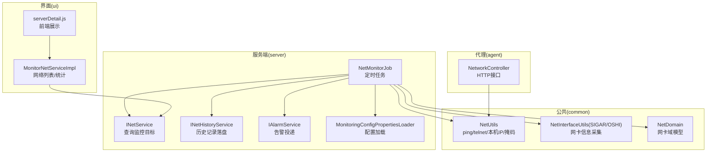
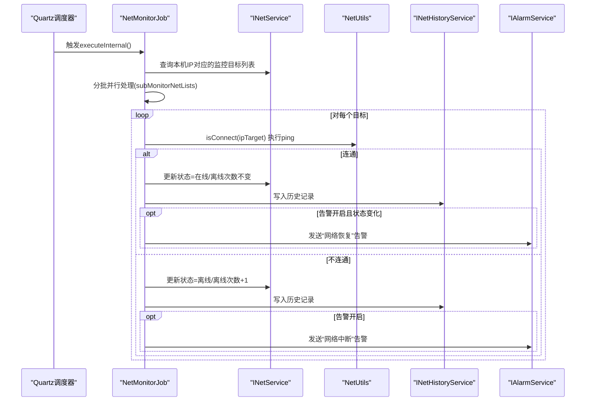
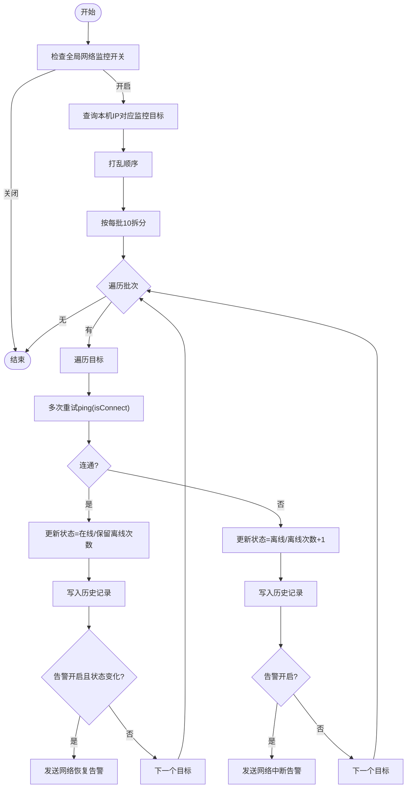
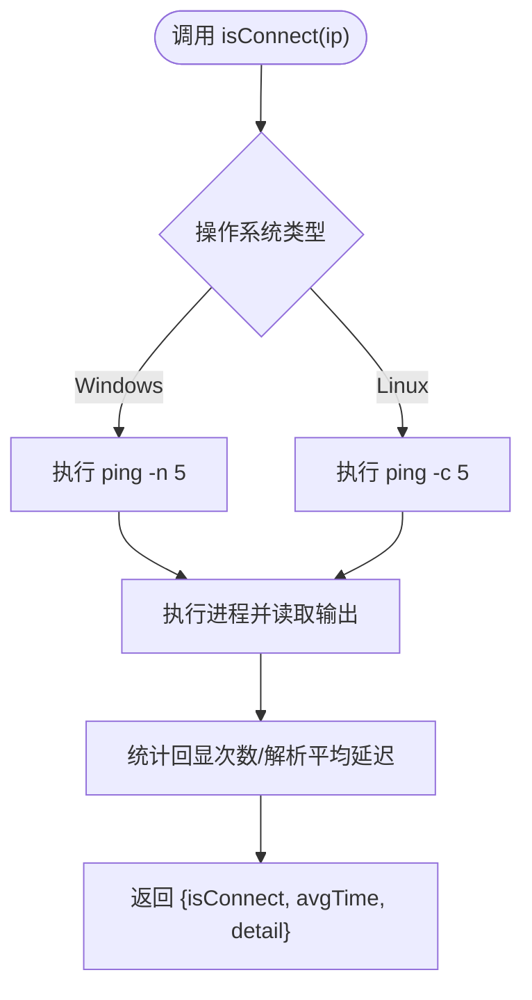
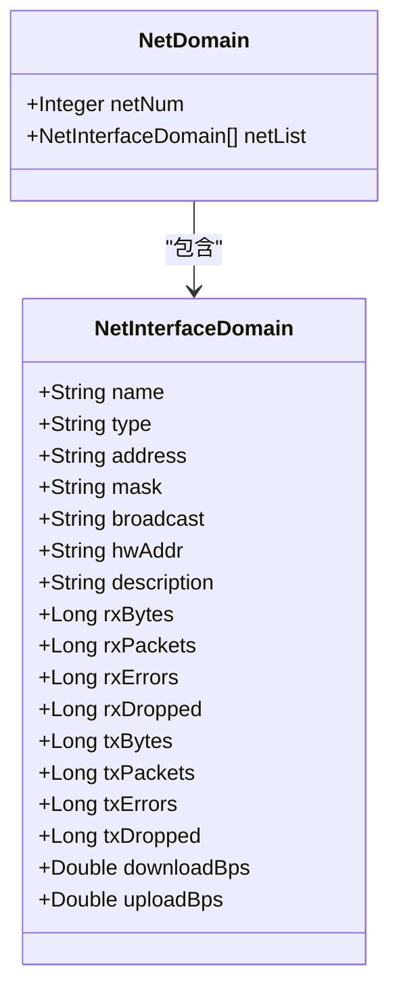
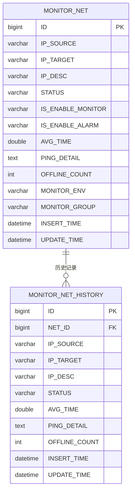
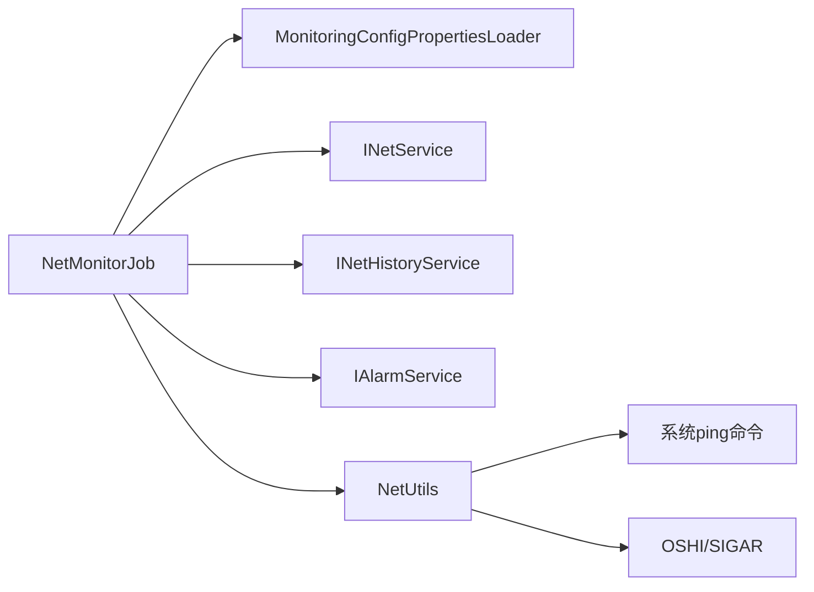

# 网络监控任务

<cite>
**本文引用的文件**
- [NetMonitorJob.java](file://phoenix-server/src/main/java/com/gitee/pifeng/monitoring/server/business/server/monitor/net/NetMonitorJob.java)
- [NetUtils.java](file://phoenix-common/phoenix-common-core/src/main/java/com/gitee/pifeng/monitoring/common/util/server/NetUtils.java)
- [NetInterfaceUtils.java (SIGAR)](file://phoenix-common/phoenix-common-core/src/main/java/com/gitee/pifeng/monitoring/common/util/server/sigar/NetInterfaceUtils.java)
- [NetInterfaceUtils.java (OSHI)](file://phoenix-common/phoenix-common-core/src/main/java/com/gitee/pifeng/monitoring/common/util/server/oshi/NetInterfaceUtils.java)
- [NetDomain.java](file://phoenix-common/phoenix-common-core/src/main/java/com/gitee/pifeng/monitoring/common/domain/server/NetDomain.java)
- [MonitoringNetworkProperties.java](file://phoenix-common/phoenix-common-core/src/main/java/com/gitee/pifeng/monitoring/common/property/server/MonitoringNetworkProperties.java)
- [MonitoringNetworkStatusProperties.java](file://phoenix-common/phoenix-common-core/src/main/java/com/gitee/pifeng/monitoring/common/property/server/MonitoringNetworkStatusProperties.java)
- [MonitoringProperties.java](file://phoenix-common/phoenix-common-core/src/main/java/com/gitee/pifeng/monitoring/common/property/server/MonitoringProperties.java)
- [MonitoringConfigPropertiesLoader.java](file://phoenix-server/src/main/java/com/gitee/pifeng/monitoring/server/business/server/core/MonitoringConfigPropertiesLoader.java)
- [INetService.java](file://phoenix-server/src/main/java/com/gitee/pifeng/monitoring/server/business/server/service/INetService.java)
- [INetHistoryService.java](file://phoenix-server/src/main/java/com/gitee/pifeng/monitoring/server/business/server/service/INetHistoryService.java)
- [MonitorNet.java](file://phoenix-server/src/main/java/com/gitee/pifeng/monitoring/server/business/server/entity/MonitorNet.java)
- [phoenix.sql（数据库结构）](file://doc/数据库设计/sql/mysql/phoenix.sql)
- [NetworkController.java](file://phoenix-agent/src/main/java/com/gitee/pifeng/monitoring/agent/business/client/controller/NetworkController.java)
- [MonitorNetServiceImpl.java](file://phoenix-ui/src/main/java/com/gitee/pifeng/monitoring/ui/business/web/service/impl/MonitorNetServiceImpl.java)
- [serverDetail.js（前端展示）](file://phoenix-ui/src/main/resources/static/modules/server/serverDetail.js)
</cite>

## 目录
1. [简介](#简介)
2. [项目结构](#项目结构)
3. [核心组件](#核心组件)
4. [架构总览](#架构总览)
5. [详细组件分析](#详细组件分析)
6. [依赖分析](#依赖分析)
7. [性能考虑](#性能考虑)
8. [故障排除指南](#故障排除指南)
9. [结论](#结论)
10. [附录](#附录)

## 简介
本文件面向网络监控任务，围绕 NetMonitorJob 类展开，系统性阐述其在服务端的实现原理、数据采集机制、告警规则与配置、以及与 Agent/Server/UI 的集成关系。内容覆盖：
- 功能范围：TCP 连通性监控、网络状态（在线/离线）判定、平均响应时间统计、离线次数累计、历史记录落盘。
- 数据采集：基于本地 IP 遍历监控目标，使用系统 ping 命令进行连通性探测与延迟统计。
- 告警规则：网络中断/恢复两类告警，支持按监控项独立开关。
- 实现细节：Quartz 定时调度、线程池并发处理、历史记录表落盘、告警消息封装与投递。
- 配置参数：监控开关、阈值重试次数、网络状态监控与告警开关、环境/分组等元信息。
- 故障排除与性能优化：常见问题定位、线程池与调度策略建议。

## 项目结构
网络监控相关代码分布于 server、common、agent、ui 四个模块中，职责划分如下：
- server：定时任务调度与执行、业务逻辑、历史记录落盘、告警投递。
- common：跨平台网络工具、网卡信息采集（SIGAR/OSHI）、领域模型。
- agent：对外暴露网络探测能力的 HTTP 接口（供 UI/Server 调用）。
- ui：网络监控页面、历史查询、图表展示。

**图表来源**
- [NetMonitorJob.java:100-167](file://phoenix-server/src/main/java/com/gitee/pifeng/monitoring/server/business/server/monitor/net/NetMonitorJob.java#L100-L167)
- [NetUtils.java:377-456](file://phoenix-common/phoenix-common-core/src/main/java/com/gitee/pifeng/monitoring/common/util/server/NetUtils.java#L377-L456)
- [NetInterfaceUtils.java (SIGAR):37-124](file://phoenix-common/phoenix-common-core/src/main/java/com/gitee/pifeng/monitoring/common/util/server/sigar/NetInterfaceUtils.java#L37-L124)
- [NetInterfaceUtils.java (OSHI):40-111](file://phoenix-common/phoenix-common-core/src/main/java/com/gitee/pifeng/monitoring/common/util/server/oshi/NetInterfaceUtils.java#L40-L111)
- [NetDomain.java:23-121](file://phoenix-common/phoenix-common-core/src/main/java/com/gitee/pifeng/monitoring/common/domain/server/NetDomain.java#L23-L121)
- [NetworkController.java:52-77](file://phoenix-agent/src/main/java/com/gitee/pifeng/monitoring/agent/business/client/controller/NetworkController.java#L52-L77)
- [MonitorNetServiceImpl.java:121-124](file://phoenix-ui/src/main/java/com/gitee/pifeng/monitoring/ui/business/web/service/impl/MonitorNetServiceImpl.java#L121-L124)
- [serverDetail.js:960-978](file://phoenix-ui/src/main/resources/static/modules/server/serverDetail.js#L960-L978)

**章节来源**
- [NetMonitorJob.java:100-167](file://phoenix-server/src/main/java/com/gitee/pifeng/monitoring/server/business/server/monitor/net/NetMonitorJob.java#L100-L167)
- [NetUtils.java:377-456](file://phoenix-common/phoenix-common-core/src/main/java/com/gitee/pifeng/monitoring/common/util/server/NetUtils.java#L377-L456)
- [NetInterfaceUtils.java (SIGAR):37-124](file://phoenix-common/phoenix-common-core/src/main/java/com/gitee/pifeng/monitoring/common/util/server/sigar/NetInterfaceUtils.java#L37-L124)
- [NetInterfaceUtils.java (OSHI):40-111](file://phoenix-common/phoenix-common-core/src/main/java/com/gitee/pifeng/monitoring/common/util/server/oshi/NetInterfaceUtils.java#L40-L111)
- [NetDomain.java:23-121](file://phoenix-common/phoenix-common-core/src/main/java/com/gitee/pifeng/monitoring/common/domain/server/NetDomain.java#L23-L121)
- [NetworkController.java:52-77](file://phoenix-agent/src/main/java/com/gitee/pifeng/monitoring/agent/business/client/controller/NetworkController.java#L52-L77)
- [MonitorNetServiceImpl.java:121-124](file://phoenix-ui/src/main/java/com/gitee/pifeng/monitoring/ui/business/web/service/impl/MonitorNetServiceImpl.java#L121-L124)
- [serverDetail.js:960-978](file://phoenix-ui/src/main/resources/static/modules/server/serverDetail.js#L960-L978)

## 核心组件
- NetMonitorJob：基于 Quartz 的定时任务，负责扫描监控目标、执行连通性探测、状态更新、历史记录落盘与告警。
- NetUtils：提供 ping 探测、平均延迟解析、本机 IP/掩码获取等通用网络能力。
- NetInterfaceUtils（SIGAR/OSHI）：跨平台网卡信息采集，用于网卡状态与带宽统计。
- NetDomain：网卡信息的统一领域模型，包含网卡配置、统计计数与带宽指标。
- INetService/INetHistoryService：网络监控目标与历史记录的服务接口。
- 配置属性：MonitoringNetworkProperties、MonitoringNetworkStatusProperties、MonitoringProperties 及加载器。
- Agent 控制器：NetworkController 提供“获取源IP”“测试网络连通性”等接口。
- UI 展示：MonitorNetServiceImpl 提供网络列表查询，serverDetail.js 展示网卡统计。

**章节来源**
- [NetMonitorJob.java:54-91](file://phoenix-server/src/main/java/com/gitee/pifeng/monitoring/server/business/server/monitor/net/NetMonitorJob.java#L54-L91)
- [NetUtils.java:377-456](file://phoenix-common/phoenix-common-core/src/main/java/com/gitee/pifeng/monitoring/common/util/server/NetUtils.java#L377-L456)
- [NetInterfaceUtils.java (SIGAR):37-124](file://phoenix-common/phoenix-common-core/src/main/java/com/gitee/pifeng/monitoring/common/util/server/sigar/NetInterfaceUtils.java#L37-L124)
- [NetInterfaceUtils.java (OSHI):40-111](file://phoenix-common/phoenix-common-core/src/main/java/com/gitee/pifeng/monitoring/common/util/server/oshi/NetInterfaceUtils.java#L40-L111)
- [NetDomain.java:23-121](file://phoenix-common/phoenix-common-core/src/main/java/com/gitee/pifeng/monitoring/common/domain/server/NetDomain.java#L23-L121)
- [MonitoringNetworkProperties.java:19-31](file://phoenix-common/phoenix-common-core/src/main/java/com/gitee/pifeng/monitoring/common/property/server/MonitoringNetworkProperties.java#L19-L31)
- [MonitoringNetworkStatusProperties.java:19-31](file://phoenix-common/phoenix-common-core/src/main/java/com/gitee/pifeng/monitoring/common/property/server/MonitoringNetworkStatusProperties.java#L19-L31)
- [MonitoringProperties.java:19-61](file://phoenix-common/phoenix-common-core/src/main/java/com/gitee/pifeng/monitoring/common/property/server/MonitoringProperties.java#L19-L61)
- [MonitoringConfigPropertiesLoader.java:126-144](file://phoenix-server/src/main/java/com/gitee/pifeng/monitoring/server/business/server/core/MonitoringConfigPropertiesLoader.java#L126-L144)
- [INetService.java:15-40](file://phoenix-server/src/main/java/com/gitee/pifeng/monitoring/server/business/server/service/INetService.java#L15-L40)
- [INetHistoryService.java:16-29](file://phoenix-server/src/main/java/com/gitee/pifeng/monitoring/server/business/server/service/INetHistoryService.java#L16-L29)
- [NetworkController.java:52-77](file://phoenix-agent/src/main/java/com/gitee/pifeng/monitoring/agent/business/client/controller/NetworkController.java#L52-L77)
- [MonitorNetServiceImpl.java:121-124](file://phoenix-ui/src/main/java/com/gitee/pifeng/monitoring/ui/business/web/service/impl/MonitorNetServiceImpl.java#L121-L124)
- [serverDetail.js:960-978](file://phoenix-ui/src/main/resources/static/modules/server/serverDetail.js#L960-L978)

## 架构总览
下图展示了网络监控任务从触发到落盘与告警的关键交互：

**图表来源**
- [NetMonitorJob.java:100-167](file://phoenix-server/src/main/java/com/gitee/pifeng/monitoring/server/business/server/monitor/net/NetMonitorJob.java#L100-L167)
- [NetUtils.java:377-456](file://phoenix-common/phoenix-common-core/src/main/java/com/gitee/pifeng/monitoring/common/util/server/NetUtils.java#L377-L456)
- [INetService.java:15-40](file://phoenix-server/src/main/java/com/gitee/pifeng/monitoring/server/business/server/service/INetService.java#L15-L40)
- [INetHistoryService.java:16-29](file://phoenix-server/src/main/java/com/gitee/pifeng/monitoring/server/business/server/service/INetHistoryService.java#L16-L29)

## 详细组件分析

### NetMonitorJob：网络监控任务核心
- 触发与控制
  - 仅当全局网络监控与“网络状态监控”开关均开启时才执行。
  - 使用同步块避免重复执行，按每批 10 条目标拆分并提交至线程池并发处理。
- 数据采集与判定
  - 通过 NetUtils.isConnect(ipTarget) 执行 ping 探测，支持多次重试（阈值由配置决定），以提升稳定性。
  - 根据探测结果更新状态、平均响应时间、ping 详情与离线次数。
- 历史记录
  - 每次状态变更均写入 MONITOR_NET_HISTORY 表，保留 IP 源/目标、状态、平均耗时、离线次数与明细。
- 告警
  - “网络中断”与“网络恢复”两类告警，受“网络状态告警”开关与监控项“是否开启告警”共同控制。
  - 告警消息包含源/目标 IP、描述、环境、分组与时间戳，用于后续通知。

**图表来源**
- [NetMonitorJob.java:100-167](file://phoenix-server/src/main/java/com/gitee/pifeng/monitoring/server/business/server/monitor/net/NetMonitorJob.java#L100-L167)
- [NetMonitorJob.java:180-254](file://phoenix-server/src/main/java/com/gitee/pifeng/monitoring/server/business/server/monitor/net/NetMonitorJob.java#L180-L254)
- [NetMonitorJob.java:269-307](file://phoenix-server/src/main/java/com/gitee/pifeng/monitoring/server/business/server/monitor/net/NetMonitorJob.java#L269-L307)
- [NetUtils.java:377-456](file://phoenix-common/phoenix-common-core/src/main/java/com/gitee/pifeng/monitoring/common/util/server/NetUtils.java#L377-L456)

**章节来源**
- [NetMonitorJob.java:100-167](file://phoenix-server/src/main/java/com/gitee/pifeng/monitoring/server/business/server/monitor/net/NetMonitorJob.java#L100-L167)
- [NetMonitorJob.java:180-254](file://phoenix-server/src/main/java/com/gitee/pifeng/monitoring/server/business/server/monitor/net/NetMonitorJob.java#L180-L254)
- [NetMonitorJob.java:269-307](file://phoenix-server/src/main/java/com/gitee/pifeng/monitoring/server/business/server/monitor/net/NetMonitorJob.java#L269-L307)
- [NetUtils.java:377-456](file://phoenix-common/phoenix-common-core/src/main/java/com/gitee/pifeng/monitoring/common/util/server/NetUtils.java#L377-L456)

### NetUtils：连通性探测与解析
- ping 探测
  - Windows/Linux 分别使用不同参数执行 ping 命令，合并错误输出，统计收到回显的次数作为连通性依据。
  - 解析平均延迟，兼容英文“average”、中文“平均”与 Linux 统计格式“min/avg/max/mdev”。
- 返回结构
  - 返回 Map 包含：是否连通、平均耗时（毫秒）、完整 ping 输出详情。
- 其他能力
  - 本机 IP/掩码获取、MAC 地址获取（多实现路径）。

**图表来源**
- [NetUtils.java:377-456](file://phoenix-common/phoenix-common-core/src/main/java/com/gitee/pifeng/monitoring/common/util/server/NetUtils.java#L377-L456)
- [NetUtils.java:493-518](file://phoenix-common/phoenix-common-core/src/main/java/com/gitee/pifeng/monitoring/common/util/server/NetUtils.java#L493-L518)

**章节来源**
- [NetUtils.java:377-456](file://phoenix-common/phoenix-common-core/src/main/java/com/gitee/pifeng/monitoring/common/util/server/NetUtils.java#L377-L456)
- [NetUtils.java:493-518](file://phoenix-common/phoenix-common-core/src/main/java/com/gitee/pifeng/monitoring/common/util/server/NetUtils.java#L493-L518)

### 网卡信息采集与带宽统计
- SIGAR/OSHI 两套实现
  - 遍历网卡接口，过滤回环、空 MAC、任意地址、docker/lo 等无效接口。
  - 采集网卡配置（名称、类型、地址、掩码、广播、MAC、描述）与统计计数（收发字节、包数、错误/丢弃）。
  - 通过两次采样（间隔约 1 秒）计算下载/上传速率（bps）。
- 领域模型
  - NetDomain 与 NetInterfaceDomain 统一承载网卡信息与指标。

**图表来源**
- [NetDomain.java:23-121](file://phoenix-common/phoenix-common-core/src/main/java/com/gitee/pifeng/monitoring/common/domain/server/NetDomain.java#L23-L121)
- [NetInterfaceUtils.java (SIGAR):37-124](file://phoenix-common/phoenix-common-core/src/main/java/com/gitee/pifeng/monitoring/common/util/server/sigar/NetInterfaceUtils.java#L37-L124)
- [NetInterfaceUtils.java (OSHI):40-111](file://phoenix-common/phoenix-common-core/src/main/java/com/gitee/pifeng/monitoring/common/util/server/oshi/NetInterfaceUtils.java#L40-L111)

**章节来源**
- [NetInterfaceUtils.java (SIGAR):37-124](file://phoenix-common/phoenix-common-core/src/main/java/com/gitee/pifeng/monitoring/common/util/server/sigar/NetInterfaceUtils.java#L37-L124)
- [NetInterfaceUtils.java (OSHI):40-111](file://phoenix-common/phoenix-common-core/src/main/java/com/gitee/pifeng/monitoring/common/util/server/oshi/NetInterfaceUtils.java#L40-L111)
- [NetDomain.java:23-121](file://phoenix-common/phoenix-common-core/src/main/java/com/gitee/pifeng/monitoring/common/domain/server/NetDomain.java#L23-L121)

### 配置与实体模型
- 配置属性
  - MonitoringProperties：包含全局阈值、网络/HTTP/TCP/服务器等监控属性。
  - MonitoringNetworkProperties：网络监控总开关与网络状态子配置。
  - MonitoringNetworkStatusProperties：网络状态监控与告警开关。
  - 默认值：网络监控与网络状态监控默认开启，网络状态告警默认开启。
- 实体模型
  - MonitorNet：监控目标表，包含源/目标 IP、状态、是否启用监控/告警、平均耗时、ping 详情、离线次数、环境/分组等。
  - MONITOR_NET 与 MONITOR_NET_HISTORY：数据库表结构，字段覆盖上述实体。

**图表来源**
- [phoenix.sql（数据库结构）:539-581](file://doc/数据库设计/sql/mysql/phoenix.sql#L539-L581)
- [MonitorNet.java:27-113](file://phoenix-server/src/main/java/com/gitee/pifeng/monitoring/server/business/server/entity/MonitorNet.java#L27-L113)

**章节来源**
- [MonitoringProperties.java:19-61](file://phoenix-common/phoenix-common-core/src/main/java/com/gitee/pifeng/monitoring/common/property/server/MonitoringProperties.java#L19-L61)
- [MonitoringNetworkProperties.java:19-31](file://phoenix-common/phoenix-common-core/src/main/java/com/gitee/pifeng/monitoring/common/property/server/MonitoringNetworkProperties.java#L19-L31)
- [MonitoringNetworkStatusProperties.java:19-31](file://phoenix-common/phoenix-common-core/src/main/java/com/gitee/pifeng/monitoring/common/property/server/MonitoringNetworkStatusProperties.java#L19-L31)
- [MonitoringConfigPropertiesLoader.java:126-144](file://phoenix-server/src/main/java/com/gitee/pifeng/monitoring/server/business/server/core/MonitoringConfigPropertiesLoader.java#L126-L144)
- [phoenix.sql（数据库结构）:539-581](file://doc/数据库设计/sql/mysql/phoenix.sql#L539-L581)
- [MonitorNet.java:27-113](file://phoenix-server/src/main/java/com/gitee/pifeng/monitoring/server/business/server/entity/MonitorNet.java#L27-L113)

### Agent 与 UI 集成
- Agent 接口
  - NetworkController 暴露“获取源IP”“测试网络连通性”接口，便于前端或服务端发起探测。
- UI 展示
  - MonitorNetServiceImpl 提供网络列表查询与统计聚合。
  - serverDetail.js 展示网卡统计（接收/发送字节、包数、错误/丢弃、下行/上行带宽）。

**章节来源**
- [NetworkController.java:52-77](file://phoenix-agent/src/main/java/com/gitee/pifeng/monitoring/agent/business/client/controller/NetworkController.java#L52-L77)
- [MonitorNetServiceImpl.java:121-124](file://phoenix-ui/src/main/java/com/gitee/pifeng/monitoring/ui/business/web/service/impl/MonitorNetServiceImpl.java#L121-L124)
- [serverDetail.js（前端展示）:960-978](file://phoenix-ui/src/main/resources/static/modules/server/serverDetail.js#L960-L978)

## 依赖分析
- 组件耦合
  - NetMonitorJob 依赖配置加载器、服务接口、历史服务与告警服务，职责清晰。
  - NetUtils 与 NetInterfaceUtils 为纯工具类，无循环依赖。
- 外部依赖
  - 操作系统 ping 命令、SIGAR/OSHI 系统库、Quartz 调度框架。
- 潜在风险
  - ping 命令解析依赖系统输出格式，需关注不同语言/版本差异。
  - 大规模并发 ping 可能带来系统资源压力，应结合线程池与批处理策略。

**图表来源**
- [NetMonitorJob.java:59-91](file://phoenix-server/src/main/java/com/gitee/pifeng/monitoring/server/business/server/monitor/net/NetMonitorJob.java#L59-L91)
- [NetUtils.java:377-456](file://phoenix-common/phoenix-common-core/src/main/java/com/gitee/pifeng/monitoring/common/util/server/NetUtils.java#L377-L456)

**章节来源**
- [NetMonitorJob.java:59-91](file://phoenix-server/src/main/java/com/gitee/pifeng/monitoring/server/business/server/monitor/net/NetMonitorJob.java#L59-L91)
- [NetUtils.java:377-456](file://phoenix-common/phoenix-common-core/src/main/java/com/gitee/pifeng/monitoring/common/util/server/NetUtils.java#L377-L456)

## 性能考虑
- 并发与批处理
  - 已采用线程池与分批（每批 10）处理，降低单次调度耗时。
- 重试策略
  - 阈值参数可配置，平衡稳定性与性能。
- I/O 与存储
  - 每次状态变更写入历史表，建议定期清理历史数据，避免表膨胀。
- 系统资源
  - 大规模 ping 并发可能占用 CPU/IO，建议结合环境与目标数量调整批大小与线程池容量。

[本节为通用指导，无需特定文件引用]

## 故障排除指南
- ping 结果异常
  - 确认系统 ping 命令可用与权限充足；检查 NetUtils 的输出解析逻辑是否匹配当前系统语言/版本。
- 告警未触发
  - 检查“网络状态监控”“网络状态告警”“监控项是否启用告警”三者开关。
- 状态未更新
  - 核对 INetService 查询条件（按本机 IP 过滤）与 MonitorNet 数据是否正确。
- 历史记录缺失
  - 检查 INetHistoryService 写入逻辑与数据库权限。
- 带宽/网卡统计异常
  - 确认 SIGAR/OSHI 初始化与网卡过滤逻辑，关注 docker/lo 等无效接口。

**章节来源**
- [NetMonitorJob.java:100-167](file://phoenix-server/src/main/java/com/gitee/pifeng/monitoring/server/business/server/monitor/net/NetMonitorJob.java#L100-L167)
- [NetMonitorJob.java:269-307](file://phoenix-server/src/main/java/com/gitee/pifeng/monitoring/server/business/server/monitor/net/NetMonitorJob.java#L269-L307)
- [INetHistoryService.java:16-29](file://phoenix-server/src/main/java/com/gitee/pifeng/monitoring/server/business/server/service/INetHistoryService.java#L16-L29)

## 结论
NetMonitorJob 通过 Quartz 定时调度、线程池并发与系统 ping 探测，实现了对网络连通性的稳定监控，并配套历史记录与告警机制。结合 Agent/Server/UI 的协同，形成从探测、存储到可视化的完整闭环。建议在生产环境中合理设置阈值与批大小，定期清理历史数据，并持续验证不同操作系统的 ping 输出解析。

[本节为总结，无需特定文件引用]

## 附录

### 配置参数说明（节选）
- 全局
  - threshold：探测重试次数（影响稳定性与耗时）。
- 网络监控
  - networkProperties.enable：是否启用网络监控。
  - networkStatusProperties.enable：是否启用网络状态监控。
  - networkStatusProperties.alarmEnable：网络状态告警是否开启。
- 监控目标
  - MonitorNet 表字段：IP 源/目标、描述、是否启用监控/告警、环境/分组、平均耗时、ping 详情、离线次数等。

**章节来源**
- [MonitoringProperties.java:21-24](file://phoenix-common/phoenix-common-core/src/main/java/com/gitee/pifeng/monitoring/common/property/server/MonitoringProperties.java#L21-L24)
- [MonitoringNetworkProperties.java:21-24](file://phoenix-common/phoenix-common-core/src/main/java/com/gitee/pifeng/monitoring/common/property/server/MonitoringNetworkProperties.java#L21-L24)
- [MonitoringNetworkStatusProperties.java:21-29](file://phoenix-common/phoenix-common-core/src/main/java/com/gitee/pifeng/monitoring/common/property/server/MonitoringNetworkStatusProperties.java#L21-L29)
- [MonitorNet.java:37-113](file://phoenix-server/src/main/java/com/gitee/pifeng/monitoring/server/business/server/entity/MonitorNet.java#L37-L113)