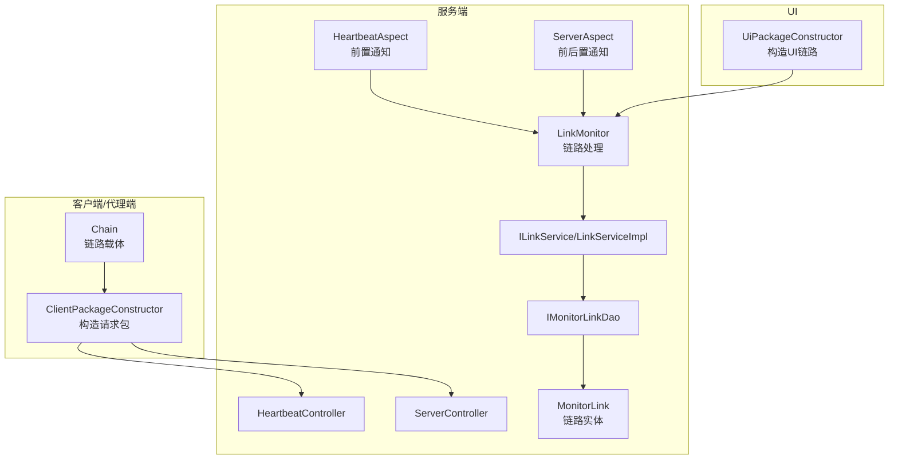
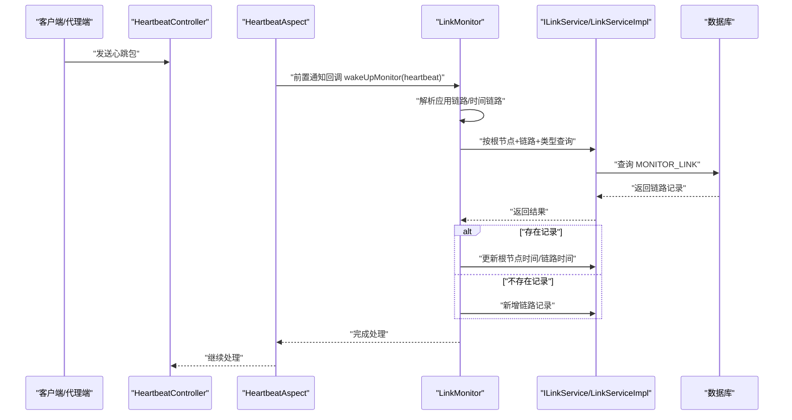
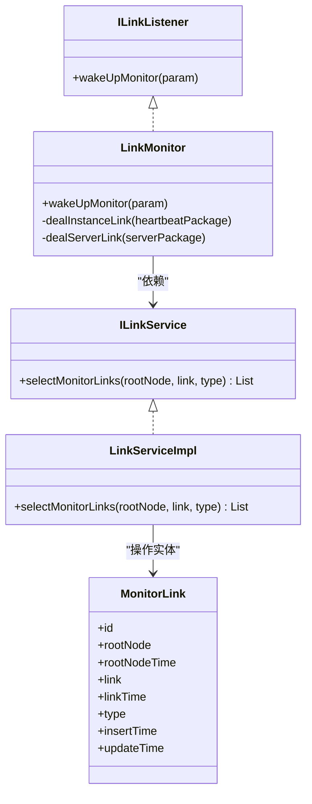
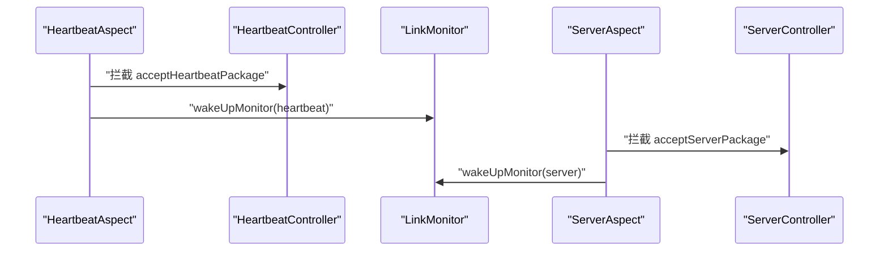
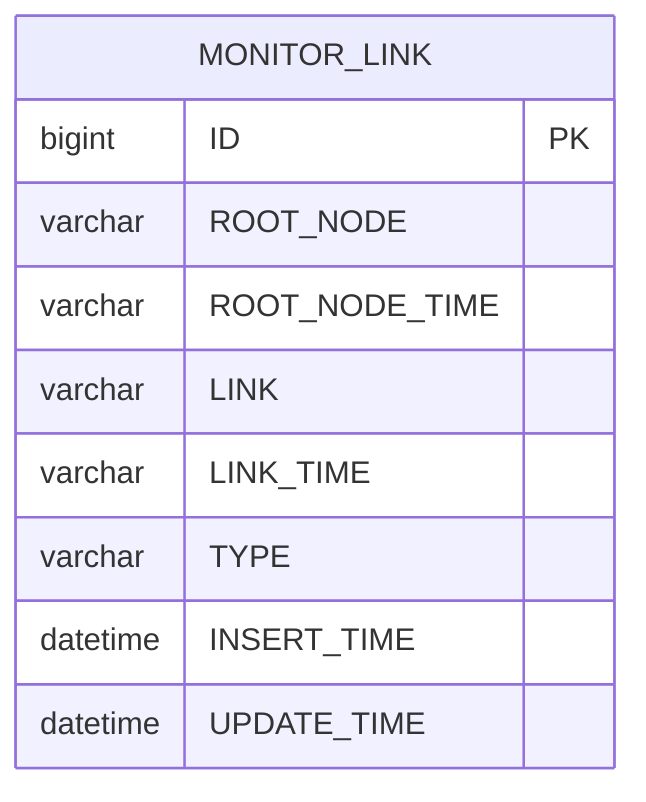
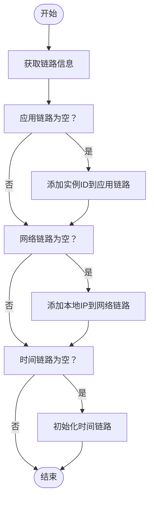
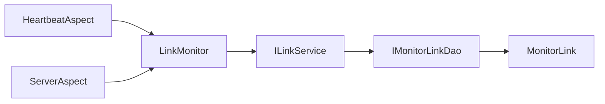

# 链路监控任务

<cite>
**本文引用的文件**
- [LinkMonitor.java](file://phoenix-server/src/main/java/com/gitee/pifeng/monitoring/server/business/server/monitor/LinkMonitor.java)
- [ILinkListener.java](file://phoenix-server/src/main/java/com/gitee/pifeng/monitoring/server/inf/ILinkListener.java)
- [HeartbeatAspect.java](file://phoenix-server/src/main/java/com/gitee/pifeng/monitoring/server/business/server/component/HeartbeatAspect.java)
- [ServerAspect.java](file://phoenix-server/src/main/java/com/gitee/pifeng/monitoring/server/business/server/component/ServerAspect.java)
- [HeartbeatController.java](file://phoenix-server/src/main/java/com/gitee/pifeng/monitoring/server/business/server/controller/HeartbeatController.java)
- [ServerController.java](file://phoenix-server/src/main/java/com/gitee/pifeng/monitoring/server/business/server/controller/ServerController.java)
- [ILinkService.java](file://phoenix-server/src/main/java/com/gitee/pifeng/monitoring/server/business/server/service/ILinkService.java)
- [LinkServiceImpl.java](file://phoenix-server/src/main/java/com/gitee/pifeng/monitoring/server/business/server/service/impl/LinkServiceImpl.java)
- [IMonitorLinkDao.java](file://phoenix-server/src/main/java/com/gitee/pifeng/monitoring/server/business/server/dao/IMonitorLinkDao.java)
- [MonitorLink.java](file://phoenix-server/src/main/java/com/gitee/pifeng/monitoring/server/business/server/entity/MonitorLink.java)
- [Chain.java](file://phoenix-common/phoenix-common-core/src/main/java/com/gitee/pifeng/monitoring/common/domain/Chain.java)
- [MonitorTypeEnums.java](file://phoenix-common/phoenix-common-core/src/main/java/com/gitee/pifeng/monitoring/common/constant/monitortype/MonitorTypeEnums.java)
- [ClientPackageConstructor.java](file://phoenix-client/phoenix-client-core/src/main/java/com/gitee/pifeng/monitoring/plug/core/ClientPackageConstructor.java)
- [UiPackageConstructor.java](file://phoenix-ui/src/main/java/com/gitee/pifeng/monitoring/ui/core/UiPackageConstructor.java)
- [MonitoringAlarmProperties.java](file://phoenix-common/phoenix-common-core/src/main/java/com/gitee/pifeng/monitoring/common/property/server/MonitoringAlarmProperties.java)
- [Alarm.java](file://phoenix-common/phoenix-common-core/src/main/java/com/gitee/pifeng/monitoring/common/domain/Alarm.java)
- [phoenix.sql](file://doc/数据库设计/sql/mysql/phoenix.sql)
</cite>

## 目录
1. [简介](#简介)
2. [项目结构](#项目结构)
3. [核心组件](#核心组件)
4. [架构总览](#架构总览)
5. [详细组件分析](#详细组件分析)
6. [依赖分析](#依赖分析)
7. [性能考虑](#性能考虑)
8. [故障排除指南](#故障排除指南)
9. [结论](#结论)
10. [附录](#附录)

## 简介
本技术文档围绕链路监控任务展开，系统性阐述 LinkMonitor 类的实现原理与运行机制，覆盖服务间链路监控的核心逻辑、数据采集与存储流程、调用链追踪、可用性监控、告警机制以及配置参数与性能优化建议。读者可据此理解从客户端/代理端发送心跳包与服务器信息包，到服务端通过切面拦截、链路解析、持久化存储与后续可用性判断的完整闭环。

## 项目结构
链路监控涉及客户端/代理端、服务端与UI三层协作：
- 客户端/代理端负责构造并发送心跳包与服务器信息包，同时在包体中携带链路信息（网络链路、应用链路、时间链路）。
- 服务端通过切面拦截控制器方法，在前置通知阶段触发链路监听器，将链路信息写入数据库。
- UI 展示链路拓扑、链路可用性与告警记录。

**图表来源**
- [HeartbeatController.java:61-77](file://phoenix-server/src/main/java/com/gitee/pifeng/monitoring/server/business/server/controller/HeartbeatController.java#L61-L77)
- [ServerController.java:62-74](file://phoenix-server/src/main/java/com/gitee/pifeng/monitoring/server/business/server/controller/ServerController.java#L62-L74)
- [HeartbeatAspect.java:57-70](file://phoenix-server/src/main/java/com/gitee/pifeng/monitoring/server/business/server/component/HeartbeatAspect.java#L57-L70)
- [ServerAspect.java:65-104](file://phoenix-server/src/main/java/com/gitee/pifeng/monitoring/server/business/server/component/ServerAspect.java#L65-L104)
- [LinkMonitor.java:51-63](file://phoenix-server/src/main/java/com/gitee/pifeng/monitoring/server/business/server/monitor/LinkMonitor.java#L51-L63)
- [ILinkService.java:16-32](file://phoenix-server/src/main/java/com/gitee/pifeng/monitoring/server/business/server/service/ILinkService.java#L16-L32)
- [LinkServiceImpl.java:21-44](file://phoenix-server/src/main/java/com/gitee/pifeng/monitoring/server/business/server/service/impl/LinkServiceImpl.java#L21-L44)
- [IMonitorLinkDao.java:14-15](file://phoenix-server/src/main/java/com/gitee/pifeng/monitoring/server/business/server/dao/IMonitorLinkDao.java#L14-L15)
- [MonitorLink.java:27-77](file://phoenix-server/src/main/java/com/gitee/pifeng/monitoring/server/business/server/entity/MonitorLink.java#L27-L77)
- [ClientPackageConstructor.java:80-105](file://phoenix-client/phoenix-client-core/src/main/java/com/gitee/pifeng/monitoring/plug/core/ClientPackageConstructor.java#L80-L105)
- [UiPackageConstructor.java:47-69](file://phoenix-ui/src/main/java/com/gitee/pifeng/monitoring/ui/core/UiPackageConstructor.java#L47-L69)

**章节来源**
- [HeartbeatController.java:1-80](file://phoenix-server/src/main/java/com/gitee/pifeng/monitoring/server/business/server/controller/HeartbeatController.java#L1-L80)
- [ServerController.java:1-77](file://phoenix-server/src/main/java/com/gitee/pifeng/monitoring/server/business/server/controller/ServerController.java#L1-L77)
- [HeartbeatAspect.java:1-73](file://phoenix-server/src/main/java/com/gitee/pifeng/monitoring/server/business/server/component/HeartbeatAspect.java#L1-L73)
- [ServerAspect.java:1-107](file://phoenix-server/src/main/java/com/gitee/pifeng/monitoring/server/business/server/component/ServerAspect.java#L1-L107)
- [LinkMonitor.java:1-177](file://phoenix-server/src/main/java/com/gitee/pifeng/monitoring/server/business/server/monitor/LinkMonitor.java#L1-L177)

## 核心组件
- 链路监听器接口 ILinkListener：定义统一的回调入口，供切面在前置通知阶段触发。
- 链路监控器 LinkMonitor：实现 ILinkListener，负责解析心跳包与服务器信息包中的链路信息，进行去重、拼接与持久化。
- 切面组件 HeartbeatAspect 与 ServerAspect：分别拦截心跳包与服务器信息包的控制器方法，触发链路监听器回调。
- 链路服务 ILinkService/LinkServiceImpl：封装链路数据的查询、新增与更新。
- 链路实体 MonitorLink：映射数据库表 MONITOR_LINK，存储根节点、链路字符串、链路时间与类型等。
- 链路载体 Chain：承载网络链路、应用链路与时间链路三元集合，贯穿客户端/代理端与UI构造过程。

**章节来源**
- [ILinkListener.java:16-31](file://phoenix-server/src/main/java/com/gitee/pifeng/monitoring/server/inf/ILinkListener.java#L16-L31)
- [LinkMonitor.java:32-63](file://phoenix-server/src/main/java/com/gitee/pifeng/monitoring/server/business/server/monitor/LinkMonitor.java#L32-L63)
- [HeartbeatAspect.java:28-73](file://phoenix-server/src/main/java/com/gitee/pifeng/monitoring/server/business/server/component/HeartbeatAspect.java#L28-L73)
- [ServerAspect.java:29-107](file://phoenix-server/src/main/java/com/gitee/pifeng/monitoring/server/business/server/component/ServerAspect.java#L29-L107)
- [ILinkService.java:16-32](file://phoenix-server/src/main/java/com/gitee/pifeng/monitoring/server/business/server/service/ILinkService.java#L16-L32)
- [LinkServiceImpl.java:21-44](file://phoenix-server/src/main/java/com/gitee/pifeng/monitoring/server/business/server/service/impl/LinkServiceImpl.java#L21-L44)
- [MonitorLink.java:27-77](file://phoenix-server/src/main/java/com/gitee/pifeng/monitoring/server/business/server/entity/MonitorLink.java#L27-L77)
- [Chain.java:25-42](file://phoenix-common/phoenix-common-core/src/main/java/com/gitee/pifeng/monitoring/common/domain/Chain.java#L25-L42)

## 架构总览
链路监控以“包体链路 + 切面监听 + 服务持久化”为核心路径，形成如下闭环：
- 客户端/代理端在请求包中注入链路信息（网络链路、应用链路、时间链路）。
- 服务端通过切面在控制器方法进入前触发链路监听器。
- 监听器解析链路，生成根节点与链路字符串，查询数据库是否存在相同链路。
- 若存在则更新根节点时间与链路时间；若不存在则新增记录。
- UI 可基于链路实体展示拓扑与可用性。

**图表来源**
- [HeartbeatController.java:61-77](file://phoenix-server/src/main/java/com/gitee/pifeng/monitoring/server/business/server/controller/HeartbeatController.java#L61-L77)
- [HeartbeatAspect.java:57-70](file://phoenix-server/src/main/java/com/gitee/pifeng/monitoring/server/business/server/component/HeartbeatAspect.java#L57-L70)
- [LinkMonitor.java:51-117](file://phoenix-server/src/main/java/com/gitee/pifeng/monitoring/server/business/server/monitor/LinkMonitor.java#L51-L117)
- [ILinkService.java:16-32](file://phoenix-server/src/main/java/com/gitee/pifeng/monitoring/server/business/server/service/ILinkService.java#L16-L32)
- [LinkServiceImpl.java:35-42](file://phoenix-server/src/main/java/com/gitee/pifeng/monitoring/server/business/server/service/impl/LinkServiceImpl.java#L35-L42)
- [MonitorLink.java:27-77](file://phoenix-server/src/main/java/com/gitee/pifeng/monitoring/server/business/server/entity/MonitorLink.java#L27-L77)

## 详细组件分析

### LinkMonitor 类分析
LinkMonitor 实现 ILinkListener，承担两类链路处理：
- 应用链路处理：从心跳包提取应用链路与时间链路，去重自身实例，查询数据库，存在则更新根节点时间与链路时间，否则新增。
- 服务器链路处理：从服务器信息包提取网络链路与时间链路，去除服务端本地IP，拼接链路字符串，查询数据库，存在则更新，否则新增。

**图表来源**
- [LinkMonitor.java:32-177](file://phoenix-server/src/main/java/com/gitee/pifeng/monitoring/server/business/server/monitor/LinkMonitor.java#L32-L177)
- [ILinkListener.java:16-31](file://phoenix-server/src/main/java/com/gitee/pifeng/monitoring/server/inf/ILinkListener.java#L16-L31)
- [ILinkService.java:16-32](file://phoenix-server/src/main/java/com/gitee/pifeng/monitoring/server/business/server/service/ILinkService.java#L16-L32)
- [LinkServiceImpl.java:21-44](file://phoenix-server/src/main/java/com/gitee/pifeng/monitoring/server/business/server/service/impl/LinkServiceImpl.java#L21-L44)
- [MonitorLink.java:27-77](file://phoenix-server/src/main/java/com/gitee/pifeng/monitoring/server/business/server/entity/MonitorLink.java#L27-L77)

**章节来源**
- [LinkMonitor.java:51-177](file://phoenix-server/src/main/java/com/gitee/pifeng/monitoring/server/business/server/monitor/LinkMonitor.java#L51-L177)

### 切面与控制器交互
- HeartbeatAspect 在 HeartbeatController.acceptHeartbeatPackage 前置通知阶段，遍历所有 ILinkListener 并异步回调。
- ServerAspect 在 ServerController.acceptServerPackage 前置与后置通知阶段，分别触发链路监听器与服务器监控监听器。

**图表来源**
- [HeartbeatAspect.java:57-70](file://phoenix-server/src/main/java/com/gitee/pifeng/monitoring/server/business/server/component/HeartbeatAspect.java#L57-L70)
- [HeartbeatController.java:61-77](file://phoenix-server/src/main/java/com/gitee/pifeng/monitoring/server/business/server/controller/HeartbeatController.java#L61-L77)
- [ServerAspect.java:65-104](file://phoenix-server/src/main/java/com/gitee/pifeng/monitoring/server/business/server/component/ServerAspect.java#L65-L104)
- [ServerController.java:62-74](file://phoenix-server/src/main/java/com/gitee/pifeng/monitoring/server/business/server/controller/ServerController.java#L62-L74)

**章节来源**
- [HeartbeatAspect.java:28-73](file://phoenix-server/src/main/java/com/gitee/pifeng/monitoring/server/business/server/component/HeartbeatAspect.java#L28-L73)
- [ServerAspect.java:29-107](file://phoenix-server/src/main/java/com/gitee/pifeng/monitoring/server/business/server/component/ServerAspect.java#L29-L107)

### 链路数据模型与持久化
- 链路实体 MonitorLink 映射数据库表 MONITOR_LINK，字段包括根节点、根节点时间、链路字符串、链路时间、类型、插入时间与更新时间。
- ILinkService/LinkServiceImpl 提供按根节点、链路与类型查询链路记录的能力，用于去重与更新。

**图表来源**
- [MonitorLink.java:27-77](file://phoenix-server/src/main/java/com/gitee/pifeng/monitoring/server/business/server/entity/MonitorLink.java#L27-L77)
- [ILinkService.java:16-32](file://phoenix-server/src/main/java/com/gitee/pifeng/monitoring/server/business/server/service/ILinkService.java#L16-L32)
- [LinkServiceImpl.java:35-42](file://phoenix-server/src/main/java/com/gitee/pifeng/monitoring/server/business/server/service/impl/LinkServiceImpl.java#L35-L42)

**章节来源**
- [MonitorLink.java:27-77](file://phoenix-server/src/main/java/com/gitee/pifeng/monitoring/server/business/server/entity/MonitorLink.java#L27-L77)
- [ILinkService.java:16-32](file://phoenix-server/src/main/java/com/gitee/pifeng/monitoring/server/business/server/service/ILinkService.java#L16-L32)
- [LinkServiceImpl.java:21-44](file://phoenix-server/src/main/java/com/gitee/pifeng/monitoring/server/business/server/service/impl/LinkServiceImpl.java#L21-L44)

### 链路采集与构造
- 客户端/代理端在构造请求包时，会填充链路信息（网络链路、应用链路、时间链路），其中应用链路使用实例ID，网络链路使用本地IP。
- UI 在构造链路信息时同样维护三元链路集合，并在必要时补充本地IP。

**图表来源**
- [ClientPackageConstructor.java:80-105](file://phoenix-client/phoenix-client-core/src/main/java/com/gitee/pifeng/monitoring/plug/core/ClientPackageConstructor.java#L80-L105)
- [UiPackageConstructor.java:47-69](file://phoenix-ui/src/main/java/com/gitee/pifeng/monitoring/ui/core/UiPackageConstructor.java#L47-L69)
- [Chain.java:25-42](file://phoenix-common/phoenix-common-core/src/main/java/com/gitee/pifeng/monitoring/common/domain/Chain.java#L25-L42)

**章节来源**
- [ClientPackageConstructor.java:80-105](file://phoenix-client/phoenix-client-core/src/main/java/com/gitee/pifeng/monitoring/plug/core/ClientPackageConstructor.java#L80-L105)
- [UiPackageConstructor.java:47-69](file://phoenix-ui/src/main/java/com/gitee/pifeng/monitoring/ui/core/UiPackageConstructor.java#L47-L69)
- [Chain.java:25-42](file://phoenix-common/phoenix-common-core/src/main/java/com/gitee/pifeng/monitoring/common/domain/Chain.java#L25-L42)

### 链路类型与监控范围
- 链路类型枚举 MonitorTypeEnums 包含 SERVER 与 INSTANCE，分别对应服务器链路与应用实例链路。
- LinkMonitor 根据类型区分处理逻辑，确保不同维度的链路独立存储与更新。

**章节来源**
- [MonitorTypeEnums.java:11-48](file://phoenix-common/phoenix-common-core/src/main/java/com/gitee/pifeng/monitoring/common/constant/monitortype/MonitorTypeEnums.java#L11-L48)
- [LinkMonitor.java:95-96](file://phoenix-server/src/main/java/com/gitee/pifeng/monitoring/server/business/server/monitor/LinkMonitor.java#L95-L96)

## 依赖分析
- 组件耦合度：LinkMonitor 仅依赖 ILinkService 接口，通过接口隔离具体实现，降低耦合。
- 直接依赖：HeartbeatAspect 与 ServerAspect 依赖 ILinkListener 列表，实现事件式扩展。
- 数据依赖：LinkServiceImpl 依赖 IMonitorLinkDao，间接依赖 MonitorLink 实体与数据库表。

**图表来源**
- [HeartbeatAspect.java:33-34](file://phoenix-server/src/main/java/com/gitee/pifeng/monitoring/server/business/server/component/HeartbeatAspect.java#L33-L34)
- [ServerAspect.java:35-42](file://phoenix-server/src/main/java/com/gitee/pifeng/monitoring/server/business/server/component/ServerAspect.java#L35-L42)
- [LinkMonitor.java:38-39](file://phoenix-server/src/main/java/com/gitee/pifeng/monitoring/server/business/server/monitor/LinkMonitor.java#L38-L39)
- [ILinkService.java:16-32](file://phoenix-server/src/main/java/com/gitee/pifeng/monitoring/server/business/server/service/ILinkService.java#L16-L32)
- [IMonitorLinkDao.java:14-15](file://phoenix-server/src/main/java/com/gitee/pifeng/monitoring/server/business/server/dao/IMonitorLinkDao.java#L14-L15)
- [MonitorLink.java:27-77](file://phoenix-server/src/main/java/com/gitee/pifeng/monitoring/server/business/server/entity/MonitorLink.java#L27-L77)

**章节来源**
- [HeartbeatAspect.java:28-73](file://phoenix-server/src/main/java/com/gitee/pifeng/monitoring/server/business/server/component/HeartbeatAspect.java#L28-L73)
- [ServerAspect.java:29-107](file://phoenix-server/src/main/java/com/gitee/pifeng/monitoring/server/business/server/component/ServerAspect.java#L29-L107)
- [LinkMonitor.java:32-63](file://phoenix-server/src/main/java/com/gitee/pifeng/monitoring/server/business/server/monitor/LinkMonitor.java#L32-L63)

## 性能考虑
- 异步回调：切面通过线程池异步触发监听器回调，避免阻塞控制器主线程。
- 同步块：LinkMonitor 内部对链路处理使用同步块，保证并发场景下查询-更新或插入的原子性。
- 查询去重：先按根节点、链路与类型查询，命中即更新，未命中再插入，减少重复写入。
- 日志告警：控制器在处理耗时超过阈值时输出警告日志，便于定位性能瓶颈。

**章节来源**
- [ServerAspect.java:69-77](file://phoenix-server/src/main/java/com/gitee/pifeng/monitoring/server/business/server/component/ServerAspect.java#L69-L77)
- [HeartbeatAspect.java:61-69](file://phoenix-server/src/main/java/com/gitee/pifeng/monitoring/server/business/server/component/HeartbeatAspect.java#L61-L69)
- [LinkMonitor.java:75-117](file://phoenix-server/src/main/java/com/gitee/pifeng/monitoring/server/business/server/monitor/LinkMonitor.java#L75-L117)
- [HeartbeatController.java:71-76](file://phoenix-server/src/main/java/com/gitee/pifeng/monitoring/server/business/server/controller/HeartbeatController.java#L71-L76)
- [ServerController.java:65-73](file://phoenix-server/src/main/java/com/gitee/pifeng/monitoring/server/business/server/controller/ServerController.java#L65-L73)

## 故障排除指南
- 链路为空或自身链路：LinkMonitor 对空链路与自身链路进行快速返回，避免无效写入。
- 数据库查询异常：检查 IMonitorLinkDao 与 MonitorLink 映射是否正确，确认 MONITOR_LINK 表存在且字段一致。
- 链路类型错误：确认 MonitorTypeEnums 的类型与 LinkMonitor 中的类型判断一致。
- 告警配置：如需启用告警，检查 MonitoringAlarmProperties 的 enable、levelEnum、silenceEnable、wayEnums 等配置项。
- 告警记录表：确认 MONITOR_ALARM_RECORD 与 MONITOR_ALARM_RECORD_DETAIL 表结构与索引满足告警发送需求。

**章节来源**
- [LinkMonitor.java:86-93](file://phoenix-server/src/main/java/com/gitee/pifeng/monitoring/server/business/server/monitor/LinkMonitor.java#L86-L93)
- [IMonitorLinkDao.java:14-15](file://phoenix-server/src/main/java/com/gitee/pifeng/monitoring/server/business/server/dao/IMonitorLinkDao.java#L14-L15)
- [MonitorLink.java:27-77](file://phoenix-server/src/main/java/com/gitee/pifeng/monitoring/server/business/server/entity/MonitorLink.java#L27-L77)
- [MonitorTypeEnums.java:11-48](file://phoenix-common/phoenix-common-core/src/main/java/com/gitee/pifeng/monitoring/common/constant/monitortype/MonitorTypeEnums.java#L11-L48)
- [MonitoringAlarmProperties.java:18-65](file://phoenix-common/phoenix-common-core/src/main/java/com/gitee/pifeng/monitoring/common/property/server/MonitoringAlarmProperties.java#L18-L65)
- [phoenix.sql:76-89](file://doc/数据库设计/sql/mysql/phoenix.sql#L76-L89)

## 结论
LinkMonitor 通过切面拦截与监听器模式，将链路信息从请求包中抽取并持久化，实现了服务间链路监控、调用链追踪与可用性监控的基础能力。结合客户端/代理端与UI侧的链路构造，形成完整的链路可观测闭环。通过合理的配置与性能优化，可在高并发场景下稳定运行并支持后续告警与可视化扩展。

## 附录

### 配置参数与监控范围
- 监控类型：SERVER 与 INSTANCE，分别对应服务器链路与应用实例链路。
- 告警配置：enable、levelEnum、silenceEnable、silenceStartTime、silenceEndTime、wayEnums、短信与邮件配置等。
- 链路类型：通过 MonitorTypeEnums 控制链路分类与处理分支。

**章节来源**
- [MonitorTypeEnums.java:11-48](file://phoenix-common/phoenix-common-core/src/main/java/com/gitee/pifeng/monitoring/common/constant/monitortype/MonitorTypeEnums.java#L11-L48)
- [MonitoringAlarmProperties.java:18-65](file://phoenix-common/phoenix-common-core/src/main/java/com/gitee/pifeng/monitoring/common/property/server/MonitoringAlarmProperties.java#L18-L65)

### 告警机制说明
- 告警实体：Alarm 包含告警级别、原因、监控类型与子类型、字符集、测试标记等。
- 告警记录：MONITOR_ALARM_RECORD 与 MONITOR_ALARM_RECORD_DETAIL 表支撑告警发送与状态跟踪。

**章节来源**
- [Alarm.java:37-83](file://phoenix-common/phoenix-common-core/src/main/java/com/gitee/pifeng/monitoring/common/domain/Alarm.java#L37-L83)
- [phoenix.sql:76-89](file://doc/数据库设计/sql/mysql/phoenix.sql#L76-L89)