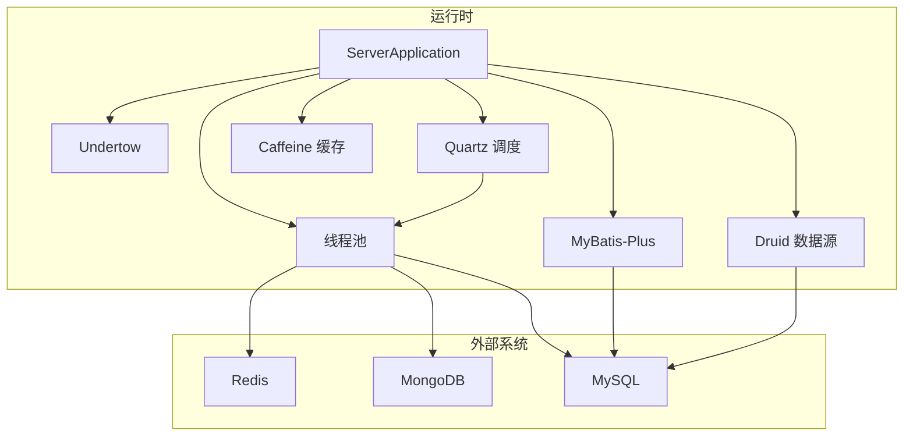
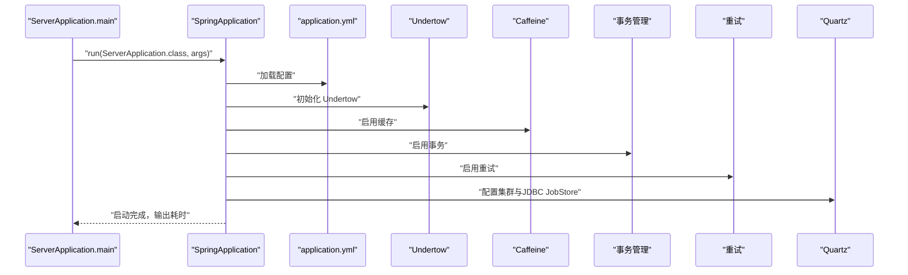
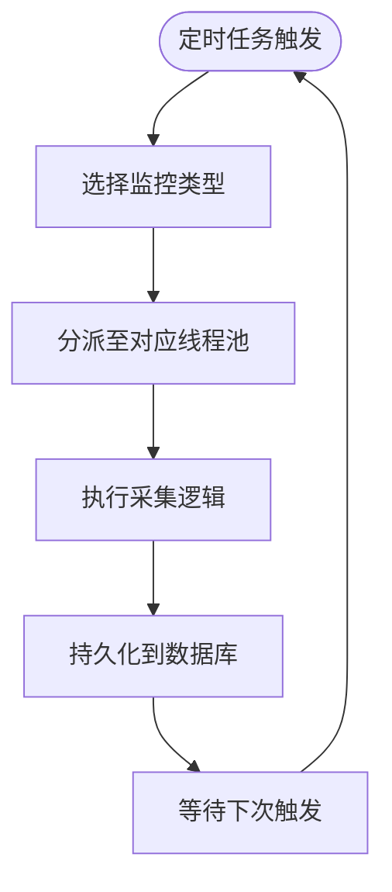
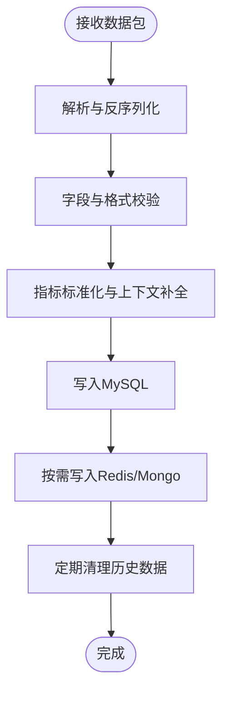
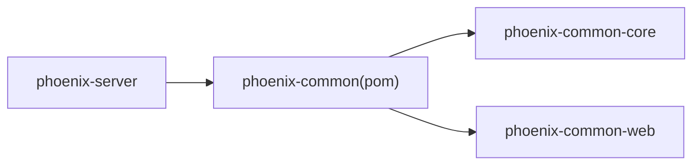

# 监控服务端模块

<cite>
**本文引用的文件**
- [ServerApplication.java](file://phoenix-server/src/main/java/com/gitee/pifeng/monitoring/server/ServerApplication.java)
- [application.yml](file://phoenix-server/src/main/resources/application.yml)
- [application-dev.yml](file://phoenix-server/src/main/resources/application-dev.yml)
- [application-prod.yml](file://phoenix-server/src/main/resources/application-prod.yml)
- [MybatisPlusConfig.java](file://phoenix-server/src/main/java/com/gitee/pifeng/monitoring/server/config/MybatisPlusConfig.java)
- [QuartzConfig.java](file://phoenix-server/src/main/java/com/gitee/pifeng/monitoring/server/config/QuartzConfig.java)
- [ThreadPoolConfig.java](file://phoenix-server/src/main/java/com/gitee/pifeng/monitoring/server/config/ThreadPoolConfig.java)
- [DbUtils.java](file://phoenix-server/src/main/java/com/gitee/pifeng/monitoring/server/util/db/DbUtils.java)
- [RedisUtils.java](file://phoenix-server/src/main/java/com/gitee/pifeng/monitoring/server/util/db/RedisUtils.java)
- [MongoUtils.java](file://phoenix-server/src/main/java/com/gitee/pifeng/monitoring/server/util/db/MongoUtils.java)
- [pom.xml（phoenix-common）](file://phoenix-common/pom.xml)
</cite>

## 目录
1. [简介](#简介)
2. [项目结构](#项目结构)
3. [核心组件](#核心组件)
4. [架构总览](#架构总览)
5. [详细组件分析](#详细组件分析)
6. [依赖分析](#依赖分析)
7. [性能考量](#性能考量)
8. [故障排查指南](#故障排查指南)
9. [结论](#结论)
10. [附录](#附录)

## 简介
本文件面向“监控服务端模块”，系统性阐述其架构设计、启动流程、控制器层业务逻辑、数据处理流水线、配置管理、扩展能力、性能优化策略以及部署运维要点。服务端基于 Spring Boot 构建，采用 Undertow 作为 Web 容器，结合 Druid 连接池、MyBatis-Plus、Quartz 调度、Caffeine 缓存与多线程池等技术栈，支撑监控数据接收、规则引擎、历史数据存储与配置管理等核心能力。

## 项目结构
服务端位于 phoenix-server 模块，核心入口为 ServerApplication，配置集中在 resources 下的 application.yml 及环境隔离的 application-dev.yml、application-prod.yml。配置类集中于 config 包，数据库工具类位于 util/db 包。整体采用模块化组织，phoenix-common 提供公共依赖与模块聚合。

```mermaid
graph TB
A["ServerApplication<br/>应用入口"] --> B["配置加载<br/>application.yml"]
B --> C["Web容器<br/>Undertow"]
B --> D["数据源<br/>Druid"]
B --> E["缓存<br/>Caffeine"]
B --> F["定时任务<br/>Quartz"]
B --> G["ORM<br/>MyBatis-Plus"]
A --> H["线程池<br/>ThreadPoolConfig"]
A --> I["数据库工具<br/>DbUtils/RedisUtils/MongoUtils"]
```

图表来源
- [ServerApplication.java:36-45](file://phoenix-server/src/main/java/com/gitee/pifeng/monitoring/server/ServerApplication.java#L36-L45)
- [application.yml:117-184](file://phoenix-server/src/main/resources/application.yml#L117-L184)
- [application.yml:39-43](file://phoenix-server/src/main/resources/application.yml#L39-L43)
- [application.yml:67-104](file://phoenix-server/src/main/resources/application.yml#L67-L104)
- [MybatisPlusConfig.java:26-93](file://phoenix-server/src/main/java/com/gitee/pifeng/monitoring/server/config/MybatisPlusConfig.java#L26-L93)
- [ThreadPoolConfig.java:22-211](file://phoenix-server/src/main/java/com/gitee/pifeng/monitoring/server/config/ThreadPoolConfig.java#L22-L211)
- [DbUtils.java:20-58](file://phoenix-server/src/main/java/com/gitee/pifeng/monitoring/server/util/db/DbUtils.java#L20-L58)
- [RedisUtils.java:18-98](file://phoenix-server/src/main/java/com/gitee/pifeng/monitoring/server/util/db/RedisUtils.java#L18-L98)
- [MongoUtils.java:17-95](file://phoenix-server/src/main/java/com/gitee/pifeng/monitoring/server/util/db/MongoUtils.java#L17-L95)

章节来源
- [ServerApplication.java:19-47](file://phoenix-server/src/main/java/com/gitee/pifeng/monitoring/server/ServerApplication.java#L19-L47)
- [application.yml:1-271](file://phoenix-server/src/main/resources/application.yml#L1-271)
- [pom.xml（phoenix-common）:19-24](file://phoenix-common/pom.xml#L19-L24)

## 核心组件
- 应用入口与启动
  - ServerApplication 作为 Spring Boot 入口，启用缓存、事务、AOP、重试等特性，并定制 Undertow Web 容器。
- 配置体系
  - application.yml 统一管理服务器、日志、缓存、异步、Quartz、数据源、MyBatis-Plus、管理端点、接口文档等。
  - application-dev.yml 与 application-prod.yml 提供开发与生产环境的数据源与邮件配置。
- ORM 与数据源
  - MyBatis-PlusConfig 配置分页、性能分析、SQL 注入器等。
  - application.yml 中配置 Druid 连接池参数与监控。
- 定时任务
  - QuartzConfig 定义各类监控 Job 的 JobDetail 与 Trigger，覆盖应用实例、服务器、数据库、网络、TCP、HTTP、历史清理与告警等。
- 线程池
  - ThreadPoolConfig 为各监控类型提供独立线程池，采用高并发场景下的 IO 密集型线程数计算公式。
- 数据库工具
  - DbUtils、RedisUtils、MongoUtils 提供连接获取、连通性校验与资源释放。

章节来源
- [ServerApplication.java:28-47](file://phoenix-server/src/main/java/com/gitee/pifeng/monitoring/server/ServerApplication.java#L28-L47)
- [application.yml:39-104](file://phoenix-server/src/main/resources/application.yml#L39-L104)
- [application-dev.yml:7-14](file://phoenix-server/src/main/resources/application-dev.yml#L7-L14)
- [application-prod.yml:7-14](file://phoenix-server/src/main/resources/application-prod.yml#L7-L14)
- [MybatisPlusConfig.java:24-112](file://phoenix-server/src/main/java/com/gitee/pifeng/monitoring/server/config/MybatisPlusConfig.java#L24-L112)
- [QuartzConfig.java:25-399](file://phoenix-server/src/main/java/com/gitee/pifeng/monitoring/server/config/QuartzConfig.java#L25-L399)
- [ThreadPoolConfig.java:21-211](file://phoenix-server/src/main/java/com/gitee/pifeng/monitoring/server/config/ThreadPoolConfig.java#L21-L211)
- [DbUtils.java:20-58](file://phoenix-server/src/main/java/com/gitee/pifeng/monitoring/server/util/db/DbUtils.java#L20-L58)
- [RedisUtils.java:18-98](file://phoenix-server/src/main/java/com/gitee/pifeng/monitoring/server/util/db/RedisUtils.java#L18-L98)
- [MongoUtils.java:17-95](file://phoenix-server/src/main/java/com/gitee/pifeng/monitoring/server/util/db/MongoUtils.java#L17-L95)

## 架构总览
服务端采用“配置驱动 + 定时任务 + 多线程 + ORM + 外部中间件”的架构模式，核心流程如下：
- 启动阶段：ServerApplication 加载配置，初始化 Undertow、缓存、事务、AOP、重试、Quartz、线程池与数据源。
- 数据采集：定时任务按配置周期触发，各监控 Job 使用对应线程池并发执行采集。
- 数据处理：采集结果经 ORM 写入关系型数据库，必要时写入 Redis/Mongo。
- 规则引擎与告警：规则引擎对实时/历史数据进行判定，触发告警。
- 存储与查询：MyBatis-Plus 提供分页与 SQL 性能分析，Druid 提供连接池监控与 SQL 慢查询统计。

图表来源
- [ServerApplication.java:36-47](file://phoenix-server/src/main/java/com/gitee/pifeng/monitoring/server/ServerApplication.java#L36-L47)
- [application.yml:67-104](file://phoenix-server/src/main/resources/application.yml#L67-L104)
- [application.yml:117-184](file://phoenix-server/src/main/resources/application.yml#L117-L184)
- [application.yml:39-43](file://phoenix-server/src/main/resources/application.yml#L39-L43)
- [MybatisPlusConfig.java:26-93](file://phoenix-server/src/main/java/com/gitee/pifeng/monitoring/server/config/MybatisPlusConfig.java#L26-L93)
- [ThreadPoolConfig.java:22-211](file://phoenix-server/src/main/java/com/gitee/pifeng/monitoring/server/config/ThreadPoolConfig.java#L22-L211)

## 详细组件分析

### 启动流程与控制流
- ServerApplication 启动计时，加载 Spring Boot 并输出启动耗时。
- Undertow 容器按配置启动，开启优雅停机与访问日志。
- 缓存、事务、AOP、重试等基础能力在启动时即生效。
- Quartz 在配置中启用 JDBC JobStore 并设置集群模式，确保分布式一致性。

图表来源
- [ServerApplication.java:38-45](file://phoenix-server/src/main/java/com/gitee/pifeng/monitoring/server/ServerApplication.java#L38-L45)
- [application.yml:7-20](file://phoenix-server/src/main/resources/application.yml#L7-L20)
- [application.yml:39-43](file://phoenix-server/src/main/resources/application.yml#L39-L43)
- [application.yml:67-104](file://phoenix-server/src/main/resources/application.yml#L67-L104)

章节来源
- [ServerApplication.java:38-45](file://phoenix-server/src/main/java/com/gitee/pifeng/monitoring/server/ServerApplication.java#L38-L45)
- [application.yml:7-20](file://phoenix-server/src/main/resources/application.yml#L7-L20)

### 定时任务与监控流水线
- QuartzConfig 定义了多种监控 Job 的触发策略：
  - 应用实例、服务器、网络、TCP、HTTP：启动后延迟数秒，随后以固定频率轮询。
  - 数据库与表空间：数据库类任务以分钟级频率执行，表空间任务以 Cron 每日执行。
  - 历史清理：每 5 分钟清理一次历史数据。
  - 告警监控：每日 8:30 执行一次。
- ThreadPoolConfig 为每类监控分配独立线程池，避免相互影响，线程数按 IO 密集型公式计算，队列容量极大，拒绝策略为 AbortPolicy。

图表来源
- [QuartzConfig.java:49-75](file://phoenix-server/src/main/java/com/gitee/pifeng/monitoring/server/config/QuartzConfig.java#L49-L75)
- [QuartzConfig.java:89-115](file://phoenix-server/src/main/java/com/gitee/pifeng/monitoring/server/config/QuartzConfig.java#L89-L115)
- [QuartzConfig.java:129-155](file://phoenix-server/src/main/java/com/gitee/pifeng/monitoring/server/config/QuartzConfig.java#L129-L155)
- [QuartzConfig.java:169-195](file://phoenix-server/src/main/java/com/gitee/pifeng/monitoring/server/config/QuartzConfig.java#L169-L195)
- [QuartzConfig.java:209-235](file://phoenix-server/src/main/java/com/gitee/pifeng/monitoring/server/config/QuartzConfig.java#L209-L235)
- [QuartzConfig.java:249-275](file://phoenix-server/src/main/java/com/gitee/pifeng/monitoring/server/config/QuartzConfig.java#L249-L275)
- [QuartzConfig.java:289-315](file://phoenix-server/src/main/java/com/gitee/pifeng/monitoring/server/config/QuartzConfig.java#L289-L315)
- [QuartzConfig.java:329-356](file://phoenix-server/src/main/java/com/gitee/pifeng/monitoring/server/config/QuartzConfig.java#L329-L356)
- [QuartzConfig.java:370-395](file://phoenix-server/src/main/java/com/gitee/pifeng/monitoring/server/config/QuartzConfig.java#L370-L395)
- [ThreadPoolConfig.java:33-50](file://phoenix-server/src/main/java/com/gitee/pifeng/monitoring/server/config/ThreadPoolConfig.java#L33-L50)
- [ThreadPoolConfig.java:61-78](file://phoenix-server/src/main/java/com/gitee/pifeng/monitoring/server/config/ThreadPoolConfig.java#L61-L78)
- [ThreadPoolConfig.java:87-104](file://phoenix-server/src/main/java/com/gitee/pifeng/monitoring/server/config/ThreadPoolConfig.java#L87-L104)
- [ThreadPoolConfig.java:113-130](file://phoenix-server/src/main/java/com/gitee/pifeng/monitoring/server/config/ThreadPoolConfig.java#L113-L130)
- [ThreadPoolConfig.java:139-156](file://phoenix-server/src/main/java/com/gitee/pifeng/monitoring/server/config/ThreadPoolConfig.java#L139-L156)
- [ThreadPoolConfig.java:165-182](file://phoenix-server/src/main/java/com/gitee/pifeng/monitoring/server/config/ThreadPoolConfig.java#L165-L182)
- [ThreadPoolConfig.java:191-208](file://phoenix-server/src/main/java/com/gitee/pifeng/monitoring/server/config/ThreadPoolConfig.java#L191-L208)

章节来源
- [QuartzConfig.java:25-399](file://phoenix-server/src/main/java/com/gitee/pifeng/monitoring/server/config/QuartzConfig.java#L25-L399)
- [ThreadPoolConfig.java:21-211](file://phoenix-server/src/main/java/com/gitee/pifeng/monitoring/server/config/ThreadPoolConfig.java#L21-L211)

### 数据处理流水线
- 数据包接收与解析：由 Agent 发送监控数据包，服务端通过 Web 接口接收，解析为统一的数据对象。
- 数据验证：对必填字段、格式与范围进行校验。
- 数据转换：将原始指标转换为标准模型，补充上下文信息（时间戳、实例标识等）。
- 持久化：通过 MyBatis-Plus 写入 MySQL；必要时写入 Redis/Mongo。
- 清理策略：定时任务清理历史数据，避免表膨胀。

图表来源
- [MybatisPlusConfig.java:26-93](file://phoenix-server/src/main/java/com/gitee/pifeng/monitoring/server/config/MybatisPlusConfig.java#L26-L93)
- [application.yml:117-184](file://phoenix-server/src/main/resources/application.yml#L117-L184)
- [application.yml:67-104](file://phoenix-server/src/main/resources/application.yml#L67-L104)

章节来源
- [MybatisPlusConfig.java:24-112](file://phoenix-server/src/main/java/com/gitee/pifeng/monitoring/server/config/MybatisPlusConfig.java#L24-L112)
- [application.yml:117-184](file://phoenix-server/src/main/resources/application.yml#L117-L184)

### 配置管理
- 服务器与日志
  - Undertow 访问日志路径、格式与优雅停机。
  - 日志级别对监控包与 OSHI 组件进行精细控制。
- 缓存
  - Caffeine 缓存规格：最大条目与访问过期时间。
- 异步与序列化
  - MVC 异步超时、Jackson 时区。
- Quartz
  - 集群化 JobStore、线程池大小、分布式检查间隔、覆盖现有作业等。
- 数据源与 Druid
  - 连接池大小、空闲检测、连接泄漏回收、PSCache、慢 SQL 统计、Web 监控过滤器与视图。
- MyBatis-Plus
  - Mapper 扫描路径、驼峰映射、数据库 ID、主键策略等。
- 管理端点与接口文档
  - 管理端点暴露健康与关闭，Knife4j/SpringDoc 文档配置。

章节来源
- [application.yml:1-271](file://phoenix-server/src/main/resources/application.yml#L1-L271)
- [application-dev.yml:1-38](file://phoenix-server/src/main/resources/application-dev.yml#L1-L38)
- [application-prod.yml:1-38](file://phoenix-server/src/main/resources/application-prod.yml#L1-L38)

### 扩展能力
- 新增监控类型
  - 在 QuartzConfig 中新增 JobDetail 与 Trigger。
  - 在 ThreadPoolConfig 中新增对应线程池 Bean。
  - 在 DAO/Service 层实现数据采集与持久化。
- 自定义告警规则
  - 基于规则引擎对指标阈值、趋势与组合条件进行判定，触发通知。
- 第三方系统集成
  - 通过 DbUtils/RedisUtils/MongoUtils 连接外部系统，或在业务层封装适配器。

章节来源
- [QuartzConfig.java:25-399](file://phoenix-server/src/main/java/com/gitee/pifeng/monitoring/server/config/QuartzConfig.java#L25-L399)
- [ThreadPoolConfig.java:21-211](file://phoenix-server/src/main/java/com/gitee/pifeng/monitoring/server/config/ThreadPoolConfig.java#L21-L211)
- [DbUtils.java:20-58](file://phoenix-server/src/main/java/com/gitee/pifeng/monitoring/server/util/db/DbUtils.java#L20-L58)
- [RedisUtils.java:18-98](file://phoenix-server/src/main/java/com/gitee/pifeng/monitoring/server/util/db/RedisUtils.java#L18-L98)
- [MongoUtils.java:17-95](file://phoenix-server/src/main/java/com/gitee/pifeng/monitoring/server/util/db/MongoUtils.java#L17-L95)

## 依赖分析
- 模块聚合
  - phoenix-common 作为公共模块父工程，聚合 phoenix-common-core 与 phoenix-common-web，便于统一版本与依赖管理。
- 服务端对公共模块的依赖
  - 服务端通过引入公共模块的依赖，复用通用常量、DTO、异常、线程池与工具类等。

图表来源
- [pom.xml（phoenix-common）:19-24](file://phoenix-common/pom.xml#L19-L24)

章节来源
- [pom.xml（phoenix-common）:19-24](file://phoenix-common/pom.xml#L19-L24)

## 性能考量
- 数据库优化
  - 使用 Druid 连接池与慢 SQL 统计，结合 PSCache 与 Prepared Statement 大小优化。
  - MyBatis-Plus 分页与 COUNT 优化，减少大表扫描。
- 缓存策略
  - Caffeine 缓存热点查询结果，降低数据库压力。
- 并发处理
  - 各监控类型独立线程池，避免 IO 阻塞互相影响；线程数按 IO 密集型公式计算，队列容量极大，拒绝策略为 AbortPolicy，防止内存膨胀。
- 定时任务
  - Quartz 集群化 JobStore，确保分布式一致性；合理设置触发间隔，避免任务堆积。

章节来源
- [application.yml:117-184](file://phoenix-server/src/main/resources/application.yml#L117-L184)
- [application.yml:186-217](file://phoenix-server/src/main/resources/application.yml#L186-L217)
- [application.yml:39-43](file://phoenix-server/src/main/resources/application.yml#L39-L43)
- [ThreadPoolConfig.java:22-211](file://phoenix-server/src/main/java/com/gitee/pifeng/monitoring/server/config/ThreadPoolConfig.java#L22-L211)
- [MybatisPlusConfig.java:26-93](file://phoenix-server/src/main/java/com/gitee/pifeng/monitoring/server/config/MybatisPlusConfig.java#L26-L93)

## 故障排查指南
- 数据库连接问题
  - 使用 DbUtils.getConnection 获取连接，若失败记录错误日志，检查 URL、用户名与密码（含 Base64 解码）。
- Redis 连接问题
  - 使用 RedisUtils.getJedis 获取连接并进行 ping 校验，失败时记录异常并返回空。
- MongoDB 连接问题
  - 使用 MongoUtils.getClient 获取客户端并遍历数据库列表进行连通性校验。
- 定时任务异常
  - 检查 Quartz 配置与 JobStore 初始化，确认集群节点检查间隔与线程池大小。
- 缓存与线程池
  - 关注 Caffeine 缓存命中率与线程池拒绝情况，调整队列与线程数。

章节来源
- [DbUtils.java:46-55](file://phoenix-server/src/main/java/com/gitee/pifeng/monitoring/server/util/db/DbUtils.java#L46-L55)
- [RedisUtils.java:44-57](file://phoenix-server/src/main/java/com/gitee/pifeng/monitoring/server/util/db/RedisUtils.java#L44-L57)
- [RedisUtils.java:69-80](file://phoenix-server/src/main/java/com/gitee/pifeng/monitoring/server/util/db/RedisUtils.java#L69-L80)
- [MongoUtils.java:41-48](file://phoenix-server/src/main/java/com/gitee/pifeng/monitoring/server/util/db/MongoUtils.java#L41-L48)
- [MongoUtils.java:60-77](file://phoenix-server/src/main/java/com/gitee/pifeng/monitoring/server/util/db/MongoUtils.java#L60-L77)
- [application.yml:67-104](file://phoenix-server/src/main/resources/application.yml#L67-L104)

## 结论
监控服务端模块通过清晰的启动流程、完善的配置体系、可扩展的定时任务与线程池、以及 ORM 与外部中间件的协同，构建了稳定高效的监控数据处理平台。遵循本文的架构设计、性能优化与运维建议，可在不同规模与复杂度的环境中可靠运行。

## 附录
- 环境配置示例
  - 开发环境：application-dev.yml 提供本地 MySQL 与邮件配置示例。
  - 生产环境：application-prod.yml 提供生产 MySQL 与邮件配置示例。
- 管理端点
  - 暴露健康与关闭端点，仅限本地访问，便于运维控制。

章节来源
- [application-dev.yml:7-14](file://phoenix-server/src/main/resources/application-dev.yml#L7-L14)
- [application-prod.yml:7-14](file://phoenix-server/src/main/resources/application-prod.yml#L7-L14)
- [application.yml:220-234](file://phoenix-server/src/main/resources/application.yml#L220-L234)