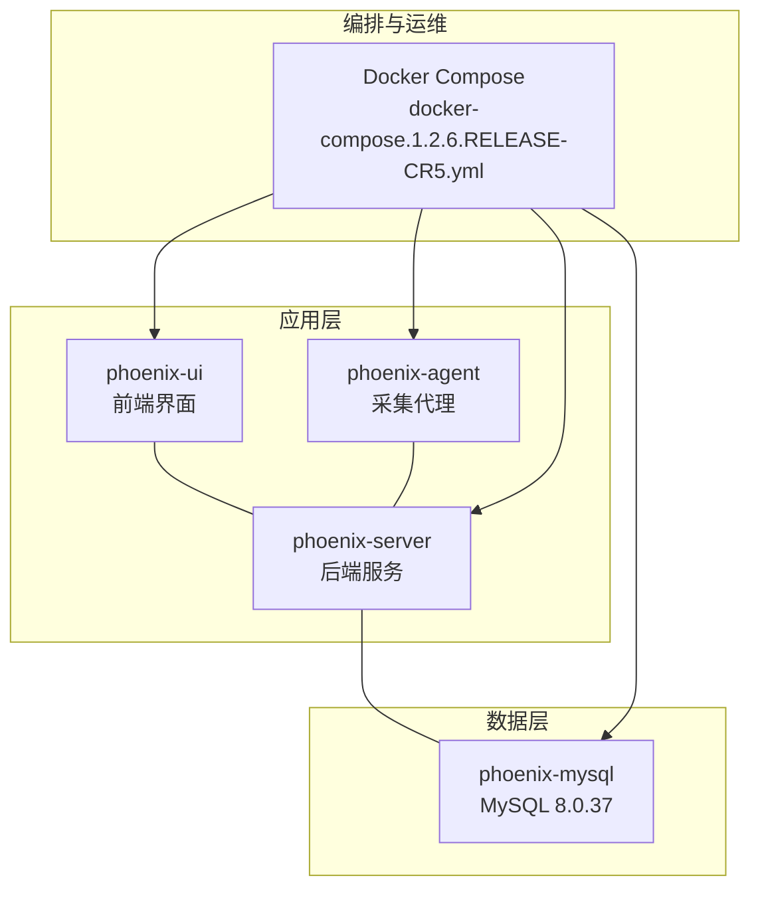
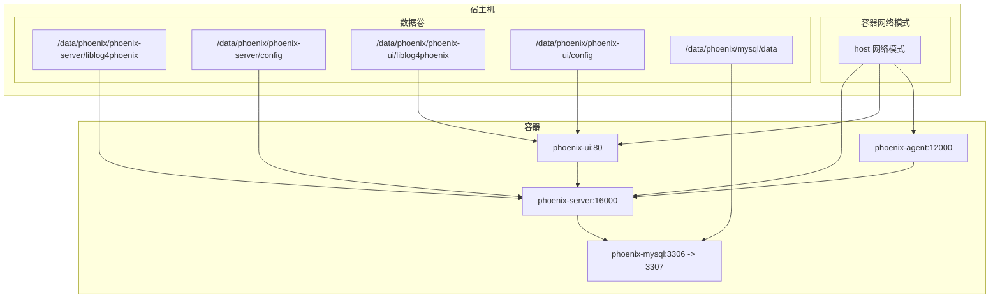
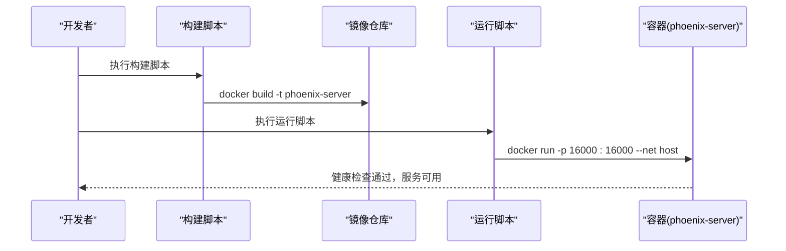
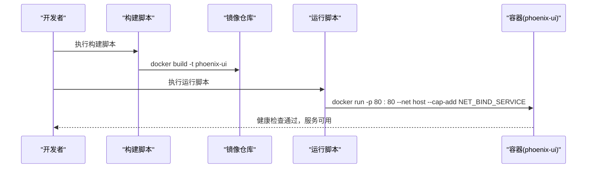
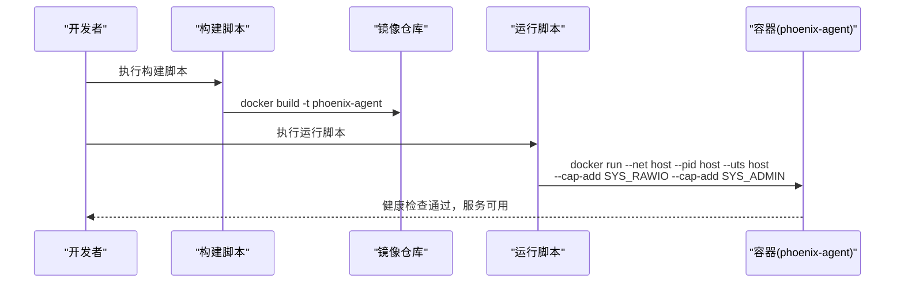
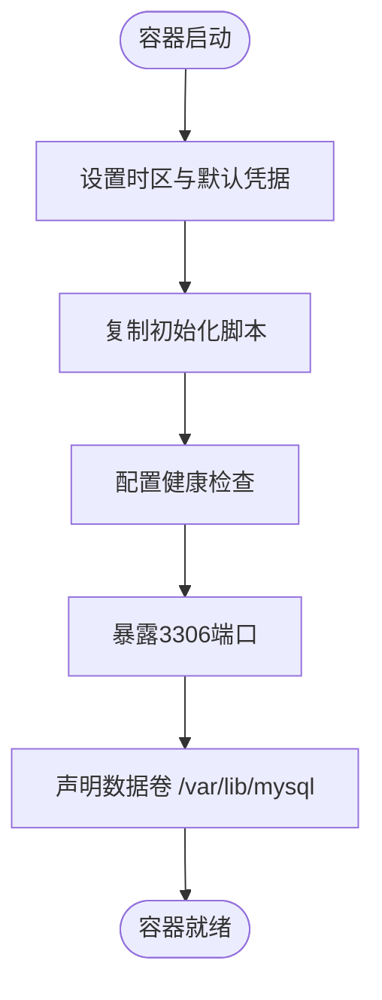
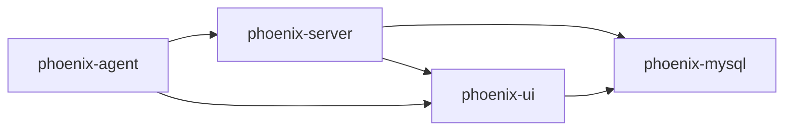
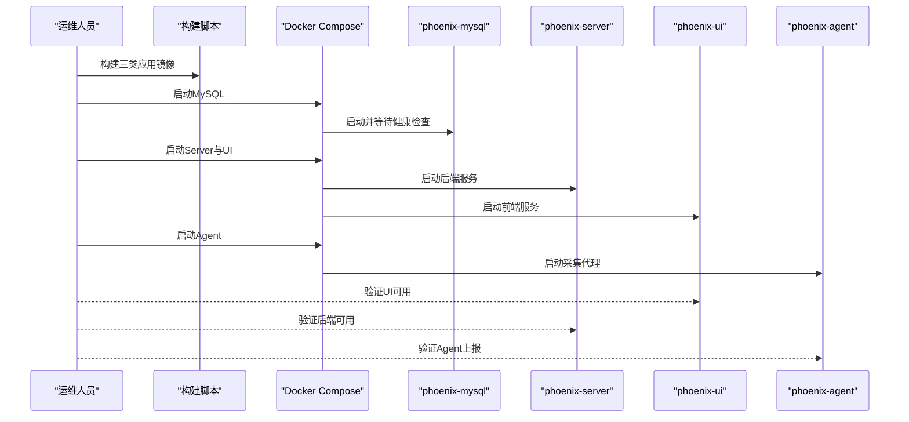

# Docker部署方案

<cite>
**本文引用的文件**
- [phoenix-server Dockerfile](file://phoenix-server/src/main/docker/Dockerfile)
- [phoenix-ui Dockerfile](file://phoenix-ui/src/main/docker/Dockerfile)
- [phoenix-agent Dockerfile](file://phoenix-agent/src/main/docker/Dockerfile)
- [phoenix-mysql Dockerfile](file://doc/Docker/mysql/Dockerfile)
- [phoenix-server 构建脚本](file://phoenix-server/src/main/docker/build_dockerfile.1.2.6.RELEASE-CR5.sh)
- [phoenix-ui 构建脚本](file://phoenix-ui/src/main/docker/build_dockerfile.1.2.6.RELEASE-CR5.sh)
- [phoenix-agent 构建脚本](file://phoenix-agent/src/main/docker/build_dockerfile.1.2.6.RELEASE-CR5.sh)
- [phoenix-server 运行脚本](file://phoenix-server/src/main/docker/run_container.1.2.6.RELEASE-CR5.sh)
- [phoenix-ui 运行脚本](file://phoenix-ui/src/main/docker/run_container.1.2.6.RELEASE-CR5.sh)
- [phoenix-agent 运行脚本](file://phoenix-agent/src/main/docker/run_container.1.2.6.RELEASE-CR5.sh)
- [Docker Compose 编排文件](file://doc/DockerCompose/docker-compose.1.2.6.RELEASE-CR5.yml)
- [远程一键执行脚本](file://doc/Docker/install.1.2.6.RELEASE-CR5.sh)
</cite>

## 目录
1. [简介](#简介)
2. [项目结构](#项目结构)
3. [核心组件](#核心组件)
4. [架构总览](#架构总览)
5. [详细组件分析](#详细组件分析)
6. [依赖关系分析](#依赖关系分析)
7. [性能考虑](#性能考虑)
8. [故障排查指南](#故障排查指南)
9. [结论](#结论)
10. [附录](#附录)

## 简介
本方案面向Phoenix监控系统，提供从镜像构建到容器运行的完整Docker部署指南。内容涵盖：
- Dockerfile编写规范与最佳实践：基础镜像选择、依赖安装、应用打包、端口暴露、环境变量配置、健康检查、非root用户运行等
- 镜像构建流程：构建命令、构建参数、多阶段构建建议
- 容器运行脚本：启动参数、网络配置、存储卷挂载、能力增强与安全策略
- Docker Compose编排：服务启动顺序、网络连接、数据持久化、资源限制
- 高级配置技巧：时区同步、日志配置复用、资源限制、健康检查策略
- 完整示例：从镜像构建到容器启动的全流程操作

## 项目结构
Phoenix监控系统由三类核心应用组成，分别提供后端服务、前端界面与采集代理，配合MySQL数据库共同构成完整的监控平台。

图表来源
- [phoenix-server Dockerfile:1-48](file://phoenix-server/src/main/docker/Dockerfile#L1-L48)
- [phoenix-ui Dockerfile:1-55](file://phoenix-ui/src/main/docker/Dockerfile#L1-L55)
- [phoenix-agent Dockerfile:1-47](file://phoenix-agent/src/main/docker/Dockerfile#L1-L47)
- [phoenix-mysql Dockerfile:1-28](file://doc/Docker/mysql/Dockerfile#L1-L28)
- [Docker Compose 编排文件:1-68](file://doc/DockerCompose/docker-compose.1.2.6.RELEASE-CR5.yml#L1-L68)

章节来源
- [phoenix-server Dockerfile:1-48](file://phoenix-server/src/main/docker/Dockerfile#L1-L48)
- [phoenix-ui Dockerfile:1-55](file://phoenix-ui/src/main/docker/Dockerfile#L1-L55)
- [phoenix-agent Dockerfile:1-47](file://phoenix-agent/src/main/docker/Dockerfile#L1-L47)
- [phoenix-mysql Dockerfile:1-28](file://doc/Docker/mysql/Dockerfile#L1-L28)
- [Docker Compose 编排文件:1-68](file://doc/DockerCompose/docker-compose.1.2.6.RELEASE-CR5.yml#L1-L68)

## 核心组件
- phoenix-server：后端服务，监听16000端口，使用生产环境配置，具备Actuator健康检查
- phoenix-ui：前端界面，监听80端口，使用authbind支持非root绑定特权端口，具备健康检查
- phoenix-agent：采集代理，监听12000端口，具备健康检查
- phoenix-mysql：MySQL 8.0.37，预置数据库与用户，设置时区，具备健康检查

章节来源
- [phoenix-server Dockerfile:30-36](file://phoenix-server/src/main/docker/Dockerfile#L30-L36)
- [phoenix-ui Dockerfile:35-41](file://phoenix-ui/src/main/docker/Dockerfile#L35-L41)
- [phoenix-agent Dockerfile:30-36](file://phoenix-agent/src/main/docker/Dockerfile#L30-L36)
- [phoenix-mysql Dockerfile:24-28](file://doc/Docker/mysql/Dockerfile#L24-L28)

## 架构总览
下图展示容器间的网络与数据流关系，以及Compose编排的服务依赖与资源分配。

图表来源
- [Docker Compose 编排文件:26-67](file://doc/DockerCompose/docker-compose.1.2.6.RELEASE-CR5.yml#L26-L67)
- [phoenix-server 运行脚本:31-39](file://phoenix-server/src/main/docker/run_container.1.2.6.RELEASE-CR5.sh#L31-L39)
- [phoenix-ui 运行脚本:29-40](file://phoenix-ui/src/main/docker/run_container.1.2.6.RELEASE-CR5.sh#L29-L40)
- [phoenix-agent 运行脚本:29-48](file://phoenix-agent/src/main/docker/run_container.1.2.6.RELEASE-CR5.sh#L29-L48)
- [phoenix-mysql Dockerfile:24-28](file://doc/Docker/mysql/Dockerfile#L24-L28)

## 详细组件分析

### phoenix-server 部署
- 基础镜像与环境
  - 使用JDK 17基础镜像，设置UTF-8编码与Asia/Shanghai时区
  - 安装常用网络诊断工具，便于容器内排障
- 用户与目录
  - 创建专用用户与组，创建工作目录/app并设置权限
  - 声明数据卷：/app/liblog4phoenix与/app/config
- 应用打包与启动
  - 复制jar包与许可证文件，切换至非root用户
  - 暴露16000端口，配置健康检查
  - 通过ENTRYPOINT传入JVM参数与Spring Profile
- 运行脚本要点
  - 使用host网络模式，便于与宿主机服务互通
  - 映射配置与日志目录，设置端口映射16000:16000
  - 支持重启策略与容器命名

图表来源
- [phoenix-server 构建脚本:1-3](file://phoenix-server/src/main/docker/build_dockerfile.1.2.6.RELEASE-CR5.sh#L1-L3)
- [phoenix-server 运行脚本:29-39](file://phoenix-server/src/main/docker/run_container.1.2.6.RELEASE-CR5.sh#L29-L39)
- [phoenix-server Dockerfile:30-48](file://phoenix-server/src/main/docker/Dockerfile#L30-L48)

章节来源
- [phoenix-server Dockerfile:1-48](file://phoenix-server/src/main/docker/Dockerfile#L1-L48)
- [phoenix-server 运行脚本:1-41](file://phoenix-server/src/main/docker/run_container.1.2.6.RELEASE-CR5.sh#L1-L41)

### phoenix-ui 部署
- 基础镜像与环境
  - 使用JDK 17基础镜像，设置UTF-8编码与Asia/Shanghai时区
  - 安装curl与authbind，用于非root绑定80端口
- 用户与目录
  - 创建专用用户与组，创建工作目录/app并设置权限
  - 初始化authbind配置，允许非root绑定80端口
  - 声明数据卷：/app/liblog4phoenix与/app/config
- 应用打包与启动
  - 复制jar包与许可证文件，切换至非root用户
  - 暴露80端口，配置健康检查
  - 通过ENTRYPOINT使用authbind启动Java应用
- 运行脚本要点
  - 使用host网络模式，映射配置与日志目录
  - 设置端口映射80:80，添加NET_BIND_SERVICE能力
  - 支持重启策略与容器命名

图表来源
- [phoenix-ui 构建脚本:1-3](file://phoenix-ui/src/main/docker/build_dockerfile.1.2.6.RELEASE-CR5.sh#L1-L3)
- [phoenix-ui 运行脚本:29-40](file://phoenix-ui/src/main/docker/run_container.1.2.6.RELEASE-CR5.sh#L29-L40)
- [phoenix-ui Dockerfile:35-55](file://phoenix-ui/src/main/docker/Dockerfile#L35-L55)

章节来源
- [phoenix-ui Dockerfile:1-55](file://phoenix-ui/src/main/docker/Dockerfile#L1-L55)
- [phoenix-ui 运行脚本:1-42](file://phoenix-ui/src/main/docker/run_container.1.2.6.RELEASE-CR5.sh#L1-L42)

### phoenix-agent 部署
- 基础镜像与环境
  - 使用JDK 17基础镜像，设置UTF-8编码与Asia/Shanghai时区
  - 安装curl工具，便于容器内网络连通性验证
- 用户与目录
  - 创建专用用户与组，创建工作目录/app并设置权限
  - 声明数据卷：/app/liblog4phoenix与/app/config
- 应用打包与启动
  - 复制jar包与许可证文件，切换至非root用户
  - 暴露12000端口，配置健康检查
  - 通过ENTRYPOINT传入JVM参数与Spring Profile
- 运行脚本要点
  - 使用host网络模式，共享PID、UTS命名空间
  - 开放SYS_RAWIO、SYS_ADMIN等能力，访问/sys、/proc与/dev
  - 映射配置与日志目录，设置端口映射12000:12000
  - 支持重启策略与容器命名

图表来源
- [phoenix-agent 构建脚本:1-3](file://phoenix-agent/src/main/docker/build_dockerfile.1.2.6.RELEASE-CR5.sh#L1-L3)
- [phoenix-agent 运行脚本:29-48](file://phoenix-agent/src/main/docker/run_container.1.2.6.RELEASE-CR5.sh#L29-L48)
- [phoenix-agent Dockerfile:30-47](file://phoenix-agent/src/main/docker/Dockerfile#L30-L47)

章节来源
- [phoenix-agent Dockerfile:1-47](file://phoenix-agent/src/main/docker/Dockerfile#L1-L47)
- [phoenix-agent 运行脚本:1-67](file://phoenix-agent/src/main/docker/run_container.1.2.6.RELEASE-CR5.sh#L1-L67)

### phoenix-mysql 部署
- 基础镜像与环境
  - 使用官方MySQL 8.0.37镜像，设置时区与默认数据库信息
- 初始化与安全
  - 复制初始化脚本至/docker-entrypoint-initdb.d，自动处理权限
  - 配置健康检查，使用mysqladmin ping进行存活探测
- 存储与网络
  - 暴露3306端口，声明/var/lib/mysql数据卷
  - 提供端口映射3306:3307，便于与宿主机其他实例共存

图表来源
- [phoenix-mysql Dockerfile:1-28](file://doc/Docker/mysql/Dockerfile#L1-L28)

章节来源
- [phoenix-mysql Dockerfile:1-28](file://doc/Docker/mysql/Dockerfile#L1-L28)

## 依赖关系分析
- 服务依赖
  - phoenix-ui依赖phoenix-server提供的后端接口
  - phoenix-agent通过phoenix-server上报采集数据
  - 三类应用均依赖phoenix-mysql存储元数据与监控数据
- 网络依赖
  - 采用host网络模式，简化容器间通信与端口管理
  - 通过端口映射实现对外服务暴露
- 数据依赖
  - 通过数据卷实现日志与配置的持久化
  - MySQL数据卷独立管理，便于备份与迁移

图表来源
- [Docker Compose 编排文件:41-67](file://doc/DockerCompose/docker-compose.1.2.6.RELEASE-CR5.yml#L41-L67)

章节来源
- [Docker Compose 编排文件:1-68](file://doc/DockerCompose/docker-compose.1.2.6.RELEASE-CR5.yml#L1-L68)

## 性能考虑
- 资源限制
  - 通过deploy.resources限制内存上限与预留，避免资源争抢
  - 建议根据业务负载调整各服务的内存配额
- 日志管理
  - 使用YAML锚点复用日志配置，限制单文件大小与保留数量
- 网络与I/O
  - host网络模式降低网络开销，但需注意端口冲突
  - agent容器开启必要能力以满足系统监控需求

章节来源
- [Docker Compose 编排文件:1-68](file://doc/DockerCompose/docker-compose.1.2.6.RELEASE-CR5.yml#L1-L68)

## 故障排查指南
- 健康检查失败
  - 检查应用端口是否正确暴露与映射
  - 查看容器日志，确认Spring Profile与配置文件加载
- 端口占用
  - host网络模式下，确认宿主机端口未被占用
  - 如需多实例，调整端口映射或使用不同宿主机端口
- 权限问题
  - 确认数据卷目录拥有正确的UID/GID
  - 非root用户运行时，确保容器内用户对目标目录有读写权限
- 网络连通性
  - agent容器需访问/sys、/proc与/dev，确保已授予相应能力
  - ui容器绑定80端口需启用NET_BIND_SERVICE能力

章节来源
- [phoenix-server 运行脚本:31-39](file://phoenix-server/src/main/docker/run_container.1.2.6.RELEASE-CR5.sh#L31-L39)
- [phoenix-ui 运行脚本:29-40](file://phoenix-ui/src/main/docker/run_container.1.2.6.RELEASE-CR5.sh#L29-L40)
- [phoenix-agent 运行脚本:31-48](file://phoenix-agent/src/main/docker/run_container.1.2.6.RELEASE-CR5.sh#L31-L48)

## 结论
本方案基于官方推荐的基础镜像与生产环境配置，结合host网络模式与数据卷持久化，提供了稳定、可扩展的Phoenix监控系统Docker部署路径。通过Compose编排与统一的日志配置，能够有效提升运维效率与可观测性。建议在生产环境中进一步完善镜像签名、网络隔离与安全策略。

## 附录

### Dockerfile编写规范与最佳实践
- 基础镜像选择
  - 推荐使用官方JDK镜像，确保运行时一致性
- 依赖安装
  - 在同一RUN指令中完成apt更新与安装，减少层数
- 应用打包
  - 使用非root用户运行，降低安全风险
- 端口暴露与健康检查
  - 显式暴露应用端口，配置健康检查保障可用性
- 环境变量
  - 统一时区与时区文件，避免时间相关问题

章节来源
- [phoenix-server Dockerfile:1-48](file://phoenix-server/src/main/docker/Dockerfile#L1-L48)
- [phoenix-ui Dockerfile:1-55](file://phoenix-ui/src/main/docker/Dockerfile#L1-L55)
- [phoenix-agent Dockerfile:1-47](file://phoenix-agent/src/main/docker/Dockerfile#L1-L47)

### 镜像构建流程
- 构建命令
  - 使用构建脚本统一执行docker build命令
- 构建参数
  - 建议增加--no-cache选项进行验证性构建
- 多阶段构建建议
  - 可引入多阶段构建以减小最终镜像体积，分离编译与运行环境

章节来源
- [phoenix-server 构建脚本:1-3](file://phoenix-server/src/main/docker/build_dockerfile.1.2.6.RELEASE-CR5.sh#L1-L3)
- [phoenix-ui 构建脚本:1-3](file://phoenix-ui/src/main/docker/build_dockerfile.1.2.6.RELEASE-CR5.sh#L1-L3)
- [phoenix-agent 构建脚本:1-3](file://phoenix-agent/src/main/docker/build_dockerfile.1.2.6.RELEASE-CR5.sh#L1-L3)

### 容器运行脚本说明
- 启动参数
  - host网络模式、端口映射、数据卷挂载、重启策略
- 网络配置
  - host网络简化通信，避免额外NAT开销
- 存储卷挂载
  - 映射配置与日志目录，确保持久化
- 环境变量传递
  - 通过ENTRYPOINT传入JVM参数与Spring Profile
- 能力增强与安全策略
  - agent容器开放SYS_RAWIO、SYS_ADMIN；ui容器添加NET_BIND_SERVICE

章节来源
- [phoenix-server 运行脚本:1-41](file://phoenix-server/src/main/docker/run_container.1.2.6.RELEASE-CR5.sh#L1-L41)
- [phoenix-ui 运行脚本:1-42](file://phoenix-ui/src/main/docker/run_container.1.2.6.RELEASE-CR5.sh#L1-L42)
- [phoenix-agent 运行脚本:1-67](file://phoenix-agent/src/main/docker/run_container.1.2.6.RELEASE-CR5.sh#L1-L67)

### Docker Compose编排方案
- 启动顺序
  - 通过depends_on与condition控制服务启动顺序
- 网络连接
  - host网络模式统一端口管理
- 数据持久化
  - 映射MySQL数据目录与各应用的日志/配置目录
- 资源限制
  - 为各服务设置内存上限与预留

章节来源
- [Docker Compose 编排文件:1-68](file://doc/DockerCompose/docker-compose.1.2.6.RELEASE-CR5.yml#L1-L68)

### 高级配置技巧
- 时区同步
  - 挂载/etc/localtime实现宿主机时区同步
- 日志配置复用
  - 使用YAML锚点复用日志驱动与轮转策略
- 健康检查策略
  - 基于Actuator健康端点进行探测，确保业务可用性

章节来源
- [Docker Compose 编排文件:1-6](file://doc/DockerCompose/docker-compose.1.2.6.RELEASE-CR5.yml#L1-L6)
- [phoenix-server Dockerfile:34-36](file://phoenix-server/src/main/docker/Dockerfile#L34-L36)
- [phoenix-ui Dockerfile:39-41](file://phoenix-ui/src/main/docker/Dockerfile#L39-L41)
- [phoenix-agent Dockerfile:34-36](file://phoenix-agent/src/main/docker/Dockerfile#L34-L36)

### 完整部署示例（从镜像构建到容器启动）
- 步骤一：构建镜像
  - 分别执行各应用的构建脚本生成镜像
- 步骤二：准备宿主机目录
  - 创建数据卷目录并赋予正确的UID/GID
- 步骤三：启动MySQL
  - 使用Compose启动数据库服务，等待健康检查通过
- 步骤四：启动后端与前端
  - 依次启动phoenix-server与phoenix-ui，确保依赖服务已就绪
- 步骤五：启动采集代理
  - 最后启动phoenix-agent，授予必要能力并映射所需目录
- 步骤六：验证服务
  - 通过浏览器访问UI、调用后端接口、查看Agent上报情况

图表来源
- [phoenix-server 构建脚本:1-3](file://phoenix-server/src/main/docker/build_dockerfile.1.2.6.RELEASE-CR5.sh#L1-L3)
- [phoenix-ui 构建脚本:1-3](file://phoenix-ui/src/main/docker/build_dockerfile.1.2.6.RELEASE-CR5.sh#L1-L3)
- [phoenix-agent 构建脚本:1-3](file://phoenix-agent/src/main/docker/build_dockerfile.1.2.6.RELEASE-CR5.sh#L1-L3)
- [Docker Compose 编排文件:10-67](file://doc/DockerCompose/docker-compose.1.2.6.RELEASE-CR5.yml#L10-L67)

### 远程一键执行脚本
- 通过远程脚本批量执行各应用的容器运行脚本，适用于快速部署场景
- 注意：该脚本会直接下载并执行远程脚本，请确保网络与权限安全

章节来源
- [远程一键执行脚本:1-22](file://doc/Docker/install.1.2.6.RELEASE-CR5.sh#L1-L22)