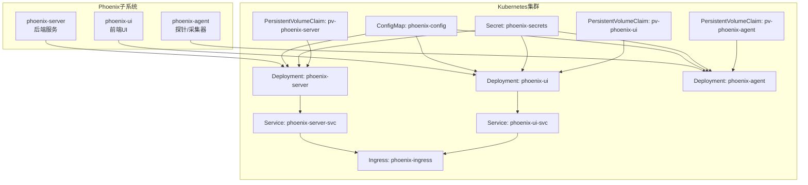
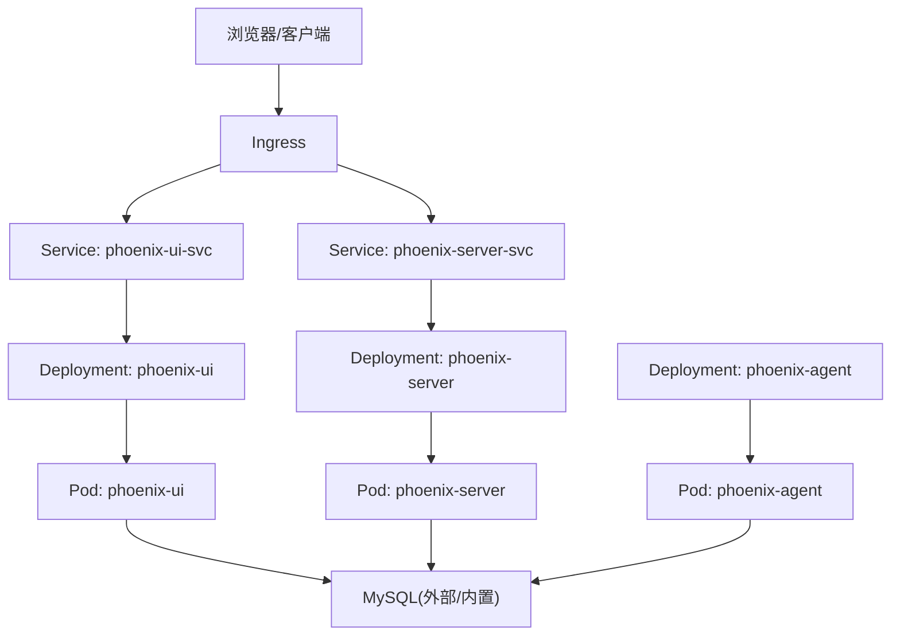
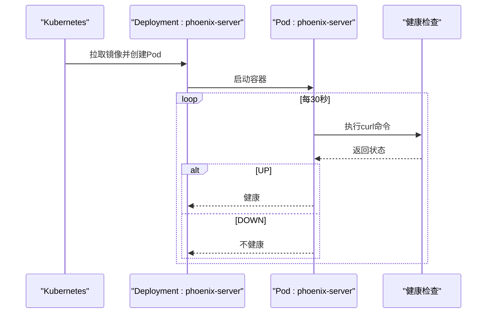
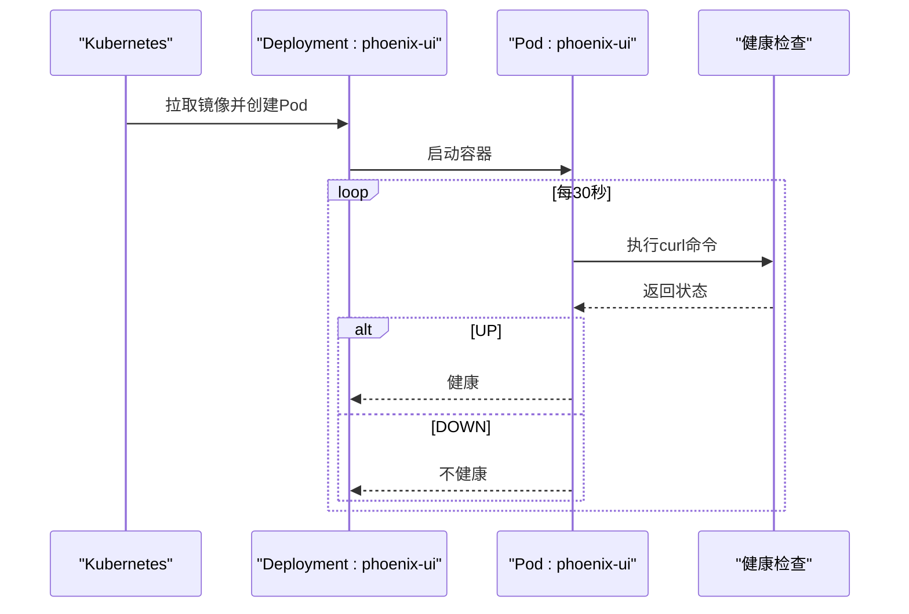
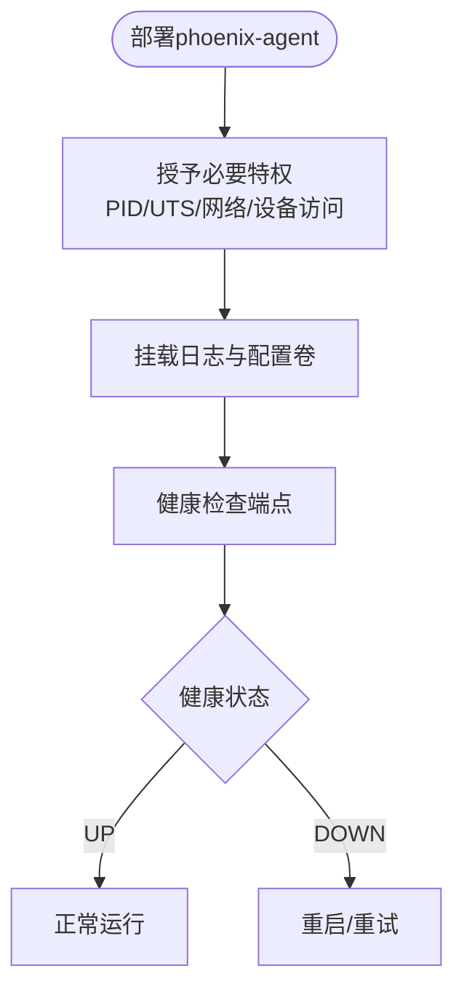
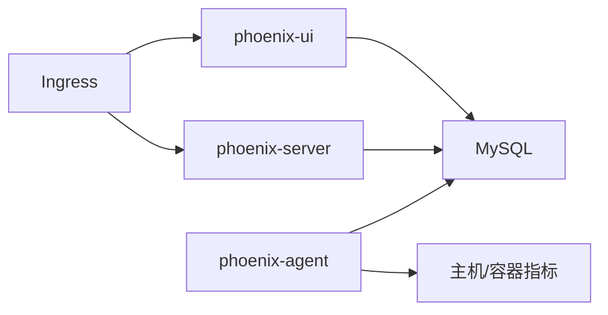

# Kubernetes部署

<cite>
**本文引用的文件**
- [phoenix-server 应用配置(application.yml)](file://phoenix-server/src/main/resources/application.yml)
- [phoenix-ui 应用配置(application.yml)](file://phoenix-ui/src/main/resources/application.yml)
- [phoenix-agent 应用配置(application.yml)](file://phoenix-agent/src/main/resources/application.yml)
- [phoenix-server 开发配置(application-dev.yml)](file://phoenix-server/src/main/resources/application-dev.yml)
- [phoenix-ui 开发配置(application-dev.yml)](file://phoenix-ui/src/main/resources/application-dev.yml)
- [phoenix-agent 开发配置(application-dev.yml)](file://phoenix-agent/src/main/resources/application-dev.yml)
- [phoenix-server 生产配置(application-prod.yml)](file://phoenix-server/src/main/resources/application-prod.yml)
- [phoenix-ui 生产配置(application-prod.yml)](file://phoenix-ui/src/main/resources/application-prod.yml)
- [phoenix-agent 生产配置(application-prod.yml)](file://phoenix-agent/src/main/resources/application-prod.yml)
- [phoenix-server Dockerfile](file://phoenix-server/src/main/docker/Dockerfile)
- [phoenix-ui Dockerfile](file://phoenix-ui/src/main/docker/Dockerfile)
- [phoenix-agent Dockerfile](file://phoenix-agent/src/main/docker/Dockerfile)
- [phoenix-server 运行容器脚本(run_container.1.2.6.RELEASE-CR5.sh)](file://doc/Docker/phoenix-server/run_container.1.2.6.RELEASE-CR5.sh)
- [phoenix-ui 运行容器脚本(run_container.1.2.6.RELEASE-CR5.sh)](file://doc/Docker/phoenix-ui/run_container.1.2.6.RELEASE-CR5.sh)
- [phoenix-agent 运行容器脚本(run_container.1.2.6.RELEASE-CR5.sh)](file://doc/Docker/phoenix-agent/run_container.1.2.6.RELEASE-CR5.sh)
- [Phoenix 数据库建表SQL(phoenix.sql)](file://doc/数据库设计/sql/mysql/phoenix.sql)
</cite>

## 目录
1. [简介](#简介)
2. [项目结构](#项目结构)
3. [核心组件](#核心组件)
4. [架构总览](#架构总览)
5. [详细组件分析](#详细组件分析)
6. [依赖关系分析](#依赖关系分析)
7. [性能考量](#性能考量)
8. [故障排查指南](#故障排查指南)
9. [结论](#结论)
10. [附录](#附录)

## 简介
本文件面向Phoenix监控系统在Kubernetes上的部署实践，围绕以下目标展开：
- 设计Kubernetes部署架构，覆盖Deployment、Service、Ingress、ConfigMap、Secret等核心资源对象
- 明确容器编排策略：副本数、滚动更新、健康检查、资源限制
- 提供持久化存储方案：PV/PVC配置及数据库、日志等持久化需求
- 说明网络与安全：Service网络、Ingress路由、TLS证书、RBAC权限
- 给出集群监控与日志收集方案：Pod状态、应用日志、性能指标
- 提供完整部署清单与配置示例，覆盖开发、测试、生产三类环境

## 项目结构
Phoenix由三个核心子系统组成：
- phoenix-server：后端服务，提供REST API、定时任务、数据库访问
- phoenix-ui：前端UI，提供Web界面与认证
- phoenix-agent：探针/采集器，负责采集主机与应用指标

各子系统均提供独立的Dockerfile与运行脚本，便于容器化与Kubernetes部署。

图表来源
- [phoenix-server Dockerfile:1-48](file://phoenix-server/src/main/docker/Dockerfile#L1-L48)
- [phoenix-ui Dockerfile:1-55](file://phoenix-ui/src/main/docker/Dockerfile#L1-L55)
- [phoenix-agent Dockerfile:1-47](file://phoenix-agent/src/main/docker/Dockerfile#L1-L47)

章节来源
- [phoenix-server Dockerfile:1-48](file://phoenix-server/src/main/docker/Dockerfile#L1-L48)
- [phoenix-ui Dockerfile:1-55](file://phoenix-ui/src/main/docker/Dockerfile#L1-L55)
- [phoenix-agent Dockerfile:1-47](file://phoenix-agent/src/main/docker/Dockerfile#L1-L47)

## 核心组件
- Deployment：为每个子系统提供无状态副本管理与滚动更新能力
- Service：暴露后端服务与UI，支持ClusterIP/NodePort/LoadBalancer
- Ingress：统一入口，处理域名路由与TLS终止
- ConfigMap：存放应用配置（如数据库连接、日志路径、认证参数）
- Secret：存放敏感信息（数据库密码、邮件凭据、TLS证书）
- PersistentVolume/PersistentVolumeClaim：为日志目录与配置目录提供持久化
- Pod健康检查：基于Actuator健康端点
- 资源限制与请求：结合业务特性设置CPU/内存配额

章节来源
- [phoenix-server 应用配置(application.yml):1-271](file://phoenix-server/src/main/resources/application.yml#L1-L271)
- [phoenix-ui 应用配置(application.yml):1-238](file://phoenix-ui/src/main/resources/application.yml#L1-L238)
- [phoenix-agent 应用配置(application.yml):1-111](file://phoenix-agent/src/main/resources/application.yml#L1-L111)

## 架构总览
Phoenix在Kubernetes中的典型拓扑如下：
- Ingress作为统一入口，将流量分发至phoenix-ui与phoenix-server
- phoenix-server通过Service暴露REST API，内部依赖MySQL数据库
- phoenix-ui通过Service暴露Web界面，内部依赖MySQL数据库
- phoenix-agent以DaemonSet或Deployment形式运行，采集主机与应用指标
- 所有组件共享ConfigMap与Secret，持久化卷挂载日志目录

图表来源
- [phoenix-server 应用配置(application.yml):116-184](file://phoenix-server/src/main/resources/application.yml#L116-L184)
- [phoenix-ui 应用配置(application.yml):84-151](file://phoenix-ui/src/main/resources/application.yml#L84-L151)

## 详细组件分析

### phoenix-server 部署
- 容器镜像与端口
  - 基于JDK 17，暴露端口16000
  - 健康检查基于Actuator健康端点
- 持久化
  - VOLUME定义了/app/liblog4phoenix与/app/config，建议映射到PVC
- 配置
  - 通过ConfigMap挂载application.yml与profile-specific配置
  - 生产环境数据库连接参数位于application-prod.yml
- 健康检查
  - 健康检查命令访问/phoenix-server/actuator/health

图表来源
- [phoenix-server Dockerfile:34-36](file://phoenix-server/src/main/docker/Dockerfile#L34-L36)
- [phoenix-server 应用配置(application.yml):219-234](file://phoenix-server/src/main/resources/application.yml#L219-L234)

章节来源
- [phoenix-server Dockerfile:1-48](file://phoenix-server/src/main/docker/Dockerfile#L1-L48)
- [phoenix-server 应用配置(application.yml):1-271](file://phoenix-server/src/main/resources/application.yml#L1-L271)
- [phoenix-server 生产配置(application-prod.yml):1-38](file://phoenix-server/src/main/resources/application-prod.yml#L1-L38)

### phoenix-ui 部署
- 容器镜像与端口
  - 基于JDK 17，暴露端口80
  - 使用authbind允许非root绑定80端口
- 持久化
  - VOLUME定义了/app/liblog4phoenix与/app/config，建议映射到PVC
- 配置
  - 通过ConfigMap挂载application.yml与profile-specific配置
  - 生产环境数据库连接参数位于application-prod.yml
- 健康检查
  - 健康检查命令访问/phoenix-ui/actuator/health

图表来源
- [phoenix-ui Dockerfile:39-41](file://phoenix-ui/src/main/docker/Dockerfile#L39-L41)
- [phoenix-ui 应用配置(application.yml):187-201](file://phoenix-ui/src/main/resources/application.yml#L187-L201)

章节来源
- [phoenix-ui Dockerfile:1-55](file://phoenix-ui/src/main/docker/Dockerfile#L1-L55)
- [phoenix-ui 应用配置(application.yml):1-238](file://phoenix-ui/src/main/resources/application.yml#L1-L238)
- [phoenix-ui 生产配置(application-prod.yml):1-39](file://phoenix-ui/src/main/resources/application-prod.yml#L1-L39)

### phoenix-agent 部署
- 容器镜像与端口
  - 基于JDK 17，暴露端口12000
  - 需要特权能力（PID/UTS/网络等），建议以DaemonSet或privileged模式运行
- 持久化
  - VOLUME定义了/app/liblog4phoenix与/app/config，建议映射到PVC
- 健康检查
  - 健康检查命令访问/phoenix-agent/actuator/health

图表来源
- [phoenix-agent Dockerfile:34-36](file://phoenix-agent/src/main/docker/Dockerfile#L34-L36)

章节来源
- [phoenix-agent Dockerfile:1-47](file://phoenix-agent/src/main/docker/Dockerfile#L1-L47)
- [phoenix-agent 应用配置(application.yml):1-111](file://phoenix-agent/src/main/resources/application.yml#L1-L111)

### 数据库与持久化
- 数据库
  - phoenix-server与phoenix-ui均使用MySQL，生产配置中提供连接参数
  - 建议使用外部MySQL或托管数据库服务，避免单点
- 日志与配置持久化
  - 三个子系统均声明/app/liblog4phoenix与/app/config为VOLUME
  - 建议为每个子系统创建独立PVC并挂载到对应容器路径
- 初始化脚本
  - 提供完整的建表SQL，可用于初始化数据库

```mermaid
erDiagram
MONITOR_ALARM_DEFINITION {
bigint ID PK
varchar TYPE
varchar FIRST_CLASS
varchar SECOND_CLASS
varchar THIRD_CLASS
varchar GRADE
varchar CODE
varchar TITLE
varchar CONTENT
datetime INSERT_TIME
datetime UPDATE_TIME
}
MONITOR_ALARM_RECORD {
bigint ID PK
varchar CODE
varchar ALARM_DEF_CODE
varchar TYPE
varchar LEVEL
varchar WAY
varchar TITLE
longtext CONTENT
varchar NOT_SEND_REASON
datetime INSERT_TIME
datetime UPDATE_TIME
}
MONITOR_ALARM_RECORD_DETAIL {
bigint ID PK
bigint ALARM_RECORD_ID FK
varchar CODE
varchar WAY
varchar NUMBER
varchar STATUS
longtext EXC_MESSAGE
datetime INSERT_TIME
datetime UPDATE_TIME
}
MONITOR_CONFIG {
bigint ID PK
text VALUE
datetime INSERT_TIME
datetime UPDATE_TIME
}
MONITOR_DB {
bigint ID PK
varchar CONN_NAME
varchar URL
varchar USERNAME
varchar PASSWORD
varchar DB_TYPE
varchar DRIVER_CLASS
varchar DB_DESC
varchar IS_ONLINE
varchar IS_ENABLE_MONITOR
varchar IS_ENABLE_ALARM
int OFFLINE_COUNT
varchar MONITOR_ENV
varchar MONITOR_GROUP
datetime INSERT_TIME
datetime UPDATE_TIME
}
MONITOR_ENV {
bigint ID PK
varchar ENV_NAME
varchar ENV_DESC
varchar CREATE_ACCOUNT
varchar UPDATE_ACCOUNT
datetime INSERT_TIME
datetime UPDATE_TIME
}
MONITOR_GROUP {
bigint ID PK
varchar GROUP_TYPE
varchar GROUP_NAME
varchar GROUP_DESC
varchar CREATE_ACCOUNT
varchar UPDATE_ACCOUNT
datetime INSERT_TIME
datetime UPDATE_TIME
}
MONITOR_HTTP {
bigint ID PK
varchar HOSTNAME_SOURCE
varchar URL_TARGET
varchar METHOD
varchar CONTENT_TYPE
longtext HEADER_PARAMETER
longtext BODY_PARAMETER
varchar DESCR
bigint AVG_TIME
int STATUS
varchar IS_ENABLE_MONITOR
varchar IS_ENABLE_ALARM
longtext EXC_MESSAGE
longtext RESULT_BODY
int RESULT_BODY_SIZE
int OFFLINE_COUNT
varchar MONITOR_ENV
varchar MONITOR_GROUP
datetime INSERT_TIME
datetime UPDATE_TIME
}
MONITOR_HTTP_HISTORY {
bigint ID PK
bigint HTTP_ID FK
varchar HOSTNAME_SOURCE
varchar URL_TARGET
varchar METHOD
varchar CONTENT_TYPE
longtext HEADER_PARAMETER
longtext BODY_PARAMETER
varchar DESCR
bigint AVG_TIME
int STATUS
longtext EXC_MESSAGE
longtext RESULT_BODY
int RESULT_BODY_SIZE
int OFFLINE_COUNT
datetime INSERT_TIME
datetime UPDATE_TIME
}
MONITOR_INSTANCE {
bigint ID PK
varchar INSTANCE_ID
varchar ENDPOINT
varchar INSTANCE_NAME
varchar INSTANCE_DESC
varchar INSTANCE_SUMMARY
varchar LANGUAGE
varchar APP_SERVER_TYPE
varchar IP
varchar IS_ONLINE
varchar IS_ENABLE_MONITOR
varchar IS_ENABLE_ALARM
varchar IS_OFFLINE_NOTICE
int OFFLINE_COUNT
int CONN_FREQUENCY
varchar MONITOR_ENV
varchar MONITOR_GROUP
datetime INSERT_TIME
datetime UPDATE_TIME
}
MONITOR_JVM_CLASS_LOADING {
bigint ID PK
varchar INSTANCE_ID
int TOTAL_LOADED_CLASS_COUNT
int LOADED_CLASS_COUNT
int UNLOADED_CLASS_COUNT
varchar IS_VERBOSE
datetime INSERT_TIME
datetime UPDATE_TIME
}
MONITOR_JVM_GARBAGE_COLLECTOR {
bigint ID PK
varchar INSTANCE_ID
int GARBAGE_COLLECTOR_NO
varchar GARBAGE_COLLECTOR_NAME
varchar COLLECTION_COUNT
varchar COLLECTION_TIME
datetime INSERT_TIME
datetime UPDATE_TIME
}
MONITOR_JVM_MEMORY {
bigint ID PK
varchar INSTANCE_ID
varchar MEMORY_TYPE
bigint INIT
bigint USED
bigint COMMITTED
varchar MAX
datetime INSERT_TIME
datetime UPDATE_TIME
}
MONITOR_JVM_MEMORY_HISTORY {
bigint ID PK
varchar INSTANCE_ID
varchar MEMORY_TYPE
bigint INIT
bigint USED
bigint COMMITTED
varchar MAX
datetime INSERT_TIME
datetime UPDATE_TIME
}
MONITOR_JVM_RUNTIME {
bigint ID PK
varchar INSTANCE_ID
varchar NAME
varchar VM_NAME
varchar VM_VENDOR
varchar VM_VERSION
varchar SPEC_NAME
varchar SPEC_VENDOR
varchar SPEC_VERSION
varchar MANAGEMENT_SPEC_VERSION
text CLASS_PATH
text LIBRARY_PATH
varchar IS_BOOT_CLASS_PATH_SUPPORTED
text BOOT_CLASS_PATH
text INPUT_ARGUMENTS
varchar UPTIME
datetime START_TIME
datetime INSERT_TIME
datetime UPDATE_TIME
}
MONITOR_JVM_THREAD {
bigint ID PK
varchar INSTANCE_ID
int THREAD_COUNT
int PEAK_THREAD_COUNT
int TOTAL_STARTED_THREAD_COUNT
int DAEMON_THREAD_COUNT
longtext THREAD_INFOS
datetime INSERT_TIME
datetime UPDATE_TIME
}
MONITOR_LINK {
bigint ID PK
varchar ROOT_NODE
varchar ROOT_NODE_TIME
text LINK
text LINK_TIME
varchar TYPE
datetime INSERT_TIME
datetime UPDATE_TIME
}
MONITOR_LOG_EXCEPTION {
bigint ID PK
varchar INSTANCE_ID
varchar EXC_NAME
longtext EXC_MESSAGE
bigint USER_ID
varchar USERNAME
varchar OPER_METHOD
longtext REQ_PARAM
varchar URI
varchar IP
varchar IS_ALARM
datetime INSERT_TIME
}
MONITOR_LOG_OPERATION {
bigint ID PK
varchar OPER_MODULE
varchar OPER_TYPE
varchar OPER_DESC
text REQ_PARAM
longtext RESP_PARAM
bigint USER_ID
varchar USERNAME
varchar OPER_METHOD
varchar URI
varchar IP
varchar DURATION
datetime INSERT_TIME
}
MONITOR_NET {
bigint ID PK
varchar IP_SOURCE
varchar IP_TARGET
varchar IP_DESC
varchar STATUS
varchar IS_ENABLE_MONITOR
varchar IS_ENABLE_ALARM
double AVG_TIME
text PING_DETAIL
int OFFLINE_COUNT
varchar MONITOR_ENV
varchar MONITOR_GROUP
datetime INSERT_TIME
datetime UPDATE_TIME
}
MONITOR_NET_HISTORY {
bigint ID PK
bigint NET_ID FK
varchar IP_SOURCE
varchar IP_TARGET
varchar IP_DESC
varchar STATUS
double AVG_TIME
text PING_DETAIL
int OFFLINE_COUNT
datetime INSERT_TIME
datetime UPDATE_TIME
}
MONITOR_REALTIME_MONITORING {
bigint ID PK
varchar TYPE
varchar SUB_TYPE
varchar CODE
varchar ALERTED_ENTITY_ID
varchar IS_SENT_ALARM
datetime INSERT_TIME
datetime UPDATE_TIME
}
MONITOR_ROLE {
bigint ID PK
varchar ROLE_NAME
datetime CREATE_TIME
datetime UPDATE_TIME
}
MONITOR_SERVER {
bigint ID PK
varchar IP
varchar SERVER_NAME
varchar SERVER_SUMMARY
varchar IS_ONLINE
varchar IS_ENABLE_MONITOR
varchar IS_ENABLE_ALARM
int OFFLINE_COUNT
int CONN_FREQUENCY
varchar MONITOR_ENV
varchar MONITOR_GROUP
datetime INSERT_TIME
datetime UPDATE_TIME
}
MONITOR_SERVER_CPU {
bigint ID PK
varchar IP
int CPU_NO
int CPU_MHZ
varchar CPU_VENDOR
varchar CPU_MODEL
double CPU_USER
double CPU_SYS
double CPU_WAIT
double CPU_NICE
double CPU_COMBINED
double CPU_IDLE
datetime INSERT_TIME
datetime UPDATE_TIME
}
MONITOR_SERVER_CPU_HISTORY {
bigint ID PK
varchar IP
int CPU_NO
int CPU_MHZ
varchar CPU_VENDOR
varchar CPU_MODEL
double CPU_USER
double CPU_SYS
double CPU_WAIT
double CPU_NICE
double CPU_COMBINED
double CPU_IDLE
datetime INSERT_TIME
datetime UPDATE_TIME
}
MONITOR_SERVER_DISK {
bigint ID PK
varchar IP
int DISK_NO
varchar DEV_NAME
varchar DIR_NAME
varchar TYPE_NAME
varchar SYS_TYPE_NAME
bigint TOTAL
bigint FREE
bigint USED
bigint AVAIL
double USE_PERCENT
datetime INSERT_TIME
datetime UPDATE_TIME
}
MONITOR_SERVER_DISK_HISTORY {
bigint ID PK
varchar IP
int DISK_NO
varchar DEV_NAME
varchar DIR_NAME
varchar TYPE_NAME
varchar SYS_TYPE_NAME
bigint TOTAL
bigint FREE
bigint USED
bigint AVAIL
double USE_PERCENT
datetime INSERT_TIME
datetime UPDATE_TIME
}
MONITOR_SERVER_GPU {
bigint ID PK
varchar IP
int GPU_NO
varchar GPU_NAME
varchar GPU_DEVICE_ID
varchar GPU_VENDOR
varchar GPU_VERSION_INFO
bigint GPU_VRAM_TOTAL
datetime INSERT_TIME
datetime UPDATE_TIME
}
MONITOR_SERVER_LOAD_AVERAGE {
bigint ID PK
varchar IP
int LOGICAL_PROCESSOR_COUNT
double ONE
double FIVE
double FIFTEEN
datetime INSERT_TIME
datetime UPDATE_TIME
}
MONITOR_SERVER_NETWORK {
bigint ID PK
varchar IP
int IFACE_NO
varchar IFACE_NAME
varchar IFACE_TYPE
bigint RX_BYTES
bigint TX_BYTES
bigint RX_RATE
bigint TX_RATE
datetime INSERT_TIME
datetime UPDATE_TIME
}
MONITOR_SERVER_NETWORK_HISTORY {
bigint ID PK
varchar IP
int IFACE_NO
varchar IFACE_NAME
varchar IFACE_TYPE
bigint RX_BYTES
bigint TX_BYTES
bigint RX_RATE
bigint TX_RATE
datetime INSERT_TIME
datetime UPDATE_TIME
}
MONITOR_SERVER_SWAP {
bigint ID PK
varchar IP
bigint TOTAL
bigint FREE
bigint USED
double USE_PERCENT
datetime INSERT_TIME
datetime UPDATE_TIME
}
MONITOR_SERVER_SWAP_HISTORY {
bigint ID PK
varchar IP
bigint TOTAL
bigint FREE
bigint USED
double USE_PERCENT
datetime INSERT_TIME
datetime UPDATE_TIME
}
MONITOR_TCP {
bigint ID PK
varchar IP_SOURCE
varchar IP_TARGET
int PORT_TARGET
varchar STATUS
varchar IS_ENABLE_MONITOR
varchar IS_ENABLE_ALARM
double AVG_TIME
int OFFLINE_COUNT
varchar MONITOR_ENV
varchar MONITOR_GROUP
datetime INSERT_TIME
datetime UPDATE_TIME
}
MONITOR_TCP_HISTORY {
bigint ID PK
bigint TCP_ID FK
varchar IP_SOURCE
varchar IP_TARGET
int PORT_TARGET
varchar STATUS
double AVG_TIME
int OFFLINE_COUNT
datetime INSERT_TIME
datetime UPDATE_TIME
}
MONITOR_USER {
bigint ID PK
varchar USERNAME
varchar NICKNAME
varchar EMAIL
varchar PHONE
varchar PASSWORD
varchar CREATE_TIME
varchar UPDATE_TIME
}
MONITOR_USER_GROUP {
bigint ID PK
bigint USER_ID FK
varchar GROUP_NAME
datetime INSERT_TIME
datetime UPDATE_TIME
}
MONITOR_USER_GROUP_RELATION {
bigint ID PK
bigint USER_ID FK
bigint GROUP_ID FK
datetime INSERT_TIME
datetime UPDATE_TIME
}
MONITOR_USER_LOGIN_LOG {
bigint ID PK
varchar USERNAME
varchar LOGIN_IP
varchar LOGIN_LOCATION
varchar LOGIN_UA
varchar LOGIN_STATUS
datetime LOGIN_TIME
datetime LOGOUT_TIME
}
MONITOR_USER_SESSION {
bigint ID PK
varchar SESSION_ID
varchar USERNAME
varchar LOGIN_IP
varchar LOGIN_TIME
varchar EXPIRE_TIME
}
MONITOR_WEBHOOK {
bigint ID PK
varchar NAME
varchar URL
varchar METHOD
varchar HEADERS
varchar BODY
varchar ENABLED
datetime INSERT_TIME
datetime UPDATE_TIME
}
MONITOR_WEBHOOK_HISTORY {
bigint ID PK
bigint WEBHOOK_ID FK
varchar NAME
varchar URL
varchar METHOD
varchar HEADERS
varchar BODY
varchar STATUS
varchar RESPONSE
datetime INSERT_TIME
datetime UPDATE_TIME
}
MONITOR_ALARM_DEFINITION ||--o{ MONITOR_ALARM_RECORD : "定义"
MONITOR_ALARM_RECORD ||--o{ MONITOR_ALARM_RECORD_DETAIL : "明细"
MONITOR_ENV ||--o{ MONITOR_DB : "环境"
MONITOR_GROUP ||--o{ MONITOR_DB : "分组"
MONITOR_HTTP ||--o{ MONITOR_HTTP_HISTORY : "历史"
MONITOR_ENV ||--o{ MONITOR_HTTP : "环境"
MONITOR_GROUP ||--o{ MONITOR_HTTP : "分组"
MONITOR_ENV ||--o{ MONITOR_INSTANCE : "环境"
MONITOR_GROUP ||--o{ MONITOR_INSTANCE : "分组"
MONITOR_INSTANCE ||--o{ MONITOR_JVM_CLASS_LOADING : "实例"
MONITOR_INSTANCE ||--o{ MONITOR_JVM_GARBAGE_COLLECTOR : "实例"
MONITOR_INSTANCE ||--o{ MONITOR_JVM_MEMORY : "实例"
MONITOR_INSTANCE ||--o{ MONITOR_JVM_RUNTIME : "实例"
MONITOR_INSTANCE ||--o{ MONITOR_JVM_THREAD : "实例"
MONITOR_ENV ||--o{ MONITOR_NET : "环境"
MONITOR_GROUP ||--o{ MONITOR_NET : "分组"
MONITOR_NET ||--o{ MONITOR_NET_HISTORY : "历史"
MONITOR_ENV ||--o{ MONITOR_SERVER : "环境"
MONITOR_GROUP ||--o{ MONITOR_SERVER : "分组"
MONITOR_SERVER ||--o{ MONITOR_SERVER_CPU : "服务器"
MONITOR_SERVER ||--o{ MONITOR_SERVER_DISK : "服务器"
MONITOR_SERVER ||--o{ MONITOR_SERVER_NETWORK : "服务器"
MONITOR_SERVER ||--o{ MONITOR_SERVER_SWAP : "服务器"
MONITOR_SERVER_CPU ||--o{ MONITOR_SERVER_CPU_HISTORY : "历史"
MONITOR_SERVER_DISK ||--o{ MONITOR_SERVER_DISK_HISTORY : "历史"
MONITOR_SERVER_NETWORK ||--o{ MONITOR_SERVER_NETWORK_HISTORY : "历史"
MONITOR_SERVER_SWAP ||--o{ MONITOR_SERVER_SWAP_HISTORY : "历史"
MONITOR_ENV ||--o{ MONITOR_TCP : "环境"
MONITOR_GROUP ||--o{ MONITOR_TCP : "分组"
MONITOR_TCP ||--o{ MONITOR_TCP_HISTORY : "历史"
MONITOR_USER ||--o{ MONITOR_USER_GROUP : "用户"
MONITOR_USER_GROUP ||--o{ MONITOR_USER_GROUP_RELATION : "关系"
MONITOR_USER ||--o{ MONITOR_USER_LOGIN_LOG : "登录日志"
MONITOR_USER ||--o{ MONITOR_USER_SESSION : "会话"
MONITOR_WEBHOOK ||--o{ MONITOR_WEBHOOK_HISTORY : "历史"
```

图表来源
- [Phoenix 数据库建表SQL(phoenix.sql):1-800](file://doc/数据库设计/sql/mysql/phoenix.sql#L1-L800)

章节来源
- [Phoenix 数据库建表SQL(phoenix.sql):1-800](file://doc/数据库设计/sql/mysql/phoenix.sql#L1-L800)
- [phoenix-server 生产配置(application-prod.yml):1-38](file://phoenix-server/src/main/resources/application-prod.yml#L1-L38)
- [phoenix-ui 生产配置(application-prod.yml):1-39](file://phoenix-ui/src/main/resources/application-prod.yml#L1-L39)

## 依赖关系分析
- 组件间依赖
  - phoenix-ui与phoenix-server均依赖MySQL
  - phoenix-agent可选依赖数据库（取决于采集范围）
- 外部依赖
  - Ingress控制器（如Nginx/Contour/Traefik）
  - 存储类（StorageClass）用于动态PVC绑定
  - RBAC与网络策略（可选）

图表来源
- [phoenix-server 应用配置(application.yml):116-184](file://phoenix-server/src/main/resources/application.yml#L116-L184)
- [phoenix-ui 应用配置(application.yml):84-151](file://phoenix-ui/src/main/resources/application.yml#L84-L151)

章节来源
- [phoenix-server 应用配置(application.yml):1-271](file://phoenix-server/src/main/resources/application.yml#L1-L271)
- [phoenix-ui 应用配置(application.yml):1-238](file://phoenix-ui/src/main/resources/application.yml#L1-L238)

## 性能考量
- 资源配额
  - 为Deployment设置requests/limits，避免资源争抢
  - 根据业务峰值调整CPU/内存配额
- 健康检查
  - 健康检查间隔与超时需平衡探测频率与系统开销
- 数据库连接池
  - 生产配置中已配置Druid连接池参数，建议结合数据库规格调优
- 日志与I/O
  - 将日志目录持久化到高性能存储，避免频繁I/O阻塞

## 故障排查指南
- 健康检查失败
  - 检查Actuator健康端点是否可达
  - 查看容器日志与Kubernetes事件
- 数据库连接异常
  - 校验Secret中的数据库凭据
  - 确认数据库服务可达性与网络策略
- 探针权限不足
  - 确认phoenix-agent所需特权与安全上下文配置
- Ingress路由问题
  - 校验Ingress规则与TLS证书
  - 检查Ingress控制器日志

章节来源
- [phoenix-server Dockerfile:34-36](file://phoenix-server/src/main/docker/Dockerfile#L34-L36)
- [phoenix-ui Dockerfile:39-41](file://phoenix-ui/src/main/docker/Dockerfile#L39-L41)
- [phoenix-agent Dockerfile:34-36](file://phoenix-agent/src/main/docker/Dockerfile#L34-L36)

## 结论
本文基于Phoenix现有容器化配置，给出了Kubernetes部署的系统化方案。通过合理的Deployment/Service/Ingress/ConfigMap/Secret/PV/PVC设计，以及滚动更新、健康检查与资源限制策略，可实现Phoenix在Kubernetes上的稳定运行。建议在生产环境中进一步完善网络策略、RBAC权限与监控告警体系。

## 附录
- 开发/测试/生产环境差异
  - 开发环境：application-dev.yml，端口与数据库连接参数便于本地调试
  - 生产环境：application-prod.yml，强调安全与性能
- 运行脚本参考
  - 仓库提供了Docker容器运行脚本，展示了持久化卷与网络模式，可作为Kubernetes挂载与网络策略的参考

章节来源
- [phoenix-server 开发配置(application-dev.yml):1-38](file://phoenix-server/src/main/resources/application-dev.yml#L1-L38)
- [phoenix-ui 开发配置(application-dev.yml):1-49](file://phoenix-ui/src/main/resources/application-dev.yml#L1-L49)
- [phoenix-agent 开发配置(application-dev.yml):1-3](file://phoenix-agent/src/main/resources/application-dev.yml#L1-L3)
- [phoenix-server 生产配置(application-prod.yml):1-38](file://phoenix-server/src/main/resources/application-prod.yml#L1-L38)
- [phoenix-ui 生产配置(application-prod.yml):1-39](file://phoenix-ui/src/main/resources/application-prod.yml#L1-L39)
- [phoenix-agent 生产配置(application-prod.yml):1-3](file://phoenix-agent/src/main/resources/application-prod.yml#L1-L3)
- [phoenix-server 运行容器脚本(run_container.1.2.6.RELEASE-CR5.sh):1-40](file://doc/Docker/phoenix-server/run_container.1.2.6.RELEASE-CR5.sh#L1-L40)
- [phoenix-ui 运行容器脚本(run_container.1.2.6.RELEASE-CR5.sh):1-41](file://doc/Docker/phoenix-ui/run_container.1.2.6.RELEASE-CR5.sh#L1-L41)
- [phoenix-agent 运行容器脚本(run_container.1.2.6.RELEASE-CR5.sh):1-49](file://doc/Docker/phoenix-agent/run_container.1.2.6.RELEASE-CR5.sh#L1-L49)