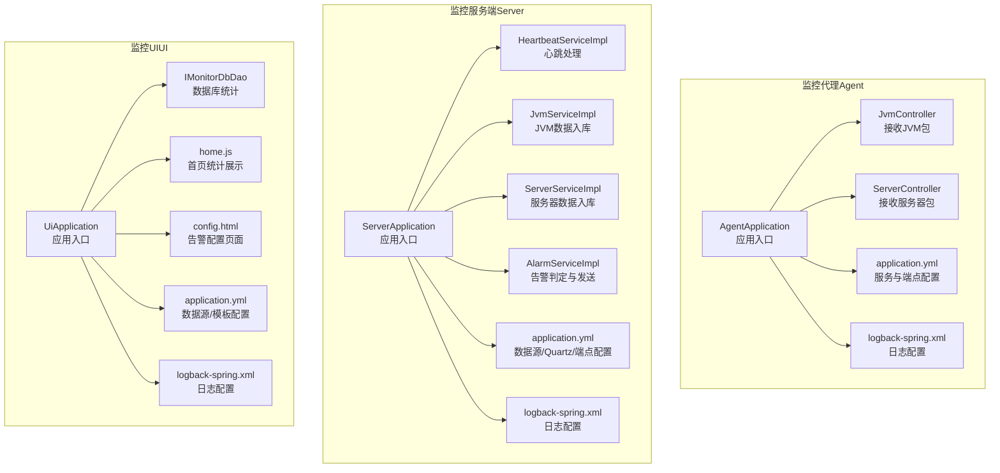
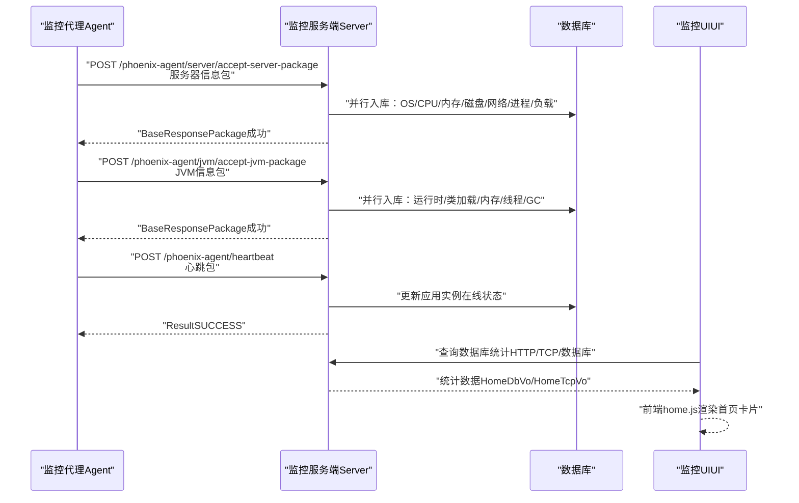
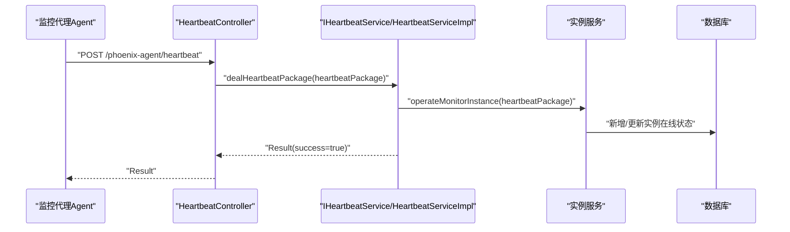
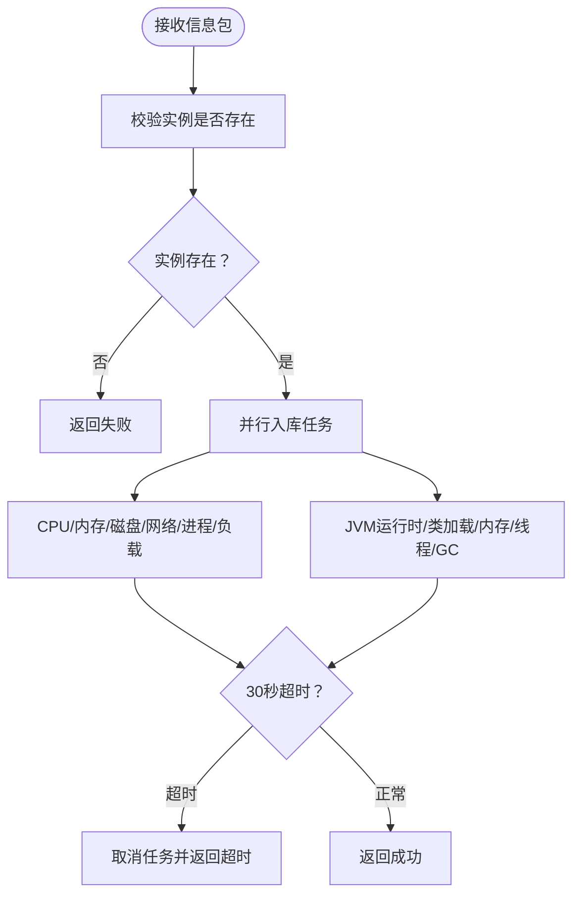
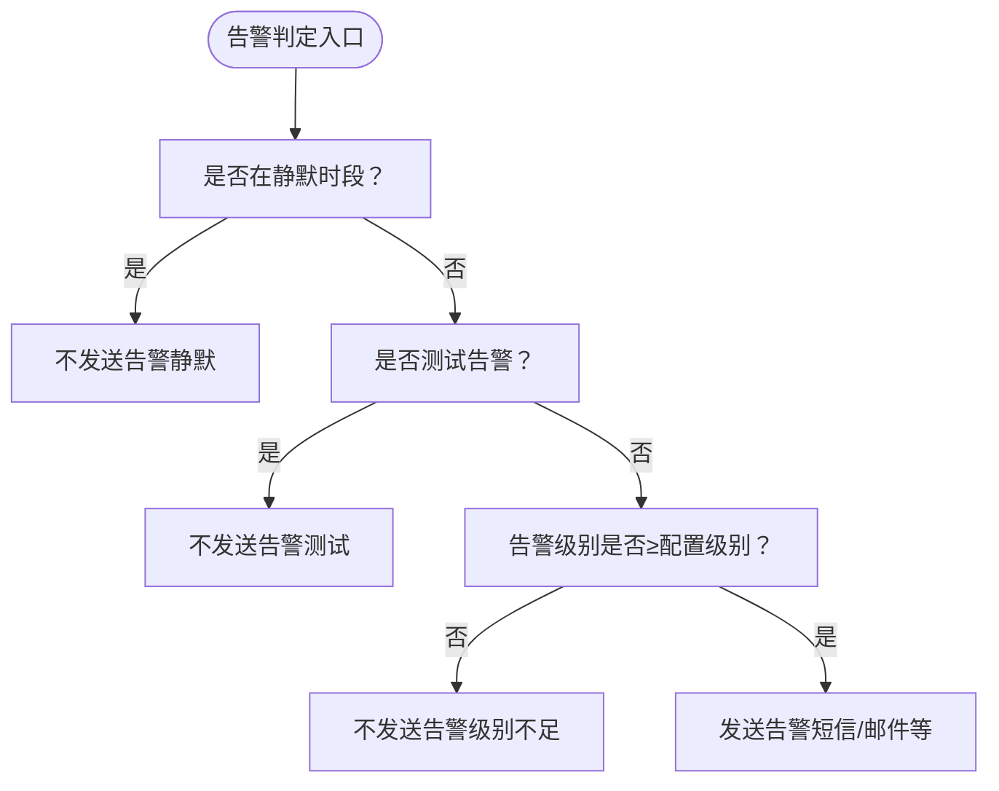
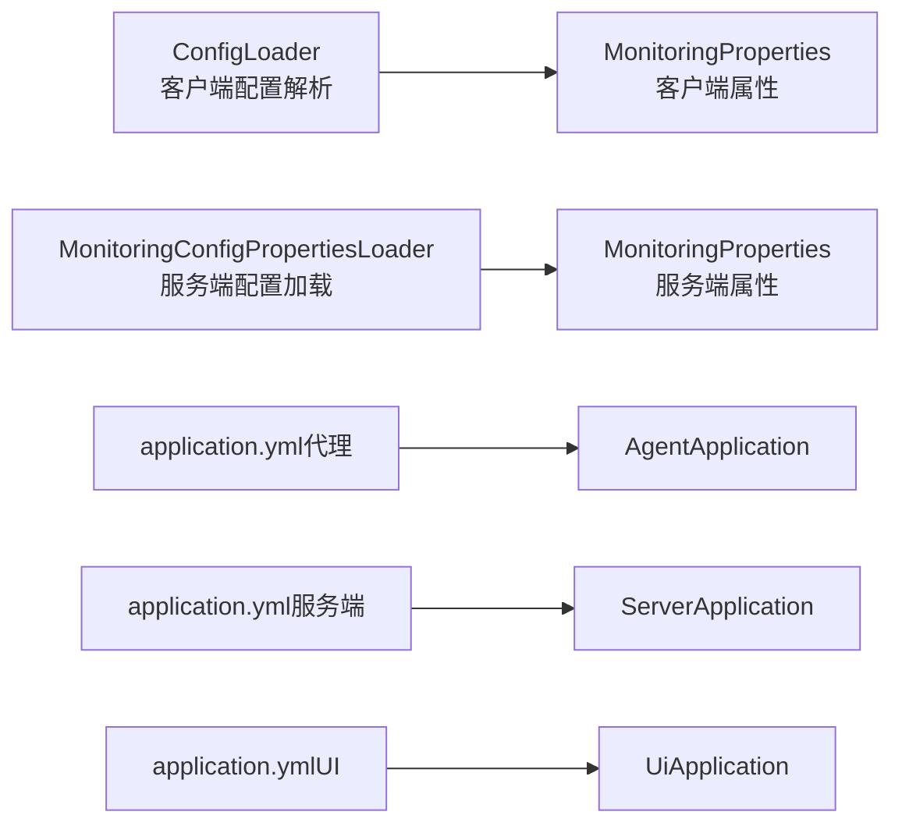

# 健康监控与维护

<cite>
**本文引用的文件**
- [AgentApplication.java](file://phoenix-agent/src/main/java/com/gitee/pifeng/monitoring/agent/AgentApplication.java)
- [ServerApplication.java](file://phoenix-server/src/main/java/com/gitee/pifeng/monitoring/server/ServerApplication.java)
- [UiApplication.java](file://phoenix-ui/src/main/java/com/gitee/pifeng/monitoring/ui/UiApplication.java)
- [application.yml（代理）](file://phoenix-agent/src/main/resources/application.yml)
- [application.yml（服务端）](file://phoenix-server/src/main/resources/application.yml)
- [application.yml（UI）](file://phoenix-ui/src/main/resources/application.yml)
- [logback-spring.xml（代理）](file://phoenix-agent/src/main/resources/logback-spring.xml)
- [logback-spring.xml（服务端）](file://phoenix-server/src/main/resources/logback-spring.xml)
- [logback-spring.xml（UI）](file://phoenix-ui/src/main/resources/logback-spring.xml)
- [IHeartbeatService.java](file://phoenix-server/src/main/java/com/gitee/pifeng/monitoring/server/business/server/service/IHeartbeatService.java)
- [HeartbeatServiceImpl.java](file://phoenix-server/src/main/java/com/gitee/pifeng/monitoring/server/business/server/service/impl/HeartbeatServiceImpl.java)
- [HeartbeatController.java](file://phoenix-server/src/main/java/com/gitee/pifeng/monitoring/server/business/server/controller/HeartbeatController.java)
- [MonitoringAlarmProperties.java](file://phoenix-common/phoenix-common-core/src/main/java/com/gitee/pifeng/monitoring/common/property/server/MonitoringAlarmProperties.java)
- [Alarm.java](file://phoenix-common/phoenix-common-core/src/main/java/com/gitee/pifeng/monitoring/common/domain/Alarm.java)
- [MonitoringProperties.java（服务端）](file://phoenix-common/phoenix-common-core/src/main/java/com/gitee/pifeng/monitoring/common/property/server/MonitoringProperties.java)
- [MonitoringProperties.java（客户端）](file://phoenix-common/phoenix-common-core/src/main/java/com/gitee/pifeng/monitoring/common/property/client/MonitoringProperties.java)
- [ConfigLoader.java](file://phoenix-client/phoenix-client-core/src/main/java/com/gitee/pifeng/monitoring/plug/core/ConfigLoader.java)
- [Jvm.java](file://phoenix-common/phoenix-common-core/src/main/java/com/gitee/pifeng/monitoring/common/domain/Jvm.java)
- [MemoryDomain.java](file://phoenix-common/phoenix-common-core/src/main/java/com/gitee/pifeng/monitoring/common/domain/jvm/MemoryDomain.java)
- [RuntimeDomain.java](file://phoenix-common/phoenix-common-core/src/main/java/com/gitee/pifeng/monitoring/common/domain/jvm/RuntimeDomain.java)
- [ServerPackage.java](file://phoenix-common/phoenix-common-core/src/main/java/com/gitee/pifeng/monitoring/common/dto/ServerPackage.java)
- [JvmController.java（代理）](file://phoenix-agent/src/main/java/com/gitee/pifeng/monitoring/agent/business/client/controller/JvmController.java)
- [ServerController.java（代理）](file://phoenix-agent/src/main/java/com/gitee/pifeng/monitoring/agent/business/client/controller/ServerController.java)
- [JvmServiceImpl.java](file://phoenix-server/src/main/java/com/gitee/pifeng/monitoring/server/business/server/service/impl/JvmServiceImpl.java)
- [ServerServiceImpl.java](file://phoenix-server/src/main/java/com/gitee/pifeng/monitoring/server/business/server/service/impl/ServerServiceImpl.java)
- [AlarmServiceImpl.java](file://phoenix-server/src/main/java/com/gitee/pifeng/monitoring/server/business/server/service/impl/AlarmServiceImpl.java)
- [phoenix.sql](file://doc/数据库设计/sql/mysql/phoenix.sql)
- [config.html（UI配置页）](file://phoenix-ui/src/main/resources/templates/set/config.html)
- [HomeDbVo.java](file://phoenix-ui/src/main/java/com/gitee/pifeng/monitoring/ui/business/web/vo/HomeDbVo.java)
- [HomeTcpVo.java](file://phoenix-ui/src/main/java/com/gitee/pifeng/monitoring/ui/business/web/vo/HomeTcpVo.java)
- [home.js（UI前端）](file://phoenix-ui/src/main/resources/static/modules/home.js)
- [MonitoringServerStatusProperties.java](file://phoenix-common/phoenix-common-core/src/main/java/com/gitee/pifeng/monitoring/common/property/server/MonitoringServerStatusProperties.java)
- [MonitoringDbProperties.java](file://phoenix-common/phoenix-common-core/src/main/java/com/gitee/pifeng/monitoring/common/property/server/MonitoringDbProperties.java)
- [MonitoringDbStatusProperties.java](file://phoenix-common/phoenix-common-core/src/main/java/com/gitee/pifeng/monitoring/common/property/server/MonitoringDbStatusProperties.java)
- [MonitoringConfigPropertiesLoader.java](file://phoenix-server/src/main/java/com/gitee/pifeng/monitoring/server/business/server/core/MonitoringConfigPropertiesLoader.java)
- [IMonitorDbDao.java](file://phoenix-ui/src/main/java/com/gitee/pifeng/monitoring/ui/business/web/dao/IMonitorDbDao.java)
- [DbDriverClassConstants.java](file://phoenix-ui/src/main/java/com/gitee/pifeng/monitoring/ui/constant/DbDriverClassConstants.java)
- [MonitorRealtimeMonitoring.java](file://phoenix-ui/src/main/java/com/gitee/pifeng/monitoring/ui/business/web/entity/MonitorRealtimeMonitoring.java)
</cite>

## 目录
1. [简介](#简介)
2. [项目结构](#项目结构)
3. [核心组件](#核心组件)
4. [架构总览](#架构总览)
5. [详细组件分析](#详细组件分析)
6. [依赖分析](#依赖分析)
7. [性能考量](#性能考量)
8. [故障排查指南](#故障排查指南)
9. [结论](#结论)
10. [附录](#附录)

## 简介
本文件面向Phoenix监控系统，提供健康监控与维护的完整实践文档。内容覆盖心跳检测、服务可用性检查、资源使用率监控、异常日志收集、监控指标定义与采集、告警机制配置、日志管理与分析、故障诊断流程以及定期维护巡检清单。旨在帮助运维与开发人员快速理解系统健康监控机制，并高效开展日常维护与应急处置。

## 项目结构
Phoenix由三端组成：监控代理（Agent）、监控服务端（Server）、监控UI（UI）。各端均以Spring Boot为基础，采用模块化组织，分别负责采集、存储与展示监控数据，并提供告警与配置能力。

图表来源
- [AgentApplication.java:28-37](file://phoenix-agent/src/main/java/com/gitee/pifeng/monitoring/agent/AgentApplication.java#L28-L37)
- [ServerApplication.java:36-45](file://phoenix-server/src/main/java/com/gitee/pifeng/monitoring/server/ServerApplication.java#L36-L45)
- [UiApplication.java:37-46](file://phoenix-ui/src/main/java/com/gitee/pifeng/monitoring/ui/UiApplication.java#L37-L46)
- [application.yml（代理）:1-111](file://phoenix-agent/src/main/resources/application.yml#L1-L111)
- [application.yml（服务端）:1-271](file://phoenix-server/src/main/resources/application.yml#L1-L271)
- [application.yml（UI）:1-238](file://phoenix-ui/src/main/resources/application.yml#L1-L238)

章节来源
- [AgentApplication.java:28-37](file://phoenix-agent/src/main/java/com/gitee/pifeng/monitoring/agent/AgentApplication.java#L28-L37)
- [ServerApplication.java:36-45](file://phoenix-server/src/main/java/com/gitee/pifeng/monitoring/server/ServerApplication.java#L36-L45)
- [UiApplication.java:37-46](file://phoenix-ui/src/main/java/com/gitee/pifeng/monitoring/ui/UiApplication.java#L37-L46)

## 核心组件
- 心跳检测：代理端接收心跳包，服务端入库并返回成功，用于确认实例存活与在线状态。
- 资源监控：代理端采集JVM与服务器资源信息，服务端并行入库，支持CPU、内存、磁盘、网络、进程、负载等维度。
- 告警机制：基于配置的告警级别、静默时段、告警方式（短信/邮件等）进行判定与发送。
- 日志管理：统一使用Logback，按级别输出至控制台与文件，支持ERROR级过滤与多端日志路径分离。
- 数据持久化：服务端通过MyBatis-Plus与Druid连接池，结合Quartz定时任务与数据库表结构支撑监控数据存储与统计。

章节来源
- [IHeartbeatService.java:15-28](file://phoenix-server/src/main/java/com/gitee/pifeng/monitoring/server/business/server/service/IHeartbeatService.java#L15-L28)
- [HeartbeatServiceImpl.java:40-45](file://phoenix-server/src/main/java/com/gitee/pifeng/monitoring/server/business/server/service/impl/HeartbeatServiceImpl.java#L40-L45)
- [JvmController.java（代理）:50-53](file://phoenix-agent/src/main/java/com/gitee/pifeng/monitoring/agent/business/client/controller/JvmController.java#L50-L53)
- [ServerController.java（代理）:50-53](file://phoenix-agent/src/main/java/com/gitee/pifeng/monitoring/agent/business/client/controller/ServerController.java#L50-L53)
- [JvmServiceImpl.java:100-141](file://phoenix-server/src/main/java/com/gitee/pifeng/monitoring/server/business/server/service/impl/JvmServiceImpl.java#L100-L141)
- [ServerServiceImpl.java:189-200](file://phoenix-server/src/main/java/com/gitee/pifeng/monitoring/server/business/server/service/impl/ServerServiceImpl.java#L189-L200)
- [MonitoringAlarmProperties.java:18-65](file://phoenix-common/phoenix-common-core/src/main/java/com/gitee/pifeng/monitoring/common/property/server/MonitoringAlarmProperties.java#L18-L65)
- [logback-spring.xml（服务端）:100-120](file://phoenix-server/src/main/resources/logback-spring.xml#L100-L120)

## 架构总览
系统采用“代理采集—服务端汇聚—UI展示”的三层架构。代理负责实时采集与上报，服务端负责数据入库、告警判定与对外接口，UI负责配置、统计与可视化。

图表来源
- [ServerController.java（代理）:50-53](file://phoenix-agent/src/main/java/com/gitee/pifeng/monitoring/agent/business/client/controller/ServerController.java#L50-L53)
- [JvmController.java（代理）:50-53](file://phoenix-agent/src/main/java/com/gitee/pifeng/monitoring/agent/business/client/controller/JvmController.java#L50-L53)
- [HeartbeatController.java:19-22](file://phoenix-server/src/main/java/com/gitee/pifeng/monitoring/server/business/server/controller/HeartbeatController.java#L19-L22)
- [ServerServiceImpl.java:189-200](file://phoenix-server/src/main/java/com/gitee/pifeng/monitoring/server/business/server/service/impl/ServerServiceImpl.java#L189-L200)
- [JvmServiceImpl.java:100-141](file://phoenix-server/src/main/java/com/gitee/pifeng/monitoring/server/business/server/service/impl/JvmServiceImpl.java#L100-L141)
- [HomeDbVo.java:25-42](file://phoenix-ui/src/main/java/com/gitee/pifeng/monitoring/ui/business/web/vo/HomeDbVo.java#L25-L42)
- [HomeTcpVo.java:25-42](file://phoenix-ui/src/main/java/com/gitee/pifeng/monitoring/ui/business/web/vo/HomeTcpVo.java#L25-L42)
- [home.js（UI前端）:487-502](file://phoenix-ui/src/main/resources/static/modules/home.js#L487-L502)

## 详细组件分析

### 心跳检测机制
- 代理端提供心跳接口，服务端接收后更新实例在线状态并返回成功结果。
- 心跳作为服务可用性检查的基础，结合实例表可识别离线与异常实例。

图表来源
- [HeartbeatController.java:19-22](file://phoenix-server/src/main/java/com/gitee/pifeng/monitoring/server/business/server/controller/HeartbeatController.java#L19-L22)
- [IHeartbeatService.java:15-28](file://phoenix-server/src/main/java/com/gitee/pifeng/monitoring/server/business/server/service/IHeartbeatService.java#L15-L28)
- [HeartbeatServiceImpl.java:40-45](file://phoenix-server/src/main/java/com/gitee/pifeng/monitoring/server/business/server/service/impl/HeartbeatServiceImpl.java#L40-L45)

章节来源
- [HeartbeatController.java:19-22](file://phoenix-server/src/main/java/com/gitee/pifeng/monitoring/server/business/server/controller/HeartbeatController.java#L19-L22)
- [IHeartbeatService.java:15-28](file://phoenix-server/src/main/java/com/gitee/pifeng/monitoring/server/business/server/service/IHeartbeatService.java#L15-L28)
- [HeartbeatServiceImpl.java:40-45](file://phoenix-server/src/main/java/com/gitee/pifeng/monitoring/server/business/server/service/impl/HeartbeatServiceImpl.java#L40-L45)

### 资源使用率监控
- 服务器资源：CPU、内存、磁盘、网络、进程、负载等，服务端通过并行任务入库，提升吞吐。
- JVM资源：运行时、类加载、内存、线程、GC等维度，服务端同样采用并行入库与超时控制。
- 采集端通过代理控制器接收ServerPackage与JvmPackage，服务端封装为对应领域模型后入库。

图表来源
- [ServerServiceImpl.java:189-200](file://phoenix-server/src/main/java/com/gitee/pifeng/monitoring/server/business/server/service/impl/ServerServiceImpl.java#L189-L200)
- [JvmServiceImpl.java:100-141](file://phoenix-server/src/main/java/com/gitee/pifeng/monitoring/server/business/server/service/impl/JvmServiceImpl.java#L100-L141)
- [ServerPackage.java:21-33](file://phoenix-common/phoenix-common-core/src/main/java/com/gitee/pifeng/monitoring/common/dto/ServerPackage.java#L21-L33)
- [Jvm.java:23-50](file://phoenix-common/phoenix-common-core/src/main/java/com/gitee/pifeng/monitoring/common/domain/Jvm.java#L23-L50)
- [MemoryDomain.java:24-65](file://phoenix-common/phoenix-common-core/src/main/java/com/gitee/pifeng/monitoring/common/domain/jvm/MemoryDomain.java#L24-L65)
- [RuntimeDomain.java:18-72](file://phoenix-common/phoenix-common-core/src/main/java/com/gitee/pifeng/monitoring/common/domain/jvm/RuntimeDomain.java#L18-L72)

章节来源
- [ServerServiceImpl.java:189-200](file://phoenix-server/src/main/java/com/gitee/pifeng/monitoring/server/business/server/service/impl/ServerServiceImpl.java#L189-L200)
- [JvmServiceImpl.java:100-141](file://phoenix-server/src/main/java/com/gitee/pifeng/monitoring/server/business/server/service/impl/JvmServiceImpl.java#L100-L141)
- [ServerPackage.java:21-33](file://phoenix-common/phoenix-common-core/src/main/java/com/gitee/pifeng/monitoring/common/dto/ServerPackage.java#L21-L33)
- [Jvm.java:23-50](file://phoenix-common/phoenix-common-core/src/main/java/com/gitee/pifeng/monitoring/common/domain/Jvm.java#L23-L50)
- [MemoryDomain.java:24-65](file://phoenix-common/phoenix-common-core/src/main/java/com/gitee/pifeng/monitoring/common/domain/jvm/MemoryDomain.java#L24-L65)
- [RuntimeDomain.java:18-72](file://phoenix-common/phoenix-common-core/src/main/java/com/gitee/pifeng/monitoring/common/domain/jvm/RuntimeDomain.java#L18-L72)

### 告警机制配置
- 告警开关与级别：支持INFO/WARN/ERROR/FATAL分级，仅高于阈值级别的告警会被发送。
- 静默时段：可配置静默起止时间，静默期内产生的告警不发送。
- 告警方式：支持短信、邮件等多种方式，具体配置在告警属性中定义。
- 测试告警：标记为测试的告警不发送，便于验证通道。
- 服务端告警判定：综合配置与当前时间、测试标记等条件决定是否发送。

图表来源
- [MonitoringAlarmProperties.java:18-65](file://phoenix-common/phoenix-common-core/src/main/java/com/gitee/pifeng/monitoring/common/property/server/MonitoringAlarmProperties.java#L18-L65)
- [Alarm.java:39-83](file://phoenix-common/phoenix-common-core/src/main/java/com/gitee/pifeng/monitoring/common/domain/Alarm.java#L39-L83)
- [AlarmServiceImpl.java:221-243](file://phoenix-server/src/main/java/com/gitee/pifeng/monitoring/server/business/server/service/impl/AlarmServiceImpl.java#L221-L243)
- [config.html（UI配置页）:73-87](file://phoenix-ui/src/main/resources/templates/set/config.html#L73-L87)

章节来源
- [MonitoringAlarmProperties.java:18-65](file://phoenix-common/phoenix-common-core/src/main/java/com/gitee/pifeng/monitoring/common/property/server/MonitoringAlarmProperties.java#L18-L65)
- [Alarm.java:39-83](file://phoenix-common/phoenix-common-core/src/main/java/com/gitee/pifeng/monitoring/common/domain/Alarm.java#L39-L83)
- [AlarmServiceImpl.java:221-243](file://phoenix-server/src/main/java/com/gitee/pifeng/monitoring/server/business/server/service/impl/AlarmServiceImpl.java#L221-L243)
- [config.html（UI配置页）:73-87](file://phoenix-ui/src/main/resources/templates/set/config.html#L73-L87)

### 日志管理与分析
- 日志级别：统一设置INFO级别输出，ERROR级单独过滤输出，便于问题定位。
- 日志路径：各端独立的日志目录，避免交叉干扰。
- 访问日志：Undertow访问日志开启并配置目录与格式，便于审计与问题回溯。
- 异常日志：ERROR级日志集中输出，结合数据库告警记录可形成闭环。

章节来源
- [logback-spring.xml（代理）:100-120](file://phoenix-agent/src/main/resources/logback-spring.xml#L100-L120)
- [logback-spring.xml（服务端）:100-120](file://phoenix-server/src/main/resources/logback-spring.xml#L100-L120)
- [logback-spring.xml（UI）:100-120](file://phoenix-ui/src/main/resources/logback-spring.xml#L100-L120)
- [application.yml（代理）:21-31](file://phoenix-agent/src/main/resources/application.yml#L21-L31)
- [application.yml（服务端）:23-31](file://phoenix-server/src/main/resources/application.yml#L23-L31)
- [application.yml（UI）:30-39](file://phoenix-ui/src/main/resources/application.yml#L30-L39)

### 监控指标定义与采集
- 指标类别：CPU使用率、内存占用、磁盘空间、网络流量、数据库连接数、HTTP/TCP可用性、JVM堆/非堆内存、GC次数与时间、线程数等。
- 采集来源：代理端周期性采集并上报，服务端按包解析入库。
- 阈值与告警：通过配置属性定义阈值与告警级别，结合静默策略与告警方式实现差异化通知。

章节来源
- [MonitoringProperties.java（服务端）:19-61](file://phoenix-common/phoenix-common-core/src/main/java/com/gitee/pifeng/monitoring/common/property/server/MonitoringProperties.java#L19-L61)
- [MonitoringProperties.java（客户端）:18-55](file://phoenix-common/phoenix-common-core/src/main/java/com/gitee/pifeng/monitoring/common/property/client/MonitoringProperties.java#L18-L55)
- [ConfigLoader.java:154-402](file://phoenix-client/phoenix-client-core/src/main/java/com/gitee/pifeng/monitoring/plug/core/ConfigLoader.java#L154-L402)

### 数据库与统计展示
- 数据库表：包含告警记录、TCP历史、数据库连接等表结构，支持统计与历史查询。
- 统计VO：UI侧提供HomeDbVo与HomeTcpVo用于首页统计展示。
- 前端渲染：home.js根据统计结果渲染首页卡片，直观展示可用性与异常情况。

章节来源
- [phoenix.sql:76-89](file://doc/数据库设计/sql/mysql/phoenix.sql#L76-L89)
- [phoenix.sql:1113-1144](file://doc/数据库设计/sql/mysql/phoenix.sql#L1113-L1144)
- [HomeDbVo.java:25-42](file://phoenix-ui/src/main/java/com/gitee/pifeng/monitoring/ui/business/web/vo/HomeDbVo.java#L25-L42)
- [HomeTcpVo.java:25-42](file://phoenix-ui/src/main/java/com/gitee/pifeng/monitoring/ui/business/web/vo/HomeTcpVo.java#L25-L42)
- [home.js（UI前端）:487-502](file://phoenix-ui/src/main/resources/static/modules/home.js#L487-L502)

## 依赖分析
- 配置加载：客户端通过ConfigLoader解析配置属性，服务端通过MonitoringConfigPropertiesLoader加载监控配置与阈值。
- 服务端配置：application.yml中包含数据源、Druid监控、Quartz集群化、端点暴露等关键配置。
- UI配置：application.yml中包含Thymeleaf模板、Druid监控、端点暴露等配置。

图表来源
- [ConfigLoader.java:154-402](file://phoenix-client/phoenix-client-core/src/main/java/com/gitee/pifeng/monitoring/plug/core/ConfigLoader.java#L154-L402)
- [MonitoringConfigPropertiesLoader.java:162-176](file://phoenix-server/src/main/java/com/gitee/pifeng/monitoring/server/business/server/core/MonitoringConfigPropertiesLoader.java#L162-L176)
- [application.yml（代理）:1-111](file://phoenix-agent/src/main/resources/application.yml#L1-L111)
- [application.yml（服务端）:1-271](file://phoenix-server/src/main/resources/application.yml#L1-L271)
- [application.yml（UI）:1-238](file://phoenix-ui/src/main/resources/application.yml#L1-L238)

章节来源
- [ConfigLoader.java:154-402](file://phoenix-client/phoenix-client-core/src/main/java/com/gitee/pifeng/monitoring/plug/core/ConfigLoader.java#L154-L402)
- [MonitoringConfigPropertiesLoader.java:162-176](file://phoenix-server/src/main/java/com/gitee/pifeng/monitoring/server/business/server/core/MonitoringConfigPropertiesLoader.java#L162-L176)
- [application.yml（代理）:1-111](file://phoenix-agent/src/main/resources/application.yml#L1-L111)
- [application.yml（服务端）:1-271](file://phoenix-server/src/main/resources/application.yml#L1-L271)
- [application.yml（UI）:1-238](file://phoenix-ui/src/main/resources/application.yml#L1-L238)

## 性能考量
- 并行入库：服务端对服务器与JVM信息采用CompletableFuture并行入库，设置30秒超时，兼顾吞吐与稳定性。
- 线程池隔离：不同监控维度使用专用线程池，避免相互影响。
- 连接池与监控：Druid连接池开启Web监控与慢SQL记录，便于性能分析与优化。
- 缓存与序列化：服务端启用Caffeine缓存，减少重复查询压力。

章节来源
- [ServerServiceImpl.java:189-200](file://phoenix-server/src/main/java/com/gitee/pifeng/monitoring/server/business/server/service/impl/ServerServiceImpl.java#L189-L200)
- [JvmServiceImpl.java:100-141](file://phoenix-server/src/main/java/com/gitee/pifeng/monitoring/server/business/server/service/impl/JvmServiceImpl.java#L100-L141)
- [application.yml（服务端）:117-184](file://phoenix-server/src/main/resources/application.yml#L117-L184)
- [application.yml（UI）:45-51](file://phoenix-ui/src/main/resources/application.yml#L45-L51)

## 故障排查指南
- 心跳异常：检查代理到服务端的心跳接口是否可达，确认服务端日志中是否存在实例入库成功但代理未收到响应的情况。
- 资源数据缺失：确认代理端是否正确上报ServerPackage/JvmPackage，服务端并行入库是否超时或异常。
- 告警未发送：核对告警静默时段、告警级别阈值、告警方式配置，以及测试告警标记。
- 日志定位：优先查看ERROR级日志，结合数据库告警记录与访问日志进行交叉验证。
- 数据库异常：检查Druid监控页面与慢SQL记录，定位热点SQL与连接泄漏问题。

章节来源
- [HeartbeatController.java:19-22](file://phoenix-server/src/main/java/com/gitee/pifeng/monitoring/server/business/server/controller/HeartbeatController.java#L19-L22)
- [JvmServiceImpl.java:124-141](file://phoenix-server/src/main/java/com/gitee/pifeng/monitoring/server/business/server/service/impl/JvmServiceImpl.java#L124-L141)
- [MonitoringAlarmProperties.java:18-65](file://phoenix-common/phoenix-common-core/src/main/java/com/gitee/pifeng/monitoring/common/property/server/MonitoringAlarmProperties.java#L18-L65)
- [logback-spring.xml（服务端）:100-120](file://phoenix-server/src/main/resources/logback-spring.xml#L100-L120)
- [application.yml（服务端）:117-184](file://phoenix-server/src/main/resources/application.yml#L117-L184)

## 结论
Phoenix监控系统通过代理采集、服务端并行入库与UI可视化，构建了完整的健康监控与维护体系。结合心跳检测、资源监控、告警机制与日志管理，可有效保障系统稳定运行。建议在生产环境中持续完善阈值配置、告警静默策略与日志轮转策略，并定期进行巡检与演练，确保监控链路畅通与告警通道可靠。

## 附录

### 健康检查清单
- 心跳连通性：每日检查代理到服务端心跳接口状态与实例在线列表。
- 资源阈值：核对CPU/内存/磁盘/负载阈值与告警级别，必要时调整。
- 告警通道：验证短信/邮件告警通道可用性，确认静默时段与测试告警策略。
- 日志与存储：检查ERROR日志、访问日志与数据库容量，清理历史数据。
- 数据库健康：通过Druid监控页面检查连接池与慢SQL，修复异常SQL。
- UI展示：确认首页统计（HTTP/TCP/数据库）正常，异常卡片及时处理。

### 关键配置参考
- 服务端配置要点：数据源、Druid监控、Quartz集群、端点暴露、缓存与时区。
- 代理端配置要点：上下文路径、访问日志、优雅停机、端点暴露。
- UI配置要点：Thymeleaf模板、Druid监控、端点暴露、会话与压缩。

章节来源
- [application.yml（服务端）:117-271](file://phoenix-server/src/main/resources/application.yml#L117-L271)
- [application.yml（代理）:1-111](file://phoenix-agent/src/main/resources/application.yml#L1-L111)
- [application.yml（UI）:84-238](file://phoenix-ui/src/main/resources/application.yml#L84-L238)