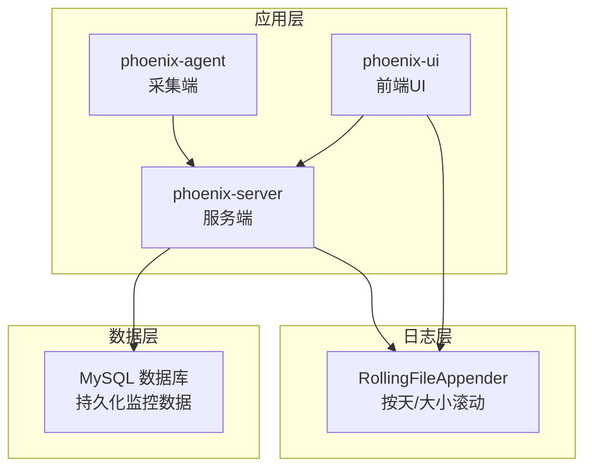
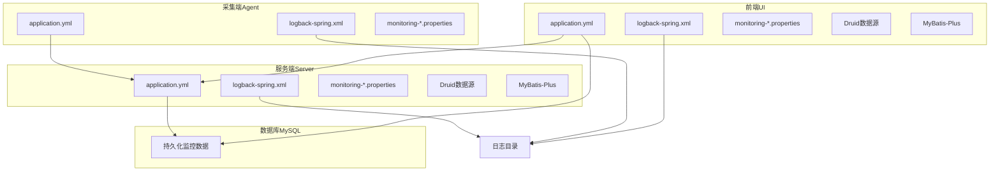
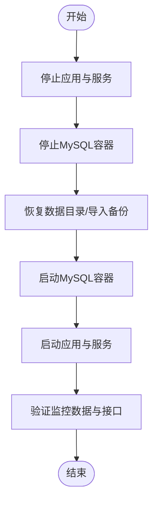
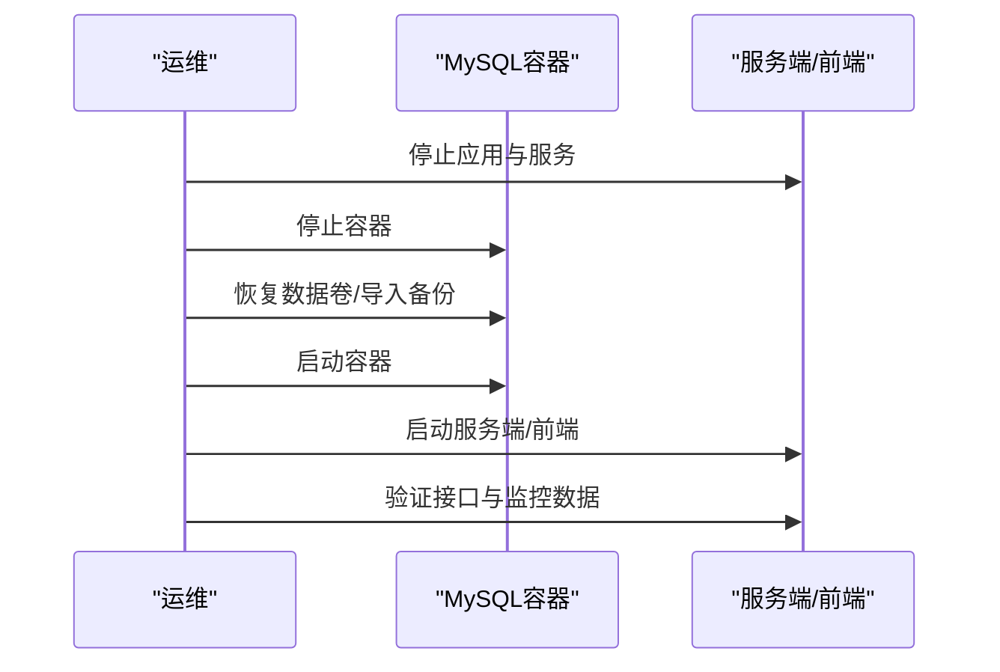
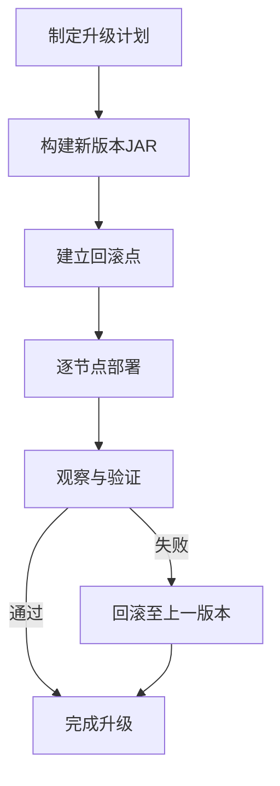
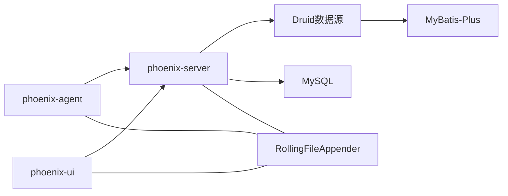

# 备份与恢复策略

<cite>
**本文引用的文件**
- [phoenix.sql](file://doc/数据库设计/sql/mysql/phoenix.sql)
- [application.yml（phoenix-server）](file://phoenix-server/src/main/resources/application.yml)
- [application.yml（phoenix-ui）](file://phoenix-ui/src/main/resources/application.yml)
- [application.yml（phoenix-agent）](file://phoenix-agent/src/main/resources/application.yml)
- [logback-spring.xml（phoenix-server）](file://phoenix-server/src/main/resources/logback-spring.xml)
- [logback-spring.xml（phoenix-ui）](file://phoenix-ui/src/main/resources/logback-spring.xml)
- [logback-spring.xml（phoenix-agent）](file://phoenix-agent/src/main/resources/logback-spring.xml)
- [run_container.1.2.6.RELEASE-CR5.sh（MySQL）](file://doc/Docker/mysql/run_container.1.2.6.RELEASE-CR5.sh)
- [auto_package.sh](file://doc/LinuxServices/auto_package.sh)
- [build_phoenix.sh](file://doc/LinuxServices/build_phoenix.sh)
- [utils.sh](file://doc/LinuxServices/utils.sh)
</cite>

## 目录
1. [简介](#简介)
2. [项目结构](#项目结构)
3. [核心组件](#核心组件)
4. [架构总览](#架构总览)
5. [详细组件分析](#详细组件分析)
6. [依赖关系分析](#依赖关系分析)
7. [性能考量](#性能考量)
8. [故障排查指南](#故障排查指南)
9. [结论](#结论)
10. [附录](#附录)

## 简介
本策略文档面向Phoenix监控系统，围绕“备份与恢复”目标，系统化梳理数据库、配置文件、日志文件、应用数据等多类数据的备份方法与频率，明确备份数据的存储与管理实践（加密、版本、容量优化、完整性校验），并提供灾难恢复流程（数据恢复步骤、系统重建流程、服务恢复顺序、业务连续性保障）、滚动升级与回滚策略（无感升级、失败回滚、数据一致性保障）、以及备份恢复测试与演练方案与最佳实践。

## 项目结构
Phoenix由三端组成：phoenix-agent（采集端）、phoenix-server（服务端）、phoenix-ui（前端UI）。系统通过MySQL存储监控数据，日志采用RollingFileAppender按天与大小滚动，Docker容器化部署MySQL数据卷挂载以持久化数据。

图表来源
- [application.yml（phoenix-server）:117-184](file://phoenix-server/src/main/resources/application.yml#L117-L184)
- [application.yml（phoenix-ui）:84-151](file://phoenix-ui/src/main/resources/application.yml#L84-L151)
- [application.yml（phoenix-agent）:31-56](file://phoenix-agent/src/main/resources/application.yml#L31-L56)
- [logback-spring.xml（phoenix-server）:24-47](file://phoenix-server/src/main/resources/logback-spring.xml#L24-L47)
- [logback-spring.xml（phoenix-ui）:24-47](file://phoenix-ui/src/main/resources/logback-spring.xml#L24-L47)
- [logback-spring.xml（phoenix-agent）:24-47](file://phoenix-agent/src/main/resources/logback-spring.xml#L24-L47)
- [run_container.1.2.6.RELEASE-CR5.sh（MySQL）:32-39](file://doc/Docker/mysql/run_container.1.2.6.RELEASE-CR5.sh#L32-L39)

章节来源
- [application.yml（phoenix-server）:117-184](file://phoenix-server/src/main/resources/application.yml#L117-L184)
- [application.yml（phoenix-ui）:84-151](file://phoenix-ui/src/main/resources/application.yml#L84-L151)
- [application.yml（phoenix-agent）:31-56](file://phoenix-agent/src/main/resources/application.yml#L31-L56)
- [logback-spring.xml（phoenix-server）:24-47](file://phoenix-server/src/main/resources/logback-spring.xml#L24-L47)
- [logback-spring.xml（phoenix-ui）:24-47](file://phoenix-ui/src/main/resources/logback-spring.xml#L24-L47)
- [logback-spring.xml（phoenix-agent）:24-47](file://phoenix-agent/src/main/resources/logback-spring.xml#L24-L47)
- [run_container.1.2.6.RELEASE-CR5.sh（MySQL）:32-39](file://doc/Docker/mysql/run_container.1.2.6.RELEASE-CR5.sh#L32-L39)

## 核心组件
- 数据库（MySQL）
  - 通过Docker容器部署，数据卷挂载至宿主机，实现持久化。
  - 服务端与UI端均配置Druid连接池与MyBatis-Plus，数据源集中管理。
- 日志（RollingFileAppender）
  - 三端均配置按天滚动与按大小限制，保留30天、上限1GB，避免日志无限膨胀。
- 配置文件（application.yml、logback-spring.xml、monitoring-*.properties）
  - 三端独立配置，便于隔离与差异化管理。
- 应用数据（JAR产物）
  - 通过自动化脚本构建并产出可执行JAR，便于打包与部署。

章节来源
- [application.yml（phoenix-server）:117-184](file://phoenix-server/src/main/resources/application.yml#L117-L184)
- [application.yml（phoenix-ui）:84-151](file://phoenix-ui/src/main/resources/application.yml#L84-L151)
- [application.yml（phoenix-agent）:31-56](file://phoenix-agent/src/main/resources/application.yml#L31-L56)
- [logback-spring.xml（phoenix-server）:24-47](file://phoenix-server/src/main/resources/logback-spring.xml#L24-L47)
- [logback-spring.xml（phoenix-ui）:24-47](file://phoenix-ui/src/main/resources/logback-spring.xml#L24-L47)
- [logback-spring.xml（phoenix-agent）:24-47](file://phoenix-agent/src/main/resources/logback-spring.xml#L24-L47)
- [run_container.1.2.6.RELEASE-CR5.sh（MySQL）:32-39](file://doc/Docker/mysql/run_container.1.2.6.RELEASE-CR5.sh#L32-L39)
- [auto_package.sh:1-24](file://doc/LinuxServices/auto_package.sh#L1-L24)
- [build_phoenix.sh:1-48](file://doc/LinuxServices/build_phoenix.sh#L1-L48)
- [utils.sh:162-222](file://doc/LinuxServices/utils.sh#L162-L222)

## 架构总览
Phoenix监控系统采用“采集-服务-前端”三层架构，数据经由服务端写入MySQL，日志落盘于各端RollingFileAppender目录，配置与构建脚本统一管理。

图表来源
- [application.yml（phoenix-server）:117-184](file://phoenix-server/src/main/resources/application.yml#L117-L184)
- [application.yml（phoenix-ui）:84-151](file://phoenix-ui/src/main/resources/application.yml#L84-L151)
- [application.yml（phoenix-agent）:31-56](file://phoenix-agent/src/main/resources/application.yml#L31-L56)
- [logback-spring.xml（phoenix-server）:24-47](file://phoenix-server/src/main/resources/logback-spring.xml#L24-L47)
- [logback-spring.xml（phoenix-ui）:24-47](file://phoenix-ui/src/main/resources/logback-spring.xml#L24-L47)
- [logback-spring.xml（phoenix-agent）:24-47](file://phoenix-agent/src/main/resources/logback-spring.xml#L24-L47)

## 详细组件分析

### 数据库备份策略
- 备份对象
  - MySQL容器数据卷：/data/phoenix/mysql/data
  - MySQL系统表与业务表：通过phoenix.sql定义的schema与数据
- 备份方法
  - 文件级快照/拷贝：直接复制宿主机上的MySQL数据目录
  - 逻辑备份：mysqldump导出schema与数据，支持增量与全量组合
  - 物理备份：xtrabackup/Percona XtraBackup（推荐，支持热备）
- 备份频率
  - 全量：每周一次
  - 增量/归档：每日一次（结合binlog）
- 存储与管理
  - 多地冗余：至少异地一份
  - 加密存储：传输与静态加密（建议AES-256）
  - 版本管理：按日期命名，保留N个周期
  - 容量优化：压缩归档、去重、冷热分层
  - 完整性校验：校验和/哈希校验，定期恢复演练
- 恢复流程
  - 停止服务端与UI端
  - 停止MySQL容器
  - 恢复数据目录或导入逻辑备份
  - 启动MySQL容器
  - 启动服务端与UI端，验证监控数据与接口可用性

图表来源
- [run_container.1.2.6.RELEASE-CR5.sh（MySQL）:25-41](file://doc/Docker/mysql/run_container.1.2.6.RELEASE-CR5.sh#L25-L41)
- [application.yml（phoenix-server）:117-184](file://phoenix-server/src/main/resources/application.yml#L117-L184)
- [application.yml（phoenix-ui）:84-151](file://phoenix-ui/src/main/resources/application.yml#L84-L151)

章节来源
- [phoenix.sql:1-1478](file://doc/数据库设计/sql/mysql/phoenix.sql#L1-L1478)
- [run_container.1.2.6.RELEASE-CR5.sh（MySQL）:32-39](file://doc/Docker/mysql/run_container.1.2.6.RELEASE-CR5.sh#L32-L39)
- [application.yml（phoenix-server）:117-184](file://phoenix-server/src/main/resources/application.yml#L117-L184)
- [application.yml（phoenix-ui）:84-151](file://phoenix-ui/src/main/resources/application.yml#L84-L151)

### 配置文件备份策略
- 备份对象
  - application.yml（三端）
  - logback-spring.xml（三端）
  - monitoring-*.properties（三端）
- 备份方法
  - 文件级备份：tar/zip归档
  - Git/SVN版本控制：建议将配置纳入版本库，区分分支与环境
- 备份频率
  - 变更即备份；每日全量校验
- 存储与管理
  - 分环境隔离（dev/prod）
  - 密钥与敏感信息脱敏或外部密管
  - 完整性校验与版本对比

章节来源
- [application.yml（phoenix-server）:1-271](file://phoenix-server/src/main/resources/application.yml#L1-L271)
- [application.yml（phoenix-ui）:1-238](file://phoenix-ui/src/main/resources/application.yml#L1-L238)
- [application.yml（phoenix-agent）:1-111](file://phoenix-agent/src/main/resources/application.yml#L1-L111)
- [logback-spring.xml（phoenix-server）:1-120](file://phoenix-server/src/main/resources/logback-spring.xml#L1-L120)
- [logback-spring.xml（phoenix-ui）:1-120](file://phoenix-ui/src/main/resources/logback-spring.xml#L1-L120)
- [logback-spring.xml（phoenix-agent）:1-120](file://phoenix-agent/src/main/resources/logback-spring.xml#L1-L120)

### 日志文件备份策略
- 备份对象
  - 三端RollingFileAppender输出目录
  - Undertow访问日志目录
- 备份方法
  - 归档压缩：按天/周归档
  - 近线存储：冷热分层
- 备份频率
  - 实时归档：当日日志次日归档
  - 周/月汇总：清理过期日志
- 存储与管理
  - 保留期限：按法规与审计要求设定（如1年）
  - 压缩与加密：减少占用与泄露风险
  - 完整性校验：校验和/哈希

章节来源
- [logback-spring.xml（phoenix-server）:24-47](file://phoenix-server/src/main/resources/logback-spring.xml#L24-L47)
- [logback-spring.xml（phoenix-ui）:24-47](file://phoenix-ui/src/main/resources/logback-spring.xml#L24-L47)
- [logback-spring.xml（phoenix-agent）:24-47](file://phoenix-agent/src/main/resources/logback-spring.xml#L24-L47)
- [application.yml（phoenix-server）:8-18](file://phoenix-server/src/main/resources/application.yml#L8-L18)
- [application.yml（phoenix-ui）:14-25](file://phoenix-ui/src/main/resources/application.yml#L14-L25)
- [application.yml（phoenix-agent）:6-16](file://phoenix-agent/src/main/resources/application.yml#L6-L16)

### 应用数据备份策略
- 备份对象
  - 可执行JAR（phoenix-server.jar、phoenix-ui.jar、phoenix-agent.jar）
  - 构建产物与依赖（Maven本地仓库）
- 备份方法
  - JAR归档：按版本号命名
  - 依赖镜像：Maven本地仓库快照
- 备份频率
  - 每次构建后归档
- 存储与管理
  - 版本化管理：SemVer或时间戳
  - 完整性校验：SHA256
  - 与配置文件联动备份

章节来源
- [build_phoenix.sh:35-47](file://doc/LinuxServices/build_phoenix.sh#L35-L47)
- [auto_package.sh:1-24](file://doc/LinuxServices/auto_package.sh#L1-L24)
- [utils.sh:162-222](file://doc/LinuxServices/utils.sh#L162-L222)

### 灾难恢复流程
- 数据恢复步骤
  - 评估故障范围与影响面
  - 停止应用与服务，防止写放大
  - 恢复MySQL数据卷或导入备份
  - 启动MySQL，确认连通性
  - 启动应用与服务，验证监控数据与接口
- 系统重建流程
  - 重新拉起MySQL容器并挂载数据卷
  - 部署最新版本JAR
  - 应用配置回放（application.yml、logback-spring.xml、monitoring-*.properties）
  - 初始化数据库（如需）
- 服务恢复顺序
  - MySQL → 服务端 → 前端UI
- 业务连续性保障
  - 预留备用节点与负载均衡
  - 快速回切与健康检查
  - 事件通告与值班机制

图表来源
- [run_container.1.2.6.RELEASE-CR5.sh（MySQL）:25-41](file://doc/Docker/mysql/run_container.1.2.6.RELEASE-CR5.sh#L25-L41)
- [application.yml（phoenix-server）:117-184](file://phoenix-server/src/main/resources/application.yml#L117-L184)
- [application.yml（phoenix-ui）:84-151](file://phoenix-ui/src/main/resources/application.yml#L84-L151)

章节来源
- [run_container.1.2.6.RELEASE-CR5.sh（MySQL）:32-39](file://doc/Docker/mysql/run_container.1.2.6.RELEASE-CR5.sh#L32-L39)
- [application.yml（phoenix-server）:117-184](file://phoenix-server/src/main/resources/application.yml#L117-L184)
- [application.yml（phoenix-ui）:84-151](file://phoenix-ui/src/main/resources/application.yml#L84-L151)

### 滚动升级与回滚策略
- 升级目标
  - 无感升级：灰度发布、蓝绿部署或滚动重启
- 升级步骤
  - 构建新版本JAR（见自动化脚本）
  - 回滚点：保留上一版本JAR与配置
  - 逐节点替换JAR并优雅重启
  - 观察指标与日志，确认稳定
- 回滚步骤
  - 停止新版本服务
  - 替换回上一版本JAR
  - 启动服务，验证
- 数据一致性保障
  - 升级窗口内避免DDL变更
  - 对接口幂等与事务边界进行评审
  - 关键路径增加重试与熔断

图表来源
- [build_phoenix.sh:1-48](file://doc/LinuxServices/build_phoenix.sh#L1-L48)
- [auto_package.sh:1-24](file://doc/LinuxServices/auto_package.sh#L1-L24)
- [utils.sh:162-222](file://doc/LinuxServices/utils.sh#L162-L222)

章节来源
- [build_phoenix.sh:1-48](file://doc/LinuxServices/build_phoenix.sh#L1-L48)
- [auto_package.sh:1-24](file://doc/LinuxServices/auto_package.sh#L1-L24)
- [utils.sh:162-222](file://doc/LinuxServices/utils.sh#L162-L222)

### 备份恢复测试与演练
- 测试计划
  - 季度级全量演练：数据库+配置+日志
  - 月度级增量演练：数据库增量+配置
  - 每次升级后进行回滚演练
- 测试用例
  - 全量恢复：从备份恢复到全新环境
  - 增量恢复：基于binlog的点恢复
  - 回滚演练：验证回滚点有效性
  - 性能回归：对比恢复前后性能指标
- 执行与记录
  - 记录恢复时间（RTO/RPO）
  - 问题清单与改进项
  - 更新应急预案与操作手册

章节来源
- [phoenix.sql:1-1478](file://doc/数据库设计/sql/mysql/phoenix.sql#L1-L1478)
- [run_container.1.2.6.RELEASE-CR5.sh（MySQL）:32-39](file://doc/Docker/mysql/run_container.1.2.6.RELEASE-CR5.sh#L32-L39)

### 最佳实践与注意事项
- 备份策略制定
  - 明确RPO/RTO目标，分级备份
  - 统一命名与标签，便于检索
- 备份监控
  - 备份任务健康检查与告警
  - 定期校验与抽样恢复
- 恢复测试
  - 模拟真实故障场景
  - 多团队协同演练
- 应急响应
  - 事件分级与处置流程
  - 人员职责与联系方式
- 安全与合规
  - 敏感配置脱敏
  - 备份介质加密与权限控制
  - 审计日志与合规留痕

## 依赖关系分析
- 组件耦合
  - 服务端与UI端共享数据库，依赖一致的数据源配置
  - 采集端通过网络向服务端上报数据
- 外部依赖
  - MySQL容器化部署，数据卷持久化
  - Druid连接池与MyBatis-Plus作为ORM基础设施
- 潜在风险
  - 数据库单点：建议主从或集群
  - 配置漂移：建议版本化管理
  - 日志膨胀：严格滚动与保留策略

图表来源
- [application.yml（phoenix-server）:117-184](file://phoenix-server/src/main/resources/application.yml#L117-L184)
- [application.yml（phoenix-ui）:84-151](file://phoenix-ui/src/main/resources/application.yml#L84-L151)
- [application.yml（phoenix-agent）:31-56](file://phoenix-agent/src/main/resources/application.yml#L31-L56)
- [logback-spring.xml（phoenix-server）:24-47](file://phoenix-server/src/main/resources/logback-spring.xml#L24-L47)
- [logback-spring.xml（phoenix-ui）:24-47](file://phoenix-ui/src/main/resources/logback-spring.xml#L24-L47)
- [logback-spring.xml（phoenix-agent）:24-47](file://phoenix-agent/src/main/resources/logback-spring.xml#L24-L47)

章节来源
- [application.yml（phoenix-server）:117-184](file://phoenix-server/src/main/resources/application.yml#L117-L184)
- [application.yml（phoenix-ui）:84-151](file://phoenix-ui/src/main/resources/application.yml#L84-L151)
- [application.yml（phoenix-agent）:31-56](file://phoenix-agent/src/main/resources/application.yml#L31-L56)
- [logback-spring.xml（phoenix-server）:24-47](file://phoenix-server/src/main/resources/logback-spring.xml#L24-L47)
- [logback-spring.xml（phoenix-ui）:24-47](file://phoenix-ui/src/main/resources/logback-spring.xml#L24-L47)
- [logback-spring.xml（phoenix-agent）:24-47](file://phoenix-agent/src/main/resources/logback-spring.xml#L24-L47)

## 性能考量
- 备份性能
  - 并行备份与增量备份，避免业务高峰期
  - 使用压缩与去重，降低IO与带宽压力
- 恢复性能
  - 多副本与就近恢复，缩短RTO
  - 预热与预加载，加速恢复后启动
- 日志性能
  - 合理的滚动策略与保留上限，避免磁盘打满
  - 异步写入与缓冲，降低延迟

## 故障排查指南
- 数据库异常
  - 检查MySQL容器状态与数据卷挂载
  - 查看错误日志与慢查询日志
- 应用无法连接数据库
  - 校验application.yml中的数据源配置
  - 检查Druid连接池状态与健康检查端点
- 日志异常
  - 检查RollingFileAppender配置与磁盘配额
  - 核对日志级别与过滤器设置

章节来源
- [application.yml（phoenix-server）:117-184](file://phoenix-server/src/main/resources/application.yml#L117-L184)
- [application.yml（phoenix-ui）:84-151](file://phoenix-ui/src/main/resources/application.yml#L84-L151)
- [logback-spring.xml（phoenix-server）:24-47](file://phoenix-server/src/main/resources/logback-spring.xml#L24-L47)
- [logback-spring.xml（phoenix-ui）:24-47](file://phoenix-ui/src/main/resources/logback-spring.xml#L24-L47)

## 结论
通过文件级快照、逻辑/物理备份相结合，配合严格的版本与加密管理、容量优化与完整性校验，Phoenix监控系统可实现高可靠的备份与快速恢复。结合滚动升级与回滚策略、定期演练与应急响应机制，可最大化保障业务连续性与数据安全。

## 附录
- 关键配置位置参考
  - 数据库连接与Druid配置：[application.yml（phoenix-server）:117-184](file://phoenix-server/src/main/resources/application.yml#L117-L184)、[application.yml（phoenix-ui）:84-151](file://phoenix-ui/src/main/resources/application.yml#L84-L151)
  - 日志滚动策略：[logback-spring.xml（phoenix-server）:24-47](file://phoenix-server/src/main/resources/logback-spring.xml#L24-L47)、[logback-spring.xml（phoenix-ui）:24-47](file://phoenix-ui/src/main/resources/logback-spring.xml#L24-L47)、[logback-spring.xml（phoenix-agent）:24-47](file://phoenix-agent/src/main/resources/logback-spring.xml#L24-L47)
  - MySQL容器与数据卷：[run_container.1.2.6.RELEASE-CR5.sh（MySQL）:32-39](file://doc/Docker/mysql/run_container.1.2.6.RELEASE-CR5.sh#L32-L39)
  - 构建与打包：[auto_package.sh:1-24](file://doc/LinuxServices/auto_package.sh#L1-L24)、[build_phoenix.sh:1-48](file://doc/LinuxServices/build_phoenix.sh#L1-L48)、[utils.sh:162-222](file://doc/LinuxServices/utils.sh#L162-L222)