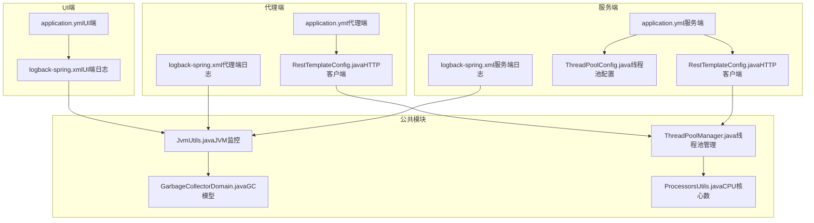
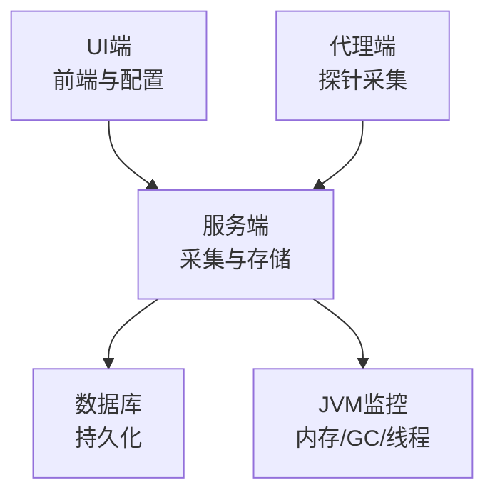
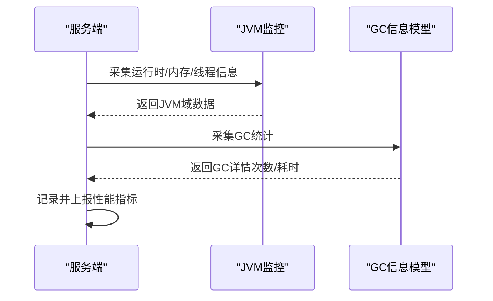
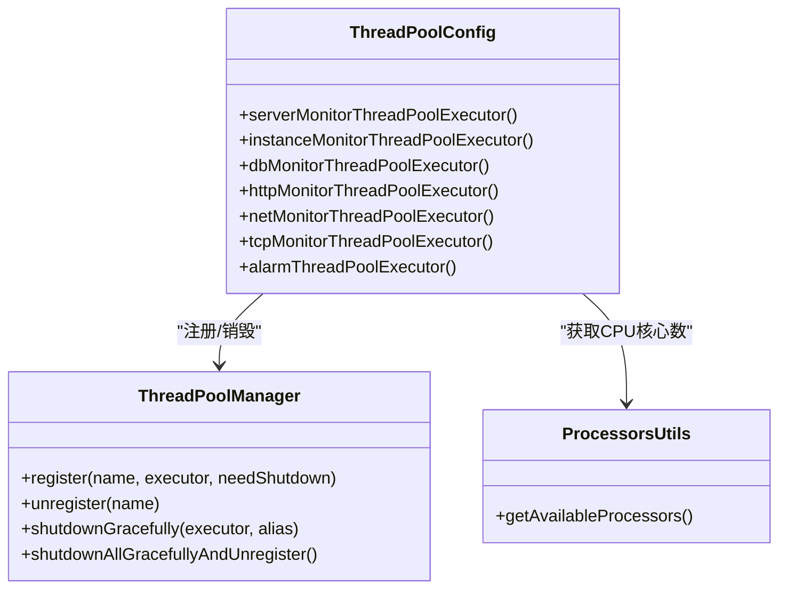
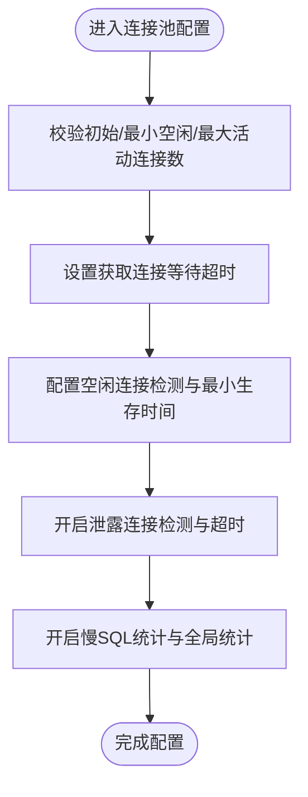
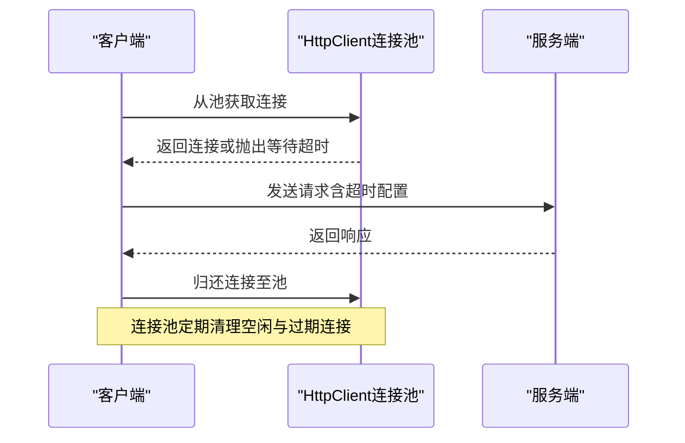
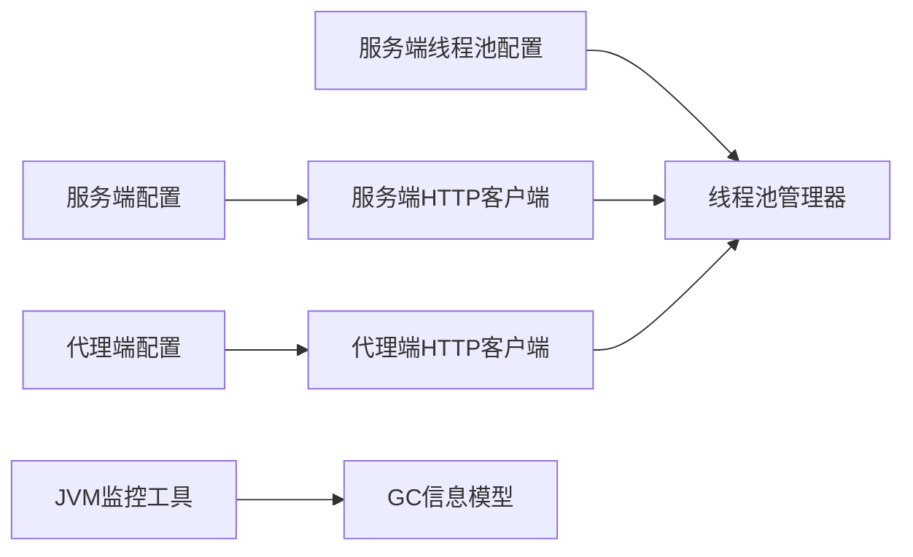

# 性能优化指南

<cite>
**本文引用的文件**
- [application.yml（服务端）](file://phoenix-server/src/main/resources/application.yml)
- [application.yml（代理端）](file://phoenix-agent/src/main/resources/application.yml)
- [application.yml（UI端）](file://phoenix-ui/src/main/resources/application.yml)
- [ThreadPoolConfig.java（服务端线程池配置）](file://phoenix-server/src/main/java/com/gitee/pifeng/monitoring/server/config/ThreadPoolConfig.java)
- [ThreadPoolManager.java（线程池管理器）](file://phoenix-common/phoenix-common-core/src/main/java/com/gitee/pifeng/monitoring/common/threadpool/ThreadPoolManager.java)
- [ProcessorsUtils.java（处理器核心数工具）](file://phoenix-common/phoenix-common-core/src/main/java/com/gitee/pifeng/monitoring/common/util/server/ProcessorsUtils.java)
- [logback-spring.xml（服务端日志）](file://phoenix-server/src/main/resources/logback-spring.xml)
- [logback-spring.xml（代理端日志）](file://phoenix-agent/src/main/resources/logback-spring.xml)
- [logback-spring.xml（UI端日志）](file://phoenix-ui/src/main/resources/logback-spring.xml)
- [RestTemplateConfig.java（服务端HTTP客户端配置）](file://phoenix-server/src/main/java/com/gitee/pifeng/monitoring/server/config/RestTemplateConfig.java)
- [RestTemplateConfig.java（代理端HTTP客户端配置）](file://phoenix-agent/src/main/java/com/gitee/pifeng/monitoring/agent/config/RestTemplateConfig.java)
- [EnumPoolingHttpClient.java（客户端HTTP连接池配置）](file://phoenix-client/phoenix-client-core/src/main/java/com/gitee/pifeng/monitoring/plug/core/EnumPoolingHttpClient.java)
- [JvmUtils.java（JVM监控工具）](file://phoenix-common/phoenix-common-core/src/main/java/com/gitee/pifeng/monitoring/common/util/jvm/JvmUtils.java)
- [GarbageCollectorDomain.java（GC信息模型）](file://phoenix-common/phoenix-common-core/src/main/java/com/gitee/pifeng/monitoring/common/domain/jvm/GarbageCollectorDomain.java)
</cite>

## 目录
1. [简介](#简介)
2. [项目结构](#项目结构)
3. [核心组件](#核心组件)
4. [架构总览](#架构总览)
5. [详细组件分析](#详细组件分析)
6. [依赖分析](#依赖分析)
7. [性能考量](#性能考量)
8. [故障排查指南](#故障排查指南)
9. [结论](#结论)
10. [附录](#附录)

## 简介
本指南面向Phoenix监控系统，围绕JVM参数调优、数据库连接池优化、缓存策略优化、网络连接优化、监控指标分析与性能瓶颈定位、以及性能测试与基准测试方法，提供可落地的优化建议与最佳实践。内容基于仓库现有配置与实现，结合代码级分析，帮助读者在不同环境与负载条件下稳定提升系统性能。

## 项目结构
Phoenix采用多模块分层架构，包含服务端、代理端、UI端与公共组件。各模块均通过Spring Boot配置文件集中管理运行参数，公共模块提供线程池、日志、JVM监控等通用能力。

图表来源
- [application.yml（服务端）:1-271](file://phoenix-server/src/main/resources/application.yml#L1-L271)
- [application.yml（代理端）:1-111](file://phoenix-agent/src/main/resources/application.yml#L1-L111)
- [application.yml（UI端）:1-238](file://phoenix-ui/src/main/resources/application.yml#L1-L238)
- [ThreadPoolConfig.java（服务端线程池配置）:1-211](file://phoenix-server/src/main/java/com/gitee/pifeng/monitoring/server/config/ThreadPoolConfig.java#L1-L211)
- [ThreadPoolManager.java（线程池管理器）:1-131](file://phoenix-common/phoenix-common-core/src/main/java/com/gitee/pifeng/monitoring/common/threadpool/ThreadPoolManager.java#L1-L131)
- [ProcessorsUtils.java（处理器核心数工具）:1-38](file://phoenix-common/phoenix-common-core/src/main/java/com/gitee/pifeng/monitoring/common/util/server/ProcessorsUtils.java#L1-L38)
- [logback-spring.xml（服务端日志）:1-120](file://phoenix-server/src/main/resources/logback-spring.xml#L1-L120)
- [logback-spring.xml（代理端日志）:1-120](file://phoenix-agent/src/main/resources/logback-spring.xml#L1-L120)
- [logback-spring.xml（UI端日志）:1-120](file://phoenix-ui/src/main/resources/logback-spring.xml#L1-L120)
- [RestTemplateConfig.java（服务端HTTP客户端配置）:95-116](file://phoenix-server/src/main/java/com/gitee/pifeng/monitoring/server/config/RestTemplateConfig.java#L95-L116)
- [RestTemplateConfig.java（代理端HTTP客户端配置）:98-138](file://phoenix-agent/src/main/java/com/gitee/pifeng/monitoring/agent/config/RestTemplateConfig.java#L98-L138)
- [EnumPoolingHttpClient.java（客户端HTTP连接池配置）:139-177](file://phoenix-client/phoenix-client-core/src/main/java/com/gitee/pifeng/monitoring/plug/core/EnumPoolingHttpClient.java#L139-L177)
- [JvmUtils.java（JVM监控工具）:1-235](file://phoenix-common/phoenix-common-core/src/main/java/com/gitee/pifeng/monitoring/common/util/jvm/JvmUtils.java#L1-L235)
- [GarbageCollectorDomain.java（GC信息模型）:1-66](file://phoenix-common/phoenix-common-core/src/main/java/com/gitee/pifeng/monitoring/common/domain/jvm/GarbageCollectorDomain.java#L1-L66)

章节来源
- [application.yml（服务端）:1-271](file://phoenix-server/src/main/resources/application.yml#L1-L271)
- [application.yml（代理端）:1-111](file://phoenix-agent/src/main/resources/application.yml#L1-L111)
- [application.yml（UI端）:1-238](file://phoenix-ui/src/main/resources/application.yml#L1-L238)

## 核心组件
- 线程池体系：服务端通过配置类按监控类型划分专用线程池，统一由管理器负责注册与优雅关闭。
- 日志系统：三端均采用RollingFileAppender配合按级别过滤，兼顾性能与可观测性。
- HTTP客户端：服务端与代理端均使用Apache HttpClient连接池，统一超时与连接限制。
- JVM监控：公共模块提供JVM运行时、内存、GC等采集能力，支撑性能分析与告警。

章节来源
- [ThreadPoolConfig.java（服务端线程池配置）:1-211](file://phoenix-server/src/main/java/com/gitee/pifeng/monitoring/server/config/ThreadPoolConfig.java#L1-L211)
- [ThreadPoolManager.java（线程池管理器）:1-131](file://phoenix-common/phoenix-common-core/src/main/java/com/gitee/pifeng/monitoring/common/threadpool/ThreadPoolManager.java#L1-L131)
- [logback-spring.xml（服务端日志）:1-120](file://phoenix-server/src/main/resources/logback-spring.xml#L1-L120)
- [RestTemplateConfig.java（服务端HTTP客户端配置）:95-116](file://phoenix-server/src/main/java/com/gitee/pifeng/monitoring/server/config/RestTemplateConfig.java#L95-L116)
- [RestTemplateConfig.java（代理端HTTP客户端配置）:98-138](file://phoenix-agent/src/main/java/com/gitee/pifeng/monitoring/agent/config/RestTemplateConfig.java#L98-L138)
- [JvmUtils.java（JVM监控工具）:1-235](file://phoenix-common/phoenix-common-core/src/main/java/com/gitee/pifeng/monitoring/common/util/jvm/JvmUtils.java#L1-L235)

## 架构总览
Phoenix由服务端、代理端、UI端组成，服务端负责采集与存储、代理端负责被监控端的探针采集、UI端提供可视化与配置入口。公共模块提供线程池、日志、JVM监控等通用能力。

图表来源
- [application.yml（服务端）:1-271](file://phoenix-server/src/main/resources/application.yml#L1-L271)
- [application.yml（代理端）:1-111](file://phoenix-agent/src/main/resources/application.yml#L1-L111)
- [application.yml（UI端）:1-238](file://phoenix-ui/src/main/resources/application.yml#L1-L238)
- [JvmUtils.java（JVM监控工具）:1-235](file://phoenix-common/phoenix-common-core/src/main/java/com/gitee/pifeng/monitoring/common/util/jvm/JvmUtils.java#L1-L235)

## 详细组件分析

### JVM参数与GC优化
- 当前配置要点
  - 服务端、代理端、UI端均关闭JMX以减少开销。
  - 日志系统采用RollingFileAppender，按级别分离文件，避免I/O竞争。
  - 公共模块提供JVM运行时、内存、GC采集能力，便于性能观测。
- 优化建议
  - 明确堆/非堆比例与代际分布，结合GC日志与指标设定初始与最大堆大小。
  - 选择合适的GC算法（如G1/Parallel），并调整新生代/老年代比例与晋升阈值。
  - 关注Full GC频率与时长，必要时缩短晋升年龄或优化对象生命周期。
  - 结合JVM监控接口定期采集GC统计，建立阈值告警与趋势分析。

图表来源
- [JvmUtils.java（JVM监控工具）:1-235](file://phoenix-common/phoenix-common-core/src/main/java/com/gitee/pifeng/monitoring/common/util/jvm/JvmUtils.java#L1-L235)
- [GarbageCollectorDomain.java（GC信息模型）:1-66](file://phoenix-common/phoenix-common-core/src/main/java/com/gitee/pifeng/monitoring/common/domain/jvm/GarbageCollectorDomain.java#L1-L66)

章节来源
- [application.yml（服务端）:35-37](file://phoenix-server/src/main/resources/application.yml#L35-L37)
- [application.yml（代理端）:33-35](file://phoenix-agent/src/main/resources/application.yml#L33-L35)
- [application.yml（UI端）:42-44](file://phoenix-ui/src/main/resources/application.yml#L42-L44)
- [logback-spring.xml（服务端日志）:1-120](file://phoenix-server/src/main/resources/logback-spring.xml#L1-L120)
- [JvmUtils.java（JVM监控工具）:1-235](file://phoenix-common/phoenix-common-core/src/main/java/com/gitee/pifeng/monitoring/common/util/jvm/JvmUtils.java#L1-L235)
- [GarbageCollectorDomain.java（GC信息模型）:1-66](file://phoenix-common/phoenix-common-core/src/main/java/com/gitee/pifeng/monitoring/common/domain/jvm/GarbageCollectorDomain.java#L1-L66)

### 线程池配置与管理
- 当前配置要点
  - 服务端按监控类型划分专用线程池，核心线程数与最大线程数相等，队列容量为最大值，拒绝策略为AbortPolicy。
  - 线程命名规范明确，守护线程，便于问题定位。
  - 管理器支持注册/注销与优雅关闭，确保停机时资源释放。
- 优化建议
  - IO密集场景下，适当增大核心线程数并结合队列长度与拒绝策略。
  - 对高优先级任务（如心跳）单独隔离线程池，避免相互影响。
  - 结合CPU核心数与阻塞系数动态计算线程数，避免过度上下文切换。

图表来源
- [ThreadPoolConfig.java（服务端线程池配置）:1-211](file://phoenix-server/src/main/java/com/gitee/pifeng/monitoring/server/config/ThreadPoolConfig.java#L1-L211)
- [ThreadPoolManager.java（线程池管理器）:1-131](file://phoenix-common/phoenix-common-core/src/main/java/com/gitee/pifeng/monitoring/common/threadpool/ThreadPoolManager.java#L1-L131)
- [ProcessorsUtils.java（处理器核心数工具）:1-38](file://phoenix-common/phoenix-common-core/src/main/java/com/gitee/pifeng/monitoring/common/util/server/ProcessorsUtils.java#L1-L38)

章节来源
- [ThreadPoolConfig.java（服务端线程池配置）:1-211](file://phoenix-server/src/main/java/com/gitee/pifeng/monitoring/server/config/ThreadPoolConfig.java#L1-L211)
- [ThreadPoolManager.java（线程池管理器）:1-131](file://phoenix-common/phoenix-common-core/src/main/java/com/gitee/pifeng/monitoring/common/threadpool/ThreadPoolManager.java#L1-L131)
- [ProcessorsUtils.java（处理器核心数工具）:1-38](file://phoenix-common/phoenix-common-core/src/main/java/com/gitee/pifeng/monitoring/common/util/server/ProcessorsUtils.java#L1-L38)

### 数据库连接池优化
- 当前配置要点
  - 服务端与UI端均使用Druid连接池，初始/最小空闲/最大活动连接数、等待超时、空闲检测周期、移除泄露连接等参数均已配置。
  - 启用慢SQL统计与全局数据源统计，便于定位热点SQL。
- 优化建议
  - 根据峰值QPS与平均响应时间估算最大连接数，避免连接池耗尽导致排队。
  - 开启连接泄露检测并设置合理超时，结合慢SQL日志优化执行计划。
  - 分库分表场景下，按库维度拆分连接池，避免单池过大引发锁竞争。

图表来源
- [application.yml（服务端）:117-184](file://phoenix-server/src/main/resources/application.yml#L117-L184)
- [application.yml（UI端）:85-152](file://phoenix-ui/src/main/resources/application.yml#L85-L152)

章节来源
- [application.yml（服务端）:117-184](file://phoenix-server/src/main/resources/application.yml#L117-L184)
- [application.yml（UI端）:85-152](file://phoenix-ui/src/main/resources/application.yml#L85-L152)

### 缓存策略优化
- 当前配置要点
  - 服务端、UI端均使用Caffeine本地缓存，设置最大条数与访问过期时间。
- 优化建议
  - 本地缓存：结合热点数据特征设置命中率目标，避免过大导致内存抖动。
  - 分布式缓存：根据读写比与一致性需求选择合适协议与序列化，开启批量读取与预热。
  - 失效策略：采用LRU/Expire结合，热点Key设置短过期或双写保障一致性。
  - 预热：启动阶段批量加载热点数据，降低首屏延迟。

章节来源
- [application.yml（服务端）:39-43](file://phoenix-server/src/main/resources/application.yml#L39-L43)
- [application.yml（UI端）:46-50](file://phoenix-ui/src/main/resources/application.yml#L46-L50)

### 网络连接优化
- 当前配置要点
  - 服务端与代理端均使用Apache HttpClient连接池，统一设置最大连接数、每路由最大连接、验证不活跃连接、超时参数。
  - 客户端同样采用池化连接管理器，超时参数来自配置加载器。
- 优化建议
  - 连接复用：合理设置MaxTotal与DefaultMaxPerRoute，避免连接池过小导致排队。
  - 超时配置：区分连接超时、等待数据超时与从池获取连接超时，结合业务特性调优。
  - 负载均衡：在网关或反向代理层启用健康检查与权重轮询，避免单点过载。
  - SSL优化：启用ALPN与TLS1.3，复用握手参数，减少握手开销。

图表来源
- [RestTemplateConfig.java（服务端HTTP客户端配置）:95-116](file://phoenix-server/src/main/java/com/gitee/pifeng/monitoring/server/config/RestTemplateConfig.java#L95-L116)
- [RestTemplateConfig.java（代理端HTTP客户端配置）:98-138](file://phoenix-agent/src/main/java/com/gitee/pifeng/monitoring/agent/config/RestTemplateConfig.java#L98-L138)
- [EnumPoolingHttpClient.java（客户端HTTP连接池配置）:139-177](file://phoenix-client/phoenix-client-core/src/main/java/com/gitee/pifeng/monitoring/plug/core/EnumPoolingHttpClient.java#L139-L177)

章节来源
- [RestTemplateConfig.java（服务端HTTP客户端配置）:95-116](file://phoenix-server/src/main/java/com/gitee/pifeng/monitoring/server/config/RestTemplateConfig.java#L95-L116)
- [RestTemplateConfig.java（代理端HTTP客户端配置）:98-138](file://phoenix-agent/src/main/java/com/gitee/pifeng/monitoring/agent/config/RestTemplateConfig.java#L98-L138)
- [EnumPoolingHttpClient.java（客户端HTTP连接池配置）:139-177](file://phoenix-client/phoenix-client-core/src/main/java/com/gitee/pifeng/monitoring/plug/core/EnumPoolingHttpClient.java#L139-L177)

### 监控指标分析与性能瓶颈识别
- 指标采集
  - JVM：运行时、内存、GC、线程等指标，结合日志与端点暴露。
  - 数据库：连接池活跃数、等待时间、慢SQL、连接泄露等。
  - 网络：连接池使用率、超时次数、重试次数、失败率。
- 瓶颈识别
  - CPU瓶颈：线程池饱和、GC频繁或长时间停顿。
  - I/O瓶颈：数据库等待、网络超时、磁盘IO。
  - 内存瓶颈：堆外溢出、对象逃逸、Full GC。
- 建议
  - 建立指标看板与阈值告警，结合趋势与基线识别异常。
  - 使用火焰图与GC日志定位热点方法与对象分配。

章节来源
- [logback-spring.xml（服务端日志）:1-120](file://phoenix-server/src/main/resources/logback-spring.xml#L1-L120)
- [logback-spring.xml（代理端日志）:1-120](file://phoenix-agent/src/main/resources/logback-spring.xml#L1-L120)
- [logback-spring.xml（UI端日志）:1-120](file://phoenix-ui/src/main/resources/logback-spring.xml#L1-L120)
- [JvmUtils.java（JVM监控工具）:1-235](file://phoenix-common/phoenix-common-core/src/main/java/com/gitee/pifeng/monitoring/common/util/jvm/JvmUtils.java#L1-L235)

### 性能测试与基准测试
- 压力测试
  - 使用压测工具模拟并发请求，逐步提升并发度与吞吐，观察响应时间与错误率拐点。
- 负载测试
  - 在稳定状态下持续运行，监测CPU、内存、GC、数据库连接池与网络连接池的稳定性。
- 容量规划
  - 基于峰值QPS与SLA，计算线程池、连接池与缓存容量，预留安全余量。
- 基准测试
  - 固定场景对比不同参数组合下的吞吐与延迟，形成参数调优基线。

## 依赖分析
- 组件耦合
  - 服务端线程池配置与管理器强关联，确保生命周期可控。
  - HTTP客户端配置在服务端与代理端保持一致，便于横向对比。
  - JVM监控工具独立于业务，提供统一数据模型供上层消费。
- 外部依赖
  - Druid连接池、Apache HttpClient、Caffeine缓存、Logback日志等均为常用高性能组件。

图表来源
- [ThreadPoolConfig.java（服务端线程池配置）:1-211](file://phoenix-server/src/main/java/com/gitee/pifeng/monitoring/server/config/ThreadPoolConfig.java#L1-L211)
- [ThreadPoolManager.java（线程池管理器）:1-131](file://phoenix-common/phoenix-common-core/src/main/java/com/gitee/pifeng/monitoring/common/threadpool/ThreadPoolManager.java#L1-L131)
- [RestTemplateConfig.java（服务端HTTP客户端配置）:95-116](file://phoenix-server/src/main/java/com/gitee/pifeng/monitoring/server/config/RestTemplateConfig.java#L95-L116)
- [RestTemplateConfig.java（代理端HTTP客户端配置）:98-138](file://phoenix-agent/src/main/java/com/gitee/pifeng/monitoring/agent/config/RestTemplateConfig.java#L98-L138)
- [JvmUtils.java（JVM监控工具）:1-235](file://phoenix-common/phoenix-common-core/src/main/java/com/gitee/pifeng/monitoring/common/util/jvm/JvmUtils.java#L1-L235)
- [GarbageCollectorDomain.java（GC信息模型）:1-66](file://phoenix-common/phoenix-common-core/src/main/java/com/gitee/pifeng/monitoring/common/domain/jvm/GarbageCollectorDomain.java#L1-L66)

章节来源
- [ThreadPoolConfig.java（服务端线程池配置）:1-211](file://phoenix-server/src/main/java/com/gitee/pifeng/monitoring/server/config/ThreadPoolConfig.java#L1-L211)
- [ThreadPoolManager.java（线程池管理器）:1-131](file://phoenix-common/phoenix-common-core/src/main/java/com/gitee/pifeng/monitoring/common/threadpool/ThreadPoolManager.java#L1-L131)
- [RestTemplateConfig.java（服务端HTTP客户端配置）:95-116](file://phoenix-server/src/main/java/com/gitee/pifeng/monitoring/server/config/RestTemplateConfig.java#L95-L116)
- [RestTemplateConfig.java（代理端HTTP客户端配置）:98-138](file://phoenix-agent/src/main/java/com/gitee/pifeng/monitoring/agent/config/RestTemplateConfig.java#L98-L138)
- [JvmUtils.java（JVM监控工具）:1-235](file://phoenix-common/phoenix-common-core/src/main/java/com/gitee/pifeng/monitoring/common/util/jvm/JvmUtils.java#L1-L235)
- [GarbageCollectorDomain.java（GC信息模型）:1-66](file://phoenix-common/phoenix-common-core/src/main/java/com/gitee/pifeng/monitoring/common/domain/jvm/GarbageCollectorDomain.java#L1-L66)

## 性能考量
- JVM层面：关注GC停顿与吞吐平衡，结合业务特征选择合适GC策略与参数。
- 线程池层面：避免线程过多导致上下文切换，亦避免过少导致排队。
- 数据库层面：连接池大小与SQL优化并重，减少慢查询与锁争用。
- 缓存层面：热点数据本地化与分布式缓存协同，失效与预热策略需与业务节奏匹配。
- 网络层面：连接池与超时参数需与业务SLA一致，避免拥塞与雪崩。

## 故障排查指南
- 线程池问题
  - 现象：任务堆积、拒绝异常、停机无法关闭。
  - 排查：检查线程池注册状态、拒绝策略、优雅关闭流程。
- 数据库连接池问题
  - 现象：连接池耗尽、获取连接超时、慢SQL增多。
  - 排查：核对最大连接数、等待超时、空闲检测与泄露检测配置。
- 网络连接问题
  - 现象：连接池等待、超时、重试频繁。
  - 排查：确认连接池大小、每路由上限、超时参数与DNS解析策略。
- 日志与监控
  - 现象：日志过大、级别不当、指标缺失。
  - 排查：检查Rolling策略、级别过滤与端点暴露配置。

章节来源
- [ThreadPoolManager.java（线程池管理器）:1-131](file://phoenix-common/phoenix-common-core/src/main/java/com/gitee/pifeng/monitoring/common/threadpool/ThreadPoolManager.java#L1-L131)
- [application.yml（服务端）:117-184](file://phoenix-server/src/main/resources/application.yml#L117-L184)
- [application.yml（代理端）:1-111](file://phoenix-agent/src/main/resources/application.yml#L1-L111)
- [application.yml（UI端）:85-152](file://phoenix-ui/src/main/resources/application.yml#L85-L152)
- [logback-spring.xml（服务端日志）:1-120](file://phoenix-server/src/main/resources/logback-spring.xml#L1-L120)
- [logback-spring.xml（代理端日志）:1-120](file://phoenix-agent/src/main/resources/logback-spring.xml#L1-L120)
- [logback-spring.xml（UI端日志）:1-120](file://phoenix-ui/src/main/resources/logback-spring.xml#L1-L120)

## 结论
Phoenix监控系统在配置层面已具备良好的性能基础：线程池隔离、连接池参数化、本地缓存与日志分级、JVM监控能力等。结合本文提供的JVM参数调优、数据库连接池优化、缓存策略、网络优化、监控指标分析与性能测试方法，可在不同业务场景下进一步提升系统稳定性与吞吐表现。

## 附录
- 参数建议速查
  - 线程池：核心线程数≈CPU核心数/(1-阻塞系数)，队列长度适配峰值瞬时。
  - 连接池：最大连接数≥并发峰值×平均响应时间/平均连接存活时间。
  - 缓存：命中率目标≥90%，过期策略与预热结合业务冷热分布。
  - 网络：连接超时<SLA，等待数据超时≥网络RTT×2，每路由上限≥池总量/路由数。
  - JVM：GC停顿<SLA，Full GC频次≤N次/小时，堆外内存可控。